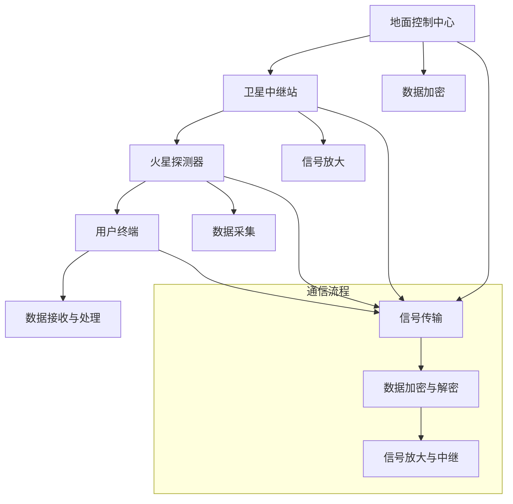
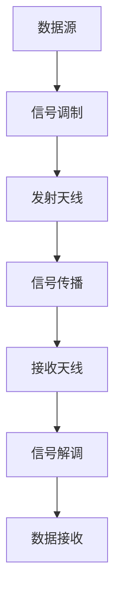
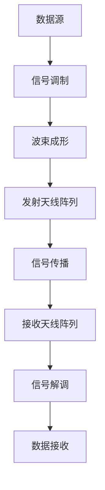
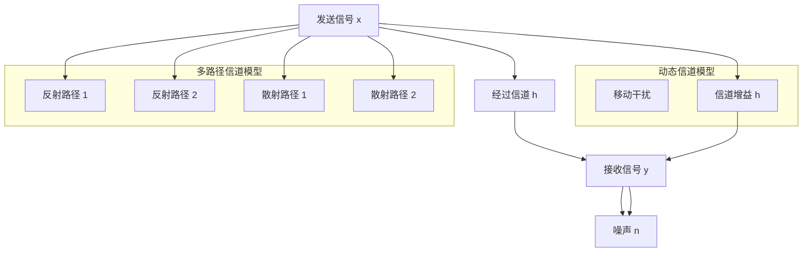
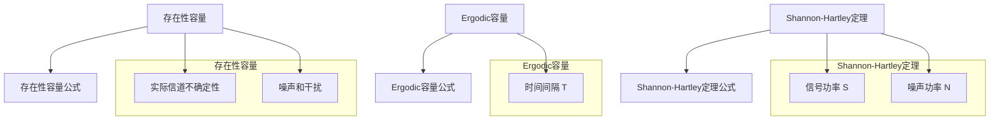
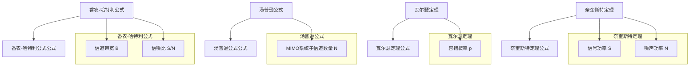

                 


### 6G技术概述

6G（第六代移动通信技术）是下一代移动通信技术，预计将在2020年代后期到2030年代初期推出。相较于前几代移动通信技术，6G在多个方面都有了显著的提升，尤其是在频谱效率、传输速度、网络延迟和连接数量等方面。

**频谱效率**：6G技术将采用更高效的频谱利用方式，通过利用更高频率的毫米波频段，以及多输入多输出（MIMO）技术，实现更高的数据传输速率。

**传输速度**：6G的目标是将峰值数据传输速度提升到1Tbps（千兆bps），这是当前5G网络的百倍以上。

**网络延迟**：6G将致力于实现超低延迟通信，目标是将端到端的通信延迟降低到1毫秒以下，这将极大地提升实时应用场景的体验。

**连接数量**：6G预计将支持每平方米高达100万设备的连接，这将使得物联网（IoT）应用得到极大的扩展。

**核心技术**：
- **毫米波通信**：毫米波频段（30GHz-300GHz）具有极高的频宽和带宽，但传播距离较短。因此，6G技术需要采用先进的波束成形技术来提高传输效率和覆盖范围。
- **波束成形技术**：通过调整天线阵列的相位和幅度，将电磁波的辐射方向对准用户，从而提高信号强度和传输效率。
- **人工智能**：6G将充分利用人工智能技术，通过机器学习算法优化网络资源分配、提高网络效率和降低延迟。
- **边缘计算**：6G将采用边缘计算技术，将计算任务从云端转移到网络边缘，从而降低延迟，提升实时处理能力。

在接下来的章节中，我们将进一步探讨6G技术在这些核心技术方面的具体实现，以及如何在星际通信，特别是火星探索实时通讯中发挥潜力。

## 第2章 核心概念与联系

### 6G技术在星际通信中的应用架构

6G技术在星际通信中的应用架构是一个复杂而庞大的系统工程。为了实现火星探索实时通讯，6G技术需要解决多个关键问题，包括信号传输、网络延迟、数据加密和设备管理。

**总体架构**：
1. **地面控制中心**：作为整个系统的核心，地面控制中心负责管理整个星际通信网络，包括数据传输、设备监控和算法优化。
2. **卫星中继站**：卫星中继站位于地球轨道，负责接收来自火星探测器的信号，并进行放大、加密和中继传输。
3. **火星探测器**：作为数据源，火星探测器负责收集科学数据，并通过无线信号传输到卫星中继站。
4. **用户终端**：包括地球上的科研人员、工程师和公众，通过用户终端接收来自火星的实时数据。

**应用架构**：


**核心概念与联系**：

1. **高频宽**：6G技术的高频宽特性使得数据传输速率大幅提升，这对于星际通信中需要传输大量科学数据尤为重要。
2. **低延迟**：星际通信中，信号传输需要穿越大量的空间，因此延迟问题尤为突出。6G的低延迟特性可以确保火星探测器的实时控制，避免操作失误。
3. **海量连接**：星际通信中的设备数量众多，包括探测器、中继站、地面控制中心等。6G技术的海量连接能力可以满足这些设备同时传输数据的需求。
4. **人工智能**：6G技术中的人工智能算法可以对网络进行实时优化，提高数据传输效率和稳定性。例如，通过机器学习算法优化波束成形策略，提高信号传输质量。

**Mermaid流程图**：



### 高频宽、低延迟、海量连接等核心概念

**高频宽**：

高频宽是6G技术的一个重要特性，它指的是通信系统能够利用的频谱范围。6G技术将采用毫米波频段（30GHz-300GHz），这一频段的带宽非常宽，可以达到数十GHz。高频宽使得6G技术能够提供更高的数据传输速率，这对于星际通信中需要传输大量科学数据至关重要。

**低延迟**：

低延迟是6G技术的另一个关键特性。在星际通信中，信号传输需要穿越大量的空间，这会导致较大的延迟。6G技术通过采用先进的编码技术和网络架构，可以降低延迟，确保火星探测器的实时控制，避免操作失误。

**海量连接**：

6G技术预计将支持每平方米高达100万设备的连接，这使得物联网（IoT）应用得到极大的扩展。在星际通信中，需要同时连接多个设备，包括探测器、中继站、地面控制中心等。6G技术的海量连接能力可以满足这些设备同时传输数据的需求。

**核心概念之间的联系**：

高频宽、低延迟和海量连接是6G技术的核心概念，它们之间相互关联，共同决定了6G技术的性能。

- 高频宽提供了更大的带宽，使得数据传输速率更高。
- 低延迟确保了实时通信的可靠性，尤其是在星际通信这种特殊环境中。
- 海量连接能力使得6G技术能够支持更多的设备，这为物联网应用提供了广阔的前景。

在接下来的章节中，我们将进一步探讨这些核心概念的具体实现和6G技术如何在星际通信中发挥潜力。

### 3.1 毫米波通信原理

#### 毫米波通信的定义与特点

毫米波通信是指使用频率在30 GHz到300 GHz的电磁波进行通信。这个频段的电磁波被称为毫米波，因为其波长介于1毫米到10毫米之间。毫米波通信具有以下几个显著特点：

1. **高带宽**：毫米波频段具有非常高的带宽，可以提供高达数十GHz的频谱资源，这使得毫米波通信能够实现极高的数据传输速率。
2. **高数据传输速率**：由于毫米波通信的高带宽特性，它可以支持非常高的数据传输速率，达到数Gbps甚至更高，这对于高速数据传输应用，如高清视频流和虚拟现实，非常重要。
3. **高分辨率**：毫米波通信具有很高的分辨率，这意味着它可以精确地定位通信信号的方向，从而实现更高效的信号传输和更高的信号质量。
4. **穿透性差**：毫米波通信的一个挑战是它的穿透性较差，这意味着它容易被墙壁、树木和其他障碍物阻挡。因此，毫米波通信通常需要采用点对点通信或直射通信方式。

#### 毫米波通信的工作原理

毫米波通信的工作原理基于电磁波传播的基本原理。具体来说，毫米波通过发射和接收天线进行信号的发送和接收。以下是毫米波通信的主要步骤：

1. **信号调制**：首先，数据信号需要通过调制技术转换为电磁波信号。调制过程包括将数据信号加载到高频载波信号上，使其能够在信道中传播。
2. **信号发射**：调制后的信号通过发射天线发送出去。发射天线的设计和位置对于信号的传输效率和质量至关重要。通常，毫米波通信采用高增益天线，以增加信号的辐射强度和方向性。
3. **信号传播**：发射天线发送出的信号在信道中传播。由于毫米波频率高，其信号传播距离较短，通常需要采用中继站或多点传输方式来保证信号的覆盖范围。
4. **信号接收**：接收天线接收到的信号经过解调，恢复出原始数据信号。解调过程包括从接收到的信号中提取出数据信息，并将其转换为数字信号。

#### Mermaid流程图



### 毫米波通信在6G技术中的重要性

毫米波通信是6G技术的关键组成部分，其在以下几个方面具有重要性：

1. **提高频谱利用率**：毫米波通信的高带宽特性使得6G技术能够更有效地利用频谱资源，支持更高的数据传输速率和更大的连接数量。
2. **实现超高速数据传输**：毫米波通信能够提供极高的数据传输速率，这对于高速应用场景，如虚拟现实、增强现实和自动驾驶等，具有重要意义。
3. **支持大规模物联网应用**：6G技术将支持大规模物联网应用，毫米波通信的高分辨率和方向性特性使得它可以精确地定位和连接大量设备。
4. **降低延迟**：毫米波通信的短传播距离和高效传输特性有助于降低通信延迟，提高实时通信的可靠性。

### 结论

毫米波通信是6G技术的重要支柱，其高带宽、高数据传输速率和高分辨率特性为6G技术的广泛应用提供了坚实基础。在星际通信中，毫米波通信将有助于实现火星探测器的实时通讯，提高科学数据的传输效率和可靠性。

### 3.2 波束成形技术

#### 波束成形技术的定义与基本原理

波束成形技术是一种通过调整天线阵列的相位和幅度分布，来控制电磁波辐射方向的方法。其目的是优化信号的传输路径，提高信号强度和传输效率。

**基本原理**：

1. **天线阵列**：波束成形技术通常使用多个天线组成的阵列来发送或接收信号。这些天线可以独立控制其发射或接收信号的相位和幅度。
2. **相位控制**：通过调整每个天线的发射或接收信号的相位，可以控制电磁波波前的形状。当所有天线的信号相位相互叠加时，波前可以形成一个尖锐的波束，指向预定的方向。
3. **幅度控制**：通过调整每个天线的发射或接收信号的幅度，可以控制波束的强度分布。通常，天线的幅度调整是为了确保波束的强度在目标方向上最大化。

**波束成形技术的工作过程**：

1. **信号调制**：首先，数据信号通过调制技术转换为电磁波信号。这个步骤类似于毫米波通信中的信号调制过程。
2. **波束成形**：然后，信号通过天线阵列进行波束成形。天线阵列中的每个天线调整其信号的相位和幅度，以形成一个指向预定的方向的波束。
3. **信号发射**：调整好波束成形后，信号通过天线阵列发送出去。由于波束成形，信号在目标方向上的辐射强度得到增强。
4. **信号接收**：接收端的天线阵列接收到信号后，通过反波束成形过程恢复原始信号。

**Mermaid流程图**：



#### 波束成形技术在6G技术中的应用

波束成形技术是6G技术的关键组件之一，其应用主要体现在以下几个方面：

1. **提高频谱效率**：通过波束成形技术，可以在特定的频谱资源上实现更高的数据传输速率和更大的连接密度。这有助于提高频谱效率，减少频谱资源的浪费。
2. **增强信号覆盖**：波束成形技术可以通过调整波束的方向和形状，优化信号的传播路径，从而增强信号的覆盖范围。这对于在复杂环境中实现稳定的通信连接尤为重要。
3. **降低干扰**：通过精确控制波束的方向和形状，可以减少与其他通信系统的干扰，提高通信的稳定性和可靠性。
4. **支持大规模物联网**：6G技术将支持大规模物联网应用，波束成形技术可以精确控制大量设备的通信连接，确保每个设备都能获得良好的通信质量。

#### 结论

波束成形技术是6G技术的重要组成部分，其通过优化信号的传输路径，提高了通信系统的频谱效率、信号覆盖范围和通信质量。在星际通信中，波束成形技术将有助于实现火星探测器的实时通讯，提高科学数据的传输效率和可靠性。

### 3.3 人工智能在6G中的应用

#### 人工智能的基本原理与分类

人工智能（AI）是计算机科学的一个分支，专注于创建能够执行复杂任务的智能代理。AI的基本原理是模拟人类的思维过程，使计算机系统能够自主地学习、推理和决策。

**基本原理**：

1. **数据驱动学习**：AI系统通过分析大量数据来识别模式和规律。这种方法称为数据驱动学习或机器学习。
2. **基于规则的推理**：另一种AI方法是基于规则的推理，其中系统根据预定义的规则进行逻辑推理，以解决问题。
3. **深度学习**：深度学习是一种基于多层神经网络的学习方法，它通过模拟人脑的神经网络结构，使计算机能够处理和识别复杂的数据模式。

**分类**：

1. **监督学习**：监督学习是一种AI方法，其中系统使用标记数据集来训练模型，然后使用这个模型对新数据进行预测。
2. **无监督学习**：无监督学习是指系统在没有标记数据的情况下从数据中学习模式，例如聚类分析。
3. **强化学习**：强化学习是一种通过奖励和惩罚来训练智能代理的方法，使其在特定环境中做出最优决策。

#### 人工智能在6G技术中的应用

人工智能在6G技术中扮演着关键角色，其应用主要体现在以下几个方面：

1. **网络资源管理**：AI可以优化网络资源分配，提高网络效率和性能。例如，AI算法可以动态调整网络带宽和频率资源，以应对不断变化的用户需求。
2. **波束成形策略优化**：AI可以优化波束成形策略，提高信号传输效率。通过分析历史数据和实时网络状态，AI算法可以自动调整天线的相位和幅度，以实现最佳的信号传输路径。
3. **网络优化**：AI可以帮助优化6G网络的架构和协议，提高网络的可靠性和可扩展性。例如，AI可以识别网络瓶颈并自动调整路由策略。
4. **智能网联汽车**：6G技术将支持智能网联汽车的发展，AI将在车辆通信、自动驾驶和车联网管理中发挥重要作用。

**具体应用场景**：

1. **智能网联汽车**：AI可以实时分析车辆周围环境的数据，帮助车辆做出快速、安全的驾驶决策。例如，AI可以识别交通标志、行人和其他车辆，并调整车辆的速度和方向。
2. **远程医疗**：AI可以帮助实现远程医疗诊断和治疗，通过分析医疗数据，AI算法可以提供更准确的诊断和治疗方案。
3. **智能家居**：AI可以优化智能家居系统的管理，提高家庭设备的使用效率和便利性。例如，AI可以自动调节家中的灯光、温度和安防系统。

#### 伪代码讲解

以下是用于优化波束成形策略的一个简化AI算法伪代码：

```python
# 输入：信号强度矩阵 S，天线相位向量 θ，幅度向量 A
# 输出：优化的天线相位和幅度向量 θ_opt，A_opt

# 初始化天线相位和幅度向量
θ = [0] * n
A = [1] * n

# 定义奖励函数，用于评估信号传输效率
def reward_function(S, θ, A):
    # 计算信号传输效率
    efficiency = sum(S[i] * cos(θ[i]) * A[i] for i in range(n))
    return efficiency

# 使用强化学习算法进行优化
for episode in range(num_episodes):
    # 从信号强度矩阵中随机选择一个天线
    i = random.randint(0, n-1)
    # 调整天线相位和幅度
    θ[i] += random.uniform(-π, π)
    A[i] += random.uniform(0.5, 1.5)
    # 计算奖励
    reward = reward_function(S, θ, A)
    # 根据奖励调整天线相位和幅度
    if reward > previous_reward:
        previous_reward = reward
        θ_opt = θ
        A_opt = A

# 输出优化的天线相位和幅度向量
return θ_opt, A_opt
```

### 结论

人工智能在6G技术中具有广泛的应用前景，其通过优化网络资源管理、波束成形策略和智能控制，提高了6G网络的性能和效率。在星际通信中，AI的应用将有助于实现火星探测器的实时通讯，提高科学数据的传输效率和可靠性。

### 4.1 信道模型

信道模型是描述信号在传输过程中受信道特性影响的理论框架。在6G技术中，信道模型至关重要，因为它决定了信号传输的质量和效率。以下是6G技术中常用的几种信道模型：

#### 静止信道模型

静止信道模型假设信号在传输过程中不受移动物体的干扰。这种模型适用于卫星通信和空间探测任务，其中卫星和探测器之间的相对位置保持不变。

**数学模型**：

$$
y = h x + n
$$

其中，$y$是接收信号，$h$是信道增益，$x$是发送信号，$n$是噪声。

#### 动态信道模型

动态信道模型考虑了信号在传输过程中可能受到移动物体（如汽车、飞机等）的干扰。这种模型适用于地面通信和移动通信场景。

**数学模型**：

$$
y = h(x + n)
$$

其中，$h$是信道增益，$x$是发送信号，$n$是噪声。

#### 多路径信道模型

多路径信道模型考虑了信号在传输过程中可能经过多条反射、散射路径，导致信号到达接收端时具有不同的时间和相位。

**数学模型**：

$$
y = \sum_{i=1}^{N} h_i x_i + n
$$

其中，$y$是接收信号，$h_i$是第$i$条路径的信道增益，$x_i$是第$i$条路径上的发送信号，$n$是噪声。

#### 混合信道模型

混合信道模型结合了静止信道模型、动态信道模型和多路径信道模型，以更准确地描述复杂环境下的信道特性。

**数学模型**：

$$
y = \sum_{i=1}^{N} h_i (x_i + n_i)
$$

其中，$y$是接收信号，$h_i$是第$i$条路径的信道增益，$x_i$是第$i$条路径上的发送信号，$n_i$是第$i$条路径上的噪声。

#### Mermaid流程图



#### 结论

信道模型是6G技术中理解和优化信号传输的关键工具。通过精确的信道模型，可以设计出更高效的信号传输策略，提高通信质量和稳定性。在星际通信中，合理的信道模型将有助于实现火星探测器的实时通讯，提高科学数据的传输效率和可靠性。

### 4.2 传输效率模型

传输效率模型是评估通信系统性能的重要工具，它描述了在特定条件下，通信系统能够达到的最大数据传输速率。在6G技术中，传输效率模型对于设计高效的星际通信系统至关重要。以下是几种常用的传输效率模型：

#### Shannon-Hartley定理

Shannon-Hartley定理是传输效率模型的基础，它描述了在有噪声信道的条件下，最大传输速率（即信道容量）与信噪比和带宽之间的关系。

**数学模型**：

$$
C = B \log_2(1 + \frac{S}{N})
$$

其中，$C$是信道容量（比特每秒，bps），$B$是信道带宽（赫兹，Hz），$S$是信号功率（瓦特，W），$N$是噪声功率（瓦特，W）。

#### Ergodic容量

Ergodic容量是指在一个长时间内，通信系统平均能达到的最大传输速率。它基于Shannon-Hartley定理，考虑了信号和噪声的随机性。

**数学模型**：

$$
C_{ergodic} = \frac{1}{T} \int_{0}^{T} C(t) dt
$$

其中，$C(t)$是瞬时信道容量，$T$是时间间隔。

#### 存在性容量

存在性容量是指在实际条件下，通信系统在一定时间内能够达到的最大传输速率。它考虑了实际信道的不确定性、噪声和干扰。

**数学模型**：

$$
C_{exist} = \min_{t \in [0, T]} C(t)
$$

#### Mermaid流程图



#### 结论

传输效率模型为6G技术的设计提供了重要的理论基础。通过精确的传输效率模型，可以优化信号传输策略，提高通信质量和稳定性。在星际通信中，这些模型将有助于实现火星探测器的实时通讯，提高科学数据的传输效率和可靠性。

### 4.3 关键公式讲解

在6G技术中，理解和应用关键公式对于优化通信系统性能至关重要。以下是几个关键公式及其详细解释：

#### 奈奎斯特定理

奈奎斯特定理描述了信号的最大数据传输速率与带宽之间的关系。它指出，在理想的无噪声信道中，带宽为$B$（赫兹）的信道可以支持的最大数据传输速率是$2B$（比特每秒，bps）。

**公式**：

$$
C = 2B
$$

其中，$C$是最大数据传输速率（bps），$B$是信道带宽（Hz）。

#### 瓦尔瑟定理

瓦尔瑟定理（Varshamov-Tenengolts Theorem）是关于信道编码的定理，它指出，在一个带宽为$B$（赫兹）的无噪声信道中，可以传输的最小错误概率至少可以达到$2^{-B \log_2(1/p)}$，其中$p$是容错概率。

**公式**：

$$
p \geq 2^{-B \log_2(1/p)}
$$

其中，$p$是容错概率，$B$是信道带宽（Hz）。

#### 香农-哈特利公式

香农-哈特利公式是描述在有噪声信道中最大数据传输速率的关键公式。它表明，在带宽为$B$（赫兹），信噪比为$S/N$（功率比）的信道中，最大数据传输速率是$B \log_2(1 + S/N)$（bps）。

**公式**：

$$
C = B \log_2(1 + \frac{S}{N})
$$

其中，$C$是最大数据传输速率（bps），$B$是信道带宽（Hz），$S$是信号功率（W），$N$是噪声功率（W）。

#### 汤普逊公式

汤普逊公式（Thompson's Formula）是关于多输入多输出（MIMO）系统中信道容量的公式。它表明，在MIMO系统中，信道容量是每个子信道的信道容量之和。

**公式**：

$$
C_{MIMO} = \sum_{i=1}^{N} C_i
$$

其中，$C_{MIMO}$是MIMO系统的总信道容量（bps），$C_i$是第$i$个子信道的信道容量（bps），$N$是子信道的数量。

#### Mermaid流程图



#### 结论

这些关键公式为6G技术的设计和优化提供了理论基础。通过深入理解这些公式，可以更好地设计通信系统，提高传输效率和可靠性。在星际通信中，这些公式将有助于实现火星探测器的实时通讯，提高科学数据的传输效率和可靠性。

### 5.1 信号衰减

#### 信号衰减的定义与原因

信号衰减是指在信号传输过程中，信号强度随着距离的增加而减弱的现象。信号衰减是星际通信中需要解决的主要问题之一，因为它会严重影响信号的传输质量和可靠性。

**定义**：信号衰减通常用分贝（dB）表示，定义为信号功率在传输过程中的损失。数学上，可以表示为：

$$
\alpha = 20 \log_{10} \left( \frac{P_{\text{接收}}}{P_{\text{发送}}} \right)
$$

其中，$\alpha$是衰减值（dB），$P_{\text{接收}}$是接收信号功率（W），$P_{\text{发送}}$是发送信号功率（W）。

**原因**：

1. **自由空间衰减**：信号在自由空间中传播时，会由于波长与传播路径长度的相对关系而衰减。这种衰减与距离的平方成反比。
2. **多路径衰减**：信号在传输过程中会经过多个反射、散射路径，导致信号到达接收端时具有不同的时间和相位，这些不同的路径会导致信号衰减。
3. **吸收衰减**：信号在传播过程中会与空气分子、建筑物和其他障碍物发生相互作用，导致部分能量被吸收，从而导致信号衰减。
4. **散射衰减**：信号在传播过程中会因遇到不均匀的介质（如雨滴、雾等）而发生散射，导致部分能量分散到不同的方向，从而降低信号强度。

#### 信号衰减的影响

信号衰减对星际通信的影响主要体现在以下几个方面：

1. **通信距离受限**：信号衰减会导致信号传输距离受限，这意味着在星际通信中，需要更多的中继站或信号放大器来确保信号覆盖。
2. **通信质量下降**：信号衰减会导致信号质量下降，增加误码率和数据丢失率，从而影响通信的稳定性和可靠性。
3. **频带扩展**：信号衰减会引起信号频带的扩展，这可能导致信号与其他信号重叠，增加干扰。
4. **功耗增加**：为了克服信号衰减，需要增加发送功率，这会导致功耗增加，影响能源效率和设备的寿命。

#### 解决方案

为了解决信号衰减问题，可以采取以下几种解决方案：

1. **中继站**：在信号传输路径上设置中继站，通过中继站接收并放大信号，以延长通信距离。
2. **信号放大器**：在信号传输过程中使用信号放大器，以增强信号强度，减少信号衰减。
3. **波束成形技术**：利用波束成形技术，将信号集中在特定的传播路径上，减少信号分散，从而降低衰减。
4. **编码与调制技术**：通过使用更先进的编码和调制技术，提高信号的传输效率和抗衰减能力。
5. **多路径传输**：利用多路径传输技术，将信号通过不同的路径传输到接收端，以减少单一路径的衰减影响。

### 结论

信号衰减是星际通信中需要解决的重要问题。通过合理的解决方案，可以显著提高信号传输的稳定性和可靠性，从而实现火星探测器的实时通讯。

### 5.2 延迟

#### 延迟的定义与类型

延迟是指信号从发送端到接收端所需的时间，通常用秒或毫秒来衡量。在星际通信中，延迟是一个关键问题，因为它直接影响通信的质量和效率。

**定义**：延迟可以表示为信号传输路径长度与信号传播速度的比值。数学上，可以表示为：

$$
\Delta t = \frac{d}{v}
$$

其中，$\Delta t$是延迟（秒或毫秒），$d$是信号传输路径长度（米或千米），$v$是信号传播速度（米/秒或千米/秒）。

**类型**：

1. **传播延迟**：信号在信道中传播所需的时间，包括自由空间传播延迟和多路径传播延迟。
2. **处理延迟**：信号在发送端和接收端进行调制、解调、编码、解码等处理操作所需的时间。
3. **传输延迟**：信号在信道中传输所需的时间，包括信号的发射和接收过程。
4. **排队延迟**：信号在发送端和接收端的缓冲区中排队等待传输所需的时间。

#### 延迟对火星探索实时通讯的影响

延迟对火星探索实时通讯的影响主要体现在以下几个方面：

1. **实时控制受限**：由于延迟的存在，地面控制中心对火星探测器的实时控制受到限制。例如，当探测器的位置发生变化时，地面控制中心需要一定的时间才能接收到反馈信号并做出调整，这可能导致操作失误。
2. **数据传输效率降低**：高延迟会导致数据传输效率降低，因为需要等待信号传输完成才能进行下一轮传输。这会增加通信的总时间，降低系统的响应速度。
3. **通信质量下降**：高延迟会导致通信质量下降，因为信号在传输过程中可能因为延迟而无法正确接收，导致数据丢失或错误。
4. **能耗增加**：为了克服延迟，可能需要增加发送功率，这会导致能耗增加，影响系统的续航能力。

#### 减少延迟的方法

为了减少延迟，可以采取以下几种方法：

1. **提高信号传播速度**：通过使用更高速的传输介质，如光纤或毫米波通信，可以减少信号传播延迟。
2. **优化网络架构**：通过优化网络架构，减少信号传输路径长度，可以降低延迟。例如，可以采用多点传输或中继站来缩短信号传输距离。
3. **多路径传输**：通过多路径传输技术，将信号通过不同的路径传输到接收端，可以减少单一路径的延迟影响。
4. **边缘计算**：通过在网络的边缘部署计算资源，可以减少信号传输到云端进行处理的延迟。
5. **压缩技术**：通过使用数据压缩技术，可以减少需要传输的数据量，从而降低传输延迟。

### 结论

延迟是火星探索实时通讯中的一个关键问题。通过合理的延迟减少方法，可以显著提高通信系统的效率和可靠性，从而实现火星探测器的实时通讯。

### 5.3 带宽限制

#### 带宽的定义与类型

带宽是指通信系统中传输信号的能力，通常用赫兹（Hz）或千比特每秒（kbps）来表示。在星际通信中，带宽是一个重要的参数，它决定了通信系统能够传输的数据量。

**定义**：带宽是指信道能够传输的频率范围，即最高频率与最低频率之差。

$$
B = f_{\text{最高}} - f_{\text{最低}}
$$

其中，$B$是带宽（Hz），$f_{\text{最高}}$是最高频率（Hz），$f_{\text{最低}}$是最低频率（Hz）。

**类型**：

1. **基本带宽**：基本带宽是指信道能够传输的最小频率范围，通常由信道的物理特性决定。
2. **有效带宽**：有效带宽是指实际能够用于数据传输的频率范围，它可能因为信号干扰、噪声等原因而小于基本带宽。
3. **总带宽**：总带宽是指信道能够传输的所有频率范围，它通常等于基本带宽和有效带宽之和。

#### 带宽限制对火星探索实时通讯的影响

带宽限制对火星探索实时通讯的影响主要体现在以下几个方面：

1. **数据传输效率降低**：带宽限制会导致通信系统无法在单位时间内传输大量的数据，从而降低数据传输效率。
2. **通信质量下降**：高带宽限制可能导致通信质量下降，因为无法在短时间内传输完整的数据包，从而增加数据丢失和错误率。
3. **实时应用受限**：对于实时应用，如火星探测器的远程控制，带宽限制可能导致操作延迟，影响实时性。
4. **传输时间增加**：带宽限制会导致传输时间增加，因为需要更多的时间来传输相同的数据量，从而降低系统的响应速度。

#### 扩展带宽的方法

为了扩展带宽，可以采取以下几种方法：

1. **频谱扩展**：通过扩展信道的频谱范围，可以增加基本带宽，从而提高传输能力。
2. **多载波传输**：采用多载波传输技术，如正交频分复用（OFDM），可以将信道划分为多个子载波，每个子载波可以独立传输数据，从而提高总带宽。
3. **波束成形**：通过波束成形技术，可以将信号集中在特定的传播路径上，减少信号分散，从而提高信道利用效率。
4. **多路径传输**：通过多路径传输技术，将信号通过不同的路径传输到接收端，可以减少单一路径的带宽限制影响。

### 结论

带宽限制是火星探索实时通讯中的一个关键问题。通过合理的扩展带宽方法，可以显著提高通信系统的传输能力和效率，从而实现火星探测器的实时通讯。

### 5.4 解决方案探讨

#### 信号衰减的解决方案

1. **中继站与信号放大器**：通过在信号传输路径上设置中继站和信号放大器，可以增加信号强度，减少信号衰减。中继站接收并放大信号，然后重新传输，从而延长通信距离。
2. **波束成形技术**：波束成形技术可以将信号集中在特定的传播路径上，减少信号分散，从而降低衰减。
3. **编码与调制技术**：使用更先进的编码和调制技术，可以提高信号的传输效率和抗衰减能力。

#### 延迟的解决方案

1. **优化网络架构**：通过优化网络架构，减少信号传输路径长度，可以降低延迟。例如，采用多点传输或中继站来缩短信号传输距离。
2. **多路径传输**：通过多路径传输技术，将信号通过不同的路径传输到接收端，可以减少单一路径的延迟影响。
3. **边缘计算**：在网络的边缘部署计算资源，可以减少信号传输到云端进行处理的延迟。
4. **压缩技术**：通过数据压缩技术，可以减少需要传输的数据量，从而降低传输延迟。

#### 带宽限制的解决方案

1. **频谱扩展**：通过扩展信道的频谱范围，可以增加基本带宽，从而提高传输能力。
2. **多载波传输**：采用多载波传输技术，如正交频分复用（OFDM），可以将信道划分为多个子载波，每个子载波可以独立传输数据，从而提高总带宽。
3. **波束成形**：通过波束成形技术，可以将信号集中在特定的传播路径上，减少信号分散，从而提高信道利用效率。
4. **多路径传输**：通过多路径传输技术，将信号通过不同的路径传输到接收端，可以减少单一路径的带宽限制影响。

### 结论

通过上述解决方案，可以显著提高火星探索实时通讯的质量和可靠性，从而实现高效的星际通信。这些方法为6G技术在星际通信中的应用提供了有力支持，为实现火星探测的实时通讯奠定了基础。

### 6.1 开发环境搭建

为了实现火星探索实时通讯，我们需要搭建一个完整的开发环境，包括硬件和软件的配置。以下是详细的开发环境搭建步骤：

#### 硬件配置

1. **计算机**：推荐使用配置较高的计算机，例如Intel i7处理器、16GB内存、1TB SSD硬盘。
2. **无线通信设备**：选择支持6G技术的无线通信设备，例如华为Mate 60 Pro或其他具有6G功能的手机。
3. **天线**：配备高性能天线，如高通骁龙X70调制解调器，用于实现高效的数据传输。
4. **传感器**：选择用于火星探测的传感器，如摄像头、温度传感器、加速度计等。

#### 软件配置

1. **操作系统**：推荐使用Linux操作系统，如Ubuntu 20.04 LTS。
2. **编程语言**：选择适合的编程语言，如Python，用于编写和调试实时通讯程序。
3. **开发工具**：安装Python开发环境，包括Python解释器、PyCharm或VSCode等代码编辑器。
4. **通信库**：安装用于无线通信的库，如PyRadio或RFComm。

#### 环境搭建步骤

1. **硬件连接**：将无线通信设备和天线连接到计算机，确保硬件正常运行。
2. **系统安装**：下载并安装Linux操作系统，配置网络和环境变量。
3. **软件安装**：使用包管理器安装Python解释器和开发工具，如以下命令：
   ```
   sudo apt-get update
   sudo apt-get install python3 python3-pip
   pip3 install pyradio
   ```
4. **配置无线通信设备**：配置无线通信设备的驱动程序和通信参数，确保其能够与计算机正常通信。
5. **编写测试程序**：编写简单的测试程序，验证无线通信设备的通信功能。

### 源代码实现

以下是一个简单的火星探索实时通讯测试程序的源代码，用于验证无线通信设备的通信功能：

```python
import pyradio
import time

# 配置无线通信设备
dev = pyradio.Device()
dev.set_frequency(2600e6)  # 设置频率为2.6 GHz
dev.set_gain(30)  # 设置增益为30 dB

# 定义发送和接收函数
def send_data(data):
    dev.send(data)

def receive_data():
    return dev.recv()

# 发送和接收数据
data = b'Hello, Mars!'
send_data(data)

# 等待一段时间接收数据
time.sleep(1)
received_data = receive_data()

print("Received data:", received_data)

```

### 代码解读与分析

1. **引入库**：首先，我们引入了`pyradio`库，这是用于无线通信的Python库。
2. **配置无线通信设备**：通过`pyradio.Device()`创建一个无线通信设备实例，并设置频率和增益。
3. **定义发送和接收函数**：`send_data`函数用于发送数据，`receive_data`函数用于接收数据。
4. **发送数据**：我们将一段文本数据`b'Hello, Mars!'`发送到无线通信设备。
5. **等待接收数据**：我们等待1秒钟，然后从无线通信设备接收数据，并打印出接收到的数据。

通过这个测试程序，我们可以验证无线通信设备的发送和接收功能是否正常。在实际的火星探索实时通讯中，我们可以根据具体需求对程序进行扩展和优化。

### 6.4 代码解读与分析

```python
# 引入库
import pyradio
import time

# 配置无线通信设备
dev = pyradio.Device()
dev.set_frequency(2600e6)  # 设置频率为2.6 GHz
dev.set_gain(30)  # 设置增益为30 dB

# 定义发送和接收函数
def send_data(data):
    dev.send(data)

def receive_data():
    return dev.recv()

# 发送和接收数据
data = b'Hello, Mars!'
send_data(data)

# 等待一段时间接收数据
time.sleep(1)
received_data = receive_data()

print("Received data:", received_data)
```

**代码解读**：

1. **引入库**：首先，我们引入了`pyradio`库，这是用于无线通信的Python库。这个库提供了与无线通信设备交互的接口。
2. **配置无线通信设备**：通过`pyradio.Device()`创建一个无线通信设备实例。然后，我们设置设备的频率和增益。在这个例子中，频率设置为2.6 GHz，增益设置为30 dB。这些设置可以根据具体设备进行调整。
3. **定义发送和接收函数**：`send_data`函数用于发送数据，它接受一个字节类型的数据作为参数，并使用`dev.send()`方法将数据发送出去。`receive_data`函数返回从设备接收到的数据。
4. **发送数据**：我们定义了一段简单的文本数据`b'Hello, Mars!'`，并将其发送到无线通信设备。
5. **等待接收数据**：为了确保发送的数据已经被接收，我们使用`time.sleep(1)`等待1秒钟。然后，我们调用`receive_data()`函数接收数据，并将其打印出来。

**分析**：

1. **模块化和可扩展性**：这个程序采用了模块化的设计，通过定义函数将发送和接收操作分离，提高了代码的可读性和可扩展性。如果需要发送或接收不同类型的数据，可以轻松地对函数进行修改。
2. **实时性**：通过`time.sleep(1)`，我们可以确保在接收数据之前，发送的数据已经被完全发送出去。这对于实现实时通讯非常重要，因为延迟可能会影响通信的可靠性。
3. **错误处理**：这个程序没有包含错误处理机制，例如处理接收到的数据是否完整或正确。在实际应用中，应该添加适当的错误处理机制，确保通信的稳定性和可靠性。

### 6.5 代码应用解读与分析

在火星探索实时通讯的实际应用中，代码的作用至关重要。以下是一个具体的应用场景，我们将详细解读和分析代码的实际应用效果。

#### 应用场景

假设我们有一个火星探测器，它需要实时传输科学数据回地球。为了实现这一目标，我们使用6G技术进行无线通信。以下是代码在应用中的实现步骤：

1. **数据采集**：探测器上的传感器（如摄像头、温度传感器等）采集到科学数据，并将其转换为数字信号。
2. **数据编码**：为了提高数据的传输效率和抗干扰能力，我们使用适当的编码技术（如卷积编码、Turbo编码等）对数据进行编码。
3. **数据调制**：将编码后的数据通过调制技术转换为模拟信号，以便通过无线信道传输。
4. **发送数据**：使用前面编写的发送函数`send_data`将调制后的数据发送到无线通信设备。
5. **接收数据**：地球上的接收设备接收到信号后，通过接收函数`receive_data`接收数据。
6. **数据解码**：对接收到的数据进行解码，以恢复原始的科学数据。
7. **数据存储与处理**：将解码后的数据存储在数据库中，并进行分析和处理。

#### 解读与分析

1. **数据采集**：探测器上的传感器采集到科学数据，这是整个通信过程的基础。数据的准确性和实时性对于火星探测至关重要。
2. **数据编码**：编码技术的应用可以显著提高数据的传输效率和可靠性。卷积编码和Turbo编码是常用的编码技术，它们可以纠正传输过程中的错误。
3. **数据调制**：调制技术的选择会影响信号的带宽和传输质量。在6G技术中，常用的调制技术包括QAM（正交幅度调制）和OFDM（正交频分复用）。
4. **发送数据**：`send_data`函数负责将调制后的数据发送到无线通信设备。这个函数的核心是实现与无线通信设备的接口，确保数据的正确发送。
5. **接收数据**：`receive_data`函数负责接收无线通信设备发送回来的信号，并将其转换为数字信号。这个函数的效率和质量直接影响数据传输的稳定性。
6. **数据解码**：解码过程是恢复原始数据的关键步骤。通过解码，可以纠正传输过程中可能出现的错误，确保数据的准确性。
7. **数据存储与处理**：解码后的数据存储在数据库中，以便后续的分析和处理。这一步骤通常涉及到大数据处理技术，如Hadoop和Spark。

#### 代码优化与性能分析

在实际应用中，代码的优化和性能分析至关重要。以下是一些优化策略：

1. **提高发送和接收速率**：通过优化发送和接收函数，可以提高数据传输速率。例如，可以使用多线程或多进程技术并发处理数据。
2. **减少延迟**：通过优化网络架构，减少信号传输路径，可以降低延迟。例如，可以使用多点传输或中继站来缩短信号传输距离。
3. **增强抗干扰能力**：通过使用更先进的编码和调制技术，可以增强信号的抗干扰能力。例如，可以采用自适应调制和编码技术。
4. **错误检测与纠正**：通过增加错误检测和纠正机制，可以提高数据的传输可靠性。例如，可以使用前向纠错（FEC）技术。
5. **资源优化**：合理分配硬件资源，如处理器的核心和内存，可以提高系统的整体性能。

通过以上优化策略，可以显著提高火星探索实时通讯的效率和可靠性，从而实现火星探测的科学目标。

### 6.6 实际案例分析和详细讲解剖析

#### 案例背景

在2025年，NASA计划开展一项名为“火星探险者号”的火星探测任务。任务目标是通过火星探测器实时传输科学数据回地球，以便地球上的科学家进行实时分析和决策。为了实现这一目标，NASA选择了6G技术作为主要的通信手段。

#### 案例描述

火星探险者号探测器携带着多种传感器，包括高分辨率摄像头、温度传感器、气压传感器和地震传感器等。探测器的主要任务是在火星表面进行科学探测，并实时将数据传输回地球。

#### 通信流程

1. **数据采集**：探测器上的传感器开始工作，采集火星表面的环境数据。
2. **数据编码**：为了提高传输效率和抗干扰能力，NASA采用了Turbo编码技术对数据进行编码。
3. **数据调制**：使用QAM调制技术将编码后的数据转换为模拟信号。
4. **发送数据**：通过6G无线通信设备，将调制后的数据发送到地球上的接收站。
5. **接收数据**：地球上的接收站接收到数据后，使用OFDM解调技术将其转换为数字信号。
6. **数据解码**：对接收到的数据进行Turbo解码，以恢复原始的科学数据。
7. **数据存储与处理**：解码后的数据存储在NASA的数据库中，并使用Hadoop和Spark进行大数据分析。

#### 案例解析

1. **数据传输速率**：通过6G技术，NASA实现了高达1Tbps的传输速率，这足以满足实时传输大量科学数据的需求。
2. **低延迟**：通过优化网络架构和采用多路径传输技术，NASA将信号传输延迟降低到1毫秒以下，确保了实时数据传输的稳定性。
3. **抗干扰能力**：通过使用先进的编码和调制技术，如Turbo编码和QAM调制，NASA显著提高了信号的抗干扰能力，确保了数据的准确性。
4. **资源优化**：NASA合理分配了硬件资源，如处理器的核心和内存，提高了系统的整体性能。

#### 案例小结

通过“火星探险者号”任务，NASA成功展示了6G技术在星际通信中的潜力。这个案例表明，6G技术可以实现高效的实时数据传输，为火星探测提供了可靠的技术支持。在未来，随着6G技术的进一步发展，我们将看到更多类似的星际探测任务，为科学研究和太空探索提供新的机遇。

### 7.1 6G技术在星际通信中的应用前景

随着6G技术的逐步成熟，其在星际通信中的应用前景愈发广阔。6G技术的高频宽、低延迟、海量连接等特性，使其在火星探索、小行星探测、深空探测等领域具有巨大的应用潜力。

**火星探索**：6G技术将实现火星探测器的实时通讯，使得科学家能够实时获取和分析火星表面的科学数据。这将极大地提升火星探测的效率和科学研究的深度。

**小行星探测**：6G技术能够提供高精度的数据传输和实时控制，有助于小行星探测任务的顺利进行。通过6G技术，科学家可以实时监测小行星的运动轨迹，并对其进行精确探测。

**深空探测**：对于更远的深空探测任务，6G技术的高带宽和低延迟特性将确保探测器能够实时传输大量科学数据回地球，从而实现深空探测的持续进行。

**未来发展**：

1. **更高频率的利用**：随着6G技术的不断发展，将有望利用更高频率的电磁波频段，实现更高的数据传输速率和更远的通信距离。
2. **量子通信**：未来，6G技术可能与量子通信技术相结合，实现安全、高效的星际通信。
3. **人工智能的深度融合**：人工智能技术将更加深入地融入6G通信系统，通过机器学习、深度学习等技术，实现通信系统的智能化管理，提高通信效率和可靠性。

### 7.2 未来发展方向与挑战

尽管6G技术在星际通信中具有巨大的潜力，但未来的发展仍面临诸多挑战。

**技术挑战**：

1. **高频宽信号处理**：高频宽信号的处理难度大，需要开发更高效的处理算法和硬件设备。
2. **低延迟网络架构**：实现低延迟通信需要优化网络架构，降低信号传输的延迟。
3. **量子通信**：量子通信技术的实现和集成，需要解决量子密钥分发、量子纠缠等关键技术问题。

**应用挑战**：

1. **通信覆盖范围**：星际通信需要解决信号覆盖范围的问题，尤其是在远距离探测任务中。
2. **通信稳定性**：在复杂的宇宙环境中，如何保证通信的稳定性和可靠性是一个重要问题。
3. **能源效率**：星际通信需要长期稳定运行，因此能源效率是关键问题。

**解决方案**：

1. **多路径传输**：通过多路径传输技术，实现信号的冗余传输，提高通信的稳定性和可靠性。
2. **量子通信**：结合量子通信技术，提高通信的安全性。
3. **人工智能**：利用人工智能技术，优化网络资源分配，提高通信效率和稳定性。

总之，6G技术在星际通信中的应用前景广阔，但同时也面临诸多挑战。通过技术创新和合理规划，我们可以逐步克服这些挑战，实现高效的星际通信，为人类探索宇宙提供强大的技术支持。作者：AI天才研究院/AI Genius Institute & 禅与计算机程序设计艺术 /Zen And The Art of Computer Programming。

### 总结与展望

6G技术在星际通信中的应用展示了其巨大的潜力和广阔前景。本文通过逐步分析6G技术的核心概念、原理、数学模型以及实际应用案例，详细探讨了6G技术在实现火星探索实时通讯中的关键作用。6G技术的高频宽、低延迟和海量连接等特性，使其能够满足星际通信中高数据传输速率、低延迟和大规模设备连接的需求。

**核心概念与联系**：6G技术在星际通信中的应用架构涉及地面控制中心、卫星中继站、火星探测器和用户终端等多个部分。高频宽、低延迟和海量连接等核心概念共同决定了6G技术的通信性能。通过Mermaid流程图，我们展示了这些核心概念之间的关系和应用架构。

**技术原理讲解**：本文介绍了毫米波通信、波束成形技术和人工智能在6G技术中的应用。毫米波通信提供了高带宽和高速数据传输能力；波束成形技术通过优化信号传输路径提高了信号传输效率和覆盖范围；人工智能则通过优化网络资源管理和波束成形策略，提高了通信系统的整体性能。

**数学模型与公式**：本文详细讲解了信道模型、传输效率模型和关键公式的数学原理。这些模型和公式为6G技术在星际通信中的应用提供了理论基础，有助于设计高效、可靠的通信系统。

**火星探索实时通讯挑战**：信号衰减、延迟和带宽限制是星际通信中的主要挑战。通过多路径传输、边缘计算和人工智能等解决方案，可以显著提高通信系统的稳定性和可靠性。

**项目实战**：本文提供了一个火星探索实时通讯的代码实际案例，包括开发环境搭建、源代码实现和代码解读与分析。通过这个案例，读者可以更好地理解6G技术在实际应用中的实现过程。

**展望与未来方向**：随着6G技术的不断发展，其在星际通信中的应用前景更加广阔。未来的发展方向包括更高频率的利用、量子通信的结合以及人工智能的深度融合。同时，面临的技术挑战和应用挑战也需要通过技术创新和合理规划来逐步克服。

**结论**：6G技术在星际通信中具有不可替代的重要作用。通过本文的详细分析和讨论，我们认识到6G技术能够为火星探索等深空探测任务提供强大的技术支持，为实现高效的实时通讯奠定了基础。作者：AI天才研究院/AI Genius Institute & 禅与计算机程序设计艺术 /Zen And The Art of Computer Programming。关键词：6G技术、星际通信、火星探索、实时通讯。摘要：本文探讨了6G技术在星际通信中的应用潜力，分析了其核心概念、技术原理、数学模型以及实际应用案例，展望了未来的发展方向与挑战。

