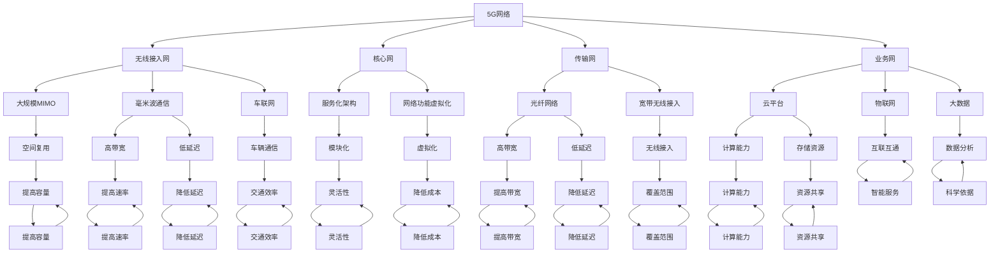

                 

### 文章标题

《5G技术在智慧旅游中的全面应用》

### 关键词

5G技术、智慧旅游、应用场景、挑战与解决方案、未来趋势

### 摘要

本文旨在探讨5G技术在智慧旅游领域的全面应用。首先，我们介绍了5G技术的基础概念及其在智慧旅游中的重要性。随后，详细讲解了5G技术的网络架构、技术特点及其与智慧旅游的深度融合。接着，分析了5G技术在智慧旅游中的具体应用场景，如智慧景区、智慧酒店、智慧旅行社和智慧交通等。然后，探讨了5G在智慧旅游应用中面临的挑战及解决方案，包括安全性、隐私保护和技术难题等。最后，展望了5G技术在智慧旅游领域的未来发展，提出了相关建议和注意事项。通过本文的深入分析，我们希望为行业从业人员和技术开发者提供有价值的参考。

## 引言与概述

### 5G技术在智慧旅游中的重要性

5G技术，即第五代移动通信技术，作为全球通信领域的重要突破，已经在各行业掀起了一场前所未有的技术革命。在智慧旅游领域，5G技术的引入和应用，不仅能够显著提升旅游服务的质量和效率，还能为游客带来前所未有的沉浸式体验。5G技术的高速率、低延迟、广覆盖和强大的连接能力，为智慧旅游的发展提供了坚实的基础。

首先，5G技术的高速率特性使得大规模的数据传输成为可能。在智慧旅游中，大量的实时数据需要快速传输，如高清视频、虚拟现实内容、GPS定位信息等。5G网络的高速传输能力，确保了这些数据能够实时传递，从而为游客提供流畅的体验。

其次，5G技术的低延迟特性使得实时交互成为现实。在智慧旅游中，实时交互对于提供个性化服务、提升用户体验至关重要。5G网络的低延迟特性，确保了用户在请求服务和互动时能够获得几乎即时的响应，从而提升了整体服务水平。

此外，5G技术的广覆盖特性使得旅游区域的连接更加全面。智慧旅游不仅需要在大城市等人口密集区提供优质服务，还需要在偏远景区、乡村等地区实现良好的网络覆盖。5G技术的广覆盖特性，使得这些地区的网络连接得到了显著改善，为智慧旅游的普及提供了有力支持。

最后，5G技术的强大连接能力使得各种智能设备和系统之间的互联互通成为可能。在智慧旅游中，各种智能设备和系统之间的协同工作，能够实现更加智能化的管理和服务。例如，智能导游系统、智能安防系统、智能交通系统等，都可以通过5G网络实现无缝连接和协同工作，从而提升整体服务水平。

综上所述，5G技术在智慧旅游中具有极其重要的作用。它不仅能够提升旅游服务的质量和效率，还能为游客带来更加丰富、便捷的体验。因此，深入研究和探讨5G技术在智慧旅游中的全面应用，具有重要的现实意义和前瞻性。

### 5G技术的基础概念与发展历程

5G技术，即第五代移动通信技术，是当前全球通信领域的一项重大突破。它不仅仅是一个技术升级，更是一场全新的通信革命，将深远地影响人类社会的发展。

#### 5G技术的基本概念

5G技术，全称为5th Generation Mobile Networks，是指第五代移动通信网络。与之前的1G、2G、3G和4G技术相比，5G技术在多个方面有了显著的提升。首先，5G网络具有更高的数据传输速率。4G网络的峰值下载速度通常在100Mbps左右，而5G网络的峰值下载速度可以达到10Gbps，是4G的百倍以上。这种高速率使得大规模数据传输成为可能，如高清视频、虚拟现实内容等都可以在瞬间传输完成。

其次，5G技术具有更低的延迟。延迟是通信网络中一个重要的性能指标，指的是数据从发送端到接收端所需的时间。4G网络的延迟一般在几十毫秒，而5G网络的延迟可以低至1毫秒。这种低延迟特性对于实时交互、智能控制等应用具有重要意义。

此外，5G技术还具有更广的覆盖范围和更强的网络容量。5G网络采用了新的频谱资源，包括低频段、中高频段和毫米波频段，能够提供更广的覆盖范围。同时，5G网络采用了新的网络架构和调度技术，使得网络容量大幅提升，可以同时支持更多的设备连接。

#### 5G技术的发展历程

5G技术的发展历程可以追溯到2000年代初期。当时，3G技术刚刚开始普及，通信行业就开始了对5G技术的探索和研究。2009年，国际电信联盟（ITU）正式提出了5G的概念，并开始制定相关标准。此后，各国通信行业巨头和研究机构纷纷加入5G技术的研究和开发。

2013年，ITU发布了5G的初步标准，明确了5G技术的主要性能指标和关键技术。2015年，ITU正式发布了5G的技术标准，这标志着5G技术进入了实际应用阶段。此后，全球多个国家和地区开始建设5G网络，并逐步推广。

在中国，5G技术的发展也非常迅速。2019年，中国正式推出了5G商用服务，成为全球首批推出5G服务的国家之一。随后，中国的5G网络建设取得了显著进展，成为全球5G网络覆盖最广、用户数量最多的国家。

#### 5G技术在全球的应用

在全球范围内，5G技术的应用已经覆盖了多个领域，包括智慧旅游、智慧城市、智能制造、远程医疗等。其中，智慧旅游是5G技术的重要应用领域之一。

在智慧旅游中，5G技术的高速率和低延迟特性为游客提供了更加丰富和便捷的体验。例如，游客可以通过5G网络观看高清直播，实时了解景区的情况；通过虚拟现实技术，游客可以提前预览景区的风景，甚至体验沉浸式的旅游体验。

此外，5G技术的广覆盖特性也为智慧旅游提供了支持。在偏远景区和乡村地区，5G网络的覆盖使得游客可以随时随地进行网络连接，获取旅游信息和服务。

总之，5G技术在智慧旅游中的应用，不仅提升了旅游服务的质量和效率，还为游客带来了更加丰富和便捷的体验。随着5G技术的不断发展和应用，智慧旅游的未来将更加美好。

### 智慧旅游的定义与发展历程

#### 智慧旅游的定义

智慧旅游，是指利用现代信息技术，特别是物联网、云计算、大数据、人工智能等新兴技术，对旅游业进行全方位的升级和优化，从而提升旅游服务的质量和游客的体验。智慧旅游的核心在于通过智能化手段，实现旅游资源的有效配置和精准服务，使旅游活动更加便捷、高效、安全和绿色。

智慧旅游的五个核心要素包括：

1. **信息化基础设施建设**：通过构建全面的信息化基础设施，如智能景区、智能酒店、智能交通等，为智慧旅游提供基础支持。
2. **数据采集与处理**：通过各类传感器和设备，实时采集游客行为数据、旅游资源数据等，并进行大数据处理和分析，为旅游管理和服务提供数据支持。
3. **智能化管理与服务**：利用人工智能和机器学习技术，对游客需求进行精准分析，提供个性化的旅游服务和管理方案。
4. **虚拟现实与增强现实技术**：通过虚拟现实（VR）和增强现实（AR）技术，为游客提供沉浸式的旅游体验，提升游客的参与感和满意度。
5. **安全与可持续发展**：通过智能安防系统和环保技术，保障游客的人身安全和旅游环境的可持续发展。

#### 智慧旅游的发展历程

智慧旅游的发展历程可以分为以下几个阶段：

1. **初步探索阶段（2000年代初至2010年）**：
   在这个阶段，旅游业开始引入互联网和信息技术，如网站、电子邮件等，为游客提供基本的在线服务。这个阶段的智慧旅游主要侧重于信息化的基础建设。

2. **快速发展阶段（2010年至2015年）**：
   随着移动互联网的普及，智能手机、平板电脑等移动设备的广泛使用，使得智慧旅游的应用场景更加丰富。这个阶段，智慧旅游开始涉及到数据采集、处理和分析，以及智能化管理和服务的应用。

3. **深度融合阶段（2015年至今）**：
   随着大数据、物联网、人工智能等新兴技术的不断发展，智慧旅游进入了一个深度融合的阶段。各类新技术在智慧旅游中的应用越来越广泛，如智能导游系统、虚拟现实旅游体验、智能酒店服务等。

#### 智慧旅游与5G技术的联系

5G技术的引入，为智慧旅游的发展提供了新的契机。5G技术的高速率、低延迟、广覆盖和强大的连接能力，使得智慧旅游的应用场景更加丰富，服务质量得到进一步提升。

首先，5G技术的高速率特性，使得大规模的数据传输成为可能，如高清视频、虚拟现实内容等，可以为游客提供更加丰富和流畅的旅游体验。

其次，5G技术的低延迟特性，使得实时交互成为现实，游客可以实时获取旅游信息、享受智能服务，提升旅游的便捷性和满意度。

此外，5G技术的广覆盖特性，使得偏远景区和乡村地区也能够享受到高质量的通信服务，为智慧旅游的普及提供了支持。

最后，5G技术的强大连接能力，使得各种智能设备和系统之间的互联互通成为可能，如智能导游系统、智能安防系统、智能交通系统等，可以协同工作，提供更加智能化的旅游服务。

总之，5G技术为智慧旅游的发展提供了强大的技术支撑，使得智慧旅游的应用场景更加丰富，服务质量得到进一步提升。随着5G技术的不断发展和应用，智慧旅游的未来将更加美好。

### 5G技术基础

#### 5G网络架构与技术特点

5G网络架构相较于前几代移动通信网络，进行了全面的升级和优化。它由四个主要层次组成：无线接入网（RAN）、核心网（CN）、传输网（TN）和业务网（SN）。每个层次都有其特定的功能和技术特点。

**无线接入网（RAN）**

无线接入网是5G网络架构的基础，主要负责无线信号的处理和传输。5G无线接入网采用了多种新技术，包括大规模MIMO（多输入多输出）、毫米波通信、车联网等。

- **大规模MIMO**：大规模MIMO技术通过增加天线数量，实现更高的空间复用和频谱利用率，从而提升网络容量和传输速率。
- **毫米波通信**：毫米波频段具有较高的频谱带宽，能够提供更高的数据传输速率，但受限于传输距离和穿透能力，需要采用先进的天线设计和信号处理技术。
- **车联网**：车联网技术使得车辆与车辆、车辆与基础设施之间可以实时通信，提高交通效率和安全性。

**核心网（CN）**

核心网负责处理用户数据、控制信令和会话管理等关键功能。5G核心网采用了服务化架构（SA）和网络功能虚拟化（NFV）技术。

- **服务化架构（SA）**：服务化架构使得网络功能模块化，便于管理和升级，提高网络的灵活性和可扩展性。
- **网络功能虚拟化（NFV）**：网络功能虚拟化将传统网络设备的功能虚拟化为软件服务，通过虚拟机实现，降低设备成本和运维复杂度。

**传输网（TN）**

传输网是5G网络架构的数据传输通道，负责将数据从无线接入网传输到核心网。5G传输网采用了新的传输技术，包括光纤网络、宽带无线接入等。

- **光纤网络**：光纤网络具有高带宽、低延迟、抗干扰能力强等优点，是5G传输网的主要承载技术。
- **宽带无线接入**：宽带无线接入技术通过无线信号直接传输到用户设备，适用于无法布线的场景，如偏远山区和海洋旅游区。

**业务网（SN）**

业务网是5G网络架构的服务提供层，负责提供各种业务和应用。5G业务网通过云平台、物联网、大数据等技术，为用户提供个性化、智能化的服务。

- **云平台**：云平台为5G网络提供了强大的计算能力和存储资源，支持各种业务应用的快速部署和运行。
- **物联网**：物联网技术使得各种智能设备和系统可以实现互联互通，提供智慧化的旅游服务。
- **大数据**：大数据技术通过对海量旅游数据的分析和挖掘，为旅游管理和服务提供科学依据。

#### 5G无线通信技术

5G无线通信技术是5G网络架构的核心部分，包括多种关键技术，如毫米波通信、大规模MIMO、多接入边缘计算（MEC）等。

- **毫米波通信**：毫米波通信使用毫米波频段进行信号传输，具有高带宽、低延迟等优点，适用于高速移动场景。
- **大规模MIMO**：大规模MIMO技术通过增加天线数量和空间复用技术，提高网络容量和传输速率。
- **多接入边缘计算（MEC）**：MEC技术将计算和存储资源部署在网络的边缘，降低延迟，提高服务质量。

#### 5G网络关键性能指标

5G网络的关键性能指标包括峰值数据传输速率、网络延迟、网络容量和能效等。

- **峰值数据传输速率**：5G网络的峰值数据传输速率可以达到10Gbps，是4G网络的百倍以上。
- **网络延迟**：5G网络的网络延迟低至1毫秒，适合实时交互和智能控制场景。
- **网络容量**：5G网络具有更高的网络容量，可以同时支持更多用户和设备接入。
- **能效**：5G网络通过新技术和优化算法，提高了能效，降低了能耗。

#### 5G频谱资源与分配策略

5G频谱资源是5G网络通信的基础，包括低频段、中高频段和毫米波频段等。

- **低频段**：低频段频谱资源适用于广覆盖和低功耗场景，如智能导游系统和智能交通系统。
- **中高频段**：中高频段频谱资源适用于高速移动场景和高密度接入场景，如5G智能手机和车载通信。
- **毫米波频段**：毫米波频段频谱资源适用于高带宽、高速度场景，如虚拟现实和增强现实应用。

5G频谱资源的分配策略包括频谱规划、频谱分配和频谱共享等。

- **频谱规划**：频谱规划是确保频谱资源合理分配和有效利用的关键，需要综合考虑频谱需求、频谱特性和应用场景。
- **频谱分配**：频谱分配是将频谱资源分配给特定用户或应用的过程，可以采用静态分配、动态分配和竞价分配等方式。
- **频谱共享**：频谱共享是将频谱资源在不同用户或应用之间共享，以实现频谱资源的最大化利用，可以采用动态频谱共享和协调共享等方式。

### 5G网络与智慧旅游的Mermaid流程图

### 5G网络架构与智慧旅游的融合

5G网络架构与智慧旅游的融合，主要体现在以下几个方面：

#### 高速率与数据密集型应用

5G网络的高速率特性，使得智慧旅游中的数据密集型应用如高清视频直播、虚拟现实（VR）和增强现实（AR）体验成为可能。例如，游客可以通过5G网络实时观看景区的高清直播，感受现场的每一个细节。同时，VR和AR技术可以提供沉浸式的旅游体验，使游客在虚拟世界中探索景点，增加互动性和趣味性。

#### 低延迟与实时互动

5G网络的低延迟特性，保证了智慧旅游中的实时互动性。游客可以通过智能导游系统实时获取旅游信息，与景区进行互动，享受个性化的服务。此外，低延迟还使得远程医疗、在线教育等应用在智慧旅游中成为可能，为游客提供更加全面的旅游体验。

#### 广覆盖与无缝连接

5G网络的广覆盖特性，使得偏远景区和乡村地区也能够享受到高质量的通信服务，为智慧旅游的普及提供了支持。通过5G网络，游客可以随时随地进行网络连接，获取旅游信息和服务。同时，5G网络的强大连接能力，使得各种智能设备和系统之间的互联互通成为可能，如智能导游系统、智能安防系统、智能交通系统等，可以协同工作，提供更加智能化的旅游服务。

#### 智能化与个性化服务

5G网络与大数据、人工智能等技术的融合，使得智慧旅游能够实现更加智能化和个性化的服务。通过对游客数据的分析和挖掘，智慧旅游平台可以精准了解游客需求，提供个性化的旅游推荐和定制服务。例如，根据游客的历史浏览记录和兴趣偏好，推荐相应的景点和活动，提高游客的满意度。

#### 可持续发展与智慧管理

5G网络在智慧旅游中的应用，不仅提升了旅游服务的质量和效率，还有助于旅游业的可持续发展。通过智能安防系统，可以有效保障游客的人身安全和景区的财产安全。同时，通过对旅游资源的智能化管理，可以实现节能减排，降低环境负荷，实现绿色旅游。

总之，5G网络架构与智慧旅游的融合，为旅游业带来了前所未有的机遇和挑战。通过充分利用5G网络的高速率、低延迟、广覆盖和强大连接能力，智慧旅游将实现更加智能化、个性化、安全化和可持续化的发展。

### 5G在智慧旅游中的具体应用场景

5G技术的高速率、低延迟、广覆盖和强大连接能力，使得其在智慧旅游中的应用场景变得丰富多样。以下将详细分析5G在智慧景区、智慧酒店、智慧旅行社和智慧交通等方面的应用。

#### 5G在智慧景区的应用

智慧景区是5G技术在智慧旅游中最早和最广泛的应用场景之一。通过5G网络，景区可以实现全方位的智能化管理和游客服务。

1. **高清视频直播**：5G网络的高速率特性，使得景区可以实时直播高清视频，游客可以通过手机或平板电脑观看景区的实时情况，选择最佳游览路线。

2. **虚拟现实（VR）体验**：5G网络低延迟的特性，使得虚拟现实技术可以提供更加流畅和真实的体验。游客可以通过VR设备提前预览景区的景点，感受到身临其境的感觉。

3. **增强现实（AR）导游**：通过5G网络和AR技术，景区可以为游客提供智能化的导游服务。游客只需用手机或平板电脑扫描景区内的标识，就可以获得相关景点的详细信息和介绍。

4. **智能导览系统**：5G网络使得智能导览系统的实时性和准确性大幅提升。导览系统可以实时更新景区信息，为游客提供个性化的导览路线和推荐。

5. **智能安防系统**：5G网络的高带宽和低延迟特性，使得景区可以部署智能安防系统，如人脸识别、视频监控等，提高景区的安全管理水平。

6. **环境监测**：通过5G网络和物联网设备，景区可以实时监测空气质量、水质、温度等环境数据，实现景区的绿色管理和可持续发展。

#### 5G在智慧酒店的应用

智慧酒店通过5G技术的应用，实现了酒店服务的高效化和个性化。

1. **智能客房**：5G网络使得智能客房成为现实。游客可以通过手机或智能设备，实现客房灯光、空调、窗帘等的远程控制，提高居住舒适度。

2. **虚拟现实（VR）迎宾**：酒店可以在迎宾大厅或客房内设置VR体验区，游客可以通过VR设备了解酒店的服务内容和特色，提升入住体验。

3. **智能服务机器人**：5G网络使得智能服务机器人能够高效运行，为游客提供送物、清洁、指引等服务，提高酒店的服务效率。

4. **智能客房服务**：通过5G网络和物联网设备，酒店可以实现智能客房服务，如自动点餐、自动打扫等，提高游客的入住体验。

5. **智慧餐饮**：5G网络使得餐厅可以实现智能化点餐、支付和推荐，为游客提供个性化的餐饮服务。

6. **智能安防**：5G网络的高带宽和低延迟特性，使得酒店可以部署智能安防系统，如人脸识别、智能监控等，提高酒店的安全管理水平。

#### 5G在智慧旅行社的应用

智慧旅行社通过5G技术的应用，实现了旅游服务的智能化和个性化。

1. **虚拟现实（VR）旅游体验**：旅行社可以提供VR旅游体验，游客可以通过VR设备提前预览旅游景点，选择最适合自己的旅游线路。

2. **智能旅游规划**：通过5G网络和大数据分析，旅行社可以为游客提供个性化的旅游规划，包括行程安排、住宿推荐、餐饮选择等。

3. **在线预订与支付**：5G网络的高速率和低延迟特性，使得游客可以实时在线预订和支付旅游产品，提高预订效率。

4. **智能导游系统**：通过5G网络，旅行社可以提供智能导游系统，为游客提供实时导航、景点介绍和推荐等服务。

5. **智慧客服**：5G网络使得智能客服系统能够高效运行，为游客提供实时咨询和帮助，提升客户满意度。

6. **数据分析和营销**：通过5G网络和大数据分析，旅行社可以了解游客的行为和需求，进行精准营销，提高旅游产品的销量和游客满意度。

#### 5G在智慧交通的应用

智慧交通通过5G技术的应用，实现了交通管理和服务的高效化和智能化。

1. **智能交通信号控制**：通过5G网络，交通信号系统能够实时获取交通数据，根据实时交通状况进行智能调控，减少交通拥堵。

2. **车辆智能监控**：5G网络使得车辆智能监控系统得以实现，可以实时监控车辆状态、行驶路线和位置信息，提高交通安全和运输效率。

3. **智慧停车场**：通过5G网络和物联网设备，停车场可以实现智能化管理，如自动识别车牌、智能找车位、自动计费等，提高停车效率。

4. **无人驾驶汽车**：5G网络的高带宽和低延迟特性，使得无人驾驶汽车得以实现。无人驾驶汽车可以实时获取交通信息，做出智能决策，提高行驶安全性。

5. **实时路况信息**：通过5G网络和大数据分析，智慧交通系统可以实时提供路况信息，帮助游客选择最优出行路线，减少出行时间。

6. **智慧公共交通**：通过5G网络和物联网设备，公共交通系统可以实现智能化管理，如实时监控车辆运行状态、自动调度和乘客服务，提高公共交通的服务质量和效率。

综上所述，5G技术在智慧旅游中的具体应用场景广泛且多样，通过5G网络的高速率、低延迟、广覆盖和强大连接能力，智慧旅游将实现更加智能化、个性化、安全化和可持续化的发展。随着5G技术的不断进步和应用，智慧旅游的未来将更加美好。

### 5G在智慧旅游中的应用案例

5G技术在智慧旅游中的应用已经取得了显著的成效，下面将介绍几个典型的案例，以展示5G技术如何为智慧旅游带来创新和提升。

#### 案例一：中国黄山智慧旅游项目

黄山，作为我国著名的旅游胜地，近年来通过引入5G技术，实现了景区的智慧化转型。黄山景区部署了5G基站，覆盖了主要景点和游客区域，实现了全方位的通信覆盖。具体应用包括：

1. **高清视频直播**：游客可以通过手机或平板电脑实时观看黄山景区的直播，了解景区的实时状况，选择最佳游览路线。

2. **智能导览系统**：利用5G网络，景区部署了智能导览系统，游客通过扫描景点标识，即可获得详细的景点介绍和导览信息。

3. **VR/AR体验**：通过5G网络和VR/AR设备，游客可以在虚拟环境中提前预览黄山的美景，增强游览体验。

4. **智能监控与安防**：5G网络的高带宽和低延迟特性，使得景区可以部署智能监控和安防系统，提高景区的安全管理水平。

#### 案例二：泰国普吉岛智能酒店

泰国普吉岛作为全球热门的旅游目的地，其酒店行业也在积极推进智能化升级。某知名酒店集团引入了5G技术，为游客提供了智能化的入住体验：

1. **智能客房**：游客可以通过手机或智能设备远程控制客房内的灯光、空调和窗帘等，提高居住舒适度。

2. **VR迎宾**：酒店在大厅和客房内设置了VR体验区，游客可以通过VR设备了解酒店的服务内容和特色。

3. **智能服务机器人**：酒店部署了智能服务机器人，提供送物、清洁和指引等服务，提高酒店的服务效率。

4. **智慧餐饮**：通过5G网络，酒店实现了智能化点餐、支付和推荐，为游客提供个性化的餐饮服务。

5. **智能安防**：5G网络使得酒店可以部署智能安防系统，如人脸识别、智能监控等，提高酒店的安全管理水平。

#### 案例三：欧洲某智慧旅行社

欧洲某知名旅行社利用5G技术，为游客提供了智能化的旅游服务：

1. **虚拟现实（VR）旅游体验**：旅行社为游客提供了VR旅游体验，游客可以通过VR设备提前预览旅游景点，选择最适合自己的旅游线路。

2. **智能旅游规划**：通过5G网络和大数据分析，旅行社可以为游客提供个性化的旅游规划，包括行程安排、住宿推荐、餐饮选择等。

3. **在线预订与支付**：5G网络的高速率和低延迟特性，使得游客可以实时在线预订和支付旅游产品，提高预订效率。

4. **智能导游系统**：通过5G网络，旅行社可以提供智能导游系统，为游客提供实时导航、景点介绍和推荐等服务。

5. **智慧客服**：5G网络使得智能客服系统能够高效运行，为游客提供实时咨询和帮助，提升客户满意度。

#### 案例四：中国深圳智能交通系统

深圳市在智慧交通领域也取得了显著成果，通过5G技术的应用，实现了智能交通系统的建设：

1. **智能交通信号控制**：通过5G网络，交通信号系统能够实时获取交通数据，根据实时交通状况进行智能调控，减少交通拥堵。

2. **车辆智能监控**：5G网络使得车辆智能监控系统得以实现，可以实时监控车辆状态、行驶路线和位置信息，提高交通安全和运输效率。

3. **智慧停车场**：通过5G网络和物联网设备，停车场可以实现智能化管理，如自动识别车牌、智能找车位、自动计费等，提高停车效率。

4. **无人驾驶汽车**：5G网络的高带宽和低延迟特性，使得无人驾驶汽车得以实现。无人驾驶汽车可以实时获取交通信息，做出智能决策，提高行驶安全性。

5. **实时路况信息**：通过5G网络和大数据分析，智慧交通系统可以实时提供路况信息，帮助游客选择最优出行路线，减少出行时间。

这些案例展示了5G技术在智慧旅游中的广泛应用，不仅提升了旅游服务的质量和效率，还为游客带来了全新的体验。随着5G技术的不断进步和应用，智慧旅游的未来将更加美好。

### 5G在智慧旅游应用中的技术挑战与解决方案

虽然5G技术在智慧旅游中具有巨大的应用潜力，但在实际应用过程中也面临着一系列技术挑战。以下将详细探讨5G在智慧旅游应用中可能遇到的技术难题，并提出相应的解决方案。

#### 数据传输速度与稳定性的挑战

5G网络的高速率特性为智慧旅游提供了丰富的数据传输能力，但数据传输速度和稳定性仍然是需要关注的重要问题。在智慧景区、智慧酒店等应用场景中，实时传输大量数据（如高清视频、虚拟现实内容等）对网络的稳定性和可靠性提出了高要求。

**解决方案**：

1. **增强网络覆盖**：通过增加5G基站部署，扩大网络覆盖范围，确保游客在不同区域都能够获得稳定的网络连接。

2. **多路径传输**：采用多路径传输技术，将数据通过多条路径传输，提高数据传输的稳定性和可靠性。

3. **边缘计算**：通过边缘计算技术，将部分数据处理和计算任务转移到网络边缘，降低数据传输距离，提高传输速度和稳定性。

#### 低延迟与实时交互的挑战

5G技术的低延迟特性使得实时交互成为可能，但在实际应用中，低延迟的保障仍是一个挑战。特别是在高密度接入场景下，如大型旅游景区和活动，网络延迟可能会受到影响。

**解决方案**：

1. **优化网络架构**：采用分布式架构，将网络设备和计算资源分布在网络边缘，降低数据传输路径，减少延迟。

2. **实时监控与调控**：通过实时监控网络状态，根据用户需求和网络负载动态调整网络资源，确保低延迟服务。

3. **负载均衡**：通过负载均衡技术，将网络流量均匀分配到不同的设备和服务上，避免单点过载导致的延迟。

#### 安全性与隐私保护的挑战

随着5G技术在智慧旅游中的应用，数据的安全性和用户隐私保护成为重要问题。5G网络的高连接能力和广泛的接入设备，使得网络攻击和数据泄露的风险增加。

**解决方案**：

1. **加密技术**：采用强加密技术，对传输的数据进行加密，确保数据在传输过程中的安全性。

2. **防火墙和入侵检测系统**：部署防火墙和入侵检测系统，实时监测网络流量，阻止恶意攻击和数据泄露。

3. **用户身份验证**：加强用户身份验证机制，确保只有授权用户才能访问敏感数据和系统。

#### 网络容量与扩展性的挑战

5G网络具有强大的网络容量，但在高密度用户接入场景下，如大型旅游活动和高峰期，网络容量仍可能成为瓶颈。

**解决方案**：

1. **动态频谱管理**：通过动态频谱管理技术，实时调整频谱资源的分配，提高网络容量和利用率。

2. **网络切片技术**：采用网络切片技术，为不同的应用场景分配独立的网络资源，确保高密度接入场景下的网络性能。

3. **分布式存储**：通过分布式存储技术，将数据分散存储在不同的设备和数据中心，提高数据存储的可靠性和扩展性。

#### 能耗与环保的挑战

5G网络的高带宽和低延迟特性需要大量的能源支持，能耗问题成为关注焦点。同时，智慧旅游的发展也需要考虑环境保护和可持续发展。

**解决方案**：

1. **节能技术**：采用节能技术，如低功耗设备、智能调度等，降低5G网络的整体能耗。

2. **绿色基站建设**：采用绿色基站建设方案，如利用太阳能、风能等可再生能源，减少对环境的影响。

3. **智能网络管理**：通过智能网络管理技术，动态调整网络设备和服务的运行状态，优化能耗管理。

总之，5G技术在智慧旅游应用中面临的数据传输、实时交互、安全性、网络容量和能耗等挑战，需要通过技术创新和优化管理策略来解决。通过这些解决方案的实施，5G技术将更好地服务于智慧旅游，为游客带来更加丰富和便捷的体验。

### 5G技术在智慧旅游中的应用展望

随着5G技术的不断成熟和应用，智慧旅游领域将迎来新的发展机遇。以下是5G技术在智慧旅游中的应用展望，包括未来趋势、技术与应用的融合以及行业发展的潜在影响。

#### 未来趋势

1. **超高速率与低延迟的普及**：5G技术的超高速率和低延迟特性将使得更多的应用场景得到普及，如实时高清视频直播、虚拟现实（VR）和增强现实（AR）体验等。这将极大提升游客的旅游体验，使旅游活动更加沉浸和互动。

2. **智能设备的广泛应用**：5G网络的高带宽和低延迟特性将推动智能设备的广泛应用，如智能导游机器人、智能导航系统、智能监控设备等。这些设备将显著提升景区和酒店的管理效率，提高游客的安全性。

3. **个性化服务的提升**：通过大数据和人工智能技术的融合，5G技术将使得个性化服务成为可能。景区和酒店可以根据游客的偏好和行为数据，提供定制化的旅游推荐和住宿安排，提升游客的满意度和忠诚度。

4. **网络安全的强化**：随着5G技术在智慧旅游中的应用，网络安全将成为一个重要议题。未来，随着安全技术的不断进步，5G网络的安全性能将得到显著提升，保护游客的数据隐私和网络安全。

#### 技术与应用的融合

1. **边缘计算与5G的结合**：边缘计算技术与5G技术的结合，将实现数据处理的实时性和高效性。在智慧旅游中，通过边缘计算，可以实时处理和分析大量游客数据，提供快速响应的服务，提高旅游体验。

2. **人工智能与5G的融合**：人工智能技术与5G技术的结合，将推动智慧旅游的智能化发展。通过人工智能技术，可以实现对旅游数据的深度分析和挖掘，为旅游管理和营销提供有力支持。

3. **虚拟现实与5G的融合**：5G技术的高带宽和低延迟特性，将使得虚拟现实（VR）技术在智慧旅游中得到广泛应用。游客可以通过VR设备，提前预览景区的美景，体验沉浸式的旅游体验。

4. **物联网与5G的融合**：物联网技术与5G技术的结合，将实现智慧旅游中各种设备和系统的互联互通。通过物联网设备，可以实时监控和管理景区和酒店的各类设备，提高运营效率。

#### 行业发展的潜在影响

1. **服务质量提升**：5G技术的应用将显著提升智慧旅游的服务质量。通过提供高清视频直播、智能导游和个性化服务，游客可以享受到更加便捷、高效和优质的旅游体验。

2. **运营效率提高**：5G技术的高带宽和低延迟特性，将提升景区和酒店的管理效率。通过智能监控、智能导航和智能设备管理，景区和酒店可以更加高效地运营，提高服务质量和游客满意度。

3. **商业模式创新**：5G技术的应用将带来新的商业模式创新。通过提供基于5G技术的个性化服务和增值服务，景区和酒店可以创造新的收入来源，实现可持续发展。

4. **产业链协同发展**：5G技术的应用将推动智慧旅游产业链的协同发展。从硬件设备提供商到软件开发商，再到服务提供商，各个环节将实现紧密合作，共同推动智慧旅游的发展。

总之，随着5G技术的不断发展和应用，智慧旅游将迎来一个全新的发展阶段。通过超高速率、低延迟、智能设备和个性化服务的应用，智慧旅游将大幅提升游客的旅游体验，推动旅游业的服务质量、运营效率和商业模式的创新。随着5G技术的持续进步，智慧旅游的未来将更加美好。

### 附录：5G智慧旅游应用案例分析

#### 案例一：某景区的5G应用案例

**项目背景**：某知名景区位于我国南方，以其壮丽的山水景观和丰富的文化底蕴吸引大量游客。为了提升游客体验，景区决定引入5G技术，实现景区的智慧化升级。

**项目目标**：
1. 提供高清视频直播，让游客能够实时了解景区状况。
2. 部署智能导览系统，提供详细的景点介绍和导览服务。
3. 实施VR/AR体验，增强游客的沉浸式旅游体验。

**技术方案**：
1. **高清视频直播**：景区部署了5G基站，覆盖主要景点和游客区域，确保游客可以实时观看景区的高清直播。
2. **智能导览系统**：利用5G网络和智能导览设备，游客只需扫描景点标识，即可获得详细的景点介绍和导览服务。
3. **VR/AR体验**：景区设置了多个VR/AR体验区，游客可以通过VR/AR设备提前预览景区的美景，增强游览体验。

**实施效果**：
1. **提升游客体验**：通过高清视频直播和VR/AR体验，游客可以提前了解景区的景点，选择最佳的游览路线，提高游览满意度。
2. **提高景区管理效率**：智能导览系统为游客提供了便捷的服务，景区管理者可以通过智能监控设备实时了解景区的状况，提高管理效率。
3. **增强景区安全性**：通过5G网络和智能监控设备，景区可以实时监控游客的安全状况，提高景区的安全性。

#### 案例二：某酒店集团的5G转型之路

**项目背景**：某国际知名酒店集团旗下拥有多家五星级酒店，为了提升酒店的服务质量和游客体验，决定进行5G技术的全面转型。

**项目目标**：
1. 提供智能客房服务，提升游客的居住舒适度。
2. 实施VR迎宾，增强游客的入住体验。
3. 部署智能安防系统，提高酒店的安全性。

**技术方案**：
1. **智能客房**：通过5G网络，酒店实现了智能客房服务，游客可以通过手机或智能设备远程控制客房内的灯光、空调和窗帘等。
2. **VR迎宾**：酒店在大厅和客房内设置了VR体验区，游客可以通过VR设备了解酒店的服务内容和特色。
3. **智能安防**：通过5G网络和智能监控设备，酒店实现了智能安防系统，如人脸识别、智能监控等，提高酒店的安全性。

**实施效果**：
1. **提升游客满意度**：通过智能客房服务和VR迎宾，游客的居住体验得到了显著提升，酒店满意度大幅提高。
2. **提高酒店运营效率**：智能客房服务和智能安防系统使得酒店的运营效率得到提升，管理成本降低。
3. **增强酒店安全性**：通过智能安防系统，酒店的安全管理得到加强，游客的人身和财产安全得到保障。

#### 案例三：某旅行社的5G智慧旅游平台建设

**项目背景**：某知名旅行社希望通过引入5G技术，提升其旅游服务质量和游客体验，打造一个智能化的旅游服务平台。

**项目目标**：
1. 提供虚拟现实（VR）旅游体验，让游客提前预览旅游景点。
2. 实施智能旅游规划，为游客提供个性化的旅游方案。
3. 建立智慧客服系统，为游客提供实时咨询和服务。

**技术方案**：
1. **VR旅游体验**：旅行社通过5G网络和VR设备，为游客提供虚拟现实旅游体验，游客可以提前预览旅游景点，选择最适合自己的旅游线路。
2. **智能旅游规划**：通过5G网络和大数据分析，旅行社可以为游客提供个性化的旅游规划，包括行程安排、住宿推荐、餐饮选择等。
3. **智慧客服系统**：通过5G网络和智能客服系统，旅行社可以为游客提供实时咨询和服务，提升客户满意度。

**实施效果**：
1. **提升游客体验**：通过VR旅游体验和智能旅游规划，游客可以提前了解旅游景点，选择最适合自己的旅游方案，提高旅游满意度。
2. **提高服务效率**：智慧客服系统使得旅行社可以高效地处理游客咨询和投诉，提高服务效率。
3. **增强客户满意度**：通过提供个性化服务和高效响应，旅行社的客户满意度得到显著提升。

这些案例展示了5G技术在智慧旅游中的应用效果，通过高清视频直播、智能导览、VR/AR体验、智能客房、智慧客服等应用，不仅提升了游客的旅游体验，也提高了景区和酒店的管理效率和服务质量。随着5G技术的不断进步和应用，智慧旅游将迎来更加广阔的发展前景。

### 小结

本文从多个角度详细探讨了5G技术在智慧旅游中的全面应用。首先，我们介绍了5G技术的基础概念、发展历程以及在智慧旅游中的重要性。接着，我们分析了5G技术的基础，包括网络架构、无线通信技术、关键性能指标和频谱资源。随后，我们探讨了智慧旅游的定义、发展历程及其在旅游业中的应用。通过具体的案例，我们展示了5G技术在智慧景区、智慧酒店、智慧旅行社和智慧交通中的应用。此外，我们还探讨了5G技术在智慧旅游应用中面临的挑战及其解决方案，并对未来的发展进行了展望。

5G技术的引入，为智慧旅游带来了前所未有的机遇。它不仅提升了旅游服务的质量和效率，还为游客带来了更加丰富和便捷的体验。然而，5G技术在智慧旅游中的应用仍面临一些挑战，如数据传输速度与稳定性、低延迟与实时交互、安全性与隐私保护等。为了克服这些挑战，需要持续进行技术创新和优化管理策略。

对于未来的发展，我们建议以下几方面的措施：

1. **加强技术研发**：持续推动5G技术的研发和创新，提升网络性能和稳定性，为智慧旅游提供更强大的技术支持。

2. **推广边缘计算**：充分利用边缘计算技术，降低数据传输距离，提高数据处理速度和实时性。

3. **注重安全与隐私保护**：加强网络安全和用户隐私保护，确保游客数据的安全。

4. **促进产业链协同**：推动产业链上下游企业的合作，共同推动智慧旅游的发展。

5. **推广5G智慧旅游应用**：通过政策引导和宣传推广，加速5G技术在智慧旅游中的应用，提升整体服务水平。

通过这些措施，我们可以更好地发挥5G技术在智慧旅游中的潜力，为旅游业带来更加美好的未来。

### 拓展阅读

对于对5G技术在智慧旅游应用有更深入兴趣的读者，以下是一些推荐阅读资料：

1. **《5G技术及其在智慧旅游中的应用》**：这是一本详细探讨5G技术及其在智慧旅游领域应用的书籍，涵盖了5G技术的原理、架构、应用场景和未来发展趋势。

2. **《智慧旅游：理论与实践》**：本书从理论和实践两个角度，探讨了智慧旅游的定义、发展历程、核心技术和应用案例，对智慧旅游的发展提供了全面的分析。

3. **《5G网络架构与优化》**：这本书深入讲解了5G网络的架构、关键技术以及优化策略，对于理解5G网络的运作原理和提升网络性能有重要参考价值。

4. **《物联网与智慧城市》**：物联网技术是智慧旅游的重要组成部分，本书详细介绍了物联网的基本原理、应用场景以及智慧城市的发展趋势，有助于理解智慧旅游的生态系统。

5. **《人工智能在旅游业中的应用》**：这本书探讨了人工智能技术在旅游业中的应用，包括个性化推荐、智能客服、智能导览等，为智慧旅游的技术创新提供了新的思路。

通过阅读这些资料，可以更全面地了解5G技术在智慧旅游中的深度应用，为实际项目的实施提供参考和指导。

