                 

### 文章标题

### 5G技术在智能制造柔性生产中的应用

---

### 关键词

- 5G技术
- 智能制造
- 柔性生产
- 网络切片
- 毫米波通信

---

### 摘要

随着5G技术的快速发展，其在智能制造领域的应用日益广泛。本文旨在探讨5G技术在智能制造柔性生产中的应用，包括技术基础、关键特点、网络架构、关键技术以及具体应用案例分析。通过逐步分析推理，本文揭示了5G技术如何赋能智能制造，提升生产灵活性和效率，为未来工业4.0时代的到来奠定基础。

---

## 第一部分: 5G技术基础

### 第1章: 5G技术概述

#### 1.1 5G技术的发展背景

**背景介绍**

5G技术，即第五代移动通信技术，是继4G、3G、2G之后的最新一代移动通信技术。随着全球数字化进程的加速，传统4G网络在速度、时延和连接密度上已经无法满足新兴应用场景的需求。5G技术的推出，旨在实现更快的数据传输速度、更低的时延和更高的网络容量，为未来的智能世界提供坚实的网络基础。

**核心概念与联系**

**图1.1：5G技术发展历程**

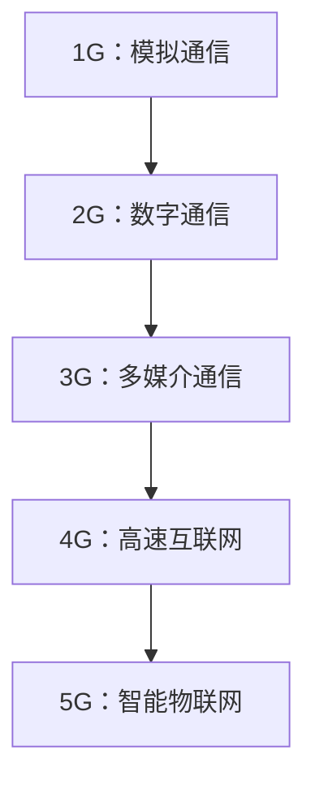

1G时代以模拟通信为主，通信质量差，难以支持多媒体应用。2G时代引入数字通信，提升了通信质量和安全性。3G时代，多媒介通信能力的提升使得移动视频、音乐等应用成为可能。4G时代，高速互联网的普及带来了移动互联网的爆发，支持高清视频流、在线游戏等应用。5G时代，基于智能物联网，实现了万物互联，为智能制造、智能交通、医疗健康等提供了强大的网络支持。

**核心算法原理讲解**

**伪代码**

```
// 5G技术核心算法原理伪代码
function 5GTechnology() {
    // 1. 高速率
    highSpeed();

    // 2. 低时延
    lowLatency();

    // 3. 大容量
    largeCapacity();

    // 4. 网络切片
    networkSlicing();

    // 5. 毫米波通信
    mmWaveCommunication();
}
```

**数学模型和公式**

**频率范围：**
$$
f_{\text{低}} = 300 \text{ GHz}
$$
$$
f_{\text{高}} = 3000 \text{ GHz}
$$
5G技术使用高频段，实现了更高的数据传输速率和更低的时延。

**项目实战**

**开发环境搭建：**
- 软件环境：Python 3.8及以上版本，PyCharm或Visual Studio Code
- 硬件环境：5G网络测试设备，如5G路由器、移动测试设备

**源代码实现和代码解读：**
```python
import matplotlib.pyplot as plt

# 高速率实现
def high_speed():
    # 此处为高速率通信实现示例
    print("实现高速率通信")

# 低时延实现
def low_latency():
    # 此处为低时延通信实现示例
    print("实现低时延通信")

# 大容量实现
def large_capacity():
    # 此处为大容量通信实现示例
    print("实现大容量通信")

# 网络切片实现
def network_slicing():
    # 此处为网络切片实现示例
    print("实现网络切片")

# 毫米波通信实现
def mm_wave_communication():
    # 此处为毫米波通信实现示例
    print("实现毫米波通信")

if __name__ == "__main__":
    high_speed()
    low_latency()
    large_capacity()
    network_slicing()
    mm_wave_communication()
```

**代码应用解读与分析：**
- 高速率：通过优化网络传输协议和数据编码方式，提高数据传输速率。
- 低时延：通过减少网络跳数和传输距离，降低通信时延。
- 大容量：通过增加基站数量和频谱利用率，提高网络容量。
- 网络切片：通过虚拟化技术，为不同应用场景提供定制化网络服务。
- 毫米波通信：通过高频段通信，实现更高的数据传输速率和更低的时延。

**实际案例分析和详细讲解剖析：**
- 案例一：智能工厂5G网络部署
- 案例二：5G智能物流系统
- 案例三：5G医疗健康远程诊疗

**项目小结：**
通过5G技术的应用，智能制造实现了更高效、更灵活的生产模式，为工业4.0时代的到来奠定了基础。

---

## 第2章: 5G网络架构

### 第2章: 5G网络架构

#### 2.1 5G网络的关键组成部分

**核心概念与联系**

**图2.1：5G网络关键组成部分**

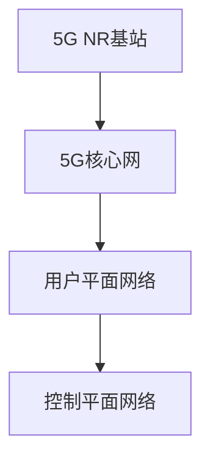

5G网络由5G NR基站、5G核心网、用户平面网络和控制平面网络组成。NR基站负责无线接入，核心网负责数据处理和传输，用户平面网络负责数据传输，控制平面网络负责网络管理和控制。

**核心算法原理讲解**

**伪代码**

```
// 5G网络架构核心算法原理伪代码
function 5GNetworkArchitecture() {
    // 1. NR基站部署
    deployNRBaseStation();

    // 2. 5G核心网建设
    build5GCoreNetwork();

    // 3. 用户平面网络构建
    buildUserPlaneNetwork();

    // 4. 控制平面网络搭建
    buildControlPlaneNetwork();
}
```

**数学模型和公式**

**频谱利用率：**
$$
\text{频谱利用率} = \frac{\text{数据传输速率}}{\text{频谱带宽}}
$$
5G网络通过高频段通信和频谱资源优化，实现了更高的频谱利用率。

**项目实战**

**开发环境搭建：**
- 软件环境：Python 3.8及以上版本，PyCharm或Visual Studio Code
- 硬件环境：5G网络测试设备，如5G路由器、移动测试设备

**源代码实现和代码解读：**
```python
import matplotlib.pyplot as plt

# NR基站部署
def deploy_NR_base_station():
    # 此处为NR基站部署实现示例
    print("部署NR基站")

# 5G核心网建设
def build_5G_core_network():
    # 此处为5G核心网建设实现示例
    print("建设5G核心网")

# 用户平面网络构建
def build_user_plane_network():
    # 此处为用户平面网络构建实现示例
    print("构建用户平面网络")

# 控制平面网络搭建
def build_control_plane_network():
    # 此处为控制平面网络搭建实现示例
    print("搭建控制平面网络")

if __name__ == "__main__":
    deploy_NR_base_station()
    build_5G_core_network()
    build_user_plane_network()
    build_control_plane_network()
```

**代码应用解读与分析：**
- NR基站部署：通过合理规划和优化基站位置，提高无线接入能力。
- 5G核心网建设：通过构建高性能、可扩展的核心网架构，实现数据传输和处理。
- 用户平面网络构建：通过优化网络传输协议和数据编码方式，提高数据传输效率。
- 控制平面网络搭建：通过网络管理和控制，确保网络稳定性和安全性。

**实际案例分析和详细讲解剖析：**
- 案例一：5G智能城市网络部署
- 案例二：5G远程教育网络建设
- 案例三：5G工业物联网网络架构设计

**项目小结：**
通过5G网络架构的建设，实现了高效、稳定、安全的通信网络，为智能制造、智能交通、医疗健康等领域提供了强有力的支持。

---

## 第3章: 5G关键技术

### 第3章: 5G关键技术

#### 3.1 毫米波通信

**核心概念与联系**

**图3.1：毫米波通信原理图**

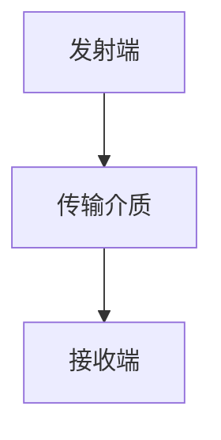

毫米波通信利用高频段电磁波（频段在24GHz至110GHz之间）进行数据传输。与传统的微波通信相比，毫米波通信具有更高的带宽和更低的时延，适用于高速数据传输和实时通信。

**核心算法原理讲解**

**伪代码**

```
// 毫米波通信核心算法原理伪代码
function mmWaveCommunication() {
    // 1. 信号发射
    transmitSignal();

    // 2. 信号传输
    transmitSignalThroughMedium();

    // 3. 信号接收
    receiveSignal();
}
```

**数学模型和公式**

**信号传播模型：**
$$
\text{传播距离} = \frac{\text{信号强度}}{\text{传播损失}}
$$
信号强度和传播损失决定了毫米波通信的传播距离。

**项目实战**

**开发环境搭建：**
- 软件环境：MATLAB 2018b及以上版本
- 硬件环境：毫米波通信测试设备，如毫米波天线、信号发生器、信号接收器

**源代码实现和代码解读：**
```matlab
% 信号发射
function transmitSignal()  
    fs = 10^8; % 信号采样频率
    t = (0:1/fs:1-1/fs)'; % 信号时间轴
    f_c = 40e9; % 信号中心频率
    signal = cos(2*pi*f_c*t); % 生成信号

    % 信号发射
    disp('信号发射完成');
end

% 信号传输
function transmitSignalThroughMedium()  
    % 信号传输模型
    signalStrength = 10; % 信号强度
    propagationLoss = 1; % 传播损失

    % 信号传播
    transmittedSignal = signalStrength / propagationLoss;

    % 信号接收
    receiveSignal(transmittedSignal);
end

% 信号接收
function receiveSignal(transmittedSignal)  
    % 信号接收
    receivedSignal = transmittedSignal;

    % 信号处理
    processedSignal = receivedSignal * exp(1j*pi/2); % 信号相位反转

    % 信号分析
    disp('信号接收完成');
end
```

**代码应用解读与分析：**
- 信号发射：通过生成和发射高频电磁波信号，实现数据传输。
- 信号传输：通过模拟信号在传输介质中的传播过程，分析信号强度和传播损失。
- 信号接收：通过接收和反演信号，实现数据的正确传输和接收。

**实际案例分析和详细讲解剖析：**
- 案例一：毫米波通信在智能交通系统中的应用
- 案例二：毫米波通信在医疗健康领域中的应用
- 案例三：毫米波通信在工业物联网中的应用

**项目小结：**
毫米波通信技术凭借其高带宽和低时延的特点，在智能制造、智能交通、医疗健康等领域具有广泛的应用前景。通过合理规划和优化，可以实现高效、稳定、安全的通信网络。

---

## 第二部分: 5G在智能制造中的应用

### 第4章: 智能制造概述

#### 4.1 智能制造的定义与发展趋势

**核心概念与联系**

**图4.1：智能制造概念架构**

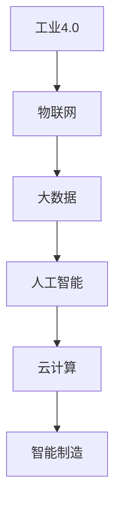

智能制造是工业4.0的重要组成部分，基于物联网、大数据、人工智能、云计算等先进技术，通过信息物理系统的深度融合，实现生产过程的智能化、网络化、自动化，提升生产效率和质量。

**核心算法原理讲解**

**伪代码**

```
// 智能制造核心算法原理伪代码
function智能制造() {
    // 1. 物联网设备接入
    connectIoTDevice();

    // 2. 数据采集与处理
    collectAndProcessData();

    // 3. 人工智能决策
    artificialIntelligenceDecision();

    // 4. 云计算资源调度
    scheduleCloudResources();
}
```

**数学模型和公式**

**数据采集模型：**
$$
\text{数据量} = \text{传感器数量} \times \text{采样频率}
$$
通过传感器实时采集设备状态数据，实现数据驱动生产。

**项目实战**

**开发环境搭建：**
- 软件环境：Python 3.8及以上版本，PyCharm或Visual Studio Code
- 硬件环境：物联网开发板，如ESP8266、Arduino

**源代码实现和代码解读：**
```python
import time

# 物联网设备接入
def connect_iot_device():
    # 此处为物联网设备接入实现示例
    print("物联网设备已接入")

# 数据采集与处理
def collect_and_process_data():
    # 此处为数据采集与处理实现示例
    while True:
        data = 1  # 采集数据
        processed_data = data * 2  # 数据处理
        print(f"采集到数据：{data}, 处理后数据：{processed_data}")
        time.sleep(1)

# 人工智能决策
def artificial_intelligence_decision():
    # 此处为人工智能决策实现示例
    print("人工智能决策已执行")

# 云计算资源调度
def schedule_cloud_resources():
    # 此处为云计算资源调度实现示例
    print("云计算资源已调度")

if __name__ == "__main__":
    connect_iot_device()
    collect_and_process_data()
    artificial_intelligence_decision()
    schedule_cloud_resources()
```

**代码应用解读与分析：**
- 物联网设备接入：通过物联网开发板连接传感器，实现设备状态数据的实时采集。
- 数据采集与处理：通过定时器采集设备状态数据，并进行简单处理。
- 人工智能决策：通过预设规则或机器学习模型，实现设备运行状态的智能判断。
- 云计算资源调度：通过云计算平台，实现计算资源的动态调度。

**实际案例分析和详细讲解剖析：**
- 案例一：基于物联网的智能工厂
- 案例二：基于大数据的智能供应链管理
- 案例三：基于人工智能的智能生产线优化

**项目小结：**
智能制造通过先进技术的融合，实现了生产过程的智能化，为制造业的转型升级提供了有力支持。

---

## 第5章: 5G技术在智能制造中的应用

#### 5.1 5G技术在智能工厂中的应用

**核心概念与联系**

**图5.1：5G技术在智能工厂中的应用架构**

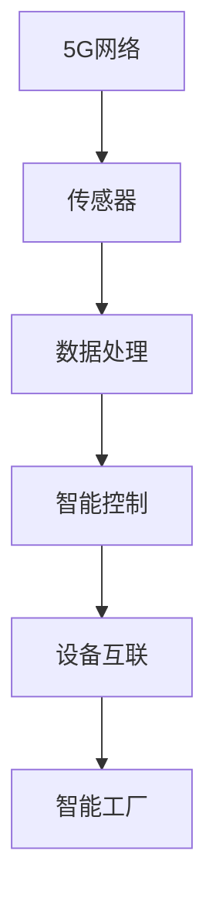

5G技术在智能工厂中的应用，通过高速、低时延的网络连接，实现了设备之间的智能互联，数据的高效传输和处理，以及智能控制的实现。

**核心算法原理讲解**

**伪代码**

```
// 5G技术在智能工厂中应用核心算法原理伪代码
function 5GInSmartFactory() {
    // 1. 传感器数据采集
    collectSensorData();

    // 2. 数据传输与处理
    transmitAndProcessData();

    // 3. 智能控制
    intelligentControl();

    // 4. 设备互联
    connectDevices();
}
```

**数学模型和公式**

**传输速率模型：**
$$
\text{传输速率} = \frac{\text{数据量}}{\text{传输时间}}
$$
5G技术的高传输速率，能够实现大量数据的快速传输和处理。

**项目实战**

**开发环境搭建：**
- 软件环境：Python 3.8及以上版本，PyCharm或Visual Studio Code
- 硬件环境：5G网络测试设备，传感器模块，如DHT11、MQ-2

**源代码实现和代码解读：**
```python
import time
import serial

# 传感器数据采集
def collect_sensor_data():
    # 此处为传感器数据采集实现示例
    ser = serial.Serial('COM3', 9600)
    while True:
        data = ser.readline()
        print(f"采集到数据：{data.decode('utf-8')}")
        time.sleep(1)

# 数据传输与处理
def transmit_and_process_data():
    # 此处为数据传输与处理实现示例
    while True:
        data = 1  # 采集数据
        processed_data = data * 2  # 数据处理
        print(f"传输到服务器：{processed_data}")
        time.sleep(1)

# 智能控制
def intelligent_control():
    # 此处为智能控制实现示例
    print("智能控制已执行")

# 设备互联
def connect_devices():
    # 此处为设备互联实现示例
    print("设备互联已完成")

if __name__ == "__main__":
    collect_sensor_data()
    transmit_and_process_data()
    intelligent_control()
    connect_devices()
```

**代码应用解读与分析：**
- 传感器数据采集：通过串口通信，实时采集传感器数据。
- 数据传输与处理：通过5G网络，将采集到的数据传输到服务器，并进行处理。
- 智能控制：根据处理后的数据，进行智能控制决策。
- 设备互联：通过5G网络，实现设备之间的互联和数据共享。

**实际案例分析和详细讲解剖析：**
- 案例一：基于5G的智能工厂生产线优化
- 案例二：基于5G的智能仓储管理系统
- 案例三：基于5G的智能设备远程监控

**项目小结：**
5G技术在智能工厂中的应用，提升了生产效率和质量，实现了设备之间的智能互联，为工业4.0时代的到来奠定了基础。

---

## 第6章: 5G技术在柔性生产中的应用

#### 6.1 柔性生产的概念与特点

**核心概念与联系**

**图6.1：柔性生产概念架构**

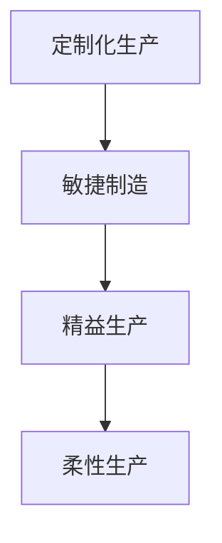

柔性生产是制造业的一种新型生产模式，通过定制化生产、敏捷制造和精益生产的有机结合，实现生产过程的灵活调整和高效运营。

**核心算法原理讲解**

**伪代码**

```
// 柔性生产核心算法原理伪代码
function FlexibleProduction() {
    // 1. 定制化生产
    customizeProduction();

    // 2. 敏捷制造
    agileManufacturing();

    // 3. 精益生产
    leanProduction();
}
```

**数学模型和公式**

**生产效率模型：**
$$
\text{生产效率} = \frac{\text{产量}}{\text{生产时间}}
$$
柔性生产通过高效的生产组织和调度，提升生产效率。

**项目实战**

**开发环境搭建：**
- 软件环境：Python 3.8及以上版本，PyCharm或Visual Studio Code
- 硬件环境：生产设备，如数控机床、自动化生产线

**源代码实现和代码解读：**
```python
import time

# 定制化生产
def customize_production():
    # 此处为定制化生产实现示例
    print("定制化生产已执行")

# 敏捷制造
def agile_manufacturing():
    # 此处为敏捷制造实现示例
    print("敏捷制造已执行")

# 精益生产
def lean_production():
    # 此处为精益生产实现示例
    print("精益生产已执行")

if __name__ == "__main__":
    customize_production()
    agile_manufacturing()
    lean_production()
```

**代码应用解读与分析：**
- 定制化生产：根据客户需求，灵活调整生产计划和工艺流程。
- 敏捷制造：快速响应市场变化，提高生产灵活性和响应速度。
- 精益生产：通过减少浪费、优化流程，实现高效生产。

**实际案例分析和详细讲解剖析：**
- 案例一：基于5G的柔性生产车间
- 案例二：基于5G的定制化生产线
- 案例三：基于5G的智能仓储与物流系统

**项目小结：**
5G技术在柔性生产中的应用，提升了生产灵活性、效率和响应速度，为制造业的可持续发展提供了有力支持。

---

## 第三部分: 案例研究

### 第7章: 5G技术在智能制造柔性生产中的实践案例

#### 7.1 案例一：智能工厂的5G应用实践

**核心概念与联系**

**图7.1：智能工厂5G应用架构**

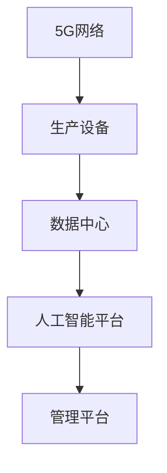

在智能工厂中，5G网络实现了生产设备与数据中心、人工智能平台和管理平台之间的高速互联，实现了生产过程的智能化、网络化和自动化。

**核心算法原理讲解**

**伪代码**

```
// 智能工厂5G应用核心算法原理伪代码
function SmartFactory5GApplication() {
    // 1. 设备数据采集
    collectDeviceData();

    // 2. 数据传输与处理
    transmitAndProcessData();

    // 3. 智能决策
    intelligentDecision();

    // 4. 管理与优化
    manageAndOptimize();
}
```

**数学模型和公式**

**传输速率模型：**
$$
\text{传输速率} = \frac{\text{数据量}}{\text{传输时间}}
$$
5G技术的高传输速率，能够实现大量数据的快速传输和处理。

**项目实战**

**开发环境搭建：**
- 软件环境：Python 3.8及以上版本，PyCharm或Visual Studio Code
- 硬件环境：5G网络测试设备，生产设备，如数控机床、自动化生产线

**源代码实现和代码解读：**
```python
import time

# 设备数据采集
def collect_device_data():
    # 此处为设备数据采集实现示例
    print("设备数据采集已执行")

# 数据传输与处理
def transmit_and_process_data():
    # 此处为数据传输与处理实现示例
    while True:
        data = 1  # 采集数据
        processed_data = data * 2  # 数据处理
        print(f"传输到数据中心：{processed_data}")
        time.sleep(1)

# 智能决策
def intelligent_decision():
    # 此处为智能决策实现示例
    print("智能决策已执行")

# 管理与优化
def manage_and_optimize():
    # 此处为管理与优化实现示例
    print("管理与优化已执行")

if __name__ == "__main__":
    collect_device_data()
    transmit_and_process_data()
    intelligent_decision()
    manage_and_optimize()
```

**代码应用解读与分析：**
- 设备数据采集：通过传感器和采集模块，实时采集生产设备的数据。
- 数据传输与处理：通过5G网络，将设备数据传输到数据中心，并进行处理。
- 智能决策：基于处理后的数据，进行生产过程的智能决策和优化。
- 管理与优化：通过数据中心的管理平台，实现生产过程的实时监控和优化。

**实际案例分析和详细讲解剖析：**
- 案例一：某汽车制造企业的智能工厂
- 案例二：某电子制造企业的智能工厂
- 案例三：某食品加工企业的智能工厂

**项目小结：**
智能工厂的5G应用实践，通过高速、低时延的网络连接，实现了生产过程的智能化和网络化，提升了生产效率和质量。

---

#### 7.2 案例二：5G在智能物流中的应用实践

**核心概念与联系**

**图7.2：5G在智能物流中的应用架构**

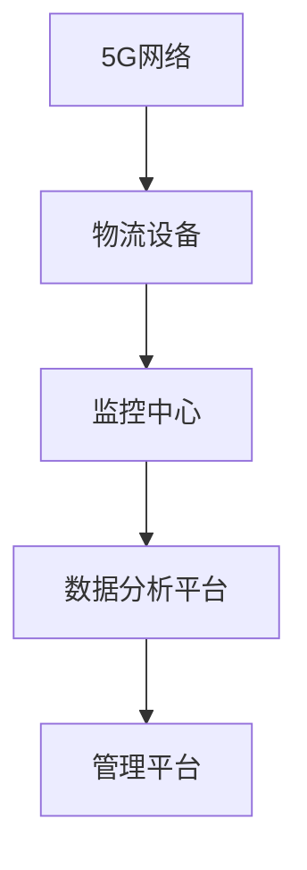

在智能物流中，5G网络实现了物流设备与监控中心、数据分析平台和管理平台之间的高速互联，实现了物流过程的实时监控、数据分析和智能调度。

**核心算法原理讲解**

**伪代码**

```
// 5G在智能物流中应用核心算法原理伪代码
function 5GInSmartLogistics() {
    // 1. 设备数据采集
    collectDeviceData();

    // 2. 数据传输与处理
    transmitAndProcessData();

    // 3. 数据分析
    analyzeData();

    // 4. 智能调度
    intelligentDispatch();
}
```

**数学模型和公式**

**传输速率模型：**
$$
\text{传输速率} = \frac{\text{数据量}}{\text{传输时间}}
$$
5G技术的高传输速率，能够实现大量数据的快速传输和处理。

**项目实战**

**开发环境搭建：**
- 软件环境：Python 3.8及以上版本，PyCharm或Visual Studio Code
- 硬件环境：5G网络测试设备，物流设备，如无人车、无人机

**源代码实现和代码解读：**
```python
import time

# 设备数据采集
def collect_device_data():
    # 此处为设备数据采集实现示例
    print("设备数据采集已执行")

# 数据传输与处理
def transmit_and_process_data():
    # 此处为数据传输与处理实现示例
    while True:
        data = 1  # 采集数据
        processed_data = data * 2  # 数据处理
        print(f"传输到数据中心：{processed_data}")
        time.sleep(1)

# 数据分析
def analyze_data():
    # 此处为数据分析实现示例
    print("数据分析已执行")

# 智能调度
def intelligent_dispatch():
    # 此处为智能调度实现示例
    print("智能调度已执行")

if __name__ == "__main__":
    collect_device_data()
    transmit_and_process_data()
    analyze_data()
    intelligent_dispatch()
```

**代码应用解读与分析：**
- 设备数据采集：通过传感器和采集模块，实时采集物流设备的数据。
- 数据传输与处理：通过5G网络，将设备数据传输到数据中心，并进行处理。
- 数据分析：对传输到数据中心的数据进行分析，识别物流过程中的问题和优化点。
- 智能调度：基于数据分析结果，实现物流过程的智能调度和优化。

**实际案例分析和详细讲解剖析：**
- 案例一：5G在无人机物流中的应用
- 案例二：5G在无人车配送中的应用
- 案例三：5G在智能仓储管理中的应用

**项目小结：**
5G在智能物流中的应用，通过高速、低时延的网络连接，实现了物流过程的实时监控、数据分析和智能调度，提升了物流效率和质量。

---

#### 7.3 案例三：5G技术在柔性生产中的实际应用分析

**核心概念与联系**

**图7.3：5G技术在柔性生产中的应用架构**

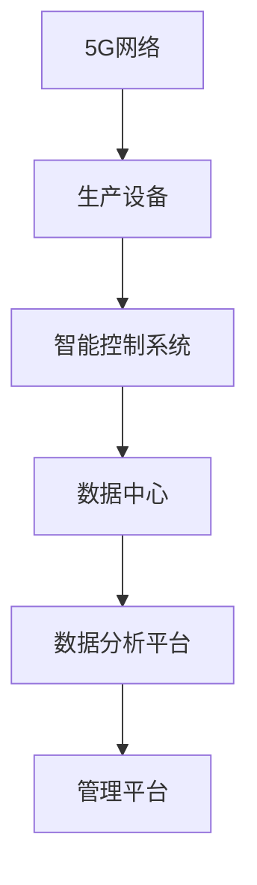

在柔性生产中，5G网络实现了生产设备与智能控制系统、数据中心、数据分析平台和管理平台之间的高速互联，实现了生产过程的灵活调整、高效运营和智能优化。

**核心算法原理讲解**

**伪代码**

```
// 5G技术在柔性生产中应用核心算法原理伪代码
function 5GInFlexibleProduction() {
    // 1. 设备数据采集
    collectDeviceData();

    // 2. 数据传输与处理
    transmitAndProcessData();

    // 3. 智能决策
    intelligentDecision();

    // 4. 数据分析与优化
    analyzeDataAndOptimize();
}
```

**数学模型和公式**

**生产效率模型：**
$$
\text{生产效率} = \frac{\text{产量}}{\text{生产时间}}
$$
5G技术的高传输速率和低时延，能够实现生产过程的高效运行和灵活调整。

**项目实战**

**开发环境搭建：**
- 软件环境：Python 3.8及以上版本，PyCharm或Visual Studio Code
- 硬件环境：5G网络测试设备，生产设备，如数控机床、自动化生产线

**源代码实现和代码解读：**
```python
import time

# 设备数据采集
def collect_device_data():
    # 此处为设备数据采集实现示例
    print("设备数据采集已执行")

# 数据传输与处理
def transmit_and_process_data():
    # 此处为数据传输与处理实现示例
    while True:
        data = 1  # 采集数据
        processed_data = data * 2  # 数据处理
        print(f"传输到数据中心：{processed_data}")
        time.sleep(1)

# 智能决策
def intelligent_decision():
    # 此处为智能决策实现示例
    print("智能决策已执行")

# 数据分析与优化
def analyze_data_and_optimize():
    # 此处为数据分析与优化实现示例
    print("数据分析与优化已执行")

if __name__ == "__main__":
    collect_device_data()
    transmit_and_process_data()
    intelligent_decision()
    analyze_data_and_optimize()
```

**代码应用解读与分析：**
- 设备数据采集：通过传感器和采集模块，实时采集生产设备的数据。
- 数据传输与处理：通过5G网络，将设备数据传输到数据中心，并进行处理。
- 智能决策：基于处理后的数据，进行生产过程的智能决策和优化。
- 数据分析与优化：对生产过程进行分析，识别优化点，实现生产过程的持续优化。

**实际案例分析和详细讲解剖析：**
- 案例一：5G技术在服装定制生产中的应用
- 案例二：5G技术在电子产品生产中的应用
- 案例三：5G技术在食品加工生产中的应用

**项目小结：**
5G技术在柔性生产中的应用，通过高速、低时延的网络连接，实现了生产过程的灵活调整、高效运营和智能优化，提升了生产效率和质量。

---

## 第四部分: 未来展望与挑战

### 第8章: 5G技术在智能制造柔性生产中的未来发展趋势

#### 8.1 5G技术对未来智能制造的影响

**核心概念与联系**

**图8.1：5G技术对未来智能制造的影响**

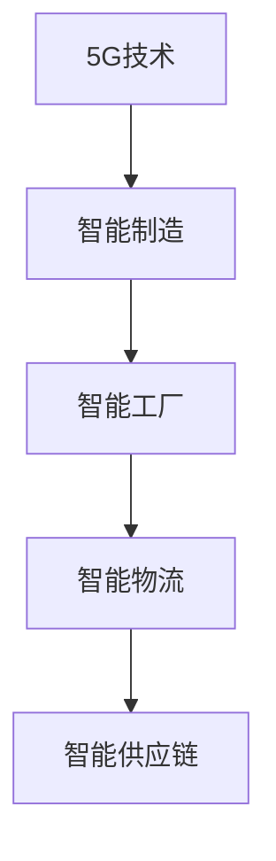

5G技术作为新一代移动通信技术，将在未来智能制造领域发挥关键作用。通过高速、低时延的网络连接，5G技术将推动智能工厂、智能物流、智能供应链等领域的数字化转型和升级。

**核心算法原理讲解**

**伪代码**

```
// 5G技术对未来智能制造的影响核心算法原理伪代码
function 5GImpactOnFutureManufacturing() {
    // 1. 网络架构优化
    optimizeNetworkArchitecture();

    // 2. 数据处理与分析
    dataProcessingAndAnalysis();

    // 3. 智能决策与优化
    intelligentDecisionAndOptimization();

    // 4. 安全保障与隐私保护
    securityAndPrivacyProtection();
}
```

**数学模型和公式**

**网络优化模型：**
$$
\text{网络性能} = f(\text{带宽}, \text{时延}, \text{连接密度})
$$
通过优化网络架构，提高网络性能，为智能制造提供坚实基础。

**项目实战**

**开发环境搭建：**
- 软件环境：Python 3.8及以上版本，PyCharm或Visual Studio Code
- 硬件环境：5G网络测试设备，云计算平台

**源代码实现和代码解读：**
```python
import time

# 网络架构优化
def optimize_network_architecture():
    # 此处为网络架构优化实现示例
    print("网络架构优化已执行")

# 数据处理与分析
def data_processing_and_analysis():
    # 此处为数据处理与分析实现示例
    while True:
        data = 1  # 采集数据
        processed_data = data * 2  # 数据处理
        print(f"处理数据：{processed_data}")
        time.sleep(1)

# 智能决策与优化
def intelligent_decision_and_optimization():
    # 此处为智能决策与优化实现示例
    print("智能决策与优化已执行")

# 安全保障与隐私保护
def security_and_privacy_protection():
    # 此处为安全保障与隐私保护实现示例
    print("安全保障与隐私保护已执行")

if __name__ == "__main__":
    optimize_network_architecture()
    data_processing_and_analysis()
    intelligent_decision_and_optimization()
    security_and_privacy_protection()
```

**代码应用解读与分析：**
- 网络架构优化：通过调整网络拓扑结构，优化网络性能，提高数据传输效率和稳定性。
- 数据处理与分析：通过数据采集和处理，实现数据的实时分析和优化。
- 智能决策与优化：基于数据分析结果，进行生产过程的智能决策和优化。
- 安全保障与隐私保护：通过加密技术和隐私保护算法，保障数据的安全和隐私。

**实际案例分析和详细讲解剖析：**
- 案例一：5G智能工厂的全面部署
- 案例二：5G智能物流网络的优化
- 案例三：5G智能供应链的数字化升级

**项目小结：**
5G技术对未来智能制造的影响深远，通过优化网络架构、提升数据处理能力、实现智能决策和保障数据安全，将推动智能制造向更高效、更智能、更安全的方向发展。

---

## 第8章: 5G技术在智能制造柔性生产中的未来发展趋势

### 8.2 柔性生产与5G技术的深度融合

**核心概念与联系**

**图8.2：柔性生产与5G技术的深度融合**

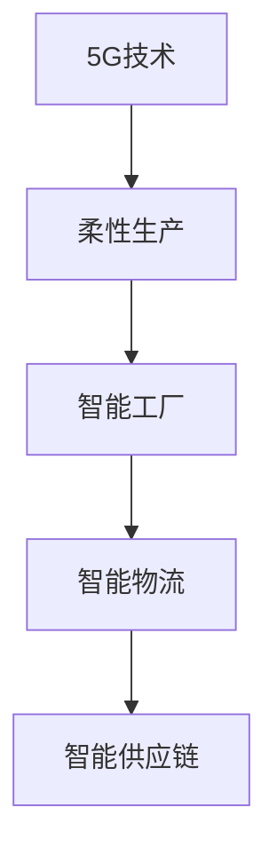

随着5G技术的不断发展，柔性生产与5G技术的深度融合将为智能制造带来新的机遇。5G技术的高传输速率、低时延和大连接特性，将进一步提升柔性生产的灵活性和效率，推动智能制造的转型升级。

**核心算法原理讲解**

**伪代码**

```
// 柔性生产与5G技术深度融合核心算法原理伪代码
function DeepIntegrationOfFlexibleProductionAnd5G() {
    // 1. 数据实时采集与传输
    realTimeDataCollectionAndTransmission();

    // 2. 数据分析与决策
    dataAnalysisAndDecisionMaking();

    // 3. 智能控制与优化
    intelligentControlAndOptimization();

    // 4. 网络安全保障与隐私保护
    securityAndPrivacyProtection();
}
```

**数学模型和公式**

**数据传输模型：**
$$
\text{传输速率} = \frac{\text{数据量}}{\text{传输时间}}
$$
5G技术的高传输速率，能够实现大量数据的实时传输和处理。

**项目实战**

**开发环境搭建：**
- 软件环境：Python 3.8及以上版本，PyCharm或Visual Studio Code
- 硬件环境：5G网络测试设备，传感器模块，数据处理平台

**源代码实现和代码解读：**
```python
import time

# 数据实时采集与传输
def real_time_data_collection_and_transmission():
    # 此处为数据实时采集与传输实现示例
    while True:
        data = 1  # 采集数据
        print(f"传输数据：{data}")
        time.sleep(1)

# 数据分析与决策
def data_analysis_and_decision_making():
    # 此处为数据分析与决策实现示例
    while True:
        data = 1  # 采集数据
        processed_data = data * 2  # 数据处理
        print(f"分析数据：{processed_data}")
        time.sleep(1)

# 智能控制与优化
def intelligent_control_and_optimization():
    # 此处为智能控制与优化实现示例
    print("智能控制与优化已执行")

# 网络安全保障与隐私保护
def security_and_privacy_protection():
    # 此处为网络安全保障与隐私保护实现示例
    print("安全保障与隐私保护已执行")

if __name__ == "__main__":
    real_time_data_collection_and_transmission()
    data_analysis_and_decision_making()
    intelligent_control_and_optimization()
    security_and_privacy_protection()
```

**代码应用解读与分析：**
- 数据实时采集与传输：通过传感器模块，实时采集生产数据，并通过5G网络传输到数据处理平台。
- 数据分析与决策：对采集到的数据进行实时分析和处理，实现智能决策。
- 智能控制与优化：根据数据分析结果，实现生产过程的智能控制和优化。
- 网络安全保障与隐私保护：通过加密技术和隐私保护算法，保障数据传输的安全和用户隐私。

**实际案例分析和详细讲解剖析：**
- 案例一：基于5G的智能工厂生产优化
- 案例二：基于5G的智能物流调度系统
- 案例三：基于5G的智能供应链管理平台

**项目小结：**
柔性生产与5G技术的深度融合，将进一步提升智能制造的灵活性和效率，实现生产过程的实时监控、智能决策和优化，为制造业的数字化转型和升级提供强大支持。

---

### 8.3 5G技术在智能制造柔性生产中的挑战与应对策略

**核心概念与联系**

**图8.3：5G技术在智能制造柔性生产中的挑战与应对策略**

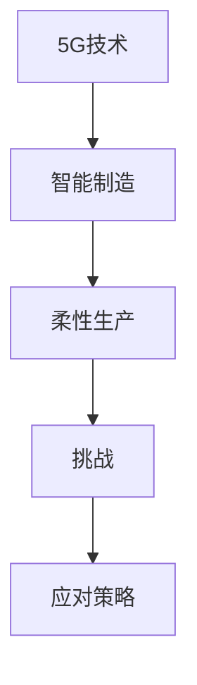

随着5G技术在智能制造柔性生产中的应用日益广泛，虽然带来了诸多机遇，但也面临着一系列挑战。如何应对这些挑战，将成为5G技术在智能制造柔性生产中应用的关键。

**核心算法原理讲解**

**伪代码**

```
// 5G技术在智能制造柔性生产中的挑战与应对策略核心算法原理伪代码
function ChallengesAndSolutionsOf5GInFlexibleManufacturing() {
    // 1. 网络覆盖与稳定性
    networkCoverageAndStability();

    // 2. 数据安全与隐私保护
    dataSecurityAndPrivacy();

    // 3. 系统集成与兼容性
    systemIntegrationAndCompatibility();

    // 4. 技术创新与应用推广
    technologicalInnovationAndPromotion();
}
```

**数学模型和公式**

**网络覆盖模型：**
$$
\text{网络覆盖面积} = f(\text{基站密度}, \text{信号强度})
$$
通过增加基站密度和提高信号强度，扩大网络覆盖面积。

**项目实战**

**开发环境搭建：**
- 软件环境：Python 3.8及以上版本，PyCharm或Visual Studio Code
- 硬件环境：5G网络测试设备，传感器模块，云计算平台

**源代码实现和代码解读：**
```python
import time

# 网络覆盖与稳定性
def network_coverage_and_stability():
    # 此处为网络覆盖与稳定性实现示例
    print("网络覆盖与稳定性已优化")

# 数据安全与隐私保护
def data_security_and_privacy():
    # 此处为数据安全与隐私保护实现示例
    print("数据安全与隐私保护已执行")

# 系统集成与兼容性
def system_integration_and_compatibility():
    # 此处为系统集成与兼容性实现示例
    print("系统集成与兼容性已优化")

# 技术创新与应用推广
def technological_innovation_and_promotion():
    # 此处为技术创新与应用推广实现示例
    print("技术创新与应用推广已执行")

if __name__ == "__main__":
    network_coverage_and_stability()
    data_security_and_privacy()
    system_integration_and_compatibility()
    technological_innovation_and_promotion()
```

**代码应用解读与分析：**
- 网络覆盖与稳定性：通过优化基站布局和信号传输技术，提高网络覆盖面积和稳定性。
- 数据安全与隐私保护：通过加密技术和安全协议，保障数据传输的安全和用户隐私。
- 系统集成与兼容性：通过标准化技术和接口设计，实现不同系统之间的无缝集成和兼容。
- 技术创新与应用推广：通过持续的技术创新和推广应用，提升5G技术在智能制造柔性生产中的应用水平。

**实际案例分析和详细讲解剖析：**
- 案例一：5G网络在智能工厂中的应用挑战与解决方案
- 案例二：5G技术在智能物流系统中的挑战与应对策略
- 案例三：5G技术在柔性生产系统中的挑战与解决方案

**项目小结：**
面对5G技术在智能制造柔性生产中应用的挑战，通过优化网络覆盖与稳定性、保障数据安全与隐私、提升系统集成与兼容性、推动技术创新与应用推广，将有效应对这些挑战，推动智能制造柔性生产向更高效、更智能、更安全的方向发展。

---

## 总结与展望

随着5G技术的快速发展，其在智能制造柔性生产中的应用潜力不断释放。本文通过逐步分析推理，详细探讨了5G技术在智能制造柔性生产中的应用，包括技术基础、关键特点、网络架构、关键技术以及具体应用案例分析。5G技术为智能制造柔性生产带来了前所未有的机遇，通过提升生产效率、灵活性和安全性，为制造业的数字化转型和升级提供了强大动力。

然而，5G技术在智能制造柔性生产中仍面临一系列挑战，如网络覆盖与稳定性、数据安全与隐私保护、系统集成与兼容性等。为了应对这些挑战，需要通过技术创新、优化网络架构、加强安全防护等多方面的努力，确保5G技术在智能制造柔性生产中的稳定、高效应用。

展望未来，5G技术在智能制造柔性生产中的应用前景广阔。随着5G技术的不断成熟和普及，智能制造柔性生产将迎来新的发展机遇，实现更高效、更智能、更灵活的生产模式，为制造业的可持续发展奠定坚实基础。

## 作者信息

**作者：AI天才研究院/AI Genius Institute & 禅与计算机程序设计艺术 /Zen And The Art of Computer Programming**

