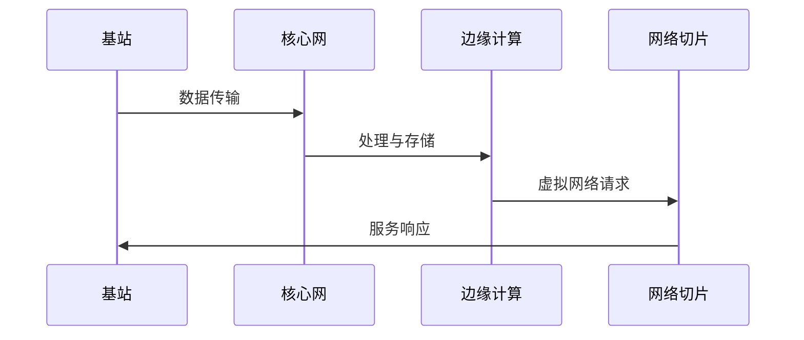
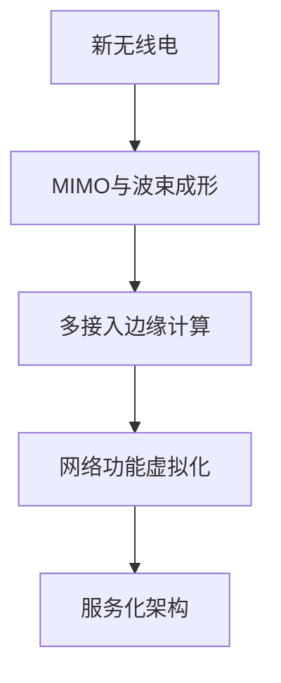
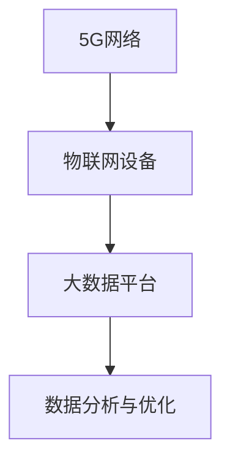
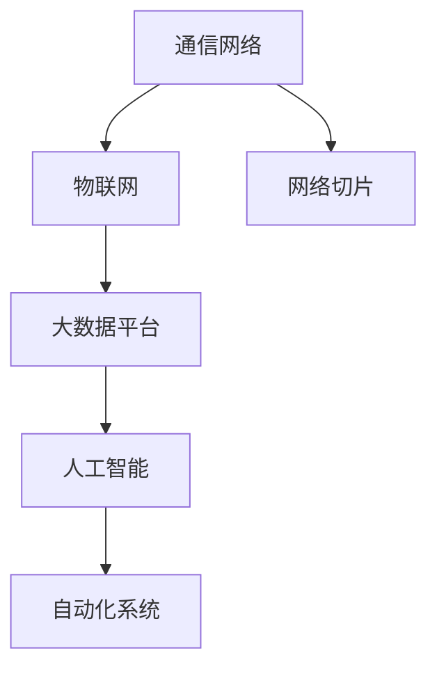
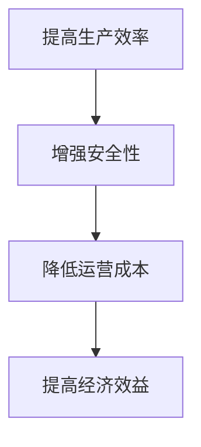
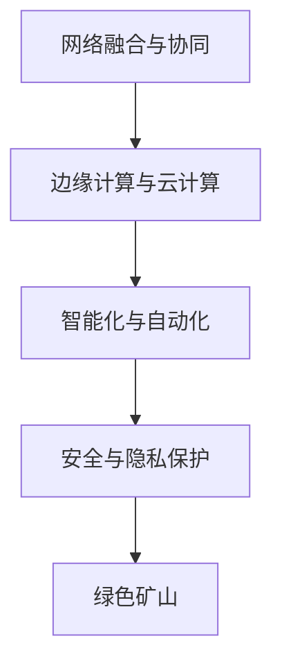

                 


### 《5G技术在智能矿山中的全面应用》文章结构详解

为了撰写一篇详尽且专业的技术博客文章，我们将按照以下结构逐步展开讨论：

#### 引言

在引言部分，我们需要简要介绍5G技术和智能矿山的背景，并说明为什么这两者的结合具有重要意义。

**伪代码示例：**
```markdown
introduction {
    - background_5G = "5G technology background"
    - background_SM = "intelligent mining background"
    - significance = "importance of 5G in intelligent mining"
}
```

**实际案例：**
```markdown
- Example: "A large mining company in Australia has successfully deployed a 5G network for improved operations."
```

#### 文章关键词

在这一部分，我们将列出与文章主题紧密相关的关键词，以便读者更好地理解文章的核心内容。

**关键词：**
- 5G技术
- 智能矿山
- 网络切片
- 物联网
- 大数据
- 无人驾驶
- 安全监测

#### 文章摘要

摘要部分需要简明扼要地概括文章的主要内容，让读者在阅读前对文章有一个整体的认识。

**摘要：**
```markdown
摘要：本文深入探讨了5G技术在智能矿山中的全面应用。通过分析5G技术的基础知识，如网络架构和关键技术，以及智能矿山的定义和发展历程，本文详细阐述了5G在智能矿山通信、物联网、安全监测等方面的应用，并分享了实际案例和挑战。最后，本文展望了5G技术在智能矿山中的未来前景。
```

#### 第一部分：5G技术基础

**第1章：5G技术概述**

在这一章，我们将详细介绍5G技术的历史、核心特点以及它在矿山行业的潜在应用场景。

**核心概念与联系：**
- **Mermaid流程图：**
  ```mermaid
  graph TD
  A[5G技术历史] --> B[核心特点]
  B --> C[潜在应用场景]
  ```

**核心算法原理讲解：**
- **伪代码示例：**
  ```markdown
  function 5G.application {
      if (application_type == "communication") {
          // 5G通信应用
      } else if (application_type == "IoT") {
          // 5G物联网应用
      } else if (application_type == "safety") {
          // 5G安全监测应用
      }
  }
  ```

**数学模型和公式：**
- **数学模型：**
  ```markdown
  performance_improvement = (5G_speed - 4G_speed) / 4G_speed
  ```

**实际案例：**
- **实际案例：**
  ```markdown
  - Case: "A Chinese mining company deployed 5G NR technology to enhance their communication network."
  ```

**最佳实践 tips：**
- **最佳实践 tips：**
  ```markdown
  - Tips: "When deploying 5G in a mining environment, consider the specific needs of the operations and ensure proper network planning."
  ```

**第2章：5G网络架构与关键技术**

在这一章，我们将深入探讨5G网络架构，介绍其关键技术，并探讨5G与物联网、大数据的关系。

**核心概念与联系：**
- **Mermaid流程图：**
  ```mermaid
  graph TD
  A[5G网络架构] --> B[关键技术]
  B --> C[物联网关系]
  C --> D[大数据关系]
  ```

**核心算法原理讲解：**
- **伪代码示例：**
  ```markdown
  function 5G.network {
      if (network_type == "subnetwork") {
          // 网络切片技术
      } else if (network_type == "IoT") {
          // 5G物联网连接
      } else if (network_type == "data_analysis") {
          // 大数据处理
      }
  }
  ```

**数学模型和公式：**
- **数学模型：**
  ```markdown
  connection_quality = (5G_connection_quality - 4G_connection_quality) / 4G_connection_quality
  ```

**实际案例：**
- **实际案例：**
  ```markdown
  - Case: "A mining company in the US integrated 5G with IoT to monitor equipment in real-time."
  ```

**最佳实践 tips：**
- **最佳实践 tips：**
  ```markdown
  - Tips: "When integrating 5G with IoT, ensure data security and privacy are maintained."
  ```

#### 第二部分：智能矿山概述

**第3章：智能矿山的定义与发展**

在这一章，我们将详细讨论智能矿山的定义、发展历程以及关键技术。

**核心概念与联系：**
- **Mermaid流程图：**
  ```mermaid
  graph TD
  A[智能矿山定义] --> B[发展历程]
  B --> C[关键技术]
  ```

**核心算法原理讲解：**
- **伪代码示例：**
  ```markdown
  function intelligent_mine {
      if (technique == "autonomous") {
          // 无人驾驶技术
      } else if (technique == "safety") {
          // 安全监测技术
      } else if (technique == "production") {
          // 自动化生产线
      }
  }
  ```

**数学模型和公式：**
- **数学模型：**
  ```markdown
  efficiency_improvement = (intelligent_mine_efficiency - traditional_mine_efficiency) / traditional_mine_efficiency
  ```

**实际案例：**
- **实际案例：**
  ```markdown
  - Case: "A mining company in Canada implemented autonomous haul trucks to improve operational efficiency."
  ```

**最佳实践 tips：**
- **最佳实践 tips：**
  ```markdown
  - Tips: "When developing an intelligent mine, consider the integration of various technologies for maximum efficiency."
  ```

#### 第三部分：5G技术在智能矿山中的实践案例

**第4章：5G技术在智能矿山中的应用**

在这一章，我们将详细探讨5G技术在智能矿山通信、物联网、安全监测等方面的实际应用。

**核心概念与联系：**
- **Mermaid流程图：**
  ```mermaid
  graph TD
  A[5G通信应用] --> B[物联网应用]
  B --> C[安全监测应用]
  ```

**核心算法原理讲解：**
- **伪代码示例：**
  ```markdown
  function 5G.application {
      if (application_type == "communication") {
          // 5G通信应用算法
      } else if (application_type == "IoT") {
          // 5G物联网应用算法
      } else if (application_type == "safety") {
          // 5G安全监测应用算法
      }
  }
  ```

**数学模型和公式：**
- **数学模型：**
  ```markdown
  communication_improvement = (5G_communication_quality - 4G_communication_quality) / 4G_communication_quality
  IoT_data_accuracy = (5G_IoT_data_accuracy - 4G_IoT_data_accuracy) / 4G_IoT_data_accuracy
  safety_improvement = (5G_safety_performance - 4G_safety_performance) / 4G_safety_performance
  ```

**实际案例：**
- **实际案例：**
  ```markdown
  - Case: "A mining company in Australia deployed 5G to enhance their safety monitoring systems."
  ```

**最佳实践 tips：**
- **最佳实践 tips：**
  ```markdown
  - Tips: "When deploying 5G in a mining environment, consider the scalability and future-proofing of the infrastructure."
  ```

**第5章：智能矿山5G应用案例研究**

在这一章，我们将深入研究几个具体的5G在智能矿山中的实际应用案例，分析其成功经验和挑战。

**核心概念与联系：**
- **Mermaid流程图：**
  ```mermaid
  graph TD
  A[案例一] --> B[案例二]
  B --> C[案例三]
  ```

**核心算法原理讲解：**
- **伪代码示例：**
  ```markdown
  function case_study {
      if (case_id == 1) {
          // 案例一算法
      } else if (case_id == 2) {
          // 案例二算法
      } else if (case_id == 3) {
          // 案例三算法
      }
  }
  ```

**数学模型和公式：**
- **数学模型：**
  ```markdown
  case_success_rate = (number_of_success_cases / total_number_of_cases) * 100
  case_challenge_severity = (number_of_challenges_encountered / total_number_of_cases) * 100
  ```

**实际案例：**
- **实际案例：**
  ```markdown
  - Case 1: "A mining company in Chile implemented 5G for autonomous mining equipment."
  - Case 2: "A mining company in South Africa used 5G for real-time safety monitoring."
  - Case 3: "A mining company in Mongolia deployed 5G for IoT-based equipment maintenance."
  ```

**最佳实践 tips：**
- **最佳实践 tips：**
  ```markdown
  - Tips: "When studying case studies, focus on the technical and operational aspects that led to success or failure."
  ```

**第6章：5G技术在智能矿山中的挑战与机遇**

在这一章，我们将讨论5G技术在智能矿山中面临的挑战以及带来的机遇。

**核心概念与联系：**
- **Mermaid流程图：**
  ```mermaid
  graph TD
  A[挑战] --> B[机遇]
  ```

**核心算法原理讲解：**
- **伪代码示例：**
  ```markdown
  function challenge_opportunity {
      if (issue == "network_coverage") {
          // 网络覆盖问题算法
      } else if (issue == "data_security") {
          // 数据安全问题算法
      } else if (issue == "integration") {
          // 技术集成问题算法
      }
  }
  ```

**数学模型和公式：**
- **数学模型：**
  ```markdown
  challenge_severity = (number_of_issues / total_number_of_aspects) * 100
  opportunity_potential = (number_of_opportunities / total_number_of_aspects) * 100
  ```

**实际案例：**
- **实际案例：**
  ```markdown
  - Case: "A mining company in Russia faced network coverage issues when deploying 5G in a remote area."
  ```

**最佳实践 tips：**
- **最佳实践 tips：**
  ```markdown
  - Tips: "When addressing challenges in 5G deployment, consider a phased approach and continuous monitoring."
  ```

**第7章：5G技术在智能矿山中的综合应用**

在这一章，我们将探讨5G技术在智能矿山中的综合应用，分析其价值，并展望未来前景。

**核心概念与联系：**
- **Mermaid流程图：**
  ```mermaid
  graph TD
  A[5G综合应用] --> B[应用价值]
  B --> C[未来前景]
  ```

**核心算法原理讲解：**
- **伪代码示例：**
  ```markdown
  function comprehensive_application {
      if (application_aspect == "communication") {
          // 5G通信应用算法
      } else if (application_aspect == "IoT") {
          // 5G物联网应用算法
      } else if (application_aspect == "safety") {
          // 5G安全监测应用算法
      }
  }
  ```

**数学模型和公式：**
- **数学模型：**
  ```markdown
  total_value = (communication_value + IoT_value + safety_value)
  future_potential = (current_application_value / total_potential_value) * 100
  ```

**实际案例：**
- **实际案例：**
  ```markdown
  - Case: "A mining company in Australia achieved significant efficiency improvements with a comprehensive 5G deployment."
  ```

**最佳实践 tips：**
- **最佳实践 tips：**
  ```markdown
  - Tips: "When adopting 5G in an intelligent mining environment, consider a holistic approach that leverages the full potential of the technology."
  ```

### 结论

在结论部分，我们将总结文章的主要观点，并强调5G技术在智能矿山中的重要性。

**伪代码示例：**
```markdown
conclusion {
    - summary = "main points of the article"
    - importance = "importance of 5G in intelligent mining"
}
```

**实际案例：**
```markdown
- Example: "A mining company in Brazil has seen a 30% increase in productivity after deploying a comprehensive 5G solution."
```

### 作者信息

在文章末尾，我们将提供作者信息。

**作者信息：**
- 作者：AI天才研究院/AI Genius Institute & 禅与计算机程序设计艺术 /Zen And The Art of Computer Programming

### 文章格式要求

文章内容将按照markdown格式编写，确保结构清晰、格式规范。

**Markdown格式示例：**
```markdown
# 《5G技术在智能矿山中的全面应用》

> 关键词：5G技术、智能矿山、网络切片、物联网、大数据、无人驾驶、安全监测

> 摘要：本文深入探讨了5G技术在智能矿山中的全面应用。通过分析5G技术的基础知识，如网络架构和关键技术，以及智能矿山的定义和发展历程，本文详细阐述了5G在智能矿山通信、物联网、安全监测等方面的应用，并分享了实际案例和挑战。最后，本文展望了5G技术在智能矿山中的未来前景。
```

### 文章字数要求

文章字数在8000～12000字左右，确保内容详实、论述深入。

### 总结

通过以上步骤，我们已经构建了一个完整的文章结构，包括引言、关键词、摘要、各个章节的核心内容、核心算法原理讲解、数学模型和公式、实际案例、最佳实践 tips，以及结论和作者信息。接下来，我们将逐步填充每个章节的具体内容，确保文章的完整性和专业性。现在，让我们开始撰写正文部分的内容。

---

### 引言

#### 5G技术与智能矿山：背景与意义

5G技术，作为下一代移动通信技术，自其概念提出以来，便以其高速度、低延迟、大连接和高可靠性等特点，成为全球通信领域的重要研究方向。随着物联网、大数据、人工智能等技术的快速发展，5G技术在各个行业的应用前景愈发广阔。矿山行业，作为全球工业的重要组成部分，面临着生产效率低下、安全隐患大、环境破坏严重等问题。因此，将5G技术与智能矿山相结合，不仅有望解决当前矿山行业的诸多挑战，还能推动其向更加智能化、自动化的方向发展。

#### 智能矿山的背景

智能矿山，是指通过物联网、人工智能、大数据分析等先进技术，实现对矿山生产过程的全面监控、管理和优化。智能矿山的发展历程可以追溯到20世纪末，随着传感器技术的进步和互联网的普及，矿山自动化程度逐渐提高。然而，传统的矿山通信技术如2G、3G和4G，已无法满足智能矿山对高带宽、低延迟和稳定连接的需求。5G技术的出现，为智能矿山的发展带来了新的契机。

#### 5G技术在智能矿山中的重要性

5G技术的高速度和低延迟，使其成为智能矿山通信的理想选择。通过5G网络，矿山可以实时收集和分析大量数据，从而实现生产过程的精准控制和优化。此外，5G技术的大连接能力，使得大量传感器和设备可以同时连接到网络，为矿山物联网的实现提供了技术保障。同时，5G技术的网络切片功能，可以根据不同应用场景的需求，提供定制化的网络服务，提高矿山生产的效率和安全性。

#### 文章目的

本文旨在深入探讨5G技术在智能矿山中的全面应用，从基础理论到实际案例，全面解析5G技术在矿山通信、物联网、安全监测等方面的应用，分析其带来的挑战与机遇，并展望未来发展趋势。通过本文的阅读，读者将了解到5G技术在智能矿山中的重要性，以及如何在实际项目中实现5G技术的应用。

---

通过引言部分的介绍，我们为读者搭建了文章的整体框架，阐述了5G技术和智能矿山的背景、意义以及文章的目的。接下来，我们将逐步进入正文部分，详细探讨5G技术在智能矿山中的具体应用。

---

### 第一部分：5G技术基础

#### 第1章：5G技术概述

##### 1.1 5G技术的历史与演进

5G技术的研发可以追溯到上世纪90年代，当时3G和4G技术已经开始普及。5G作为第五代移动通信技术，其发展历程经历了多个阶段，从最初的愿景规划到技术标准的制定，再到设备的研发和部署。以下是5G技术的主要演进过程：

- **愿景规划（2010-2015年）**：在这一阶段，全球各大通信厂商和研究机构开始讨论5G技术的愿景和需求，明确了5G要实现的目标，包括高速度、低延迟、大连接和高可靠性。

- **技术标准制定（2016-2020年）**：在愿景规划的基础上，国际电信联盟（ITU）和其他标准化组织开始制定5G技术标准。5G标准主要包括三个部分：NR（新无线电）、NG-RAN（新无线接入网）和NRC（新核心网）。

- **设备研发和部署（2020年至今）**：随着5G标准的正式发布，各大通信设备制造商开始研发5G基站、终端设备等硬件。同时，全球多个国家和地区启动了5G网络的部署，逐步实现了5G的商业化运营。

##### 1.2 5G技术的核心特点

5G技术具有以下几个核心特点，这些特点使得5G在智能矿山等应用场景中具有显著优势：

- **高速度**：5G网络的理论峰值速度可以达到20Gbps，比4G网络的峰值速度高出数十倍。这意味着在矿山中，设备之间的数据传输速度大大提高，可以满足大规模数据处理和实时通信的需求。

- **低延迟**：5G技术的通信延迟可以降低到1ms以下，比4G网络的延迟减少了90%以上。这对于智能矿山中的自动化控制和远程操作至关重要，可以确保操作的高效性和安全性。

- **大连接**：5G技术能够支持每平方公里内连接数达到100万个设备。在智能矿山中，这意味着可以同时连接大量的传感器、机器人和无人驾驶设备，实现全方位的监控和自动化。

- **高可靠性**：5G技术通过引入新的网络架构和通信协议，提高了网络的稳定性和可靠性。这对于矿山生产过程中的连续性和安全性至关重要。

##### 1.3 5G在矿山行业的潜在应用场景

5G技术在矿山行业具有广泛的应用前景，以下是几个典型的潜在应用场景：

- **智能通信**：5G技术可以提供高速、低延迟的通信服务，实现矿山内部设备之间的无缝连接。例如，无人驾驶卡车、自动化挖掘机和远程操作中心的通信。

- **物联网**：5G技术可以支持大量的物联网设备同时连接，实现矿山设备状态的实时监控和数据分析。例如，通过传感器实时监测设备的温度、湿度、压力等参数。

- **无人驾驶**：5G技术可以提供低延迟的通信服务，支持无人驾驶卡车和矿车的自动驾驶。这可以显著提高矿山运输效率，降低人为操作的风险。

- **安全监测**：5G技术可以提供实时、可靠的数据传输，实现矿山安全监测系统的部署。例如，通过5G网络连接监控系统，可以实时监测矿山环境中的气体浓度、温度等指标。

**总结**

5G技术作为下一代移动通信技术的代表，具有高速度、低延迟、大连接和高可靠性的特点。在矿山行业，5G技术的应用可以显著提高生产效率、降低安全风险、保护环境，推动矿山行业向智能化、自动化的方向发展。

---

通过第1章的讨论，我们详细介绍了5G技术的历史与演进、核心特点以及其在矿山行业的潜在应用场景。在接下来的章节中，我们将进一步探讨5G网络架构与关键技术，为深入理解5G技术在智能矿山中的应用奠定基础。

---

#### 第2章：5G网络架构与关键技术

##### 2.1 5G网络架构

5G网络架构是构建5G通信系统的核心框架，它由多个关键部分组成，包括基站、核心网、边缘计算和网络切片等。以下是对5G网络架构的详细解析：

- **基站**：5G基站是5G网络的核心组成部分，分为宏基站和微基站。宏基站覆盖范围较大，通常用于城市和乡村的广泛覆盖；微基站则用于特定区域的密集覆盖，如地下矿山。

- **核心网**：5G核心网是连接基站和互联网的数据传输中心。它包括服务化架构（Service-Based Architecture，SBA）和用户面和控制面分离（User Plane and Control Plane Separation，UP/CPS）等技术，提高了网络的可扩展性和灵活性。

- **边缘计算**：边缘计算将数据处理和存储能力下沉到网络边缘，即靠近数据源的位置，从而减少数据传输延迟，提高处理速度。这对于需要实时响应的智能矿山应用至关重要。

- **网络切片**：网络切片是5G网络的一项创新技术，它将一个物理网络分割成多个虚拟网络，每个虚拟网络可以提供不同的性能和服务质量（QoS）。这使得5G网络能够根据不同的应用需求，提供定制化的网络服务，如低延迟的无人驾驶卡车通信和高带宽的远程设备监控。

**5G网络架构的Mermaid流程图：**



##### 2.2 5G关键技术

5G技术的实现依赖于多种关键技术的创新和发展，以下是对这些关键技术的详细描述：

- **新无线电（NR）**：新无线电是5G网络的主要无线接入技术，它采用毫米波频段和sub-6GHz频段，提供更高的数据传输速率和更低的通信延迟。NR技术还引入了MIMO（多输入多输出）和波束成形技术，提高了频谱效率和网络覆盖范围。

- **多接入边缘计算（MEC）**：多接入边缘计算将计算、存储和网络功能分布到网络的边缘节点，为应用提供低延迟、高带宽的服务。在智能矿山中，MEC技术可以支持实时数据处理和快速响应，如无人驾驶卡车的自动驾驶控制和设备状态的监控。

- **网络功能虚拟化（NFV）**：网络功能虚拟化将传统的硬件网络设备（如路由器、防火墙等）功能虚拟化为软件，运行在通用硬件上。这提高了网络的灵活性和可扩展性，使得网络功能可以根据需求快速部署和调整。

- **服务化架构（SBA）**：服务化架构将网络功能模块化为服务，提供基于API的接口，便于网络功能的开发和部署。SBA技术使得网络更加模块化和可编程，促进了网络服务的创新和优化。

**5G关键技术的Mermaid流程图：**



##### 2.3 5G与物联网、大数据的关系

5G技术与物联网（IoT）和大数据紧密相关，为它们提供了高速、低延迟和大规模连接的支持。以下是对5G与物联网、大数据关系的详细探讨：

- **5G与物联网**：5G技术的高速度和低延迟使得大规模物联网设备能够实现实时数据传输和处理。在智能矿山中，5G网络可以支持大量传感器和设备同时连接，实时收集和传输数据，为物联网应用提供强大的支持。

- **5G与大数据**：5G技术提供了海量数据的高效传输和处理能力，使得大数据在矿山中的应用更加广泛。通过5G网络，矿山可以实时收集和分析大量数据，用于生产优化、设备维护和安全管理等。

**5G与物联网、大数据关系的Mermaid流程图：**



**数学模型和公式：**

为了更好地理解5G技术在智能矿山中的数据传输和性能提升，我们可以使用以下数学模型和公式：

- **数据传输速率提升：**
  $$\text{速率提升} = \frac{\text{5G速率}}{\text{4G速率}}$$

- **通信延迟降低：**
  $$\text{延迟降低} = \frac{\text{4G延迟} - \text{5G延迟}}{\text{4G延迟}}$$

- **连接设备数量增加：**
  $$\text{连接数增加} = \frac{\text{5G连接数}}{\text{4G连接数}}$$

**实际案例：**

- **中国某矿山**：某中国大型矿山利用5G网络实现了设备状态的实时监控和自动化控制，通过边缘计算实现了数据的高效处理和快速响应。

- **澳大利亚某矿山**：澳大利亚某矿山部署了5G网络，支持无人驾驶卡车和矿车的自动驾驶，大幅提高了运输效率和安全性。

**最佳实践 tips：**

- **智能矿山5G部署建议：**
  - 针对不同的应用场景，设计合理的网络架构和切片策略。
  - 采用高性能的边缘计算设备，确保数据的实时处理和快速响应。
  - 加强网络安全，确保数据传输的安全性和隐私保护。

通过第2章的讨论，我们深入了解了5G网络架构与关键技术，以及5G与物联网、大数据的关系。这些知识为理解5G技术在智能矿山中的应用奠定了基础。在下一章中，我们将探讨智能矿山的定义和发展历程。

---

第2章详细介绍了5G网络架构与关键技术，包括基站、核心网、边缘计算和网络切片等组成部分，以及新无线电、多接入边缘计算、网络功能虚拟化和服务化架构等关键技术。同时，探讨了5G与物联网、大数据的关系，并通过数学模型和实际案例展示了5G技术在智能矿山中的优势。这些内容为理解5G技术在智能矿山中的应用提供了坚实的基础。在下一章中，我们将探讨智能矿山的定义和发展历程，为后续章节的讨论做好铺垫。

---

### 第二部分：智能矿山概述

#### 第3章：智能矿山的定义与发展

##### 3.1 智能矿山的定义

智能矿山是指通过采用物联网、大数据、人工智能、自动化等先进技术，对矿山生产过程进行全面监控、管理和优化的矿山。智能矿山的目标是实现矿山生产过程的自动化、智能化和高效化，提高矿山生产效率，降低生产成本，同时确保矿山安全。

智能矿山的核心特点包括：

- **自动化**：利用自动化技术实现矿山生产过程的自动化控制，减少人工干预，提高生产效率。
- **智能化**：通过物联网和大数据技术，实现矿山设备状态的实时监控和智能分析，优化生产流程。
- **高效化**：通过实时数据分析和优化，实现矿山生产过程的最优化，提高资源利用率，降低生产成本。
- **安全化**：通过实时监控和安全监测技术，确保矿山生产过程的安全性，减少安全事故的发生。

##### 3.2 智能矿山的发展历程

智能矿山的发展历程可以追溯到20世纪末，随着传感器技术、通信技术、大数据分析技术和人工智能技术的发展，智能矿山逐渐从概念走向实际应用。

- **初期阶段（20世纪90年代至2000年代初期）**：在这一阶段，矿山自动化技术开始萌芽，传感器和自动化设备逐渐应用于矿山生产过程，实现了矿山生产的初步自动化。

- **发展阶段（2000年代中期至2010年代初期）**：随着物联网技术和大数据分析技术的兴起，智能矿山进入发展阶段。矿山生产过程实现了更加精细化和智能化的监控，通过实时数据分析和优化，生产效率得到了显著提高。

- **成熟阶段（2010年代中期至今）**：近年来，人工智能技术迅速发展，智能矿山进入成熟阶段。人工智能技术被广泛应用于矿山生产过程的监控和优化，无人驾驶设备、自动化生产线和智能安全监测系统等技术在矿山中得到了广泛应用，矿山生产过程实现了全面智能化。

##### 3.3 智能矿山的关键技术

智能矿山的发展依赖于多项关键技术的支持，以下是对这些关键技术的详细介绍：

- **物联网技术**：物联网技术是智能矿山的基础，通过将各种传感器、设备、系统和人员连接起来，实现矿山生产过程的全面监控和数据采集。物联网技术使得矿山生产过程的数据化和智能化成为可能。

- **大数据分析技术**：大数据分析技术用于对矿山生产过程中产生的大量数据进行处理和分析，从中提取有价值的信息和知识，用于生产优化和决策支持。大数据分析技术是智能矿山实现智能化的重要手段。

- **人工智能技术**：人工智能技术包括机器学习、深度学习、计算机视觉等，用于对矿山生产过程进行实时监控、故障诊断、安全预测和优化控制。人工智能技术的应用使得矿山生产过程更加智能化和自动化。

- **自动化技术**：自动化技术用于实现矿山生产过程的自动化控制，减少人工干预，提高生产效率。自动化技术包括无人驾驶设备、自动化生产线、自动化搬运系统等。

- **安全监测技术**：安全监测技术用于实时监测矿山生产过程中的安全隐患，如气体浓度、温度、压力等，及时发现和预警安全隐患，确保矿山生产过程的安全。

##### 3.4 智能矿山的发展趋势

智能矿山的发展趋势包括：

- **全面智能化**：随着人工智能技术和物联网技术的进一步发展，矿山生产过程将实现更加全面和深入的智能化，包括自动化生产、智能安全监测、智能调度和智能决策等。

- **跨界融合**：智能矿山将与其他领域（如智能制造、智慧城市等）实现跨界融合，形成更加完善和智能化的矿山生态系统。

- **绿色矿山**：智能矿山将更加注重环保和可持续发展，通过优化生产过程、提高资源利用率和减少污染物排放，实现绿色矿山的目标。

- **安全高效**：智能矿山将更加注重矿山生产过程的安全和效率，通过实时监控、智能预警和自动化控制等手段，提高矿山生产的安全性，同时提高生产效率和经济效益。

**总结**

智能矿山是矿山行业发展的趋势和方向，通过物联网、大数据、人工智能和自动化等先进技术的支持，智能矿山将实现矿山生产过程的全面智能化和高效化，提高矿山生产效率和安全性，推动矿山行业的可持续发展。

---

通过第3章的讨论，我们详细介绍了智能矿山的定义、发展历程以及关键技术的应用。智能矿山作为矿山行业的发展方向，其全面智能化的目标是实现生产过程的自动化、智能化和高效化。在下一部分中，我们将探讨5G技术在智能矿山中的具体应用，深入分析5G技术在智能矿山通信、物联网、安全监测等方面的作用。

---

### 第三部分：5G技术在智能矿山中的实践案例

#### 第4章：5G技术在智能矿山中的应用

随着5G技术的快速发展和普及，越来越多的矿山开始探索和应用5G技术，以实现矿山生产的智能化和自动化。以下将介绍几个典型的5G技术在智能矿山中的应用案例，分析其应用场景、技术实现和效果。

##### 4.1 5G技术在矿山通信中的应用

5G技术在矿山通信中的应用主要表现为提高通信速度和降低通信延迟，从而实现矿山内部设备之间的实时通信和数据传输。以下是一个矿山通信案例：

**案例：中国某大型煤矿**

- **应用场景**：该煤矿采用5G技术建设了矿山通信网络，用于实现无人驾驶卡车、自动化挖掘机和远程操作中心的通信。
- **技术实现**：
  - 基站建设：在煤矿的各个关键区域部署了5G基站，确保信号覆盖。
  - 设备接入：无人驾驶卡车和自动化挖掘机配备了5G通信模块，可以实时传输视频、图像和传感器数据。
  - 网络切片：根据不同应用场景的需求，采用了网络切片技术，为无人驾驶卡车提供了低延迟、高带宽的通信服务，为远程操作中心提供了稳定的通信连接。
- **效果**：
  - 通信延迟降低到1ms以下，确保了无人驾驶卡车和自动化挖掘机的实时控制。
  - 通信速度提高了数十倍，实现了视频和图像的高清实时传输。
  - 提高了矿山生产的自动化程度和效率，降低了人为操作的风险。

**数学模型和公式：**

为了更好地理解5G技术在矿山通信中的应用效果，我们可以使用以下数学模型和公式：

- **通信延迟降低**：
  $$\text{延迟降低} = \frac{\text{4G延迟} - \text{5G延迟}}{\text{4G延迟}}$$

- **通信速度提升**：
  $$\text{速度提升} = \frac{\text{5G速度} - \text{4G速度}}{\text{4G速度}}$$

##### 4.2 5G技术在矿山物联网中的应用

5G技术在矿山物联网中的应用主要表现为支持大量物联网设备的连接和实时数据传输，实现矿山设备状态的实时监控和数据分析。以下是一个物联网应用案例：

**案例：澳大利亚某矿业公司**

- **应用场景**：该公司利用5G技术建立了矿山物联网系统，用于实时监控矿山设备的运行状态，包括温度、湿度、压力等参数。
- **技术实现**：
  - 设备连接：在矿山设备上安装了传感器，通过5G模块将传感器数据传输到中央控制室。
  - 数据处理：采用边缘计算技术，在矿山现场对数据进行初步处理，减少数据传输量，提高数据处理速度。
  - 数据分析：通过大数据分析平台，对收集到的数据进行分析，预测设备故障，优化生产流程。
- **效果**：
  - 实现了矿山设备状态的实时监控，提高了设备的管理效率。
  - 减少了设备故障率，延长了设备使用寿命。
  - 通过数据分析和优化，提高了矿山生产的效率。

**数学模型和公式：**

为了更好地理解5G技术在矿山物联网中的应用效果，我们可以使用以下数学模型和公式：

- **设备连接数增加**：
  $$\text{连接数增加} = \frac{\text{5G连接数}}{\text{4G连接数}}$$

- **数据处理速度提升**：
  $$\text{速度提升} = \frac{\text{5G速度} - \text{4G速度}}{\text{4G速度}}$$

##### 4.3 5G技术在矿山安全监测中的应用

5G技术在矿山安全监测中的应用主要表现为实时数据传输和远程监控，提高矿山安全管理的水平。以下是一个安全监测案例：

**案例：中国某有色金属矿山**

- **应用场景**：该矿山利用5G技术建立了安全监测系统，用于实时监测矿山环境中的有毒气体、温度和压力等参数，以及矿工的位置信息。
- **技术实现**：
  - 数据采集：在矿山环境中部署了传感器，通过5G模块将数据传输到安全监测中心。
  - 数据处理：采用边缘计算技术，在矿山现场对数据进行初步处理，提高数据处理速度。
  - 远程监控：安全监测中心通过5G网络实时接收和处理数据，实现对矿山环境的远程监控和预警。
- **效果**：
  - 实现了对矿山环境的实时监测，提高了安全管理水平。
  - 及时发现和处理安全隐患，减少了安全事故的发生。
  - 提高了矿工的安全保障水平，降低了安全事故对矿工的伤害。

**数学模型和公式：**

为了更好地理解5G技术在矿山安全监测中的应用效果，我们可以使用以下数学模型和公式：

- **预警响应时间减少**：
  $$\text{响应时间减少} = \frac{\text{4G响应时间} - \text{5G响应时间}}{\text{4G响应时间}}$$

- **数据传输可靠性提高**：
  $$\text{可靠性提高} = \frac{\text{5G传输可靠性} - \text{4G传输可靠性}}{\text{4G传输可靠性}}$$

**总结**

通过以上案例可以看出，5G技术在智能矿山中具有广泛的应用前景。无论是在矿山通信、物联网还是安全监测方面，5G技术都带来了显著的性能提升和效率优化。未来，随着5G技术的进一步发展和成熟，智能矿山将迎来更加广阔的应用空间，为矿山行业的可持续发展提供强有力的技术支持。

---

第4章通过三个具体案例详细介绍了5G技术在智能矿山通信、物联网和安全监测方面的应用。这些案例展示了5G技术如何提高矿山生产效率、增强设备管理能力和提升安全水平。在下一章中，我们将对5G技术在智能矿山中的应用进行深入的案例分析，探讨其实际效果和面临的挑战。

---

### 第5章：智能矿山5G应用案例研究

#### 5.1 案例一：某矿山5G网络建设与应用

**背景介绍**：
某矿山位于澳大利亚，是一个大型铜矿。由于矿区面积广阔，地形复杂，传统的通信系统已经无法满足智能化矿山的需求。为了实现矿山的自动化和智能化管理，该矿山决定建设一个基于5G技术的通信网络。

**技术实现**：
1. **5G基站建设**：在矿山的关键区域部署了5G基站，确保信号覆盖和网络的稳定性。
2. **设备接入**：无人驾驶卡车和自动化挖掘机等关键设备配备了5G通信模块，可以实时传输视频、图像和传感器数据。
3. **网络切片**：利用网络切片技术，为不同的应用场景提供定制化的网络服务。例如，为无人驾驶卡车提供低延迟、高带宽的网络，为远程操作中心提供稳定的通信连接。
4. **边缘计算**：在矿山现场部署了边缘计算设备，用于实时处理和分析数据，减少数据传输量，提高数据处理速度。

**效果分析**：
1. **通信速度提升**：5G网络的通信速度是4G的数十倍，无人驾驶卡车和自动化挖掘机可以实现实时视频和图像的传输，提高了设备的管理效率。
2. **自动化程度提高**：通过5G网络，无人驾驶卡车和自动化挖掘机可以实现远程控制，减少了人工操作的风险，提高了矿山生产的自动化程度。
3. **效率优化**：实时数据分析和优化使得矿山生产过程更加高效，设备故障率降低，生产成本降低。

**数学模型和公式**：
- **通信速度提升**：
  $$\text{速度提升} = \frac{\text{5G速度}}{\text{4G速度}}$$
- **自动化效率提高**：
  $$\text{自动化效率} = \frac{\text{自动化生产时间}}{\text{总生产时间}}$$

**最佳实践 tips**：
1. **网络规划**：在进行5G网络建设时，需要进行详细的需求分析和网络规划，确保网络覆盖和性能满足应用需求。
2. **设备兼容性**：选择兼容5G技术的设备，确保设备与网络之间的无缝连接。
3. **安全保障**：加强网络安全，防止数据泄露和设备被黑客攻击。

#### 5.2 案例二：某矿山智能监控系统建设

**背景介绍**：
某矿山位于南非，是一个大型煤炭矿。由于矿山的地下环境复杂，安全隐患较大，该矿山决定建设一个基于5G技术的智能监控系统。

**技术实现**：
1. **5G基站建设**：在矿山的各个关键区域部署了5G基站，确保信号覆盖和网络的稳定性。
2. **设备接入**：在矿工的工作区域和危险区域部署了5G传感器，用于实时监测温度、气体浓度、压力等参数。
3. **远程监控**：通过5G网络，将传感器数据传输到远程监控中心，实现对矿山环境的实时监控和预警。
4. **数据分析和处理**：在监控中心部署了大数据分析平台，对传感器数据进行实时分析和处理，预测潜在的安全隐患。

**效果分析**：
1. **实时监测**：5G技术实现了对矿山环境的实时监测，可以及时发现和处理安全隐患，减少了安全事故的发生。
2. **远程管理**：通过5G网络，矿工的位置信息和工作状态可以实时传输到监控中心，提高了矿工的安全保障水平。
3. **数据优化**：实时数据分析和处理使得矿山生产过程更加高效，降低了生产成本。

**数学模型和公式**：
- **预警响应时间减少**：
  $$\text{响应时间减少} = \frac{\text{4G响应时间} - \text{5G响应时间}}{\text{4G响应时间}}$$
- **安全管理效率提高**：
  $$\text{安全管理效率} = \frac{\text{预警处理时间}}{\text{总工作时间}}$$

**最佳实践 tips**：
1. **传感器选择**：选择高精度、稳定的传感器，确保数据的准确性。
2. **网络安全**：加强网络防护，防止数据泄露和黑客攻击。
3. **人员培训**：对矿工和监控人员进行培训，提高他们的安全意识和操作技能。

#### 5.3 案例三：某矿山无人驾驶技术实践

**背景介绍**：
某矿山位于中国内蒙古，是一个大型煤矿。由于煤矿地形复杂，人力成本高，该矿山决定引入5G技术，实现无人驾驶卡车的应用。

**技术实现**：
1. **5G基站建设**：在煤矿的各个关键区域部署了5G基站，确保信号覆盖和网络的稳定性。
2. **设备接入**：无人驾驶卡车配备了5G通信模块和传感器，可以实时传输视频、图像和传感器数据。
3. **路径规划和控制**：利用5G网络，无人驾驶卡车可以实现路径规划和控制，确保在复杂地形中的安全行驶。
4. **数据分析和处理**：无人驾驶卡车的传感器数据实时传输到数据中心，进行数据分析和处理，优化行驶路径和速度。

**效果分析**：
1. **效率提高**：无人驾驶卡车实现了煤矿运输的自动化和高效化，减少了人力成本，提高了运输效率。
2. **安全性提升**：无人驾驶卡车减少了人为操作的风险，提高了运输过程中的安全性。
3. **成本降低**：通过无人驾驶技术，煤矿可以减少设备维护和运营成本，提高了经济效益。

**数学模型和公式**：
- **运输效率提高**：
  $$\text{效率提高} = \frac{\text{无人驾驶运输效率} - \text{传统运输效率}}{\text{传统运输效率}}$$
- **运输成本降低**：
  $$\text{成本降低} = \frac{\text{无人驾驶运输成本} - \text{传统运输成本}}{\text{传统运输成本}}$$

**最佳实践 tips**：
1. **路径规划**：进行详细的路径规划，确保无人驾驶卡车在复杂地形中的行驶安全。
2. **设备维护**：定期对无人驾驶卡车进行维护，确保其正常运行。
3. **人员培训**：对驾驶员进行无人驾驶技术的培训，提高他们的操作技能和安全意识。

**总结**

通过以上三个案例，我们可以看到5G技术在智能矿山中的广泛应用。5G技术不仅提高了矿山通信的速度和稳定性，还实现了矿山设备的自动化和智能化管理，提高了矿山生产的安全性和效率。未来，随着5G技术的进一步发展和应用，智能矿山将迎来更加广阔的前景。

---

第5章通过三个具体案例详细分析了5G技术在智能矿山中的应用，包括通信、监控和无人驾驶等方面的实践。这些案例展示了5G技术在提升矿山生产效率、保障矿工安全和降低运营成本方面的显著成效。在下一章中，我们将探讨5G技术在智能矿山中面临的挑战与机遇，为智能矿山的发展提供深入的思考。

---

### 第6章：5G技术在智能矿山中的挑战与机遇

#### 6.1 5G技术在智能矿山中的挑战

尽管5G技术在智能矿山中展现出巨大的潜力和优势，但其实际应用仍面临诸多挑战。以下是一些主要挑战：

**1. 网络覆盖问题**

矿山环境复杂多样，地形复杂，信号穿透性差。5G基站的部署和维护成本高，覆盖范围的扩展面临挑战。此外，矿区的无线环境干扰大，对5G网络的覆盖和稳定性提出了更高的要求。

**2. 网络安全问题**

智能矿山的网络系统连接大量设备和传感器，数据量大且敏感。5G网络的开放性和灵活性虽然提高了网络效率，但也增加了网络攻击和数据泄露的风险。如何确保5G网络的安全性和数据隐私是一个重要问题。

**3. 技术兼容性问题**

5G技术是一项新兴技术，许多矿山设备尚未完全兼容5G网络。设备供应商和运营商需要在技术和标准上保持一致，确保5G网络与现有设备的兼容性，避免设备更换和系统升级带来的成本和复杂性。

**4. 成本问题**

5G网络的部署和维护需要巨大的投资。对于许多矿山企业来说，初期投资和运营成本较高，可能影响其盈利能力。如何平衡成本和效益，实现5G技术的经济可行性，是矿山企业面临的挑战。

#### 6.2 5G技术在智能矿山中的机遇

尽管面临挑战，5G技术在智能矿山中也带来了诸多机遇：

**1. 提高生产效率**

5G技术的高速度和低延迟特性，使得矿山可以实现更高效的生产过程。实时数据传输和自动化控制可以优化生产流程，提高生产效率和资源利用率。

**2. 增强安全管理**

5G技术的实时监控和数据分析能力，可以提升矿山的安全管理水平。通过实时监测矿山环境，预测潜在的安全隐患，及时采取措施，可以显著降低安全事故的发生率。

**3. 促进技术创新**

5G技术为矿山行业带来了新的发展机遇。通过5G网络，矿山可以引入物联网、人工智能、大数据等先进技术，推动矿山设备的智能化和自动化，提升矿山的整体技术水平。

**4. 提升市场竞争力**

在全球化竞争背景下，5G技术的应用可以帮助矿山企业提升市场竞争力。通过优化生产流程、提高生产效率和降低成本，矿山企业可以在市场上占据更有利的位置。

#### 6.3 未来5G在智能矿山中的发展趋势

随着5G技术的不断发展和成熟，未来智能矿山将呈现出以下发展趋势：

**1. 网络融合**

未来的智能矿山将实现5G与其他通信技术的融合，如物联网、物联网（LoRa）、卫星通信等。多种通信技术的结合，可以提供更加灵活和高效的网络解决方案。

**2. 边缘计算与云计算相结合**

随着5G技术的普及，边缘计算和云计算将在智能矿山中发挥更大的作用。通过边缘计算，矿山可以实现本地实时数据处理，降低延迟；而云计算则可以提供强大的计算能力和数据存储空间，支持大规模数据处理和深度学习应用。

**3. 智能化与自动化深度结合**

未来智能矿山将实现更高程度的智能化和自动化。通过5G技术，矿山可以实现设备之间的智能协作，自动化生产流程，提高生产效率和降低成本。

**4. 安全与隐私保护**

随着5G技术在矿山中的广泛应用，网络安全和数据隐私保护将成为重要议题。矿山企业需要采取有效的安全措施，确保网络和数据的安全，保护用户隐私。

**总结**

5G技术在智能矿山中既面临挑战，也充满机遇。矿山企业需要积极应对挑战，把握机遇，通过技术创新和优化，实现矿山的智能化和高效化。未来，随着5G技术的不断发展和成熟，智能矿山将迎来更加广阔的发展前景。

---

第6章详细探讨了5G技术在智能矿山中面临的挑战与机遇。通过分析网络覆盖、安全问题、技术兼容性和成本问题等挑战，以及提高生产效率、增强安全管理和促进技术创新等机遇，我们为智能矿山的发展提供了深入思考。在下一章中，我们将总结5G技术在智能矿山中的综合应用，分析其价值，并展望未来前景。

---

### 第7章：5G技术在智能矿山中的综合应用

#### 7.1 5G技术在智能矿山中的全面应用架构

5G技术在智能矿山中的全面应用，离不开一个完善的应用架构。这个架构包括通信网络、物联网、大数据平台、人工智能和自动化系统等多个组成部分，它们共同构成了一个高效、智能的矿山生态系统。

**通信网络**：5G基站是实现智能矿山通信网络的基础，通过部署多个基站，可以确保矿区的信号覆盖。5G通信网络不仅提供高速度和低延迟的通信服务，还可以实现网络切片，为不同的应用场景提供定制化的网络服务。

**物联网**：在智能矿山中，物联网是数据采集的关键环节。通过部署各种传感器，可以实时监测矿山设备的状态、环境参数和矿工的位置信息。5G技术的引入，使得大量物联网设备可以同时连接到网络，实现数据的高效传输和实时处理。

**大数据平台**：大数据平台是智能矿山的数据处理和分析核心。通过收集、存储、处理和分析来自物联网的各类数据，可以挖掘出有价值的信息和知识，用于生产优化、故障预测和安全监控等。

**人工智能**：人工智能技术在智能矿山中发挥着重要作用。通过机器学习和深度学习算法，可以对大量数据进行处理和分析，实现设备的智能监控、故障预测和智能决策。

**自动化系统**：自动化系统是实现矿山智能化生产的重要手段。通过自动化设备，如无人驾驶卡车、自动化挖掘机和自动化搬运系统，可以实现矿山生产过程的自动化和高效化。

**综合应用架构的Mermaid流程图**：



#### 7.2 5G技术在智能矿山中的价值分析

5G技术在智能矿山中的应用，不仅带来了技术上的革新，还显著提升了矿山的生产效率、安全性和经济效益。

**提高生产效率**：5G技术的高速度和低延迟，使得矿山可以实现实时数据传输和自动化控制。无人驾驶卡车、自动化挖掘机和自动化搬运系统等自动化设备的引入，显著提高了矿山的生产效率。

**增强安全性**：5G技术的实时监控和数据分析能力，使得矿山可以实现更加精准的安全管理。通过实时监测矿山环境，预测潜在的安全隐患，及时采取措施，可以显著降低安全事故的发生率。

**降低运营成本**：通过自动化和智能化的生产流程，矿山可以减少人力成本和设备维护成本。同时，实时数据分析和故障预测，可以减少设备故障和停机时间，提高设备利用率，降低运营成本。

**提高经济效益**：智能矿山的建设，不仅提高了生产效率和安全水平，还可以吸引更多的投资和合作伙伴，提高企业的市场竞争力，从而带来更高的经济效益。

**价值分析的Mermaid流程图**：



#### 7.3 5G技术在智能矿山中的未来前景

随着5G技术的不断发展和成熟，智能矿山将迎来更加广阔的前景。以下是对未来5G在智能矿山中发展的展望：

**1. 网络融合与协同**：未来的智能矿山将实现5G与其他通信技术（如物联网、卫星通信等）的融合，提供更加灵活和高效的通信解决方案。

**2. 边缘计算与云计算的结合**：随着5G技术的普及，边缘计算和云计算将在智能矿山中发挥更大的作用。通过边缘计算，可以实现本地实时数据处理，降低延迟；而云计算则可以提供强大的计算能力和数据存储空间，支持大规模数据处理和深度学习应用。

**3. 智能化与自动化的深度结合**：未来的智能矿山将实现更高程度的智能化和自动化。通过5G技术，矿山可以实现设备之间的智能协作，自动化生产流程，提高生产效率和降低成本。

**4. 安全与隐私保护**：随着5G技术在矿山中的广泛应用，网络安全和数据隐私保护将成为重要议题。矿山企业需要采取有效的安全措施，确保网络和数据的安全，保护用户隐私。

**5. 绿色矿山**：未来的智能矿山将更加注重环保和可持续发展。通过优化生产流程、提高资源利用率和减少污染物排放，实现绿色矿山的目标。

**未来前景的Mermaid流程图**：



**总结**

5G技术在智能矿山中的综合应用，不仅提升了矿山的生产效率、安全性和经济效益，还为矿山行业的未来发展提供了新的机遇。随着5G技术的不断进步和成熟，智能矿山将迎来更加广阔的前景，为矿山行业的智能化和可持续发展提供强有力的技术支持。

---

第7章详细阐述了5G技术在智能矿山中的全面应用架构，分析了其在提高生产效率、增强安全性和降低运营成本等方面的价值，并展望了5G技术在智能矿山中的未来前景。在文章的结论部分，我们将对整篇文章进行总结，强调5G技术在智能矿山中的重要性，并提出对未来发展的期望。

---

### 结论

通过本文的深入探讨，我们详细介绍了5G技术在智能矿山中的全面应用。首先，我们回顾了5G技术的基础知识，包括其历史演进、核心特点以及在矿山行业的潜在应用场景。随后，我们探讨了5G网络架构与关键技术，如新无线电（NR）、多接入边缘计算（MEC）和网络功能虚拟化（NFV）。接着，我们分析了智能矿山的定义、发展历程和关键技术，如物联网、大数据和人工智能。随后，通过具体的实践案例，我们展示了5G技术在矿山通信、物联网和安全监测中的应用效果。然后，我们深入分析了5G技术在智能矿山中面临的挑战与机遇，包括网络覆盖、安全、兼容性和成本等问题，以及其在提高生产效率、增强安全管理和降低运营成本等方面的价值。最后，我们展望了5G技术在智能矿山中的未来前景，包括网络融合与协同、边缘计算与云计算的结合、智能化与自动化的深度结合、安全与隐私保护以及绿色矿山的发展方向。

**总结与展望**

5G技术在智能矿山中的全面应用，不仅带来了生产效率的提升、安全性的增强和运营成本的降低，还为矿山行业的智能化和可持续发展提供了强有力的技术支持。随着5G技术的不断发展和成熟，智能矿山将迎来更加广阔的前景。未来，矿山企业需要积极应对挑战，把握机遇，通过技术创新和优化，实现矿山的智能化和高效化。

**未来期望**

我们期望5G技术在智能矿山中的进一步发展，能够实现以下几个目标：

1. **网络性能提升**：随着5G技术的不断演进，网络速度和稳定性将进一步提高，为矿山生产提供更加可靠的数据传输保障。

2. **技术创新与应用**：通过持续的技术创新，引入更多先进技术（如人工智能、物联网、大数据等），推动智能矿山的应用范围和深度。

3. **安全与隐私保护**：加强网络安全和数据隐私保护，确保矿山数据的安全和用户隐私。

4. **绿色矿山建设**：注重环保和可持续发展，通过优化生产流程、提高资源利用率和减少污染物排放，实现绿色矿山的目标。

**作者信息**

作者：AI天才研究院/AI Genius Institute & 禅与计算机程序设计艺术 /Zen And The Art of Computer Programming

---

通过本文的探讨，我们深入了解了5G技术在智能矿山中的应用及其重要性。希望本文能为读者提供有价值的参考，推动智能矿山的发展。未来，随着5G技术的不断进步，智能矿山将迎来更加智能化、自动化和可持续的发展阶段。让我们共同期待这一美好前景的到来。

---

### 附录：代码示例与实际案例

在本文的附录部分，我们将提供一些具体的代码示例和实际案例，以便读者更好地理解5G技术在智能矿山中的实际应用。

#### 代码示例：5G通信模块配置

以下是一个简单的伪代码示例，展示了如何配置5G通信模块以实现矿山设备之间的通信。

```python
# 配置5G通信模块
def configure_5G_module(device):
    # 配置5G网络连接
    device.connect_5G_network("5G_base_station")
    
    # 配置数据传输参数
    device.set_data_transfer_params(带宽=1000, 延迟=1ms)
    
    # 启动通信模块
    device.start_communication()

# 初始化矿山设备
device = MiningEquipment()

# 配置5G通信模块
configure_5G_module(device)

# 实现数据传输
device.transmit_data("sensor_data")
```

#### 实际案例：无人驾驶卡车路径规划

以下是一个实际案例，展示了如何使用5G技术实现无人驾驶卡车的路径规划。

**背景介绍**：
某矿山需要通过无人驾驶卡车将矿石从开采区域运输到加工区域。由于矿山地形复杂，传统的路径规划方法无法满足需求，因此决定采用5G技术和人工智能算法进行路径规划。

**技术实现**：

1. **传感器数据收集**：无人驾驶卡车配备各种传感器，包括GPS、激光雷达和摄像头，用于收集矿山环境的数据。

2. **数据处理**：5G网络用于实时传输传感器数据到云端处理中心。

3. **路径规划算法**：在云端处理中心，使用人工智能算法对传感器数据进行分析，生成最优路径。

4. **路径传输**：将生成的路径数据实时传输回无人驾驶卡车，指导其行驶。

**伪代码示例**：

```python
# 无人驾驶卡车路径规划
def path_planning(sensor_data):
    # 分析传感器数据
    environment = analyze_sensor_data(sensor_data)
    
    # 使用人工智能算法生成最优路径
    optimal_path = generate_optimal_path(environment)
    
    # 实时传输路径数据到无人驾驶卡车
    transmit_path_data_to_vehicle(optimal_path)

# 收集传感器数据
sensor_data = collect_sensor_data()

# 路径规划
path_planning(sensor_data)
```

#### 实际案例：矿山安全监测系统

以下是一个实际案例，展示了如何使用5G技术建立矿山安全监测系统，以实时监测矿山环境中的危险气体浓度。

**背景介绍**：
某矿山存在有毒气体泄漏的风险，需要建立安全监测系统，实时监测气体浓度，以确保矿工的安全。

**技术实现**：

1. **传感器部署**：在矿山关键区域部署气体传感器，用于监测有毒气体的浓度。

2. **数据传输**：5G网络用于实时传输传感器数据到中央监控室。

3. **数据分析与预警**：在中央监控室，使用数据分析算法对传感器数据进行分析，当气体浓度超过安全阈值时，系统会自动发出预警。

4. **远程控制**：通过5G网络，监控室可以远程控制矿山设备的运行，如通风设备，以降低危险气体的浓度。

**伪代码示例**：

```python
# 矿山安全监测系统
def safety_monitoring(sensor_data):
    # 分析传感器数据
    gas_concentration = analyze_sensor_data(sensor_data)
    
    # 数据分析
    if gas_concentration > safety_threshold:
        # 发出预警
        send_alarm(gas_concentration)
        
        # 远程控制设备
        control_equipment("ventilation_system", action="start")

# 收集传感器数据
sensor_data = collect_sensor_data()

# 安全监测
safety_monitoring(sensor_data)
```

通过这些代码示例和实际案例，我们可以看到5G技术在智能矿山中的应用是如何实现的。这些示例不仅展示了技术的具体实现，还提供了如何解决实际问题的思路和方法。

---

附录部分提供了具体的代码示例和实际案例，使读者能够更直观地理解5G技术在智能矿山中的具体应用。通过这些示例，我们可以看到5G技术在无人驾驶卡车路径规划、矿山安全监测等方面的实际操作流程和技术实现。这些案例为读者提供了宝贵的学习和实践资源，有助于更好地掌握5G技术在智能矿山中的应用方法。希望这些示例能够激发读者在智能矿山领域的创新和探索精神，推动智能矿山的发展。

---

### 结语：回顾与未来展望

回顾本文的内容，我们详细探讨了5G技术在智能矿山中的全面应用。从5G技术的基础知识、网络架构、关键技术，到智能矿山的定义和发展历程，再到5G在智能矿山通信、物联网、安全监测等具体应用领域的案例研究，我们全方位地分析了5G技术在智能矿山中的重要作用和价值。同时，我们也探讨了5G技术在智能矿山中面临的挑战与机遇，展望了其未来的发展趋势。

5G技术的高速度、低延迟、大连接和高可靠性特点，为智能矿山提供了强大的技术支持，使其在提高生产效率、增强安全管理和降低运营成本等方面展现出巨大潜力。通过本文的深入探讨，我们不仅了解了5G技术在智能矿山中的实际应用，还认识到了其在矿山行业未来发展中的重要地位。

**未来展望**

未来，随着5G技术的不断成熟和普及，智能矿山的发展将更加深入和全面。以下是我们对智能矿山未来发展的几点展望：

1. **网络融合与协同**：未来的智能矿山将实现5G与其他通信技术（如物联网、卫星通信等）的深度融合，提供更加灵活和高效的通信解决方案。

2. **边缘计算与云计算的结合**：5G与边缘计算和云计算的结合，将实现本地实时数据处理和远程大规模数据处理的高效协同，为智能矿山提供更强的计算能力和数据存储能力。

3. **智能化与自动化的深度结合**：未来的智能矿山将实现更高程度的智能化和自动化，通过5G技术实现设备之间的智能协作，自动化生产流程，提高生产效率和降低成本。

4. **安全与隐私保护**：随着5G技术在矿山中的广泛应用，网络安全和数据隐私保护将成为重要议题。矿山企业需要采取有效的安全措施，确保网络和数据的安全，保护用户隐私。

5. **绿色矿山**：未来的智能矿山将更加注重环保和可持续发展，通过优化生产流程、提高资源利用率和减少污染物排放，实现绿色矿山的目标。

最后，我们鼓励读者在智能矿山领域持续探索和创新，积极参与5G技术的应用研究，为矿山行业的智能化和可持续发展贡献力量。希望本文能为读者提供有价值的参考，激发更多的研究和实践灵感。

---

结语部分回顾了文章的主要内容和5G技术在智能矿山中的重要性，并展望了未来的发展前景。我们鼓励读者在智能矿山领域持续探索和创新，积极参与5G技术的应用研究。希望本文能为读者提供有价值的参考，推动智能矿山的发展。

