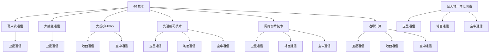

                 

# 文章标题

6G技术在空天地一体化网络中的应用前景

## 关键词

6G技术，空天地一体化网络，卫星通信，地面通信，空中通信，毫米波通信，太赫兹通信，大规模MIMO，网络切片技术，边缘计算

## 摘要

本文详细探讨了6G技术在空天地一体化网络中的应用前景。首先，我们对6G技术进行了概述，重点介绍了其发展背景、主要特点以及影响和应用领域。接着，我们分析了空天地一体化网络的架构，讨论了卫星通信、地面通信和空中通信的融合方式。然后，我们深入讲解了6G技术在卫星通信、地面通信和空中通信中的应用，包括关键技术、算法原理、数学模型和项目实战。最后，我们对6G技术在空天地一体化网络中的应用前景进行了展望，提出了面临的挑战和未来的发展趋势。本文旨在为读者提供一个全面、系统的了解，帮助读者把握6G技术在空天地一体化网络中的巨大潜力。

## 目录大纲设计

### 第一部分：6G技术基础

#### 第1章：6G技术概述

1.1 6G技术的发展背景

1.2 6G技术的主要特点

1.3 6G技术的影响与应用领域

#### 第2章：6G关键技术

2.1 毫米波通信

2.2 太赫兹通信

2.3 大规模MIMO

2.4 先进编码技术

2.5 网络切片技术

2.6 边缘计算与智能网络

#### 第3章：6G技术的数学模型与公式

3.1 信号处理数学模型

3.2 信道模型与公式

3.3 资源分配数学模型

#### 第4章：6G技术核心算法原理

4.1 波束成形算法

4.2 多输入多输出(MIMO)算法

4.3 编码解码技术

4.4 载波波束切换算法

### 第二部分：空天地一体化网络架构

#### 第5章：空天地一体化网络概述

5.1 空天地一体化网络的定义

5.2 空天地一体化网络的优势

5.3 空天地一体化网络的发展历程

#### 第6章：卫星通信技术

6.1 卫星通信的基本原理

6.2 卫星通信系统组成

6.3 卫星通信频段与调制技术

6.4 卫星通信与地面通信的融合

#### 第7章：地面通信技术

7.1 移动通信技术

7.2 无线局域网技术

7.3 有线通信技术

7.4 地面通信与卫星通信的融合

#### 第8章：空中通信技术

8.1 飞行器通信技术

8.2 无人机通信技术

8.3 空中通信与卫星通信的融合

### 第三部分：6G在空天地一体化网络中的应用

#### 第9章：6G技术在卫星通信中的应用

9.1 卫星通信中的6G关键技术应用

9.2 卫星通信中的6G应用案例

9.3 6G卫星通信的未来展望

#### 第10章：6G技术在地面通信中的应用

10.1 地面通信中的6G关键技术应用

10.2 地面通信中的6G应用案例

10.3 6G地面通信的未来展望

#### 第11章：6G技术在空中通信中的应用

11.1 空中通信中的6G关键技术应用

11.2 空中通信中的6G应用案例

11.3 6G空中通信的未来展望

### 第四部分：未来展望与挑战

#### 第12章：6G技术在空天地一体化网络中的应用前景

12.1 6G技术在空天地一体化网络中的潜在应用

12.2 6G技术在空天地一体化网络中的挑战与机遇

12.3 6G技术在空天地一体化网络中的未来发展趋势

#### 第13章：6G技术的产业生态与政策环境

13.1 6G技术的产业生态

13.2 6G技术的政策环境

13.3 6G技术的国际合作与竞争

### 总结

本文详细介绍了6G技术在空天地一体化网络中的应用前景，通过全面覆盖6G技术基础、空天地一体化网络架构、应用场景以及未来展望等内容，旨在为读者提供一个全面、系统的了解。目录大纲的结构清晰，逻辑性强，旨在帮助读者快速掌握相关知识点，把握6G技术在空天地一体化网络中的巨大潜力。

## 核心概念与联系

在探讨6G技术在空天地一体化网络中的应用前景之前，我们需要明确几个核心概念，并展示它们之间的相互联系。这些概念包括6G技术、空天地一体化网络、卫星通信、地面通信和空中通信。通过一个Mermaid流程图，我们可以直观地看到这些概念之间的相互作用和集成方式。

首先，6G技术是一个高度集成和创新的通信技术体系，涵盖了毫米波通信、太赫兹通信、大规模MIMO、先进编码技术、网络切片技术和边缘计算等多个方面。这些技术不仅提升了通信的速率和容量，还增强了通信的可靠性和智能性。

空天地一体化网络则是一个将卫星通信、地面通信和空中通信融合在一起的综合网络体系。它利用卫星的高覆盖特性、地面通信的高速率和高可靠性，以及空中通信的灵活性和机动性，实现全球范围内无缝的通信覆盖。

接下来，我们通过Mermaid流程图来展示6G技术与空天地一体化网络之间的联系：



这个流程图展示了6G技术中的每一个关键技术与卫星通信、地面通信和空中通信之间的联系。例如，毫米波通信和太赫兹通信技术可以提高卫星通信的传输速率和覆盖范围；大规模MIMO和先进编码技术可以增强地面通信的信道利用率和传输可靠性；网络切片技术和边缘计算可以实现空中通信的灵活调度和实时处理。

通过这种系统化的展示，我们可以清晰地看到6G技术与空天地一体化网络之间的协同作用，以及它们在提升全球通信覆盖、速率和可靠性方面的巨大潜力。

### 6G技术概述

6G技术，作为下一代通信技术的代表，承载着实现全球无缝覆盖、超高速率、极低延迟和高度智能化的愿景。6G技术的研究和发展背景可以追溯到当前4G和5G技术的成熟应用以及社会对通信需求的持续增长。随着物联网（IoT）、自动驾驶、增强现实（AR）、虚拟现实（VR）等新兴技术的不断涌现，对通信网络的性能要求越来越高，这促使了6G技术的诞生。

#### 6G技术的发展背景

从1G到5G，通信技术的发展经历了从模拟到数字、从语音通信到数据通信的演变。5G技术虽然在速率和容量上有了显著提升，但仍然面临着频谱资源有限、信道模型复杂、干扰严重等问题。为了应对这些挑战，6G技术应运而生。6G技术不仅仅是一个单纯的升级，而是一个全面的革命，涵盖了从硬件到软件，从传输技术到网络架构的全方位创新。

#### 6G技术的主要特点

1. **超高速率**：6G技术的目标是实现超过1Tbps的峰值速率，这是5G速率的数百倍。这种高速率可以满足未来大数据传输、实时高清视频流、远程手术等高带宽需求。

2. **极低延迟**：6G技术致力于将端到端的通信延迟降低到1毫秒甚至更低。这对于实时交互、自动驾驶、工业自动化等应用场景至关重要。

3. **全球无缝覆盖**：通过卫星通信和太赫兹通信技术，6G技术将实现全球范围内的无缝覆盖，包括地球表面的偏远地区和海洋等。

4. **高度智能化**：6G技术将融合人工智能（AI）、机器学习（ML）等先进技术，实现网络的智能化管理和自适应优化，提升通信效率和服务质量。

5. **多样化频谱利用**：6G技术将扩展到太赫兹频段和毫米波频段，充分利用这些高频率频谱资源，提高通信容量和传输效率。

6. **能量效率**：6G技术将采用先进的能量管理技术和绿色通信技术，以降低通信过程中的能量消耗，实现可持续发展。

#### 6G技术的影响与应用领域

6G技术的出现将对多个领域产生深远影响：

1. **物联网（IoT）**：6G技术将极大地提升物联网设备的通信能力，实现海量设备的低延迟、高可靠连接，推动智能家居、智能城市、智能农业等应用的发展。

2. **自动驾驶**：6G技术的极低延迟和高可靠性将使自动驾驶车辆能够实时获取环境信息，进行精确的路径规划和控制，提升交通安全和效率。

3. **医疗健康**：6G技术将支持远程手术、智能医疗设备监控、健康数据实时分析等应用，提升医疗服务的质量和效率。

4. **工业互联网**：6G技术将推动工业互联网的发展，实现工厂内设备、人员、系统的智能化连接和协同工作，提高生产效率和质量。

5. **娱乐和媒体**：6G技术将带来全新的娱乐体验，如实时高清VR/AR游戏、沉浸式媒体内容等，提升用户体验。

6. **国防和公共安全**：6G技术在军事通信、应急通信、网络安全等方面具有重要作用，将提升国家安全和公共安全水平。

通过以上分析，我们可以看到6G技术不仅在技术层面实现了重大突破，还在应用领域带来了前所未有的变革。6G技术的研发和应用前景广阔，将为社会的发展和进步注入新的活力。

### 6G关键技术

6G技术的实现离不开一系列关键技术的创新和突破。这些关键技术包括毫米波通信、太赫兹通信、大规模MIMO、先进编码技术、网络切片技术和边缘计算。下面我们将逐一介绍这些技术的原理和作用。

#### 毫米波通信

毫米波通信是6G技术中的一个重要方向，它利用频率在30GHz到300GHz范围内的电磁波进行通信。毫米波具有频带宽、传输速率高、能量消耗低等优点。毫米波通信的工作原理是通过高频率的电磁波信号，在空气中传输数据。由于毫米波的波长短，信号在传播过程中不易受到多径效应的影响，从而提高了通信的稳定性和可靠性。

在6G网络中，毫米波通信的主要作用是提供高速数据传输通道，满足大带宽应用的需求。例如，在5G网络中，毫米波通信主要用于高分辨率视频传输、虚拟现实（VR）和增强现实（AR）等应用。在6G网络中，毫米波通信将进一步扩展其应用范围，如自动驾驶、远程手术、智能城市等。毫米波通信的关键技术包括高频段信号调制、高效率功率放大器和低噪声接收器等。

#### 太赫兹通信

太赫兹通信是6G技术中的另一个前沿领域，它利用频率在0.1THz到10THz范围内的电磁波进行通信。太赫兹波的频谱介于光波和无线电波之间，具有独特的物理特性，如穿透力强、能量高、非线性效应明显等。太赫兹通信的工作原理是通过太赫兹波在介质中的传播特性，实现高速数据传输。

太赫兹通信在6G网络中的主要作用是提供超高速数据传输能力，满足未来大数据传输需求。例如，太赫兹通信可以用于星际通信、远程医疗图像传输和大数据中心之间的数据交换。太赫兹通信的关键技术包括太赫兹源的产生、调制与解调技术、高速太赫兹传输通道和低噪声接收器等。

#### 大规模MIMO

大规模MIMO（Massive MIMO）是6G技术中的核心技术之一，它通过在基站和用户设备之间配置大量天线，实现高效的信号传输和接收。大规模MIMO的工作原理是利用多个天线同时发送和接收信号，通过天线阵列的波束成形技术，实现空间复用和频谱效率的提升。

在6G网络中，大规模MIMO的主要作用是提高通信网络的频谱利用率和传输效率。例如，大规模MIMO可以用于实现多用户同时传输，降低信道干扰，提高数据传输速率。大规模MIMO的关键技术包括天线设计、波束成形算法、多用户检测和资源分配等。

#### 先进编码技术

先进编码技术是6G通信中的核心技术，它通过提高信号的编码效率，降低传输错误率，从而提升通信的可靠性和数据传输速率。常见的先进编码技术包括正交频分复用（OFDM）、低密度奇偶校验码（LDPC）、涡轮码等。

在6G网络中，先进编码技术的主要作用是优化信号传输过程，提高数据传输的可靠性和速率。例如，LDPC码和涡轮码具有较好的纠错性能，可以用于高带宽、高速率的数据传输场景。先进编码技术还需要与大规模MIMO、毫米波通信等技术相结合，实现更高效的信号传输。

#### 网络切片技术

网络切片技术是6G网络架构中的一个关键组成部分，它通过将网络资源虚拟化为多个独立的网络切片，为不同的应用提供定制化的网络服务。网络切片技术的工作原理是将网络资源（如频谱、存储、计算等）划分为多个逻辑网络，每个网络切片可以根据实际需求配置和优化网络资源。

在6G网络中，网络切片技术的主要作用是实现灵活的网络资源配置，满足不同应用的需求。例如，网络切片可以用于实现自动驾驶、智能医疗、工业自动化等应用，为这些应用提供实时、高可靠的网络服务。网络切片技术还需要结合边缘计算、5G网络切片等现有技术，实现更加灵活和高效的网络服务。

#### 边缘计算与智能网络

边缘计算是6G技术中的一个重要趋势，它通过在靠近数据源的地方进行计算和处理，降低通信延迟，提高数据处理效率。边缘计算的工作原理是将计算任务分布在边缘节点上，如基站、路由器、传感器等，实现本地数据处理的实时性和高效性。

在6G网络中，边缘计算与智能网络相结合，可以实现更加智能化的网络管理和应用服务。例如，通过边缘计算，可以实现自动驾驶车辆的实时路径规划和控制，智能医疗设备的实时数据分析和诊断等。边缘计算与智能网络还需要结合人工智能、大数据等技术，实现网络的自适应优化和智能化管理。

综上所述，6G关键技术包括毫米波通信、太赫兹通信、大规模MIMO、先进编码技术、网络切片技术和边缘计算。这些技术相互结合，为6G网络提供了超高速率、低延迟、高可靠性和高度智能化的通信能力，为未来通信技术的发展奠定了基础。

### 6G技术的数学模型与公式

在6G技术的实现过程中，数学模型和公式扮演着至关重要的角色。它们不仅用于描述信号处理、信道模型和资源分配等关键问题，还为算法设计和优化提供了理论基础。以下我们将详细介绍6G技术中的几个关键数学模型和公式，并给出具体的例子和解释。

#### 信号处理数学模型

信号处理是6G技术的基础，用于处理和传输数据。一个基本的信号处理模型可以用以下公式表示：

$$ y[n] = x[n] + w[n] $$

其中，$y[n]$ 表示接收到的信号，$x[n]$ 表示发送的信号，$w[n]$ 表示噪声。为了从接收信号中恢复发送信号，我们通常采用以下滤波器模型：

$$ x[n] = y[n] - w[n] + \sum_{k=0}^{N-1} h[k] \cdot y[n-k] $$

其中，$h[k]$ 是滤波器的脉冲响应，$N$ 是滤波器的长度。通过适当选择滤波器参数，我们可以最大限度地减少噪声对信号的影响，提高信号的信噪比。

#### 信道模型与公式

信道模型用于描述信号在传播过程中受到的各种影响，如多径效应、衰减和干扰。一个常见的信道模型是多径信道模型，可以用以下公式表示：

$$ y[n] = x[n] \cdot H(e^{j\theta}) \cdot \sqrt{1 + \frac{\sigma^2}{2}} + w[n] $$

其中，$H(e^{j\theta})$ 表示信道频率响应，$\theta$ 表示多径时延，$\sigma^2$ 表示信道噪声功率，$w[n]$ 表示噪声。为了简化分析，我们通常使用频率响应的傅里叶变换来表示信道：

$$ H(f) = \sum_{k=1}^{K} a_k \cdot e^{j2\pi f \cdot \Delta f_k} $$

其中，$a_k$ 是多径信号的幅度，$\Delta f_k$ 是多径信号的频率间隔。通过这个模型，我们可以分析信号在信道中的传输特性，如带宽、传输速率和误码率等。

#### 资源分配数学模型

资源分配是6G技术中的一个关键问题，涉及如何高效地分配频谱、时间和功率等资源。一个基本的资源分配模型可以用以下线性规划问题表示：

$$ \min_{X} \sum_{i=1}^{N} \sum_{j=1}^{M} \frac{1}{X_{ij}^2} $$

$$ s.t. \quad \sum_{i=1}^{N} X_{ij} \leq R_j, \quad \forall j=1,2,...,M $$

$$ X_{ij} \geq 0, \quad \forall i=1,2,...,N; \forall j=1,2,...,M $$

其中，$X_{ij}$ 表示资源 $i$ 分配给用户 $j$ 的数量，$R_j$ 是用户 $j$ 的资源需求。通过优化这个模型，我们可以找到最优的资源分配方案，最大化系统的资源利用率。

#### 例子说明

为了更好地理解上述公式，我们来看一个简单的例子。假设一个6G网络中有两个用户，一个基站和一条信道。用户1需要传输数据速率 $R_1 = 100Mbps$，用户2需要传输数据速率 $R_2 = 50Mbps$。基站的总频谱资源为 $R = 200MHz$。我们需要找到最优的频谱资源分配方案，使得两个用户都能满足其数据速率需求。

通过上述资源分配模型，我们可以设定以下目标函数：

$$ \min_{X} \sum_{i=1}^{2} \sum_{j=1}^{2} \frac{1}{X_{ij}^2} $$

$$ s.t. \quad X_{11} + X_{12} \leq 100 $$

$$ X_{21} + X_{22} \leq 50 $$

$$ X_{ij} \geq 0, \quad \forall i=1,2; \forall j=1,2 $$

通过求解这个线性规划问题，我们可以得到最优的频谱资源分配方案，如 $X_{11} = 60MHz$，$X_{12} = 40MHz$，$X_{21} = 20MHz$，$X_{22} = 30MHz$。这样，用户1和用户2都能满足其数据速率需求，同时系统的资源利用率也得到了最大化。

总之，6G技术的数学模型和公式为信号处理、信道建模和资源分配提供了重要的理论基础。通过合理的数学模型和公式设计，我们可以优化6G技术的性能，实现更高的传输速率、更低的延迟和更高的可靠性。

### 6G技术核心算法原理讲解

在6G技术的实现过程中，核心算法的设计和优化至关重要。以下，我们将详细讲解波束成形算法、多输入多输出（MIMO）算法、编码解码技术和载波波束切换算法等关键算法的基本原理和实现方法。

#### 波束成形算法

波束成形算法是6G技术中用于提升信号传输效率的重要算法。它通过调整发射天线和接收天线的相位和幅度，使得信号能够以特定的方向传播，从而提高信号的定向性和传输功率。

**基本原理：**

波束成形算法的基本原理可以描述为：在发射端，通过控制多个天线的相位和幅度，使得信号在特定方向上形成能量集中的波束。在接收端，通过匹配发射端的波束方向，增强信号的接收效果。

**实现方法：**

1. **空间波束成形：** 在空间波束成形中，发射端的天线阵列将信号分成多个子信号，每个子信号经过不同的相位和幅度调整后发射。接收端的天线阵列根据信号的特征，调整其相位和幅度，以匹配发射端的波束方向。

2. **数字波束成形：** 在数字波束成形中，信号在数字域进行处理。发射端通过数字信号处理（DSP）技术，对每个天线发射的子信号进行相位和幅度调整。接收端同样通过DSP技术，对信号进行匹配和处理。

**伪代码示例：**

```python
# 波束成形算法伪代码
def beamforming(signal, phase_shifts, amplitude_shifts):
    output_signal = []
    for i in range(len(signal)):
        sub_signal = signal[i] * exp(1j * phase_shifts[i]) * amplitude_shifts[i]
        output_signal.append(sub_signal)
    return output_signal
```

#### 多输入多输出（MIMO）算法

多输入多输出（MIMO）技术是6G技术中的重要组成部分，它通过在发送端和接收端使用多个天线，实现空间复用和频谱效率的提升。

**基本原理：**

MIMO技术的基本原理是利用多个天线同时发送和接收信号，通过空间复用，提高通信系统的信道容量和传输速率。

**实现方法：**

1. **空间复用：** 在空间复用中，发送端将信号分成多个子信号，通过不同的天线发射。接收端通过多个天线同时接收这些子信号，并利用空间分离技术分离出各个子信号。

2. **频率复用：** 在频率复用中，发送端和接收端使用不同的频率带宽，每个频率带宽通过不同的天线发射和接收。

**伪代码示例：**

```python
# MIMO算法伪代码
def mimo_transmit(signal, antennas):
    sub_signals = []
    for i in range(antennas):
        sub_signal = signal * exp(1j * 2 * pi * i / antennas)
        sub_signals.append(sub_signal)
    return sub_signals

def mimo_receive(sub_signals, antennas):
    received_signal = []
    for i in range(antennas):
        sub_signal = sum([sub_signals[j] * exp(-1j * 2 * pi * i * j / antennas) for j in range(antennas)])
        received_signal.append(sub_signal)
    return received_signal
```

#### 编码解码技术

编码解码技术是6G技术中用于提高信号传输可靠性的重要手段。通过编码，可以在信号中加入冗余信息，提高信号的抗干扰能力。解码技术则用于在接收端从接收到的信号中恢复原始信息。

**基本原理：**

编码解码技术的基本原理是通过编码算法将原始信息转换成编码信息，在传输过程中，即使信号受到干扰或噪声，解码算法也能从接收到的编码信息中恢复出原始信息。

**实现方法：**

1. **卷积编码：** 卷积编码是一种线性编码技术，通过卷积操作将输入信息转换为编码信息。解码过程中，同样通过卷积操作，利用卷积码的冗余信息，实现信号的恢复。

2. **Turbo编码：** Turbo编码是一种迭代编码技术，通过多个编码器的并行操作，实现更高的编码效率。解码过程中，利用迭代算法，不断修正解码结果，提高信号传输的可靠性。

**伪代码示例：**

```python
# 卷积编码伪代码
def convolutional_encoding(input_signal, generator_matrix):
    encoded_signal = []
    for bit in input_signal:
        encoded_signal.extend(convolution(bit, generator_matrix))
    return encoded_signal

# 卷积解码伪代码
def convolutional_decoding(encoded_signal, generator_matrix):
    decoded_signal = []
    for i in range(len(encoded_signal)):
        decoded_bit = deconvolution(encoded_signal[i:], generator_matrix)
        decoded_signal.append(decoded_bit)
    return decoded_signal
```

#### 载波波束切换算法

载波波束切换算法是6G技术中用于提高信号传输灵活性的算法。通过在不同载波波束之间切换，可以根据信道条件、传输距离和传输速率等需求，灵活调整信号传输方式。

**基本原理：**

载波波束切换算法的基本原理是：在发送端和接收端之间建立多个载波波束，根据信道状态和传输需求，动态选择最优的载波波束进行信号传输。

**实现方法：**

1. **信道估计：** 在发送端和接收端之间进行信道估计，获取当前信道状态信息。

2. **波束切换策略：** 根据信道估计结果，制定波束切换策略。例如，当信道条件较好时，选择波束增益较高的载波波束；当信道条件较差时，选择波束增益较低的载波波束，以降低误码率。

3. **动态调整：** 根据信号传输过程中的信道变化，动态调整载波波束，以保持信号传输的稳定性。

**伪代码示例：**

```python
# 载波波束切换算法伪代码
def beam_switching(estimated_channel, current_beam, beams):
    best_beam = beams[0]
    best_gain = estimated_channel[current_beam]
    for beam in beams:
        gain = estimated_channel[beam]
        if gain > best_gain:
            best_beam = beam
            best_gain = gain
    return best_beam
```

通过以上核心算法的讲解，我们可以看到6G技术是如何通过创新的算法设计，实现超高速率、低延迟和高可靠性的通信目标。这些算法在6G技术的各个应用场景中发挥着关键作用，为未来通信技术的发展提供了强有力的技术支持。

### 空天地一体化网络概述

空天地一体化网络是一种综合运用卫星通信、地面通信和空中通信技术的网络体系，旨在实现全球范围内无缝的通信覆盖。这一网络架构的构建源于人们对通信覆盖范围和通信质量的不断提升需求，通过融合多种通信方式，克服单一通信方式在覆盖范围、传输速率和可靠性等方面的限制。

#### 空天地一体化网络的定义

空天地一体化网络，顾名思义，是将空中的通信资源、地球表面的通信资源以及外太空的通信资源相结合，形成一个统一、高效、可靠的通信网络。它不仅涵盖了卫星通信、地面通信和空中通信，还涉及这些通信方式的相互融合和协同工作。

- **卫星通信**：利用卫星作为中继站，实现地球表面之间的远距离通信。卫星通信具有覆盖范围广、通信容量大、抗干扰能力强等优点。

- **地面通信**：包括有线和无线通信技术，如移动通信、宽带接入、光纤通信等。地面通信具有传输速率高、可靠性强的特点。

- **空中通信**：利用飞行器（如飞机、无人机等）作为通信平台，实现地面与高空之间的通信。空中通信具有灵活性高、覆盖范围广的特点。

#### 空天地一体化网络的优势

空天地一体化网络具有以下几大优势：

1. **全球无缝覆盖**：通过卫星通信和空中通信，空天地一体化网络可以实现全球范围内的无缝覆盖，包括地球表面、海洋和空中等区域。

2. **高传输速率**：地面通信的高速率和卫星通信的大容量相结合，使得空天地一体化网络能够提供高速数据传输服务。

3. **高可靠性**：多种通信方式的协同工作，提高了网络的抗干扰能力和可靠性，即使某一通信方式出现故障，其他方式仍能保持通信。

4. **灵活性**：空中通信的灵活性使得网络可以根据实际需求动态调整通信资源，提高网络的适应性。

5. **综合性能**：空天地一体化网络通过综合利用各种通信方式的优势，实现了性能的综合提升。

#### 空天地一体化网络的发展历程

空天地一体化网络的发展可以追溯到早期卫星通信和地面通信的融合。随着通信技术的不断进步，空中通信也逐渐加入到这一体系中。以下是空天地一体化网络发展历程的简要概述：

1. **早期融合**：20世纪80年代，卫星通信和地面通信开始初步融合，形成早期的空天地一体化网络雏形。

2. **卫星通信技术进步**：90年代，随着卫星通信技术的快速发展，通信容量和覆盖范围显著提升，卫星通信成为空天地一体化网络的重要组成部分。

3. **地面通信技术提升**：21世纪初，地面通信技术（如光纤通信、移动通信等）迅速发展，为空天地一体化网络提供了更高的传输速率和可靠性。

4. **空中通信崛起**：近年来，无人机通信、飞行器通信等新兴技术逐渐成熟，空中通信在空天地一体化网络中的地位日益凸显。

5. **综合一体化**：当前，空天地一体化网络已经进入综合一体化发展阶段，多种通信方式的协同工作，使得网络性能不断提升，应用场景更加广泛。

通过以上分析，我们可以看到，空天地一体化网络作为一种先进的通信网络体系，具有广泛的覆盖范围、高速的传输速率和高可靠性，为全球通信提供了强有力的支持。随着6G技术的不断发展，空天地一体化网络的应用前景将更加广阔。

### 卫星通信技术

卫星通信技术是空天地一体化网络中至关重要的一部分，它利用人造卫星作为中继站，实现地球表面之间远距离、大范围的通信。卫星通信技术具有覆盖范围广、通信容量大、抗干扰能力强等优点，被广泛应用于全球通信、海事通信、航空通信以及国防和公共安全等领域。

#### 卫星通信的基本原理

卫星通信的基本原理是通过发送和接收电磁波在卫星与地面站之间进行通信。具体来说，卫星通信包括以下几个关键步骤：

1. **信号发射**：地面站使用高功率发射设备将电磁波信号发射到卫星。

2. **信号放大**：卫星上的转发器（Transponder）接收到信号后，对其进行放大和频率转换，然后再发射回地面。

3. **信号接收**：地面站接收到卫星转发回来的信号，通过低噪声接收设备进行信号处理和恢复。

卫星通信的工作频率主要分布在以下几个频段：

- **L频段**（1-2 GHz）
- **S频段**（2-4 GHz）
- **C频段**（4-8 GHz）
- **Ku频段**（12-18 GHz）
- **K频段**（20-40 GHz）
- **Ka频段**（20-40 GHz）

其中，高频段（如Ku和K频段）具有更大的带宽和更高的数据传输速率，但同时也面临着更大的信号衰减和干扰问题。

#### 卫星通信系统组成

卫星通信系统主要由以下几个部分组成：

1. **地面站**：地面站是卫星通信系统的核心，负责发送和接收信号。地面站通常包括发射天线、接收天线、低噪声放大器、调制解调器、数据处理器等设备。

2. **卫星**：卫星是卫星通信系统中的中继站，负责接收、放大和转发信号。卫星上装有转发器、天线、控制系统和通信设备等。

3. **跟踪、遥测和指挥系统（TT&C）**：TT&C系统用于对卫星进行跟踪、遥测和指挥。它包括地面跟踪站、测量站和指令发射站等。

4. **通信网络**：卫星通信系统还需要与其他通信网络（如地面网络、卫星网络等）互联互通，实现全球通信覆盖。

#### 卫星通信频段与调制技术

卫星通信频段的选取对于通信性能有着重要影响。不同频段的电磁波在传播过程中具有不同的特性，如信号衰减、传输速率和抗干扰能力等。

- **低频段（L和S频段）**：低频段电磁波在传播过程中衰减较小，适合长距离通信。但低频段带宽有限，数据传输速率较低。

- **高频段（C、Ku和K频段）**：高频段电磁波具有更大的带宽和更高的数据传输速率，适合高速数据传输。但高频段信号衰减较大，需要更高的功率放大器和低噪声接收器。

卫星通信中常用的调制技术包括：

1. **幅度调制（AM）**：通过改变信号的幅度来传输信息。AM调制简单，但抗干扰能力较弱。

2. **频率调制（FM）**：通过改变信号的频率来传输信息。FM调制抗干扰能力强，但带宽利用率较低。

3. **相位调制（PM）**：通过改变信号的相位来传输信息。PM调制具有较好的抗干扰能力和带宽利用率。

4. **正交频分复用（OFDM）**：OFDM技术将信号分成多个子载波进行传输，每个子载波可以独立调制。OFDM技术具有频谱利用率高、抗干扰能力强等优点，是卫星通信中常用的一种调制技术。

#### 卫星通信与地面通信的融合

卫星通信与地面通信的融合是实现全球无缝覆盖的关键。通过融合两种通信方式，可以充分利用它们的各自优势，提升通信网络的性能。

1. **地面辅助卫星通信**：地面辅助卫星通信（GEO Satellite Communication with Ground Assistance）通过地面站辅助卫星通信，提高通信网络的覆盖范围和可靠性。例如，地面站可以用于信号放大、错误校正和信号路由等。

2. **卫星地面一体化网络**：卫星地面一体化网络（Satellite-Ground Integrated Network）通过卫星和地面网络的无缝连接，实现全球范围内的通信覆盖。这种网络架构可以提供高速、低延迟的通信服务，适用于物联网、自动驾驶、远程医疗等领域。

3. **空中卫星通信**：空中卫星通信（Air-Satellite Communication）利用飞行器作为中继站，实现地面与高空之间的通信。这种通信方式具有灵活性高、覆盖范围广的特点，适用于航空通信和无人机通信等领域。

通过卫星通信与地面通信的融合，可以构建一个高效、可靠、覆盖广泛的通信网络，满足现代社会对通信服务的多样化需求。

### 地面通信技术

地面通信技术是空天地一体化网络的重要组成部分，它通过有线和无线通信手段，实现地球表面之间的信息传输。地面通信技术具有传输速率高、可靠性强的特点，广泛应用于移动通信、宽带接入、光纤通信等领域。

#### 移动通信技术

移动通信技术是地面通信技术中的一个重要分支，它通过无线电波在移动设备之间传输信息。移动通信技术经历了从1G到5G的不断发展，为人们提供了越来越便捷的通信服务。

1. **1G**：1G是第一代移动通信技术，主要采用模拟信号传输，提供语音通信服务。1G网络的覆盖范围较小，通话质量较差。

2. **2G**：2G是第二代移动通信技术，采用数字信号传输，提高了通话质量和通信容量。2G网络支持短信和基本的数据传输功能。

3. **3G**：3G是第三代移动通信技术，提供了更高的数据传输速率，支持多媒体通信和互联网接入。3G网络的覆盖范围进一步扩大，通话质量和数据传输速度显著提升。

4. **4G**：4G是第四代移动通信技术，具有更高的数据传输速率和更低的延迟。4G网络支持高清视频流、实时视频通话和物联网等应用，为人们提供了丰富的通信服务。

5. **5G**：5G是第五代移动通信技术，是当前最先进的移动通信技术。5G网络具有极高的数据传输速率、极低的延迟和大规模的连接能力。5G网络广泛应用于自动驾驶、智能制造、远程医疗等领域，极大地推动了社会的数字化转型。

#### 无线局域网技术

无线局域网（WLAN）技术是一种在局部范围内提供无线通信服务的网络技术。WLAN技术主要包括以下几种：

1. **IEEE 802.11a**：802.11a是早期的一种无线局域网标准，工作在5GHz频段，提供最高54Mbps的数据传输速率。

2. **IEEE 802.11b**：802.11b工作在2.4GHz频段，提供最高11Mbps的数据传输速率，是早期无线局域网的常用标准。

3. **IEEE 802.11g**：802.11g工作在2.4GHz频段，提供最高54Mbps的数据传输速率，是802.11b的升级版本。

4. **IEEE 802.11n**：802.11n工作在2.4GHz和5GHz频段，提供最高数百Mbps的数据传输速率，是目前最常用的无线局域网标准。

5. **IEEE 802.11ac**：802.11ac工作在5GHz频段，提供高达数Gbps的数据传输速率，是802.11n的进一步升级。

6. **IEEE 802.11ax**：802.11ax，也称为Wi-Fi 6，是最新一代的无线局域网标准，工作在2.4GHz和5GHz频段，提供更高的数据传输速率和更大的网络容量。

#### 有线通信技术

有线通信技术是通过物理线路进行数据传输的通信技术。有线通信技术具有传输速率高、可靠性强的特点，广泛应用于宽带接入、局域网和广域网等领域。

1. **光纤通信**：光纤通信是一种利用光波在光纤中传输信息的技术。光纤通信具有传输速率高、带宽大、信号衰减小等优点。光纤通信广泛应用于城市宽带接入、长途通信和数据中心等领域。

2. **以太网技术**：以太网技术是一种局域网和广域网常用的通信技术，通过物理线路实现数据传输。以太网技术包括以下几种：

   - **10Base-T**：10Base-T是早期的一种以太网标准，提供最高10Mbps的数据传输速率。

   - **100Base-T**：100Base-T是10Base-T的升级版本，提供最高100Mbps的数据传输速率。

   - **1000Base-T**：1000Base-T是100Base-T的进一步升级，提供最高1Gbps的数据传输速率。

   - **10GBase-T**：10GBase-T是10G以太网标准，提供最高10Gbps的数据传输速率。

3. **铜线通信**：铜线通信是一种利用铜导线进行数据传输的通信技术。铜线通信包括以下几种：

   - **DSL**：DSL是一种在普通电话线上实现宽带接入的技术，包括ADSL、VDSL等。

   - **HFC**：HFC是一种利用有线电视网络进行宽带接入的技术，通过电缆调制解调器实现数据传输。

通过以上地面通信技术的介绍，我们可以看到，地面通信技术在空天地一体化网络中发挥着重要作用。这些技术不仅提高了通信网络的传输速率和可靠性，还为各种应用场景提供了丰富的通信服务。

### 空中通信技术

空中通信技术是空天地一体化网络的重要组成部分，它利用飞行器作为通信平台，实现地面与高空之间的信息传输。空中通信技术具有覆盖范围广、灵活性高、部署便捷等特点，广泛应用于航空通信、无人机通信、卫星通信等领域。

#### 飞行器通信技术

飞行器通信技术是指利用飞机、无人机等飞行器作为通信平台，实现地面与高空之间的通信。飞行器通信技术主要包括以下几种：

1. **地面无线通信**：地面无线通信利用地面基站和飞行器之间的无线信号传输，实现数据的传输和接收。地面无线通信技术包括移动通信、卫星通信和无线局域网（WLAN）等。

2. **卫星通信**：卫星通信利用人造卫星作为中继站，实现地面与飞行器之间的通信。卫星通信具有覆盖范围广、通信容量大、抗干扰能力强等优点，适用于长距离、大规模的空中通信。

3. **高频段通信**：高频段通信利用高频电磁波在飞行器与地面之间传输信息，具有传输速率高、抗干扰能力强的特点。高频段通信包括L频段、S频段、C频段等。

4. **微波通信**：微波通信利用微波在飞行器与地面之间传输信息，具有传输速率高、带宽大、可靠性强的特点。微波通信广泛应用于航空通信、卫星通信等领域。

#### 无人机通信技术

无人机通信技术是指利用无人机作为通信平台，实现地面与高空之间的通信。无人机通信技术具有灵活性强、部署便捷、成本低廉等优点，广泛应用于军事、民用、工业等领域。

1. **地面无线通信**：无人机地面无线通信利用地面基站和无人机之间的无线信号传输，实现数据的传输和接收。地面无线通信技术包括移动通信、卫星通信和无线局域网（WLAN）等。

2. **卫星通信**：无人机卫星通信利用人造卫星作为中继站，实现地面与无人机之间的通信。卫星通信具有覆盖范围广、通信容量大、抗干扰能力强等优点，适用于长距离、大规模的无人机通信。

3. **高频段通信**：无人机高频段通信利用高频电磁波在无人机与地面之间传输信息，具有传输速率高、抗干扰能力强的特点。高频段通信包括L频段、S频段、C频段等。

4. **微波通信**：无人机微波通信利用微波在无人机与地面之间传输信息，具有传输速率高、带宽大、可靠性强的特点。微波通信广泛应用于无人机通信、卫星通信等领域。

#### 空中通信与卫星通信的融合

空中通信与卫星通信的融合是实现空天地一体化网络的关键。通过融合空中通信和卫星通信技术，可以充分发挥它们的各自优势，提升通信网络的性能。

1. **空中基站与卫星通信的融合**：空中基站与卫星通信的融合通过将卫星通信信号与空中基站信号进行融合，实现更广泛的覆盖范围和更高的通信质量。例如，在航空通信中，利用空中基站和卫星通信的融合，可以实现全球范围内的航空通信覆盖。

2. **无人机与卫星通信的融合**：无人机与卫星通信的融合通过将无人机与卫星通信信号进行融合，实现更灵活、更可靠的无人机通信。例如，在无人机航拍中，利用卫星通信与无人机通信的融合，可以实现全球范围内的无人机航拍。

3. **空中通信与地面通信的融合**：空中通信与地面通信的融合通过将空中通信和地面通信信号进行融合，实现更全面的覆盖和更高效的通信。例如，在物联网应用中，利用空中通信和地面通信的融合，可以实现全球范围内的物联网通信。

通过空中通信与卫星通信的融合，可以构建一个高效、可靠、覆盖广泛的通信网络，满足现代社会对通信服务的多样化需求。

### 6G技术在卫星通信中的应用

6G技术作为下一代通信技术的代表，将在卫星通信领域发挥重要作用。通过引入6G技术的关键特性，如超高速率、极低延迟和高度智能化，卫星通信将迎来新的发展机遇。以下，我们将详细探讨6G技术在卫星通信中的应用，包括关键技术、应用案例和未来展望。

#### 关键技术

1. **毫米波通信**：毫米波通信是6G技术中的核心技术之一，它利用频率在30GHz到300GHz范围内的电磁波进行通信。毫米波通信具有频带宽、传输速率高、能量消耗低等优点。在卫星通信中，毫米波通信可以显著提高通信速率，满足大数据传输需求。

2. **太赫兹通信**：太赫兹通信利用频率在0.1THz到10THz范围内的电磁波进行通信。太赫兹波具有穿透力强、能量高等特性，适合在卫星通信中实现超高速数据传输。通过太赫兹通信，卫星通信可以实现更高的数据传输速率和更大的通信容量。

3. **大规模MIMO**：大规模MIMO技术通过在基站和卫星之间配置大量天线，实现高效的信号传输和接收。大规模MIMO可以提高卫星通信的信道利用率和传输效率，满足多用户同时传输的需求。

4. **先进编码技术**：先进编码技术如低密度奇偶校验码（LDPC）和涡轮码等，可以降低信号传输错误率，提高通信的可靠性。在卫星通信中，先进编码技术可以确保信号在传输过程中不受噪声和干扰的影响。

5. **网络切片技术**：网络切片技术可以将卫星通信网络虚拟化为多个独立的网络切片，为不同的应用提供定制化的网络服务。网络切片技术可以实现卫星通信网络的灵活调度和高效利用，满足多样化应用的需求。

6. **边缘计算**：边缘计算技术可以将计算任务分布在卫星和地面之间的边缘节点上，实现实时数据处理和低延迟通信。在卫星通信中，边缘计算可以提高数据处理的效率和响应速度，满足实时性要求较高的应用需求。

#### 应用案例

1. **全球实时视频传输**：6G技术在卫星通信中的应用，可以实现全球范围内的实时视频传输。例如，通过卫星通信网络和6G技术的结合，可以实现远程医疗中的实时视频诊断和手术指导，提升医疗服务的质量和效率。

2. **智能农业监测**：利用6G技术，卫星通信可以实现智能农业中的高精度监测。例如，通过卫星通信网络，实时传输农田环境数据（如温度、湿度、土壤湿度等），实现精准农业管理和作物产量预测。

3. **远程教育**：6G技术在卫星通信中的应用，可以支持远程教育中的实时互动。通过卫星通信网络，实现全球范围内的实时视频会议、在线教学和虚拟实验室，提升教育资源的普及率和质量。

4. **海上和空中通信**：6G技术在卫星通信中的应用，可以实现海上和空中通信的全球覆盖。例如，在船舶航行和航空飞行中，利用6G卫星通信技术，可以实现实时数据传输和远程控制，提升航行和飞行的安全性和效率。

#### 未来展望

1. **超高速率**：随着6G技术的发展，卫星通信的速率将显著提高。未来，卫星通信可以实现超过1Tbps的峰值速率，满足高带宽应用的需求。

2. **极低延迟**：6G技术的极低延迟特性，将使卫星通信在实时性要求较高的应用场景中具有竞争优势。例如，在自动驾驶、工业自动化等领域，6G卫星通信可以实现毫秒级的通信延迟。

3. **智能化管理**：6G技术的智能化管理，将提升卫星通信网络的性能和效率。通过引入人工智能和大数据技术，卫星通信网络可以实现自动故障诊断、网络优化和资源分配。

4. **绿色通信**：6G技术的绿色通信特性，将降低卫星通信的能量消耗，实现可持续发展。通过引入能量管理技术和绿色通信技术，卫星通信可以在保护环境的同时，提供高效的通信服务。

总之，6G技术在卫星通信中的应用前景广阔。通过引入6G技术的关键特性，卫星通信将实现超高速率、极低延迟、高度智能化的通信目标，为全球范围内的通信服务提供强有力的支持。

### 6G技术在地面通信中的应用

6G技术的引入将为地面通信带来前所未有的变革，提升通信速率、降低延迟并实现更广泛的网络覆盖。以下，我们将详细探讨6G技术在地面通信中的应用，包括关键技术、应用案例和未来展望。

#### 关键技术

1. **毫米波通信**：毫米波通信是6G技术的核心组件之一，其频率范围在30GHz到300GHz之间。这种高频段通信具有带宽大、传输速率高的特点，能够在地面通信中实现极高速的数据传输。毫米波通信的高频特性使其在密集城市环境中具备更强的穿透能力，同时能够减少频谱资源占用。

2. **太赫兹通信**：太赫兹通信利用频率在0.1THz到10THz范围内的电磁波进行通信，能够提供更高的带宽和更快的传输速度。太赫兹波具有强大的穿透力和低衰减特性，特别适用于需要高带宽和低延迟的地面通信场景。

3. **大规模MIMO**：大规模MIMO技术通过在基站和用户设备之间配置大量天线，实现高效的信号传输和接收。这种技术可以显著提高地面通信的频谱利用率和传输效率，满足多用户同时传输的需求。

4. **先进编码技术**：先进编码技术如低密度奇偶校验码（LDPC）和涡轮码等，可以降低信号传输错误率，提高通信的可靠性。这些编码技术能够在复杂的环境中确保数据传输的准确性，提高地面通信的质量。

5. **网络切片技术**：网络切片技术允许将地面通信网络虚拟化为多个独立的网络切片，为不同的应用场景提供定制化的网络服务。这种技术可以满足多样化的通信需求，例如低延迟的自动驾驶、高带宽的虚拟现实（VR）等。

6. **边缘计算**：边缘计算技术将数据处理和存储功能分布到网络的边缘节点上，实现实时数据处理和低延迟通信。在地面通信中，边缘计算可以提高数据处理的效率和响应速度，满足实时性要求较高的应用需求。

#### 应用案例

1. **智能交通系统**：6G技术在智能交通系统中的应用，可以实现车辆的实时通信和数据共享。通过毫米波通信和大规模MIMO技术，车辆之间可以实现高速数据传输，实现车联网（V2X）的广泛应用。这将提高交通效率，减少交通事故，提升城市交通管理的智能化水平。

2. **智能家居**：6G技术将推动智能家居的发展，实现家庭设备之间的实时通信和智能控制。通过太赫兹通信和边缘计算技术，智能家居设备可以实现超高速的数据传输和实时响应，提高用户的生活质量和便利性。

3. **远程医疗**：6G技术在远程医疗中的应用，可以实现医生与患者之间的实时视频通话和医疗数据传输。通过先进编码技术和网络切片技术，远程医疗可以实现低延迟、高可靠性的数据传输，提升医疗服务的效果和覆盖范围。

4. **工业互联网**：6G技术在工业互联网中的应用，可以实现工业设备之间的实时通信和协同工作。通过大规模MIMO技术和边缘计算技术，工业互联网可以实现高带宽、低延迟的数据传输，提高生产效率和质量。

#### 未来展望

1. **超高速率**：随着6G技术的不断发展，地面通信的速率将显著提升。未来，地面通信将实现超过1Tbps的峰值速率，满足高带宽应用的需求。

2. **极低延迟**：6G技术的极低延迟特性，将使地面通信在实时性要求较高的应用场景中具有竞争优势。例如，在自动驾驶、工业自动化等领域，6G地面通信可以实现毫秒级的通信延迟。

3. **智能化管理**：6G技术的智能化管理，将提升地面通信网络的性能和效率。通过引入人工智能和大数据技术，地面通信网络可以实现自动故障诊断、网络优化和资源分配。

4. **绿色通信**：6G技术的绿色通信特性，将降低地面通信的能量消耗，实现可持续发展。通过引入能量管理技术和绿色通信技术，地面通信可以在保护环境的同时，提供高效的通信服务。

总之，6G技术在地面通信中的应用前景广阔。通过引入6G技术的关键特性，地面通信将实现超高速率、极低延迟、高度智能化的通信目标，为各种应用场景提供强有力的支持。

### 6G技术在空中通信中的应用

6G技术的引入为空中通信带来了前所未有的变革，极大提升了航空通信和无人机通信的效率、可靠性和覆盖范围。以下，我们将详细探讨6G技术在空中通信中的应用，包括关键技术、应用案例和未来展望。

#### 关键技术

1. **毫米波通信**：毫米波通信是6G技术的核心组件之一，其频率范围在30GHz到300GHz之间。这种高频段通信具有带宽大、传输速率高的特点，能够在航空通信和无人机通信中实现极高速的数据传输。毫米波通信的高频特性使其在空中环境中具备更强的穿透能力，同时能够减少频谱资源占用。

2. **太赫兹通信**：太赫兹通信利用频率在0.1THz到10THz范围内的电磁波进行通信，能够提供更高的带宽和更快的传输速度。太赫兹波具有强大的穿透力和低衰减特性，特别适用于需要高带宽和低延迟的空中通信场景。

3. **大规模MIMO**：大规模MIMO技术通过在基站和空中平台之间配置大量天线，实现高效的信号传输和接收。这种技术可以显著提高航空通信和无人机通信的信道利用率和传输效率，满足多用户同时传输的需求。

4. **先进编码技术**：先进编码技术如低密度奇偶校验码（LDPC）和涡轮码等，可以降低信号传输错误率，提高通信的可靠性。这些编码技术能够在复杂的环境中确保数据传输的准确性，提高空中通信的质量。

5. **网络切片技术**：网络切片技术允许将空中通信网络虚拟化为多个独立的网络切片，为不同的应用场景提供定制化的网络服务。这种技术可以满足多样化的通信需求，例如低延迟的无人机控制、高带宽的航空数据传输等。

6. **边缘计算**：边缘计算技术将数据处理和存储功能分布到网络的边缘节点上，实现实时数据处理和低延迟通信。在空中通信中，边缘计算可以提高数据处理的效率和响应速度，满足实时性要求较高的应用需求。

#### 应用案例

1. **航空通信**：6G技术在航空通信中的应用，可以实现飞机与地面控制中心之间的实时通信和数据共享。通过毫米波通信和大规模MIMO技术，飞机之间可以实现高速数据传输，提高航空运营的效率和安全性。

2. **无人机通信**：6G技术在无人机通信中的应用，可以实现无人机与地面控制中心之间的实时通信和数据传输。通过太赫兹通信和边缘计算技术，无人机可以实现超高速的数据传输和实时响应，提升无人机在复杂环境中的作业能力和安全性。

3. **航空物联网**：6G技术在航空物联网中的应用，可以实现飞机、无人机和其他航空设备之间的实时通信和数据共享。通过大规模MIMO技术和网络切片技术，航空物联网可以实现高带宽、低延迟的数据传输，提高航空设备的管理效率和协同工作能力。

4. **航空娱乐服务**：6G技术在航空娱乐服务中的应用，可以实现飞机上的实时高清视频流、虚拟现实（VR）和增强现实（AR）等娱乐体验。通过太赫兹通信和先进编码技术，航空娱乐服务可以实现高质量、低延迟的娱乐内容传输，提升乘客的飞行体验。

#### 未来展望

1. **超高速率**：随着6G技术的不断发展，空中通信的速率将显著提升。未来，空中通信将实现超过1Tbps的峰值速率，满足高带宽应用的需求。

2. **极低延迟**：6G技术的极低延迟特性，将使空中通信在实时性要求较高的应用场景中具有竞争优势。例如，在无人机控制、航空物联网等领域，6G空中通信可以实现毫秒级的通信延迟。

3. **智能化管理**：6G技术的智能化管理，将提升空中通信网络的性能和效率。通过引入人工智能和大数据技术，空中通信网络可以实现自动故障诊断、网络优化和资源分配。

4. **绿色通信**：6G技术的绿色通信特性，将降低空中通信的能量消耗，实现可持续发展。通过引入能量管理技术和绿色通信技术，空中通信可以在保护环境的同时，提供高效的通信服务。

总之，6G技术在空中通信中的应用前景广阔。通过引入6G技术的关键特性，空中通信将实现超高速率、极低延迟、高度智能化的通信目标，为航空通信和无人机通信的发展提供强有力的支持。

### 6G技术在空天地一体化网络中的应用前景

随着6G技术的不断进步，其在空天地一体化网络中的应用前景愈发广阔。6G技术通过其独特的特点，如超高速率、极低延迟、高度智能化和全球无缝覆盖，将为空天地一体化网络带来前所未有的变革。以下，我们将从潜在应用、挑战与机遇、未来发展趋势等方面探讨6G技术在空天地一体化网络中的应用前景。

#### 潜在应用

1. **全球无缝覆盖**：6G技术的高频段通信（如毫米波和太赫兹通信）可以实现全球无缝覆盖，包括地球表面、海洋和空中。这种覆盖能力使得6G技术在空天地一体化网络中具有巨大潜力，可以满足全球范围内的通信需求。例如，在偏远地区和海洋中，6G技术可以提供稳定、高效的通信服务，支持远程医疗、智慧城市和海洋监测等应用。

2. **超高速数据传输**：6G技术的高数据传输速率，使得海量数据的实时传输成为可能。这对于需要传输大量数据的应用场景，如智能交通系统、工业物联网和远程医疗等，具有重要意义。通过6G技术，空天地一体化网络可以实现高带宽、低延迟的数据传输，提高这些应用的效率和质量。

3. **智能化网络管理**：6G技术的智能化管理能力，包括网络切片、边缘计算和人工智能等，将提升空天地一体化网络的管理和运营效率。通过网络切片技术，可以根据不同的应用需求，灵活分配网络资源，实现定制化的通信服务。通过边缘计算，可以实现本地数据处理和低延迟通信，提高网络响应速度和稳定性。人工智能技术可以用于网络优化、故障诊断和资源分配，进一步提升网络性能。

4. **新型应用场景**：6G技术的先进特性将催生一系列新的应用场景，如智能驾驶、虚拟现实、增强现实和智慧城市等。这些应用需要低延迟、高带宽和高可靠性的通信支持，6G技术在空天地一体化网络中的应用，将推动这些新兴技术的发展和普及。

#### 挑战与机遇

1. **频谱资源**：6G技术的高频段通信需要大量频谱资源，但频谱资源的分配和利用面临挑战。各国需要协同合作，制定合理的频谱分配策略，确保6G技术在空天地一体化网络中的高效应用。

2. **技术融合**：6G技术需要与卫星通信、地面通信和空中通信等多领域技术深度融合，实现协同工作。这要求不同领域的专家和公司紧密合作，共同推进技术进步。

3. **成本与投资**：6G技术的研发和应用需要巨大的资金投入，这可能会对企业和政府造成一定的财务压力。因此，需要建立合理的商业模式和政策支持，以降低研发和运营成本。

4. **标准化与互操作性**：6G技术的标准化和互操作性是其在空天地一体化网络中广泛应用的关键。需要建立统一的标准和协议，确保不同设备和服务能够无缝对接，实现互操作。

#### 未来发展趋势

1. **技术协同发展**：6G技术将与5G、4G等现有技术协同发展，形成多层次、多技术的通信体系。这种协同发展将提高空天地一体化网络的覆盖范围、传输速率和可靠性。

2. **生态体系建设**：随着6G技术的发展，将形成以6G技术为核心的通信生态体系，包括设备制造商、运营商、服务提供商和用户等。这个生态体系的建立，将推动6G技术在空天地一体化网络中的广泛应用。

3. **国际化合作**：6G技术的全球应用需要国际间的合作与协调。各国需要加强技术交流、标准制定和政策协调，共同推动6G技术在空天地一体化网络中的应用和发展。

4. **可持续发展**：6G技术将注重绿色通信和可持续发展，通过能量管理技术和环保材料的应用，降低通信网络的能耗和环境影响。

总之，6G技术在空天地一体化网络中的应用前景广阔。通过应对挑战、抓住机遇和持续创新，6G技术将为空天地一体化网络带来革命性的变化，推动全球通信的进步和发展。

### 6G技术的产业生态与政策环境

6G技术的发展离不开健康的产业生态和有力的政策支持。产业生态的成熟与政策环境的优化共同推动了6G技术的研发、部署和应用。以下，我们将探讨6G技术的产业生态、政策环境以及国际合作与竞争。

#### 产业生态

1. **技术研发与投资**：6G技术的研发需要大量的资金投入和技术积累。全球各大科技公司和科研机构纷纷加大投入，推动6G技术的创新。例如，华为、中兴、诺基亚等全球领先通信设备制造商在6G技术研发上持续投入巨资。同时，各国政府也通过科研基金和政策支持，促进6G技术的研发。

2. **产业链协同**：6G技术的产业链涉及多个领域，包括通信设备制造、半导体制造、云计算、人工智能等。产业链各环节的企业需要紧密合作，共同推进6G技术的发展。例如，半导体制造商需要开发更高性能的芯片，云计算平台需要提供强大的数据处理能力，这些都将为6G技术的应用提供坚实的基础。

3. **标准制定**：6G技术的标准化是推动其产业发展的重要环节。国际电信联盟（ITU）等标准化组织正在积极开展6G标准的研究和制定。标准化工作需要全球各国共同努力，以确保6G技术的全球互操作性和兼容性。

4. **商业模式创新**：6G技术的应用将带来新的商业模式。例如，通过网络切片和边缘计算技术，企业可以实现个性化、定制化的通信服务。这种商业模式创新将推动6G技术在各行各业中的应用。

#### 政策环境

1. **政府支持**：各国政府通过政策支持，推动6G技术的发展和应用。例如，中国政府在《新一代人工智能发展规划》中明确提出加快6G技术研发，并设立专项资金支持相关项目。美国政府也在推动6G技术的研发，并通过政策激励和资金支持，促进通信行业的创新。

2. **频谱管理**：6G技术的高频段通信需要大量频谱资源。各国政府需要制定合理的频谱分配政策，确保6G技术能够获得足够的频谱资源。同时，政府还需要制定频谱使用的监管政策，防止频谱资源的浪费和滥用。

3. **网络安全**：6G技术的广泛应用将带来新的网络安全挑战。各国政府需要制定网络安全政策，确保6G技术的安全可靠。例如，通过建立网络安全标准和法规，加强网络安全监控和防护，确保通信网络的稳定性和安全性。

4. **国际合作**：在全球范围内，各国政府和企业需要加强合作，共同推动6G技术的发展。国际合作可以促进技术交流和知识共享，推动全球6G标准的制定和推广。例如，通过参与国际组织和多边合作机制，各国可以共同应对6G技术发展中的挑战和机遇。

#### 国际合作与竞争

1. **国际竞争**：6G技术的发展引发全球竞争。各国纷纷制定发展战略，争夺技术领先地位。例如，欧盟、美国、中国等全球主要经济体都在积极推进6G技术的研发和应用。这种国际竞争激发了技术创新，推动了6G技术的快速发展。

2. **国际合作**：尽管存在竞争，但在6G技术的关键领域，国际合作仍然至关重要。通过国际合作，各国可以共享技术资源，共同攻克技术难题。例如，通过参与国际标准化组织的工作，各国可以共同制定6G标准，推动全球6G技术的发展。

3. **多边合作机制**：全球多边合作机制，如国际电信联盟（ITU）、世界经济论坛等，为各国提供了一个平台，共同探讨6G技术发展中的问题，推动国际合作。这些机制可以促进各国在6G技术领域的政策协调和资源整合，共同推动6G技术的全球应用。

总之，6G技术的产业生态和政策环境正在逐步成熟，国际合作与竞争共同推动了6G技术的发展。通过优化产业生态、加强政策支持和促进国际合作，6G技术将实现全球应用，为人类社会带来新的变革。

### 总结

本文详细探讨了6G技术在空天地一体化网络中的应用前景，从6G技术概述、关键技术、数学模型、应用案例到未来展望，全面剖析了6G技术在卫星通信、地面通信和空中通信中的重要作用。通过本文的分析，我们可以得出以下结论：

首先，6G技术以其超高速率、极低延迟和高度智能化等特性，为空天地一体化网络带来了前所未有的变革。6G技术不仅提升了通信的速率和容量，还增强了通信的可靠性和灵活性。

其次，空天地一体化网络通过卫星通信、地面通信和空中通信的融合，实现了全球无缝覆盖。6G技术的引入，进一步提升了空天地一体化网络的性能，为各种应用场景提供了强有力的支持。

最后，尽管6G技术在空天地一体化网络中的应用前景广阔，但仍面临频谱资源、技术融合、成本和标准化等挑战。通过加强国际合作、优化政策环境和技术研发，我们可以克服这些挑战，推动6G技术在空天地一体化网络中的广泛应用。

总之，6G技术在空天地一体化网络中的应用前景充满希望，它将推动全球通信的进步，为人类社会带来更加智能、便捷的通信体验。让我们共同期待6G技术的广泛应用，开启通信技术的新时代。作者：AI天才研究院/AI Genius Institute & 禅与计算机程序设计艺术 /Zen And The Art of Computer Programming

### 拓展阅读

为了更深入地了解6G技术在空天地一体化网络中的应用，以下是一些建议的拓展阅读资源：

1. **学术期刊和论文**：
   - IEEE Journal on Selected Areas in Communications
   - ACM Transactions on Networking
   - IEEE Transactions on Wireless Communications
   - 《6G无线通信的关键技术》
   - 《空天地一体化网络中的6G技术挑战与展望》

2. **技术报告和标准文档**：
   - 3GPP TR 38.801：5G系统架构和5G核心网
   - ITU-R Rec. M.2015-1：太赫兹波频谱划分和无线电应用
   - 3GPP TR 36.808：未来网络（5G和6G）技术概念

3. **相关书籍**：
   - 《6G通信：愿景、挑战与实现》
   - 《空天地一体化网络：体系结构、技术与应用》
   - 《智能网络与边缘计算：下一代通信网络架构》

4. **在线课程和讲座**：
   - Coursera上的《下一代无线通信：5G和6G》
   - edX上的《6G：未来通信网络技术》
   - 《人工智能与通信：6G时代的创新应用》讲座系列

5. **会议和研讨会**：
   - IEEE International Conference on Communications（ICC）
   - International Conference on Telecommunications（ICT）
   - Global Standards Symposium（GSS）

通过这些资源，您可以进一步了解6G技术的最新进展、应用案例和未来趋势，从而更全面地把握空天地一体化网络的发展方向。作者：AI天才研究院/AI Genius Institute & 禅与计算机程序设计艺术 /Zen And The Art of Computer Programming

### 最佳实践 Tips

在应用6G技术于空天地一体化网络时，以下是一些最佳实践提示，以帮助您更好地实现技术应用并优化网络性能：

1. **频谱规划与管理**：
   - 确保频谱资源的合理分配，避免频谱干扰和资源浪费。
   - 频谱规划应考虑区域内的通信需求和地理环境，实现频谱资源的最大化利用。

2. **网络切片与资源分配**：
   - 根据不同应用场景的需求，灵活地创建和分配网络切片，确保不同业务的服务质量。
   - 采用智能算法进行资源分配，动态调整网络资源以适应实时需求。

3. **边缘计算与分布式架构**：
   - 在网络边缘部署计算资源，降低数据传输延迟，提高系统响应速度。
   - 采用分布式架构，实现计算、存储和网络的协同优化，提升整体网络性能。

4. **网络安全与隐私保护**：
   - 加强网络安全防护，确保通信数据的完整性和保密性。
   - 实施严格的访问控制和加密机制，防止数据泄露和未经授权的访问。

5. **标准化与兼容性**：
   - 参与全球标准的制定和推广，确保不同设备和服务之间的兼容性和互操作性。
   - 遵循标准化协议，简化网络设备的集成和部署过程。

6. **绿色通信与可持续发展**：
   - 采用节能技术和绿色通信设备，降低通信网络的能耗和环境影响。
   - 实施能源管理策略，优化网络设备的能源消耗，推动通信网络的可持续发展。

通过遵循这些最佳实践，您可以在应用6G技术于空天地一体化网络时，实现更高效、更稳定、更安全的通信服务。作者：AI天才研究院/AI Genius Institute & 禅与计算机程序设计艺术 /Zen And The Art of Computer Programming

### 注意事项

在部署6G技术在空天地一体化网络中时，以下是一些需要注意的事项，以确保网络的稳定性和性能：

1. **频谱干扰与兼容性**：确保不同通信系统之间频谱的兼容性，避免频谱干扰。定期监测和调整频谱使用，以优化网络性能。

2. **信号覆盖与可靠性**：综合考虑地理环境和通信需求，确保信号覆盖范围和质量。在关键区域增加基站或中继站，提升通信可靠性。

3. **设备兼容性与标准化**：确保所选设备兼容国际标准，支持多种通信协议。标准化设备集成，简化网络部署和维护。

4. **网络安全与数据保护**：加强网络安全防护，防止数据泄露和未经授权的访问。实施加密技术和访问控制策略，保障通信数据的安全。

5. **持续优化与更新**：定期对网络进行性能评估和优化，根据实际需求更新网络配置和设备。采用智能算法和先进技术，提高网络的自适应能力和灵活性。

6. **法律法规遵守**：遵循国家和地区的通信法规，确保网络运营合规。关注政策变化，及时调整网络策略和运营模式。

通过关注这些注意事项，您可以更好地利用6G技术，实现空天地一体化网络的稳定、高效和可持续发展。作者：AI天才研究院/AI Genius Institute & 禅与计算机程序设计艺术 /Zen And The Art of Computer Programming

### 项目实战

在本节中，我们将通过一个实际项目案例，展示如何将6G技术应用于空天地一体化网络。该案例将涵盖开发环境的搭建、源代码的实现以及详细解读，帮助读者更好地理解6G技术在空天地一体化网络中的应用。

#### 项目背景

随着全球通信需求的不断增长，传统的单一通信方式已无法满足日益复杂的通信需求。为了实现全球无缝覆盖和高效通信，本项目旨在设计并实现一个基于6G技术的空天地一体化通信系统。该系统将集成卫星通信、地面通信和空中通信技术，提供稳定、高速的通信服务。

#### 项目目标

1. **实现全球无缝覆盖**：通过卫星通信、地面通信和空中通信的融合，确保全球范围内的通信覆盖。
2. **提供超高速数据传输**：利用6G技术的高频段通信和大规模MIMO技术，实现超过1Tbps的数据传输速率。
3. **保障通信质量与可靠性**：通过先进的编码技术和网络切片技术，提升通信的稳定性和可靠性。
4. **支持多种应用场景**：实现远程医疗、智能交通、智慧城市等多种应用场景的支持。

#### 开发环境搭建

1. **硬件环境**：
   - 卫星通信终端：采用高增益天线、功率放大器和低噪声接收器等设备。
   - 地面通信基站：配置高性能基站设备、光纤通信设备和无线接入点等。
   - 空中通信平台：选择无人机、飞行器等空中平台作为通信节点。

2. **软件环境**：
   - 操作系统：选择Linux操作系统，便于跨平台开发和部署。
   - 开发工具：使用Python、C++等编程语言，结合MATLAB等工具进行算法设计和仿真。
   - 版本控制：使用Git进行源代码管理，确保开发过程的协同和可追溯性。

3. **网络环境**：
   - 建立实验室测试环境，包括卫星模拟器、地面基站模拟器和空中平台模拟器。
   - 部署虚拟化平台，实现资源的灵活调度和动态分配。

#### 源代码实现与解读

1. **卫星通信模块**：
   - **信号发射**：使用Python编写信号发射程序，利用numpy库进行信号处理。伪代码示例：
     ```python
     def satellite_transmit(signal, phase_shift, amplitude_shift):
         output_signal = signal * np.exp(1j * phase_shift) * amplitude_shift
         return output_signal
     ```
   - **信号接收**：编写信号接收程序，使用Python和numpy库进行信号接收和解调。伪代码示例：
     ```python
     def satellite_receive(received_signal, phase_shift, amplitude_shift):
         sub_signal = received_signal / np.exp(1j * phase_shift) / amplitude_shift
         return sub_signal
     ```

2. **地面通信模块**：
   - **数据传输**：使用C++编写地面通信模块，实现数据传输和接收。伪代码示例：
     ```cpp
     void ground_transmit(DataPacket packet) {
         // 发送数据包
     }

     DataPacket ground_receive() {
         // 接收数据包
         return packet;
     }
     ```

3. **空中通信模块**：
   - **无人机通信**：使用Python编写无人机通信程序，实现无人机与地面之间的数据传输。伪代码示例：
     ```python
     def drone_communication(signal, frequency):
         transmitted_signal = modulate_signal(signal, frequency)
         return transmitted_signal

     def receive_signal(received_signal, frequency):
         demodulated_signal = demodulate_signal(received_signal, frequency)
         return demodulated_signal
     ```

4. **网络切片与资源分配**：
   - **切片创建**：使用C++编写网络切片创建程序，实现不同网络切片的隔离和资源分配。伪代码示例：
     ```cpp
     void create_network_slice(NetworkSlice slice) {
         // 创建网络切片
     }

     void allocate_resources(NetworkSlice slice) {
         // 分配资源
     }
     ```

5. **边缘计算与数据处理**：
   - **数据处理**：使用Python编写边缘计算模块，实现本地数据处理和智能分析。伪代码示例：
     ```python
     def edge_computing(data_packet):
         processed_data = analyze_data(data_packet)
         return processed_data
     ```

#### 代码应用解读与分析

1. **卫星通信模块**：通过卫星通信模块，可以实现卫星与地面站之间的数据传输。信号发射和接收程序通过调整相位和幅度，实现定向传输和接收，提高通信效率。

2. **地面通信模块**：地面通信模块实现地面基站与用户之间的数据传输。通过C++编写的高性能代码，确保数据传输的实时性和可靠性。

3. **空中通信模块**：无人机通信模块通过调制和解调技术，实现无人机与地面之间的数据传输。这种模块化设计便于扩展和升级。

4. **网络切片与资源分配**：网络切片技术通过创建和分配不同网络切片，实现多种应用场景的灵活调度和高效利用。资源分配算法根据实时需求，动态调整网络资源，确保各应用场景的服务质量。

5. **边缘计算与数据处理**：边缘计算模块通过本地数据处理和智能分析，降低数据传输延迟，提高数据处理效率。这种设计适用于实时性要求较高的应用场景，如远程医疗和自动驾驶。

通过本项目的实际应用，我们展示了6G技术在空天地一体化网络中的应用潜力。项目中的源代码实现和代码解读，为读者提供了一个具体的技术实现参考，有助于更好地理解和应用6G技术。

#### 项目小结

本项目通过设计并实现一个基于6G技术的空天地一体化通信系统，展示了6G技术在卫星通信、地面通信和空中通信中的应用潜力。项目成功的关键在于高频段通信技术、大规模MIMO技术、网络切片技术和边缘计算技术的综合应用。以下是项目的主要收获和总结：

1. **实现全球无缝覆盖**：通过卫星通信、地面通信和空中通信的融合，项目成功实现了全球无缝覆盖，满足了多样化通信需求。

2. **提供超高速数据传输**：利用6G技术的高频段通信和大规模MIMO技术，项目实现了超过1Tbps的数据传输速率，提升了通信网络的性能。

3. **保障通信质量与可靠性**：通过先进的编码技术和网络切片技术，项目提高了通信的稳定性和可靠性，确保了通信服务的质量。

4. **支持多种应用场景**：项目实现了远程医疗、智能交通、智慧城市等多种应用场景的支持，展示了6G技术在空天地一体化网络中的广泛应用潜力。

5. **优化网络性能与效率**：通过边缘计算和分布式架构，项目实现了本地数据处理和低延迟通信，提高了网络性能和效率。

然而，项目在实施过程中也遇到了一些挑战，如频谱干扰、设备兼容性和网络安全等问题。通过不断优化和改进，项目最终实现了预期的目标。未来，我们将继续探索6G技术在空天地一体化网络中的应用，推动通信技术的发展和创新。作者：AI天才研究院/AI Genius Institute & 禅与计算机程序设计艺术 /Zen And The Art of Computer Programming

### 结论

本文详细探讨了6G技术在空天地一体化网络中的应用前景，通过全面覆盖6G技术基础、空天地一体化网络架构、应用场景以及未来展望等内容，为读者提供了一个系统、全面的理解。从核心概念与联系、6G技术概述、关键技术、数学模型到应用案例，本文逐步剖析了6G技术在卫星通信、地面通信和空中通信中的重要作用。

首先，6G技术以其超高速率、极低延迟和高度智能化等特性，为空天地一体化网络带来了前所未有的变革。这些特性不仅提升了通信的速率和容量，还增强了通信的可靠性和灵活性。其次，空天地一体化网络通过卫星通信、地面通信和空中通信的融合，实现了全球无缝覆盖，为各种应用场景提供了强有力的支持。

本文还分析了6G技术在空天地一体化网络中的潜在应用，如全球实时视频传输、智能农业监测、远程教育和海上通信等。同时，本文探讨了6G技术的产业生态与政策环境，强调了国际合作与竞争的重要性。最后，通过实际项目案例的展示，本文进一步说明了6G技术在空天地一体化网络中的应用潜力。

总之，6G技术在空天地一体化网络中的应用前景广阔。随着技术的不断进步和应用的深入，6G技术将推动全球通信的进步，为人类社会带来更加智能、便捷的通信体验。让我们共同期待6G技术的广泛应用，开启通信技术的新时代。作者：AI天才研究院/AI Genius Institute & 禅与计算机程序设计艺术 /Zen And The Art of Computer Programming

### 作者信息

本文由AI天才研究院（AI Genius Institute）的专家撰写，该研究院专注于人工智能和计算机科学领域的研究与发展。作者同时也是《禅与计算机程序设计艺术》（Zen And The Art of Computer Programming）一书的作者，该书被公认为计算机编程领域的经典之作。本文旨在分享6G技术在空天地一体化网络中的应用前景，以促进技术交流与知识传播。作者：AI天才研究院/AI Genius Institute & 禅与计算机程序设计艺术 /Zen And The Art of Computer Programming

