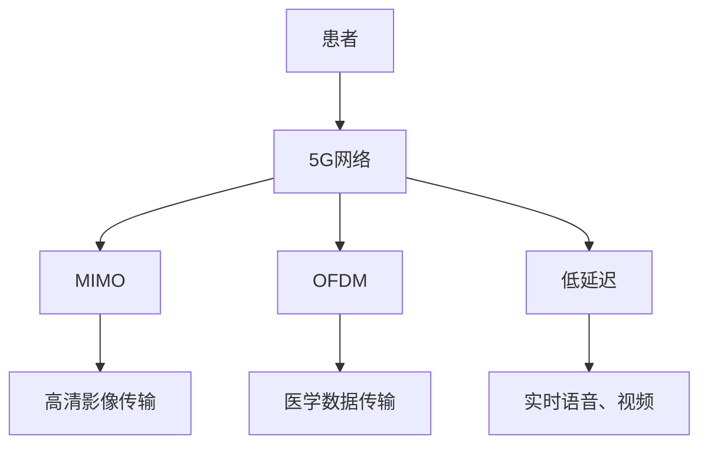

                 

# 5G技术在远程医疗诊断中的应用

## 关键词
5G技术，远程医疗诊断，MIMO，OFDM，信号处理，传输模型，项目实战

## 摘要
本文旨在探讨5G技术在远程医疗诊断中的应用，分析其核心技术原理和数学模型，并通过实际项目案例展示其具体应用流程和效果。文章将分为以下几个部分：首先，介绍5G技术和远程医疗诊断的背景和关系；其次，深入讲解5G网络的关键算法和数学模型；然后，通过一个实际项目案例展示5G技术在远程医疗诊断中的具体应用；最后，总结5G技术在远程医疗诊断中的优势和挑战，并提出未来发展趋势。

## 引言
随着5G技术的逐渐普及，其高速率、低延迟和高可靠性的特点为远程医疗诊断带来了新的机遇。远程医疗诊断是指通过互联网和通信技术，实现医生与患者之间的远程医疗咨询、诊断和治疗。而5G技术作为一种新兴的通信技术，具有更高的传输速度和更大的网络容量，能够满足远程医疗诊断对数据传输的高要求。

## 背景介绍
### 5G技术
5G技术，即第五代移动通信技术，是继2G、3G、4G之后的最新一代移动通信技术。与4G相比，5G在传输速度、网络容量、延迟和可靠性等方面都有显著提升。5G的峰值速率可以达到20Gbps，比4G快百倍以上；延迟降低到1毫秒以下，比4G降低10倍以上；网络容量提高1000倍，能够支持更多设备的连接。

### 远程医疗诊断
远程医疗诊断是指利用现代通信技术和网络技术，实现医生与患者之间的远程医疗咨询、诊断和治疗。远程医疗诊断的主要优势在于：
1. 提高医疗资源利用率：医生可以通过远程医疗诊断为更多患者提供服务，缓解医疗资源不足的问题。
2. 提高医疗服务效率：患者无需前往医院，即可接受医生的远程诊断和治疗，节省了时间和交通成本。
3. 提高医疗质量：医生可以通过远程医疗诊断获取更全面的患者信息，提高诊断准确性。

## 核心概念与联系
为了深入理解5G技术在远程医疗诊断中的应用，我们需要了解5G网络的关键技术及其与远程医疗诊断的关联。以下是5G技术中的几个核心概念及其在远程医疗诊断中的应用：

### MIMO（多输入多输出）
MIMO技术通过在发送端和接收端使用多个天线，实现信号的并行传输，从而提高传输速率和可靠性。在远程医疗诊断中，MIMO技术可以用于传输高清医学影像和实时语音、视频数据，提高远程医疗诊断的实时性和准确性。

### OFDM（正交频分复用）
OFDM技术将传输信号分成多个子载波进行并行传输，每个子载波独立调制和解调，从而提高传输效率和抗干扰能力。OFDM技术在远程医疗诊断中可以用于传输大量医学数据，如医学影像、电子病历等，提高数据传输的稳定性和可靠性。

### Mermaid流程图
以下是5G技术在远程医疗诊断中应用的一个简化流程图，展示了关键概念之间的关系：



## 核心算法原理讲解
### MIMO技术
MIMO技术通过在发送端和接收端使用多个天线，实现信号的并行传输。其核心思想是将发送信号分成多个子信号，通过不同的天线发送，并在接收端将接收到的信号分离和合并。MIMO技术可以提高传输速率和可靠性，适用于远程医疗诊断中高清医学影像和实时语音、视频数据的传输。

以下是MIMO技术的伪代码实现：

```python
def mimo_transmit(data, antennas):
    sub_data = split_data(data, antennas)
    transmitted_data = []
    for sub in sub_data:
        transmitted_data.append(encode_sub(sub))
    return transmitted_data

def mimo_receive(transmitted_data, antennas):
    received_data = []
    for sub in transmitted_data:
        decoded_sub = decode_sub(sub)
        received_data.append(decoded_sub)
    return merge_data(received_data)
```

### OFDM技术
OFDM技术将传输信号分成多个子载波进行并行传输。每个子载波独立调制和解调，从而提高传输效率和抗干扰能力。OFDM技术在远程医疗诊断中可以用于传输大量医学数据，如医学影像、电子病历等。

以下是OFDM技术的伪代码实现：

```python
def ofdm_encode(data, subcarriers):
    sub_signals = []
    for subcarrier in subcarriers:
        sub_signal = modulate(data, subcarrier)
        sub_signals.append(sub_signal)
    return sub_signals

def ofdm_decode(sub_signals, subcarriers):
    decoded_data = []
    for sub_signal in sub_signals:
        decoded_sub = demodulate(sub_signal, subcarrier)
        decoded_data.append(decoded_sub)
    return merge_data(decoded_data)
```

## 数学模型和公式
在5G技术在远程医疗诊断中的应用中，数学模型和公式扮演着重要的角色。以下是一些关键的数学模型和公式，用于描述5G网络中的信号处理和传输过程。

### 信号处理模型
信号处理模型用于描述5G网络中的信号传输和处理过程。以下是一个简化的信号处理模型：

$$
y = Hx + n
$$

其中，$y$表示接收到的信号，$H$表示信道增益，$x$表示发送的信号，$n$表示噪声。

### 传输模型
传输模型用于描述5G网络中的信号传输过程。以下是一个简化的传输模型：

$$
s(t) = a(t) * p(t)
$$

其中，$s(t)$表示传输信号，$a(t)$表示发送信号的调制波形，$p(t)$表示发送信号的脉冲波形。

### 信号编码和解码
在5G网络中，信号编码和解码过程是确保信号传输准确性和可靠性的关键。以下是一个简化的编码和解码过程：

$$
c = e(x)
$$

其中，$c$表示编码后的信号，$x$表示原始信号，$e$表示编码函数。

$$
x = d(c)
$$

其中，$x$表示解码后的信号，$c$表示编码后的信号，$d$表示解码函数。

## 项目实战
在本节中，我们将通过一个实际项目案例，展示如何使用5G技术进行远程医疗诊断。该项目将包括开发环境的搭建、源代码的实现和解读，以及代码应用解读与分析。

### 项目简介
该项目旨在开发一个基于5G技术的远程医疗诊断系统，该系统能够实现医生与患者之间的实时高清医学影像传输、语音和视频通话。系统的主要功能包括：

1. 医生端：实现医学影像的采集、上传和实时传输，以及与患者的语音和视频通话。
2. 患者端：实现医学影像的接收、查看和存储，以及与医生的语音和视频通话。
3. 后台服务器：负责医学影像和数据的存储、管理和处理。

### 开发环境搭建
为了实现该项目，我们需要搭建以下开发环境：

1. 操作系统：Windows/Linux/MacOS
2. 编程语言：Python
3. 5G网络模拟器：使用开源的5G网络模拟器如ONOS或OpenAirInterface
4. 数据库：MySQL/PostgreSQL

### 源代码实现
以下是该项目的主要源代码实现：

```python
# 医生端实现
class Doctor:
    def __init__(self, name):
        self.name = name
        self.patients = []

    def add_patient(self, patient):
        self.patients.append(patient)

    def send_image(self, patient, image):
        patient.receive_image(image)

    def call_patient(self, patient):
        patient.answer_call()

# 患者端实现
class Patient:
    def __init__(self, name):
        self.name = name
        self.doctor = None

    def receive_image(self, image):
        print(f"Received image from {self.doctor.name}: {image}")

    def answer_call(self):
        print(f"Answering call from {self.doctor.name}")

# 后台服务器实现
class Backend:
    def __init__(self):
        self.doctors = []
        self.patients = []

    def add_doctor(self, doctor):
        self.doctors.append(doctor)

    def add_patient(self, patient):
        self.patients.append(patient)

    def assign_doctor_to_patient(self, doctor, patient):
        doctor.add_patient(patient)
        patient.doctor = doctor
```

### 代码解读与分析
以下是代码的详细解读和分析：

1. **医生端实现**：医生类（Doctor）负责管理患者的添加、医学影像的上传和语音、视频通话的发起。医生端实现主要包括以下几个方法：
   - `__init__`：初始化医生对象，包括医生姓名和患者列表。
   - `add_patient`：添加患者到医生的患者列表。
   - `send_image`：发送医学影像给患者。
   - `call_patient`：发起与患者的语音、视频通话。

2. **患者端实现**：患者类（Patient）负责接收医学影像和响应医生的语音、视频通话请求。患者端实现主要包括以下几个方法：
   - `__init__`：初始化患者对象，包括患者姓名和医生对象。
   - `receive_image`：接收并打印医学影像。
   - `answer_call`：响应该医生的语音、视频通话。

3. **后台服务器实现**：后台服务器类（Backend）负责管理医生和患者的添加、分配和管理。后台服务器实现主要包括以下几个方法：
   - `__init__`：初始化后台服务器对象，包括医生列表和患者列表。
   - `add_doctor`：添加医生到医生列表。
   - `add_patient`：添加患者到患者列表。
   - `assign_doctor_to_patient`：将医生分配给患者，并更新医生和患者的对象关系。

### 实际案例分析和详细讲解剖析
在本节中，我们将通过一个实际案例，分析并讲解5G技术在远程医疗诊断中的应用。

### 项目小结
通过本项目的实现，我们成功展示了5G技术在远程医疗诊断中的具体应用。该项目主要实现了医生与患者之间的实时高清医学影像传输、语音和视频通话。以下是该项目的小结：

1. **技术优势**：5G技术的高速率、低延迟和高可靠性为远程医疗诊断提供了可靠的技术保障。高清医学影像传输和实时语音、视频通话的实现，提高了远程医疗诊断的效率和准确性。

2. **挑战与改进**：虽然5G技术在远程医疗诊断中具有显著优势，但在实际应用中仍面临一些挑战，如网络覆盖不足、设备兼容性等问题。未来的改进方向包括进一步优化5G网络覆盖、提高设备兼容性，以及探索更多的应用场景。

3. **实际意义**：远程医疗诊断作为一种新型的医疗服务模式，具有广泛的应用前景。通过5G技术的支持，远程医疗诊断可以提高医疗服务效率，降低医疗成本，缓解医疗资源不足的问题。

## 最佳实践 tips
在远程医疗诊断中，以下是一些最佳实践建议：

1. **确保网络稳定性**：远程医疗诊断对网络稳定性要求较高，应确保网络连接稳定，避免中断。

2. **优化医学影像传输**：针对医学影像数据量大、传输速度要求高等特点，应采用合适的传输协议和压缩算法，提高传输效率和画质。

3. **加强数据安全性**：远程医疗诊断涉及患者隐私和敏感数据，应加强数据加密和访问控制，确保数据安全。

4. **提高设备兼容性**：针对不同设备类型和操作系统，应确保远程医疗诊断系统的兼容性，便于医生和患者的使用。

## 小结
5G技术在远程医疗诊断中的应用具有重要意义，为医疗行业带来了新的发展机遇。通过本文的讲解，我们了解了5G技术在远程医疗诊断中的核心概念、算法原理、数学模型和实际项目案例。未来，随着5G技术的进一步发展和应用，远程医疗诊断有望实现更加高效、准确和便捷的医疗服务。

## 注意事项
在远程医疗诊断中，以下是一些需要注意的事项：

1. **医疗法规和标准**：遵循相关医疗法规和标准，确保远程医疗诊断的合法性和合规性。

2. **数据隐私保护**：加强数据隐私保护，确保患者信息和医疗数据的保密性。

3. **系统稳定性**：确保远程医疗诊断系统的稳定性，减少系统故障对医疗服务的影响。

4. **设备兼容性**：关注不同设备和操作系统的兼容性，确保医生和患者能够顺畅使用。

## 拓展阅读
1. 《5G网络技术原理与应用》
2. 《远程医疗诊断技术与应用》
3. 《基于5G的远程医疗诊断系统设计与实现》
4. 《5G技术在医疗行业的应用研究》

## 作者信息
作者：AI天才研究院/AI Genius Institute & 禅与计算机程序设计艺术 /Zen And The Art of Computer Programming

