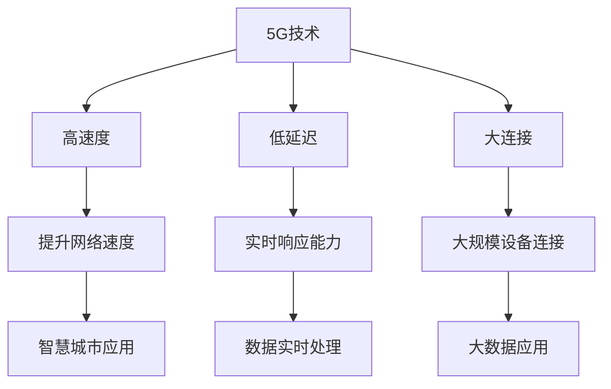

                 

### 文章标题

《5G技术如何重塑智慧城市的未来》

随着科技的飞速发展，5G技术正在成为推动社会进步的重要力量。5G网络的高带宽、低延迟和大连接特性，使得智慧城市建设成为可能，从而大幅提升了城市的管理效率、居民的生活质量以及整体的经济效益。本文将详细探讨5G技术如何通过其关键特性和实际应用，深刻重塑智慧城市的未来。

### 关键词

5G技术、智慧城市、网络速度、物联网、低延迟、智能交通、智能照明、智能安防

### 摘要

本文旨在探讨5G技术对智慧城市发展的深远影响。首先，我们将概述5G技术的基本概念及其与智慧城市的关联。接着，深入分析5G网络的关键技术，如NR、MIMO和多连接技术，并解释这些技术在提升网络性能方面的作用。然后，通过具体应用场景和案例，展示5G技术在智慧城市中的实际效用。最后，讨论5G技术面临的挑战及其未来发展趋势，为智慧城市的建设提供指导和借鉴。

---

### 引言

#### 背景介绍

在过去的几十年中，城市化进程不断加快，城市规模不断扩大，人口密度不断上升。然而，传统城市管理模式面临着交通拥堵、能源浪费、环境污染等诸多问题。智慧城市概念的提出，旨在通过信息技术的应用，实现城市资源的优化配置和高效管理，从而提高城市生活质量和环境可持续性。

#### 5G技术的重要性

5G技术作为新一代通信技术，具有高速率、低延迟和大连接能力，被认为是实现智慧城市的关键驱动力。相较于前几代通信技术，5G不仅在网络速度和容量上有了质的飞跃，还在用户体验和业务创新方面带来了前所未有的可能性。

### 核心概念与联系

#### 5G技术的基本概念

5G技术，即第五代移动通信技术，是继1G、2G、3G和4G之后的最新一代移动通信技术。其主要特点包括：

1. **高速度**：5G网络的理论最高下载速度可达20Gbps，比4G网络快百倍，大大提高了数据传输效率。
2. **低延迟**：5G网络的端到端延迟可低至1毫秒，比4G网络的延迟降低近一半，显著提升了实时响应能力。
3. **大连接**：5G技术支持每平方公里内连接数达到100万个，远超4G网络的连接密度。

#### 智慧城市的定义和特点

智慧城市是指利用信息技术，如物联网、云计算、大数据和人工智能等，实现城市管理的智能化和精细化。智慧城市的特点包括：

1. **数据驱动**：通过大数据技术收集和分析城市运行数据，为城市管理和决策提供支持。
2. **网络连接**：通过各种传感器和网络连接设备，实现城市各个系统和设施的互联互通。
3. **智能服务**：利用人工智能技术提供个性化的公共服务，提高市民的生活质量和幸福感。

#### 5G技术对智慧城市的影响

5G技术对智慧城市的影响主要体现在以下几个方面：

1. **提升网络速度和容量**：5G的高速度和大容量能够满足智慧城市中大量设备和数据的传输需求。
2. **促进物联网和大数据应用**：5G的低延迟特性使得物联网设备和大数据平台之间的实时通信成为可能，进一步提升了数据分析和应用能力。
3. **改变城市管理和服务的模式**：5G技术为城市管理者提供了更多的数据和技术手段，使得城市管理的智能化和精细化水平大幅提升。

#### 核心概念原理之间的关系架构

为了更好地理解5G技术如何影响智慧城市，我们可以使用Mermaid流程图来展示核心概念之间的关系：

通过以上关系架构图，我们可以清晰地看到5G技术核心特性与智慧城市应用之间的紧密联系。

### 总结

通过本文的介绍，我们可以看到5G技术作为新一代通信技术，具有巨大的潜力来重塑智慧城市的未来。5G技术的高速度、低延迟和大连接特性，不仅能够提升城市管理的效率，还能够为市民提供更加便捷、智能化的服务。随着5G技术的不断成熟和应用，智慧城市的建设将迈入一个新的阶段，带来更多的机遇和挑战。

在接下来的章节中，我们将深入探讨5G网络的关键技术，并分析其在智慧城市中的应用案例，进一步理解5G技术如何具体影响智慧城市的各个方面。让我们继续探索这一令人激动的技术领域。

