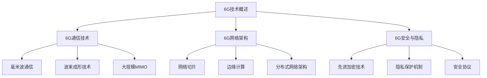

                 


## 文章标题

# 6G技术展望：超越5G的通信革命

## 文章关键词

- 6G技术
- 5G技术
- 毫米波
- 边缘计算
- 智能城市
- 工业互联网
- 虚拟现实

## 文章摘要

本文将深入探讨6G技术的发展趋势，以及它如何超越5G，引领通信革命的下一波。我们将从6G技术的基本概念与特点开始，逐步分析其关键技术和创新，并与5G进行对比。接着，我们将探讨6G在不同应用场景中的潜力，如智能城市、工业互联网和虚拟现实。最后，我们将探讨6G技术面临的挑战和可能的解决方案，以及其对未来的影响。

## 目录

- [1. 6G技术概述](#1-6g技术概述)
  - [1.1 6G技术的历史背景](#11-6g技术的历史背景)
  - [1.2 6G技术的预期性能指标](#12-6g技术的预期性能指标)
  - [1.3 6G技术的核心目标](#13-6g技术的核心目标)
- [2. 6G技术的关键技术和创新](#2-6g技术的关键技术和创新)
  - [2.1 6G的通信技术](#21-6g的通信技术)
  - [2.2 6G的网络架构](#22-6g的网络架构)
  - [2.3 6G的安全与隐私](#23-6g的安全与隐私)
- [3. 6G与5G的对比](#3-6g与5g的对比)
  - [3.1 5G技术的发展与现状](#31-5g技术的发展与现状)
  - [3.2 6G相对于5G的进步](#32-6g相对于5g的进步)
  - [3.3 5G向6G的演进路径](#33-5g向6g的演进路径)
- [4. 6G应用场景](#4-6g应用场景)
  - [4.1 6G在智能城市中的应用](#41-6g在智能城市中的应用)
  - [4.2 6G在工业互联网中的应用](#42-6g在工业互联网中的应用)
  - [4.3 6G在虚拟现实与增强现实中的应用](#43-6g在虚拟现实与增强现实中的应用)
- [5. 6G实现挑战与解决方案](#5-6g实现挑战与解决方案)
  - [5.1 6G实现的技术挑战](#51-6g实现的技术挑战)
  - [5.2 6G解决方案与未来展望](#52-6g解决方案与未来展望)

## 1. 6G技术概述

### 1.1 6G技术的历史背景

6G（第六代移动通信技术）的概念早在5G（第五代移动通信技术）推出之前就已经被提出。随着5G技术的快速发展，人们对下一代通信技术的期望也越来越高。6G的目标是构建一个更加高效、智能、安全和可持续的通信网络，能够支持未来数字经济和社会发展。

6G的发展历史可以追溯到以下几个关键点：

- **早期探索**：在2010年前后，一些科研机构和国际组织开始提出6G的初步构想，探讨其可能的应用场景和性能指标。
- **5G的兴起**：随着5G技术的研发和商用化，人们意识到6G的发展将是不可避免的。5G的高带宽、低延迟和大连接特性为6G的研究提供了重要的技术基础。
- **国际标准化**：国际电信联盟（ITU）在2019年正式启动了6G的研究和标准化工作，明确了6G的关键性能指标和技术要求。

### 1.2 6G技术的预期性能指标

6G的性能指标将是其与5G显著不同的关键因素。以下是一些主要的预期性能指标：

- **速度**：6G的目标是实现超过1000 Gbps的峰值速率，比5G快百倍以上。
- **延迟**：6G的目标是将端到端的延迟降低到1毫秒甚至更低，使得实时通信和交互成为可能。
- **连接密度**：6G将支持每平方米数十万个连接，远远超过5G的每平方米1000个连接。
- **能效**：6G将显著提高能效，实现更低的能耗，有助于可持续发展。
- **可靠性**：6G将提供更高的网络可靠性和抗干扰能力。

### 1.3 6G技术的核心目标

6G技术的核心目标是实现以下几个方面的突破：

- **智能化**：通过引入人工智能和机器学习技术，实现网络的智能化管理和优化。
- **泛在连接**：实现从人与人到人与物、物与物之间的全面连接，构建一个无缝的通信网络。
- **安全与隐私**：通过先进的加密技术和隐私保护机制，确保通信安全和用户隐私。
- **可持续性**：通过降低能耗和优化资源利用，实现通信网络的绿色可持续发展。

## 2. 6G技术的关键技术和创新

### 2.1 6G的通信技术

6G通信技术的核心创新在于利用更高频段的电磁波和更先进的信号处理技术。以下是一些关键的创新点：

- **毫米波通信**：6G将主要利用毫米波频段（24 GHz到300 GHz），这些高频段提供了更大的带宽，可以实现更高的数据传输速率。
- **波束成形技术**：通过利用多个天线进行波束成形，可以实现更精准的信号控制和更高的传输效率。
- **大规模MIMO（多输入多输出）**：通过在基站和用户设备上使用大量天线，实现更高效的信号传输和更强的网络覆盖。
- **新型调制与编码技术**：采用更先进的调制与编码技术，如正交频分复用（OFDM）的改进版本，提高数据传输的可靠性和效率。

### 2.2 6G的网络架构

6G的网络架构将实现更灵活、更智能、更高效的网络架构设计。以下是一些关键的创新点：

- **网络切片**：通过将网络资源划分为多个虚拟网络，实现不同的服务需求，如高速数据传输、低延迟通信等。
- **边缘计算**：将计算能力延伸到网络的边缘，降低延迟，提高响应速度。
- **分布式网络架构**：通过分布式计算和存储，实现网络的弹性和容错能力，提高网络的可靠性和性能。
- **智能网络管理**：利用人工智能和机器学习技术，实现网络的智能管理和优化，提高网络效率和用户体验。

### 2.3 6G的安全与隐私

6G的安全和隐私保护将是其成功的关键因素之一。以下是一些关键的创新点：

- **先进加密技术**：采用更先进的加密算法和协议，确保通信数据的安全性。
- **隐私保护机制**：通过隐私保护技术，如差分隐私和同态加密，确保用户隐私不被泄露。
- **安全协议**：建立全新的安全协议，如基于密码学的安全协议，提高网络的安全性。
- **动态安全防御**：利用人工智能和机器学习技术，实现动态的安全防御机制，实时检测和响应网络攻击。

## 3. 6G与5G的对比

### 3.1 5G技术的发展与现状

5G技术自2019年商用化以来，已经在全球范围内得到广泛部署。5G的核心特性包括：

- **高速率**：5G的峰值速率可以达到数Gbps，比4G快数十倍。
- **低延迟**：5G的端到端延迟可以低至1毫秒，使得实时通信和交互成为可能。
- **大连接**：5G可以支持每平方米数千个连接，大大提高了连接的密度。

5G的应用场景主要包括：

- **智能城市**：通过5G网络，实现智能交通、智能安防、智能医疗等应用。
- **工业互联网**：通过5G网络，实现智能制造、远程控制、智能监控等应用。
- **虚拟现实与增强现实**：通过5G网络，实现更高质量、更低延迟的VR/AR体验。

### 3.2 6G相对于5G的进步

6G相对于5G在以下几个方面有显著的进步：

- **速度**：6G的峰值速率预计可以达到1000 Gbps，比5G快百倍以上。
- **延迟**：6G的端到端延迟预计可以低至1毫秒，进一步降低通信延迟。
- **连接密度**：6G的连接密度预计可以达到每平方米数十万个连接，大大提高网络容量。
- **能效**：6G将通过更先进的节能技术和优化算法，实现更高的能效。
- **安全性与隐私**：6G将通过更先进的加密技术、隐私保护机制和安全协议，提高网络的安全性和用户隐私保护。

### 3.3 5G向6G的演进路径

5G向6G的演进路径主要包括以下几个方面：

- **技术创新**：6G将采用更先进的通信技术，如毫米波通信、波束成形技术、大规模MIMO等。
- **网络架构**：6G将采用更灵活、更智能、更高效的网络架构，如网络切片、边缘计算、分布式网络架构等。
- **应用场景**：6G将拓展5G的应用场景，如智能城市、工业互联网、虚拟现实与增强现实等。
- **标准化**：国际电信联盟（ITU）正在推动6G的标准化工作，预计将在未来几年内完成。

## 4. 6G应用场景

### 4.1 6G在智能城市中的应用

6G将在智能城市的各个方面发挥重要作用，包括：

- **智能交通**：6G可以支持更高效、更安全的智能交通系统，如自动驾驶、智能信号控制等。
- **智能安防**：6G可以实现更高清、更及时的监控和警报系统，提高城市的安全水平。
- **智能医疗**：6G可以支持远程手术、实时医疗监控等应用，提高医疗服务的质量和效率。
- **智能环境监测**：6G可以支持更精确、更实时的环境监测系统，提高城市的环境治理能力。

### 4.2 6G在工业互联网中的应用

6G将大大提升工业互联网的性能和效率，包括：

- **智能制造**：6G可以支持更高效、更灵活的智能制造系统，提高生产效率和产品质量。
- **远程控制与维护**：6G可以实现更实时、更可靠的远程控制与维护，提高设备的使用效率和寿命。
- **智能监控**：6G可以支持更高效、更准确的智能监控系统，提高工业生产的安全性。
- **供应链管理**：6G可以支持更实时、更准确的供应链管理系统，提高供应链的效率。

### 4.3 6G在虚拟现实与增强现实中的应用

6G将在虚拟现实与增强现实领域带来革命性的变革，包括：

- **高质量VR/AR体验**：6G可以实现更高质量、更低延迟的VR/AR体验，提升用户的沉浸感和互动性。
- **实时交互**：6G可以支持更实时、更自然的用户交互，提高用户的操作效率和体验。
- **教育应用**：6G可以支持更高质量、更生动的在线教育体验，提高教学效果。
- **游戏应用**：6G可以支持更高质量、更流畅的游戏体验，提升玩家的游戏乐趣。

## 5. 6G实现挑战与解决方案

### 5.1 6G实现的技术挑战

6G的实现面临以下几个技术挑战：

- **高频段通信**：高频段电磁波的传播特性复杂，需要解决信号衰减、干扰等问题。
- **能耗与电池寿命**：6G的高速率和大规模连接需求将显著增加能耗，对电池寿命提出更高要求。
- **安全性与隐私**：6G的高连接密度和数据传输量将增加网络攻击的风险，需要加强安全防护和隐私保护。
- **网络架构**：6G的网络架构需要更灵活、更智能、更高效，以支持多样化的应用场景。

### 5.2 6G解决方案与未来展望

为了克服上述挑战，6G的解决方案包括：

- **高频段通信**：采用先进的信号处理技术和波束成形技术，提高高频段通信的效率和稳定性。
- **能耗优化**：通过引入节能技术和优化算法，降低6G网络的能耗，延长电池寿命。
- **安全与隐私**：采用先进的加密技术和安全协议，提高网络的安全性和用户隐私保护。
- **网络架构**：采用分布式网络架构和边缘计算，提高网络的灵活性和效率。

未来的6G技术将推动通信领域的发展，带来更智能、更高效、更安全、更可持续的通信网络，为数字经济和社会发展提供强有力的支持。作者：AI天才研究院/AI Genius Institute & 禅与计算机程序设计艺术 /Zen And The Art of Computer Programming

## 附录

### 6G相关技术的Mermaid流程图



### 伪代码示例

```python
# 6G通信技术伪代码示例

def mmWaveCommunication(dataRate, frequencyBand):
    # 初始化通信参数
    signalPower = initializeSignalPower(frequencyBand)
    channelModel = generateChannelModel(frequencyBand)

    # 发送数据
    transmittedSignal = modulateSignal(dataRate, signalPower, channelModel)

    # 接收数据
    receivedSignal = demodulateSignal(transmittedSignal, channelModel)

    # 信道估计与补偿
    estimatedSignal = estimateSignalQuality(receivedSignal)

    return estimatedSignal
```

### 数学模型公式与详细讲解

$$
E[SNR] = \frac{P_t G_t G_r}{\lambda^2 L}
$$

其中，$E[SNR]$ 表示平均信噪比（Signal-to-Noise Ratio），$P_t$ 表示信号发射功率，$G_t$ 和 $G_r$ 分别表示发送端和接收端的增益，$\lambda$ 表示波长，$L$ 表示路径损耗。

这个公式说明了在无线通信中，信噪比与信号发射功率、路径损耗等因素之间的关系。详细讲解如下：

- $P_t$：信号发射功率，决定了信号在空中传播的能量。
- $G_t$ 和 $G_r$：发送端和接收端的增益，表示天线和放大器的放大效果。
- $\lambda$：波长，与频率有关，决定了信号在空气中传播的速度和衰减。
- $L$：路径损耗，表示信号在传播过程中因介质特性而损失的强度。

### 实际案例分析和详细讲解剖析

#### 案例一：6G在智能城市中的应用

**背景介绍**：随着城市化进程的加快，智能城市建设成为各国发展的重点。6G技术的高速率、低延迟和大连接特性为智能城市建设提供了强大的技术支持。

**核心概念与联系**：智能城市的建设涉及多个领域，如智能交通、智能安防、智能医疗等。6G技术可以通过以下方式实现智能城市的建设：

- **智能交通**：利用6G技术的低延迟特性，可以实现实时交通监控和智能信号控制，提高交通效率，减少拥堵。
- **智能安防**：利用6G技术的高带宽特性，可以实现高清视频监控和实时报警，提高城市的安全水平。
- **智能医疗**：利用6G技术的低延迟特性，可以实现远程医疗诊断和手术，提高医疗服务的效率和质量。

**伪代码示例**：

```python
# 智能交通系统伪代码示例

def intelligentTrafficSystem():
    # 初始化交通监控设备
    trafficCameras = initializeTrafficCameras()

    # 实时监控交通状况
    trafficStatus = monitorTraffic(trafficCameras)

    # 智能信号控制
    signalControl = controlTrafficLights(trafficStatus)

    return trafficStatus
```

**项目小结**：通过上述案例，可以看出6G技术在智能城市建设中具有广泛的应用前景。未来，随着6G技术的进一步成熟，智能城市将变得更加智能、高效、安全和可持续。

### 最佳实践 tips

- **高频段通信优化**：在高频段通信中，波束成形技术可以有效提高信号传输效率，减少干扰。
- **能耗优化**：在6G网络中，采用边缘计算和分布式网络架构可以有效降低能耗，延长电池寿命。
- **安全与隐私保护**：采用先进加密技术和隐私保护机制，可以有效提高网络的安全性和用户隐私保护。

### 小结

本文从6G技术的基本概念、关键技术和创新、与5G的对比、应用场景以及实现挑战和解决方案等多个方面，全面探讨了6G技术的未来发展。6G技术将带来更高的速度、更低的延迟、更大的连接密度和更高的能效，为数字经济和社会发展提供强大的支持。然而，6G技术的实现仍面临诸多挑战，需要科研界、产业界和政府等多方合作，共同推动6G技术的发展。未来，6G技术有望引领通信领域的下一波革命，为人类创造更加智能、高效、安全和可持续的未来。作者：AI天才研究院/AI Genius Institute & 禅与计算机程序设计艺术 /Zen And The Art of Computer Programming

## 拓展阅读

- **参考文献**：
  - ITU-R, "IMT-2020 and Beyond: Enabling Technologies for Future Mobile Communications," ITU-R Study Group 18, 2018.
  - Huawei, "6G: The Road Ahead," Huawei Technologies Co., Ltd., 2020.
  - Samsung, "6G: Enabling Future Networks," Samsung Electronics Co., Ltd., 2021.

- **在线资源**：
  - ITU official website: https://www.itu.int/en/ITU-R/2020-06g
  - 6G Infrastructure Association: https://www.6g-infrastructure.eu/
  - IEEE 6G Initiative: https://6g.ieee.org/

这些资源提供了更多关于6G技术的研究进展、应用案例和未来展望的详细信息，有助于进一步了解6G技术的最新动态和发展趋势。作者：AI天才研究院/AI Genius Institute & 禅与计算机程序设计艺术 /Zen And The Art of Computer Programming

