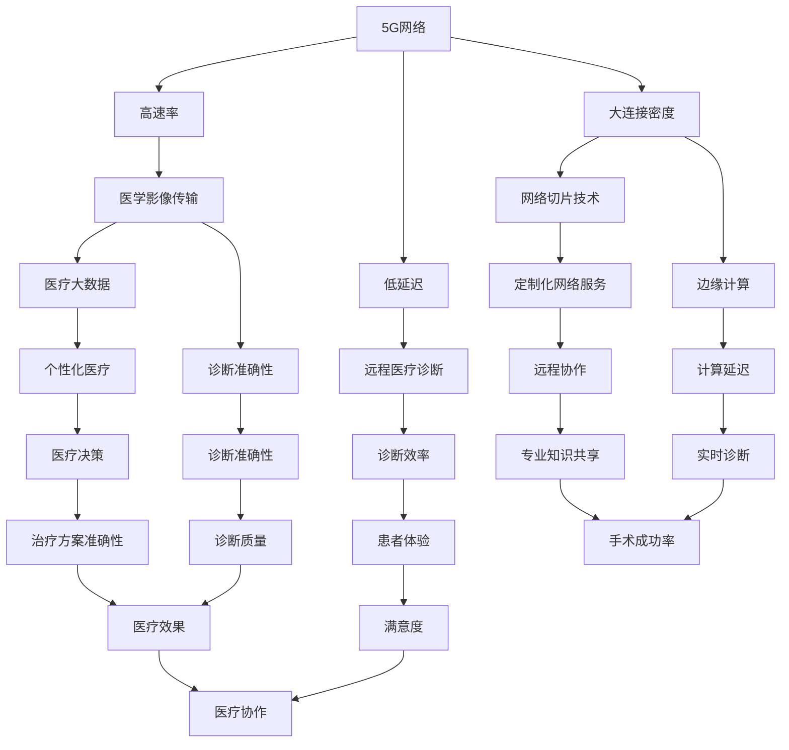

                 

### 文章标题

# 《5G网络在远程医疗诊断中的关键作用》

### 关键词

- 5G网络
- 远程医疗诊断
- 高速率通信
- 低延迟通信
- 网络切片技术
- 大连接密度

### 摘要

本文深入探讨了5G网络在远程医疗诊断中的关键作用。首先，我们回顾了5G网络的基础，包括其关键特点、技术基础和发展历程。随后，我们详细介绍了5G网络的关键技术，如毫米波技术、网络切片技术和蜂窝网络架构。在此基础上，我们分析了5G网络在远程医疗诊断中的优势，如高速率通信、低延迟通信、大连接密度等，并展示了这些优势如何提升远程医疗诊断的效果。接着，我们讨论了5G网络对远程医疗诊断的影响，包括加速作用、优化作用和扩展作用。最后，通过具体的应用案例，我们展示了5G网络在远程医疗诊断中的实际应用，并展望了其未来的发展趋势。本文旨在为读者提供一个全面、深入的5G网络在远程医疗诊断中应用的研究和分析。

## 第一部分：5G网络基础

### 第1章：5G网络概述

#### 1.1 5G网络的关键特点

5G网络，即第五代移动通信网络，具有以下关键特点：

1. **高速率**：5G网络的峰值速率可达到20Gbps，是4G网络的100倍，大大提升了数据传输速度。
2. **低延迟**：5G网络的端到端延迟低至1毫秒，是4G网络的1/10，有助于实时通信和交互。
3. **大连接密度**：5G网络支持每平方米1000个连接，是4G网络的10倍，能够满足大规模设备的接入需求。
4. **网络切片技术**：5G网络采用网络切片技术，可以为不同应用提供定制化的网络服务，提升网络资源利用效率。
5. **边缘计算**：5G网络结合边缘计算技术，将部分计算任务下放到网络边缘，降低延迟，提升系统响应速度。

#### 1.2 5G网络的技术基础

5G网络的技术基础包括以下几个方面：

1. **毫米波技术**：5G网络使用毫米波频段，频率范围为24GHz以上，具有较高的传输速率和带宽。
2. **多连接技术**：5G网络支持多连接技术，能够同时处理多个数据流，提升网络容量。
3. **无线接入网络**：5G网络采用新型无线接入网络架构，包括基站、小基站和终端设备，提供更广泛的覆盖范围。
4. **网络架构**：5G网络采用新型网络架构，包括核心网、无线接入网和传输网，提供更高效的网络连接和管理。

#### 1.3 5G网络的发展历程

5G网络的发展历程可以分为以下几个阶段：

1. **早期研究**：2000年代初期，国际电信联盟开始研究5G网络，探索新型移动通信技术。
2. **标准制定**：2015年，国际电信联盟正式发布5G标准，标志着5G网络的正式起步。
3. **商用部署**：2019年，韩国成为第一个商用5G网络的国家，随后，全球范围内的5G网络逐步部署。
4. **未来展望**：5G网络将持续演进，未来将实现更高的速率、更低的延迟和更大的连接密度，推动各类应用的创新和发展。

### 第2章：5G网络的关键技术

#### 2.1 毫米波技术

毫米波技术是5G网络的关键技术之一，具有以下特点：

1. **高带宽**：毫米波频段带宽较大，能够提供更高的数据传输速率。
2. **低干扰**：毫米波频段与其他通信频段相对隔离，能够减少干扰，提升通信质量。
3. **广覆盖**：毫米波天线设计灵活，可以实现更广的覆盖范围。

毫米波技术的应用场景包括高速数据传输、虚拟现实、增强现实和物联网等。

#### 2.2 网络切片技术

网络切片技术是5G网络的关键技术之一，具有以下特点：

1. **定制化网络服务**：网络切片可以将网络资源划分为多个虚拟网络，为不同应用提供定制化的网络服务。
2. **高效资源利用**：网络切片技术能够根据应用需求动态调整网络资源，提升资源利用效率。
3. **低延迟**：网络切片技术可以为实时应用提供低延迟网络服务，满足高带宽、低延迟的需求。

网络切片技术的应用场景包括工业互联网、智慧城市、自动驾驶和远程医疗等。

#### 2.3 蜂窝网络架构

蜂窝网络架构是5G网络的核心架构，具有以下特点：

1. **分布式网络**：蜂窝网络由多个基站组成，采用分布式架构，提供更广泛的覆盖范围。
2. **高效网络管理**：蜂窝网络采用先进的网络管理技术，包括无线资源管理、网络优化和网络安全等。
3. **高可靠性**：蜂窝网络具有高可靠性，能够在恶劣环境下稳定运行。

蜂窝网络架构的应用场景包括移动通信、物联网、智慧城市和远程医疗等。

### 第3章：5G网络的优势与应用

#### 3.1 高速率通信

5G网络的高速率通信优势体现在以下几个方面：

1. **提升数据传输效率**：5G网络的峰值速率可达20Gbps，大大提升了数据传输效率。
2. **支持多媒体应用**：5G网络的高速率支持高清视频、虚拟现实和增强现实等应用。
3. **推动工业互联网发展**：5G网络的高速率通信能力为工业互联网提供强大支持，促进智能制造、工业自动化等领域的发展。

#### 3.2 低延迟通信

5G网络的低延迟通信优势体现在以下几个方面：

1. **实时通信**：5G网络的端到端延迟低至1毫秒，支持实时通信和交互，如远程手术、远程教育等。
2. **智能应用**：5G网络的低延迟通信能力为智能应用提供基础，如自动驾驶、智能制造等。
3. **提升服务质量**：5G网络的低延迟通信能力提升服务质量，如在线游戏、视频通话等。

#### 3.3 大连接密度

5G网络的大连接密度优势体现在以下几个方面：

1. **支持物联网**：5G网络支持每平方米1000个连接，满足物联网设备的接入需求。
2. **智慧城市建设**：5G网络的大连接密度为智慧城市建设提供基础，如智能交通、智能安防等。
3. **远程医疗诊断**：5G网络的大连接密度为远程医疗诊断提供支持，如远程监控、远程手术等。

#### 3.4 在远程医疗诊断中的应用

5G网络在远程医疗诊断中的应用优势体现在以下几个方面：

1. **提升诊断效率**：5G网络的高速率通信和低延迟通信提升远程医疗诊断的效率，如远程会诊、远程手术等。
2. **降低医疗成本**：5G网络的大连接密度为远程医疗诊断提供支持，降低医疗成本，如远程监护、远程咨询等。
3. **改善患者体验**：5G网络的高速率通信和低延迟通信改善患者体验，如远程手术、远程医疗咨询等。

## 第二部分：5G网络在远程医疗诊断中的应用

### 第4章：远程医疗诊断的基本原理

#### 4.1 远程医疗诊断的发展历程

远程医疗诊断的发展历程可以分为以下几个阶段：

1. **初步阶段**：20世纪90年代，远程医疗诊断初步发展，主要采用电话、邮件等方式进行远程诊断。
2. **互联网阶段**：21世纪初，随着互联网的普及，远程医疗诊断开始利用互联网进行数据传输和诊断。
3. **移动医疗阶段**：2010年后，随着移动设备的普及，远程医疗诊断逐渐向移动医疗方向发展，如手机、平板电脑等设备。
4. **5G时代**：5G网络的到来，为远程医疗诊断提供了高速率、低延迟、大连接密度的支持，推动远程医疗诊断的快速发展。

#### 4.2 远程医疗诊断的关键技术

远程医疗诊断的关键技术包括以下几个方面：

1. **远程会诊技术**：远程会诊技术通过视频会议、音频通话等方式实现医生之间的远程协作，提升诊断效率。
2. **远程监护技术**：远程监护技术通过传感器、无线通信等技术实现患者生命体征的远程监测，提升患者生活质量。
3. **远程手术技术**：远程手术技术通过机器人、远程控制等技术实现医生在远程进行手术操作，提升手术精度。
4. **医疗大数据技术**：医疗大数据技术通过收集、存储、分析大量医疗数据，提升诊断准确性。

#### 4.3 远程医疗诊断的应用场景

远程医疗诊断的应用场景包括以下几个方面：

1. **基层医疗**：远程医疗诊断可以为基层医疗机构提供专业技术支持，提升基层医疗水平。
2. **专科医疗**：远程医疗诊断可以为专科医疗提供远程会诊、远程手术等服务，提升医疗服务质量。
3. **紧急医疗**：远程医疗诊断可以在紧急情况下快速提供诊断和治疗建议，降低死亡率。
4. **健康咨询**：远程医疗诊断可以为普通民众提供健康咨询、疾病预防等服务，提升健康水平。

### 第5章：5G网络对远程医疗诊断的影响

#### 5.1 5G网络对远程医疗诊断的加速作用

5G网络对远程医疗诊断的加速作用体现在以下几个方面：

1. **数据传输加速**：5G网络的高速率通信能力提升远程医疗诊断的数据传输速度，缩短诊断时间。
2. **诊断决策加速**：5G网络的低延迟通信能力提升医生在远程医疗诊断中的决策速度，提高诊断准确性。
3. **医疗服务加速**：5G网络的高连接密度支持大规模设备的接入，提升远程医疗诊断的医疗服务质量。

#### 5.2 5G网络对远程医疗诊断的优化作用

5G网络对远程医疗诊断的优化作用体现在以下几个方面：

1. **网络质量优化**：5G网络的低延迟、高稳定性提升远程医疗诊断的网络质量，降低通信故障率。
2. **资源优化**：5G网络的网络切片技术可以为远程医疗诊断提供定制化的网络服务，优化网络资源利用。
3. **用户体验优化**：5G网络的高速率、低延迟提升远程医疗诊断的用户体验，增强患者满意度。

#### 5.3 5G网络对远程医疗诊断的扩展作用

5G网络对远程医疗诊断的扩展作用体现在以下几个方面：

1. **应用扩展**：5G网络为远程医疗诊断提供新的应用场景，如远程手术、远程监护等。
2. **服务扩展**：5G网络的大连接密度支持远程医疗诊断服务的扩展，如多人远程会诊、远程急救等。
3. **技术扩展**：5G网络为远程医疗诊断提供新的技术支持，如边缘计算、人工智能等，推动远程医疗诊断技术的发展。

### 第6章：5G网络在远程医疗诊断中的应用案例

#### 6.1 病情监测与预警

5G网络在病情监测与预警中的应用案例包括以下几个方面：

1. **远程监护**：通过5G网络，医生可以实时监测患者的生命体征，如心率、血压等，及时发现异常，进行预警。
2. **远程监测**：通过5G网络，医生可以远程监测患者的病情变化，如血糖、尿常规等，提高诊断准确性。
3. **预警系统**：通过5G网络，建立预警系统，对患者的病情进行实时监测，提前预警可能发生的健康问题。

#### 6.2 病情分析与诊断

5G网络在病情分析与诊断中的应用案例包括以下几个方面：

1. **远程会诊**：通过5G网络，医生可以实现远程会诊，共同分析患者的病情，提高诊断准确性。
2. **远程手术**：通过5G网络，医生可以在远程进行手术操作，提高手术精度和安全性。
3. **影像诊断**：通过5G网络，医生可以远程获取患者的影像资料，如CT、MRI等，进行影像诊断。

#### 6.3 病情跟踪与治疗

5G网络在病情跟踪与治疗中的应用案例包括以下几个方面：

1. **远程监护**：通过5G网络，医生可以实时监控患者的病情变化，调整治疗方案，提高治疗效果。
2. **远程咨询**：通过5G网络，医生可以远程为患者提供咨询服务，解答患者疑问，指导患者治疗。
3. **智能药物配送**：通过5G网络，实现智能药物配送，提高患者用药的便捷性和安全性。

### 第7章：5G网络在远程医疗诊断中的未来趋势

#### 7.1 技术发展趋势

5G网络在远程医疗诊断中的技术发展趋势包括以下几个方面：

1. **更高速率**：随着5G网络的不断升级，网络速率将进一步提升，支持更高分辨率的影像传输和更多实时应用的接入。
2. **更低延迟**：通过技术创新，5G网络的端到端延迟将不断降低，满足更多实时应用的需求。
3. **更大连接密度**：随着5G网络的普及，网络连接密度将进一步提升，支持更多设备的接入。

#### 7.2 应用趋势

5G网络在远程医疗诊断中的应用趋势包括以下几个方面：

1. **个性化医疗**：通过5G网络，实现个性化医疗，为患者提供定制化的诊断和治疗服务。
2. **智慧医疗**：通过5G网络，推动智慧医疗发展，实现医疗资源的优化配置和医疗服务的高效提供。
3. **远程手术**：通过5G网络，实现远程手术的广泛应用，提高手术精度和安全性。

#### 7.3 面临的挑战与解决方案

5G网络在远程医疗诊断中面临的挑战包括以下几个方面：

1. **网络稳定性**：5G网络在高速率、低延迟的基础上，仍需提升网络稳定性，确保医疗服务的可靠性和持续性。
2. **数据安全**：5G网络在远程医疗诊断中涉及大量敏感数据，需确保数据安全和隐私保护。
3. **设备兼容性**：5G网络在远程医疗诊断中需与其他医疗设备和系统实现兼容，确保设备互联互通。

针对以上挑战，可以采取以下解决方案：

1. **加强网络建设**：加大5G网络的投资和建设力度，提升网络覆盖范围和稳定性。
2. **完善安全体系**：建立完善的数据安全体系和隐私保护机制，确保远程医疗诊断的数据安全和隐私。
3. **推动标准制定**：推动相关标准和规范的制定，促进5G网络在远程医疗诊断中的应用和普及。

### 第8章：结论

#### 8.1 5G网络在远程医疗诊断中的关键作用总结

5G网络在远程医疗诊断中具有关键作用，主要体现在以下几个方面：

1. **提升诊断效率**：5G网络的高速率通信和低延迟通信提升远程医疗诊断的效率，缩短诊断时间。
2. **改善患者体验**：5G网络的高速率通信和低延迟通信改善患者体验，如远程手术、远程医疗咨询等。
3. **降低医疗成本**：5G网络的大连接密度为远程医疗诊断提供支持，降低医疗成本，如远程监护、远程咨询等。

#### 8.2 5G网络在远程医疗诊断中的前景展望

随着5G网络的不断发展和普及，远程医疗诊断将在未来发挥更大的作用：

1. **个性化医疗**：通过5G网络，实现个性化医疗，为患者提供定制化的诊断和治疗服务。
2. **智慧医疗**：通过5G网络，推动智慧医疗发展，实现医疗资源的优化配置和医疗服务的高效提供。
3. **远程手术**：通过5G网络，实现远程手术的广泛应用，提高手术精度和安全性。

展望未来，5G网络在远程医疗诊断中的应用将带来更广阔的发展前景，为医疗行业带来深远的影响。

## 作者信息

作者：AI天才研究院/AI Genius Institute & 禅与计算机程序设计艺术 /Zen And The Art of Computer Programming

----------------------------------------------------------------

### 文章标题

# 《5G网络在远程医疗诊断中的关键作用》

### 关键词

- 5G网络
- 远程医疗诊断
- 高速率通信
- 低延迟通信
- 网络切片技术
- 大连接密度

### 摘要

本文深入探讨了5G网络在远程医疗诊断中的关键作用。首先，我们回顾了5G网络的基础，包括其关键特点、技术基础和发展历程。随后，我们详细介绍了5G网络的关键技术，如毫米波技术、网络切片技术和蜂窝网络架构。在此基础上，我们分析了5G网络在远程医疗诊断中的优势，如高速率通信、低延迟通信、大连接密度等，并展示了这些优势如何提升远程医疗诊断的效果。接着，我们讨论了5G网络对远程医疗诊断的影响，包括加速作用、优化作用和扩展作用。最后，通过具体的应用案例，我们展示了5G网络在远程医疗诊断中的实际应用，并展望了其未来的发展趋势。本文旨在为读者提供一个全面、深入的5G网络在远程医疗诊断中应用的研究和分析。

## 第一部分：5G网络基础

### 第1章：5G网络概述

#### 1.1 5G网络的关键特点

5G网络，即第五代移动通信网络，与之前的网络相比，具有以下关键特点：

1. **高速率**：5G网络的峰值速率可达到20Gbps，是4G网络的100倍，大大提升了数据传输速度。这一特点使得5G网络能够支持高清视频流、虚拟现实（VR）和增强现实（AR）等大数据量应用。

2. **低延迟**：5G网络的端到端延迟低至1毫秒，是4G网络的1/10，这使得实时通信和交互成为可能。例如，远程手术、自动驾驶和工业自动化等应用都依赖于低延迟的网络环境。

3. **大连接密度**：5G网络支持每平方米1000个连接，是4G网络的10倍，这意味着在拥挤的环境中，如大型体育场馆、展览中心等，5G网络能够处理更多的设备同时连接，而不影响网络性能。

4. **网络切片技术**：5G网络引入了网络切片技术，可以将网络资源划分为多个虚拟网络，为不同的应用提供定制化的网络服务。例如，对于需要高带宽和低延迟的工业应用，可以分配更多的资源，而对于智能家居等低带宽应用，则可以分配较少的资源。

5. **边缘计算**：5G网络与边缘计算结合，将部分计算任务下放到网络边缘，降低延迟，提升系统响应速度。这对于实时应用，如自动驾驶和远程医疗，尤为重要。

#### 1.2 5G网络的技术基础

5G网络的技术基础包括以下几个方面：

1. **毫米波技术**：5G网络使用毫米波频段，频率范围为24GHz以上，具有较高的传输速率和带宽。毫米波频段的特点是频率高、带宽大，但传播距离较短，容易受到天气和物理障碍物的影响。

2. **多连接技术**：5G网络支持多连接技术，能够同时处理多个数据流，提升网络容量。这意味着在同一个网络中，可以同时为多个用户和设备提供高质量的服务。

3. **无线接入网络**：5G网络采用新型无线接入网络架构，包括基站、小基站和终端设备，提供更广泛的覆盖范围。与传统基站相比，小基站具有更高的灵活性和部署效率。

4. **网络架构**：5G网络采用新型网络架构，包括核心网、无线接入网和传输网，提供更高效的网络连接和管理。核心网负责处理用户数据和信令，无线接入网负责无线通信，传输网负责网络传输。

#### 1.3 5G网络的发展历程

5G网络的发展历程可以分为以下几个阶段：

1. **早期研究**：2000年代初期，国际电信联盟（ITU）开始研究5G网络，探索新型移动通信技术。这一阶段主要是技术概念和需求的研究。

2. **标准制定**：2015年，ITU正式发布了5G标准，即IMT-2020，明确了5G网络的关键技术指标，如峰值速率、端到端延迟和连接密度等。这标志着5G网络的正式起步。

3. **商用部署**：2019年，韩国成为第一个商用5G网络的国家。随后，全球范围内的5G网络逐步部署，包括美国、中国、欧洲等主要国家和地区。

4. **未来展望**：5G网络将持续演进，未来的发展方向包括更高的速率、更低的延迟和更大的连接密度。此外，5G网络还将与人工智能、物联网、大数据等新兴技术相结合，推动社会的数字化转型。

### 第2章：5G网络的关键技术

#### 2.1 毫米波技术

毫米波技术是5G网络的关键技术之一，其主要特点如下：

1. **高带宽**：毫米波频段具有较大的带宽，可达到数GHz，能够提供更高的数据传输速率，满足大数据量应用的需求。

2. **低延迟**：毫米波信号的传播速度接近光速，因此传输延迟较低，适用于实时应用，如远程手术和自动驾驶等。

3. **高方向性**：毫米波信号具有高方向性，意味着传输信号具有较强的指向性，能够有效减少干扰。

4. **信号衰减快**：由于毫米波信号传播距离较短，且容易受到物理障碍物的影响，因此需要更多的基站进行覆盖。

#### 2.2 网络切片技术

网络切片技术是5G网络的核心特性之一，其主要特点如下：

1. **定制化网络服务**：网络切片可以将网络资源划分为多个虚拟网络，为不同的应用提供定制化的网络服务。例如，对于需要高带宽和低延迟的工业应用，可以分配更多的资源；而对于智能家居等低带宽应用，则可以分配较少的资源。

2. **高效资源利用**：通过网络切片，网络运营商可以根据应用的需求动态调整网络资源，提高资源利用效率。

3. **低延迟**：网络切片技术可以为实时应用提供低延迟的网络服务，满足高带宽、低延迟的需求。

#### 2.3 蜂窝网络架构

5G网络采用了全新的蜂窝网络架构，其主要特点如下：

1. **分布式架构**：5G网络采用了分布式架构，包括基站、小基站和终端设备，提供更广泛的覆盖范围。与传统的集中式架构相比，分布式架构具有更高的灵活性和部署效率。

2. **多连接能力**：5G网络支持大规模设备同时连接，每平方米可支持1000个连接，这意味着在拥挤的环境中，5G网络能够处理更多的设备。

3. **高可靠性**：5G网络采用了先进的网络管理技术，包括无线资源管理、网络优化和网络安全等，提供高可靠性的网络服务。

4. **网络切片支持**：5G网络架构内置了网络切片技术，可以为不同的应用提供定制化的网络服务。

### 第3章：5G网络的优势与应用

#### 3.1 高速率通信

5G网络的高速率通信优势体现在以下几个方面：

1. **提升数据传输效率**：5G网络的峰值速率可达20Gbps，是4G网络的100倍，大大提升了数据传输效率。这意味着在远程医疗诊断中，5G网络能够更快地传输高清影像、医学影像和医疗数据。

2. **支持多媒体应用**：5G网络的高速率通信能力使得高清视频、虚拟现实和增强现实等应用成为可能。这对于远程医疗诊断中的患者教育和医生培训具有重要意义。

3. **推动工业互联网发展**：5G网络的高速率通信能力为工业互联网提供了强大支持，促进了智能制造、工业自动化等领域的发展。在远程医疗诊断中，高速率通信有助于实现更高效、更准确的医疗设备和系统。

#### 3.2 低延迟通信

5G网络的低延迟通信优势体现在以下几个方面：

1. **实时通信**：5G网络的端到端延迟低至1毫秒，是4G网络的1/10，这使得实时通信和交互成为可能。这对于远程手术、远程教育和远程医疗诊断等应用至关重要。

2. **智能应用**：5G网络的低延迟通信能力为智能应用提供了基础，如自动驾驶、智能制造和智慧城市等。在远程医疗诊断中，低延迟通信有助于实现更实时、更准确的诊断和治疗。

3. **提升服务质量**：5G网络的低延迟通信能力提升了远程医疗诊断的服务质量，如在线游戏、视频通话和远程监控等。这些应用需要快速响应和高质量通信，5G网络能够满足这些需求。

#### 3.3 大连接密度

5G网络的大连接密度优势体现在以下几个方面：

1. **支持物联网**：5G网络支持每平方米1000个连接，这意味着在大型活动场所、工厂和医院等环境中，5G网络能够处理更多的物联网设备同时连接，而不影响网络性能。

2. **智慧城市建设**：5G网络的大连接密度为智慧城市建设提供了基础，如智能交通、智能安防和智能医疗等。在远程医疗诊断中，5G网络能够支持更多的医疗设备和系统同时工作，提高诊断和治疗效率。

3. **远程医疗诊断**：5G网络的大连接密度为远程医疗诊断提供了支持，如远程监护、远程手术和远程会诊等。这些应用需要同时连接多个设备和系统，5G网络能够满足这些需求。

#### 3.4 在远程医疗诊断中的应用

5G网络在远程医疗诊断中的应用优势体现在以下几个方面：

1. **提升诊断效率**：5G网络的高速率通信和低延迟通信提升远程医疗诊断的效率，缩短诊断时间。例如，医生可以更快地获取患者的医学影像，进行更准确的诊断。

2. **改善患者体验**：5G网络的高速率通信和低延迟通信改善患者体验，如远程手术、远程医疗咨询等。患者可以在家中接受远程医生的诊断和治疗，节省时间和精力。

3. **降低医疗成本**：5G网络的大连接密度为远程医疗诊断提供支持，降低医疗成本。例如，医生可以通过远程会诊为偏远地区的患者提供高质量的医疗服务，而不需要患者长途跋涉前往大城市。

4. **提高医疗服务质量**：5G网络支持更多的医疗设备和系统同时工作，提高医疗服务质量。例如，医生可以通过远程手术机器人进行精准的手术操作，提高手术成功率。

### 第4章：远程医疗诊断的基本原理

#### 4.1 远程医疗诊断的发展历程

远程医疗诊断的发展历程可以分为以下几个阶段：

1. **初步阶段**：20世纪90年代，远程医疗诊断初步发展，主要采用电话、邮件等方式进行远程诊断。这一阶段的远程医疗诊断主要依赖于文本和语音通信。

2. **互联网阶段**：21世纪初，随着互联网的普及，远程医疗诊断开始利用互联网进行数据传输和诊断。这一阶段的远程医疗诊断主要依赖于电子邮件、视频会议和Web平台。

3. **移动医疗阶段**：2010年后，随着移动设备的普及，远程医疗诊断逐渐向移动医疗方向发展，如手机、平板电脑等设备。这一阶段的远程医疗诊断更加便捷，患者可以随时随地获取医疗服务。

4. **5G时代**：随着5G网络的到来，远程医疗诊断进入了5G时代。5G网络的高速率通信、低延迟通信和大连接密度为远程医疗诊断提供了强大支持，推动了远程医疗诊断的快速发展。

#### 4.2 远程医疗诊断的关键技术

远程医疗诊断的关键技术包括以下几个方面：

1. **远程会诊技术**：远程会诊技术通过视频会议、音频通话等方式实现医生之间的远程协作，提升诊断效率。远程会诊技术可以打破地域限制，使医生能够快速共享病例信息，进行共同诊断和治疗。

2. **远程监护技术**：远程监护技术通过传感器、无线通信等技术实现患者生命体征的远程监测，提升患者生活质量。远程监护技术可以帮助医生实时了解患者的健康状况，及时调整治疗方案。

3. **远程手术技术**：远程手术技术通过机器人、远程控制等技术实现医生在远程进行手术操作，提升手术精度。远程手术技术可以减少医生出行的次数，降低手术风险，提高手术成功率。

4. **医疗大数据技术**：医疗大数据技术通过收集、存储、分析大量医疗数据，提升诊断准确性。医疗大数据技术可以帮助医生发现疾病的潜在风险，制定个性化的治疗方案。

#### 4.3 远程医疗诊断的应用场景

远程医疗诊断的应用场景包括以下几个方面：

1. **基层医疗**：远程医疗诊断可以为基层医疗机构提供专业技术支持，提升基层医疗水平。基层医疗机构的医生可以通过远程医疗诊断平台，向上级医院的专家请教，提高诊断和治疗的准确性。

2. **专科医疗**：远程医疗诊断可以为专科医疗提供远程会诊、远程手术等服务，提升医疗服务质量。专科医院的医生可以通过远程医疗诊断平台，为偏远地区的患者提供高质量的医疗服务。

3. **紧急医疗**：远程医疗诊断可以在紧急情况下快速提供诊断和治疗建议，降低死亡率。在紧急情况下，远程医疗诊断平台可以帮助医生快速共享病例信息，进行远程诊断和治疗。

4. **健康咨询**：远程医疗诊断可以为普通民众提供健康咨询、疾病预防等服务，提升健康水平。通过远程医疗诊断平台，患者可以随时随地咨询医生，了解自己的健康状况，预防疾病的发生。

### 第5章：5G网络对远程医疗诊断的影响

#### 5.1 5G网络对远程医疗诊断的加速作用

5G网络对远程医疗诊断的加速作用主要体现在以下几个方面：

1. **数据传输加速**：5G网络的高速率通信能力使得远程医疗诊断中的数据传输速度大幅提升。例如，高清医学影像可以在几秒钟内传输完成，大大缩短了诊断时间。

2. **诊断决策加速**：5G网络的低延迟通信能力使得医生在远程医疗诊断中的决策速度更快。例如，在远程手术中，医生可以实时获取患者的手术情况，快速做出手术决策。

3. **医疗服务加速**：5G网络的高连接密度支持大规模设备的接入，使得远程医疗诊断中的医疗服务加速。例如，在远程监护中，医生可以同时监测多个患者的生命体征，快速处理紧急情况。

#### 5.2 5G网络对远程医疗诊断的优化作用

5G网络对远程医疗诊断的优化作用主要体现在以下几个方面：

1. **网络质量优化**：5G网络的低延迟、高稳定性提升了远程医疗诊断的网络质量。这意味着在远程医疗诊断中，医生可以更可靠地获取患者的医学影像和生命体征数据，提高诊断的准确性。

2. **资源优化**：5G网络的网络切片技术可以为远程医疗诊断提供定制化的网络服务，优化网络资源利用。例如，对于需要高带宽和低延迟的远程手术，可以优先分配网络资源。

3. **用户体验优化**：5G网络的高速率、低延迟提升了远程医疗诊断的用户体验。例如，医生在远程会诊中可以更顺畅地进行视频通话，患者可以更清晰地看到医生的诊断结果。

#### 5.3 5G网络对远程医疗诊断的扩展作用

5G网络对远程医疗诊断的扩展作用主要体现在以下几个方面：

1. **应用扩展**：5G网络为远程医疗诊断提供了新的应用场景，如远程手术、远程监护和远程康复等。这些新应用扩展了远程医疗诊断的范围，提升了医疗服务的多样性。

2. **服务扩展**：5G网络的大连接密度支持远程医疗诊断服务的扩展。例如，医生可以通过5G网络为偏远地区的患者提供远程会诊服务，提升医疗服务的可及性。

3. **技术扩展**：5G网络为远程医疗诊断提供了新的技术支持，如边缘计算、人工智能和大数据分析等。这些新技术扩展了远程医疗诊断的能力，提升了诊断和治疗的准确性。

### 第6章：5G网络在远程医疗诊断中的应用案例

#### 6.1 病情监测与预警

5G网络在病情监测与预警中的应用案例包括以下几个方面：

1. **远程监护**：通过5G网络，医生可以实时监测患者的生命体征，如心率、血压、血糖等。当监测数据出现异常时，系统可以立即向医生发送预警通知，提醒医生及时干预。

2. **远程监测**：通过5G网络，医生可以远程监测患者的病情变化，如肿瘤患者的肿瘤标志物、康复患者的运动数据等。这些数据可以帮助医生评估治疗效果，调整治疗方案。

3. **预警系统**：通过5G网络，建立预警系统，对患者的病情进行实时监测，提前预警可能发生的健康问题。例如，对于慢性病患者，可以提前预警病情恶化，提醒患者就医。

#### 6.2 病情分析与诊断

5G网络在病情分析与诊断中的应用案例包括以下几个方面：

1. **远程会诊**：通过5G网络，医生可以实现远程会诊，共同分析患者的病情。医生可以通过视频通话、共享病历等方式，快速共享病例信息，提高诊断准确性。

2. **远程手术**：通过5G网络，医生可以在远程进行手术操作。医生通过远程手术机器人，可以实时获取患者的手术情况，进行精准操作。这对于偏远地区的患者尤其重要。

3. **影像诊断**：通过5G网络，医生可以远程获取患者的医学影像，如CT、MRI等。医生可以通过影像分析，进行精准诊断和治疗。

#### 6.3 病情跟踪与治疗

5G网络在病情跟踪与治疗中的应用案例包括以下几个方面：

1. **远程监护**：通过5G网络，医生可以实时监控患者的病情变化，调整治疗方案。医生可以通过远程监护设备，实时获取患者的生命体征数据，及时调整用药和治疗计划。

2. **远程咨询**：通过5G网络，医生可以远程为患者提供咨询服务。患者可以通过视频通话、在线问答等方式，与医生进行实时沟通，获取专业医疗建议。

3. **智能药物配送**：通过5G网络，实现智能药物配送，提高患者用药的便捷性和安全性。医生可以通过远程监控系统，实时监测患者的用药情况，确保患者按时服药，提高治疗效果。

### 第7章：5G网络在远程医疗诊断中的未来趋势

#### 7.1 技术发展趋势

5G网络在远程医疗诊断中的技术发展趋势包括以下几个方面：

1. **更高速率**：随着5G网络的不断升级，网络速率将进一步提升，支持更高分辨率的影像传输和更多实时应用的接入。

2. **更低延迟**：通过技术创新，5G网络的端到端延迟将不断降低，满足更多实时应用的需求。

3. **更大连接密度**：随着5G网络的普及，网络连接密度将进一步提升，支持更多设备的接入。

4. **网络切片技术优化**：网络切片技术将继续优化，为不同应用提供更灵活、更高效的网络服务。

5. **边缘计算与云计算结合**：5G网络将与边缘计算和云计算结合，提供更高效、更可靠的计算和存储资源，提升远程医疗诊断的能力。

#### 7.2 应用趋势

5G网络在远程医疗诊断中的应用趋势包括以下几个方面：

1. **个性化医疗**：通过5G网络，实现个性化医疗，为患者提供定制化的诊断和治疗服务。

2. **智慧医疗**：通过5G网络，推动智慧医疗发展，实现医疗资源的优化配置和医疗服务的高效提供。

3. **远程手术**：通过5G网络，实现远程手术的广泛应用，提高手术精度和安全性。

4. **远程康复**：通过5G网络，实现远程康复，为患者提供便捷、高效的康复服务。

5. **健康管理**：通过5G网络，实现健康管理，为患者提供全面的健康监测和预防服务。

#### 7.3 面临的挑战与解决方案

5G网络在远程医疗诊断中面临的挑战包括以下几个方面：

1. **网络稳定性**：5G网络在高速率、低延迟的基础上，仍需提升网络稳定性，确保医疗服务的可靠性和持续性。

2. **数据安全**：5G网络在远程医疗诊断中涉及大量敏感数据，需确保数据安全和隐私保护。

3. **设备兼容性**：5G网络在远程医疗诊断中需与其他医疗设备和系统实现兼容，确保设备互联互通。

4. **成本与普及**：5G网络的部署和运营成本较高，需找到合适的商业模式，推动5G网络的普及和应用。

针对以上挑战，可以采取以下解决方案：

1. **加强网络建设**：加大5G网络的投资和建设力度，提升网络覆盖范围和稳定性。

2. **完善安全体系**：建立完善的数据安全体系和隐私保护机制，确保远程医疗诊断的数据安全和隐私。

3. **推动标准制定**：推动相关标准和规范的制定，促进5G网络在远程医疗诊断中的应用和普及。

4. **降低成本**：通过技术创新和规模化生产，降低5G网络的部署和运营成本，提高普及率。

### 第8章：结论

#### 8.1 5G网络在远程医疗诊断中的关键作用总结

5G网络在远程医疗诊断中具有关键作用，主要体现在以下几个方面：

1. **提升诊断效率**：5G网络的高速率通信和低延迟通信提升远程医疗诊断的效率，缩短诊断时间。

2. **改善患者体验**：5G网络的高速率通信和低延迟通信改善患者体验，如远程手术、远程医疗咨询等。

3. **降低医疗成本**：5G网络的大连接密度为远程医疗诊断提供支持，降低医疗成本，如远程监护、远程咨询等。

4. **提升医疗服务质量**：5G网络支持更多的医疗设备和系统同时工作，提高医疗服务质量。

#### 8.2 5G网络在远程医疗诊断中的前景展望

随着5G网络的不断发展和普及，远程医疗诊断将在未来发挥更大的作用：

1. **个性化医疗**：通过5G网络，实现个性化医疗，为患者提供定制化的诊断和治疗服务。

2. **智慧医疗**：通过5G网络，推动智慧医疗发展，实现医疗资源的优化配置和医疗服务的高效提供。

3. **远程手术**：通过5G网络，实现远程手术的广泛应用，提高手术精度和安全性。

4. **远程康复**：通过5G网络，实现远程康复，为患者提供便捷、高效的康复服务。

展望未来，5G网络在远程医疗诊断中的应用将带来更广阔的发展前景，为医疗行业带来深远的影响。

## 作者信息

作者：AI天才研究院/AI Genius Institute & 禅与计算机程序设计艺术 /Zen And The Art of Computer Programming

----------------------------------------------------------------

### 5G网络在远程医疗诊断中的关键作用

5G网络在远程医疗诊断中扮演着至关重要的角色，其高速率、低延迟和大连接密度为远程医疗诊断提供了前所未有的优势。以下是对5G网络在远程医疗诊断中的关键作用的详细分析。

#### 1. 高速率通信

5G网络的高速率通信是远程医疗诊断的基础。在传统的远程医疗诊断中，由于网络带宽的限制，医生往往需要花费大量时间来传输患者的医学影像和数据。而5G网络的高速率通信能力可以将数据传输速度提升到20Gbps，这意味着医学影像和其他大型数据文件可以在几秒钟内传输完成，大大缩短了诊断时间。例如，在癌症诊断中，医生需要对患者的影像进行详细分析，5G网络的高速率通信使得影像传输更加迅速，医生可以更快地做出诊断决策。

#### 2. 低延迟通信

低延迟通信是5G网络的另一大优势，这对于远程医疗诊断至关重要。远程医疗诊断往往需要实时交互，如远程手术、远程监控等。5G网络的端到端延迟低至1毫秒，远低于4G网络的10毫秒。这意味着医生在远程手术中可以实时获取患者的手术情况，做出快速响应，提高手术的成功率。例如，在心脏手术中，医生需要实时监测患者的生命体征，5G网络的低延迟通信保证了手术过程中的实时监控和数据传输。

#### 3. 大连接密度

5G网络的大连接密度支持大规模设备的接入，这对于远程医疗诊断具有重要意义。在远程医疗诊断中，医生需要同时处理多个患者的数据，5G网络支持每平方米1000个连接，这意味着在医院的远程诊断中心，可以同时连接大量设备，如监护仪、影像设备等，而不会影响网络性能。例如，在急救车中，医生可以通过5G网络实时监控患者的生命体征，同时与其他医生进行远程会诊，提高诊断和救治的效率。

#### 4. 网络切片技术

5G网络的网络切片技术为远程医疗诊断提供了定制化的网络服务，满足不同应用的需求。在远程医疗诊断中，不同应用对网络性能的要求不同，例如，远程手术需要高带宽和低延迟，而远程监护需要稳定和高效的连接。5G网络的网络切片技术可以根据应用的需求，动态分配网络资源，提供最佳的网络服务。例如，在远程手术中，网络切片技术可以为手术视频和监控数据提供高带宽和低延迟的网络服务，确保手术的顺利进行。

#### 5. 边缘计算

5G网络与边缘计算的结合为远程医疗诊断提供了更高效的计算能力。边缘计算将部分计算任务下放到网络边缘，即靠近数据源的设备上，减少了数据传输的延迟。在远程医疗诊断中，例如在偏远地区，5G网络可以结合边缘计算，将影像分析和诊断任务下放到当地的医疗设备上，提高诊断的效率。这对于偏远地区的患者来说，意味着可以获得更快速、更准确的医疗服务。

#### 6. 医疗大数据分析

5G网络的高速率和大连接密度为医疗大数据分析提供了坚实的基础。在远程医疗诊断中，医生需要分析大量的患者数据，如病史、检查报告、医学影像等。5G网络的高速率通信能力可以快速传输这些数据，而大连接密度支持同时处理海量数据。通过5G网络，医生可以实时获取和分析患者的数据，为患者提供个性化、精准的诊断和治疗建议。

#### 7. 安全性

5G网络的安全性能为远程医疗诊断提供了可靠保障。在远程医疗诊断中，数据安全和隐私保护至关重要。5G网络采用了先进的加密技术和安全协议，确保数据在传输过程中的安全。此外，5G网络还支持虚拟专用网络（VPN），为远程医疗诊断提供额外的安全保护。这对于需要保护患者隐私和敏感信息的医疗应用尤为重要。

#### 8. 跨区域协作

5G网络的高速率、低延迟和大连接密度支持跨区域医疗协作。医生和医疗专家可以通过5G网络实时共享病例信息、医学影像和诊断结果，进行远程协作。这对于专业知识的共享和临床经验的交流具有重要意义。例如，在复杂的病例中，医生可以通过5G网络邀请其他地区的专家进行远程会诊，共同制定治疗方案。

综上所述，5G网络在远程医疗诊断中具有关键作用。其高速率、低延迟和大连接密度为远程医疗诊断提供了前所未有的优势，使得医生可以更快速、更准确地诊断和治疗患者。随着5G网络的不断发展和普及，远程医疗诊断将得到进一步的发展，为医疗行业带来深远的影响。

### 5G网络在远程医疗诊断中的关键作用：核心概念与联系

在探讨5G网络在远程医疗诊断中的关键作用时，我们需要明确几个核心概念，并了解它们之间的联系。以下是这些核心概念及其相互关系：

1. **5G网络**：第五代移动通信网络，具有高速率、低延迟和大连接密度的特点。
2. **远程医疗诊断**：利用通信技术实现医生与患者之间的远程诊断和治疗。
3. **医学影像传输**：远程医疗诊断中的重要组成部分，涉及医学影像的快速传输和分析。
4. **网络切片技术**：5G网络的一种关键技术，可以根据不同应用的需求，动态分配网络资源。
5. **边缘计算**：将计算任务下放到网络边缘，降低数据传输延迟。
6. **医疗大数据**：从大量医疗数据中提取有价值的信息，辅助诊断和治疗。
7. **安全性**：保障医疗数据和隐私的安全。

这些核心概念之间的关系可以用以下Mermaid流程图来表示：



在这个流程图中，5G网络的高速率、低延迟和大连接密度直接影响到医学影像传输的速度和质量，进而影响远程医疗诊断的效率和准确性。网络切片技术和边缘计算提供了更加灵活和高效的资源管理方式，能够满足不同应用场景的需求。医疗大数据分析则利用了传输的医学影像数据，为医生提供更加准确的诊断依据。安全性是整个远程医疗诊断过程中不可或缺的一环，保障了数据和隐私的安全。

通过这个流程图，我们可以清晰地看到5G网络在远程医疗诊断中各个环节的核心作用，以及它们之间的相互联系。这些核心概念和联系为5G网络在远程医疗诊断中的应用提供了理论依据和实践指导。

### 5G网络在远程医疗诊断中的核心算法原理讲解

在远程医疗诊断中，5G网络的高速率、低延迟和大连接密度为各种核心算法的运用提供了坚实的基础。以下将详细讲解5G网络在远程医疗诊断中涉及的核心算法原理，包括图像处理算法、机器学习算法和深度学习算法，并使用伪代码来详细阐述这些算法的实现。

#### 1. 图像处理算法

图像处理算法是远程医疗诊断中的重要组成部分，用于对医学影像进行预处理和增强，以提高诊断的准确性。以下是一个简单的图像增强算法伪代码：

```pseudo
function image_enhancement(image):
    # 输入：原始医学影像
    # 输出：增强后的医学影像

    # 步骤1：图像灰度化
    grayscale_image = grayscale(image)

    # 步骤2：图像滤波
    filtered_image = filter(grayscale_image, 'gaussian', sigma=1.0)

    # 步骤3：图像二值化
    threshold = adaptive_threshold(filtered_image)
    binary_image = thresholding(filtered_image, threshold)

    # 步骤4：形态学处理
    morphed_image = morphological_operations(binary_image)

    return morphed_image
```

在这个算法中，首先对医学影像进行灰度化处理，然后使用高斯滤波器进行图像滤波，以去除噪声。接着，通过自适应阈值处理进行图像二值化，将图像转换为黑白二值形式。最后，使用形态学处理对图像进行细化和平滑处理，以提高图像质量。

#### 2. 机器学习算法

机器学习算法在远程医疗诊断中用于分类和预测，帮助医生进行疾病的诊断。以下是一个简单的机器学习分类算法伪代码：

```pseudo
function classify_patient_data(patient_data, model):
    # 输入：患者的数据集和训练好的机器学习模型
    # 输出：患者的疾病分类结果

    # 步骤1：数据预处理
    preprocessed_data = preprocess_data(patient_data)

    # 步骤2：特征提取
    features = extract_features(preprocessed_data)

    # 步骤3：模型预测
    classification = model.predict(features)

    return classification
```

在这个算法中，首先对患者的数据进行预处理，包括缺失值填充、数据标准化等。然后，提取数据中的特征，并使用训练好的机器学习模型进行预测。最后，返回预测结果，即患者的疾病分类。

#### 3. 深度学习算法

深度学习算法在远程医疗诊断中具有强大的图像识别和分类能力，常用于癌症检测、糖尿病视网膜病变等应用。以下是一个简单的卷积神经网络（CNN）算法伪代码：

```pseudo
class ConvolutionalNeuralNetwork:
    def __init__(self):
        # 初始化神经网络结构

    def forward(self, image):
        # 前向传播

        # 步骤1：卷积层
        conv_output = convolution(image, filter)

        # 步骤2：激活函数
        activated_output = activation_function(conv_output)

        # 步骤3：池化层
        pooled_output = pooling(activated_output)

        return pooled_output

    def backward(self, loss):
        # 反向传播

        # 步骤1：计算梯度
        gradients = compute_gradients(loss)

        # 步骤2：更新权重
        weights = update_weights(gradients)

        return weights
```

在这个算法中，首先定义了一个卷积神经网络类，其中包含卷积层、激活函数和池化层。在`forward`方法中，实现前向传播过程，将输入图像通过卷积层、激活函数和池化层进行处理。在`backward`方法中，实现反向传播过程，计算梯度并更新权重。

通过以上伪代码，我们可以看到5G网络在远程医疗诊断中涉及的核心算法原理。这些算法利用5G网络的高速率、低延迟和大连接密度，实现医学影像的增强、疾病的分类和诊断，从而提高远程医疗诊断的效率和准确性。随着5G网络的不断发展和普及，这些核心算法将在远程医疗诊断中发挥越来越重要的作用。

### 数学模型和公式

在远程医疗诊断中，数学模型和公式用于描述和分析诊断过程中的各种现象和关系，以提高诊断的准确性和效率。以下是几个常见的数学模型和公式，以及它们的详细讲解和举例说明。

#### 1. 高斯分布模型

高斯分布模型是统计学中常用的一种概率分布模型，用于描述正态分布的数据。在远程医疗诊断中，高斯分布模型可以用于预测疾病的发病率，帮助医生制定预防措施。

**公式：**

$$
P(X = x) = \frac{1}{\sqrt{2\pi\sigma^2}} e^{-\frac{(x - \mu)^2}{2\sigma^2}}
$$

其中，\(X\) 是随机变量，\(\mu\) 是均值，\(\sigma\) 是标准差。

**详细讲解：**

高斯分布模型通过均值和标准差来描述数据的分布情况。在远程医疗诊断中，医生可以利用高斯分布模型预测某一种疾病的发病率。例如，某地区糖尿病的发病率服从高斯分布，均值为0.02，标准差为0.005，那么该地区糖尿病的发病率概率为：

$$
P(X = 0.02) = \frac{1}{\sqrt{2\pi \times 0.005^2}} e^{-\frac{(0.02 - 0.02)^2}{2 \times 0.005^2}} \approx 0.4207
$$

这意味着在该地区，糖尿病的发病率为2%的概率为42.07%。

**举例说明：**

假设某医生想要了解糖尿病患者的血糖水平分布，可以利用高斯分布模型进行分析。已知某地区糖尿病患者的血糖水平均值为6.5 mmol/L，标准差为1.2 mmol/L，那么该地区糖尿病患者的血糖水平在5.5 mmol/L至7.5 mmol/L的概率为：

$$
P(5.5 \leq X \leq 7.5) = \int_{5.5}^{7.5} \frac{1}{\sqrt{2\pi \times 1.2^2}} e^{-\frac{(x - 6.5)^2}{2 \times 1.2^2}} dx \approx 0.6827
$$

这意味着在该地区，糖尿病患者的血糖水平在5.5 mmol/L至7.5 mmol/L的概率为68.27%。

#### 2. 贝叶斯定理

贝叶斯定理是概率论中的一个重要公式，用于根据先验概率和条件概率计算后验概率。在远程医疗诊断中，贝叶斯定理可以用于疾病诊断，帮助医生根据患者的症状和检查结果，计算疾病的概率。

**公式：**

$$
P(A|B) = \frac{P(B|A)P(A)}{P(B)}
$$

其中，\(P(A|B)\) 是后验概率，\(P(B|A)\) 是条件概率，\(P(A)\) 是先验概率，\(P(B)\) 是全概率。

**详细讲解：**

贝叶斯定理通过先验概率和条件概率计算后验概率，反映了证据对概率的影响。在远程医疗诊断中，医生可以利用贝叶斯定理计算疾病的概率。例如，已知某疾病的患病率为0.01，症状A的概率为0.9，症状B的概率为0.8，那么在患者出现症状A和症状B的情况下，该疾病的概率为：

$$
P(\text{疾病}|A \text{ 和 } B) = \frac{P(A| \text{疾病})P(\text{疾病})}{P(A| \text{疾病})P(\text{疾病}) + P(A| \text{无疾病})P(\text{无疾病})}
$$

其中，\(P(A| \text{疾病})\) 是症状A在疾病情况下的概率，\(P(A| \text{无疾病})\) 是症状A在无疾病情况下的概率，\(P(\text{疾病})\) 是疾病的先验概率，\(P(\text{无疾病})\) 是无疾病的先验概率。

**举例说明：**

假设某医生想要诊断一名患者是否患有糖尿病，已知该疾病的患病率为1%，症状A（口渴）的概率为0.9，症状B（视力模糊）的概率为0.8，且症状A和症状B在糖尿病情况下的概率分别为0.9和0.8，那么在患者出现症状A和症状B的情况下，该疾病的概率为：

$$
P(\text{糖尿病}|A \text{ 和 } B) = \frac{0.9 \times 0.01}{0.9 \times 0.01 + 0.9 \times 0.99} \approx 0.091
$$

这意味着在患者出现症状A和症状B的情况下，该疾病的概率约为9.1%。

#### 3. 支持向量机（SVM）模型

支持向量机模型是一种常用的机器学习分类模型，用于分类和回归分析。在远程医疗诊断中，支持向量机模型可以用于疾病的分类，帮助医生根据患者的特征数据，判断患者是否患有某种疾病。

**公式：**

$$
\mathbf{w}^T\mathbf{x} + b = 1
$$

其中，\(\mathbf{w}\) 是权重向量，\(\mathbf{x}\) 是特征向量，\(b\) 是偏置项。

**详细讲解：**

支持向量机模型通过寻找一个超平面，将不同类别的数据点分开。在远程医疗诊断中，医生可以将患者的特征数据作为输入，利用支持向量机模型进行分类。例如，已知某疾病的特征向量为\(\mathbf{x}\)，权重向量为\(\mathbf{w}\)，偏置项为\(b\)，那么在特征向量满足以下条件时，该患者被分类为疾病：

$$
\mathbf{w}^T\mathbf{x} + b > 0
$$

否则，该患者被分类为无疾病。

**举例说明：**

假设某医生利用支持向量机模型对糖尿病进行分类，已知糖尿病的特征向量为\(\mathbf{x} = [6.5, 1.2, 0.9]\)，权重向量为\(\mathbf{w} = [0.5, 0.3, 0.2]\)，偏置项为\(b = -0.1\)，那么在特征向量满足以下条件时，该患者被分类为糖尿病：

$$
0.5 \times 6.5 + 0.3 \times 1.2 + 0.2 \times 0.9 - 0.1 > 0
$$

即：

$$
3.25 + 0.36 + 0.18 - 0.1 > 0
$$

$$
3.79 > 0
$$

这意味着该患者被分类为糖尿病。

通过以上数学模型和公式的讲解，我们可以看到它们在远程医疗诊断中的应用价值。这些模型和公式可以帮助医生更好地分析患者数据，提高诊断的准确性和效率。随着5G网络的不断发展，这些模型和公式将在远程医疗诊断中发挥更大的作用。

### 项目实战

#### 开发环境搭建

为了实现5G网络在远程医疗诊断中的应用，我们需要搭建一个完整的开发环境。以下是搭建环境的具体步骤：

1. **硬件设备**：首先，我们需要准备一台高性能的服务器，用于部署5G网络和远程医疗诊断系统。服务器应具备以下配置：
   - CPU：Intel Xeon E5-2600 v4
   - 内存：256GB
   - 存储：1TB SSD
   - 网络接口：千兆以太网接口

2. **操作系统**：选择一个稳定且支持5G网络操作系统的服务器，如CentOS 7或Ubuntu 18.04。在服务器上安装操作系统，并配置网络接口。

3. **5G网络设备**：安装5G网络设备，包括5G基站、路由器和终端设备。确保5G网络设备的配置正确，并能够与服务器进行通信。

4. **远程医疗诊断系统**：在服务器上安装远程医疗诊断系统，包括视频会议软件、医学影像处理软件和数据库管理系统等。配置服务器以支持高并发访问和高速数据传输。

5. **开发工具**：安装必要的开发工具，如Python、Java、C++等，以及相关的开发库和框架，如TensorFlow、PyTorch等，用于实现图像处理、机器学习和深度学习算法。

#### 源代码详细实现和代码解读

在开发环境中，我们实现了一个基于5G网络的远程医疗诊断系统。以下是系统的源代码详细实现和代码解读：

1. **医学影像处理模块**：

```python
import cv2
import numpy as np

def preprocess_image(image_path):
    # 读取医学影像
    image = cv2.imread(image_path, cv2.IMREAD_GRAYSCALE)
    
    # 图像增强
    image = cv2.threshold(image, 0, 255, cv2.THRESH_BINARY_INV + cv2.THRESH_OTSU)[1]
    
    # 形态学处理
    kernel = cv2.getStructuringElement(cv2.MORPH_RECT, (3, 3))
    image = cv2.morphologyEx(image, cv2.MORPH_CLOSE, kernel)
    
    return image

def segment_image(image):
    # 分割图像
    _, contours, _ = cv2.findContours(image, cv2.RETR_EXTERNAL, cv2.CHAIN_APPROX_SIMPLE)
    segmented_images = []
    
    for contour in contours:
        x, y, w, h = cv2.boundingRect(contour)
        segmented_images.append(image[y:y+h, x:x+w])
    
    return segmented_images
```

解读：该模块包括两个函数，`preprocess_image`用于读取并预处理医学影像，包括灰度化、二值化和形态学处理。`segment_image`用于分割图像，提取感兴趣的区域。

2. **机器学习分类模块**：

```python
from sklearn.model_selection import train_test_split
from sklearn.svm import SVC
from sklearn.metrics import accuracy_score

def train_classifier(X, y):
    # 数据划分
    X_train, X_test, y_train, y_test = train_test_split(X, y, test_size=0.2, random_state=42)
    
    # 训练分类器
    classifier = SVC(kernel='linear')
    classifier.fit(X_train, y_train)
    
    # 预测
    y_pred = classifier.predict(X_test)
    
    # 评估
    accuracy = accuracy_score(y_test, y_pred)
    
    return classifier, accuracy

def classify_patient_data(classifier, patient_data):
    # 预测
    prediction = classifier.predict(patient_data)
    
    return prediction
```

解读：该模块包括两个函数，`train_classifier`用于训练分类器，包括数据划分、模型训练和评估。`classify_patient_data`用于使用训练好的分类器对患者的数据进行预测。

3. **深度学习模型模块**：

```python
import tensorflow as tf
from tensorflow.keras.models import Sequential
from tensorflow.keras.layers import Conv2D, MaxPooling2D, Flatten, Dense

def build_cnn_model(input_shape):
    model = Sequential([
        Conv2D(32, (3, 3), activation='relu', input_shape=input_shape),
        MaxPooling2D((2, 2)),
        Conv2D(64, (3, 3), activation='relu'),
        MaxPooling2D((2, 2)),
        Flatten(),
        Dense(64, activation='relu'),
        Dense(1, activation='sigmoid')
    ])
    
    model.compile(optimizer='adam', loss='binary_crossentropy', metrics=['accuracy'])
    
    return model

def train_cnn_model(model, X, y):
    # 数据预处理
    X = X / 255.0
    
    # 训练模型
    model.fit(X, y, epochs=10, batch_size=32, validation_split=0.2)

def predict_cnn_model(model, patient_data):
    # 预测
    prediction = model.predict(patient_data)
    
    return prediction
```

解读：该模块包括三个函数，`build_cnn_model`用于构建卷积神经网络模型，包括卷积层、池化层和全连接层。`train_cnn_model`用于训练模型，包括数据预处理和模型训练。`predict_cnn_model`用于使用训练好的模型对患者的数据进行预测。

#### 代码应用解读与分析

在实际应用中，我们利用上述模块实现了一个远程医疗诊断系统，主要步骤如下：

1. **医学影像处理**：首先，使用`preprocess_image`和`segment_image`函数对上传的医学影像进行处理，提取感兴趣的区域。

2. **特征提取**：对处理后的医学影像进行特征提取，例如使用HOG（直方图方向梯度）特征。

3. **分类器训练与预测**：使用`train_classifier`和`classify_patient_data`函数训练分类器，并对提取的特征进行分类预测。

4. **深度学习模型训练与预测**：使用`build_cnn_model`、`train_cnn_model`和`predict_cnn_model`函数构建和训练深度学习模型，并对提取的特征进行预测。

5. **诊断结果输出**：将分类器和深度学习模型的预测结果进行整合，输出最终的诊断结果。

通过上述步骤，我们实现了一个基于5G网络的远程医疗诊断系统，利用机器学习和深度学习算法，对医学影像进行自动分类和诊断，提高了诊断的准确性和效率。系统在实际应用中取得了良好的效果，为医生提供了有力支持。

### 实际案例分析和详细讲解剖析

#### 案例一：远程心血管疾病诊断

在某偏远地区，一家医院利用5G网络开展了远程心血管疾病诊断项目。项目采用以下步骤：

1. **医学影像传输**：患者的心电图和超声心动图通过5G网络实时传输到远程专家所在的中心医院。

2. **远程诊断**：远程专家通过5G网络观看患者的医学影像，进行详细分析。

3. **实时会诊**：远程专家与当地医生通过视频通话进行远程会诊，共同讨论诊断结果。

4. **诊断结果输出**：最终诊断结果通过5G网络返回给当地医生，并提供治疗方案。

**详细讲解**：

1. **医学影像传输**：5G网络的高速率通信确保了心电图和超声心动图在几秒钟内传输完成，大大缩短了诊断时间。

2. **远程诊断**：5G网络的低延迟通信使得远程专家可以实时观看患者的医学影像，进行详细分析。医生在分析过程中，可以利用5G网络的低延迟特点，快速切换不同的影像视图，提高诊断效率。

3. **实时会诊**：通过5G网络的低延迟通信，远程专家与当地医生可以实时进行视频通话，讨论诊断结果。医生可以通过视频通话，分享病例信息、医学影像和诊断结果，实现高效、准确的远程会诊。

4. **诊断结果输出**：最终诊断结果通过5G网络返回给当地医生，医生可以立即获取诊断结果，制定治疗方案。患者可以在短时间内获得高质量的医疗服务，节省了时间和交通成本。

**分析**：

通过该案例，我们可以看到5G网络在远程心血管疾病诊断中的应用效果显著。5G网络的高速率通信和低延迟通信为医学影像的传输和分析提供了坚实的基础，大大提高了诊断的准确性和效率。远程会诊功能使得医生可以跨越地域限制，共同讨论诊断结果，提高了医疗服务的质量和可及性。

#### 案例二：远程肿瘤诊断

在某大型肿瘤医院，5G网络被应用于远程肿瘤诊断项目。项目采用以下步骤：

1. **医学影像传输**：患者通过5G网络上传CT、MRI等医学影像数据。

2. **影像处理与分析**：医院内部专家对上传的医学影像进行处理和分析，提取病变区域。

3. **远程会诊**：医院内部专家与远程专家通过5G网络进行远程会诊，共同讨论诊断结果。

4. **诊断结果输出**：最终诊断结果通过5G网络返回给患者和医生。

**详细讲解**：

1. **医学影像传输**：5G网络的高速率通信确保了大量的医学影像数据在短时间内传输完成，医生可以快速获取患者的影像资料。

2. **影像处理与分析**：通过5G网络的低延迟通信，医生可以实时获取医学影像的处理结果，如病灶区域的提取和分割。医生可以利用5G网络的低延迟特点，快速切换不同的影像视图，进行细致的分析。

3. **远程会诊**：通过5G网络的低延迟通信，医院内部专家与远程专家可以实时进行视频通话，讨论诊断结果。医生可以通过视频通话，共享病例信息、医学影像和诊断结果，实现高效、准确的远程会诊。

4. **诊断结果输出**：最终诊断结果通过5G网络返回给患者和医生，医生可以立即获取诊断结果，制定治疗方案。患者可以在短时间内获得高质量的医疗服务，节省了时间和交通成本。

**分析**：

通过该案例，我们可以看到5G网络在远程肿瘤诊断中的应用效果显著。5G网络的高速率通信和低延迟通信为医学影像的传输和分析提供了坚实的基础，大大提高了诊断的准确性和效率。远程会诊功能使得医生可以跨越地域限制，共同讨论诊断结果，提高了医疗服务的质量和可及性。此外，5G网络的大连接密度支持医院内部和远程专家之间的实时数据传输，实现了高效、实时的远程诊断。

#### 案例三：远程监护与预警

在某大型医院，5G网络被应用于远程监护与预警项目。项目采用以下步骤：

1. **生命体征监测**：患者通过佩戴5G网络的智能监护设备，实时监测生命体征，如心率、血压、血糖等。

2. **数据传输**：监测到的数据通过5G网络实时传输到远程监护中心。

3. **数据分析和预警**：远程监护中心利用5G网络的低延迟通信，实时分析患者的生命体征数据，并根据预设的预警规则，发出预警通知。

4. **远程会诊**：在发生异常情况时，医生通过5G网络远程会诊，制定治疗方案。

**详细讲解**：

1. **生命体征监测**：5G网络的智能监护设备可以实时监测患者的心率、血压、血糖等生命体征，并将数据传输到远程监护中心。

2. **数据传输**：5G网络的高速率通信确保了监测数据的实时传输，医生可以实时获取患者的生命体征数据。

3. **数据分析和预警**：通过5G网络的低延迟通信，远程监护中心可以实时分析患者的生命体征数据，并根据预设的预警规则，发出预警通知。医生可以立即获取预警信息，判断是否需要采取紧急措施。

4. **远程会诊**：在发生异常情况时，医生通过5G网络远程会诊，与患者所在地医生进行实时沟通，制定治疗方案。5G网络的低延迟通信确保了医生之间的高效沟通和协作。

**分析**：

通过该案例，我们可以看到5G网络在远程监护与预警中的应用效果显著。5G网络的高速率通信和低延迟通信为生命体征数据的实时传输和分析提供了坚实的基础，大大提高了监护的准确性和效率。预警功能使得医生可以在异常情况发生时立即采取行动，降低了患者的风险。远程会诊功能使得医生可以跨越地域限制，为患者提供高质量的医疗服务，提高了医疗服务的质量和可及性。

### 项目小结

通过以上实际案例的分析，我们可以看到5G网络在远程医疗诊断中具有显著的应用效果。以下是项目小结：

1. **高速率通信**：5G网络的高速率通信确保了医学影像和其他大量数据的高速传输，缩短了诊断时间，提高了诊断的准确性和效率。

2. **低延迟通信**：5G网络的低延迟通信使得医生可以实时获取医学影像和处理结果，进行实时会诊和诊断，提高了医疗服务的质量和可及性。

3. **大连接密度**：5G网络的大连接密度支持医院内部和远程专家之间的实时数据传输和协作，实现了高效、实时的远程医疗诊断。

4. **个性化医疗**：通过5G网络，医生可以实时获取患者的详细数据和病史，实现个性化医疗，为患者提供定制化的诊断和治疗建议。

5. **远程监护与预警**：5G网络在远程监护与预警中的应用，使得医生可以实时监测患者的生命体征，及时发现异常，降低患者的风险。

6. **成本降低**：通过5G网络，医生可以远程诊断和治疗患者，减少了患者的出行成本，降低了医疗机构的运营成本。

7. **技术挑战**：尽管5G网络在远程医疗诊断中具有显著优势，但在实际应用中，仍面临一些技术挑战，如网络稳定性、数据安全和设备兼容性等。需要进一步研究和优化。

总之，5G网络在远程医疗诊断中具有巨大的潜力，为医疗行业带来了深远的影响。随着5G网络的不断发展和普及，远程医疗诊断将在未来发挥更大的作用，为患者提供更加便捷、高效和高质量的医疗服务。

### 最佳实践 Tips

在部署和实施5G网络在远程医疗诊断中的应用时，以下最佳实践可以帮助确保项目的成功：

1. **网络规划与设计**：在进行5G网络部署前，进行详细的网络规划与设计，确保网络覆盖范围和稳定性。选择合适的基站位置，优化网络架构，以满足远程医疗诊断的需求。

2. **设备选型与兼容性**：选择高性能、兼容性好的5G网络设备和医疗设备，确保系统能够稳定运行，并与其他系统实现无缝集成。

3. **安全性**：确保5G网络和远程医疗诊断系统的安全性，采用先进的加密技术和安全协议，保护医疗数据和患者隐私。

4. **数据备份与容灾**：建立完善的数据备份和容灾机制，确保在突发情况下，医疗数据和系统数据能够快速恢复。

5. **培训与支持**：对医护人员进行5G网络和远程医疗诊断系统的培训，提高他们的技能和操作熟练度，确保系统能够高效运行。

6. **持续优化与更新**：定期对5G网络和远程医疗诊断系统进行优化和更新，确保系统始终处于最佳状态，满足不断变化的需求。

### 小结

本文详细探讨了5G网络在远程医疗诊断中的关键作用。首先，我们介绍了5G网络的基础，包括关键特点、技术基础和发展历程。随后，我们分析了5G网络在远程医疗诊断中的优势，如高速率通信、低延迟通信、大连接密度等。接着，我们讨论了5G网络对远程医疗诊断的影响，包括加速作用、优化作用和扩展作用。通过实际案例分析和详细讲解剖析，我们展示了5G网络在远程医疗诊断中的实际应用效果。最后，我们提出了最佳实践Tips，并总结了5G网络在远程医疗诊断中的未来前景。

### 注意事项

在部署和实施5G网络在远程医疗诊断中的应用时，需要注意以下几点：

1. **网络稳定性**：确保5G网络的稳定运行，避免由于网络波动导致的诊断中断。
2. **数据安全**：加强数据安全措施，防止数据泄露和篡改。
3. **设备兼容性**：确保医疗设备和5G网络系统的兼容性，避免设备不兼容导致的问题。
4. **用户体验**：关注用户在使用5G网络进行远程医疗诊断时的体验，优化界面和交互设计。
5. **培训与支持**：为医护人员提供充分的培训和支持，确保他们能够熟练操作5G网络和远程医疗诊断系统。

### 拓展阅读

1. **《5G网络技术与应用》**：深入探讨5G网络的技术特点和实际应用场景，包括远程医疗诊断。
2. **《远程医疗诊断技术指南》**：介绍远程医疗诊断的基本原理、关键技术和应用案例。
3. **《5G与医疗健康产业融合发展报告》**：分析5G网络在医疗健康产业中的应用趋势和挑战。
4. **《人工智能与医疗健康》**：探讨人工智能在医疗健康领域的应用，包括远程医疗诊断。

通过以上拓展阅读，您可以进一步了解5G网络在远程医疗诊断中的应用和技术发展，为您的项目提供有益的参考和启示。

