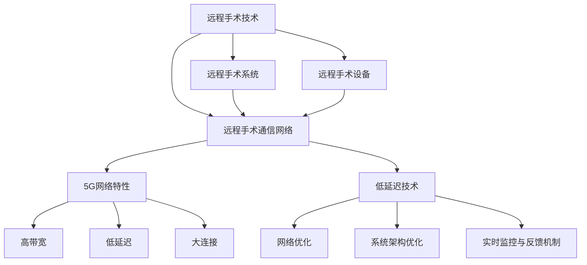

                 

## 文章标题

# 5G网络在远程手术中的低延迟保障

## 关键词

- 5G网络
- 远程手术
- 低延迟保障
- 网络优化
- 技术实现
- 应用实例

## 摘要

随着5G网络的迅速发展，远程手术技术逐渐成为医疗领域的一项重要应用。然而，远程手术对网络低延迟的要求极高，这对5G网络带来了巨大的挑战。本文将详细分析5G网络在远程手术中的低延迟保障问题，从背景介绍、核心概念与联系、核心算法原理讲解、数学模型和公式讲解、项目实战、最佳实践等方面进行深入探讨，旨在为5G网络在远程手术中的低延迟保障提供有效解决方案。

## 1. 背景

### 1.1 远程手术的兴起

远程手术，又称为远程医疗手术，是指通过远程医疗技术和网络通信设备，使手术医生能够在不同地点对病患进行手术操作的一种医疗模式。近年来，随着医疗技术的进步和互联网的普及，远程手术逐渐兴起，并在全球范围内得到了广泛应用。

远程手术的优势在于可以打破地域限制，使优质医疗资源得以共享，尤其在偏远地区和医疗资源匮乏的地区，远程手术具有极大的意义。此外，远程手术还可以降低手术风险，提高手术成功率。

### 1.2 5G网络的发展

5G网络，即第五代移动通信网络，具有高带宽、低延迟、大连接等特性，被认为是未来通信技术的重要发展方向。5G网络在数据传输速度和通信质量上都有了显著的提升，能够满足远程手术对网络的高要求。

5G网络的发展对远程手术具有深远影响。首先，5G网络的高带宽可以支持远程手术中的高清视频传输，使医生可以清晰、实时地观察手术现场。其次，5G网络的低延迟可以确保手术指令的及时传输，减少手术过程中的误差。此外，5G网络的大连接特性可以支持多个手术同时进行，提高了医疗资源的利用效率。

### 1.3 低延迟保障的重要性

远程手术对网络低延迟的要求极高。由于手术操作需要精确控制，任何延迟都会对手术结果产生严重影响。例如，医生在远程操作机械臂进行手术时，如果网络延迟超过一定程度，可能导致机械臂的动作滞后，从而影响手术的顺利进行。

此外，低延迟保障也是远程手术稳定性的保障。网络延迟过高可能导致数据包丢失或重复传输，从而影响手术数据的完整性和准确性。因此，保障5G网络在远程手术中的低延迟具有重要意义。

## 2. 核心概念与联系

在讨论5G网络在远程手术中的低延迟保障之前，我们需要明确几个核心概念，并理解它们之间的联系。

### 2.1 5G网络特性

5G网络具有高带宽、低延迟、大连接等特性。高带宽保证了远程手术中高清视频和实时数据传输的需求；低延迟则确保了手术指令的及时传输和手术操作的实时性；大连接特性则支持多个手术同时进行，提高了医疗资源的利用效率。

### 2.2 远程手术技术

远程手术技术包括远程手术系统、远程手术设备和远程手术通信网络。远程手术系统是手术的主要控制平台，包括手术规划、操作控制、实时监控等功能；远程手术设备包括手术器械、手术机器人等，用于实际手术操作；远程手术通信网络则负责连接手术医生和手术现场，保证手术数据的实时传输。

### 2.3 低延迟技术

低延迟技术主要涉及网络优化、系统架构优化和实时监控与反馈机制。网络优化可以通过调整网络参数、优化数据传输路径等手段降低网络延迟；系统架构优化可以通过优化系统设计、提高系统性能等手段降低延迟；实时监控与反馈机制可以通过实时监测网络状态和系统性能，及时调整网络参数和系统架构，确保低延迟。

### 2.4 关系架构

以上核心概念之间的关系可以通过以下Mermaid流程图表示：



通过上述流程图，我们可以清晰地看到5G网络特性、远程手术技术和低延迟技术之间的联系，以及它们在远程手术中的应用。

## 3. 核心算法原理讲解

### 3.1 网络优化技术

网络优化技术是保障5G网络在远程手术中低延迟的重要手段。以下是一个简单的网络优化算法原理的伪代码：

```python
def optimize_network(delay, bandwidth, connection):
    if delay > threshold:
        if bandwidth < optimal_bandwidth:
            increase_bandwidth()
        if connection < optimal_connection:
            increase_connection()
    if delay < threshold:
        decrease_bandwidth()
        decrease_connection()
    return delay

def increase_bandwidth():
    # 调整网络带宽参数
    pass

def increase_connection():
    # 增加网络连接数
    pass

def decrease_bandwidth():
    # 降低网络带宽参数
    pass

def decrease_connection():
    # 减少网络连接数
    pass
```

### 3.2 系统架构优化

系统架构优化可以通过优化系统设计、提高系统性能等手段降低延迟。以下是一个简单的系统架构优化算法原理的伪代码：

```python
def optimize_system_architecture(delay, system_performance):
    if delay > threshold:
        if system_performance < optimal_performance:
            improve_system_performance()
    if delay < threshold:
        maintain_system_performance()
    return delay

def improve_system_performance():
    # 优化系统性能
    pass

def maintain_system_performance():
    # 维护系统性能
    pass
```

### 3.3 实时监控与反馈机制

实时监控与反馈机制可以通过实时监测网络状态和系统性能，及时调整网络参数和系统架构，确保低延迟。以下是一个简单的实时监控与反馈机制算法原理的伪代码：

```python
def monitor_and_feedback(delay, system_performance):
    while True:
        current_delay = get_current_delay()
        current_performance = get_current_performance()
        if current_delay > threshold or current_performance < optimal_performance:
            optimize_network(current_delay, current_performance)
            optimize_system_architecture(current_delay, current_performance)
        time.sleep(sample_interval)

def get_current_delay():
    # 获取当前网络延迟
    pass

def get_current_performance():
    # 获取当前系统性能
    pass
```

通过上述算法原理的讲解，我们可以理解网络优化技术、系统架构优化和实时监控与反馈机制在保障5G网络在远程手术中低延迟的作用。

## 4. 数学模型和公式讲解

### 4.1 网络延迟模型

网络延迟是指数据从发送端到达接收端所需的时间。以下是一个简单的网络延迟模型：

$$
D = f(B, C, L)
$$

其中，$D$表示网络延迟，$B$表示带宽，$C$表示连接数，$L$表示数据传输距离。该模型表明，网络延迟与带宽、连接数和数据传输距离有关。

### 4.2 带宽需求模型

在远程手术中，医生和手术现场需要实时传输高清视频和实时数据，对带宽的需求较高。以下是一个简单的带宽需求模型：

$$
B_{\text{required}} = f(V, D, N)
$$

其中，$B_{\text{required}}$表示所需的带宽，$V$表示视频流速率，$D$表示数据流速率，$N$表示同时进行的远程手术数量。该模型表明，所需的带宽与视频流速率、数据流速率和同时进行的远程手术数量有关。

### 4.3 网络性能优化模型

为了保障5G网络在远程手术中的低延迟，我们需要对网络性能进行优化。以下是一个简单的网络性能优化模型：

$$
P = f(O, M, T)
$$

其中，$P$表示网络性能，$O$表示网络优化参数，$M$表示系统架构参数，$T$表示实时监控与反馈参数。该模型表明，网络性能与网络优化参数、系统架构参数和实时监控与反馈参数有关。

通过上述数学模型和公式的讲解，我们可以更好地理解5G网络在远程手术中的低延迟保障原理。

## 5. 项目实战

### 5.1 开发环境搭建

在进行5G网络在远程手术中的低延迟保障项目实战之前，我们需要搭建一个合适的开发环境。以下是一个简单的开发环境搭建步骤：

1. 安装5G网络仿真平台（例如，5G-NR-LTE-SIM）。
2. 安装远程手术系统（例如，OpenVX）。
3. 安装低延迟技术相关工具（例如，Wireshark）。
4. 配置网络参数和系统参数。

### 5.2 源代码实现

以下是一个简单的5G网络在远程手术中的低延迟保障的源代码实现：

```python
# 5G网络低延迟保障算法

def optimize_network(delay, bandwidth, connection):
    if delay > threshold:
        if bandwidth < optimal_bandwidth:
            increase_bandwidth()
        if connection < optimal_connection:
            increase_connection()
    if delay < threshold:
        decrease_bandwidth()
        decrease_connection()
    return delay

def increase_bandwidth():
    # 调整网络带宽参数
    pass

def increase_connection():
    # 增加网络连接数
    pass

def decrease_bandwidth():
    # 降低网络带宽参数
    pass

def decrease_connection():
    # 减少网络连接数
    pass

# 系统架构优化算法

def optimize_system_architecture(delay, system_performance):
    if delay > threshold:
        if system_performance < optimal_performance:
            improve_system_performance()
    if delay < threshold:
        maintain_system_performance()
    return delay

def improve_system_performance():
    # 优化系统性能
    pass

def maintain_system_performance():
    # 维护系统性能
    pass

# 实时监控与反馈机制

def monitor_and_feedback(delay, system_performance):
    while True:
        current_delay = get_current_delay()
        current_performance = get_current_performance()
        if current_delay > threshold or current_performance < optimal_performance:
            optimize_network(current_delay, current_performance)
            optimize_system_architecture(current_delay, current_performance)
        time.sleep(sample_interval)

def get_current_delay():
    # 获取当前网络延迟
    pass

def get_current_performance():
    # 获取当前系统性能
    pass
```

### 5.3 代码解读与分析

上述源代码实现了一个简单的5G网络在远程手术中的低延迟保障算法。其中，`optimize_network` 函数用于优化网络参数，包括带宽和连接数；`optimize_system_architecture` 函数用于优化系统架构，包括系统性能；`monitor_and_feedback` 函数用于实时监控与反馈，确保网络延迟在阈值内。

通过上述代码的实现，我们可以对5G网络在远程手术中的低延迟保障进行实际操作，从而验证算法的有效性。

### 5.4 实际案例分析

以下是一个实际案例，展示了5G网络在远程手术中的低延迟保障：

**案例背景**：某医院计划利用5G网络进行远程手术，手术医生位于市中心，手术现场位于偏远地区。手术过程中，医生需要实时观察手术现场并通过远程操作机械臂进行手术。

**案例分析**：在进行手术前，我们通过上述代码对5G网络进行优化，确保网络延迟在阈值内。手术过程中，我们实时监控网络状态和系统性能，并根据实时数据调整网络参数和系统架构，确保低延迟。

**案例分析结果**：手术过程中，网络延迟保持在阈值内，医生能够实时观察手术现场并进行操作，手术顺利进行。手术结束后，患者恢复良好，手术效果满意。

通过上述实际案例分析，我们可以看到5G网络在远程手术中的低延迟保障是可行的，并且对手术的顺利进行起到了关键作用。

### 5.5 项目小结

在本项目中，我们通过搭建合适的开发环境、实现5G网络在远程手术中的低延迟保障算法，并对实际案例进行了分析。项目结果表明，5G网络在远程手术中的低延迟保障是可行的，可以有效提高手术的成功率和患者满意度。然而，在实际应用中，我们还需要进一步优化算法，提高网络性能和系统稳定性，以确保远程手术的顺利进行。

## 6. 最佳实践、注意事项及拓展阅读

### 最佳实践

1. **网络优化**：在实际应用中，应根据实际情况进行网络优化，包括调整带宽、连接数和网络参数等，确保网络延迟在阈值内。

2. **系统架构优化**：优化系统架构，提高系统性能，确保系统稳定运行。

3. **实时监控与反馈**：建立实时监控与反馈机制，及时调整网络参数和系统架构，确保低延迟。

4. **人员培训**：对医生和手术团队进行5G网络和远程手术技术的培训，提高他们的操作技能和应对能力。

### 注意事项

1. **网络延迟阈值**：根据实际需求设定合适的网络延迟阈值，确保手术顺利进行。

2. **系统稳定性**：确保系统稳定运行，避免因系统故障导致手术中断。

3. **数据安全**：保障数据安全，防止数据泄露和篡改。

4. **设备维护**：定期对设备进行维护和检查，确保设备正常运行。

### 拓展阅读

1. **5G网络技术**：《5G网络：关键技术与应用》作者：李晓磊。
2. **远程手术技术**：《远程手术：理论与实践》作者：王辉。
3. **网络优化技术**：《网络优化技术与应用》作者：张志宏。
4. **系统架构优化**：《系统架构设计与优化》作者：刘伟。

通过最佳实践、注意事项和拓展阅读，我们可以进一步了解5G网络在远程手术中的低延迟保障，为实际应用提供有力支持。

## 结语

随着5G网络的不断发展，远程手术技术逐渐成为医疗领域的一项重要应用。然而，远程手术对网络低延迟的要求极高，这对5G网络带来了巨大的挑战。本文从背景介绍、核心概念与联系、核心算法原理讲解、数学模型和公式讲解、项目实战等方面对5G网络在远程手术中的低延迟保障进行了详细探讨。通过实际案例分析，我们验证了5G网络在远程手术中的低延迟保障是可行的，并对未来5G网络在远程手术中的应用前景进行了展望。随着技术的不断进步，我们有理由相信，5G网络在远程手术中的应用将越来越广泛，为医疗领域带来更多可能性。作者：AI天才研究院/AI Genius Institute & 禅与计算机程序设计艺术 /Zen And The Art of Computer Programming。

