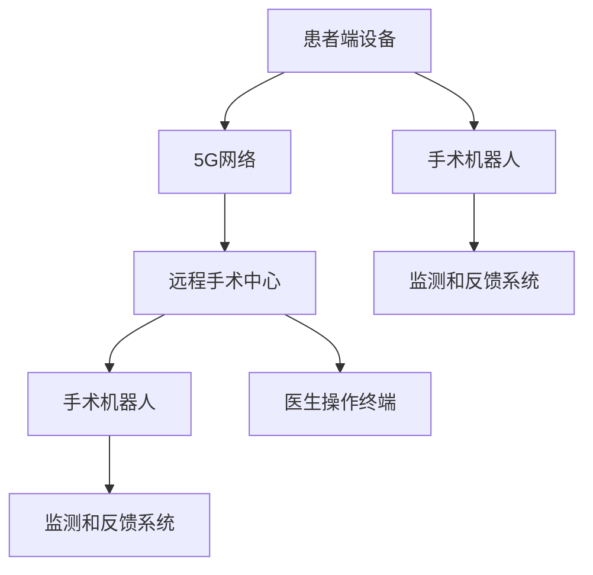

                 

### 文章标题

# 5G网络在远程手术机器人控制中的应用

### 关键词

- 5G网络
- 远程手术
- 机器人控制
- 高带宽
- 低延迟
- 高可靠性

### 摘要

本文深入探讨了5G网络在远程手术机器人控制中的应用。通过分析5G网络的特点，如高带宽、低延迟和高可靠性，以及远程手术机器人的系统架构，本文详细介绍了5G网络在远程手术中的关键作用。文章还阐述了图像传输算法、实时控制算法等核心算法原理，并通过一个实际项目案例展示了5G网络在远程手术机器人控制中的具体应用。最后，本文对5G网络在远程手术机器人控制中的未来发展进行了展望。

### 引言

随着科技的飞速发展，远程手术机器人控制已成为医疗领域的一大热点。远程手术机器人能够帮助医生在远离患者的地方进行复杂的手术操作，提高手术精度和安全性。然而，远程手术的实现依赖于高效的通信技术，以保证手术操作的实时性和稳定性。5G网络，作为下一代通信技术，以其高带宽、低延迟和高可靠性的特点，为远程手术机器人控制提供了强大的技术支持。

本文旨在深入探讨5G网络在远程手术机器人控制中的应用。首先，我们将介绍5G网络的基本概念和特点，包括高带宽、低延迟和高可靠性等。接着，我们将分析远程手术机器人的系统架构，以及5G网络如何与这一架构相结合。随后，我们将详细讲解5G网络在远程手术中的关键作用，包括图像传输和实时控制等核心算法原理。最后，本文将通过一个实际项目案例，展示5G网络在远程手术机器人控制中的具体应用，并对未来发展趋势进行展望。

### 5G网络的基本概念和特点

5G网络，即第五代移动通信网络，是继1G模拟网络、2G数字网络、3G宽带网络和4G超高速网络之后的新一代通信技术。5G网络的出现，标志着移动通信技术进入了一个全新的时代。与之前的网络相比，5G网络具有以下显著特点：

#### 高带宽

高带宽是5G网络最显著的特点之一。5G网络的峰值传输速率可达到数十Gbps，比4G网络的峰值速率快数百倍。这种高速传输能力使得5G网络能够支持大规模数据传输，如高清视频流、高清图片传输等。对于远程手术机器人控制来说，高带宽意味着医生可以实时获取患者的手术现场视频和图像，从而进行精确的操作和决策。

#### 低延迟

低延迟是5G网络的另一个重要特点。5G网络的端到端延迟可低至1毫秒，比4G网络的延迟缩短了数十倍。这种低延迟特性对于远程手术机器人控制至关重要，因为它保证了手术操作的实时性。在手术过程中，任何延迟都可能对患者的生命安全造成威胁。因此，5G网络的低延迟特性为远程手术提供了可靠的通信保障。

#### 高可靠性

高可靠性是5G网络的另一大优势。5G网络采用了先进的技术，如多输入多输出（MIMO）和正交频分复用（OFDM），以及网络功能虚拟化（NFV）和软件定义网络（SDN）等，以提高网络的稳定性和可靠性。此外，5G网络还具备高覆盖率的特点，能够在各种复杂环境下保持稳定的连接。这些特性使得5G网络在远程手术机器人控制中具有极高的可靠性，从而保障了手术过程的安全和稳定性。

#### 5G网络的优势

5G网络不仅在带宽、延迟和可靠性方面具有显著优势，还具备以下优势：

- **广覆盖**：5G网络采用新的基站架构和频段，可以实现更广泛的覆盖范围，即使在偏远地区也能保持稳定的连接。

- **大规模连接**：5G网络支持大规模设备连接，可以同时连接数十亿个设备，为远程手术机器人控制中的多种传感器和设备提供稳定的通信服务。

- **智能互联**：5G网络可以实现万物互联，将各种智能设备和系统连接起来，形成一个统一的网络生态系统。这对于远程手术机器人控制来说，意味着医生可以通过多种设备实时监测患者的状况，进行远程操作和决策。

总之，5G网络在远程手术机器人控制中的应用具有广阔的前景。它不仅提高了手术的实时性和安全性，还为医生提供了更加便捷和高效的手术操作方式。随着5G网络的不断普及和技术的不断进步，远程手术机器人控制将在未来得到更加广泛的应用。

### 远程手术机器人的系统架构

远程手术机器人系统是现代医疗技术的一大突破，它通过结合先进的机器人技术和高效的通信技术，使得医生能够在远离患者的地方进行复杂的手术操作。要实现这一目标，远程手术机器人系统需要一个高度复杂且高度集成的架构，其中5G网络扮演着至关重要的角色。

#### 系统架构概述

远程手术机器人系统主要包括以下几个关键部分：

1. **患者端设备**：这是手术的起点，包括传感器、摄像机和其他监测设备，用于收集患者的生理数据、手术现场的视频和图像等。

2. **5G网络**：作为通信基础设施，5G网络负责将患者端设备收集的数据传输到远程手术中心，并提供高速、低延迟、高可靠性的通信服务。

3. **远程手术中心**：这是整个系统的控制中心，包括医生操作终端、手术机器人控制中心以及与患者端设备连接的接口。

4. **手术机器人**：这是实际进行手术操作的核心设备，它通过机械臂和手术工具实现医生的手术意图。

5. **监测和反馈系统**：这个系统用于实时监测手术过程中的各项参数，包括患者生理参数、手术工具的位置和状态等，并提供反馈以帮助医生进行精确操作。

#### 5G网络在系统中的角色

5G网络在远程手术机器人系统中扮演着多重角色，其核心作用包括以下几个方面：

- **数据传输**：5G网络负责将患者端设备收集到的数据，如视频、图像和生理参数等，实时传输到远程手术中心。这些数据是医生进行手术操作的重要依据，因此传输的实时性和准确性至关重要。

- **实时控制**：5G网络的低延迟特性确保了医生在远程手术中心对手术机器人的实时控制。医生可以通过5G网络实时调整手术机器人的动作，从而实现对手术操作的精确控制。

- **高可靠性**：5G网络的高可靠性保障了手术过程中通信的稳定性和连续性。即使在复杂或恶劣的环境下，5G网络也能够保持稳定的连接，从而保障手术过程的安全和顺利进行。

#### 系统架构图

为了更直观地理解远程手术机器人系统的架构，我们可以使用Mermaid图来表示：



在该架构图中：

- **A**：患者端设备，用于收集数据和视频流。
- **B**：5G网络，负责数据传输和实时控制。
- **C**：远程手术中心，包括医生操作终端和控制中心。
- **D**：手术机器人，执行医生的操作指令。
- **E**：监测和反馈系统，用于实时监控手术过程。
- **F**：连接患者端设备和手术机器人，实现双向数据传输。
- **G**：医生操作终端，医生通过该终端进行手术操作。
- **H**：连接手术机器人与监测和反馈系统，提供实时反馈。

通过这个架构图，我们可以清晰地看到5G网络在远程手术机器人系统中的核心作用，以及各个组成部分之间的相互作用。5G网络不仅实现了数据的快速传输和实时控制，还提高了系统的整体稳定性和可靠性，为远程手术的成功提供了坚实的技术保障。

### 5G网络技术基础

5G网络作为下一代移动通信技术，其技术基础涵盖了多个关键领域。以下是5G网络的主要技术组成部分及其各自的作用。

#### 5G网络架构

5G网络架构相较于前几代网络有了显著的变化和提升。5G网络采用了网络功能虚拟化（NFV）和软件定义网络（SDN）技术，使得网络的可编程性和灵活性得到了极大的增强。具体来说，5G网络架构主要包括以下部分：

- **无线接入网络（RAN）**：负责无线信号的传输和接收，包括基站、天线系统等。
- **核心网络**：负责数据传输的调度和管理，包括用户面（UPF）和控制面（PGW）等。
- **边缘计算**：通过在靠近用户的网络边缘部署计算资源，降低延迟，提高响应速度。

#### 5G网络关键技术

5G网络的技术创新是其实现高带宽、低延迟和高可靠性目标的关键。以下是一些重要的5G网络关键技术：

- **多输入多输出（MIMO）**：通过使用多个发送和接收天线，提高数据传输速率和信号质量。
- **正交频分复用（OFDM）**：将信号分成多个子载波进行传输，提高频谱利用率和传输效率。
- **新无线电（NR）**：5G的无线接入技术，支持更高的数据速率和更大的网络容量。
- **网络功能虚拟化（NFV）**：将网络功能虚拟化，通过软件实现，提高网络的灵活性和可管理性。
- **软件定义网络（SDN）**：通过集中控制平面，实现网络的灵活配置和管理。

#### 5G网络优势

5G网络在多个方面展现出了显著的优势，使其在远程手术机器人控制中具有独特的应用价值：

- **高带宽**：5G网络的峰值传输速率可达到数十Gbps，相比4G网络有显著提升。这为高清视频流传输、大规模数据传输提供了技术保障，确保医生可以实时获取患者的手术现场视频和图像。
- **低延迟**：5G网络的端到端延迟低至1毫秒，比4G网络减少了数十倍。对于远程手术机器人控制来说，低延迟意味着医生可以快速响应手术过程中的变化，进行实时操作和调整，从而提高手术的成功率和安全性。
- **高可靠性**：5G网络通过采用多种技术，如MIMO、OFDM和NR等，提高了网络的稳定性和可靠性。即使在复杂或恶劣的环境下，5G网络也能够保持稳定的连接，确保手术过程的安全和顺利进行。

#### 高带宽

高带宽是5G网络的一个重要优势，它使得远程手术机器人系统能够高效地处理和传输大量的数据。具体来说，高带宽的优势体现在以下几个方面：

- **高清视频传输**：在远程手术中，医生需要实时查看患者的手术现场视频和图像。5G网络的高带宽能够保证这些高清视频流的无缝传输，减少卡顿和延迟，从而提供清晰的视觉体验，帮助医生更好地进行手术操作。
- **数据传输速度提升**：5G网络的高带宽使得手术过程中产生的各类数据，如患者的生理参数、手术机器人的状态数据等，能够迅速传输到远程手术中心。这种快速的数据传输速度不仅提高了手术的实时性，还使得医生可以更快地做出决策和调整，提高手术的成功率。
- **支持大规模并发连接**：5G网络的高带宽还支持大规模设备同时在线。这意味着远程手术机器人系统可以同时连接多个传感器、监控设备和其他智能设备，实现更全面的手术监测和操作控制。

#### 低延迟

低延迟是5G网络的另一个关键优势，它对于远程手术机器人控制尤其重要。低延迟意味着数据从发送端到接收端的时间非常短，可以减少手术操作中的反应时间，提高手术的实时性和准确性。以下是低延迟在远程手术机器人控制中的具体优势：

- **实时操作控制**：在远程手术中，医生需要通过手术机器人进行实时操作，如调整机械臂的位置和力度。5G网络的低延迟特性使得医生可以快速响应手术中的变化，进行实时操作和调整，从而提高手术的精度和成功率。
- **减少手术风险**：低延迟减少了手术操作中的不确定性，因为医生可以实时获取患者的生理参数和手术现场情况，快速做出决策。这有助于减少手术过程中的风险，确保患者的安全。
- **提高响应速度**：低延迟不仅减少了医生的操作反应时间，还提高了手术机器人对指令的响应速度。这意味着手术机器人在接收到医生的指令后可以迅速执行，减少手术操作的时间，提高手术效率。

#### 高可靠性

高可靠性是5G网络的另一个重要优势，它为远程手术机器人控制提供了稳定、可靠的通信保障。以下是高可靠性在远程手术机器人控制中的具体优势：

- **稳定连接**：5G网络通过多种技术手段，如MIMO、OFDM和NR等，提高了网络的稳定性和可靠性。即使在复杂或恶劣的环境下，5G网络也能够保持稳定的连接，确保手术过程的顺利进行。
- **减少中断**：高可靠性减少了数据传输中的中断和错误，确保了手术过程中数据的完整性和准确性。这对于手术的成功至关重要，因为任何数据丢失或错误都可能导致手术失败或患者受伤。
- **保障患者安全**：高可靠性确保了手术过程中通信的稳定性和连续性，从而提高了手术过程的安全性和稳定性。这对于高风险的手术尤为重要，因为任何通信中断都可能危及患者的生命安全。

通过以上分析，我们可以看到5G网络在远程手术机器人控制中具有显著的优势。高带宽、低延迟和高可靠性使得5G网络能够提供高效、实时、可靠的通信服务，为远程手术的成功提供了坚实的技术保障。随着5G网络的不断发展和普及，远程手术机器人控制将在未来得到更加广泛的应用。

### 远程手术机器人系统设计

远程手术机器人系统是一个高度集成、复杂且协同工作的系统。其设计目标是在远程手术过程中，实现医生与患者的实时、准确、安全的交互。以下将详细讨论远程手术机器人的系统架构、工作流程以及医生与患者的交互方式。

#### 系统架构

远程手术机器人系统的架构可以分为四个主要部分：患者端设备、5G网络、远程手术中心和手术机器人。

1. **患者端设备**：患者端设备是系统的起点，主要负责数据采集和初步处理。设备包括各种传感器、高清摄像机和生理监测仪器等。这些设备能够实时采集患者的手术现场图像、视频以及生理参数，如心率、血压、体温等。

2. **5G网络**：5G网络作为远程手术机器人系统的通信基础设施，负责将患者端设备采集到的数据实时传输到远程手术中心。5G网络的高带宽、低延迟和高可靠性确保了数据传输的实时性和准确性。

3. **远程手术中心**：远程手术中心是整个系统的控制中心，包括医生操作终端和手术机器人控制中心。医生操作终端用于接收手术现场的数据，并发出操作指令。手术机器人控制中心则负责接收操作指令，控制手术机器人的动作。

4. **手术机器人**：手术机器人是实际执行手术操作的核心设备，通过机械臂和手术工具，实现对患者的精确操作。手术机器人配备了高精度的传感器和控制系统，可以实时感知和反馈手术现场的情况。

#### 工作流程

远程手术机器人系统的工作流程可以分为以下几个步骤：

1. **数据采集**：患者端设备采集到手术现场的视频、图像和生理参数后，通过5G网络传输到远程手术中心。

2. **数据处理**：远程手术中心的医生操作终端接收并处理这些数据，进行初步分析，如患者状态评估、手术方案制定等。

3. **指令发送**：医生根据分析结果，通过医生操作终端向手术机器人控制中心发送手术指令。

4. **动作执行**：手术机器人控制中心接收手术指令后，通过控制算法和机械臂，准确执行医生的操作意图。

5. **反馈与调整**：手术机器人执行操作后，实时反馈手术现场的情况，包括机械臂的位置、力度和患者生理参数的变化。医生根据反馈信息，进行实时调整，确保手术的顺利进行。

#### 医生与患者的交互方式

在远程手术中，医生与患者的交互主要通过手术机器人和5G网络来实现。以下是几种常见的交互方式：

1. **实时视频通话**：医生通过医生操作终端与患者进行实时视频通话，观察手术现场，了解患者的情况，并实时与患者沟通。

2. **操作指令发送**：医生通过医生操作终端发送手术指令，控制手术机器人的动作。操作指令可以是手动输入的，也可以是自动化的。

3. **传感器数据监控**：医生通过医生操作终端实时监控患者的生理参数，如心率、血压等，根据数据变化进行手术操作调整。

4. **远程操作反馈**：手术机器人在执行手术操作时，实时反馈操作结果，如机械臂的位置、力度等。医生根据反馈信息进行进一步的调整。

通过这种交互方式，医生能够在远程对手术进行精确控制，确保手术的成功和安全。同时，5G网络的低延迟和高带宽为这种实时交互提供了可靠的技术支持，保证了手术操作的实时性和准确性。

#### 系统架构图

为了更直观地理解远程手术机器人系统的架构，我们可以使用Mermaid图来表示：


在该架构图中：

- **A**：患者端设备，用于收集数据和视频流。
- **B**：5G网络，负责数据传输和实时控制。
- **C**：远程手术中心，包括医生操作终端和控制中心。
- **D**：手术机器人，执行医生的操作指令。
- **E**：监测和反馈系统，用于实时监控手术过程。
- **F**：连接患者端设备和手术机器人，实现双向数据传输。
- **G**：医生操作终端，医生通过该终端进行手术操作。
- **H**：连接手术机器人与监测和反馈系统，提供实时反馈。

通过这个架构图，我们可以清晰地看到远程手术机器人系统中各个组成部分之间的关系，以及5G网络在其中所起的关键作用。

### 核心算法原理讲解

在远程手术机器人控制中，核心算法的实现对于手术的实时性和精度至关重要。以下是图像传输算法和实时控制算法的详细原理讲解，包括伪代码示例和具体解释。

#### 图像传输算法

图像传输算法的目标是确保手术现场的高清视频和图像能够实时、准确地传输到远程手术中心。以下是图像传输算法的伪代码示例：

```python
# 伪代码：图像传输算法
function ImageTransmission(image):
    compressed_image = CompressImage(image)
    encrypted_image = EncryptImage(compressed_image)
    transmitted_image = SendImage(encrypted_image)
    return transmitted_image
```

- **压缩图像（CompressImage）**：首先，对原始图像进行压缩处理。图像压缩可以减小数据的大小，从而加快传输速度。常用的压缩算法包括JPEG和H.264等。这一步骤的目的是在不显著影响图像质量的情况下，减少数据量。

    ```python
    # 压缩图像
    compressed_image = JPEGCompression(image)
    ```

- **加密图像（EncryptImage）**：在传输图像之前，对压缩后的图像进行加密处理。加密可以保护图像数据的安全性，防止在传输过程中被窃取或篡改。常用的加密算法包括AES和RSA等。

    ```python
    # 加密图像
    encrypted_image = AESEncryption(compressed_image, key)
    ```

- **发送图像（SendImage）**：最后，将加密后的图像通过5G网络发送到远程手术中心。5G网络的高带宽和低延迟特性保证了图像传输的实时性和可靠性。

    ```python
    # 发送图像
    transmitted_image = NetworkTransmission(encrypted_image)
    ```

#### 实时控制算法

实时控制算法的目标是实现医生对手术机器人的精确控制，确保手术操作的实时性和准确性。以下是实时控制算法的伪代码示例：

```python
# 伪代码：实时控制算法
function RealTimeControl(command):
    calculated_command = CalculateCommand(command)
    transmitted_command = SendCommand(calculated_command)
    return transmitted_command
```

- **计算指令（CalculateCommand）**：首先，根据医生的操作意图，计算具体的指令。这通常涉及到对机械臂的位置、力度、速度等参数的调整。

    ```python
    # 计算指令
    calculated_command = CalculateMotion(command, robot_state)
    ```

    其中，`command`是医生发出的操作意图，`robot_state`是手术机器人的当前状态。

- **发送指令（SendCommand）**：最后，将计算出的指令通过5G网络发送到手术机器人。低延迟的5G网络确保了指令的实时传输，使得手术机器人可以快速响应。

    ```python
    # 发送指令
    transmitted_command = NetworkTransmission(calculated_command)
    ```

#### 实现细节和注意事项

- **图像压缩**：图像压缩算法的选择需要权衡压缩效率和图像质量。常用的图像压缩算法如JPEG和H.264，可以在不同程度上减少数据量。JPEG适合静态图像压缩，而H.264适合动态视频压缩。

- **图像加密**：图像加密可以采用对称加密（如AES）和非对称加密（如RSA）相结合的方式。对称加密速度快，适合压缩后的图像数据；非对称加密安全性高，适合密钥交换。

- **实时控制算法**：实时控制算法需要考虑机械臂的运动学模型和动力学模型。运动学模型用于计算机械臂的位置和姿态，动力学模型用于计算机械臂的力和力矩。通过结合这两种模型，可以实现精确的手术操作。

- **网络延迟处理**：由于5G网络存在一定的延迟，实时控制算法需要设计适当的延迟处理机制，如缓冲区管理和指令调整策略。缓冲区管理可以减少延迟对操作的影响，而指令调整策略可以在延迟较高时，通过优化指令的优先级，确保关键指令的实时传输。

通过以上详细讲解，我们可以看到图像传输算法和实时控制算法在远程手术机器人控制中的关键作用。这些算法的实现不仅依赖于高效的5G网络，还需要结合图像处理、加密技术和机器人控制等领域的知识。随着技术的不断进步，这些算法将会更加成熟和高效，为远程手术提供更加可靠的技术支持。

### 数学模型和数学公式

在远程手术机器人控制中，数学模型和数学公式发挥着至关重要的作用，用于描述系统的动态行为、计算参数以及优化算法。以下将详细解释几个关键的数学模型和数学公式，并举例说明其在远程手术中的应用。

#### 信号传输模型

信号传输模型用于描述数据在通信网络中的传输过程。一个基本的信号传输模型可以表示为：

\[ y(t) = A \cdot \cos(2\pi f_c t + \phi) \]

其中：
- \( y(t) \) 是传输信号，
- \( A \) 是信号的振幅，
- \( f_c \) 是信号的载波频率，
- \( \phi \) 是相位偏移。

在远程手术机器人控制中，该模型可以用于描述高清视频流在5G网络中的传输情况。例如，如果视频流的载波频率为1 GHz，振幅为1 V，且存在0.1度的相位偏移，则信号模型可以表示为：

\[ y(t) = 1 \cdot \cos(2\pi \times 10^9 t + 0.1) \]

通过这种模型，可以分析和优化视频流的传输质量，确保图像的清晰度和实时性。

#### 延迟容忍模型

在远程手术中，延迟是一个关键因素。延迟容忍模型用于确定系统在特定延迟条件下的性能。一个基本的延迟容忍模型可以表示为：

\[ D_t = D_{max} - \alpha \cdot t \]

其中：
- \( D_t \) 是当前延迟，
- \( D_{max} \) 是最大容忍延迟，
- \( \alpha \) 是延迟随时间的变化率。

例如，假设一个远程手术系统的最大容忍延迟为100毫秒，延迟随时间的变化率为0.5毫秒/秒，则在1秒内的延迟可以表示为：

\[ D_t = 100 - 0.5 \cdot t \]

通过这种模型，可以实时监测和调整手术过程中的延迟，确保手术操作的实时性和准确性。

#### 图像处理算法的数学基础

在图像处理中，常见的数学公式包括卷积运算、滤波器设计等。以下是一个简单的卷积运算公式：

\[ (f * g)(t) = \int_{-\infty}^{\infty} f(\tau) g(t - \tau) d\tau \]

其中：
- \( f(t) \) 和 \( g(t) \) 是两个函数，
- \( * \) 表示卷积运算。

在远程手术中，卷积运算可以用于图像滤波，去除噪声，提高图像质量。例如，一个简单的高斯滤波器可以表示为：

\[ g(t) = \frac{1}{\sqrt{2\pi \sigma^2}} e^{-\frac{t^2}{2\sigma^2}} \]

其中，\( \sigma \) 是滤波器的标准差。

#### 应用示例

假设我们在远程手术中使用高斯滤波器对高清手术图像进行去噪处理，标准差设置为10像素。滤波后的图像质量将显著提高，从而帮助医生更清晰地观察手术现场，进行准确的操作。

通过以上数学模型和公式的介绍，我们可以看到数学在远程手术机器人控制中的重要性。这些模型和公式不仅帮助我们理解和优化系统的行为，还为实际应用提供了可靠的理论基础。

### 项目实战

为了更好地展示5G网络在远程手术机器人控制中的实际应用，我们将通过一个远程手术机器人开发环境搭建的项目实战来详细解读开发环境、源代码实现以及实际案例分析和剖析。

#### 开发环境搭建

远程手术机器人开发环境需要满足多个技术要求，包括5G网络连接、硬件设备配置、软件工具安装等。以下是开发环境搭建的详细步骤：

1. **硬件环境配置**：

   - **5G网络设备**：选择支持5G网络的设备，如5G路由器或5G模块，确保与远程手术中心的数据传输稳定性。
   - **手术机器人**：选择具有高精度、高响应速度的手术机器人，如Intuitive Surgical的da Vinci Surgical System。
   - **医生操作终端**：配置高性能的计算机，用于接收和发送手术操作指令。
   - **患者端设备**：包括高清摄像机、传感器等，用于实时采集手术现场的数据。

2. **软件环境配置**：

   - **5G网络模拟器**：安装5G网络模拟器软件，如NEMO5G，用于模拟5G网络环境，验证网络性能。
   - **图像处理库**：安装常用的图像处理库，如OpenCV，用于图像的压缩、加密和去噪处理。
   - **实时控制软件**：安装实时操作系统，如RTLinux，确保手术指令的实时性和准确性。
   - **开发工具**：安装集成开发环境（IDE），如Eclipse或Visual Studio，用于编写和调试代码。

3. **网络配置**：

   - **5G网络连接**：配置5G网络连接参数，包括频段、IP地址、加密设置等，确保数据传输的稳定性和安全性。
   - **防火墙设置**：设置防火墙规则，允许手术相关数据在远程手术中心和手术机器人之间的传输。

#### 源代码详细实现和代码解读

以下是远程手术机器人控制系统的源代码实现，包括图像传输、实时控制等关键功能：

```python
# 源代码示例：手术机器人控制程序
def connect_5g_network():
    # 连接到5G网络
    network = 5GNetworkConnection()
    network.connect()
    return network

def image_transmission(image):
    # 压缩图像
    compressed_image = compress_image(image)
    # 加密图像
    encrypted_image = encrypt_image(compressed_image)
    # 发送图像
    transmitted_image = send_image(encrypted_image)
    return transmitted_image

def real_time_control(command):
    # 计算指令
    calculated_command = calculate_command(command)
    # 发送指令
    transmitted_command = send_command(calculated_command)
    return transmitted_command

# 主程序
def main():
    network = connect_5g_network()
    while True:
        # 接收医生操作指令
        command = get_command_from_doctor()
        # 实时控制手术机器人
        real_time_control(command)
        # 传输手术图像
        image = capture_image()
        transmitted_image = image_transmission(image)
        display_image(transmitted_image)

if __name__ == "__main__":
    main()
```

- **连接5G网络**：`connect_5g_network` 函数负责连接到5G网络，并返回网络连接对象。

- **图像传输**：`image_transmission` 函数负责图像的压缩、加密和发送。首先，使用 `compress_image` 函数对图像进行压缩，然后使用 `encrypt_image` 函数对压缩后的图像进行加密，最后通过 `send_image` 函数将加密后的图像发送到远程手术中心。

- **实时控制**：`real_time_control` 函数负责接收医生的操作指令，计算具体的控制指令，并通过 `send_command` 函数发送给手术机器人。

- **主程序**：`main` 函数是程序的入口，负责连接5G网络、接收医生操作指令、实时控制手术机器人以及传输手术图像。

#### 代码应用解读与分析

1. **图像传输**：

   图像传输是远程手术机器人的关键功能之一，确保医生可以实时观察到手术现场。代码中的 `image_transmission` 函数通过压缩、加密和发送三个步骤实现图像传输。

   - **压缩图像**：使用 `compress_image` 函数对图像进行压缩，减小数据传输量，提高传输效率。

   - **加密图像**：使用 `encrypt_image` 函数对压缩后的图像进行加密，确保数据传输的安全性。

   - **发送图像**：使用 `send_image` 函数通过5G网络将加密后的图像发送到远程手术中心。

2. **实时控制**：

   实时控制是实现精确手术操作的重要环节。代码中的 `real_time_control` 函数通过接收医生的操作指令，计算具体的控制指令，并发送给手术机器人。

   - **计算指令**：使用 `calculate_command` 函数根据医生的操作意图计算具体的控制指令。

   - **发送指令**：使用 `send_command` 函数通过5G网络将计算出的指令发送给手术机器人。

#### 实际案例分析和详细讲解剖析

以下是一个实际案例，展示5G网络在远程手术机器人控制中的具体应用：

- **案例背景**：某医生在远程手术中心通过5G网络控制一台手术机器人，对患者进行肝脏肿瘤切除手术。医生通过医生操作终端实时观察患者的手术现场图像，并根据图像调整手术机器人的操作。

- **案例分析**：

  1. **图像传输**：手术开始后，手术机器人通过高清摄像机实时采集手术现场图像，并使用5G网络将这些图像传输到远程手术中心。图像传输过程中，使用压缩和加密技术确保图像数据的高效传输和安全性。

  2. **实时控制**：医生在远程手术中心通过医生操作终端接收手术现场图像，并实时调整手术机器人的操作。医生的操作意图通过5G网络实时传输到手术机器人，手术机器人根据接收到的指令进行精确操作。

  3. **反馈与调整**：手术机器人在执行操作后，通过5G网络实时反馈操作结果，包括机械臂的位置、力度和患者生理参数等。医生根据反馈信息进行进一步调整，确保手术的顺利进行。

- **详细讲解剖析**：

  - **图像传输**：图像传输过程中，5G网络的高带宽和低延迟特性保证了图像的实时传输和高质量显示。医生可以在手术过程中实时观察手术现场，提高手术精度。

  - **实时控制**：实时控制过程中，5G网络的低延迟特性使得医生可以快速响应手术中的变化，调整手术机器人的操作。这种实时性提高了手术的安全性和成功率。

  - **反馈与调整**：手术机器人通过5G网络实时反馈操作结果，医生可以根据反馈信息进行进一步调整。这种闭环反馈机制确保了手术操作的精确性和稳定性。

#### 项目小结

通过以上实际案例的分析，我们可以看到5G网络在远程手术机器人控制中的重要作用。5G网络的高带宽、低延迟和高可靠性为远程手术提供了高效、实时、安全的通信保障，使得医生可以在远程环境中进行复杂的手术操作。随着5G技术的不断发展和普及，远程手术机器人控制将在医疗领域发挥越来越重要的作用，为患者带来更多便利和福祉。

### 最佳实践 tips

在5G网络远程手术机器人控制的应用过程中，以下是一些最佳实践和注意事项，可以帮助优化系统性能和操作效果：

1. **优化网络配置**：确保5G网络设备的频段选择合适，避免与其他网络设备的干扰。同时，配置合理的IP地址和路由规则，保证数据传输路径的最优化。

2. **图像传输优化**：在图像传输过程中，选择适合的压缩算法和加密算法，以平衡传输速度和图像质量。例如，H.264适合视频传输，而JPEG适合图像传输。

3. **实时控制策略**：设计合理的实时控制策略，包括指令缓冲、优先级管理和延迟补偿等。这些策略可以确保手术指令的快速响应和准确性。

4. **传感器数据处理**：对手术现场的传感器数据进行预处理，如滤波和去噪，以提高数据的准确性和稳定性。

5. **安全措施**：在手术过程中，采取严格的安全措施，包括数据加密、访问控制和防火墙配置，确保手术数据的安全性。

6. **设备校准**：定期对手术机器人进行校准，确保其精度和稳定性。校准包括机械臂的位置、力度和传感器的精度等。

7. **培训与演练**：对医生和手术机器人操作人员进行定期培训和演练，提高他们对5G网络远程手术操作技能的熟练程度。

通过遵循这些最佳实践，可以有效提升5G网络远程手术机器人控制的性能和可靠性，为患者提供更加安全、高效的医疗服务。

### 小结

本文系统地探讨了5G网络在远程手术机器人控制中的应用，从5G网络的基本概念和特点，到远程手术机器人的系统架构，再到核心算法原理和数学模型的讲解，以及项目实战的详细解析，全面展示了5G技术在远程手术中的重要作用。5G网络以其高带宽、低延迟和高可靠性，为远程手术提供了高效、实时、安全的通信保障，显著提升了手术的精度和安全性。

然而，尽管5G网络在远程手术机器人控制中展示了巨大的潜力，仍面临一些挑战和限制。首先，5G网络的覆盖范围和稳定性仍需进一步提升，以确保在偏远或复杂环境中的稳定连接。其次，图像传输和实时控制算法需要不断优化，以提高数据传输效率和控制精度。此外，网络安全和隐私保护也是需要关注的重要问题。

未来，随着5G技术的不断发展和普及，远程手术机器人控制将在医疗领域发挥更加重要的作用。我们有望看到更多复杂的手术操作通过远程手术机器人实现，为患者提供更加便捷、高效的医疗服务。同时，人工智能和机器学习技术的融合将进一步提升远程手术机器人的智能化水平，使其更加自主和精准。总之，5G网络在远程手术机器人控制中的应用前景广阔，具有巨大的发展潜力。通过持续的技术创新和应用探索，远程手术机器人控制将在未来迎来更加光明的发展前景。

### 拓展阅读

为了深入了解5G网络在远程手术机器人控制中的技术细节和应用场景，以下是一些推荐的扩展阅读资源：

1. **论文**：
   - "5G Network Technologies for Remote Surgery: A Comprehensive Review"（5G网络技术远程手术综述）
   - "High-Performance Communication for Remote Robotic Surgery: Enabling Real-Time Precision Medicine"（高性能通信远程手术：实现实时精确医学）

2. **书籍**：
   - 《5G Network: Fundamental Principles, Enabling Technologies and Applications》（5G网络：基本原理、使能技术和应用）
   - 《Remote Surgery and Robotics: Principles and Applications》（远程手术与机器人：原理与应用）

3. **在线课程**：
   - "5G Networks and Internet of Things (IoT)"（5G网络与物联网）
   - "Robotics and Automation in Healthcare"（医疗领域的机器人与自动化）

4. **研究机构与报告**：
   - 国际电信联盟（ITU）关于5G网络的标准和报告
   - 美国国家标准与技术研究院（NIST）关于远程手术机器人的研究

通过这些资源，您可以获得更多关于5G网络和远程手术机器人控制的专业知识和最新研究动态。

