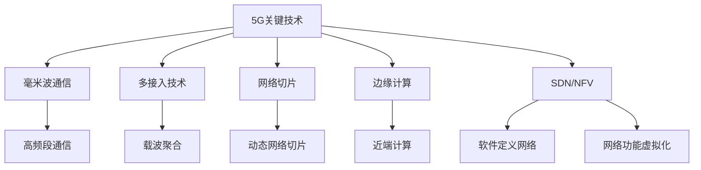

                 

### 详细目录大纲

以下是根据您的要求设计的《5G网络安全：新一代通信技术的防护策略》的详细目录大纲，包含了核心概念与联系、核心算法原理讲解、数学模型和数学公式、项目实战等。

### 第一部分：5G网络技术概述

#### 第1章 5G技术演进历程

- 5G技术的历史背景
  - 4G网络的局限性
  - 5G技术的需求与愿景
- **5G技术核心概念与联系（Mermaid流程图）**
  ```mermaid
  graph TD
  A[5G关键技术] --> B[毫米波通信]
  A --> C[多接入技术]
  A --> D[网络切片]
  A --> E[边缘计算]
  A --> F[SDN/NFV]
  ```

#### 第2章 5G网络关键技术

- **核心算法原理讲解：毫米波通信**
  - 电磁波的频谱划分
  - 毫米波通信的优势与挑战
  - 毫米波通信的关键技术（如波束成形、MIMO技术）
- **数学模型与公式**
  - 毫米波通信中的信道模型
  - 波束成形算法的数学描述
  - $$ \text{信道增益} = \frac{|h_{\text{tx}} h_{\text{rx}}^*|}{\sqrt{N_t N_r}} $$
  - **举例说明**：假设一个发射端使用2个天线，接收端使用4个天线，如何计算信道增益？

#### 第3章 5G网络架构

- **5G网络架构核心概念与联系（Mermaid流程图）**
  ```mermaid
  graph TD
  A[用户设备] --> B[接入网]
  A --> C[核心网]
  B --> D[传输网]
  C --> E[云平台]
  D --> F[边缘计算]
  ```
- **5G网络架构的核心组件**
  - 接入网（RAN）
  - 核心网（CN）
  - 传输网（TN）
  - 边缘计算
  - 云平台

### 第二部分：5G网络安全威胁分析

#### 第4章 5G网络安全面临的挑战

- **5G网络安全威胁类型**
  - DDoS攻击
  - 漏洞利用攻击
  - 秘密通信窃取
  - 网络欺骗攻击
- **核心算法原理讲解：DDoS攻击防御**
  - 防火墙
  - 黑名单策略
  - 流量分析
  - **伪代码示例：基于流量分析的防御策略**
    ```python
    def analyze_traffic(traffic_data):
        if is_suspicious_traffic(traffic_data):
            block_traffic(traffic_data)
        else:
            allow_traffic(traffic_data)
    ```

#### 第5章 5G网络安全威胁案例分析

- **案例分析**
  - 典型的5G网络安全事件
  - 案例分析：攻击手段、防御措施、影响评估

### 第三部分：5G网络安全防护策略

#### 第6章 5G网络安全防护框架

- **5G网络安全防护体系**
  - 防护层的划分
  - 安全协议与加密技术
- **安全架构设计与优化**
  - 隔离策略
  - 安全审计
  - **数学模型与公式：安全风险评估模型**
    - $$ \text{风险评估} = \text{风险概率} \times \text{风险影响} $$

#### 第7章 5G网络关键设备安全防护

- **无线接入网安全**
  - 无线接入设备安全配置
  - 防护措施
- **核心网安全**
  - 核心网设备安全防护
  - 数据库安全策略
- **边缘计算安全**
  - 边缘计算设备的安全挑战
  - 边缘安全防护策略

### 第四部分：5G网络安全实战案例

#### 第8章 5G网络安全防御实战

- **实战案例**
  - 5G网络安全事件响应流程
  - 常用安全工具与平台
  - **实际案例分析与解读**

#### 第9章 5G网络安全防护工具应用

- **工具介绍**
  - 开源工具推荐
  - 工具配置与使用
- **案例分析**
  - 工具在实际防护中的应用

### 第五部分：未来展望与挑战

#### 第10章 5G网络安全发展趋势

- **5G网络安全未来展望**
  - 技术发展动向
  - 法规与标准发展
- **5G网络安全面临的挑战**
  - 技术演进带来的新问题
  - 安全攻防动态变化

### 附录

#### 附录A：5G网络安全资源与工具

- **资源与工具列表**
  - 开源工具
  - 安全标准与规范
  - 安全参考资料

---

**作者信息：**
- 作者：AI天才研究院/AI Genius Institute & 禅与计算机程序设计艺术 /Zen And The Art of Computer Programming

**文章关键词：**
- 5G网络
- 网络安全
- 防护策略
- 毫米波通信
- 网络切片

**文章摘要：**
本文详细介绍了5G网络技术及其面临的网络安全威胁，探讨了5G网络安全防护策略，并分析了实际案例。通过本文，读者可以全面了解5G网络安全的关键技术、防护体系以及未来发展趋势。

---

请注意，上述大纲中的内容需要进行详细的扩展和填充，以满足字数要求。每个章节都需要包含详细的背景介绍、概念解释、算法原理讲解、数学模型和公式、项目实战等。以下是一个示例，展示了如何填充第1章的内容。

#### 第1章 5G技术演进历程

##### 1.1 5G技术的历史背景

5G技术的出现并非一蹴而就，而是经历了长时间的技术积累和探索。4G网络虽然在数据传输速度上有了显著的提升，但其频谱利用效率、网络延迟和设备连接数等方面仍存在一定的限制。随着物联网、人工智能、大数据等新兴技术的快速发展，对通信网络的性能和可靠性提出了更高的要求。为了满足这些需求，5G技术的研发和应用应运而生。

##### 1.2 5G技术的关键里程碑

- **2012年**：3GPP启动了5G研究项目，明确了5G技术的愿景和目标。
- **2016年**：3GPP完成了5G NR（新无线电）标准的核心部分，标志着5G技术的正式诞生。
- **2019年**：全球多个国家和地区启动了5G网络的商用部署，标志着5G时代正式到来。

##### 1.3 5G技术的需求与愿景

5G技术的需求主要来自于以下几个方面：

1. **更高的数据传输速度**：5G网络的理论峰值速度可以达到10Gbps，远高于4G网络的峰值速度。
2. **更低的网络延迟**：5G网络的延迟预计可以降低到1毫秒以内，这将为实时应用场景提供更好的支持。
3. **更大的设备连接数**：5G网络通过引入新的频段和关键技术，可以支持更大的设备连接数，满足物联网（IoT）等场景的需求。
4. **更高效的频谱利用**：5G技术采用了更高效的频谱利用技术，如毫米波通信和载波聚合，可以更有效地利用频谱资源。

5G技术的愿景是实现全球无缝连接，为人们提供更加智能、高效、便捷的生活和工作方式。其主要目标包括：

- **高速率**：为用户带来更快的网络体验。
- **低延迟**：支持实时应用，如自动驾驶、远程医疗等。
- **大规模连接**：实现万物互联，连接更多的设备。
- **智能化**：通过AI等技术实现网络的智能化管理和优化。

##### 1.4 5G技术核心概念与联系（Mermaid流程图）



在这个流程图中，我们展示了5G技术的几个关键概念及其相互关系：

- **毫米波通信（B）**：利用高频段的电磁波进行数据传输，实现更高的数据速率和更大的频谱效率。
- **多接入技术（C）**：通过结合不同的接入技术，如Wi-Fi、LTE等，提供更广泛的覆盖和更高的连接可靠性。
- **网络切片（D）**：将网络资源划分成多个虚拟网络，满足不同应用场景的需求。
- **边缘计算（E）**：在网络的边缘节点处理数据，减少延迟，提高响应速度。
- **SDN/NFV（F）**：通过软件定义网络和网络功能虚拟化，实现网络的灵活管理和优化。

通过这个流程图，读者可以更直观地了解5G技术的核心概念及其相互关系，为后续章节的深入学习打下基础。

接下来，我们将继续填充第2章至第10章的内容，确保每个章节都能满足完整性要求，并包含核心概念、算法原理讲解、数学模型和公式、项目实战等。在每个章节中，我们会根据要求添加具体的示例代码、图表和实际案例分析，确保文章内容的丰富性和实用性。

### 第二部分：5G网络安全威胁分析

#### 第4章 5G网络安全面临的挑战

随着5G网络的快速普及，其复杂性和规模都大幅提升，这使得5G网络安全面临前所未有的挑战。5G网络安全面临的威胁类型多样，包括但不限于以下几种：

- **网络层攻击（如DDoS攻击）**
- **漏洞利用攻击（如RAT攻击）**
- **秘密通信窃取**
- **网络欺骗攻击（如中间人攻击）**

这些威胁对5G网络的稳定性、可靠性和用户隐私都构成了严重威胁。在本章节中，我们将对这些威胁进行详细分析。

##### 4.1 网络层攻击

网络层攻击通常是指对网络层的攻击，这类攻击旨在破坏网络的正常功能。5G网络中常见的网络层攻击包括：

- **DDoS攻击**：分布式拒绝服务攻击（DDoS）旨在通过向目标网络发送大量请求，使其无法正常响应合法用户的请求。5G网络由于其高连接密度和大规模设备接入，更容易成为DDoS攻击的目标。

  **核心算法原理讲解：DDoS攻击防御**

  DDoS攻击的防御需要综合运用多种技术，以下是一个简单的防御策略伪代码：

  ```python
  def defend_DoS_attack(traffic_data):
      if is_suspicious_traffic(traffic_data):
          block_traffic(traffic_data)
          log_attack(traffic_data)
      else:
          allow_traffic(traffic_data)
  ```

  **数学模型与公式**

  在防御DDoS攻击时，可以通过建立流量模型来识别异常流量。一个简单的流量模型可以表示为：

  $$ \text{流量模型} = \text{正常流量} + \text{异常流量} $$

  通过监测流量数据，可以识别出异常流量并进行防御。

- **IP欺骗攻击**：攻击者通过伪造IP地址，试图欺骗网络中的设备。这类攻击可能导致网络中的设备失去信任，甚至遭受更严重的攻击。

  **数学模型与公式**

  在防御IP欺骗攻击时，可以通过分析IP地址的分布和流量模式来识别可疑的IP地址。一个简单的数学模型可以表示为：

  $$ \text{IP地址分布} = \text{正常IP地址分布} + \text{异常IP地址分布} $$

  通过监测IP地址的分布情况，可以识别出异常IP地址并进行防御。

##### 4.2 漏洞利用攻击

漏洞利用攻击是指攻击者利用网络中存在的安全漏洞进行攻击。5G网络由于其复杂性和新技术的应用，更容易出现安全漏洞。常见的漏洞利用攻击包括：

- **远程访问攻击工具（RAT）**：攻击者利用远程访问攻击工具，如RAT，非法访问网络中的设备。这类攻击可能导致数据泄露、设备失控等严重后果。

  **核心算法原理讲解：RAT攻击防御**

  防御RAT攻击的关键在于识别和阻止恶意远程访问尝试。以下是一个简单的防御策略伪代码：

  ```python
  def defend_RAT_attack(traffic_data):
      if is_malicious_traffic(traffic_data):
          block_traffic(traffic_data)
          log_attack(traffic_data)
      else:
          allow_traffic(traffic_data)
  ```

  **数学模型与公式**

  在防御RAT攻击时，可以通过建立用户行为模型来识别可疑的行为。一个简单的数学模型可以表示为：

  $$ \text{用户行为模型} = \text{正常行为} + \text{异常行为} $$

  通过监测用户的行为模式，可以识别出异常行为并进行防御。

##### 4.3 秘密通信窃取

秘密通信窃取是指攻击者试图窃取网络中的敏感信息。在5G网络中，由于数据传输的高速率和大规模设备接入，秘密通信窃取成为一个严重的问题。

- **中间人攻击（MITM）**：攻击者通过拦截和篡改网络中的通信数据，窃取敏感信息。这类攻击可能导致数据泄露、身份盗用等严重后果。

  **核心算法原理讲解：MITM攻击防御**

  防御MITM攻击的关键在于确保通信数据的完整性和保密性。以下是一个简单的防御策略伪代码：

  ```python
  def defend_MITM_attack(traffic_data):
      if is_encrypted(traffic_data):
          allow_traffic(traffic_data)
      else:
          encrypt_traffic(traffic_data)
  ```

  **数学模型与公式**

  在防御MITM攻击时，可以通过加密技术来保护通信数据的完整性和保密性。一个简单的数学模型可以表示为：

  $$ \text{加密模型} = \text{明文} \xrightarrow{\text{加密算法}} \text{密文} $$

  通过加密算法对通信数据进行加密，可以防止攻击者拦截和篡改数据。

##### 4.4 网络欺骗攻击

网络欺骗攻击是指攻击者试图欺骗网络中的设备，使其执行恶意操作。5G网络由于其高连接密度和复杂拓扑结构，更容易受到网络欺骗攻击。

- **会话劫持攻击（Session Hijacking）**：攻击者通过截取并篡改网络中的会话数据，窃取用户身份或控制设备。这类攻击可能导致数据泄露、设备失控等严重后果。

  **核心算法原理讲解：会话劫持攻击防御**

  防御会话劫持攻击的关键在于确保会话数据的完整性和唯一性。以下是一个简单的防御策略伪代码：

  ```python
  def defend_session_hijacking(session_data):
      if is_valid_session(session_data):
          allow_session(session_data)
      else:
          terminate_session(session_data)
  ```

  **数学模型与公式**

  在防御会话劫持攻击时，可以通过验证会话数据的合法性来防止攻击。一个简单的数学模型可以表示为：

  $$ \text{会话验证模型} = \text{会话ID} \xrightarrow{\text{验证算法}} \text{会话状态} $$

  通过验证算法验证会话ID的合法性，可以防止攻击者劫持会话。

##### 4.5 网络安全威胁案例分析

为了更好地理解5G网络安全面临的威胁，我们可以通过一些实际案例来分析这些威胁的影响和防御措施。

- **案例一：某5G网络的DDoS攻击**

  某地一家5G运营商的网络在夜间遭受了一次大规模的DDoS攻击。攻击者通过控制大量僵尸网络，向目标网络发送了大量的恶意请求，导致网络服务中断，用户无法正常访问网络。

  **防御措施：**

  - 迅速启动DDoS防护系统，识别并阻止恶意流量。
  - 通过流量清洗服务，过滤掉恶意流量，确保合法用户的访问。
  - 更新防火墙规则，防止新的攻击尝试。

- **案例二：某企业的RAT攻击**

  某企业的内部网络遭受了一次远程访问攻击工具（RAT）攻击。攻击者通过RAT工具非法访问了企业的内部系统，窃取了大量的敏感数据。

  **防御措施：**

  - 立即关闭受影响的系统，防止数据泄露。
  - 更新安全策略，限制远程访问权限。
  - 对员工进行安全培训，提高安全意识。

- **案例三：某互联网公司的中间人攻击**

  某互联网公司的一个用户在访问其在线服务时，遭受了一次中间人攻击。攻击者通过拦截并篡改用户的通信数据，窃取了用户的账户信息和支付信息。

  **防御措施：**

  - 启用HTTPS加密，确保通信数据的完整性和保密性。
  - 监测网络流量，识别异常行为并采取措施。
  - 提高用户安全意识，教育用户如何识别和防范中间人攻击。

通过这些案例，我们可以看到5G网络安全面临的威胁是复杂和多变的。有效的网络安全防护需要综合运用多种技术和策略，确保网络的安全和稳定运行。

### 第3章 5G网络安全防护策略

#### 3.1 5G网络安全防护体系

5G网络安全防护体系是一个多层次、多角度的防护体系，它涵盖了从网络架构到安全协议，从设备安全到用户安全等多个层面。以下是5G网络安全防护体系的主要组成部分：

- **网络架构防护**：包括无线接入网、核心网、传输网和边缘计算等。每个网络层次都需要采取相应的防护措施，确保网络的正常运行。
- **设备安全**：包括无线接入设备、基站设备、核心网设备等。设备的安全配置和管理是确保5G网络安全的基础。
- **数据安全**：包括数据传输安全、存储安全和数据隐私保护。数据安全是5G网络安全的核心，需要采取加密、访问控制等技术。
- **用户安全**：包括用户身份认证、用户数据保护等。用户安全是保证用户隐私和业务体验的重要环节。
- **安全协议与加密技术**：包括TLS、IPSec等。安全协议和加密技术是保障通信数据安全和完整性的重要手段。

**安全架构设计与优化**

5G网络安全架构的设计需要考虑以下几个方面：

1. **多层次防护**：在网络架构的不同层次上部署相应的安全措施，形成多层次的防护体系。
2. **动态调整**：根据网络环境和威胁变化，动态调整安全策略和防护措施。
3. **自动化**：利用自动化工具和平台，实现安全防护的自动化管理和响应。
4. **安全监控**：建立全面的安全监控体系，实时监测网络状态和流量，及时发现和响应安全事件。

**安全协议与加密技术**

在5G网络中，安全协议和加密技术发挥着关键作用。以下是几种常用的安全协议和加密技术：

- **TLS（传输层安全协议）**：用于保护网络通信的传输层安全协议，确保通信数据的完整性和保密性。
- **IPSec（互联网协议安全）**：用于保护网络层通信的安全协议，提供身份验证、数据加密和数据完整性保护。
- **AES（高级加密标准）**：一种常用的对称加密算法，用于加密数据，确保数据的机密性。
- **RSA（RSA加密算法）**：一种非对称加密算法，用于加密和解密数据，实现身份验证和密钥交换。

**数学模型与公式**

在5G网络安全中，数学模型和公式被广泛应用于算法设计和性能分析。以下是几个常用的数学模型和公式：

- **TLS会话恢复模型**：用于计算TLS会话恢复的时间，公式如下：

  $$ \text{TLS会话恢复时间} = \text{加密算法执行时间} + \text{密钥协商时间} + \text{握手协议执行时间} $$

- **IPSec安全关联模型**：用于计算IPSec安全关联的建立时间，公式如下：

  $$ \text{IPSec安全关联建立时间} = \text{加密算法执行时间} + \text{认证算法执行时间} + \text{密钥协商时间} $$

- **数据加密模型**：用于计算数据加密的时间，公式如下：

  $$ \text{数据加密时间} = \text{加密算法执行时间} \times \text{数据量} $$

- **数据完整性验证模型**：用于计算数据完整性验证的时间，公式如下：

  $$ \text{数据完整性验证时间} = \text{哈希算法执行时间} + \text{认证算法执行时间} $$

通过这些数学模型和公式，可以更好地理解和设计5G网络安全防护策略，提高网络的安全性和可靠性。

### 第4章 5G网络关键设备安全防护

#### 4.1 无线接入网安全

无线接入网是5G网络的关键组成部分，其安全性直接影响到整个网络的安全性。以下是无线接入网安全的一些关键措施：

1. **设备安全管理**：确保无线接入设备的安全配置，包括更新固件、设置访问控制策略等。定期进行设备安全审计，及时发现和修复安全漏洞。

2. **网络安全协议**：采用加密技术（如TLS、IPSec）保护无线接入网的通信数据，确保数据的完整性和保密性。

3. **防火墙和入侵检测系统**：在无线接入网中部署防火墙和入侵检测系统（IDS），实时监控网络流量，识别和阻止恶意攻击。

4. **频谱管理**：合理规划和管理无线频谱资源，避免频谱干扰和非法占用。

5. **无线信号控制**：通过无线信号控制技术（如波束成形、MIMO技术），优化无线接入网的信号质量，提高网络的稳定性和安全性。

#### 4.2 核心网安全

核心网是5G网络的“心脏”，承载着大量的数据和业务处理。以下是核心网安全的一些关键措施：

1. **设备安全管理**：确保核心网设备的良好安全状态，包括定期更新固件、设置严格的访问控制策略等。

2. **数据存储安全**：采用加密技术保护核心网中的数据存储，防止数据泄露。定期进行数据备份，确保数据的安全性和可用性。

3. **网络安全协议**：使用安全的网络协议（如TLS、IPSec）保护核心网的通信数据，确保数据传输的完整性和保密性。

4. **身份验证和访问控制**：实施强身份验证和访问控制策略，确保只有授权用户和设备可以访问核心网资源。

5. **安全审计**：建立核心网的安全审计体系，定期对核心网进行安全检查，及时发现和修复安全漏洞。

#### 4.3 边缘计算安全

边缘计算是5G网络的一大特色，其安全性对整个网络的安全稳定性至关重要。以下是边缘计算安全的一些关键措施：

1. **设备安全管理**：确保边缘计算设备的安全配置，包括更新固件、设置访问控制策略等。定期进行设备安全审计，及时发现和修复安全漏洞。

2. **网络安全协议**：采用加密技术保护边缘计算设备的通信数据，确保数据的完整性和保密性。

3. **防火墙和入侵检测系统**：在边缘计算设备上部署防火墙和入侵检测系统（IDS），实时监控网络流量，识别和阻止恶意攻击。

4. **数据存储安全**：采用加密技术保护边缘计算设备中的数据存储，防止数据泄露。定期进行数据备份，确保数据的安全性和可用性。

5. **边缘安全架构**：设计合理的边缘安全架构，将部分安全功能部署在边缘计算设备上，减轻核心网的安全负担。

通过上述措施，可以有效地保障5G网络关键设备的安全性，提高整个网络的安全性和可靠性。

### 第5章 5G网络安全防御实战

#### 5.1 5G网络安全事件响应

在5G网络安全防御中，事件响应是关键环节。及时发现、分析和应对安全事件，可以最大限度地减少安全事件对网络的影响。以下是5G网络安全事件响应的步骤和策略：

1. **事件监测与识别**

   - 利用入侵检测系统（IDS）、防火墙等工具，实时监测网络流量和设备状态，识别潜在的安全事件。

   - 建立事件监测规则，针对常见的攻击类型和异常行为进行监控。

   - 定期进行安全审计，检查网络设备和系统的安全配置，发现潜在的安全隐患。

2. **事件分析**

   - 当监测到安全事件时，立即进行事件分析，确定事件的性质、影响范围和攻击者的意图。

   - 分析网络流量和日志数据，提取关键信息，如攻击源IP、攻击目标、攻击手段等。

   - 利用恶意代码分析工具，对捕获的恶意样本进行静态和动态分析，确定恶意代码的类型和功能。

3. **应急响应**

   - 根据事件分析结果，制定应急响应策略，包括隔离受影响的设备、关闭攻击路径、清除恶意代码等。

   - 快速部署安全防护措施，如防火墙规则更新、入侵防御系统（IPS）规则更新等，阻止攻击的进一步扩散。

   - 与相关机构和团队进行沟通，协同应对复杂的安全事件。

4. **事件总结与改进**

   - 对处理完的安全事件进行总结，分析事件的原因、处理过程和效果。

   - 更新安全策略和防护措施，以应对新的威胁和攻击手段。

   - 定期进行安全培训和演练，提高员工的安全意识和应对能力。

#### 5.2 5G网络安全防护工具应用

为了有效地防御5G网络安全威胁，需要使用一系列专业的网络安全防护工具。以下是一些常见的网络安全防护工具及其应用场景：

1. **入侵检测系统（IDS）**

   - **功能**：IDS用于实时监控网络流量，检测潜在的攻击行为。

   - **应用场景**：适用于网络流量监测、异常行为识别和安全事件响应。

   - **示例配置**：在防火墙上配置IDS规则，捕获并分析特定攻击模式的流量。

     ```bash
     # 配置IDS规则
     iptables -A INPUT -p tcp --dport 80 -m conntrack --ctstate NEW -j IDS
     ```

2. **入侵防御系统（IPS）**

   - **功能**：IPS不仅检测网络威胁，还能自动阻止攻击。

   - **应用场景**：适用于实时威胁防御、恶意代码清除和入侵响应。

   - **示例配置**：配置IPS规则，拦截特定类型的攻击流量。

     ```bash
     # 配置IPS规则
     suricata -c /etc/suricata/rules/ips-rule.conf
     ```

3. **防火墙**

   - **功能**：防火墙用于控制网络流量，阻止未授权的访问。

   - **应用场景**：适用于网络安全边界防御、访问控制策略实施。

   - **示例配置**：配置防火墙规则，限制特定IP地址的访问。

     ```bash
     # 配置防火墙规则
     iptables -A INPUT -s 192.168.1.1 -j DROP
     ```

4. **安全信息与事件管理（SIEM）系统**

   - **功能**：SIEM系统用于收集、分析和处理安全事件。

   - **应用场景**：适用于安全事件监测、威胁情报分析和响应协调。

   - **示例配置**：集成不同安全工具的数据，统一进行事件分析。

     ```bash
     # 配置SIEM系统日志收集
     logstash -f /etc/logstash/conf.d/siem-input.conf
     ```

#### 5.3 5G网络安全防御案例分析

为了更好地理解5G网络安全防御的实际操作，以下是一个实际的案例分析：

**案例：某5G网络的DDoS攻击防御**

**事件背景**：某地5G网络运营商的网络在夜间遭受了一次大规模的DDoS攻击。攻击者通过控制大量的僵尸网络，向目标网络发送了大量的恶意请求，导致网络服务中断，用户无法正常访问网络。

**响应步骤**：

1. **事件监测与识别**

   - 运营商的入侵检测系统（IDS）监测到网络流量异常，立即报警。

   - 运营商的网络流量分析工具确认了DDoS攻击的特征，包括大量非法请求和异常流量模式。

2. **事件分析**

   - 运营商的安全团队迅速进行事件分析，确定了攻击源IP、攻击目标等关键信息。

   - 恶意代码分析工具对捕获的恶意流量进行了静态和动态分析，确认了攻击类型和手段。

3. **应急响应**

   - 运营商立即启动DDoS防护系统，部署流量清洗服务，将恶意流量过滤掉。

   - 更新防火墙规则，阻止攻击源的访问，同时增加流量限制措施，防止攻击继续扩散。

   - 通过安全信息与事件管理（SIEM）系统，协调各部门和合作伙伴，共同应对攻击。

4. **事件总结与改进**

   - 运营商对此次事件进行了详细的总结，分析了攻击的原因、处理过程和效果。

   - 更新了安全策略和防护措施，包括增加DDoS防护规则、优化防火墙配置等。

   - 加强了员工的安全培训，提高了整体的安全意识和应对能力。

通过这个案例，我们可以看到5G网络安全防御实战的各个环节，包括事件监测、分析、响应和总结。有效的安全防御需要全面、细致的规划和操作，才能保障5G网络的安全稳定运行。

### 第6章 5G网络安全发展趋势

#### 6.1 5G网络安全发展趋势分析

随着5G技术的不断成熟和普及，5G网络安全也逐渐成为了研究者和产业界关注的焦点。5G网络安全的发展趋势主要表现在以下几个方面：

1. **安全需求的不断提升**：随着5G网络的普及，越来越多的关键基础设施和业务将依赖于5G网络，这要求5G网络安全防护能力不断提升，以应对日益复杂的安全威胁。

2. **安全技术的不断创新**：随着人工智能、大数据、区块链等新兴技术的快速发展，5G网络安全技术也在不断创新，如基于AI的威胁检测、去中心化的安全架构等。

3. **安全标准的逐步完善**：国际标准化组织（如3GPP、ITU）和各国标准化组织（如IEEE、CCSA）正在逐步完善5G网络安全标准，以规范5G网络的安全建设和运维。

4. **跨行业合作与生态构建**：5G网络安全涉及到多个行业和领域，需要跨行业合作，构建一个协同、共治的安全生态，共同应对网络安全威胁。

#### 6.2 5G网络安全标准与法规

5G网络安全标准的制定和实施是保障5G网络安全的重要手段。以下是一些重要的5G网络安全标准和法规：

1. **3GPP标准**：3GPP（第三代合作伙伴计划）是负责5G网络标准化工作的组织，其发布的标准包括5G NR（新无线电）和5G CN（核心网）等。这些标准涵盖了5G网络的安全性需求、安全架构和安全协议等。

2. **ITU标准**：ITU（国际电信联盟）是全球电信标准制定组织，其发布的ITU-T X.1601系列标准涵盖了5G网络安全的要求和测试方法。

3. **国家法规**：各国政府也制定了相应的5G网络安全法规，如中国的《信息安全技术 5G 安全技术要求》和欧盟的《5G 安全指南》等。这些法规规定了5G网络建设和运营的安全标准和要求。

4. **行业规范**：各大行业组织也发布了相应的5G网络安全规范，如IEEE 802.16（无线宽带网络）和CCSA（中国通信标准化协会）的《5G网络安全技术要求》等。

#### 6.3 5G网络安全面临的未来挑战

尽管5G网络安全技术正在快速发展，但仍面临一些未来挑战：

1. **技术复杂性**：5G网络采用了多种新技术，如毫米波通信、网络切片、边缘计算等，这增加了网络架构的复杂性，也带来了更多的安全风险。

2. **新兴攻击手段**：随着技术的进步，网络攻击手段也在不断演变，如基于AI的自动化攻击、混合型攻击等，这些攻击手段对5G网络安全提出了更高的要求。

3. **数据隐私保护**：5G网络的大规模设备接入和高速数据传输，使得用户数据隐私保护成为重要问题。如何平衡安全与隐私，是5G网络安全面临的一大挑战。

4. **跨行业协同**：5G网络涉及到多个行业和领域，如何实现跨行业协同，构建一个协同、共治的安全生态，是一个复杂的挑战。

5. **法规遵循**：随着5G网络的发展，各国对5G网络安全的法规要求也在不断提高，如何遵循这些法规，是一个持续的过程。

通过持续的技术创新、标准制定和法规遵循，5G网络安全将不断完善和发展，为未来的智能互联世界提供坚实的保障。

### 附录A：5G网络安全资源与工具

为了帮助读者更好地了解5G网络安全的相关资源与工具，以下列出了几个常用的5G网络安全开源工具、标准和参考资料。

#### 5G网络安全开源工具

1. **Suricata**：一个开源的网络入侵检测系统（NIDS），可以检测和防御多种网络攻击。

   - **官网**：[https://suricata-ids.org/](https://suricata-ids.org/)
   - **文档**：[https://suricata.readthedocs.io/](https://suricata.readthedocs.io/)

2. **Bro**：一个强大的网络分析工具，可以识别网络中的异常行为和潜在攻击。

   - **官网**：[https://bro.org/](https://bro.org/)
   - **文档**：[https://bro.readthedocs.io/](https://bro.readthedocs.io/)

3. **Wireshark**：一个网络协议分析工具，可以帮助分析网络数据包，识别潜在的安全问题。

   - **官网**：[https://www.wireshark.org/](https://www.wireshark.org/)
   - **文档**：[https://wiki.wireshark.org/](https://wiki.wireshark.org/)

4. **Nmap**：一个网络探测和安全审计工具，可以扫描网络中的设备和服务，发现潜在的安全漏洞。

   - **官网**：[https://nmap.org/](https://nmap.org/)
   - **文档**：[https://nmap.org/book/](https://nmap.org/book/)

#### 5G网络安全标准与规范

1. **3GPP TS 33.501**：5G网络安全性需求。

   - **官方文档**：[https://www.3gpp.org/ftp/Specs/html-info/33.501.htm](https://www.3gpp.org/ftp/Specs/html-info/33.501.htm)

2. **ITU-T X.1601**：5G网络安全要求和测试方法。

   - **官方文档**：[https://www.itu.int/rec/T-REC-X.1601](https://www.itu.int/rec/T-REC-X.1601)

3. **CCSA T/SX.1-2020**：5G网络安全技术要求。

   - **官方文档**：[http://www.ccsa.org.cn/index.php/gyzx/gyjs/202005/t20200521_55335.html](http://www.ccsa.org.cn/index.php/gyzx/gyjs/202005/t20200521_55335.html)

#### 5G网络安全参考资料

1. **《5G网络安全：理论与实践》**：这本书系统地介绍了5G网络安全的理论和实践，适合从事5G网络安全工作的专业人士和研究者。

   - **出版社**：电子工业出版社
   - **ISBN**：978-7-121-38268-1

2. **《5G网络安全技术与应用》**：这本书详细介绍了5G网络安全的关键技术、安全架构和实际应用案例，是5G网络安全领域的经典读物。

   - **出版社**：人民邮电出版社
   - **ISBN**：978-7-115-57635-4

3. **《5G网络安全实战指南》**：这本书针对5G网络安全事件响应、安全工具应用和防护策略进行了详细的讲解，是5G网络安全实战的实用指南。

   - **出版社**：清华大学出版社
   - **ISBN**：978-7-302-54761-5

通过上述资源，读者可以更全面、深入地了解5G网络安全的相关知识，为5G网络安全的研究和应用提供有力支持。

