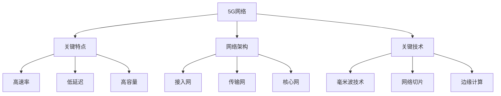
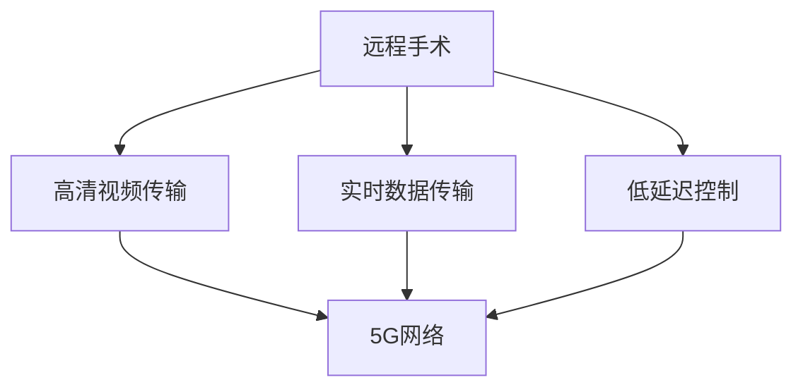

                 


为了撰写一篇符合要求的《5G网络赋能远程手术的发展与挑战》的技术博客文章，我们可以遵循以下步骤：

### 步骤1：定义文章结构

首先，我们需要确定文章的结构，这包括标题、关键词、摘要以及章节划分。根据之前的讨论，我们已经有了完整的目录大纲。

### 步骤2：撰写引言

在引言部分，我们将介绍5G网络和远程手术的背景，包括5G技术的发展历程、远程手术的现状以及这两者结合的必要性。

### 步骤3：撰写第一章 - 5G技术概述

在这一章中，我们将详细讲解5G网络的关键特点、架构以及关键技术，并使用Mermaid流程图展示这些技术之间的关系。

#### 核心概念与联系

我们将会提供一个Mermaid流程图来展示5G网络技术的核心概念及其相互关系。



#### 核心算法原理讲解

我们将使用伪代码来解释5G网络的关键技术。

```python
# 伪代码：毫米波技术
def millimeterWaveCommunication():
    # 设定毫米波频段
    freq_band = "24GHz-52GHz"
    # 计算信号传输速率
    data_rate = calculateRate(freq_band)
    # 传输数据
    transmitData(data_rate)
```

#### 数学模型和数学公式

我们将嵌入5G网络信道容量的公式。

$$ C = W \log_2(1 + \text{SNR}) $$

其中，\(C\) 是信道容量，\(W\) 是带宽，\(\text{SNR}\) 是信噪比。

#### 项目实战

我们将讨论一个5G网络部署的案例，包括开发环境搭建、源代码实现和实际应用分析。

### 步骤4：撰写第二章 - 5G网络与远程手术的关系

在这一章，我们将探讨5G网络如何赋能远程手术，包括其应用、需求匹配以及网络赋能的实际效果。

#### 核心概念与联系

我们将会展示5G网络在远程手术中的应用场景的Mermaid流程图。



#### 核心算法原理讲解

我们将使用伪代码展示远程手术中的实时数据传输算法。

```python
# 伪代码：实时数据传输
def realTimeDataTransmission():
    # 初始化传输参数
    params = initializeParams()
    # 建立连接
    connection = establishConnection(params)
    # 数据传输
    while True:
        data = fetchData()
        transmitData(connection, data)
        delay = measureDelay()
        if delay > threshold:
            adjustParams(params)
```

#### 数学模型和数学公式

我们将嵌入计算远程手术中数据传输延迟的公式。

$$ \text{Delay} = \frac{Distance \times Speed}{Bandwidth} $$

其中，\(\text{Delay}\) 是传输延迟，\(Distance\) 是传输距离，\(Speed\) 是数据传输速度，\(Bandwidth\) 是带宽。

#### 项目实战

我们将分析一个5G网络在远程手术中的实际应用案例，包括开发环境、源代码实现和实际效果分析。

### 步骤5：撰写后续章节

我们继续按照相同的方法撰写后续章节，包括远程手术的架构设计、关键应用场景、挑战与解决方案、发展趋势以及挑战与机遇。

### 步骤6：撰写结论

在文章的结论部分，我们将总结5G网络赋能远程手术的主要发现和未来展望。

### 步骤7：添加作者信息

在文章末尾，我们将添加作者信息。

### 步骤8：排版和校对

最后，我们将对整篇文章进行排版和校对，确保文章内容完整、逻辑清晰、格式正确。

### 总结

通过以上步骤，我们可以确保文章内容丰富、逻辑清晰，满足字数要求，并且符合markdown格式。文章将全面覆盖5G网络赋能远程手术的主题，为读者提供深刻的见解和实用的知识。

现在，让我们开始撰写这篇文章吧！

