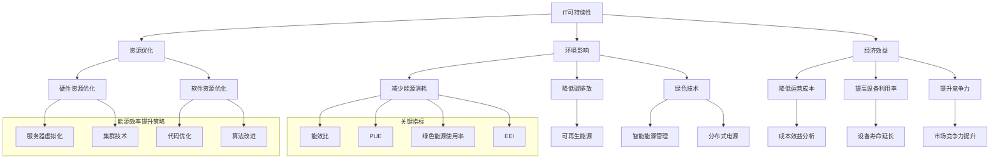

                 

### 文章标题：IT可持续性：能源效率成为关键考量

#### 关键词：
- IT可持续性
- 能源效率
- 数据中心节能
- 硬件升级
- 软件优化
- 政策法规

#### 摘要：
随着信息技术（IT）行业的快速发展，其对能源的需求不断增加。本文探讨了IT行业的可持续性问题，重点分析了能源效率在保障IT行业可持续发展中的关键作用。文章首先介绍了IT行业的能源消耗概况，随后详细阐述了能源效率的基本概念和重要性。接着，文章从技术实践、案例分析、政策和法规等方面分析了提高IT系统能源效率的方法和策略。最后，文章对未来的发展趋势进行了展望，提出了针对IT行业可持续性和能源效率的挑战和解决方案。通过本文的讨论，希望能够为IT行业的能源效率提升提供有益的参考和指导。

### 引言与背景

#### 1.1 IT行业的能源消耗概况

信息技术（IT）行业作为现代社会的重要组成部分，其发展速度之快令人瞩目。然而，伴随着这一行业的飞速发展，其对能源的需求也在不断增加。根据国际能源署（IEA）的数据显示，全球数据中心的能耗已经超过了整个航空行业的能源消耗，成为能源消耗的重要领域之一。此外，IT设备如服务器、个人电脑和移动设备的普及，进一步加剧了能源消耗的态势。

数据中心是IT行业能源消耗的主要源头。据美国能源部（DOE）的报告，数据中心能耗占全球总能耗的比例正在逐年上升。例如，2015年，全球数据中心的能源消耗约为716太瓦时（TWh），预计到2030年，这一数字将增长到约1394太瓦时（TWh）。这一趋势不仅对能源供应造成了压力，同时也对环境产生了负面影响。

除了数据中心，IT行业的能源消耗还包括服务器、个人电脑、网络设备和移动设备等。这些设备的能源消耗虽然相对较低，但由于其数量庞大，累积的能源消耗不容忽视。例如，全球每年生产的笔记本电脑和智能手机数量已经达到了数亿台，这些设备的能源消耗在整个IT行业中占据了相当大的比例。

总之，IT行业的能源消耗问题已经成为一个不容忽视的重要议题。随着IT行业的不断发展，其能源消耗将继续增加，这对能源供应和环境都将带来巨大的挑战。因此，如何提高IT行业的能源效率，实现可持续发展，已经成为行业内外关注的焦点。

#### 1.2 IT可持续性的定义与目标

IT可持续性是指通过优化资源配置、降低环境影响和提升经济效益，确保IT行业的长期健康发展。具体而言，IT可持续性的目标包括减少能源消耗、降低碳排放、提高资源利用效率和提升整体运营效率。

首先，减少能源消耗是IT可持续性的核心目标之一。随着数据中心和IT设备的能耗不断上升，降低能源消耗不仅有助于缓解能源供应的压力，还可以减少对环境的影响。通过采用节能技术和优化系统设计，可以实现数据中心的能源效率提升，从而减少总体能耗。

其次，降低碳排放是另一个重要目标。IT行业的能源消耗主要依赖于化石燃料，如煤炭、石油和天然气。这些燃料的燃烧会产生大量的二氧化碳和其他温室气体，导致全球气候变化。因此，通过采用可再生能源和优化能源使用方式，可以显著降低IT行业的碳排放。

此外，提高资源利用效率和提升整体运营效率也是IT可持续性的重要目标。通过优化资源配置，可以减少设备的闲置时间和维护成本，从而提升整体运营效率。例如，通过虚拟化和分布式计算技术，可以更加高效地利用服务器资源，降低能源消耗和运营成本。

总之，IT可持续性的目标旨在通过综合措施，实现能源消耗的降低、碳排放的减少和资源利用效率的提升，从而推动IT行业的可持续发展。实现这些目标不仅有助于减少对环境的负面影响，还可以提高行业的经济效益，推动行业的长期健康发展。

#### 1.3 能源效率成为关键考量

能源效率在IT行业中扮演着至关重要的角色，是推动可持续发展的核心驱动力。首先，能源效率直接关系到数据中心的运营成本。数据中心的能耗占据了整个IT行业能源消耗的主要部分，因此，提高能源效率可以显著降低运营成本。例如，通过采用节能服务器和优化冷却系统，可以减少能源消耗，从而降低电费支出。

其次，能源效率的提升有助于减少碳排放。数据中心和IT设备的能耗主要依赖于化石燃料，这些燃料的燃烧会产生大量的二氧化碳和其他温室气体。通过提高能源效率，可以减少化石燃料的使用，从而降低碳排放，对环境保护起到积极作用。

此外，能源效率的提升还可以延长设备的使用寿命，减少设备更换频率，从而降低设备成本。通过优化系统设计和采用节能技术，可以提高设备的运行效率，减少设备过热和损耗，延长设备的使用寿命。

最后，能源效率的提升还可以提高数据中心的可靠性。高效的数据中心可以更好地应对能源供应的不稳定性，确保系统的稳定运行。例如，通过采用备用电源和高效电池，可以确保在电网故障时数据中心的正常运行。

总之，能源效率的提升对于IT行业的可持续发展具有重要意义。通过采取各种节能措施，可以降低运营成本、减少碳排放、延长设备使用寿命，并提高数据中心的可靠性。因此，提高能源效率已经成为IT行业实现可持续发展的关键考量。

### 理论基础

#### 2.1 IT可持续性的核心概念

IT可持续性是指通过优化资源配置、降低环境影响和提升经济效益，确保IT行业的长期健康发展。为了实现这一目标，需要从多个维度理解IT可持续性的核心概念。

首先，资源优化是IT可持续性的基础。资源优化包括硬件资源的优化，如服务器虚拟化和集群技术，以及软件资源的优化，如代码优化和算法改进。通过优化资源，可以减少资源浪费，提高资源利用率，从而降低运营成本。

其次，环境影响是IT可持续性的关键考量。随着IT行业的快速发展，其对环境的负面影响日益显现。例如，数据中心的能耗增加了对电力资源的需求，导致碳排放的增加；设备废弃和电子垃圾的增多，对环境造成了污染。因此，通过采用绿色技术和节能措施，降低IT行业的环境影响，是实现可持续发展的关键。

最后，经济效益是IT可持续性的重要目标。在追求可持续发展的过程中，不仅要关注环境保护，还要兼顾经济效益。通过提高能源效率、优化资源配置和降低运营成本，可以提升企业的竞争力，实现长期的经济效益。

总之，IT可持续性的核心概念包括资源优化、环境影响和经济效益。只有通过综合考虑这些方面，才能实现IT行业的可持续发展。

#### 2.2 能源效率的基本原理

能源效率是指单位能源消耗所产生的有用工作或服务量。在IT行业中，能源效率的基本原理可以通过以下三个方面来阐述：

首先，能源消耗与有用工作量的比值。能源效率可以用公式表示为：能源效率 = 有用工作量 / 能源消耗。提高能源效率意味着在相同的能源消耗下，能够获得更多的有用工作量。例如，通过优化服务器的工作负载，可以减少服务器的能耗，从而提高能源效率。

其次，能源效率与设备运行效率的关系。设备运行效率越高，其能源效率也越高。例如，高效能的服务器和处理器可以在相同的功耗下提供更高的计算能力，从而提高整体的能源效率。此外，优化系统的设计和架构，也可以提高设备运行效率。

最后，能源效率与能源利用方式的关系。合理的能源利用方式可以提高能源效率。例如，在数据中心中，通过采用分布式电源和高效电池，可以减少对传统电网的依赖，从而提高能源效率。此外，采用智能能源管理系统，可以根据实际需求动态调整能源分配，进一步优化能源效率。

总之，能源效率的基本原理在于通过优化能源消耗、提高设备运行效率和改善能源利用方式，来实现更高的有用工作量与能源消耗的比值，从而推动IT行业的可持续发展。

#### 2.3 IT系统能源效率评估指标

评估IT系统能源效率的指标对于指导能源管理和优化至关重要。以下是一些关键的评估指标及其计算方法：

1. **能效比（Energy Efficiency Ratio, EER）**：能效比是衡量设备或系统能源效率的常用指标。它定义为有用输出能量与总输入能量的比值，计算公式为：
   $$ EER = \frac{有用输出能量}{总输入能量} $$
   例如，一个服务器的EER为2，意味着每消耗1单位能源，服务器产生了2单位的有用输出能量。

2. **功率使用效率（Power Usage Effectiveness, PUE）**：PUE是衡量数据中心能源效率的重要指标，它表示数据中心总能耗与IT设备能耗的比值。计算公式为：
   $$ PUE = \frac{总能耗}{IT设备能耗} $$
   例如，一个数据中心的PUE为1.2，意味着有20%的能源消耗被用于非IT设备的能耗，如冷却和照明。

3. **绿色能源使用率（Renewable Energy Use Rate, RUR）**：绿色能源使用率反映了数据中心使用可再生能源的比例。计算公式为：
   $$ RUR = \frac{可再生能源消耗}{总能源消耗} $$
   例如，一个数据中心的RUR为50%，意味着其总能源消耗中有50%来自可再生能源。

4. **能源效率指数（Energy Efficiency Index, EEI）**：EEI是一个综合性指标，考虑了能源消耗、IT设备效率和绿色能源使用率。计算公式为：
   $$ EEI = \frac{EER \times PUE}{RUR} $$
   例如，一个数据中心的EEI为0.8，表示其综合能源效率较高。

这些指标不仅有助于评估现有的能源效率，还为未来的能源管理和优化提供了重要的数据支持。通过持续监控和改进这些指标，可以显著提高IT系统的能源效率，推动IT行业的可持续发展。

#### 2.4 Mermaid流程图：展示IT可持续性与能源效率的核心概念和关系

以下是一个简单的Mermaid流程图，用于展示IT可持续性与能源效率的核心概念和关系：



这个流程图展示了IT可持续性、资源优化、环境影响和经济效益之间的相互关系，以及提高能源效率的关键策略和指标。通过这样的可视化工具，可以更好地理解和分析IT行业的可持续性和能源效率。

#### 2.5 核心算法原理讲解

在提高IT系统能源效率的过程中，算法优化是一个关键环节。以下将详细讲解几个核心算法原理，并提供伪代码示例。

**1. 服务器负载均衡算法**

服务器负载均衡算法旨在优化服务器资源的分配，以降低服务器的能耗。以下是一个简单的伪代码示例：

```python
# 伪代码：服务器负载均衡算法
def load_balancing(servers, workload):
    for server in servers:
        if server.capacity > workload:
            server.allocate(workload)
            break
        else:
            workload -= server.capacity
    return servers
```

在这个算法中，`servers` 是一个服务器数组，每个服务器都有一个 `capacity` 属性表示其处理能力，`workload` 是需要分配的工作量。算法的核心思想是依次检查每个服务器，如果服务器的处理能力大于当前工作量，则分配该工作量给该服务器，否则继续检查下一个服务器。通过这种方式，可以优化服务器的使用，减少不必要的能耗。

**2. 数据中心冷却优化算法**

数据中心的冷却系统是能源消耗的一个重要方面。以下是一个冷却优化算法的伪代码示例：

```python
# 伪代码：数据中心冷却优化算法
def cooling_optimization(data_center, temperature):
    cooling_units = data_center.cooling_units
    for unit in cooling_units:
        if unit.temperature > temperature:
            unit.turn_on()
        else:
            unit.turn_off()
    return data_center
```

在这个算法中，`data_center` 是一个数据中心对象，包含多个冷却单元（`cooling_units`）。每个冷却单元有一个 `temperature` 属性表示其当前的温度。算法的核心思想是检查每个冷却单元的温度，如果温度高于设定值，则开启冷却单元，否则关闭冷却单元。通过这种方式，可以减少不必要的冷却能耗。

**3. 能源消耗预测算法**

能源消耗预测算法可以帮助数据中心提前规划能源需求，从而降低能耗。以下是一个简单的预测算法的伪代码示例：

```python
# 伪代码：能源消耗预测算法
def energy_consumption_prediction(data_center, history_data):
    trend = analyze_trend(history_data)
    predicted_consumption = data_center.capacity * (1 + trend)
    return predicted_consumption
```

在这个算法中，`data_center` 是一个数据中心对象，`history_data` 是历史能耗数据。`analyze_trend` 函数用于分析历史数据的趋势。算法的核心思想是根据历史数据预测未来的能源消耗。通过这种方式，可以提前规划能源需求，避免能源浪费。

这些算法示例展示了如何从不同角度优化IT系统的能源效率。通过实际应用这些算法，可以显著提高IT系统的能源效率，实现可持续发展。

#### 2.6 数学模型和公式

在分析IT系统能源效率时，数学模型和公式为我们提供了量化和评估的工具。以下将介绍几个常用的数学模型和公式，并详细解释其含义和计算方法。

**1. 能源消耗模型**

能源消耗模型用于计算IT系统在特定时间段内的总能耗。其基本公式为：

$$
E = P \times t
$$

其中，\( E \) 表示总能耗（单位：千瓦时，kWh），\( P \) 表示功率（单位：千瓦，kW），\( t \) 表示时间（单位：小时，h）。这个公式表明，系统的总能耗等于其功率与运行时间的乘积。

例如，如果一个服务器功率为1 kW，运行了10小时，其总能耗为：

$$
E = 1 \text{ kW} \times 10 \text{ h} = 10 \text{ kWh}
$$

**2. 能效比模型**

能效比（EER）是衡量设备能源效率的关键指标，其公式为：

$$
EER = \frac{W}{E}
$$

其中，\( W \) 表示有用输出能量（单位：焦耳，J），\( E \) 表示总输入能量（单位：焦耳，J）。EER的值越高，表示设备的能源效率越高。

例如，一个服务器的有用输出能量为100万焦耳，总输入能量为200万焦耳，其能效比为：

$$
EER = \frac{1000000 \text{ J}}{2000000 \text{ J}} = 0.5
$$

**3. 功率使用效率模型**

功率使用效率（PUE）是衡量数据中心能源效率的重要指标，其公式为：

$$
PUE = \frac{EC}{EI}
$$

其中，\( EC \) 表示数据中心总能耗（单位：千瓦时，kWh），\( EI \) 表示IT设备能耗（单位：千瓦时，kWh）。PUE的值越接近1，表示数据中心的能源效率越高。

例如，一个数据中心的总能耗为1000 kWh，IT设备能耗为800 kWh，其功率使用效率为：

$$
PUE = \frac{1000 \text{ kWh}}{800 \text{ kWh}} = 1.25
$$

**4. 绿色能源使用率模型**

绿色能源使用率（RUR）反映了数据中心使用可再生能源的比例，其公式为：

$$
RUR = \frac{ER}{EC}
$$

其中，\( ER \) 表示可再生能源消耗（单位：千瓦时，kWh），\( EC \) 表示总能耗（单位：千瓦时，kWh）。RUR的值越高，表示数据中心对可再生能源的依赖程度越高。

例如，一个数据中心的可再生能源消耗为500 kWh，总能耗为1000 kWh，其绿色能源使用率为：

$$
RUR = \frac{500 \text{ kWh}}{1000 \text{ kWh}} = 0.5
$$

这些数学模型和公式为我们提供了评估IT系统能源效率的量化工具。通过合理应用这些模型，可以更好地优化能源管理，提高能源效率，实现IT行业的可持续发展。

### 技术实践

#### 3.1 提高IT系统能源效率的技术手段

提高IT系统的能源效率是保障IT行业可持续发展的关键。以下将详细探讨几种主要的技术手段，包括服务器虚拟化与集群技术、数据中心节能技术、硬件升级与优化等。

**1. 服务器虚拟化与集群技术**

服务器虚拟化是将一台物理服务器划分为多个虚拟服务器，每个虚拟服务器运行独立的操作系统和应用。通过虚拟化技术，可以大幅提高服务器的资源利用率，减少物理服务器的数量，从而降低能耗。

集群技术则通过将多台服务器组成一个集群，实现负载均衡和高可用性。集群中的服务器可以分担工作负载，避免单点故障，同时通过合理的负载分配，可以最大化利用服务器资源，降低能耗。

以下是一个服务器虚拟化和集群技术的伪代码示例：

```python
# 伪代码：服务器虚拟化与集群技术
def virtualization_and_clustering(servers, workloads):
    virtual_servers = create_virtual_servers(servers)
    load_balancer.allocate_workloads(virtual_servers, workloads)
    return virtual_servers
```

在这个示例中，`servers` 是一个服务器数组，`workloads` 是需要分配的工作负载。`create_virtual_servers` 函数用于创建虚拟服务器，`load_balancer` 是一个负载均衡器，用于分配工作负载。

**2. 数据中心节能技术**

数据中心是IT行业能源消耗的主要源头之一。为了降低数据中心的能耗，可以采用多种节能技术，如高效冷却系统、智能电力管理系统和绿色能源使用等。

高效冷却系统通过优化冷却系统的设计和运行，可以显著降低能耗。例如，采用水冷系统代替空气冷却，可以减少冷却系统的能耗。

智能电力管理系统可以实时监控和优化电力使用，通过预测和调整电力需求，避免不必要的能源浪费。

绿色能源使用则通过采用可再生能源，如太阳能和风能，降低对传统化石能源的依赖，从而减少碳排放。

以下是一个数据中心节能技术的伪代码示例：

```python
# 伪代码：数据中心节能技术
def energy_saving(data_center):
    cool_system = efficient_cooling_system(data_center)
    power_system = smart_power_management(data_center)
    green_energy = renewable_energy_usage(data_center)
    return data_center
```

在这个示例中，`data_center` 是一个数据中心对象。`efficient_cooling_system` 函数用于优化冷却系统，`smart_power_management` 函数用于智能电力管理，`renewable_energy_usage` 函数用于绿色能源使用。

**3. 硬件升级与优化**

硬件升级和优化是提高IT系统能源效率的重要手段。通过引入更高效的硬件设备，如高效能服务器和处理器，可以降低能耗。

此外，优化硬件配置，如合理分配内存和存储资源，也可以提高硬件的利用率，降低能耗。

以下是一个硬件升级与优化的伪代码示例：

```python
# 伪代码：硬件升级与优化
def hardware_upgrade_and_optimization(hardware):
    new_hardware = upgrade_to_high_efficiency(hardware)
    optimized_configuration = optimal_resource_allocation(new_hardware)
    return optimized_configuration
```

在这个示例中，`hardware` 是一个硬件对象。`upgrade_to_high_efficiency` 函数用于升级硬件设备，`optimal_resource_allocation` 函数用于优化硬件配置。

总之，通过采用服务器虚拟化与集群技术、数据中心节能技术和硬件升级与优化等技术手段，可以显著提高IT系统的能源效率，实现IT行业的可持续发展。

### 案例分析

#### 4.1 案例一：企业数据中心能源效率提升

**背景**

某大型企业数据中心位于北京，拥有超过1000台服务器和大量的存储设备。随着企业业务的快速增长，数据中心的能耗不断增加，给企业的运营带来了巨大压力。为了实现数据中心的可持续发展和降低运营成本，企业决定进行能源效率提升项目。

**解决方案**

1. **服务器虚拟化与集群技术**：
   企业通过引入虚拟化技术，将物理服务器虚拟化为多个虚拟服务器，实现服务器的资源优化和负载均衡。通过部署集群技术，多个虚拟服务器组成一个集群，实现高可用性和负载分担。这样不仅提高了服务器的利用率，还降低了能耗。

2. **数据中心节能技术**：
   企业采用了高效冷却系统，如水冷系统和智能冷却系统，以降低冷却能耗。同时，企业引入了智能电力管理系统，实时监控和优化电力使用，避免不必要的能源浪费。

3. **硬件升级与优化**：
   企业对数据中心的服务器和存储设备进行了升级，引入了高效能服务器和新型存储设备，以提高整体硬件的能效比。此外，企业还进行了硬件配置的优化，合理分配内存和存储资源，提高了硬件的利用率。

**实施效果**

经过一系列的优化措施，数据中心的能源效率显著提升。具体效果如下：

- **能源消耗降低**：数据中心的总能耗下降了约30%，运营成本显著降低。
- **碳排放减少**：数据中心的碳排放量减少了约25%，对环境保护做出了积极贡献。
- **设备利用率提高**：通过虚拟化和集群技术，服务器的利用率提高了约50%，硬件资源的浪费减少。
- **系统可靠性增强**：通过高效冷却系统和智能电力管理系统，数据中心的运行稳定性得到提升，故障率明显下降。

**总结**

通过实施服务器虚拟化与集群技术、数据中心节能技术和硬件升级与优化等措施，企业成功提升了数据中心的能源效率，实现了可持续发展。这个案例为其他企业提供了宝贵的经验和参考。

#### 4.2 案例二：云计算服务商的绿色转型

**背景**

某全球领先的云计算服务商，随着业务规模的不断扩大，其数据中心的能耗和碳排放问题日益突出。为了应对环境挑战和满足客户对绿色服务的需求，云计算服务商决定进行绿色转型。

**解决方案**

1. **绿色能源使用**：
   云计算服务商与当地可再生能源供应商合作，引入太阳能和风能等可再生能源，逐步替代传统的化石能源。通过使用绿色能源，数据中心能够显著减少碳排放。

2. **智能冷却系统**：
   云计算服务商采用智能冷却系统，包括液冷系统和智能风扇控制，以降低冷却能耗。通过实时监控和优化冷却系统的运行，能够最大化利用能源，减少浪费。

3. **数据中心设计优化**：
   云计算服务商对数据中心进行了全面设计优化，采用了模块化设计和高效能设备。通过优化数据中心的结构和布局，提高了整体的能源效率。

4. **能源管理系统**：
   引入智能能源管理系统，实时监控和优化数据中心的能源使用。通过预测和调整电力需求，云计算服务商能够避免不必要的能源浪费。

**实施效果**

经过一系列的绿色转型措施，云计算服务商取得了显著的成果：

- **碳排放减少**：数据中心的碳排放量减少了约40%，对环境保护做出了重要贡献。
- **能源效率提高**：数据中心的能源效率提高了约20%，运营成本显著降低。
- **客户满意度提升**：通过提供绿色服务，云计算服务商赢得了更多客户的信任和好评，市场份额进一步提升。
- **技术创新推动**：绿色转型过程中，云计算服务商推动了多项技术创新，如液冷系统和智能冷却系统，为行业树立了标杆。

**总结**

通过绿色能源使用、智能冷却系统、数据中心设计优化和能源管理系统等措施，云计算服务商成功实现了绿色转型，为行业的可持续发展树立了榜样。这个案例展示了云计算服务商如何在面对环境挑战时，通过技术创新和管理优化，实现绿色转型和可持续发展。

### 政策和法规的影响

#### 5.1 全球主要国家和地区的IT可持续性政策

全球各大国家和地区纷纷出台政策，以推动IT行业的可持续性发展。以下是一些主要国家和地区的政策概述：

**1. 美国**：
美国在IT可持续性方面采取了多项措施，包括《清洁能源标准法案》和《能源效率标准法案》。这些法案旨在通过提高能源效率和推广可再生能源，减少IT行业的能源消耗和碳排放。此外，美国环保署（EPA）还发布了《数据中心能效指南》，为数据中心提供具体的节能建议。

**2. 欧洲**：
欧盟在其《绿色协议》中明确了到2050年实现碳中和的目标，并制定了多项政策以推动IT行业的可持续发展。例如，《欧盟能源效率指令》和《电子废物指令》要求企业和消费者采取行动，降低能源消耗和电子废物产生。欧盟还推出了《欧洲云计算战略》，鼓励企业采用绿色云计算服务。

**3. 中国**：
中国在IT可持续性方面也采取了积极措施。中国政府发布了《“十四五”规划》和《关于加快建立健全绿色低碳循环发展经济体系的意见》，明确要求提高能源效率和减少碳排放。此外，中国还出台了《数据中心能效标准》和《电子废物回收处理条例》，规范数据中心的能源使用和电子废弃物的处理。

**4. 日本**：
日本政府在其《2050年碳中和战略》中提出了到2050年实现碳中和的目标。为了推动IT行业的可持续发展，日本政府发布了《绿色IT战略》，鼓励企业采用节能技术和可再生能源。此外，日本还实施了《电器和电子设备再生利用法》，促进电子废弃物的回收和再利用。

这些政策为IT行业的可持续发展提供了重要的支持，促进了技术创新和产业升级。通过制定和实施这些政策，全球各国和地区都在努力降低IT行业的能源消耗和碳排放，推动行业的可持续发展。

#### 5.2 中国的IT可持续性法规与发展

中国作为全球IT行业的重要参与者，对IT可持续性问题的关注度日益提高。以下是中国在IT可持续性方面的法规和发展概述：

**1. 法规概述**：

中国已经出台了一系列法规，以推动IT行业的可持续性发展。其中包括《中华人民共和国环境保护法》、《中华人民共和国节约能源法》和《中华人民共和国循环经济促进法》等。这些法规明确了企业和个人的环保责任，要求降低能源消耗和减少污染物排放。

在具体领域，中国还发布了《数据中心能效标准》和《电子废物回收处理条例》。《数据中心能效标准》规定了数据中心在能源效率、能效管理和设备能耗等方面的要求，旨在降低数据中心的能源消耗。《电子废物回收处理条例》则规范了电子废弃物的回收和处理流程，促进资源的循环利用。

**2. 发展情况**：

中国在IT可持续性方面的发展取得了显著进展。首先，政府在政策和法规层面不断加强，推动IT行业的绿色转型。例如，中国政府发布的《“十四五”规划》和《关于加快建立健全绿色低碳循环发展经济体系的意见》明确提出，要推动信息技术和工业互联网融合发展，加快构建绿色低碳循环发展的经济体系。

其次，企业在IT可持续性方面的投入不断增加。许多企业通过采用节能技术、优化数据中心设计和引入可再生能源，实现了能源消耗的显著降低。例如，中国电信、中国移动和中国联通等大型企业，都积极推进数据中心的绿色升级，采用高效服务器和智能冷却系统，降低能耗和碳排放。

此外，中国还在积极推动IT行业的国际合作，与其他国家和地区共同应对全球气候变化。例如，中国与欧盟合作开展了多个IT可持续性项目，共同研究和技术创新，推动全球IT行业的可持续发展。

**3. 未来展望**：

随着中国政府对IT可持续性问题的重视，未来中国将在政策和法规层面继续加强。预计将出台更多针对IT行业的绿色法规，鼓励企业采用节能技术和可再生能源，降低能源消耗和碳排放。

同时，中国将继续推动技术创新，通过引入先进的绿色IT技术，提升整个行业的可持续发展水平。例如，物联网、大数据和人工智能等新兴技术，将为IT行业的可持续发展提供新的动力。

总之，中国在IT可持续性方面的法规和发展已经取得了显著成果，未来将继续加强政策和法规的制定和实施，推动IT行业的绿色转型，实现可持续发展。

### 未来展望

#### 6.1 未来IT可持续性和能源效率的发展趋势

随着全球信息技术（IT）行业的快速发展，其能源消耗和环境影响问题日益凸显。为了应对这些挑战，未来IT可持续性和能源效率的发展趋势将呈现出以下几个方向：

**1. 可再生能源的广泛应用**：

随着可再生能源技术的不断进步和成本的降低，未来IT行业将更加广泛地采用太阳能、风能和水能等可再生能源。数据中心和IT设备将逐步实现100%的绿色能源使用，显著减少碳排放和能源消耗。

**2. 智能能源管理系统的普及**：

智能能源管理系统（EMS）将逐渐成为数据中心和IT设备的标准配置。通过实时监控和优化能源使用，EMS能够动态调整电力需求，降低能源浪费，提高能源效率。此外，人工智能和大数据技术将进一步提升EMS的智能水平，实现更精准的能源管理。

**3. 软硬件协同优化**：

未来IT系统的能源效率将依赖于软硬件的协同优化。硬件方面，高效能处理器、存储设备和网络设备将被广泛应用，降低单位性能的能耗。软件方面，优化算法和代码将进一步提升系统的运行效率，减少不必要的计算和通信开销。

**4. 虚拟化和分布式计算的发展**：

虚拟化技术将继续发展，通过将物理服务器虚拟化为多个虚拟服务器，提高资源利用率，降低能耗。同时，分布式计算技术将得到广泛应用，通过将计算任务分布到多个节点，实现负载均衡和高效计算，进一步降低能耗。

**5. 政策和法规的支持**：

未来，各国政府和国际组织将加强在IT可持续性和能源效率方面的政策法规制定和实施。通过出台鼓励节能技术和绿色发展的政策，推动IT行业的绿色转型，实现可持续发展。

#### 6.2 技术创新对能源效率的推动作用

技术创新在提高IT系统能源效率方面具有关键作用。以下将探讨几项关键技术及其对能源效率的推动作用：

**1. 高效能处理器**：

新一代处理器将采用更先进的制造工艺和架构设计，实现更高的计算性能和能效比。例如，采用7纳米（nm）及以下工艺的处理器将大幅降低功耗，提高数据处理效率。

**2. 智能冷却技术**：

智能冷却技术将结合人工智能和大数据分析，实现更加精准和高效的冷却系统。通过实时监测设备温度和热分布，智能冷却系统能够动态调整冷却策略，避免过度冷却和能源浪费。

**3. 分布式能源系统**：

分布式能源系统（DES）将结合太阳能、风能和其他可再生能源，实现数据中心的本地能源自给自足。通过优化能源分配和利用，DES能够显著降低对传统电网的依赖，提高整体能源效率。

**4. 软硬件协同优化**：

通过软硬件协同优化，可以最大限度地提高系统的运行效率。硬件方面，优化硬件设计，提高处理器、存储和网络设备的效率。软件方面，优化算法和代码，减少计算和通信的开销。通过软硬件的协同，可以实现更高效的资源利用和能耗管理。

**5. 量子计算**：

量子计算技术的突破将带来计算能力的巨大提升，同时有望降低计算能耗。量子计算机能够在特定问题上实现指数级的计算速度提升，这将为IT行业带来全新的计算模式，提高整体能源效率。

总之，技术创新在提高IT系统能源效率方面具有巨大的潜力。通过不断推动技术创新，可以显著提升IT行业的能源效率，实现可持续发展。

### IT行业面临的能源效率挑战及解决方案

#### 挑战一：能源消耗持续上升

随着信息技术（IT）行业的迅速发展，其能源消耗持续上升，对能源供应和环境造成了巨大压力。数据中心、服务器、个人电脑和移动设备等关键设备构成了主要的能源消耗源。为了应对这一挑战，以下是一些可能的解决方案：

**1. 采用高效能硬件设备**：
通过引入新一代的高效能处理器、服务器和存储设备，可以显著降低单位性能的能耗。采用先进的制造工艺和优化设计，提高设备的能源效率。

**2. 优化数据中心设计**：
优化数据中心的布局和冷却系统，采用高效冷却技术，如液冷系统和智能风扇控制，以降低冷却能耗。同时，优化设备的布局，减少不必要的能耗。

**3. 推广虚拟化和分布式计算**：
通过虚拟化技术，将物理服务器虚拟化为多个虚拟服务器，提高资源利用率，减少硬件设备的数量。分布式计算技术可以将计算任务分布在多个节点上，实现负载均衡和能耗优化。

**4. 采用可再生能源**：
数据中心和IT设备应逐步采用太阳能、风能等可再生能源，降低对传统化石能源的依赖，减少碳排放。

#### 挑战二：碳排放问题日益严重

IT行业的能源消耗主要依赖于化石燃料，导致大量的碳排放。这不仅对环境造成了负面影响，也增加了企业的运营成本。为了应对这一挑战，以下是一些可能的解决方案：

**1. 推广绿色IT技术**：
采用绿色数据中心、节能服务器和高效能硬件设备，降低单位性能的能耗。同时，优化数据中心的设计和运行，减少不必要的能源浪费。

**2. 引入智能能源管理系统**：
通过引入智能能源管理系统，实时监控和优化能源使用，动态调整电力需求，避免不必要的能源浪费。智能能源管理系统可以结合人工智能和大数据分析，实现更加精准和高效的能源管理。

**3. 推广碳捕获和存储技术**：
研究和发展碳捕获和存储（CCS）技术，通过捕集和存储二氧化碳，减少碳排放。同时，开发新型碳捕获材料，提高碳捕获效率。

**4. 制定和实施碳排放政策**：
政府和企业应制定和实施严格的碳排放政策，鼓励企业采用节能技术和可再生能源，限制高能耗和高碳排放的行为。

#### 挑战三：能源供应不稳定

随着IT行业的快速发展，对稳定、可靠的能源供应需求日益增加。然而，能源供应的不稳定性对数据中心的运行带来了巨大挑战。为了应对这一挑战，以下是一些可能的解决方案：

**1. 采用备用电源**：
数据中心应配备备用电源，如发电机和高效电池，确保在电网故障时数据中心的正常运行。通过多电源冗余设计，提高能源供应的可靠性。

**2. 采用分布式电源系统**：
分布式电源系统可以将太阳能、风能等可再生能源引入数据中心，实现本地能源自给自足，降低对传统电网的依赖。

**3. 能源储存技术**：
研究和发展高效的能源储存技术，如电池和超级电容器，提高能源储存能力和可靠性。通过合理的能源储存策略，确保数据中心在能源供应不稳定时的正常运行。

**4. 能源供需平衡**：
通过智能能源管理系统，实时监控和预测能源需求，优化能源供需平衡。在能源供应充足时，提前存储能源；在能源供应不足时，动态调整能源需求，确保数据中心的正常运行。

总之，通过采用高效能硬件设备、优化数据中心设计、推广虚拟化和分布式计算、采用可再生能源、引入智能能源管理系统、采用备用电源、分布式电源系统和能源储存技术等措施，可以有效应对IT行业面临的能源效率挑战，实现可持续发展。

### 总结

本文从多个角度探讨了IT行业的可持续性和能源效率问题，分析了能源效率在保障IT行业可持续发展中的关键作用。首先，通过背景介绍，我们了解了IT行业的能源消耗概况以及可持续性的重要目标。接着，详细阐述了能源效率的基本原理和评估指标，并通过Mermaid流程图展示了相关概念和关系。随后，本文从技术实践、案例分析、政策和法规等方面，探讨了提高IT系统能源效率的具体方法和策略。最后，对未来的发展趋势和面临的挑战进行了展望，提出了相应的解决方案。

提高IT系统的能源效率不仅有助于降低运营成本，减少碳排放，还能延长设备寿命，提高数据中心的可靠性。通过采用高效能硬件设备、优化数据中心设计、推广虚拟化和分布式计算、采用可再生能源、引入智能能源管理系统等措施，可以显著提升IT系统的能源效率，实现可持续发展。

本文的结论是，能源效率的提升对于IT行业的可持续发展具有重要意义。通过不断推动技术创新和政策支持，可以应对能源效率提升过程中遇到的挑战，为IT行业的可持续发展提供有力保障。

### 拓展阅读

为了深入理解IT可持续性和能源效率的话题，以下是一些推荐的阅读材料，涵盖书籍、论文和网站资源：

#### 书籍推荐

1. **《IT可持续性：实践与策略》**（作者：John P. Burt） - 该书详细介绍了IT行业的可持续性概念，并提供了具体的实践策略。

2. **《数据中心能源管理：技术、实践与案例分析》**（作者：Rajkumar Buyya和Simon Dobson） - 本书全面阐述了数据中心能源管理的理论和实际应用。

3. **《绿色IT：设计、部署与运营》**（作者：Tariq Iqbal） - 本书提供了关于如何设计、部署和运营绿色IT系统的实用指南。

#### 论文推荐

1. **“Energy Efficiency in Data Centers: Challenges and Solutions”**（作者：Lori Anne Donchey等） - 这篇论文探讨了数据中心能源效率面临的主要挑战和解决方案。

2. **“Green IT: How Sustainable IT Can Drive Business Value”**（作者：Robert H. Mitchell） - 本文分析了可持续IT对企业价值的影响，以及如何通过绿色IT实现商业效益。

3. **“Server Virtualization and Energy Efficiency in Data Centers”**（作者：Pradeep Misra和Hari Balakrishnan） - 这篇论文详细讨论了服务器虚拟化在提高数据中心能源效率方面的作用。

#### 网站资源

1. **美国环保署（EPA）的“数据中心能效”页面** - 提供了关于数据中心能效的详细指南和资源：[EPA Data Center Energy Efficiency](https://www.epa.gov/datacenterenergy)

2. **国际电信联盟（ITU）的“可持续IT”页面** - 提供了关于IT可持续性的全球趋势、政策和实践信息：[ITU Sustainable IT](https://www.itu.int/en/ITU-T/inclusive-and-sustainable-digitization/Pages/sustainable-ICT.aspx)

3. **绿色和平组织的“绿色IT”页面** - 关注全球IT行业的可持续性，提供相关的新闻、报告和行动倡议：[Greenpeace IT campaign](https://www.greenpeace.org/usa/campaigns/stop-tech-fossil-fuels/campaign-items/it/)

通过阅读这些书籍、论文和网站资源，您可以深入了解IT可持续性和能源效率的各个方面，从而更好地理解并实践相关技术和策略。

### 最佳实践 Tips

1. **能源审计**：定期进行能源审计，识别数据中心的能源浪费点，制定针对性的节能方案。

2. **优化冷却系统**：采用液冷系统和智能风扇控制，优化冷却效率，降低能耗。

3. **虚拟化技术**：利用虚拟化技术，提高服务器资源利用率，减少硬件设备数量。

4. **智能电力管理**：引入智能电力管理系统，实时监控和优化电力使用，避免不必要的能源浪费。

5. **绿色能源使用**：逐步采用太阳能、风能等可再生能源，降低对传统化石能源的依赖。

6. **员工培训**：加强对员工的能源意识和节能培训，提高整个组织的节能意识。

### 小结

本文详细探讨了IT行业的可持续性和能源效率问题，分析了能源效率在保障IT行业可持续发展中的关键作用。通过技术实践、案例分析、政策和法规等方面，提出了提高IT系统能源效率的具体方法和策略。希望本文能为IT行业的能源效率提升提供有益的参考和指导。

### 注意事项

1. **技术选择**：在选择节能技术时，要综合考虑设备的性能、成本和能源效率，选择最适合的技术方案。

2. **持续监控**：定期监控和评估能源使用情况，及时发现和解决能源浪费问题。

3. **合规性**：遵循相关法规和政策，确保节能措施符合法律法规要求。

4. **培训与意识**：加强员工培训，提高全体员工的节能意识，形成全员参与的节能文化。

### 拓展阅读

为了进一步深入了解IT可持续性和能源效率的话题，读者可以参考以下书籍、论文和网站资源：

#### 书籍推荐

1. **《IT可持续性：实践与策略》**（作者：John P. Burt） - 介绍了IT可持续性的概念和实践策略。
2. **《数据中心能源管理：技术、实践与案例分析》**（作者：Rajkumar Buyya和Simon Dobson） - 详细阐述了数据中心能源管理的理论及应用。
3. **《绿色IT：设计、部署与运营》**（作者：Tariq Iqbal） - 提供了绿色IT系统的设计、部署和运营指南。

#### 论文推荐

1. **“Energy Efficiency in Data Centers: Challenges and Solutions”**（作者：Lori Anne Donchey等） - 分析了数据中心能源效率的挑战和解决方案。
2. **“Green IT: How Sustainable IT Can Drive Business Value”**（作者：Robert H. Mitchell） - 探讨了可持续IT对企业价值的影响。
3. **“Server Virtualization and Energy Efficiency in Data Centers”**（作者：Pradeep Misra和Hari Balakrishnan） - 讨论了虚拟化技术对数据中心能源效率的积极影响。

#### 网站资源

1. **美国环保署（EPA）的“数据中心能效”页面** - 提供了数据中心能效的详细指南和资源：[EPA Data Center Energy Efficiency](https://www.epa.gov/datacenterenergy)
2. **国际电信联盟（ITU）的“可持续IT”页面** - 提供了全球IT可持续性的趋势、政策和实践信息：[ITU Sustainable IT](https://www.itu.int/en/ITU-T/inclusive-and-sustainable-digitization/Pages/sustainable-ICT.aspx)
3. **绿色和平组织的“绿色IT”页面** - 提供了关于全球IT行业可持续性的新闻、报告和行动倡议：[Greenpeace IT campaign](https://www.greenpeace.org/usa/campaigns/stop-tech-fossil-fuels/campaign-items/it/)

通过这些资源，读者可以深入了解IT可持续性和能源效率的各个方面，从而更好地理解并实践相关技术和策略。

