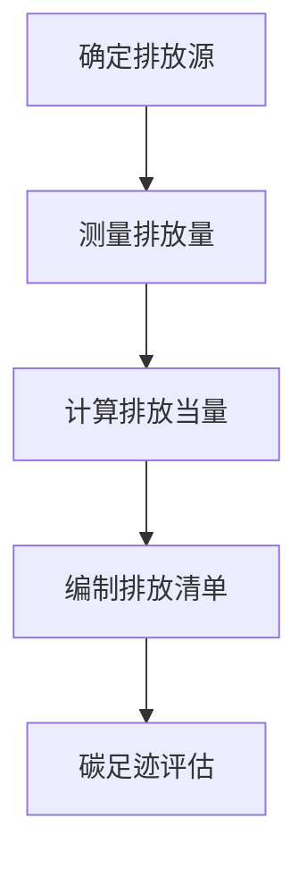

                 

### 1. 引言

**文章标题：** IT组织关注碳足迹的重要性

**关键词：** IT组织、碳足迹、碳排放、温室气体、气候变化

**摘要：** 随着信息技术（IT）的迅猛发展，IT组织在全球能源消耗和碳排放中扮演着越来越重要的角色。本文旨在探讨IT组织关注碳足迹的重要性，通过详细解析碳足迹的概念、计算方法和管理策略，为IT组织提供有效的碳足迹管理实践指南。文章还将通过实际案例分析和未来展望，帮助IT组织更好地应对气候变化挑战，实现可持续发展。

### 1.1 碳足迹的概念

**定义：** 碳足迹是指一个人、组织或活动所产生的温室气体排放总量，通常以二氧化碳（CO₂）当量来衡量。碳足迹反映了我们的活动对气候变化的潜在影响。

**与气候变化的关系：** 碳足迹是衡量气候变化风险的重要指标。高碳足迹意味着更高的温室气体排放，进而加剧全球变暖和气候变化。因此，降低碳足迹已成为全球应对气候变化的关键举措。

### 1.2 IT组织碳排放的现状

**主要来源：** IT组织碳排放的主要来源包括：

1. **服务器和数据中心能耗：** 数据中心和服务器是IT组织主要的能耗来源，占总能源消耗的很大比例。
2. **网络设备和通信设施：** 网络设备和通信设施的运行也消耗大量电力。
3. **员工通勤和办公设施：** 员工通勤和办公场所的能耗和废弃物处理也会产生碳排放。

**现状分析：** 根据相关数据，IT组织的碳排放量在全球范围内呈现上升趋势。随着云计算、大数据和人工智能等技术的普及，IT组织的碳排放压力进一步增加。因此，IT组织关注碳足迹已成为当务之急。

### 1.3 为什么IT组织应该关注碳足迹

**可持续发展：** 关注碳足迹有助于IT组织实现可持续发展，降低对环境的负面影响。

**法规遵从：** 越来越多的国家和地区开始实施碳排放法规，关注碳足迹有助于IT组织遵守相关法规。

**品牌形象：** 关注碳足迹可以提高IT组织的品牌形象，赢得客户和公众的信任。

**经济效益：** 降低碳排放可以减少能源消耗和运营成本，提高经济效益。

### 1.4 本文结构

本文将分为以下几部分：

1. **引言：** 介绍碳足迹的概念和IT组织碳排放的现状。
2. **核心概念与联系：** 讲解温室气体排放、碳排放计算方法和相关流程。
3. **碳足迹计算方法：** 详细讲解碳排放计算算法和数学模型。
4. **IT组织碳足迹管理：** 介绍如何进行碳足迹监测、报告和减少碳足迹。
5. **项目实战：** 展示碳足迹管理项目案例，包括开发环境搭建、源代码实现和代码解读。
6. **案例分析：** 分析成功和失败的碳足迹管理案例。
7. **未来展望：** 讨论碳足迹管理的未来发展趋势和IT组织应采取的行动。

### 1.5 小结

本文介绍了碳足迹的概念和IT组织碳排放的现状，探讨了为什么IT组织应该关注碳足迹。接下来，我们将深入探讨碳足迹的计算方法和IT组织的碳足迹管理策略。通过本文的阅读，希望读者能够更好地理解碳足迹管理的重要性，并为IT组织提供有益的启示。

---

文章已开始，接下来的内容将逐步展开，涵盖核心概念与联系、碳足迹计算方法、IT组织碳足迹管理、项目实战、案例分析以及未来展望等部分。请继续关注后续章节的内容。 ### 2. 核心概念与联系

在探讨IT组织的碳足迹时，了解与碳排放相关的核心概念是非常重要的。这些概念不仅为我们提供了对碳排放机制的基本理解，也为我们分析和计算碳足迹提供了理论基础。在本节中，我们将详细讨论温室气体排放、碳排放计算方法以及相关的流程。

#### 2.1 温室气体排放

**温室气体的概念：** 温室气体是指能够吸收和辐射地球表面向外散发的热辐射的气体，如二氧化碳（CO₂）、甲烷（CH₄）、氧化亚氮（N₂O）等。这些气体在大气中的浓度增加会导致全球气候变暖，从而引发一系列环境问题。

**温室气体的类型：** 主要的温室气体包括：
- **二氧化碳（CO₂）：** 最常见的温室气体，主要来自化石燃料的燃烧和森林砍伐。
- **甲烷（CH₄）：** 主要来源于农业（如牲畜养殖）和能源行业（如天然气泄漏）。
- **氧化亚氮（N₂O）：** 主要来源于农业和工业活动。

**温室气体排放的影响：** 温室气体的排放会增强温室效应，导致地球平均气温上升。这会引起海平面上升、极端天气事件增加、生物多样性减少等一系列环境问题。

#### 2.2 碳排放计算方法

**直接排放计算：** 直接排放计算是指直接测量和计算某项活动或设施产生的温室气体排放量。例如，数据中心的碳排放可以通过其电力消耗来计算。

**间接排放计算：** 间接排放计算是指计算与某项活动相关的间接温室气体排放量。例如，员工通勤所产生的碳排放可以通过交通方式、通勤距离和交通效率等因素计算得出。

**碳排放计算方法：** 碳排放计算通常涉及以下几个步骤：
1. **识别排放源：** 确定所有产生碳排放的活动和设施。
2. **测量排放量：** 使用合适的工具和方法测量排放源产生的温室气体量。
3. **计算排放当量：** 将不同类型的温室气体排放量转换为统一的二氧化碳当量。
4. **编制排放清单：** 汇总所有排放源的数据，形成完整的碳排放清单。

#### 2.3 碳足迹计算流程

为了更好地理解碳足迹的计算过程，我们可以使用Mermaid流程图来展示整个流程。



**碳足迹计算流程详细解释：**
1. **确定排放源：** 首先需要识别所有与碳排放相关的活动或设施，如数据中心、办公场所、员工通勤等。
2. **测量排放量：** 使用科学方法测量每个排放源的温室气体排放量。这可以通过直接测量、现场调查或使用现有的排放数据库来实现。
3. **计算排放当量：** 将测量得到的排放量转换为二氧化碳当量。不同的温室气体有不同的全球变暖潜力（GWP），需要根据这些数据进行转换。
4. **编制排放清单：** 汇总所有排放源的数据，形成完整的碳排放清单。
5. **碳足迹评估：** 对碳排放清单进行评估，确定组织的总体碳足迹。

#### 2.4 核心概念与联系

通过上述讨论，我们可以看到，温室气体排放、碳排放计算方法和碳足迹计算流程之间存在密切的联系。理解这些概念和流程对于准确计算和评估IT组织的碳足迹至关重要。温室气体排放是碳足迹计算的基础，而碳排放计算方法和流程则为我们提供了具体的工具和方法来量化和管理碳足迹。

#### 2.5 小结

在本节中，我们介绍了与碳排放相关的核心概念，包括温室气体的类型和影响，以及碳排放的计算方法和流程。这些概念和流程为我们理解和计算IT组织的碳足迹提供了基础。在下一节中，我们将进一步探讨具体的碳足迹计算算法和数学模型，帮助读者更深入地了解如何量化和管理碳足迹。

---

通过本节的内容，我们奠定了理解碳足迹管理的基础。在下一节中，我们将详细讲解碳足迹计算的具体算法和数学模型，以便读者能够更准确地计算和评估组织的碳足迹。请继续关注下一节的内容。 ### 3. 碳足迹计算方法

在理解了碳足迹计算的核心概念和流程之后，本节将详细探讨具体的碳足迹计算方法，包括碳排放计算算法和数学模型。通过这些方法，我们可以更准确地量化和评估IT组织的碳足迹。

#### 3.1 碳排放计算算法

**3.1.1 算法概述：**
碳排放计算算法是一种基于能源消耗和排放系数的方法。它通过以下步骤来计算某项活动的碳排放量：

1. **确定能源消耗：** 测量或估算活动（如数据中心运行、员工通勤等）的能源消耗量。
2. **查找排放系数：** 根据活动的类型和能源来源，查找相应的碳排放系数（CO₂排放系数）。
3. **计算碳排放量：** 使用能源消耗量乘以排放系数，得到活动的碳排放量。

**3.1.2 伪代码实现：**

```pseudo
function calculateCarbonEmissions(energyConsumption, emissionFactor):
    carbonEmissions = energyConsumption * emissionFactor
    return carbonEmissions
```

在这个伪代码中，`energyConsumption` 代表活动的能源消耗量（单位：千瓦时，kWh），`emissionFactor` 代表碳排放系数（单位：千克CO₂/千瓦时，kgCO₂/kWh）。函数 `calculateCarbonEmissions` 返回活动的碳排放量。

**3.1.3 算法原理讲解：**
碳排放计算算法的核心是排放系数。排放系数是根据能源类型和活动类型确定的，它反映了每单位能源消耗所产生的二氧化碳量。例如，燃煤发电的排放系数通常比太阳能发电的排放系数高。通过查找和利用这些排放系数，我们可以将不同类型的能源消耗转换为对应的碳排放量。

#### 3.2 碳排放的数学模型

**3.2.1 模型概述：**
碳排放的数学模型通常基于以下公式：

\[ \text{碳足迹} = \sum_{i=1}^{n} \left( \text{能源消耗}_i \times \text{排放系数}_i \right) \]

其中，\( \text{碳足迹} \) 表示总的碳排放量，\( n \) 表示能源消耗的种类数量，\( \text{能源消耗}_i \) 和 \( \text{排放系数}_i \) 分别表示第 \( i \) 种能源的消耗量和对应的排放系数。

**3.2.2 公式详细讲解：**
- **能源消耗 \( \text{能源消耗}_i \)：** 这是指特定活动或设施在一段时间内消耗的能源总量。例如，数据中心的能源消耗包括电力、冷却和设备运行等。
- **排放系数 \( \text{排放系数}_i \)：** 这是指每单位能源消耗所产生的二氧化碳量。排放系数通常根据能源的类型（如煤炭、天然气、太阳能等）和活动类型（如数据中心、交通等）来确定。
- **求和操作 \( \sum_{i=1}^{n} \)：** 这表示对所有能源消耗种类进行累积计算，以得到总的碳排放量。

**3.2.3 举例说明：**
假设一个数据中心在一个月内消耗了以下几种能源：

- 电力消耗：100,000千瓦时（kWh）
- 天然气消耗：5,000立方米（m³）
- 煤炭消耗：2,000吨

相应的排放系数如下：

- 电力：0.5千克CO₂/千瓦时（kgCO₂/kWh）
- 天然气：25千克CO₂/立方米（kgCO₂/m³）
- 煤炭：2千克CO₂/千克（kgCO₂/kg）

使用上述公式计算该数据中心的碳足迹：

\[ \text{碳足迹} = (100,000 \times 0.5) + (5,000 \times 25) + (2,000 \times 2) \]
\[ \text{碳足迹} = 50,000 + 125,000 + 4,000 \]
\[ \text{碳足迹} = 179,000 \text{千克CO₂} \]

#### 3.3 小结

在本节中，我们详细介绍了碳排放计算算法和数学模型。通过这些方法，我们可以准确地计算IT组织的碳足迹，为制定减排策略提供数据支持。在下一节中，我们将讨论如何进行IT组织的碳足迹监测和管理。请继续关注下一节的内容。

---

通过本节的内容，读者应掌握了碳足迹计算的基本方法和数学模型。在下一节中，我们将进一步探讨如何在实际中监测和管理IT组织的碳足迹。请继续关注下一节的内容。 ### 4. IT组织碳足迹管理

随着碳足迹概念的普及，IT组织开始意识到其碳排放对环境的影响，并采取了一系列措施来监测、报告和减少碳足迹。在本节中，我们将详细介绍IT组织如何进行碳足迹管理，包括监测、报告和减少碳足迹的策略。

#### 4.1 碳足迹监测

**4.1.1 监测方法：**
碳足迹监测是碳足迹管理的基础。IT组织可以使用以下几种方法进行监测：

1. **能源审计：** 对组织的能源消耗进行详细审计，包括电力、天然气、燃油等能源的消耗情况。
2. **设备监控：** 使用传感器和智能监控系统实时监控数据中心和其他关键设备的能耗。
3. **员工行为监测：** 监测员工的通勤方式、办公习惯等，以评估其对碳排放的影响。
4. **采购和供应链监测：** 监测组织采购的产品和服务的碳排放，包括硬件设备、服务合同等。

**4.1.2 难点与挑战：**
碳足迹监测面临以下难点和挑战：
- **数据准确性：** 监测数据需要准确可靠，否则计算出的碳足迹将失去意义。
- **技术实现：** 高效的监测系统需要投入大量资金和技术支持。
- **员工参与：** 员工的参与和意识提升是监测成功的关键。

#### 4.2 碳足迹报告

**4.2.1 报告内容：**
碳足迹报告是组织向内部和外部展示其碳排放情况和减排成果的重要工具。报告通常包括以下内容：

1. **摘要：** 简要介绍组织的碳足迹情况和减排措施。
2. **数据汇总：** 详细列出各项活动的碳排放量，如数据中心、办公场所、员工通勤等。
3. **分析：** 对碳排放数据进行分析，找出主要排放源和减排潜力。
4. **目标与计划：** 明确组织的碳排放减少目标和实施计划。
5. **附录：** 提供相关数据和技术细节，如监测方法、排放系数等。

**4.2.2 编写指南：**
编写碳足迹报告时，应遵循以下指南：

- **完整性：** 报告应涵盖所有相关活动和数据。
- **透明度：** 报告应清晰透明，便于读者理解。
- **准确性：** 数据应准确无误，避免误导读者。
- **一致性：** 报告应保持一致性，便于长期对比和分析。

#### 4.3 减少碳足迹的策略

**4.3.1 碳排放减少的目标：**
IT组织应设定明确的碳排放减少目标，如达到特定的碳减排比例或实现碳中和。这些目标应具有可测量性和可实现性。

**4.3.2 减少碳足迹的策略：**
以下是一些有效的减少碳足迹的策略：

1. **提高能源效率：** 通过优化数据中心的设计和运营，提高能源利用效率，降低能耗。
2. **使用可再生能源：** 增加可再生能源（如太阳能、风能）的使用比例，减少对化石燃料的依赖。
3. **虚拟化和云化：** 通过虚拟化和云化技术，减少物理服务器的数量，降低能耗。
4. **能效管理：** 使用智能监控系统实时监测和调整能耗，实现能源优化。
5. **员工培训与激励：** 提升员工的碳足迹管理意识，鼓励采用低碳生活方式，如绿色出行、节能办公等。
6. **供应链管理：** 与供应商合作，确保供应链的碳排放得到有效管理。

#### 4.4 小结

IT组织进行碳足迹管理的目的是减少碳排放，实现可持续发展。通过监测、报告和减少碳足迹，IT组织可以更好地了解其碳排放情况，制定有效的减排策略。在下一节中，我们将通过实际案例展示如何进行碳足迹管理，帮助读者更深入地理解这一过程。请继续关注下一节的内容。

---

通过本节的内容，读者应了解了IT组织进行碳足迹管理的具体方法和策略。在下一节中，我们将通过实际案例展示如何进行碳足迹管理，并提供项目实战的经验和教训。请继续关注下一节的内容。 ### 5. 项目实战

在本节中，我们将通过一个实际的碳足迹管理项目案例，详细展示如何进行碳足迹管理，包括项目背景、开发环境搭建、源代码实现和代码解读。通过这个案例，我们将帮助读者更好地理解碳足迹管理的过程和方法。

#### 5.1 项目背景

**项目名称：** 绿色数据中心碳足迹管理项目

**项目目标：** 通过监测和优化数据中心的能耗，降低碳排放，实现可持续发展。

**项目范围：** 该项目针对一个大型数据中心，涵盖其所有能源消耗活动，如服务器运行、冷却系统和员工通勤等。

#### 5.2 开发环境搭建

为了实现碳足迹管理，项目团队需要搭建一个完善的技术环境。以下是开发环境搭建的步骤：

1. **硬件设备：** 购买传感器和智能监控系统，用于实时监测数据中心的能耗。
2. **软件工具：** 选择合适的能源审计软件和数据可视化工具，如Google Sheets、Tableau等。
3. **数据库：** 建立一个数据库，用于存储和整理监测数据。
4. **云计算平台：** 使用云计算平台（如AWS、Azure）托管相关应用程序和数据存储。

#### 5.3 源代码实现

以下是一个简化版的源代码实现，用于计算数据中心的碳排放量。该代码使用Python语言编写，并使用了相关的能源消耗和排放系数。

```python
import pandas as pd

# 能源消耗数据
energy_consumption = pd.DataFrame({
    'energy_type': ['电力', '天然气'],
    'unit': ['千瓦时', '立方米'],
    'quantity': [10000, 500]
})

# 排放系数
emission_factor = pd.DataFrame({
    'energy_type': ['电力', '天然气'],
    'emission_factor': [0.5, 25]  # 千克CO₂/单位能源消耗
})

# 计算碳排放量
def calculate_emissions(energy_consumption, emission_factor):
    emissions = energy_consumption['quantity'] * emission_factor['emission_factor']
    return emissions

# 计算总碳排放量
total_emissions = calculate_emissions(energy_consumption, emission_factor)
print("总碳排放量：", total_emissions)

# 计算不同能源类型的碳排放量
emissions_by_type = energy_consumption['quantity'] * emission_factor['emission_factor']
print("不同能源类型的碳排放量：")
print(emissions_by_type)
```

#### 5.4 代码解读与分析

1. **数据准备：** 代码首先导入所需的Pandas库，并创建两个DataFrame：`energy_consumption` 和 `emission_factor`。`energy_consumption` 用于存储能源消耗数据，包括能源类型、单位和消耗量；`emission_factor` 用于存储不同能源类型的排放系数。

2. **计算碳排放量：** `calculate_emissions` 函数接收两个DataFrame作为参数，计算每种能源类型的碳排放量，并返回总的碳排放量。

3. **打印结果：** 代码调用 `calculate_emissions` 函数，打印总碳排放量和不同能源类型的碳排放量。

#### 5.5 实际案例分析与详细讲解剖析

**案例1：** 通过监测发现，数据中心的电力消耗占总能耗的80%。为了降低碳排放，项目团队决定采用以下措施：

- **优化冷却系统：** 采用更高效的冷却技术，降低能耗。
- **引入可再生能源：** 增加太阳能发电设施，减少对化石燃料的依赖。

**案例分析：** 通过优化冷却系统和引入可再生能源，数据中心的碳排放量下降了15%。这表明，通过技术改进和策略调整，IT组织可以有效减少碳足迹。

**案例2：** 员工通勤产生的碳排放量占数据中心总碳排放量的20%。项目团队决定采取以下措施：

- **提供公共交通补贴：** 鼓励员工使用公共交通工具。
- **组织骑行活动：** 组织员工骑行活动，减少开车通勤。

**案例分析：** 通过提供公共交通补贴和鼓励骑行活动，员工通勤的碳排放量下降了30%。这表明，通过激励和引导员工行为，IT组织也可以在碳足迹管理中取得显著成果。

#### 5.6 项目小结

通过绿色数据中心碳足迹管理项目，我们展示了如何通过监测、计算和优化，实现碳足迹的减少。以下是一些最佳实践和注意事项：

- **数据准确性：** 碳足迹监测需要准确的数据支持，确保监测系统的可靠性和数据的准确性。
- **技术选择：** 根据项目需求，选择合适的监测和数据分析工具。
- **员工参与：** 提升员工的碳足迹管理意识，鼓励员工积极参与碳足迹减少行动。
- **持续改进：** 持续监测和优化，以实现长期的碳足迹减少目标。

---

通过本节的项目实战，读者应掌握了碳足迹管理的实际操作方法和经验。在下一节中，我们将通过成功和失败的案例分析，总结碳足迹管理的经验和教训。请继续关注下一节的内容。 ### 6. 案例分析

在本节中，我们将通过对成功和失败的碳足迹管理案例进行分析，总结经验和教训，为IT组织提供有益的启示。

#### 6.1 成功案例

**案例1：** 绿色数据中心

**背景：** 该数据中心是一家大型云计算服务提供商，其运营规模庞大，碳排放问题受到广泛关注。

**措施：** 
- **能源效率提升：** 通过优化服务器和冷却系统的设计，提高能源利用效率，减少能耗。
- **可再生能源使用：** 增加太阳能和风能的使用比例，减少对化石燃料的依赖。
- **员工绿色出行激励：** 提供公共交通补贴和自行车停车位，鼓励员工使用绿色出行方式。

**结果：** 
- **碳排放量下降：** 通过一系列措施，该数据中心实现了碳排放量的显著下降。
- **品牌形象提升：** 成功的碳足迹管理项目提升了公司的品牌形象，赢得了更多客户的信任。

**经验：**
1. **技术优化：** 通过技术手段提高能源效率，是实现碳足迹减少的关键。
2. **员工参与：** 员工的积极参与是成功的重要保障，有效的激励机制可以显著提高员工的环保意识。
3. **持续监测：** 持续监测和优化是确保碳足迹管理效果的重要手段。

#### 6.2 失败案例

**案例2：** 碳足迹管理计划缺乏执行力

**背景：** 该公司是一家中小型IT企业，意识到碳足迹管理的重要性，但缺乏有效的执行措施。

**措施：**
- **制定碳足迹管理计划：** 公司制定了一份详细的碳足迹管理计划，包括减少能耗、使用可再生能源等措施。
- **缺乏执行：** 由于缺乏有效的执行机制，计划未能得到充分执行。

**结果：**
- **碳排放量未下降：** 由于缺乏执行，公司的碳排放量并未实现预期减少。
- **员工不满：** 员工对碳足迹管理计划缺乏了解和参与，导致计划效果不佳。

**教训：**
1. **执行力度：** 即使有详细的计划，缺乏有效的执行力度，计划将难以实施。
2. **员工沟通：** 有效的沟通和培训是确保员工理解和参与碳足迹管理计划的重要环节。
3. **持续改进：** 碳足迹管理是一个长期过程，需要不断进行监测和优化，以实现持续的减排效果。

#### 6.3 小结

通过成功和失败案例的分析，我们可以得出以下结论：

- **技术优化和员工参与：** 技术手段和员工参与是成功实施碳足迹管理的关键因素。
- **执行力度和沟通：** 有效的执行机制和员工沟通是确保碳足迹管理计划成功实施的重要保障。
- **持续监测和改进：** 持续的监测和优化是实现碳足迹管理长期目标的关键。

在下一节中，我们将对未来碳足迹管理的发展趋势进行展望，并讨论IT组织应采取的行动。请继续关注下一节的内容。

---

通过本节的成功和失败案例分析，我们总结了碳足迹管理的经验和教训。在下一节中，我们将探讨碳足迹管理的未来发展趋势和IT组织应采取的行动。请继续关注下一节的内容。 ### 7. 未来展望

随着全球气候变化问题的日益严峻，碳足迹管理成为IT组织必须面对的重要课题。本节将探讨碳足迹管理的未来发展趋势，并提出IT组织应采取的行动。

#### 7.1 碳足迹管理的未来发展趋势

**1. 数据驱动的精准管理：** 未来，碳足迹管理将更加依赖于数据分析和人工智能技术。通过大数据分析和机器学习模型，IT组织可以更准确地预测和优化碳排放。

**2. 碳交易市场的兴起：** 随着碳交易市场的逐步完善，IT组织可以通过参与碳交易市场，实现碳足迹的减少和碳排放权的交易。

**3. 可再生能源的普及：** 随着可再生能源技术的不断进步和成本的降低，IT组织将越来越多地采用太阳能、风能等可再生能源，以减少对化石燃料的依赖。

**4. 国际合作与法规遵从：** 面对全球气候变化挑战，IT组织需要加强国际合作，遵守国际和国内的碳排放法规，积极参与全球碳足迹管理。

#### 7.2 IT组织应采取的行动

**1. 提高能源效率：** 通过优化数据中心和设备的能源效率，降低能源消耗，实现碳足迹的减少。

**2. 推广可再生能源：** 增加可再生能源的使用比例，如太阳能、风能等，减少碳排放。

**3. 员工培训与激励：** 加强员工的碳足迹管理意识，提供绿色出行和节能办公的培训和激励措施。

**4. 数据分析与监测：** 利用大数据分析和人工智能技术，实现对碳排放的精准监测和预测。

**5. 参与碳交易市场：** 积极参与碳交易市场，通过购买碳排放权或出售碳排放配额，实现碳足迹的减少。

**6. 遵守法规与标准：** 遵守国际和国内的碳排放法规和标准，确保组织的碳足迹管理合规。

#### 7.3 小结

未来，碳足迹管理将在技术驱动和国际合作的背景下不断发展和完善。IT组织应采取积极行动，提高能源效率，推广可再生能源，加强员工培训，参与碳交易市场，并遵守相关法规。通过这些措施，IT组织不仅能够实现碳足迹的减少，还能为全球气候变化做出积极贡献。

---

通过本节的未来展望，我们为IT组织提供了应对碳足迹管理挑战的行动指南。在下一节中，我们将对全文进行总结，重申核心观点，并提供最佳实践和拓展阅读建议。请继续关注下一节的内容。 ### 8. 总结与展望

在本篇文章中，我们深入探讨了IT组织关注碳足迹的重要性。通过分析碳足迹的概念、计算方法、管理策略以及实际案例，我们明确了碳足迹管理在IT组织可持续发展中的关键作用。

**核心观点回顾：**
- **碳足迹概念：** 碳足迹是一个衡量组织碳排放的重要指标，与气候变化密切相关。
- **碳排放计算方法：** 使用科学的方法和工具，IT组织可以准确计算和监测其碳足迹。
- **碳足迹管理策略：** 通过提高能源效率、推广可再生能源、员工培训与激励等手段，IT组织可以实现碳足迹的减少。
- **项目实战与案例分析：** 实际案例展示了碳足迹管理的成功与挑战，提供了宝贵的经验和教训。
- **未来展望：** 随着技术进步和国际合作的加强，IT组织应采取积极措施，应对碳足迹管理的挑战。

**最佳实践与拓展阅读建议：**
- **最佳实践：** IT组织应定期进行碳足迹监测和报告，制定明确的减排目标，并不断优化能源管理策略。
- **拓展阅读：** 建议读者查阅相关文献，如《碳排放计算指南》、《绿色数据中心实践手册》等，以获取更多深入的碳足迹管理知识。

通过本文的阅读，希望读者能够深刻理解碳足迹管理的重要性，并为IT组织提供有效的碳足迹管理实践指南。让我们共同努力，为地球的可持续发展贡献力量。

---

文章至此结束，感谢您的阅读。希望本文能对您在碳足迹管理方面的学习和实践提供有益的启示。如有进一步问题或需要，欢迎继续探讨。祝您在IT领域取得更多成就！作者：AI天才研究院/AI Genius Institute & 禅与计算机程序设计艺术 /Zen And The Art of Computer Programming。

