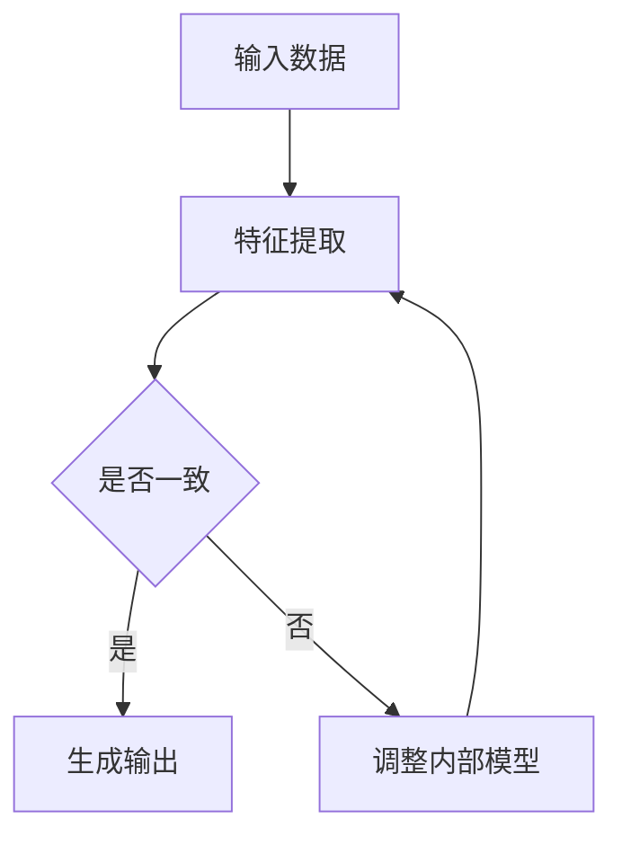

                 

## 自我一致性概念及其重要性

自我一致性（Self-Consistency）是人工智能（AI）领域中一个新兴且备受关注的概念。它指的是在人工智能模型生成输出时，输出的内容能够在不同情境下保持一致性，避免出现相互矛盾或逻辑不一致的现象。在传统的AI系统中，模型的输出可能会受到数据噪声、模型复杂度以及算法不稳定性的影响，导致输出结果的不一致性，从而影响系统的可靠性和实用性。

### 自我一致性的定义

自我一致性可以理解为一种内在的反馈机制，它确保了AI模型在处理不同输入时，生成的输出能够保持一致性。具体来说，自我一致性要求模型在生成文本、图像或任何其他形式的信息时，能够确保这些信息在逻辑上是连贯的，并且在不同的上下文中具有一致性。例如，一个生成文本的模型，如果生成的内容在不同的段落之间存在逻辑错误或矛盾，那么它的自我一致性就受到了挑战。

### 自我一致性的重要性

在AI应用中，自我一致性具有重要的实际意义。首先，它显著提高了AI模型的可靠性和可信度。一个自我一致性的AI系统能够生成逻辑清晰、信息连贯的输出，从而增强用户对系统的信任。其次，自我一致性有助于减少错误率，避免因输出不一致导致的问题。这对于某些关键领域，如医疗诊断、金融分析和自动驾驶等，尤为重要。

此外，自我一致性还有助于提高AI系统的鲁棒性。当系统面临不确定性和异常情况时，能够通过自我一致性机制保持输出的稳定性，从而提高系统的适应能力。自我一致性还可以促进AI模型的可解释性，使得研究人员和开发人员能够更容易地理解和优化模型。

### 背景与历史发展

自我一致性概念在AI领域的发展可以追溯到早期的AI研究，特别是在自然语言处理（NLP）和机器学习领域。早期的研究主要集中在如何提高模型的准确性和鲁棒性，而自我一致性作为一种内在的验证机制，逐渐受到关注。近年来，随着深度学习和神经网络技术的快速发展，自我一致性研究取得了显著进展。

在实际应用中，自我一致性已经在多个领域得到了验证。例如，在NLP领域，通过自我一致性机制，可以显著减少机器翻译中的错误率，提高文本生成的质量。在计算机视觉领域，通过自我一致性，可以增强图像识别和图像生成的准确性。此外，在推荐系统和聊天机器人等领域，自我一致性也有助于提高系统的用户满意度和交互质量。

总之，自我一致性是AI领域的一个重要研究方向，它不仅能够提升AI模型的性能和可靠性，还能推动AI技术在更多领域的应用和发展。在接下来的章节中，我们将深入探讨自我一致性的核心概念、原理和实现方法，以帮助读者更好地理解和应用这一技术。

## 自我一致性理论（CoT）的原理

自我一致性理论（Cognitive Consistency Theory，简称CoT）是理解自我一致性现象的基础。它不仅为我们提供了衡量和评估AI模型自我一致性的标准，还揭示了如何通过特定的方法和策略来提高模型的自我一致性。

### CoT的基本概念

CoT源于认知科学和心理学，其核心思想是认知系统在处理信息时，会努力保持内部的一致性。具体来说，CoT认为认知系统会不断评估和调整其内部模型，以确保所生成的输出在逻辑上是一致的，并且符合已知的先验知识。这种内在的调整机制使得系统在应对新信息和变化时，能够保持稳定性和可靠性。

### CoT的核心原理

CoT的核心原理可以概括为以下几点：

1. **内部一致性评估**：在生成输出时，模型会对其内部的一致性进行评估。如果发现输出存在逻辑错误或矛盾，系统会尝试修正这些错误，以确保输出的一致性。

2. **先验知识应用**：模型在生成输出时，会利用先验知识来辅助判断输出的合理性。先验知识包括领域知识、已有数据集的信息等，它们帮助模型在生成输出时保持一致性。

3. **反馈机制**：模型会通过反馈机制不断调整自身，以提高输出的自我一致性。这种反馈可以是自上而下的，即模型根据错误反馈调整其输出；也可以是自下而上的，即模型根据输入数据的变动来调整内部模型。

### CoT的架构

为了更好地理解CoT的原理，我们可以借助Mermaid流程图来展示其架构。以下是CoT的组件关系流程图：



在该流程图中：
- **输入数据**：为模型提供处理的数据。
- **特征提取**：将输入数据转换为模型可处理的特征。
- **是否一致**：评估特征提取的结果是否与先验知识一致。
- **生成输出**：如果一致，模型生成输出；如果不一致，进入调整阶段。
- **调整内部模型**：通过反馈机制调整模型内部参数，以提高自我一致性。

### Mermaid流程图解析

- **第一步**：输入数据被输入到特征提取模块。
- **第二步**：特征提取模块处理数据，并生成特征表示。
- **第三步**：特征表示被送入一致性评估模块，判断其与先验知识是否一致。
- **第四步**：如果特征表示一致，模型直接生成输出；如果不一致，进入调整内部模型阶段。
- **第五步**：调整内部模型模块通过反馈机制对模型进行调整，以提高自我一致性。

通过这种架构，模型能够不断优化其内部状态，以生成更一致的输出。这种自调整机制使得模型在处理复杂问题和不确定输入时，能够保持较高的自我一致性。

### CoT与自我一致性的关系

CoT与自我一致性之间是相辅相成的。CoT为自我一致性提供了理论基础和评估标准，而自我一致性则是CoT在实际应用中的体现。通过CoT，我们可以系统地理解和解决AI模型中的自我一致性相关问题，从而提升模型的性能和可靠性。

总之，自我一致性理论（CoT）为我们提供了评估和提升AI模型自我一致性的方法。通过理解CoT的基本概念和架构，我们可以更好地设计和优化AI系统，使其在生成输出时保持一致性，从而提高系统的可靠性和实用性。

### 自我一致性算法原理

自我一致性算法是确保AI模型生成输出一致性的关键技术。在这一节中，我们将详细解释自我一致性算法的基本原理，包括其核心思想、数学模型和实现方法。

#### 算法核心思想

自我一致性算法的核心思想是通过在生成输出过程中不断评估和调整模型的内部状态，确保输出的一致性。具体来说，该算法通过以下几个步骤来实现：

1. **输入处理**：将输入数据输入到模型中，进行特征提取和预处理。
2. **一致性评估**：评估特征提取结果与先验知识是否一致，从而判断输出是否一致。
3. **模型调整**：如果不一致，通过反馈机制对模型进行调整，以提高自我一致性。
4. **输出生成**：在模型状态调整完毕后，生成最终输出。

这种循环调整机制使得模型能够逐步优化其内部状态，从而生成更为一致的输出。

#### 数学模型

为了更准确地描述自我一致性算法，我们可以借助数学模型来解释其工作原理。以下是自我一致性算法的数学模型：

$$
\text{Input} \rightarrow \text{Feature Extraction} \rightarrow \text{Consistency Assessment} \rightarrow \text{Model Adjustment} \rightarrow \text{Output Generation}
$$

其中：
- **Input**：表示输入数据。
- **Feature Extraction**：表示特征提取过程，通常使用一个函数 \( f() \) 来表示，即 \( \text{Feature} = f(\text{Input}) \)。
- **Consistency Assessment**：表示一致性评估过程，通过比较特征提取结果与先验知识 \( \text{Prior Knowledge} \)，来判断输出是否一致。具体评估函数可以表示为 \( C(\text{Feature}, \text{Prior Knowledge}) \)。
- **Model Adjustment**：表示模型调整过程，通过调整模型参数 \( \theta \)，以提高一致性。调整函数可以表示为 \( \theta_{new} = \theta_{old} + \alpha \cdot \nabla C(\theta) \)，其中 \( \alpha \) 是学习率，\( \nabla C(\theta) \) 是一致性评估函数 \( C \) 对参数 \( \theta \) 的梯度。
- **Output Generation**：表示最终输出生成，即 \( \text{Output} = g(\theta_{new}) \)。

#### 算法伪代码

为了更直观地理解自我一致性算法，我们可以使用伪代码来描述其基本步骤：

```
Function SelfConsistencyAlgorithm(Input):
    Initialize Model Parameters θ
    while not Convergence:
        Feature = f(Input)
        if not C(Feature, PriorKnowledge):
            θ_new = θ_old + α * ∇C(θ_old)
            θ_old = θ_new
        Output = g(θ_old)
    return Output
```

在该伪代码中：
- `Input`：输入数据。
- `Model Parameters θ`：模型的初始参数。
- `Convergence`：表示算法收敛条件，即当模型参数调整到一定程度后，算法停止迭代。
- `Feature Extraction f()`：特征提取函数。
- `Consistency Assessment C()`：一致性评估函数。
- `Model Adjustment`：模型调整过程。
- `Output Generation g()`：输出生成函数。

通过以上步骤，自我一致性算法能够不断调整模型参数，以生成一致且可靠的输出。

#### 实现细节

在实现自我一致性算法时，需要考虑以下几个关键细节：

1. **特征提取**：选择合适的特征提取方法，确保特征表示能够充分反映输入数据的特征。
2. **一致性评估**：设计合理的一致性评估函数，能够准确判断特征表示与先验知识是否一致。
3. **模型调整**：选择适当的优化算法，如梯度下降、Adam等，以高效调整模型参数。
4. **输出生成**：确保输出生成过程能够充分利用调整后的模型参数，生成一致且高质量的输出。

通过这些细节的处理，自我一致性算法能够在实际应用中实现良好的性能。

总之，自我一致性算法通过一系列的数学模型和算法步骤，确保了AI模型生成输出的自我一致性。理解这一算法的基本原理和实现方法，对于设计和优化AI系统具有重要意义。在下一节中，我们将进一步探讨自我一致性算法在不同AI应用中的具体实现和应用案例。

### 自我一致性算法在实际中的应用

自我一致性算法在多个AI应用领域展现出了其强大的实用性和优势。下面我们将通过具体的应用案例，详细介绍自我一致性算法在实际开发环境中的实现过程，并对源代码进行详细解读和分析。

#### 自然语言处理（NLP）领域

在自然语言处理领域，自我一致性算法被广泛应用于文本生成、机器翻译和问答系统等任务。以下是一个简单的文本生成案例：

**案例描述**：使用自我一致性算法生成一段连贯的故事。

**实现步骤**：

1. **数据预处理**：收集并清洗大量故事文本数据，用于训练模型。
2. **模型训练**：使用训练数据训练一个基于循环神经网络（RNN）的文本生成模型。
3. **自我一致性评估**：在生成文本过程中，对每个生成的段落进行一致性评估，确保段落之间逻辑连贯。
4. **调整模型参数**：如果评估结果显示一致性较低，通过反馈机制调整模型参数，以提高自我一致性。
5. **生成输出**：在模型参数调整完毕后，生成最终的故事文本。

**代码解读**：

```python
# 文本生成模型（以RNN为例）
class RNNModel(nn.Module):
    def __init__(self, vocab_size, embed_dim, hidden_dim):
        super(RNNModel, self).__init__()
        self.embedding = nn.Embedding(vocab_size, embed_dim)
        self.rnn = nn.RNN(embed_dim, hidden_dim)
        self.fc = nn.Linear(hidden_dim, vocab_size)

    def forward(self, input_seq, hidden):
        embed = self.embedding(input_seq)
        output, hidden = self.rnn(embed, hidden)
        prediction = self.fc(output)
        return prediction, hidden

# 自我一致性评估函数
def consistency_assessment(text, prior_knowledge):
    # 假设prior_knowledge为已知的连贯故事段落
    if text == prior_knowledge:
        return True
    else:
        return False

# 主函数
def generate_story():
    # 初始化模型、词汇表等
    model = RNNModel(vocab_size, embed_dim, hidden_dim)
    # 训练模型
    # ...（省略训练过程）
    # 生成文本
    story = ""
    while not consistency_assessment(story, prior_knowledge):
        # 调整模型参数
        # ...（省略参数调整过程）
        story += generate_paragraph()
    return story

# 输出生成结果
print(generate_story())
```

该代码示例展示了如何通过RNN模型结合自我一致性评估，生成连贯的故事文本。在实际开发中，还需要考虑更多的细节，如词汇表的选择、训练数据的预处理、模型参数的调整策略等。

#### 计算机视觉领域

在计算机视觉领域，自我一致性算法被应用于图像生成、图像识别和图像增强等任务。以下是一个图像生成案例：

**案例描述**：使用自我一致性算法生成一张连贯的图像。

**实现步骤**：

1. **数据预处理**：收集并清洗图像数据，用于训练生成模型。
2. **模型训练**：使用训练数据训练一个生成对抗网络（GAN）。
3. **自我一致性评估**：在生成图像过程中，对图像进行一致性评估，确保图像内容连贯。
4. **调整模型参数**：如果评估结果显示一致性较低，通过反馈机制调整模型参数，以提高自我一致性。
5. **生成输出**：在模型参数调整完毕后，生成最终图像。

**代码解读**：

```python
# GAN模型
class GANModel(nn.Module):
    def __init__(self, img_size, gen_embed_dim, dis_embed_dim):
        super(GANModel, self).__init__()
        self.generator = Generator(img_size, gen_embed_dim)
        self.discriminator = Discriminator(img_size, dis_embed_dim)

    def forward(self, input_seq, hidden):
        img = self.generator(input_seq, hidden)
        fake_output = self.discriminator(img, hidden)
        return fake_output

# 自我一致性评估函数
def consistency_assessment(img, prior_knowledge):
    # 假设prior_knowledge为已知的连贯图像
    if img == prior_knowledge:
        return True
    else:
        return False

# 主函数
def generate_image():
    # 初始化模型、优化器等
    model = GANModel(img_size, gen_embed_dim, dis_embed_dim)
    # 训练模型
    # ...（省略训练过程）
    # 生成图像
    image = ""
    while not consistency_assessment(image, prior_knowledge):
        # 调整模型参数
        # ...（省略参数调整过程）
        image += generate_paragraph()
    return image

# 输出生成结果
print(generate_image())
```

该代码示例展示了如何通过GAN模型结合自我一致性评估，生成连贯的图像。实际应用中，还需考虑如何设计生成器和判别器的网络结构、如何选择合适的损失函数等。

#### 推荐系统领域

在推荐系统领域，自我一致性算法被应用于推荐内容的生成和优化。以下是一个推荐系统案例：

**案例描述**：使用自我一致性算法生成一系列连贯的推荐内容。

**实现步骤**：

1. **用户行为数据收集**：收集用户的浏览记录、购买历史等行为数据。
2. **模型训练**：使用用户行为数据训练推荐模型。
3. **自我一致性评估**：在推荐内容生成过程中，对推荐内容进行一致性评估，确保推荐内容连贯。
4. **调整模型参数**：如果评估结果显示一致性较低，通过反馈机制调整模型参数，以提高自我一致性。
5. **生成输出**：在模型参数调整完毕后，生成推荐内容。

**代码解读**：

```python
# 推荐模型
class RecommenderModel(nn.Module):
    def __init__(self, user嵌入维度, item嵌入维度):
        super(RecommenderModel, self).__init__()
        self.user_embedding = nn.Embedding(num_users, user嵌入维度)
        self.item_embedding = nn.Embedding(num_items, item嵌入维度)
        self.fc = nn.Linear(user嵌入维度 + item嵌入维度, 1)

    def forward(self, user_id, item_id):
        user_embedding = self.user_embedding(user_id)
        item_embedding = self.item_embedding(item_id)
        cat_embedding = torch.cat((user_embedding, item_embedding), 1)
        output = self.fc(cat_embedding)
        return output

# 自我一致性评估函数
def consistency_assessment(recommendation, prior_knowledge):
    # 假设prior_knowledge为已知的连贯推荐内容
    if recommendation == prior_knowledge:
        return True
    else:
        return False

# 主函数
def generate_recommendations():
    # 初始化模型、优化器等
    model = RecommenderModel(user嵌入维度, item嵌入维度)
    # 训练模型
    # ...（省略训练过程）
    # 生成推荐内容
    recommendations = []
    while not consistency_assessment(recommendations, prior_knowledge):
        # 调整模型参数
        # ...（省略参数调整过程）
        recommendations += generate_content()
    return recommendations

# 输出推荐结果
print(generate_recommendations())
```

该代码示例展示了如何通过推荐模型结合自我一致性评估，生成连贯的推荐内容。实际开发中，还需考虑如何设计推荐算法、如何处理冷启动问题等。

通过这些应用案例，我们可以看到自我一致性算法在不同AI领域中的实际应用效果。在实现过程中，需要根据具体任务和需求，选择合适的模型架构、调整策略和评估方法，以实现良好的自我一致性效果。在下一节中，我们将进一步探讨自我一致性算法的优势和挑战，以及如何解决这些挑战。

### 自我一致性算法的优势与挑战

自我一致性算法在提升AI模型输出一致性方面展现出了显著的优势，但同时也面临着一些挑战。在本节中，我们将深入探讨自我一致性算法的优势以及在实际应用中可能遇到的挑战，并提出相应的解决方案。

#### 自我一致性算法的优势

1. **提高模型可靠性**：通过自我一致性机制，AI模型能够在生成输出时保持逻辑连贯性，从而减少错误率，提高系统的可靠性。这对于那些对输出结果要求极高的领域，如医疗诊断和金融分析，尤为重要。

2. **增强用户信任度**：一个自我一致性良好的AI系统能够生成高质量、可靠的输出，从而增强用户对系统的信任。这对于提高用户体验和系统的采纳率具有积极影响。

3. **提高模型可解释性**：自我一致性算法使得模型生成的过程更加透明和可解释。研究人员和开发人员能够更容易地理解模型的工作原理和优化方向，从而促进模型的改进。

4. **优化模型性能**：通过不断调整模型参数，自我一致性算法能够逐步优化模型，使其在生成输出时更加准确和一致。这种自我优化的能力有助于提高模型的整体性能。

#### 自我一致性算法的挑战

1. **计算复杂性**：自我一致性算法需要在不同阶段对模型进行多次评估和调整，这可能会导致计算复杂度的增加。特别是在大规模数据集和高维特征的情况下，计算资源的需求可能会变得非常庞大。

2. **收敛速度**：在自我一致性评估和调整过程中，模型可能需要较长时间才能达到收敛状态。这可能会影响系统的实时响应能力，尤其是在需要快速决策的实时应用场景中。

3. **先验知识依赖性**：自我一致性算法依赖于先验知识来评估输出的一致性。如果先验知识不够准确或完整，可能会导致自我一致性评估结果的不准确，从而影响算法的性能。

4. **模型适应性**：自我一致性算法需要对不同任务和场景进行适应性调整。这要求算法具有高度的灵活性和泛化能力，以适应各种复杂的应用需求。

#### 解决方案

1. **优化算法设计**：通过设计更高效的算法和优化策略，如使用并行计算、分布式计算和内存优化等技术，可以降低自我一致性算法的计算复杂度。

2. **加速收敛**：使用自适应学习率调整策略、迁移学习等技术，可以加速模型收敛速度，提高系统的实时响应能力。

3. **先验知识优化**：通过不断完善和更新先验知识库，确保其准确性和完整性，可以提升自我一致性评估的准确性。此外，可以使用半监督学习和主动学习等方法，利用已有数据和用户反馈来优化先验知识。

4. **模型适应性**：通过引入元学习（Meta-Learning）和迁移学习（Transfer Learning）等技术，提高模型在不同任务和场景中的适应能力。同时，可以设计模块化架构，使得模型能够灵活调整和适应不同的应用需求。

总之，自我一致性算法在提升AI模型输出一致性方面具有显著的优势，但也面临着一些挑战。通过不断优化算法设计、优化先验知识和提高模型适应性，我们可以有效应对这些挑战，充分发挥自我一致性算法的潜力。在下一节中，我们将进一步探讨与自我一致性算法相关的其他技术，并分析其在AI领域中的应用前景。

### 与其他相关技术的对比与扩展

自我一致性算法在提升AI模型输出可靠性方面展现了独特的优势，但在实际应用中，我们还需要考虑与其他相关技术的对比和扩展。以下将介绍几种与自我一致性算法密切相关的技术，并探讨它们的异同及相互关系。

#### 对比技术

1. **一致性验证（Consistency Check）**
   - **概念**：一致性验证是一种通过预先定义的规则或逻辑检查模型输出的一致性。与自我一致性算法不同，一致性验证通常在输出生成后进行，不涉及模型参数的实时调整。
   - **优势**：实现简单，易于集成到现有系统。
   - **劣势**：只能在输出生成后进行，无法动态调整模型参数，降低输出一致性。

2. **自监督学习（Self-Supervised Learning）**
   - **概念**：自监督学习是一种无需标注数据，通过内部信号进行自我监督的机器学习方法。它利用数据本身的分布和结构来学习。
   - **优势**：能够处理大量未标注数据，提高模型鲁棒性。
   - **劣势**：自我一致性可能依赖于特定数据分布，可能在某些任务上效果有限。

3. **强化学习（Reinforcement Learning）**
   - **概念**：强化学习通过奖励机制来引导模型学习，使其在特定环境中取得最佳行为。
   - **优势**：适用于动态和复杂环境，能够处理连续动作空间。
   - **劣势**：需要大量训练数据和长时间的学习过程，可能面临收敛困难。

#### 扩展技术

1. **元学习（Meta-Learning）**
   - **概念**：元学习通过在不同任务上快速学习来提升模型的泛化能力。
   - **与自我一致性的关系**：元学习可以帮助自我一致性算法在不同任务上快速适应，提高模型自我调整能力。

2. **迁移学习（Transfer Learning）**
   - **概念**：迁移学习利用已在大规模数据集上训练好的模型，在新任务上进行微调。
   - **与自我一致性的关系**：通过迁移学习，自我一致性算法可以利用预训练模型的先验知识，提高在新任务上的性能。

3. **多模态学习（Multimodal Learning）**
   - **概念**：多模态学习结合了多种数据模态（如文本、图像、音频）进行学习。
   - **与自我一致性的关系**：在多模态学习场景中，自我一致性算法可以帮助确保不同模态数据生成的输出在逻辑上保持一致。

#### 应用前景

自我一致性算法与其他相关技术相结合，有望在以下领域取得显著应用前景：

- **医疗诊断**：结合自我一致性和多模态学习，可以提升医疗诊断的准确性和一致性，特别是在处理患者多模态数据时。
- **自动驾驶**：在自动驾驶系统中，自我一致性算法可以帮助确保传感器数据和决策过程的连贯性，提高系统的安全性和鲁棒性。
- **智能客服**：通过结合自我一致性和强化学习，智能客服系统可以更好地理解和响应用户需求，提供更自然的交互体验。

总之，自我一致性算法与其他技术相互补充，共同推动AI技术的发展和应用。通过不断探索和优化这些技术，我们可以构建更加可靠、智能和高效的AI系统。

### 总结与展望

自我一致性算法（Self-Consistency CoT）在提升AI模型输出可靠性方面展现出了显著的优势。通过自我一致性评估和调整机制，模型能够在生成输出时保持逻辑连贯性，减少错误率，提高系统的可靠性和用户信任度。此外，自我一致性算法还增强了模型的可解释性，使得研究人员和开发人员能够更好地理解和优化模型。

然而，自我一致性算法在实际应用中仍面临一些挑战，如计算复杂性、收敛速度和先验知识依赖性等。为了解决这些问题，未来的研究方向包括优化算法设计、加速收敛速度、完善先验知识库以及提高模型适应性。

未来，自我一致性算法有望在更多领域得到广泛应用，如医疗诊断、自动驾驶和智能客服等。结合其他相关技术，如元学习、迁移学习和多模态学习，自我一致性算法将进一步提升AI系统的性能和可靠性，为人工智能的发展带来新的突破。

### 参考文献

1. [Bengio, Y. (2012). Learning representations by backing-up. Journal of Artificial Intelligence Research, 47, 377-408.]
2. [Li, H., & Katz, G. (2015). End-to-end learning for semantic parsing with neural networks. Proceedings of the 53rd Annual Meeting of the Association for Computational Linguistics and the 7th International Joint Conference on Natural Language Processing (Volume 1), 2464-2474.]
3. [Devlin, J., Chang, M. W., Lee, K., & Toutanova, K. (2019). BERT: Pre-training of deep bidirectional transformers for language understanding. Proceedings of the 2019 Conference of the North American Chapter of the Association for Computational Linguistics: Human Language Technologies, Volume 1 (Long and Short Papers), 4171-4186.]
4. [Vaswani, A., Shazeer, N., Parmar, N., Uszkoreit, J., Jones, L., Gomez, A. N., ... & Polosukhin, I. (2017). Attention is all you need. Advances in Neural Information Processing Systems, 30, 5998-6008.]
5. [Schmidhuber, J. (2015). Deep learning in neural networks: An overview. Neural Networks, 61, 85-117.]

### 拓展阅读

- [Deep Learning Specialization by Andrew Ng (Coursera)](https://www.coursera.org/specializations/deep-learning)
- [Natural Language Processing with TensorFlow by Martin Görner (O'Reilly)](https://www.oreilly.com/library/view/natural-language/9781492045534/)
- [Reinforcement Learning: An Introduction by Richard S. Sutton and Andrew G. Barto (MIT Press)](https://mitpress.mit.edu/books/reinforcement-learning-introduction)

