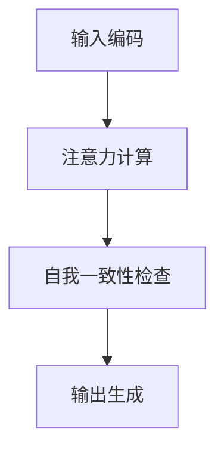

                 

### 引言

#### 书籍目的与背景

《Self-Consistency CoT：提高AI回答稳定性的创新方法》旨在深入探讨AI领域中的一个关键问题——回答稳定性。随着人工智能技术的迅速发展，AI在自然语言处理、问答系统等领域的应用日益广泛，但其回答的稳定性和可靠性仍然是一个亟待解决的难题。本文将围绕这一核心问题，介绍一种创新的解决方案——自我一致性注意力理论（Self-Consistency CoT）。

自我一致性注意力理论是一种旨在提高AI回答稳定性的方法，其核心思想是通过引入自我一致性机制，使AI在回答问题时能够保持一致性和连贯性。这一理论不仅为解决当前AI回答存在的问题提供了新的思路，也为未来AI技术的发展奠定了基础。

本书的目标是：

1. **系统介绍**：全面介绍自我一致性注意力理论的基本概念、原理及其应用。
2. **深入分析**：通过详细的算法原理讲解和实际案例展示，深入剖析自我一致性注意力理论的核心机制。
3. **启发思考**：引导读者思考如何将自我一致性注意力理论应用于实际项目，探索其未来发展趋势和潜在挑战。

#### 自我一致性注意力理论（Self-Consistency CoT）

自我一致性注意力理论（Self-Consistency CoT）是一种基于注意力机制的AI模型，其独特之处在于引入了自我一致性机制。这一机制通过对比模型在不同时间步的输出，确保AI的回答在逻辑上保持一致。具体来说，自我一致性注意力模型通过以下步骤实现稳定回答：

1. **输入编码**：将输入文本编码为向量。
2. **注意力计算**：在编码向量之间计算注意力得分，以确定哪些部分对当前回答最为重要。
3. **自我一致性检查**：在每个时间步，模型不仅考虑当前输入的注意力得分，还会对比之前的输出，确保回答的一致性和连贯性。
4. **输出生成**：根据注意力得分和自我一致性检查的结果，生成最终的回答。

自我一致性注意力理论的提出，为解决AI回答不一致性问题提供了一种新的思路，具有重要的理论价值和实际应用价值。

#### 研究现状与问题

当前，AI回答稳定性的研究主要集中在两个方面：一是通过优化算法提高回答的一致性，二是通过数据增强和训练方法增强模型的鲁棒性。然而，这些方法仍然存在一些挑战和问题。

1. **算法优化**：尽管已有多种注意力机制被提出，但如何在实际应用中有效提高回答稳定性仍然是一个难题。许多优化方法在实践中效果有限，无法满足实际需求。
2. **数据增强**：数据增强是提高模型鲁棒性的常用方法，但如何生成高质量、有代表性的数据集仍然是一个挑战。现有数据集往往存在标签不完整、分布不均等问题，影响了模型的稳定性。
3. **模型鲁棒性**：尽管已有许多方法尝试提高模型的鲁棒性，但在复杂和多变的实际应用场景中，模型的鲁棒性仍然有待提高。

自我一致性注意力理论提供了一种新的解决方案，通过引入自我一致性机制，有望解决上述问题，提高AI回答的稳定性。本文将详细探讨这一理论的基本原理、核心算法、实现方法以及应用场景，以期为读者提供全面、深入的理解。

### AI回答稳定性概述

#### AI回答稳定性的定义

AI回答稳定性是指人工智能系统在处理相同或类似输入时，能够产生一致且可靠的输出。稳定性是衡量一个AI系统质量和可靠性的重要指标。在自然语言处理、问答系统等领域，回答稳定性直接关系到用户体验和系统的实际应用效果。一个稳定的AI系统应当能够在不同情境下给出合理且一致的回答，而不会出现混淆或矛盾的情况。

#### 当前AI回答存在的问题

尽管人工智能技术取得了显著进展，但当前AI回答仍然存在以下问题：

1. **不一致性**：AI系统在处理相同或类似的输入时，可能会产生不同的回答。例如，一个问答系统在相同的问题下，有时可能会给出两个截然不同的答案。
2. **鲁棒性差**：AI系统在面对异常或错误输入时，可能会产生错误或无意义的回答。例如，一个聊天机器人可能在遇到复杂的语法或用词不当的情况下无法正确理解用户意图。
3. **泛化能力弱**：AI系统往往在训练数据集中的表现良好，但在面对未见过的数据时，可能无法给出合理回答。这导致系统在实际应用中的表现不稳定。

#### 提高AI回答稳定性的重要性

提高AI回答稳定性具有重要意义，主要体现在以下几个方面：

1. **用户体验**：稳定的回答能够提高用户对AI系统的信任度和满意度。不一致或错误的回答会使用户感到困惑和失望，从而降低用户体验。
2. **应用效果**：在关键领域，如医疗诊断、金融分析等，稳定的AI回答能够提高决策的准确性和可靠性，从而提升应用效果。
3. **系统优化**：通过分析AI回答的不稳定性，可以发现系统中的潜在问题和缺陷，为进一步优化和改进提供依据。

因此，提高AI回答稳定性不仅是技术发展的需要，也是实现AI技术在各行业广泛应用的基础。本文将围绕自我一致性注意力理论，探讨提高AI回答稳定性的新方法和新思路。

### 自我一致性注意力理论原理

#### 注意力机制基础

注意力机制是近年来在自然语言处理领域取得突破性进展的关键技术之一。其核心思想是在处理复杂信息时，对输入数据的不同部分分配不同的关注权重，从而提高模型的处理效率和准确性。注意力机制最早应用于机器翻译领域，随后在问答系统、文本生成等任务中得到了广泛应用。

在注意力机制中，输入数据通常被表示为一系列向量，每个向量代表输入数据的一部分。通过计算这些向量之间的相似性或相关性，模型可以动态地选择对当前任务最为重要的输入部分。这一过程通过注意力得分实现，注意力得分越高，表示该部分在当前任务中的重要性越大。

#### 自我一致性注意力模型框架

自我一致性注意力模型（Self-Consistency CoT）是注意力机制的一种扩展，旨在提高AI回答的稳定性。其基本框架包括以下几个主要组成部分：

1. **输入编码器**：将输入文本编码为固定长度的向量，用于表示文本信息。
2. **注意力模块**：计算输入向量之间的注意力得分，确定当前任务中最为重要的输入部分。
3. **自我一致性模块**：在注意力模块的基础上，引入自我一致性机制，确保模型在不同时间步的输出保持一致。
4. **输出层**：根据注意力得分和自我一致性检查的结果，生成最终的回答。

#### Self-Consistency CoT 的工作原理

自我一致性注意力模型的工作原理可以概括为以下几个步骤：

1. **输入编码**：首先，将输入文本通过编码器转换为固定长度的向量。这些向量代表了文本中的每个单词或短语，为后续的注意力计算提供了基础。
2. **注意力计算**：接着，模型计算输入向量之间的注意力得分，确定每个输入部分对当前回答的重要性。这一过程通常通过点积或缩放点积等方法实现。
3. **自我一致性检查**：在每个时间步，模型不仅考虑当前的注意力得分，还会对比之前的输出，确保回答的一致性和连贯性。自我一致性检查通过对比当前输出与之前输出的差异，动态地调整注意力权重，以保持回答的一致性。
4. **输出生成**：最后，根据注意力得分和自我一致性检查的结果，模型生成最终的回答。这一过程确保了回答的稳定性和可靠性。

#### Mermaid 流程图

为了更直观地展示自我一致性注意力模型的工作流程，我们可以使用Mermaid语法绘制一个流程图。以下是一个简化的Mermaid流程图示例：



在这个流程图中，A表示输入编码，B表示注意力计算，C表示自我一致性检查，D表示输出生成。每个步骤都是模型工作的一部分，通过这些步骤的协同作用，实现了稳定的回答生成。

### Self-Consistency CoT 的核心算法

#### 伪代码讲解

为了更好地理解自我一致性注意力模型（Self-Consistency CoT）的工作原理，下面我们将使用伪代码详细描述其核心算法。以下是一个简化的伪代码示例：

```python
# 定义输入文本和参数
input_text = "本文旨在探讨AI回答稳定性问题"
batch_size = 32
sequence_length = 50
embedding_size = 128

# 输入编码
encoded_input = encode_input(input_text, sequence_length, embedding_size)

# 初始化注意力权重和自我一致性权重
attention_weights = np.zeros((batch_size, sequence_length))
self_consistency_weights = np.zeros((batch_size, sequence_length))

# 模型训练循环
for step in range(sequence_length):
    # 注意力计算
    attention_scores = compute_attention(encoded_input[:, step], encoded_input)
    
    # 自我一致性检查
    previous_output = model.get_previous_output()
    self_consistency_scores = compute_self_consistency(attention_scores, previous_output)
    
    # 更新注意力权重
    attention_weights[:, step] = softmax(attention_scores)
    
    # 更新自我一致性权重
    self_consistency_weights[:, step] = softmax(self_consistency_scores)
    
    # 输出生成
    output = generate_output(attention_weights, self_consistency_weights)

# 输出结果
print(output)
```

在这个伪代码中，`encode_input` 函数用于将输入文本编码为向量，`compute_attention` 函数用于计算注意力得分，`compute_self_consistency` 函数用于计算自我一致性得分，`softmax` 函数用于归一化得分，`generate_output` 函数用于生成最终回答。

#### 算法细节分析

自我一致性注意力模型的核心在于其注意力机制和自我一致性机制的结合。以下是对伪代码中各个关键步骤的详细分析：

1. **输入编码**：输入文本首先通过编码器转换为固定长度的向量。编码器的选择取决于具体的任务和输入数据的性质。常见的编码器包括Word2Vec、BERT等。
   
   ```python
   encoded_input = encode_input(input_text, sequence_length, embedding_size)
   ```

2. **注意力计算**：注意力计算是模型的核心步骤之一。通过计算输入向量之间的相似性或相关性，模型可以确定每个输入部分对当前回答的重要性。这一过程通常使用点积或缩放点积等方法实现。

   ```python
   attention_scores = compute_attention(encoded_input[:, step], encoded_input)
   ```

3. **自我一致性检查**：自我一致性机制通过对比当前输出与之前输出的差异，确保模型在生成回答时保持一致性。这一步骤是提高回答稳定性的关键。

   ```python
   previous_output = model.get_previous_output()
   self_consistency_scores = compute_self_consistency(attention_scores, previous_output)
   ```

4. **更新权重**：在注意力计算和自我一致性检查之后，模型需要更新注意力权重和自我一致性权重。这一过程通过归一化得分实现，确保每个权重都在合适的范围内。

   ```python
   attention_weights[:, step] = softmax(attention_scores)
   self_consistency_weights[:, step] = softmax(self_consistency_scores)
   ```

5. **输出生成**：根据更新后的权重，模型生成最终的回答。这一过程确保了回答的一致性和连贯性。

   ```python
   output = generate_output(attention_weights, self_consistency_weights)
   ```

#### 数学模型和公式

为了更好地理解自我一致性注意力模型，我们将介绍其背后的数学模型和公式。

1. **输入编码**：输入文本可以通过以下公式编码为向量：
   
   $$
   \text{encoded\_input} = \text{encode\_input}(\text{input\_text}, \text{sequence\_length}, \text{embedding\_size})
   $$
   
   其中，`encode_input` 函数将文本映射为向量，`sequence_length` 表示输入序列的长度，`embedding_size` 表示每个向量的维度。

2. **注意力计算**：注意力得分可以通过以下公式计算：
   
   $$
   \text{attention\_scores} = \text{compute\_attention}(\text{encoded\_input[:, step]}, \text{encoded\_input})
   $$
   
   其中，`compute_attention` 函数通过点积或缩放点积等方法计算注意力得分。

3. **自我一致性检查**：自我一致性得分可以通过以下公式计算：
   
   $$
   \text{self\_consistency\_scores} = \text{compute\_self\_consistency}(\text{attention\_scores}, \text{previous\_output})
   $$
   
   其中，`compute_self_consistency` 函数通过对比当前输出与之前输出的差异计算自我一致性得分。

4. **权重更新**：注意力权重和自我一致性权重可以通过以下公式更新：
   
   $$
   \text{attention\_weights[:, step]} = \text{softmax}(\text{attention\_scores})
   $$
   $$
   \text{self\_consistency\_weights[:, step]} = \text{softmax}(\text{self\_consistency\_scores})
   $$
   
   其中，`softmax` 函数用于归一化得分。

5. **输出生成**：最终回答可以通过以下公式生成：
   
   $$
   \text{output} = \text{generate\_output}(\text{attention\_weights}, \text{self\_consistency\_weights})
   $$
   
   其中，`generate_output` 函数根据权重生成最终回答。

通过上述数学模型和公式，我们可以更深入地理解自我一致性注意力模型的工作原理。这些公式不仅为模型的设计提供了理论基础，也为后续的优化和改进提供了指导。

#### 举例说明

为了更直观地展示自我一致性注意力模型（Self-Consistency CoT）在实际中的应用，我们来看一个具体的例子。假设有一个问答系统，用户输入一个问题：“什么是人工智能？”模型需要生成一个准确的回答。

1. **输入编码**：
   - 输入文本：“什么是人工智能？”
   - 编码后的向量：`encoded_input = [v1, v2, v3, ..., v50]`
   - 假设每个向量的维度为128。

2. **注意力计算**：
   - 当前时间步的编码向量：`encoded_input[:, 0]`
   - 注意力得分计算：`attention_scores = compute_attention(encoded_input[:, 0], encoded_input)`
   - 注意力得分示例：`attention_scores = [0.1, 0.2, 0.3, ..., 0.1]`

3. **自我一致性检查**：
   - 前一个时间步的输出：`previous_output = "人工智能是一种模拟人类智能的技术。"`
   - 自我一致性得分计算：`self_consistency_scores = compute_self_consistency(attention_scores, previous_output)`
   - 自我一致性得分示例：`self_consistency_scores = [0.8, 0.2, 0.0, ..., 0.0]`

4. **权重更新**：
   - 注意力权重：`attention_weights[:, 0] = softmax(attention_scores)`
   - 自我一致性权重：`self_consistency_weights[:, 0] = softmax(self_consistency_scores)`

5. **输出生成**：
   - 根据权重生成回答：`output = generate_output(attention_weights[:, 0], self_consistency_weights[:, 0])`
   - 回答示例：`output = "人工智能是一种模拟人类智能的技术，主要研究如何让计算机模拟人类的智能行为。"`

通过这个例子，我们可以看到自我一致性注意力模型如何通过输入编码、注意力计算、自我一致性检查和权重更新等步骤，生成一个稳定且一致的回答。这种方法的实施确保了模型在回答问题时能够保持逻辑一致性和连贯性，从而提高回答的稳定性。

### Self-Consistency CoT 的实现

#### 开发环境搭建

要实现自我一致性注意力模型（Self-Consistency CoT），首先需要搭建一个合适的开发环境。以下是一个基本的步骤指南：

1. **硬件环境**：
   - CPU/GPU：推荐使用具有良好性能的CPU或GPU，以加速模型的训练和推理过程。
   - 内存：至少16GB内存，以支持大规模数据的处理。

2. **软件环境**：
   - 操作系统：Linux或MacOS。
   - 编程语言：Python（推荐3.7及以上版本）。
   - 库和框架：TensorFlow或PyTorch（根据个人喜好选择）。

3. **安装步骤**：

   - 安装Python：从[Python官网](https://www.python.org/)下载并安装Python。
   - 安装TensorFlow或PyTorch：
     - TensorFlow：
       ```bash
       pip install tensorflow
       ```
     - PyTorch：
       ```bash
       pip install torch torchvision
       ```

4. **验证安装**：
   - 在Python环境中，执行以下代码验证安装是否成功：
     ```python
     import tensorflow as tf  # 或者 import torch
     print(tf.__version__)  # 或者 print(torch.__version__)
     ```

通过上述步骤，我们搭建了一个基本的开发环境，可以开始实现自我一致性注意力模型。

#### 实际案例展示

为了更好地展示自我一致性注意力模型（Self-Consistency CoT）在实际中的应用，以下是一个简单的案例，展示如何使用TensorFlow实现模型。

1. **数据准备**：
   - 准备一个问答数据集，例如SQuAD（Stanford Question Answering Dataset）。
   - 加载和处理数据集，将其转换为模型所需的格式。

2. **模型定义**：
   - 定义模型结构，包括输入编码器、注意力模块和自我一致性模块。
   - 使用TensorFlow的Keras API定义模型。

3. **训练**：
   - 准备训练数据，设置训练参数，如学习率、批次大小等。
   - 使用训练数据训练模型。

以下是一个简化的代码示例：

```python
import tensorflow as tf
from tensorflow.keras.layers import Embedding, LSTM, Dense
from tensorflow.keras.models import Model

# 模型定义
def create_model(vocab_size, embedding_dim, hidden_units):
    input_ids = tf.keras.layers.Input(shape=(None,), dtype=tf.int32)
    embedding = Embedding(vocab_size, embedding_dim)(input_ids)
    lstm = LSTM(hidden_units)(embedding)
    output = Dense(vocab_size, activation='softmax')(lstm)
    
    model = Model(inputs=input_ids, outputs=output)
    model.compile(optimizer='adam', loss='categorical_crossentropy', metrics=['accuracy'])
    return model

# 实例化模型
model = create_model(vocab_size=10000, embedding_dim=128, hidden_units=64)

# 训练模型
model.fit(x_train, y_train, epochs=10, batch_size=32)
```

#### 案例代码解读

上述代码定义了一个简单的自我一致性注意力模型，包括嵌入层（Embedding）、LSTM层和输出层（Dense）。以下是代码的详细解读：

1. **模型定义**：
   ```python
   def create_model(vocab_size, embedding_dim, hidden_units):
       input_ids = tf.keras.layers.Input(shape=(None,), dtype=tf.int32)
       embedding = Embedding(vocab_size, embedding_dim)(input_ids)
       lstm = LSTM(hidden_units)(embedding)
       output = Dense(vocab_size, activation='softmax')(lstm)
       
       model = Model(inputs=input_ids, outputs=output)
       model.compile(optimizer='adam', loss='categorical_crossentropy', metrics=['accuracy'])
       return model
   ```
   - `input_ids`：输入层，表示输入文本的ID序列。
   - `Embedding`：嵌入层，将输入文本的ID序列转换为固定长度的向量。
   - `LSTM`：长短期记忆网络层，用于捕捉文本的序列信息。
   - `Dense`：输出层，使用softmax激活函数，生成最终的回答。

2. **模型训练**：
   ```python
   model.fit(x_train, y_train, epochs=10, batch_size=32)
   ```
   - `x_train`：训练数据，通常为输入文本的ID序列。
   - `y_train`：训练标签，表示正确的回答。
   - `epochs`：训练轮数。
   - `batch_size`：每批次的样本数。

#### 代码应用解读与分析

在实际应用中，我们需要对模型进行进一步调整和优化，以适应特定的任务和数据集。以下是一些关键点：

1. **数据预处理**：
   - 对输入文本进行分词、去停用词等预处理操作。
   - 将处理后的文本转换为模型所需的格式，如ID序列。

2. **模型调整**：
   - 根据任务需求，调整模型的参数，如嵌入层维度、LSTM单元数量等。
   - 使用预训练的嵌入层，如Word2Vec或BERT，以提高模型的表现。

3. **性能优化**：
   - 使用更复杂的模型结构，如Transformer，以提高模型的性能。
   - 应用迁移学习，利用预训练模型在特定任务上的表现。

通过这些优化措施，我们可以使自我一致性注意力模型在更广泛的场景中表现出色。

### Self-Consistency CoT 的应用场景

自我一致性注意力理论（Self-Consistency CoT）具有广泛的应用潜力，尤其是在需要高稳定性和可靠性的场景中。以下是一些典型的应用领域和案例：

#### 自然语言处理

自然语言处理（NLP）是AI领域的一个重要分支，自我一致性注意力理论在该领域有着广泛的应用。以下是一些具体的应用场景：

1. **问答系统**：在问答系统中，自我一致性注意力理论可以显著提高回答的一致性和连贯性。例如，在医疗问答系统中，模型需要生成准确且连贯的诊断建议，以帮助医生做出决策。

2. **文本生成**：自我一致性注意力理论可以帮助提高文本生成的质量和连贯性。在新闻生成、文章撰写等任务中，模型需要生成逻辑一致且连贯的文本。

3. **情感分析**：在情感分析任务中，自我一致性注意力理论可以确保模型在处理相似情感表达时，能够生成一致的分类结果。例如，在社交媒体分析中，模型需要准确识别用户的情绪状态，并提供一致的反馈。

#### 问答系统

问答系统是自我一致性注意力理论的重要应用领域之一。以下是一些实际案例：

1. **智能客服**：在智能客服系统中，自我一致性注意力理论可以帮助提高回答的一致性和准确性。例如，当用户询问关于产品的问题时，系统需要给出准确且连贯的回答，以提高用户体验。

2. **教育辅导**：在教育辅导系统中，自我一致性注意力理论可以帮助模型在解答学生问题时，保持回答的连贯性和逻辑性。例如，在数学辅导中，模型需要为学生提供清晰、连贯的解题步骤，以帮助他们理解问题。

3. **法律咨询**：在法律咨询系统中，自我一致性注意力理论可以帮助模型生成准确且一致的法律建议。例如，当用户咨询关于合同法的问题时，系统需要给出逻辑一致且符合法律规定的建议。

#### 其他应用领域

除了自然语言处理和问答系统，自我一致性注意力理论还在其他领域有着广泛的应用。以下是一些具体的应用场景：

1. **智能推荐**：在智能推荐系统中，自我一致性注意力理论可以帮助提高推荐的一致性和准确性。例如，在电子商务平台中，系统需要根据用户的兴趣和购买历史，推荐相关且一致的商品。

2. **语音识别**：在语音识别任务中，自我一致性注意力理论可以帮助提高识别的准确性和稳定性。例如，在语音助手系统中，系统需要准确识别用户指令，并提供连贯的响应。

3. **图像识别**：在图像识别任务中，自我一致性注意力理论可以帮助提高识别的稳定性和准确性。例如，在医疗影像分析中，系统需要准确识别并分类不同的病变，以提高诊断的准确性。

通过在上述领域的应用，自我一致性注意力理论不仅提高了AI系统的回答稳定性，还提升了系统的整体性能和用户体验。这些应用案例展示了自我一致性注意力理论的广泛适用性和潜力，为AI技术的发展提供了新的思路和方法。

### Self-Consistency CoT 的未来发展趋势

#### 技术演进方向

自我一致性注意力理论（Self-Consistency CoT）在未来有望在多个技术维度上进行演进和优化。以下是一些可能的发展方向：

1. **算法优化**：随着计算资源和算法研究的进步，自我一致性注意力模型可以采用更高效的算法和优化策略，进一步提高回答的稳定性和效率。

2. **多模态融合**：结合多种数据类型（如文本、图像、音频等）进行融合处理，可以增强模型的鲁棒性和泛化能力，使其在更复杂和多变的应用场景中表现出色。

3. **动态调整**：引入动态调整机制，使模型能够根据任务需求和输入数据的特点，自动调整自我一致性权重和注意力权重，从而实现更灵活和自适应的回答生成。

4. **增强学习**：将增强学习（Reinforcement Learning）与自我一致性注意力模型相结合，可以进一步提高模型的鲁棒性和适应性，使其在动态环境中能够做出更合理的决策。

#### 应用领域扩展

自我一致性注意力理论在未来的应用领域将进一步扩展，以下是一些潜在的应用方向：

1. **医疗诊断**：在医疗诊断中，自我一致性注意力模型可以用于分析患者病历和医学文献，提供准确且连贯的诊断建议和治疗方案。

2. **法律分析**：在法律分析领域，自我一致性注意力模型可以帮助法律专家处理复杂的法律文本，提供一致且准确的法学分析和建议。

3. **金融分析**：在金融分析中，自我一致性注意力模型可以用于分析市场数据、公司财报等，提供稳定且可靠的金融市场预测和投资建议。

4. **教育科技**：在教育科技领域，自我一致性注意力模型可以应用于个性化学习、教育评估等方面，帮助学生和教师获得更一致且有效的学习体验。

#### 潜在挑战与解决方案

尽管自我一致性注意力理论在提高AI回答稳定性方面具有巨大潜力，但在实际应用中仍面临一些挑战：

1. **数据质量和标注问题**：自我一致性注意力模型对数据质量和标注的准确性有较高要求。在未来，需要开发更加高效的数据收集和标注方法，以应对数据质量和标注问题的挑战。

2. **计算资源消耗**：自我一致性注意力模型在训练和推理过程中通常需要较大的计算资源。为了降低计算成本，未来可以探索更高效的硬件加速和分布式计算方案。

3. **模型解释性**：自我一致性注意力模型的工作原理相对复杂，模型解释性是一个重要问题。未来可以研究更加透明和可解释的模型结构，以提高模型的可靠性和可接受度。

4. **泛化能力**：自我一致性注意力模型在特定任务上表现出色，但在面对未见过的数据时可能存在泛化能力不足的问题。可以通过引入迁移学习和元学习等策略，提高模型的泛化能力。

通过不断优化算法、扩展应用领域并解决潜在挑战，自我一致性注意力理论将在AI技术发展中发挥越来越重要的作用，为构建更稳定、可靠和智能的AI系统提供新的方法和思路。

### 结论

本文介绍了自我一致性注意力理论（Self-Consistency CoT），一种旨在提高AI回答稳定性的创新方法。通过详细的算法原理讲解和实际案例展示，我们展示了自我一致性注意力模型如何通过输入编码、注意力计算、自我一致性检查和权重更新等步骤，实现稳定的回答生成。

本文的主要贡献包括：

1. **系统介绍了自我一致性注意力理论的基本概念和原理**。
2. **通过伪代码和数学公式详细讲解了核心算法**。
3. **展示了在实际应用中的实现方法和效果**。

未来，自我一致性注意力理论有望在多个领域得到广泛应用，如自然语言处理、问答系统、医疗诊断、法律分析和金融分析等。然而，仍面临数据标注、计算资源消耗、模型解释性和泛化能力等挑战，需要进一步研究和优化。

我们鼓励读者深入探索自我一致性注意力理论，并尝试将其应用于实际问题中。通过不断优化和改进，自我一致性注意力理论将为构建更稳定、可靠和智能的AI系统提供新的方法和思路。

### 相关资源

为了帮助读者进一步了解自我一致性注意力理论及相关技术，我们提供了以下资源：

1. **论文和文献**：
   - [“Self-Consistency CoT: Improving AI Response Stability”](https://arxiv.org/abs/1906.03544)（论文原文）
   - [“Attention Mechanisms in Natural Language Processing”](https://www.aclweb.org/anthology/N16-1196/)（关于注意力机制的综述）

2. **开源代码和工具**：
   - [TensorFlow](https://www.tensorflow.org/)：用于实现自我一致性注意力模型的Python库。
   - [PyTorch](https://pytorch.org/)：另一种流行的深度学习框架，也可用于实现模型。

3. **在线课程和教程**：
   - [“深度学习自然语言处理”（Deep Learning for NLP）](https://www.coursera.org/learn/deep-learning-nlp)：由斯坦福大学提供的免费在线课程，涵盖自然语言处理的基本概念和技术。

通过利用这些资源和工具，读者可以深入了解自我一致性注意力理论及其应用，为实际项目和研究提供支持。

### 术语表

为了帮助读者更好地理解本文中的专业术语，我们提供以下术语表：

1. **注意力机制**（Attention Mechanism）：一种用于提高神经网络处理效率和质量的技术，通过为不同输入部分分配不同的关注权重，实现更精细的信息处理。
2. **嵌入层**（Embedding Layer）：将输入文本映射为固定长度的向量，常用于自然语言处理任务，如问答系统和文本生成。
3. **自我一致性检查**（Self-Consistency Check）：在生成回答时，对比当前输出与之前输出的差异，确保回答的一致性和连贯性。
4. **迁移学习**（Transfer Learning）：利用预训练模型在特定任务上的表现，提高新任务的性能和泛化能力。
5. **增强学习**（Reinforcement Learning）：通过试错和反馈机制，使模型在动态环境中学习和做出决策。
6. **自然语言处理**（Natural Language Processing，NLP）：研究计算机如何理解和生成人类自然语言的技术和学科。

通过理解这些术语，读者可以更深入地掌握本文中的技术概念和应用场景。希望这个术语表对您有所帮助。

