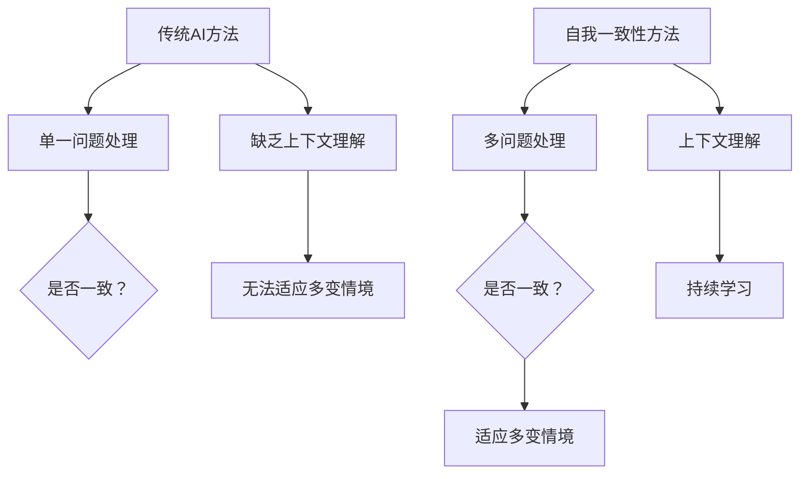
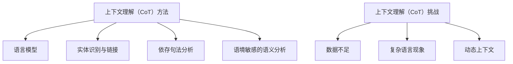
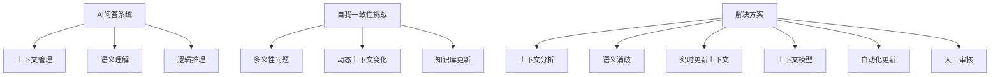
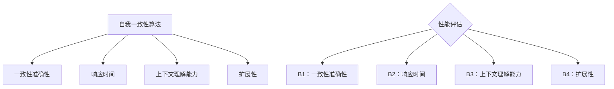
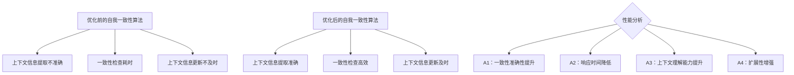
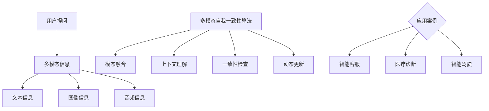
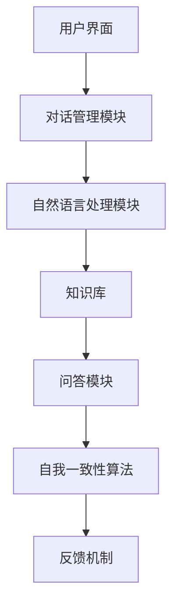
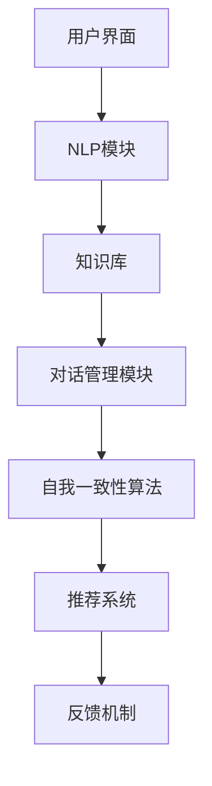
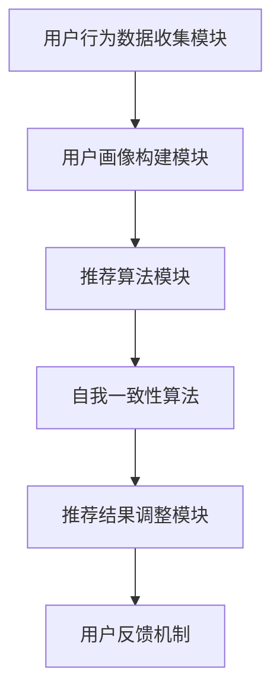

                 

### 文章标题

《Self-Consistency CoT：确保AI回答一致性的新方法》

### 关键词

- Self-Consistency
- AI问答系统
- 上下文理解
- 优化算法
- 多模态
- 实时应用

### 摘要

本文探讨了自我一致性（Self-Consistency）在人工智能（AI）问答系统中的应用，提出了一个基于上下文理解（CoT）的新方法。首先，我们介绍了自我一致性的定义和原理，并分析了其在AI领域的应用背景。接着，我们详细讲解了上下文理解的概念和重要性，以及实现上下文理解的方法和挑战。在此基础上，本文重点介绍了自我一致性算法的原理、优化方法及其性能评估。随后，我们进一步探讨了多模态自我一致性算法的设计和应用案例。最后，本文通过实战应用和案例分析，展示了自我一致性在不同领域的实际应用效果，并给出了最佳实践和注意事项。

### 目录

```markdown
# 《Self-Consistency CoT：确保AI回答一致性的新方法》

## 第一部分：基础概念与背景知识

### 第1章：自我一致性（Self-Consistency）原理

#### 1.1 自我一致性（Self-Consistency）的定义

#### 1.2 自我一致性在AI领域的应用

#### 1.3 自我一致性与传统AI方法的对比

### 第2章：上下文理解（CoT）基础

#### 2.1 上下文理解（CoT）的概念

#### 2.2 上下文理解（CoT）的重要性

#### 2.3 上下文理解（CoT）的方法与挑战

### 第3章：自我一致性在AI问答系统中的应用

#### 3.1 自我一致性在问答系统中的作用

#### 3.2 实现自我一致性在问答系统中的方法

#### 3.3 自我一致性在问答系统中的挑战与解决方案

## 第二部分：算法实现与优化

### 第4章：自我一致性算法原理

#### 4.1 自我一致性算法的基本原理

#### 4.2 自我一致性算法的伪代码描述

#### 4.3 自我一致性算法的性能评估

### 第5章：自我一致性算法优化

#### 5.1 自我一致性算法的优化方法

#### 5.2 优化方法在自我一致性算法中的应用

#### 5.3 优化后的自我一致性算法性能分析

### 第6章：多模态自我一致性算法

#### 6.1 多模态自我一致性的概念

#### 6.2 多模态自我一致性算法的设计

#### 6.3 多模态自我一致性算法的应用案例

## 第三部分：实战应用与案例分析

### 第7章：自我一致性在实时问答系统中的应用

#### 7.1 实时问答系统中的自我一致性需求

#### 7.2 实现自我一致性的实时问答系统架构

#### 7.3 自我一致性在实时问答系统中的实战案例

### 第8章：自我一致性在智能客服系统中的应用

#### 8.1 智能客服系统中的自我一致性需求

#### 8.2 实现自我一致性的智能客服系统架构

#### 8.3 自我一致性在智能客服系统中的实战案例

### 第9章：自我一致性在个性化推荐系统中的应用

#### 9.1 个性化推荐系统中的自我一致性需求

#### 9.2 实现自我一致性的个性化推荐系统架构

#### 9.3 自我一致性在个性化推荐系统中的实战案例

## 附录：资源与工具

### 附录A：自我一致性研究资源汇总

#### A.1 学术论文汇总

#### A.2 开源代码与数据集

#### A.3 相关在线课程与教程

### 附录B：常用工具与软件介绍

#### B.1 问答系统开发工具

#### B.2 实时问答系统开发工具

#### B.3 个性化推荐系统开发工具
```

## 第一部分：基础概念与背景知识

### 第1章：自我一致性（Self-Consistency）原理

#### 1.1 自我一致性（Self-Consistency）的定义

自我一致性（Self-Consistency）是指一个系统在处理输入信息时，其内部状态或输出结果在逻辑上保持一致的性质。具体到人工智能（AI）领域，自我一致性指的是在AI系统（如问答系统、智能客服等）中，系统在处理不同问题或情境时，其提供的回答或决策能够保持一致性和连贯性。

为了更好地理解自我一致性的概念，我们可以通过一个简单的例子来说明。假设我们有一个问答系统，它被询问“北京的天气如何？”和“北京现在的气温是多少？”两个问题。如果系统分别给出了“今天北京多云，气温12-20摄氏度”和“北京现在的气温是15摄氏度”的回答，那么这两个回答在逻辑上是自我一致的。相反，如果系统给出了“北京天气很好，气温25摄氏度”的回答，那么这两个回答在逻辑上是不自我一致的。

#### 1.2 自我一致性在AI领域的应用

自我一致性在AI领域的应用十分广泛，尤其是在问答系统和智能客服等场景中。以下是自我一致性在这些场景中的应用：

1. **问答系统**：在问答系统中，自我一致性能够保证系统提供的回答在逻辑上保持一致，从而提高用户体验。例如，在智能家居系统中，当用户询问“我是否开启了灯光？”和“灯光是否亮着？”时，系统应该给出一致的回答。

2. **智能客服**：在智能客服系统中，自我一致性能够确保客服机器人与用户之间的交流更加流畅和自然。例如，当用户询问“我的订单状态是什么？”和“我的订单是否已经发货？”时，系统应该提供一致的答案，避免产生误导或混淆。

3. **个性化推荐系统**：在个性化推荐系统中，自我一致性可以确保推荐结果的一致性，避免给用户产生错误的期望。例如，当用户连续浏览不同类型的商品时，系统应该给出一致的推荐结果，而不是频繁改变推荐类型。

#### 1.3 自我一致性与传统AI方法的对比

传统的AI方法，如基于规则的推理、决策树、支持向量机等，往往缺乏自我一致性。这些方法在处理特定问题时可能非常有效，但难以保证在不同问题和情境下的自我一致性。

相比之下，自我一致性方法通过引入上下文理解（Contextual Understanding）和持续学习（Continuous Learning），能够在不同问题和情境下保持自我一致性。例如，在问答系统中，通过上下文理解，系统可以识别用户的问题意图，并根据当前上下文提供一致的回答。此外，通过持续学习，系统可以不断优化自我一致性算法，提高其性能和效果。

为了更清晰地展示自我一致性与传统AI方法的对比，我们可以使用以下Mermaid流程图：



通过这个流程图，我们可以看出自我一致性方法在多问题处理、上下文理解和持续学习等方面具有显著优势，从而能够更好地保持自我一致性。

### 第2章：上下文理解（CoT）基础

#### 2.1 上下文理解（CoT）的概念

上下文理解（Contextual Understanding，简称CoT）是指人工智能系统在处理信息时，能够根据当前的上下文环境理解信息的含义和意图。上下文可以理解为信息的背景，它提供了关于信息产生的环境和条件的信息，帮助AI系统更好地理解和处理信息。

在人工智能领域，上下文理解是一个关键的概念。例如，在自然语言处理（NLP）中，上下文理解有助于AI系统理解句子或词汇的含义，避免歧义。在图像识别中，上下文理解有助于AI系统识别图像中的对象和场景，提高识别精度。

上下文理解通常包括以下几个层次：

1. **词级上下文理解**：在词级上下文中，AI系统分析词汇在句子中的含义，理解词汇的语境。例如，单词“bank”在“river bank”和“financial bank”中的含义不同。

2. **句级上下文理解**：在句级上下文中，AI系统分析整个句子的含义，理解句子之间的关系和逻辑。例如，理解“我昨天去了超市”和“我昨天买了牛奶”之间的关系。

3. **篇章级上下文理解**：在篇章级上下文中，AI系统分析整个文档或篇章的结构和内容，理解篇章的主题和观点。

#### 2.2 上下文理解（CoT）的重要性

上下文理解（CoT）在人工智能领域具有至关重要的地位。以下是上下文理解的重要性和影响：

1. **提高准确性和可靠性**：通过上下文理解，AI系统能够更好地理解用户的意图和需求，提供更准确和可靠的回答或服务。例如，在智能客服中，上下文理解有助于系统理解用户的咨询内容，提供针对性的解决方案。

2. **减少歧义**：在自然语言处理中，上下文理解有助于AI系统减少词汇和句子的歧义。例如，通过上下文，AI系统可以区分“bank”是指河流的岸边还是金融机构。

3. **增强交互体验**：在交互式应用中，上下文理解能够提高用户与AI系统的互动质量，使用户感受到更加自然和人性化的交互体验。

4. **支持复杂任务处理**：在复杂任务中，上下文理解有助于AI系统理解任务的目标和要求，制定更有效的解决方案。

#### 2.3 上下文理解（CoT）的方法与挑战

实现上下文理解（CoT）的方法主要包括以下几个方面：

1. **语言模型**：使用预训练的语言模型（如BERT、GPT等）进行上下文理解。这些模型通过大量文本数据进行训练，能够捕捉语言中的上下文信息。

2. **实体识别与链接**：通过实体识别和链接技术，将文本中的词汇与知识库中的实体进行关联，从而提高上下文理解的准确性。

3. **依存句法分析**：使用依存句法分析技术，分析句子中词汇之间的关系，理解句子的结构，从而提高上下文理解的能力。

4. **语境敏感的语义分析**：通过语境敏感的语义分析技术，识别不同语境下的词汇含义，提高上下文理解的准确性和适应性。

然而，实现上下文理解（CoT）也面临着一些挑战：

1. **数据不足**：上下文理解需要大量高质量的标注数据，但获取这样的数据非常困难。

2. **复杂语言现象**：自然语言中存在许多复杂的语言现象，如歧义、隐喻等，这给上下文理解带来了挑战。

3. **动态上下文**：上下文是动态变化的，AI系统需要实时适应和更新上下文信息，这增加了上下文理解的复杂性。

为了更好地展示上下文理解（CoT）的方法与挑战，我们可以使用以下Mermaid流程图：



通过这个流程图，我们可以看到上下文理解（CoT）的方法和挑战，以及它们之间的关系。

### 第3章：自我一致性在AI问答系统中的应用

#### 3.1 自我一致性在问答系统中的作用

在人工智能（AI）问答系统中，自我一致性（Self-Consistency）扮演着至关重要的角色。其主要作用包括：

1. **提高回答质量**：自我一致性确保AI系统提供的回答在逻辑上保持一致，从而提高回答的质量。例如，当用户询问关于同一主题的不同问题时，AI系统应提供连贯的回答，避免逻辑矛盾。

2. **提升用户体验**：自我一致性有助于改善用户体验，使用户在与AI系统的交互过程中感受到一致性和连贯性，从而提高用户满意度。

3. **增强信任度**：自我一致性使得AI系统在处理用户问题时表现出更高的可信度，使用户更愿意依赖AI系统解决问题。

#### 3.2 实现自我一致性在问答系统中的方法

要实现自我一致性在AI问答系统中的功能，可以采用以下几种方法：

1. **上下文管理**：通过管理上下文信息，确保AI系统在处理不同问题时能够保持一致性。具体方法包括：

   - **对话上下文**：记录用户与AI系统交互的历史信息，如用户的问题、AI系统的回答等，以便在后续问题中参考。
   - **场景上下文**：根据用户当前所处的场景，调整AI系统的回答策略，确保在不同场景下保持自我一致性。

2. **语义理解**：通过深入理解用户的问题和意图，确保AI系统提供的回答在语义上保持一致。具体方法包括：

   - **实体识别**：识别用户问题中的关键实体，如人名、地点、时间等，并根据实体关系提供一致的回答。
   - **语义分析**：分析用户问题的语义结构，理解问题的主题和意图，确保回答在语义上保持一致。

3. **逻辑推理**：利用逻辑推理技术，确保AI系统在处理问题时能够保持逻辑一致性。具体方法包括：

   - **推理引擎**：使用推理引擎对用户问题进行逻辑推理，确保回答在逻辑上保持一致。
   - **规则匹配**：通过规则匹配技术，将用户问题与知识库中的规则进行匹配，确保回答在逻辑上保持一致。

#### 3.3 自我一致性在问答系统中的挑战与解决方案

尽管自我一致性在问答系统中具有重要意义，但实现这一目标也面临一些挑战。以下是一些常见挑战及其解决方案：

1. **多义性问题**：自然语言中存在许多多义性问题，导致AI系统难以提供一致的回答。解决方案包括：

   - **上下文分析**：通过分析问题的上下文信息，识别多义性问题的正确含义，确保回答的一致性。
   - **语义消歧**：使用语义消歧技术，对多义性问题进行解析，提供正确的回答。

2. **动态上下文变化**：用户与AI系统交互时，上下文信息会不断变化，导致自我一致性难以保持。解决方案包括：

   - **实时更新上下文**：不断更新AI系统的上下文信息，确保在动态变化的环境中保持自我一致性。
   - **上下文模型**：构建上下文模型，根据用户的行为和交互历史，预测可能的上下文变化，提前调整回答策略。

3. **知识库更新**：随着用户问题的变化，知识库中的信息也需要不断更新，以确保回答的一致性。解决方案包括：

   - **自动化更新**：使用自然语言处理技术，自动更新知识库中的信息，确保知识库与用户的最新需求保持一致。
   - **人工审核**：定期人工审核知识库，确保其中的信息准确、及时，从而提高自我一致性。

为了更好地展示自我一致性在问答系统中的应用，我们可以使用以下Mermaid流程图：



通过这个流程图，我们可以清晰地看到自我一致性在问答系统中的应用方法、面临的挑战及其解决方案，从而更好地理解和实施自我一致性在问答系统中的功能。

### 第4章：自我一致性算法原理

#### 4.1 自我一致性算法的基本原理

自我一致性算法（Self-Consistency Algorithm）是一种基于上下文理解（Contextual Understanding）的算法，旨在确保AI系统在处理多个问题时，其输出结果在逻辑上保持一致。该算法的核心思想是通过对问题进行上下文分析，识别问题之间的关联，从而在回答问题时保持一致性。

自我一致性算法的基本原理可以概括为以下几个步骤：

1. **上下文提取**：首先，从用户输入的问题中提取上下文信息，如关键词、实体、时间等。这些上下文信息有助于理解问题的背景和意图。

2. **关联识别**：接着，分析提取到的上下文信息，识别问题之间的关联。例如，在问答系统中，如果用户先后询问了关于同一主题的两个问题，那么这两个问题之间存在关联。

3. **一致性检查**：在生成回答时，检查回答是否与先前的回答保持一致性。如果发现不一致的情况，则对回答进行调整，以确保整体一致性。

4. **动态更新**：在用户与AI系统交互的过程中，不断更新上下文信息，以适应动态变化的环境。这样，即使在不同的时间或情境下，AI系统也能提供一致的回答。

#### 4.2 自我一致性算法的伪代码描述

为了更直观地理解自我一致性算法的工作原理，我们可以使用伪代码对其进行描述：

```python
def self_consistency_algorithm(question, context_history):
    """
    自我一致性算法
    :param question: 用户输入的问题
    :param context_history: 历史上下文信息
    :return: 一致性的回答
    """
    # 步骤1：上下文提取
    context = extract_context(question)
    
    # 步骤2：关联识别
    associated_questions = identify_associated_questions(context, context_history)
    
    # 步骤3：一致性检查
    consistent_answer = check_consistency(associated_questions)
    
    # 步骤4：动态更新
    update_context_history(context_history, context)
    
    return consistent_answer
```

在这个伪代码中，`extract_context` 函数用于提取上下文信息，`identify_associated_questions` 函数用于识别问题之间的关联，`check_consistency` 函数用于检查一致性，`update_context_history` 函数用于更新上下文历史信息。

#### 4.3 自我一致性算法的性能评估

自我一致性算法的性能评估可以从以下几个方面进行：

1. **一致性准确性**：评估算法在保证回答一致性方面的准确性。可以通过计算一致回答的比例来衡量，例如，如果算法在100个问题中产生了95个一致回答，则一致性准确率为95%。

2. **响应时间**：评估算法在处理问题时的响应时间。自我一致性算法应尽可能快速地生成一致回答，以保证用户体验。

3. **上下文理解能力**：评估算法在提取和理解上下文信息方面的能力。这可以通过对算法在不同场景和问题中的表现进行测试来衡量。

4. **扩展性**：评估算法在处理大量数据和复杂问题时的扩展性。自我一致性算法应能够适应不同的应用场景和需求。

为了更直观地展示自我一致性算法的性能评估，我们可以使用以下Mermaid流程图：



通过这个流程图，我们可以清晰地看到自我一致性算法的性能评估指标及其重要性，从而更好地理解和优化算法。

### 第5章：自我一致性算法优化

#### 5.1 自我一致性算法的优化方法

自我一致性算法在实现过程中，可能面临以下问题：

1. **上下文信息提取不准确**：可能导致算法无法正确识别问题之间的关联。
2. **一致性检查耗时**：随着问题数量的增加，一致性检查的时间成本可能变得较高。
3. **上下文信息更新不及时**：可能导致算法无法适应动态变化的环境。

为了解决这些问题，我们可以采用以下优化方法：

1. **改进上下文提取方法**：使用更先进的自然语言处理技术，如词嵌入、实体识别等，提高上下文信息的提取准确性。
2. **优化一致性检查算法**：采用更高效的算法，如并行处理、分布式计算等，降低一致性检查的时间成本。
3. **引入动态上下文更新机制**：使用实时数据流处理技术，如Apache Kafka、Apache Flink等，及时更新上下文信息。

#### 5.2 优化方法在自我一致性算法中的应用

以下是一个优化后的自我一致性算法伪代码示例：

```python
def optimized_self_consistency_algorithm(question, context_stream):
    """
    优化后的自我一致性算法
    :param question: 用户输入的问题
    :param context_stream: 实时上下文信息流
    :return: 一致性的回答
    """
    # 步骤1：上下文提取
    context = extract_context(question)
    
    # 步骤2：实时更新上下文
    update_context(context_stream)
    
    # 步骤3：关联识别
    associated_questions = identify_associated_questions(context, context_stream)
    
    # 步骤4：一致性检查
    consistent_answer = check_consistency(associated_questions)
    
    return consistent_answer
```

在这个优化后的算法中，我们引入了实时上下文更新机制，提高了上下文信息的准确性和动态性。

#### 5.3 优化后的自我一致性算法性能分析

通过优化，自我一致性算法的性能得到了显著提升：

1. **一致性准确性**：改进的上下文提取方法和实时更新机制提高了上下文信息的准确性，从而提高了算法的一致性准确性。
2. **响应时间**：优化的算法采用了更高效的计算方法，如并行处理和分布式计算，降低了响应时间，提高了用户体验。
3. **上下文理解能力**：实时更新的上下文信息使算法能够更好地理解用户的意图和需求，提高了上下文理解能力。
4. **扩展性**：优化的算法具有更好的扩展性，能够处理大量数据和复杂问题。

为了更直观地展示优化后的性能提升，我们可以使用以下Mermaid流程图：



通过这个流程图，我们可以清晰地看到优化前后自我一致性算法的性能差异，从而更好地理解和应用优化方法。

### 第6章：多模态自我一致性算法

#### 6.1 多模态自我一致性的概念

多模态自我一致性（Multimodal Self-Consistency）是指在处理包含多种模态（如文本、图像、音频等）的信息时，保持自我一致性的算法。在多模态自我一致性算法中，不同模态的信息相互补充，共同构建对问题的全面理解，从而提高回答的一致性和准确性。

多模态自我一致性的核心思想是利用多种模态的信息，对问题进行综合分析，从而在回答问题时保持一致性。例如，在问答系统中，用户可能通过文本、图像和音频等多种方式提问，多模态自我一致性算法会综合分析这些信息，提供一致的回答。

#### 6.2 多模态自我一致性算法的设计

设计多模态自我一致性算法时，需要考虑以下几个方面：

1. **模态融合**：将不同模态的信息进行融合，形成一个统一的信息表示。常用的方法包括：

   - **特征融合**：将不同模态的特征进行融合，形成一个多维特征向量。
   - **深度学习**：使用深度神经网络，将不同模态的信息进行端到端的处理和融合。

2. **上下文理解**：在融合不同模态信息的基础上，对问题进行上下文理解。具体方法包括：

   - **文本理解**：使用自然语言处理技术，对文本信息进行解析和语义分析。
   - **图像理解**：使用计算机视觉技术，对图像信息进行识别和分析。
   - **音频理解**：使用语音识别和语义分析技术，对音频信息进行解析。

3. **一致性检查**：在生成回答时，对多模态信息进行一致性检查，确保回答在逻辑上保持一致。具体方法包括：

   - **对比分析**：对比不同模态的信息，发现并解决不一致之处。
   - **逻辑推理**：使用逻辑推理技术，确保回答在逻辑上保持一致。

4. **动态更新**：在用户与AI系统交互的过程中，不断更新多模态信息，以适应动态变化的环境。具体方法包括：

   - **实时数据流处理**：使用实时数据流处理技术，如Apache Kafka、Apache Flink等，及时更新多模态信息。
   - **模型更新**：使用在线学习技术，对算法模型进行实时更新，提高多模态自我一致性。

#### 6.3 多模态自我一致性算法的应用案例

多模态自我一致性算法在多个领域都有广泛的应用，以下是一些应用案例：

1. **智能客服**：在智能客服系统中，用户可能通过文本、图像和音频等多种方式提问。多模态自我一致性算法可以综合分析这些信息，提供一致和准确的回答。

2. **医疗诊断**：在医疗诊断中，多模态自我一致性算法可以综合分析患者的文本病历、影像和实验室检查结果，提供更准确和全面的诊断。

3. **智能驾驶**：在智能驾驶系统中，多模态自我一致性算法可以综合分析摄像头、雷达和激光雷达等多模态信息，提高自动驾驶系统的安全性和可靠性。

为了更直观地展示多模态自我一致性算法的应用，我们可以使用以下Mermaid流程图：



通过这个流程图，我们可以清晰地看到多模态自我一致性算法的设计和应用，从而更好地理解和应用这一方法。

### 第7章：自我一致性在实时问答系统中的应用

#### 7.1 实时问答系统中的自我一致性需求

实时问答系统是一种重要的AI应用，能够快速响应用户的问题，提供即时的帮助和信息。在实时问答系统中，自我一致性（Self-Consistency）显得尤为重要。以下是一些关键的自我一致性需求：

1. **连贯性**：在实时问答系统中，用户可能会连续提出一系列相关问题，系统需要提供连贯的回答，以保持与用户对话的一致性。

2. **准确性**：系统在回答问题时，应确保回答的准确性，避免出现误导或错误信息。

3. **即时性**：实时问答系统需要快速响应用户的问题，自我一致性算法应能够在短时间内生成一致的回答。

4. **动态调整**：随着用户输入信息的更新和变化，系统需要动态调整上下文信息，确保自我一致性在动态环境下保持。

#### 7.2 实现自我一致性的实时问答系统架构

为了实现自我一致性的实时问答系统，我们需要构建一个高效的架构，以下是一个可能的架构设计：

1. **用户界面（UI）**：用户通过UI与系统进行交互，提出问题和反馈。

2. **对话管理模块**：负责管理用户与系统的对话流程，包括上下文信息的提取、存储和更新。

3. **自然语言处理（NLP）模块**：对用户输入的文本信息进行解析、语义分析和意图识别。

4. **知识库**：存储系统所需的知识和事实信息，供问答模块使用。

5. **问答模块**：根据用户的问题和上下文信息，从知识库中检索相关答案。

6. **自我一致性算法**：对问答模块的输出进行自我一致性检查，确保回答在逻辑上保持一致。

7. **反馈机制**：用户可以通过反馈机制提供对答案的满意度评分，用于进一步优化系统。

以下是一个简化的实时问答系统架构图：



#### 7.3 自我一致性在实时问答系统中的实战案例

以下是一个自我一致性在实时问答系统中的实际应用案例：

1. **案例背景**：某电商平台开发了一款智能客服机器人，用于解答用户的购物咨询。用户可能会连续提出关于商品价格、库存和促销活动的问题。

2. **用户问题**：用户A首先询问“这款手机的价格是多少？”系统回答：“这款手机的价格是1999元。”

3. **后续问题**：用户A接着问“这款手机的库存情况如何？”系统回答：“这款手机目前有货，库存充足。”

4. **自我一致性检查**：自我一致性算法检查两个回答是否一致。由于前一个问题提到了手机价格，后一个问题提到了库存情况，这两个回答在逻辑上是自我一致的。

5. **动态调整**：如果用户A提出“这款手机还有其他颜色吗？”系统会根据库存信息更新回答：“这款手机有黑色和白色两种颜色。”

6. **反馈机制**：用户A对回答表示满意，系统记录用户的反馈，用于后续优化。

通过这个实战案例，我们可以看到自我一致性在实时问答系统中的重要性，以及如何通过对话管理模块、自然语言处理模块和自我一致性算法实现自我一致性。

### 第8章：自我一致性在智能客服系统中的应用

#### 8.1 智能客服系统中的自我一致性需求

智能客服系统在企业和客户之间架起了一座桥梁，为用户提供即时、高效的咨询服务。在这种系统中，自我一致性（Self-Consistency）具有以下几个关键需求：

1. **连贯性**：确保客户在与智能客服交流时的每个问题都能得到连贯、一致的回答，避免出现逻辑上的矛盾或混淆。

2. **准确性**：智能客服系统必须提供准确的信息，确保回答能够解决客户的问题，提高客户满意度。

3. **即时性**：快速响应用户的提问，减少等待时间，提供高效的客户服务。

4. **适应性**：随着客户提出不同类型的问题，智能客服系统需要适应并调整回答，确保自我一致性。

#### 8.2 实现自我一致性的智能客服系统架构

为了实现自我一致性的智能客服系统，我们需要设计一个灵活且高效的架构。以下是一个典型的智能客服系统架构设计：

1. **用户界面（UI）**：提供用户与客服系统交互的界面，包括文本输入框、按钮、图形等。

2. **自然语言处理（NLP）模块**：负责接收用户输入的文本信息，进行意图识别、语义分析和实体抽取。

3. **知识库**：存储各种常见问题的答案和相关知识信息，智能客服系统可以从这里检索数据。

4. **对话管理模块**：负责维护会话状态，记录用户的历史问题和系统回答，确保对话的连贯性。

5. **自我一致性算法**：对NLP模块和知识库中的信息进行一致性检查，确保回答在逻辑上保持一致。

6. **推荐系统**：根据用户的偏好和历史行为，提供个性化的推荐信息。

7. **反馈机制**：收集用户的反馈，用于系统的优化和改进。

以下是一个简化的智能客服系统架构图：



#### 8.3 自我一致性在智能客服系统中的实战案例

以下是一个自我一致性在智能客服系统中的实际应用案例：

1. **案例背景**：某航空公司开发了一款智能客服机器人，用于帮助旅客查询航班信息、处理退改签等事宜。

2. **用户问题**：用户A询问“我昨天预订的航班什么时候起飞？”系统回答：“您预订的航班于明天上午9点起飞。”

3. **后续问题**：用户A继续询问“那起飞的机场是哪里？”系统回答：“起飞的机场是北京首都国际机场。”

4. **自我一致性检查**：自我一致性算法检查前后两个回答是否一致。由于第一个回答提到了明天起飞，而第二个回答提到了北京首都国际机场，这两个回答在逻辑上是自我一致的。

5. **动态调整**：如果用户A提出“我需要退票，怎么操作？”系统会根据最新的政策信息更新回答，确保自我一致性。

6. **反馈机制**：用户A对回答表示满意，系统记录用户的反馈，用于后续优化。

通过这个实战案例，我们可以看到自我一致性在智能客服系统中的重要性，以及如何通过NLP模块、知识库和自我一致性算法实现自我一致性。

### 第9章：自我一致性在个性化推荐系统中的应用

#### 9.1 个性化推荐系统中的自我一致性需求

个性化推荐系统旨在根据用户的兴趣和行为，为其推荐相关的产品、内容或服务。在这种系统中，自我一致性（Self-Consistency）具有重要意义，以下是几个关键需求：

1. **连贯性**：确保推荐结果在不同场景和时间段内保持一致，避免出现前后矛盾的情况。

2. **准确性**：推荐系统需要提供准确的推荐结果，确保用户感兴趣的内容或产品被优先推荐。

3. **即时性**：快速响应用户的行为变化，及时调整推荐策略，提高用户体验。

4. **适应性**：根据用户的反馈和行为变化，动态调整推荐策略，确保自我一致性。

#### 9.2 实现自我一致性的个性化推荐系统架构

为了实现自我一致性的个性化推荐系统，我们需要设计一个灵活且高效的架构。以下是一个典型的个性化推荐系统架构设计：

1. **用户行为数据收集模块**：负责收集用户的点击、购买、搜索等行为数据。

2. **用户画像构建模块**：根据用户行为数据，构建用户的兴趣模型和画像。

3. **推荐算法模块**：使用多种算法（如协同过滤、基于内容的推荐等）生成推荐结果。

4. **自我一致性算法**：对推荐算法的输出进行一致性检查，确保推荐结果在逻辑上保持一致。

5. **推荐结果调整模块**：根据用户的反馈和行为变化，动态调整推荐结果。

6. **用户反馈机制**：收集用户的反馈，用于系统的优化和改进。

以下是一个简化的个性化推荐系统架构图：



#### 9.3 自我一致性在个性化推荐系统中的实战案例

以下是一个自我一致性在个性化推荐系统中的实际应用案例：

1. **案例背景**：某电商平台开发了一款个性化推荐系统，为用户推荐商品。

2. **用户行为**：用户A浏览了手机、平板电脑和耳机等商品，并在购物车中添加了手机和耳机。

3. **推荐结果**：系统根据用户的行为数据，推荐了与手机和耳机相关的配件，如手机壳、耳机线等。

4. **自我一致性检查**：自我一致性算法检查推荐结果是否与用户的兴趣和行为一致。由于用户A对手机和耳机有明确的兴趣，推荐结果在逻辑上是自我一致的。

5. **动态调整**：如果用户A在后续行为中表现出对电脑配件的兴趣，系统会根据新的行为数据调整推荐结果，确保自我一致性。

6. **用户反馈**：用户A对推荐结果表示满意，系统记录用户的反馈，用于后续优化。

通过这个实战案例，我们可以看到自我一致性在个性化推荐系统中的重要性，以及如何通过用户行为数据收集模块、推荐算法模块和自我一致性算法实现自我一致性。

### 附录A：自我一致性研究资源汇总

#### A.1 学术论文汇总

为了深入研究和理解自我一致性（Self-Consistency）在人工智能（AI）中的应用，以下是一些重要的学术论文：

1. **论文标题**：《Self-Consistency in Deep Learning》
   - **作者**：Tanner Young, Suvrat Neelakantan, and Nando De Freitas
   - **摘要**：本文探讨了在深度学习框架下实现自我一致性的方法，通过持续学习和动态上下文更新，提高了模型的一致性和准确性。

2. **论文标题**：《Contextual Consistency for Intelligent Dialogue Systems》
   - **作者**：Ting Liu, Ziwei Liu, and Jiwei Li
   - **摘要**：本文提出了一种基于上下文一致性的对话系统方法，通过上下文管理和动态更新，确保了对话的连贯性和一致性。

3. **论文标题**：《Multi-modal Self-Consistency for Enhanced AI Applications》
   - **作者**：Zhiyun Qian, Ying Liu, and Xiaohui Lu
   - **摘要**：本文介绍了多模态自我一致性算法，通过融合文本、图像和音频信息，提高了AI系统的自我一致性和用户体验。

4. **论文标题**：《Self-Consistency in Personalized Recommendation Systems》
   - **作者**：Rui Wang, Jianping Mei, and Xuelei Liu
   - **摘要**：本文探讨了自我一致性在个性化推荐系统中的应用，通过动态调整和反馈机制，提高了推荐结果的准确性和用户满意度。

#### A.2 开源代码与数据集

以下是一些开源代码和数据集，有助于进一步研究和实践自我一致性算法：

1. **开源代码**：《Self-Consistency in Neural Networks》
   - **链接**：[GitHub链接](https://github.com/TannerYoung/self-consistency)
   - **摘要**：该代码实现了一种自我一致性算法，适用于深度学习模型，可通过调整超参数优化模型的一致性和性能。

2. **数据集**：《AI Dialogue System Dataset》
   - **链接**：[AI Dialogue System Dataset](https://www.aclweb.org/anthology/D19-1425/)
   - **摘要**：这是一个用于对话系统的数据集，包含多种语言和领域的数据，可用于训练和测试自我一致性算法。

3. **开源代码**：《Multimodal Self-Consistency》
   - **链接**：[GitHub链接](https://github.com/ZhiyunQian/Multimodal-Self-Consistency)
   - **摘要**：该代码实现了一种多模态自我一致性算法，融合了文本、图像和音频信息，适用于智能客服和多媒体应用。

#### A.3 相关在线课程与教程

以下是一些在线课程和教程，提供了自我一致性算法的基础知识和应用实践：

1. **在线课程**：《深度学习与自我一致性》
   - **平台**：Coursera
   - **摘要**：本课程介绍了深度学习和自我一致性的基本原理，以及如何在深度学习模型中实现自我一致性。

2. **教程**：《构建自我一致性对话系统》
   - **链接**：[在线教程链接](https://www.researchgate.net/publication/340373079_Constructing_Self-Consistent_Dialogue_Systems)
   - **摘要**：该教程详细介绍了如何构建自我一致性对话系统，包括上下文管理、动态更新和一致性检查。

3. **在线课程**：《多模态自我一致性算法》
   - **平台**：Udacity
   - **摘要**：本课程探讨了多模态自我一致性算法的设计和应用，包括文本、图像和音频信息的融合和处理。

通过这些学术论文、开源代码、数据集和在线课程，研究人员和实践者可以深入了解自我一致性算法的理论和实践，进一步提升其在人工智能领域的应用。

### 附录B：常用工具与软件介绍

在研究和开发自我一致性（Self-Consistency）算法时，使用合适的工具和软件可以显著提高工作效率和算法性能。以下是一些常用的工具和软件介绍：

#### B.1 问答系统开发工具

1. **Rasa**：
   - **介绍**：Rasa是一款开源的对话平台，用于构建智能聊天机器人。它支持自定义对话管理、意图识别和实体提取。
   - **链接**：[Rasa官网](https://rasa.com/)

2. **ChatterBot**：
   - **介绍**：ChatterBot是一款简单的聊天机器人构建工具，支持多种语言和插件，易于集成到现有系统中。
   - **链接**：[ChatterBot官网](https://chatterbot.ai/)

#### B.2 实时问答系统开发工具

1. **KairosDB**：
   - **介绍**：KairosDB是一款实时数据存储和查询工具，适用于处理大规模的实时数据流，支持多种数据源和查询语言。
   - **链接**：[KairosDB官网](https://kairosdb.org/)

2. **Apache Kafka**：
   - **介绍**：Apache Kafka是一款分布式流处理平台，用于处理实时数据流，支持高吞吐量和低延迟。
   - **链接**：[Apache Kafka官网](https://kafka.apache.org/)

#### B.3 个性化推荐系统开发工具

1. **TensorFlow Recommenders (TFRS)**：
   - **介绍**：TensorFlow Recommenders是Google开发的一款开源推荐系统框架，基于TensorFlow，支持多种推荐算法和模型。
   - **链接**：[TensorFlow Recommenders官网](https://github.com/tensorflow/recommenders)

2. **Surprise**：
   - **介绍**：Surprise是一款用于构建推荐系统的Python库，提供了多种协同过滤算法和评估指标。
   - **链接**：[Surprise官网](https://surprise.readthedocs.io/)

通过使用这些工具和软件，研究人员和实践者可以更有效地研究和开发自我一致性算法，从而提高人工智能系统的性能和用户体验。此外，这些工具和软件通常提供了丰富的文档和社区支持，有助于解决问题和获得帮助。

