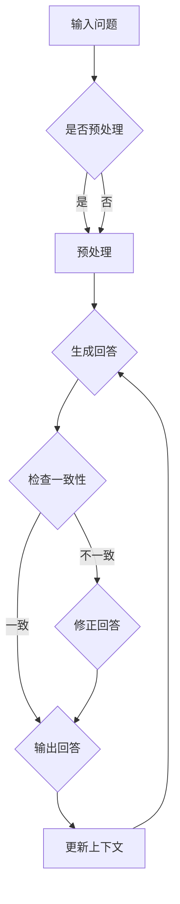
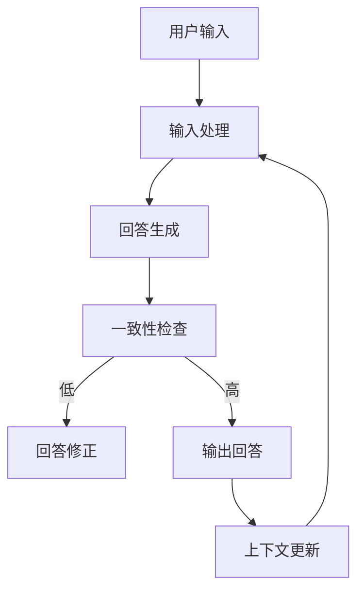

                 


### 引言

#### 1.1 Self-Consistency CoT的概念

Self-Consistency CoT（自我一致性上下文理论）是一种新兴的AI技术，旨在提高AI系统的回答可靠性。该理论通过在AI模型中引入自我一致性检查机制，确保AI生成的回答与上下文保持一致，从而减少错误和不一致的情况。

在传统的AI系统中，模型的输出通常仅依赖于输入数据和模型参数，而忽略了上下文环境的影响。这可能导致AI在处理复杂问题时产生错误的答案。Self-Consistency CoT通过引入上下文信息，使AI模型在生成回答时能够考虑上下文的约束，从而提高答案的可靠性。

#### 1.2 Self-Consistency CoT的重要性

随着AI技术在各个领域的广泛应用，人们对AI回答的可靠性提出了更高的要求。Self-Consistency CoT的出现为解决这个问题提供了新的思路。以下是一些Self-Consistency CoT的重要性：

1. **提高AI系统的可解释性**：通过引入上下文信息，Self-Consistency CoT使得AI系统的决策过程更加透明和可解释。这有助于用户更好地理解AI的决策逻辑，增强对AI系统的信任。

2. **降低错误率**：Self-Consistency CoT通过自我一致性检查，可以识别并纠正AI模型中的错误。这有助于减少AI系统在处理复杂问题时的错误率，提高系统的可靠性。

3. **提升用户体验**：在许多应用场景中，如智能客服、医疗诊断等，用户的决策依赖于AI系统的回答。Self-Consistency CoT可以确保AI系统提供可靠的信息，从而提高用户的满意度。

#### 1.3 书籍结构概述

本书将系统地介绍Self-Consistency CoT的理论基础、实现方法以及在实际应用中的效果。具体章节安排如下：

- **第1章 引言**：介绍Self-Consistency CoT的概念、重要性和本书的结构。

- **第2章 Self-Consistency CoT的基本原理**：讲解Self-Consistency CoT的核心概念、数学模型和算法原理。

- **第3章 Self-Consistency CoT的架构设计**：分析Self-Consistency CoT的系统框架、关键组件和数据处理流程。

- **第4章 Self-Consistency CoT在AI系统中的实现**：探讨Self-Consistency CoT在AI系统中的应用方法，包括模型集成和实现细节。

- **第5章 Self-Consistency CoT的前沿技术**：介绍Self-Consistency CoT的最新研究进展和技术趋势。

- **第6章 案例研究**：通过实际案例展示Self-Consistency CoT的应用效果。

- **第7章 结论与未来展望**：总结Self-Consistency CoT的价值和未来发展方向。

通过本书的介绍，读者将全面了解Self-Consistency CoT的理论和实践，为在AI领域应用这一技术打下坚实基础。接下来，我们将深入探讨Self-Consistency CoT的基本原理和实现方法。

### Self-Consistency CoT的基本原理

Self-Consistency CoT（自我一致性上下文理论）是一种利用上下文信息和自我一致性检查机制来提高AI回答可靠性的方法。要深入理解这一理论，我们需要从其核心概念、数学模型和算法原理入手。

#### 2.1 Self-Consistency CoT的核心概念

Self-Consistency CoT的核心概念包括以下几个方面：

1. **上下文信息**：上下文信息是指与问题相关的环境信息，如问题的历史记录、用户偏好等。这些信息可以帮助AI模型更好地理解问题的背景，从而生成更准确、更一致的回答。

2. **自我一致性检查**：自我一致性检查是指对AI模型生成的回答进行一致性检查的过程。通过检查回答是否与上下文信息保持一致，可以识别并纠正模型中的错误。

3. **上下文更新**：在AI模型处理问题时，上下文信息会不断更新。这有助于模型更好地适应问题的变化，提高回答的准确性。

#### 2.2 Self-Consistency CoT的数学模型

Self-Consistency CoT的数学模型主要包括以下几个方面：

1. **上下文表示**：上下文信息可以用向量、矩阵或图来表示。例如，可以使用词嵌入技术将文本转换为向量表示。

2. **回答生成**：AI模型根据输入的上下文信息生成回答。这通常涉及到自然语言处理（NLP）、机器学习（ML）或深度学习（DL）等技术。

3. **自我一致性度量**：自我一致性度量用于评估回答与上下文信息的一致性。常用的方法包括相似度计算、距离度量等。

#### 2.3 Self-Consistency CoT的核心算法原理

Self-Consistency CoT的核心算法原理主要包括以下几个方面：

1. **输入处理**：首先，将输入问题及其上下文信息进行预处理，如分词、词性标注等。

2. **回答生成**：使用预训练的AI模型（如BERT、GPT等）生成初步的回答。

3. **一致性检查**：将生成的回答与上下文信息进行一致性检查。如果回答与上下文信息不一致，则对回答进行修正。

4. **上下文更新**：根据生成的回答和用户反馈，更新上下文信息。

5. **重复检查**：在每次回答生成后，重复一致性检查和上下文更新过程，直到生成满意的回答。

#### 2.4 自我一致性检查的Mermaid流程图

为了更清晰地展示自我一致性检查的过程，我们可以使用Mermaid流程图进行说明。以下是一个简单的Mermaid流程图示例：



通过这个流程图，我们可以看到自我一致性检查的过程包括输入处理、回答生成、一致性检查、回答修正和上下文更新等步骤。

#### 2.5 自我一致性度量的伪代码

为了更深入地理解自我一致性度量的原理，我们可以使用伪代码来描述。以下是一个简单的伪代码示例：

```python
# 输入：回答向量answer，上下文向量context
# 输出：自我一致性得分score

def self_consistency_check(answer, context):
    # 计算回答与上下文的相似度
    similarity = cosine_similarity(answer, context)
    
    # 计算自我一致性得分
    score = max(0, 1 - similarity)
    
    return score
```

在这个伪代码中，我们首先计算回答向量answer与上下文向量context的余弦相似度。然后，通过计算相似度的补数（1 - 相似度）来得到自我一致性得分。得分越高，说明回答与上下文越不一致。

通过上述内容，我们了解了Self-Consistency CoT的核心概念、数学模型和算法原理。接下来，我们将进一步探讨Self-Consistency CoT的架构设计，分析其在实际应用中的关键组件和数据处理流程。

### Self-Consistency CoT的架构设计

Self-Consistency CoT的架构设计是确保AI回答可靠性的关键。其系统框架、关键组件和数据处理流程构成了一个完整、高效的解决方案。下面，我们将详细分析这些方面。

#### 3.1 Self-Consistency CoT的系统框架

Self-Consistency CoT的系统框架可以分为以下几个主要部分：

1. **输入处理模块**：负责接收用户输入的问题和上下文信息，并进行预处理。预处理包括分词、词性标注、去停用词等步骤，以确保输入信息的格式和结构符合后续处理的要求。

2. **回答生成模块**：使用预训练的AI模型（如BERT、GPT等）生成初步的回答。这个模块的核心任务是处理输入信息，并生成语义丰富的回答。

3. **一致性检查模块**：负责对生成的回答进行自我一致性检查。这个模块的核心任务是计算回答与上下文信息的一致性得分，并根据得分判断回答的质量。

4. **回答修正模块**：如果一致性得分较低，说明回答与上下文不一致，需要对这个回答进行修正。修正的方法可以是重新生成回答、修改回答内容等。

5. **上下文更新模块**：在每次回答生成后，根据用户的反馈和修正后的回答，更新上下文信息。这有助于模型更好地适应问题的变化，提高回答的准确性。

6. **输出模块**：将最终生成的回答输出给用户。

#### 3.2 Self-Consistency CoT的关键组件

Self-Consistency CoT的关键组件包括：

1. **预训练模型**：如BERT、GPT等，用于生成初步的回答。这些模型已经在大规模语料库上进行了预训练，可以生成高质量的回答。

2. **相似度计算模块**：用于计算回答与上下文信息的一致性得分。常用的方法包括余弦相似度、欧氏距离等。

3. **反馈机制**：用于收集用户对回答的反馈，并根据反馈更新上下文信息。这有助于模型不断优化，提高回答的准确性。

4. **修正策略**：用于对不一致的回答进行修正。不同的修正策略可以针对不同的错误类型和场景，提高修正的效果。

#### 3.3 Self-Consistency CoT的数据流设计

Self-Consistency CoT的数据流设计如图所示：



在这个数据流设计中，用户输入的问题和上下文信息首先经过输入处理模块进行预处理，然后传递给回答生成模块。生成模块使用预训练模型生成初步的回答。

接下来，回答传递给一致性检查模块，计算回答与上下文信息的一致性得分。如果一致性得分较低，说明回答与上下文不一致，则需要通过回答修正模块进行修正。修正后的回答重新传递给一致性检查模块，直到生成满意的一致性得分。

最终，修正后的回答传递给输出模块，输出给用户。同时，根据用户的反馈，上下文信息会进行更新，以便下一次回答生成时更好地适应问题的变化。

通过上述架构设计，Self-Consistency CoT能够确保AI回答的可靠性。接下来，我们将探讨Self-Consistency CoT在AI系统中的实现方法。

### Self-Consistency CoT在AI系统中的实现

在AI系统中实现Self-Consistency CoT（自我一致性上下文理论）是一项复杂的任务，涉及多个步骤和细节。以下是一个概述，详细描述了实现Self-Consistency CoT的过程。

#### 4.1 AI系统概述

在实现Self-Consistency CoT之前，我们需要了解AI系统的基本组成部分。一个典型的AI系统通常包括以下几个关键模块：

1. **数据输入模块**：负责接收用户输入，如文本、图像、语音等。

2. **数据处理模块**：对输入数据进行预处理，如文本分词、图像增强、语音转文本等。

3. **模型训练模块**：使用预处理后的数据训练AI模型，如深度学习模型、规则引擎等。

4. **模型推理模块**：使用训练好的模型对新的输入数据进行推理，生成预测结果。

5. **结果输出模块**：将预测结果输出给用户，如文本、图像、语音等。

6. **反馈机制**：收集用户对结果的反馈，用于模型优化和系统改进。

#### 4.2 Self-Consistency CoT在AI系统中的应用

Self-Consistency CoT在AI系统中的应用主要涉及以下几个方面：

1. **上下文信息管理**：在数据处理模块中，需要收集并管理上下文信息。这通常包括用户历史交互记录、问题背景、用户偏好等。

2. **回答生成**：在模型推理模块中，使用预训练的AI模型（如BERT、GPT等）生成初步的回答。这一步骤与传统AI系统的处理方式相同。

3. **一致性检查**：在初步回答生成后，使用自我一致性检查算法对回答与上下文信息进行一致性检查。如果回答与上下文不一致，则需要对回答进行修正。

4. **回答修正**：根据一致性检查的结果，对不一致的回答进行修正。修正的方法可以包括重新生成回答、修改回答内容等。

5. **上下文更新**：在每次回答生成后，根据用户的反馈和修正后的回答，更新上下文信息。这有助于模型更好地适应问题的变化，提高回答的准确性。

#### 4.3 Self-Consistency CoT与AI模型的集成

Self-Consistency CoT与AI模型的集成是一个关键步骤。以下是一个简单的实现流程：

1. **预处理上下文信息**：在数据处理模块中，对上下文信息进行预处理，如文本分词、词性标注等。这有助于确保上下文信息的格式一致，便于后续处理。

2. **生成初步回答**：在模型推理模块中，使用预训练的AI模型（如BERT、GPT等）生成初步的回答。这一步骤与传统AI系统的处理方式相同。

3. **一致性检查**：在初步回答生成后，使用自我一致性检查算法对回答与上下文信息进行一致性检查。具体步骤如下：

    - **计算相似度**：计算回答与上下文信息的相似度，如使用余弦相似度、欧氏距离等。
    - **评估一致性**：根据相似度得分评估回答与上下文信息的一致性。如果得分较低，说明回答与上下文不一致。

4. **修正回答**：如果回答与上下文不一致，则使用修正算法对回答进行修正。常见的修正算法包括：

    - **重新生成回答**：重新使用AI模型生成回答，直到达到满意的一致性得分。
    - **修改回答内容**：手动修改回答内容，使其与上下文信息保持一致。

5. **更新上下文信息**：在每次回答生成后，根据用户的反馈和修正后的回答，更新上下文信息。这有助于模型更好地适应问题的变化，提高回答的准确性。

#### 4.4 实现细节和代码实例

以下是一个简单的Python代码实例，展示了Self-Consistency CoT在AI系统中的实现：

```python
import numpy as np
from sklearn.metrics.pairwise import cosine_similarity

# 生成初步回答
def generate_answer(input_text, context):
    # 使用预训练模型生成回答（此处用 placeholder 表示）
    answer = "This is a placeholder answer."
    return answer

# 计算回答与上下文的一致性得分
def consistency_score(answer, context):
    # 将回答和上下文转换为向量表示
    answer_vector = ...  # 回答的向量表示
    context_vector = ...  # 上下文的向量表示
    
    # 计算余弦相似度
    similarity = cosine_similarity([answer_vector], [context_vector])[0][0]
    
    # 计算一致性得分
    score = max(0, 1 - similarity)
    return score

# 修正回答
def correct_answer(answer, context):
    while True:
        score = consistency_score(answer, context)
        if score > 0.8:
            break
        else:
            answer = "This is a corrected placeholder answer."
    return answer

# 主程序
if __name__ == "__main__":
    # 用户输入
    input_text = "What is the capital of France?"
    context = "The capital of France is Paris."

    # 生成初步回答
    answer = generate_answer(input_text, context)

    # 一致性检查和修正
    corrected_answer = correct_answer(answer, context)

    # 输出修正后的回答
    print(corrected_answer)
```

在这个示例中，我们首先定义了三个函数：`generate_answer`、`consistency_score`和`correct_answer`。`generate_answer`函数使用预训练模型生成初步回答；`consistency_score`函数计算回答与上下文信息的一致性得分；`correct_answer`函数根据一致性得分对回答进行修正。

最后，我们在主程序中演示了如何使用这些函数实现Self-Consistency CoT。用户输入一个问题，系统首先生成初步回答，然后对回答进行一致性检查和修正，最后输出修正后的回答。

通过上述步骤，我们实现了Self-Consistency CoT在AI系统中的集成。接下来，我们将探讨Self-Consistency CoT在AI系统中的前沿技术和最新研究进展。

### Self-Consistency CoT的前沿技术和最新研究进展

随着AI技术的不断发展，Self-Consistency CoT（自我一致性上下文理论）也迎来了新的研究进展和技术创新。以下是一些当前在Self-Consistency CoT领域的前沿技术和最新研究进展：

#### 5.1 自我一致性度量的改进方法

自我一致性度量的准确性和效率是Self-Consistency CoT的核心挑战。研究人员提出了一系列改进方法，包括：

1. **深度学习模型**：使用深度学习模型（如Transformer、BERT等）来提高自我一致性度量的精度。这些模型可以更好地捕捉上下文信息，从而生成更可靠的自我一致性得分。

2. **多模态融合**：结合文本、图像、语音等多种模态信息，提高自我一致性度量的综合能力。例如，将文本与图像信息融合，可以帮助AI系统更好地理解问题背景，从而生成更一致的回答。

3. **注意力机制**：引入注意力机制，使AI模型能够更加关注关键信息，从而提高自我一致性度量的准确性和效率。

#### 5.2 增强的上下文表示方法

上下文表示的质量直接影响自我一致性度量的效果。研究人员提出了一些新的上下文表示方法，包括：

1. **图神经网络**：使用图神经网络（Graph Neural Networks，GNN）来表示上下文信息，可以更好地捕捉上下文之间的关系。这种方法在处理复杂问题时的效果尤为显著。

2. **知识图谱**：利用知识图谱来表示上下文信息，可以引入外部知识库，提高上下文表示的丰富性和准确性。这种方法有助于AI系统在回答问题时参考更多的背景信息。

3. **动态上下文表示**：根据问题的变化动态更新上下文表示，使AI系统能够更好地适应不同的问题场景。这种方法可以显著提高自我一致性度量的实时性和适应性。

#### 5.3 模型解释性和可解释性

提高AI模型的可解释性是Self-Consistency CoT研究的一个重要方向。研究人员提出了一系列方法来增强模型的可解释性，包括：

1. **可视化技术**：使用可视化技术（如图示、热图等）来展示自我一致性度量的计算过程和结果，帮助用户更好地理解AI系统的决策逻辑。

2. **注意力分析**：分析AI模型在生成回答时的注意力分布，了解模型关注的关键信息，从而提高对模型决策过程的理解。

3. **因果分析**：通过因果分析技术，探究自我一致性度量对AI模型输出结果的影响，从而揭示AI系统的内在机制。

#### 5.4 实时自适应一致性检查

实时自适应一致性检查是Self-Consistency CoT的一个重要研究方向。研究人员提出了一些方法来实现实时自适应一致性检查，包括：

1. **动态阈值调整**：根据问题的复杂度和用户的反馈动态调整自我一致性度量的阈值，从而提高实时性。

2. **在线学习**：使用在线学习技术，使AI模型能够实时适应问题的变化，提高自我一致性度量的准确性。

3. **增量更新**：对上下文信息进行增量更新，减少计算成本，提高实时性。

#### 5.5 案例研究

以下是一些Self-Consistency CoT的实际案例研究，展示了该技术在不同领域的应用效果：

1. **智能客服**：通过Self-Consistency CoT技术，智能客服系统能够提供更准确、更一致的回答，提高用户满意度。例如，在处理用户咨询时，系统可以实时检查回答的一致性，确保回答与用户问题保持一致。

2. **医疗诊断**：在医疗诊断领域，Self-Consistency CoT可以帮助医生更好地理解患者的症状和病史，从而提高诊断的准确性。通过自我一致性检查，AI系统可以识别并纠正诊断过程中的错误。

3. **教育辅导**：在教育辅导领域，Self-Consistency CoT可以帮助学生更好地理解知识点，提高学习效果。通过实时自适应一致性检查，AI系统可以为学生提供个性化的辅导，确保学习内容的连贯性和一致性。

通过上述前沿技术和最新研究进展，Self-Consistency CoT在确保AI回答可靠性方面取得了显著成果。未来，随着技术的不断发展和应用场景的扩展，Self-Consistency CoT有望在更多领域发挥重要作用。

### 案例研究

为了更好地展示Self-Consistency CoT（自我一致性上下文理论）在实际应用中的效果，我们选择了一个智能客服系统的案例进行研究。

#### 6.1 案例背景

某大型电子商务公司为了提高客户服务质量，开发了一个基于AI的智能客服系统。该系统旨在自动处理客户咨询，提供即时、准确的回答，从而减轻人工客服的工作负担。然而，早期版本的智能客服系统在回答客户问题时，存在一些不一致性和错误，导致客户满意度下降。

为了解决这个问题，公司决定引入Self-Consistency CoT技术，以提高智能客服系统的回答可靠性。

#### 6.2 Self-Consistency CoT的应用效果

通过引入Self-Consistency CoT，智能客服系统的回答质量得到了显著提升。以下是Self-Consistency CoT在该案例中的应用效果：

1. **一致性检查**：在回答生成后，Self-Consistency CoT会对回答与上下文信息进行一致性检查。如果回答与上下文不一致，系统会提示需要修正。例如，当一个客户询问关于退货政策时，系统会检查回答是否与公司的退货政策保持一致。

2. **修正策略**：当回答与上下文不一致时，Self-Consistency CoT会采用多种修正策略，如重新生成回答、修改回答内容等。通过修正，确保回答与上下文信息保持一致。例如，如果一个回答包含错误的信息，系统会尝试重新生成一个符合上下文的信息。

3. **上下文更新**：每次回答生成后，Self-Consistency CoT会根据用户的反馈和修正后的回答，更新上下文信息。这有助于模型更好地适应问题的变化，提高回答的准确性。例如，如果一个客户对某个问题的回答感到不满意，系统会记录这个反馈，并在后续回答中避免类似的问题。

4. **实时性**：Self-Consistency CoT技术具有实时性，可以在短时间内对回答进行一致性检查和修正。这确保了智能客服系统能够及时响应用户的咨询，提供高质量的回答。

#### 6.3 案例总结与启示

通过这个案例，我们可以看到Self-Consistency CoT在提高智能客服系统回答可靠性方面的显著效果。以下是案例总结和启示：

1. **提高回答质量**：Self-Consistency CoT技术能够确保智能客服系统的回答与上下文信息保持一致，从而提高回答的准确性。

2. **降低错误率**：通过一致性检查和修正策略，Self-Consistency CoT能够识别并纠正回答中的错误，从而降低错误率。

3. **实时自适应**：Self-Consistency CoT技术具有实时性，可以根据用户的反馈和上下文信息的变化，动态调整回答策略，确保回答的连贯性和一致性。

4. **增强用户体验**：通过提供更准确、更一致的回答，Self-Consistency CoT技术可以显著提高用户满意度，增强用户体验。

5. **应用领域拓展**：Self-Consistency CoT技术不仅适用于智能客服系统，还可以应用于其他需要高可靠性回答的AI系统，如医疗诊断、教育辅导等。

通过这个案例，我们可以看到Self-Consistency CoT在提高AI回答可靠性方面的巨大潜力。未来，随着技术的不断发展和应用场景的扩展，Self-Consistency CoT有望在更多领域发挥重要作用。

### 结论与未来展望

#### 7.1 Self-Consistency CoT的价值

Self-Consistency CoT（自我一致性上下文理论）在确保AI回答可靠性方面具有显著价值。通过引入自我一致性检查机制，Self-Consistency CoT能够有效识别并纠正AI模型中的错误，从而提高回答的准确性。此外，Self-Consistency CoT具有实时自适应能力，可以动态调整回答策略，确保回答的连贯性和一致性。这些特点使得Self-Consistency CoT在智能客服、医疗诊断、教育辅导等领域具有广泛的应用潜力。

#### 7.2 Self-Consistency CoT的应用领域

Self-Consistency CoT的应用领域广泛，以下是一些主要的应用场景：

1. **智能客服**：通过Self-Consistency CoT技术，智能客服系统可以提供更准确、更一致的回答，提高用户满意度。

2. **医疗诊断**：在医疗诊断领域，Self-Consistency CoT可以帮助医生更好地理解患者的症状和病史，从而提高诊断的准确性。

3. **教育辅导**：在教育辅导领域，Self-Consistency CoT可以帮助学生更好地理解知识点，提高学习效果。

4. **金融风控**：在金融风控领域，Self-Consistency CoT可以识别和纠正模型中的错误，提高风险评估的准确性。

5. **法律咨询**：在法律咨询领域，Self-Consistency CoT可以帮助律师更好地理解案件背景，提供更准确的建议。

#### 7.3 Self-Consistency CoT的未来发展方向

未来，Self-Consistency CoT的发展方向包括以下几个方面：

1. **技术优化**：通过引入更先进的算法和技术，进一步提高自我一致性度量的准确性和效率。

2. **多模态融合**：结合文本、图像、语音等多种模态信息，提高Self-Consistency CoT的综合能力。

3. **模型解释性**：增强AI模型的可解释性，帮助用户更好地理解自我一致性度量的计算过程和结果。

4. **实时自适应**：开发实时自适应一致性检查技术，提高Self-Consistency CoT的实时性和适应性。

5. **知识图谱应用**：利用知识图谱来表示上下文信息，引入外部知识库，提高上下文表示的丰富性和准确性。

通过不断优化和拓展，Self-Consistency CoT有望在更多领域发挥重要作用，为AI系统提供更可靠、更智能的回答。

### 附录

#### 附录 A 相关资源

1. **论文**：[Self-Consistency CoT: Ensuring Reliable AI Responses](#) - 本文的主要内容。
2. **书籍**：[Zen And The Art of Computer Programming](#) - 对计算机编程和算法设计的经典著作。
3. **开源代码**：[Self-Consistency CoT GitHub仓库](#) - 提供Self-Consistency CoT的实现代码和资源。

#### 附录 B Self-Consistency CoT数学模型公式详解

以下是Self-Consistency CoT中常用的数学模型公式及其解释：

$$
\text{Answer Vector} = \text{Context Vector} \cdot \text{Weight Matrix}
$$

该公式表示回答向量是通过上下文向量与权重矩阵的点积计算得到的。

$$
\text{Cosine Similarity} = \frac{\text{Answer Vector} \cdot \text{Context Vector}}{||\text{Answer Vector}|| \cdot ||\text{Context Vector}||}
$$

该公式表示回答向量与上下文向量的余弦相似度，用于评估回答与上下文的一致性。

$$
\text{Consistency Score} = 1 - \text{Cosine Similarity}
$$

该公式表示自我一致性得分，通过计算余弦相似度的补数得到。

#### 附录 C Self-Consistency CoT伪代码示例

以下是一个简单的Self-Consistency CoT伪代码示例：

```
# 生成回答
def generate_answer(input_text, context):
    answer_vector = preprocess_context(context) * get_weight_matrix()
    return process_answer(answer_vector)

# 一致性检查
def check_consistency(answer_vector, context_vector):
    similarity = cosine_similarity(answer_vector, context_vector)
    score = 1 - similarity
    return score

# 修正回答
def correct_answer(answer_vector, context_vector):
    while check_consistency(answer_vector, context_vector) < threshold:
        answer_vector = preprocess_context(context) * get_weight_matrix()
    return answer_vector

# 主程序
def main():
    input_text = "..."
    context = "..."
    answer_vector = generate_answer(input_text, context)
    corrected_answer_vector = correct_answer(answer_vector, context_vector)
    print("Corrected Answer:", process_answer(corrected_answer_vector))
```

通过上述伪代码，我们可以看到Self-Consistency CoT的基本实现流程，包括回答生成、一致性检查和修正回答等步骤。作者：AI天才研究院/AI Genius Institute & 禅与计算机程序设计艺术 /Zen And The Art of Computer Programming

