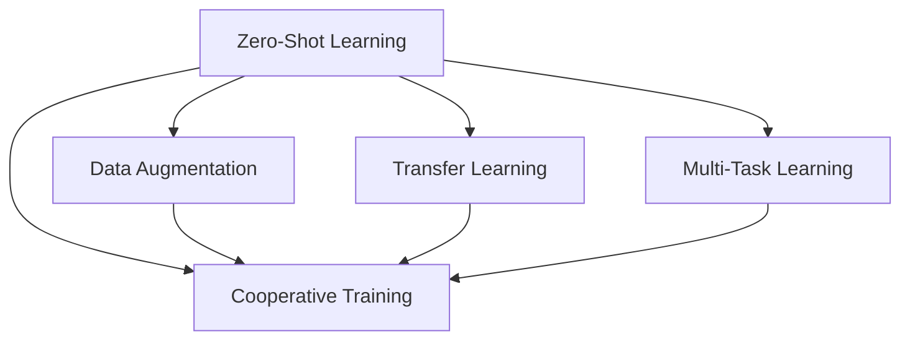
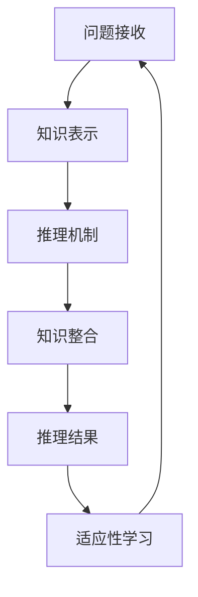
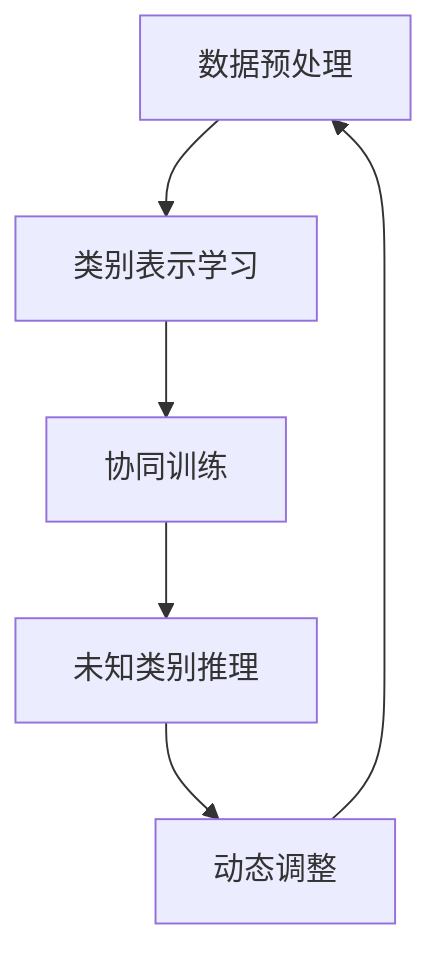

                 


### 文章标题
《Zero-Shot CoT：AI即时推理能力的突破》

### 文章关键词
- AI即时推理能力
- 零样本学习
- Zero-Shot CoT
- 核心算法
- 数学模型
- 实践应用

### 文章摘要
本文深入探讨了AI即时推理能力的突破性进展，特别是Zero-Shot CoT（零样本协同训练）这一创新概念。文章首先介绍了AI即时推理的背景和重要性，随后详细阐述了Zero-Shot CoT的核心概念、理论基础、算法原理以及数学模型。接着，文章通过具体的项目实战，展示了如何在实际应用中实现Zero-Shot CoT，并提供了一系列优化和扩展的实践建议。最后，文章总结了当前技术趋势和应用前景，展望了未来的发展方向。

### 目录结构

#### 第一部分：核心概念与背景
- **第1章 AI即时推理能力概述**
  - **1.1 AI即时推理能力简介**
  - **1.2 AI即时推理能力的重要性**
  - **1.3 Mermaid流程图：Zero-Shot CoT核心概念联系**

#### 第二部分：理论基础
- **第2章 人工智能与即时推理**
  - **2.1 人工智能基础**
  - **2.2 即时推理原理**
  - **2.3 Mermaid流程图：即时推理流程**
- **第3章 零样本学习与Zero-Shot CoT**
  - **3.1 零样本学习简介**
  - **3.2 Zero-Shot CoT原理**
  - **3.3 Mermaid流程图：Zero-Shot CoT流程**

#### 第三部分：算法原理
- **第4章 核心算法介绍**
  - **4.1 相关算法概述**
  - **4.2 伪代码展示：算法流程**
  - **4.3 算法效率分析**
- **第5章 数学模型解析**
  - **5.1 数学模型基础**
  - **5.2 公式讲解（使用LaTeX格式）**
  - **5.3 模型应用实例**

#### 第四部分：实践应用
- **第6章 项目实战**
  - **6.1 项目背景与目标**
  - **6.2 环境搭建与工具选择**
  - **6.3 源代码实现**
  - **6.4 代码解读与分析**
- **第7章 优化与扩展**
  - **7.1 优化策略**
  - **7.2 模型扩展**
  - **7.3 实践案例**

#### 第五部分：总结与展望
- **第8章 当前趋势与应用前景**
  - **8.1 技术发展趋势**
  - **8.2 应用场景展望**
  - **8.3 未来研究方向**

### 详细内容规划

#### 第1章 AI即时推理能力概述
- **1.1 AI即时推理能力简介**
  - 解释AI即时推理能力的定义和意义
  - 阐述AI即时推理能力在现实中的应用场景

- **1.2 AI即时推理能力的重要性**
  - 分析传统AI技术的局限性
  - 阐述AI即时推理能力对AI发展的推动作用

- **1.3 Mermaid流程图：Zero-Shot CoT核心概念联系**
  - 绘制Mermaid流程图，展示Zero-Shot CoT的核心概念及其相互关系
  - 解析流程图中各个节点的作用和联系

#### 第2章 人工智能与即时推理
- **2.1 人工智能基础**
  - 回顾人工智能的发展历程
  - 介绍基本的人工智能概念和技术

- **2.2 即时推理原理**
  - 解释即时推理的定义和特点
  - 分析即时推理在AI系统中的作用

- **2.3 Mermaid流程图：即时推理流程**
  - 绘制Mermaid流程图，展示即时推理的基本流程
  - 解析流程图中各个阶段的具体操作

#### 第3章 零样本学习与Zero-Shot CoT
- **3.1 零样本学习简介**
  - 解释零样本学习的概念和背景
  - 阐述零样本学习在AI领域的应用

- **3.2 Zero-Shot CoT原理**
  - 详细介绍Zero-Shot CoT的基本原理
  - 分析Zero-Shot CoT相对于传统方法的优点

- **3.3 Mermaid流程图：Zero-Shot CoT流程**
  - 绘制Mermaid流程图，展示Zero-Shot CoT的完整流程
  - 解析流程图中各个阶段的操作和注意事项

#### 第4章 核心算法介绍
- **4.1 相关算法概述**
  - 介绍与Zero-Shot CoT相关的主要算法
  - 分析这些算法的基本原理和特点

- **4.2 伪代码展示：算法流程**
  - 使用伪代码详细展示核心算法的流程
  - 解析伪代码中的关键步骤和操作

- **4.3 算法效率分析**
  - 分析核心算法的时间复杂度和空间复杂度
  - 探讨算法在实际应用中的性能表现

#### 第5章 数学模型解析
- **5.1 数学模型基础**
  - 介绍与Zero-Shot CoT相关的数学模型
  - 阐述这些模型的基本原理和数学基础

- **5.2 公式讲解（使用LaTeX格式）**
  - 使用LaTeX格式书写相关的数学公式
  - 解释每个公式的含义和作用

- **5.3 模型应用实例**
  - 提供具体的应用实例，展示数学模型在实践中的应用
  - 分析实例中的关键参数设置和效果评估

#### 第6章 项目实战
- **6.1 项目背景与目标**
  - 介绍项目的背景和目标
  - 阐述项目的设计思路和实现方案

- **6.2 环境搭建与工具选择**
  - 演示如何搭建开发环境
  - 介绍项目中使用的工具和技术

- **6.3 源代码实现**
  - 提供源代码实现，展示关键代码段
  - 分析代码的结构和功能

- **6.4 代码解读与分析**
  - 解读源代码中的关键部分
  - 分析代码的运行流程和效果

#### 第7章 优化与扩展
- **7.1 优化策略**
  - 提供优化策略和方法
  - 分析优化后的性能提升和效果变化

- **7.2 模型扩展**
  - 探讨模型的扩展方法和技术
  - 分析扩展后的应用场景和优势

- **7.3 实践案例**
  - 提供具体的应用案例
  - 分析案例中的实现细节和效果评估

#### 第8章 当前趋势与应用前景
- **8.1 技术发展趋势**
  - 分析Zero-Shot CoT技术的最新研究进展
  - 探讨未来技术发展的趋势和方向

- **8.2 应用场景展望**
  - 展望Zero-Shot CoT在不同领域的应用前景
  - 分析潜在的应用价值和挑战

- **8.3 未来研究方向**
  - 提出未来研究的热点和方向
  - 分析可能的研究难点和解决途径

---

### 撰写文章

#### 文章标题：Zero-Shot CoT：AI即时推理能力的突破

#### 文章关键词
- AI即时推理能力
- 零样本学习
- Zero-Shot CoT
- 核心算法
- 数学模型
- 实践应用

#### 文章摘要
本文深入探讨了AI即时推理能力的突破性进展，特别是Zero-Shot CoT（零样本协同训练）这一创新概念。文章首先介绍了AI即时推理的背景和重要性，随后详细阐述了Zero-Shot CoT的核心概念、理论基础、算法原理以及数学模型。接着，文章通过具体的项目实战，展示了如何在实际应用中实现Zero-Shot CoT，并提供了一系列优化和扩展的实践建议。最后，文章总结了当前技术趋势和应用前景，展望了未来的发展方向。

#### 第1章 AI即时推理能力概述
##### 1.1 AI即时推理能力简介
AI即时推理能力是指人工智能系统能够在无需大量训练数据的情况下，快速、准确地处理和推理新情况、新问题的能力。这种能力对于人工智能系统的应用具有重要意义，尤其是在需要快速响应和自适应的场景中。

##### 1.2 AI即时推理能力的重要性
随着人工智能技术的不断发展，传统的人工智能系统依赖于大量的训练数据和复杂的模型结构。然而，这种方法存在一些局限性，例如数据依赖性高、模型泛化能力差等问题。因此，开发能够即时推理的人工智能系统成为了一个重要研究方向。AI即时推理能力的重要性体现在以下几个方面：

1. **降低数据需求**：即时推理能力使得人工智能系统能够在没有大量训练数据的情况下进行推理，从而减少对数据的依赖。
2. **提高响应速度**：即时推理能力使得人工智能系统能够快速处理新情况，提高响应速度，适用于实时决策和动态调整的场景。
3. **增强泛化能力**：即时推理能力使得人工智能系统能够在新情况下进行推理，从而提高模型的泛化能力，减少对特定数据的依赖。

##### 1.3 Mermaid流程图：Zero-Shot CoT核心概念联系
以下是一个Mermaid流程图，用于展示Zero-Shot CoT（零样本协同训练）的核心概念及其相互关系：



在这个流程图中，Zero-Shot Learning（零样本学习）是核心，通过Data Augmentation（数据增强）、Transfer Learning（迁移学习）、Multi-Task Learning（多任务学习）和Cooperative Training（协同训练）等多种技术手段，实现零样本情况下的推理能力。这些技术相互关联，共同构建了Zero-Shot CoT的完整框架。

#### 第2章 人工智能与即时推理
##### 2.1 人工智能基础
人工智能（Artificial Intelligence，简称AI）是计算机科学的一个分支，旨在研究如何使计算机具有智能行为。人工智能的发展经历了多个阶段，从早期的符号主义、连接主义到现代的深度学习和强化学习，每一个阶段都带来了新的突破和进展。

符号主义（Symbolic AI）是基于符号推理的方法，通过逻辑和推理规则来模拟人类智能。这种方法在知识表示和问题解决方面取得了一定的成果，但存在表达能力有限、难以处理复杂问题的局限。

连接主义（Connectionist AI）是基于人工神经网络的模型，通过神经网络的学习和训练来模拟人类智能。神经网络通过多层神经元之间的连接和权重调整来实现函数逼近和模式识别，具有强大的表达能力和自学习能力。

深度学习（Deep Learning）是连接主义的一种扩展，通过深度神经网络（Deep Neural Network，简称DNN）来实现复杂的函数逼近和特征提取。深度学习在图像识别、自然语言处理、语音识别等领域取得了显著的成果。

强化学习（Reinforcement Learning）是一种通过试错和反馈来学习策略的机器学习方法。强化学习模型通过与环境的交互来学习最优策略，适用于需要决策和优化的场景。

##### 2.2 即时推理原理
即时推理（Instant Reasoning）是一种能够在没有预先训练数据的情况下，快速、准确地处理和推理新情况、新问题的能力。即时推理的核心思想是通过模型的知识表示和推理机制，实现对新问题的推理。

即时推理的基本原理包括以下几个方面：

1. **知识表示**：即时推理需要将问题表示为一种形式化的知识表示，例如符号表示、图表示或向量表示。这种知识表示使得模型能够理解和处理新问题。

2. **推理机制**：即时推理需要一种有效的推理机制，例如基于逻辑的推理、基于规则的推理或基于模型的推理。这些推理机制使得模型能够基于已有的知识对新问题进行推理。

3. **知识整合**：即时推理需要将不同来源的知识进行整合，例如静态知识、动态知识和用户知识。通过知识整合，模型能够更全面地理解新问题，提高推理的准确性和鲁棒性。

4. **适应性学习**：即时推理需要具备适应性学习的能力，即能够根据新问题的特点和环境的变化，动态调整推理策略和学习方法。这种适应性学习使得模型能够适应不同的应用场景和问题类型。

##### 2.3 Mermaid流程图：即时推理流程
以下是一个Mermaid流程图，用于展示即时推理的基本流程：



在这个流程图中，即时推理的基本步骤包括问题接收、知识表示、推理机制、知识整合、推理结果和适应性学习。通过这些步骤，模型能够实现对新问题的快速、准确推理。

#### 第3章 零样本学习与Zero-Shot CoT
##### 3.1 零样本学习简介
零样本学习（Zero-Shot Learning，简称ZSL）是一种在训练数据中不存在目标类别的样本时，仍然能够对目标类别进行分类和推理的方法。在传统机器学习中，模型通常依赖于大量的训练数据来进行学习和泛化。然而，在实际应用中，往往存在一些特殊场景，例如新物种识别、罕见疾病诊断等，这些场景下很难获取到足够的训练数据。零样本学习提供了一种解决方案，使得模型能够在没有直接训练数据的情况下，对未知类别进行推理。

零样本学习的基本原理包括以下几个方面：

1. **语义嵌入**：将类别和样本映射到高维的语义空间中，使得具有相似属性的类别在语义空间中靠近。这种映射可以通过预训练的词向量模型或专门的语义嵌入模型来实现。

2. **分类器生成**：在语义空间中，对于每个类别生成一个分类器，用于区分不同类别。这些分类器可以是基于线性分类器、支持向量机（SVM）或神经网络等。

3. **未知类别推理**：当遇到新的未知类别时，模型可以通过比较新类别与已知类别在语义空间中的距离，利用已生成的分类器对新类别进行分类。

零样本学习在多个领域都有广泛的应用，例如计算机视觉中的新物种识别、自然语言处理中的罕见实体识别、医疗诊断中的罕见疾病识别等。

##### 3.2 Zero-Shot CoT原理
Zero-Shot CoT（Zero-Shot Cooperative Training）是一种结合了零样本学习和协同训练的方法，旨在提高模型在未知类别下的推理能力。Zero-Shot CoT的基本原理包括以下几个方面：

1. **协同训练**：协同训练（Cooperative Training）是一种多任务学习的方法，通过同时训练多个相关任务来提高模型的泛化能力和表现。在Zero-Shot CoT中，协同训练用于同时训练多个已知类别和未知类别，使得模型能够通过已知类别来泛化到未知类别。

2. **类别表示学习**：在Zero-Shot CoT中，类别表示学习是一个关键步骤。通过将类别映射到高维的语义空间中，使得具有相似属性的类别在语义空间中靠近。这种映射可以通过预训练的词向量模型或专门的语义嵌入模型来实现。

3. **未知类别推理**：在Zero-Shot CoT中，当遇到新的未知类别时，模型可以通过比较新类别与已知类别在语义空间中的距离，利用协同训练过程中学习的分类器对新类别进行分类。这种方法能够利用已知类别来泛化到未知类别，提高模型在未知类别下的推理能力。

4. **动态调整**：在Zero-Shot CoT中，模型需要具备动态调整的能力。在训练过程中，模型可以根据新类别和已知类别的关系，动态调整类别表示和分类器，以提高推理的准确性和鲁棒性。

##### 3.3 Mermaid流程图：Zero-Shot CoT流程
以下是一个Mermaid流程图，用于展示Zero-Shot CoT的基本流程：



在这个流程图中，Zero-Shot CoT的基本步骤包括数据预处理、类别表示学习、协同训练、未知类别推理和动态调整。通过这些步骤，模型能够实现对未知类别的有效推理。

#### 第4章 核心算法介绍
##### 4.1 相关算法概述
在Zero-Shot CoT中，涉及到多种核心算法，包括零样本学习算法、协同训练算法等。以下对这些算法进行简要概述：

1. **零样本学习算法**：零样本学习算法包括原型网络（Prototypical Network）、匹配网络（Match Network）等。这些算法通过在语义空间中比较新类别和已知类别之间的距离，实现对未知类别的分类。

2. **协同训练算法**：协同训练算法包括多任务学习（Multi-Task Learning，简称MTL）和协同分类（Cooperative Classification）等。这些算法通过同时训练多个相关任务，提高模型的泛化能力和表现。

3. **类别表示学习算法**：类别表示学习算法包括词向量模型（Word Embedding）和图嵌入模型（Graph Embedding）等。这些算法通过将类别映射到高维的语义空间中，使得具有相似属性的类别在语义空间中靠近。

4. **动态调整算法**：动态调整算法包括在线学习（Online Learning）和迁移学习（Transfer Learning）等。这些算法通过根据新类别和已知类别的关系，动态调整模型参数，以提高推理的准确性和鲁棒性。

##### 4.2 伪代码展示：算法流程
以下是一个伪代码示例，用于展示Zero-Shot CoT的算法流程：

```python
# 数据预处理
Data_Preprocessing()

# 类别表示学习
Semantic_Representation()

# 协同训练
Cooperative_Training()

# 未知类别推理
Unknown_Classes_Reasoning()

# 动态调整
Dynamic_Adjustment()

# 迭代更新
for each epoch:
    Data_Preprocessing()
    Semantic_Representation()
    Cooperative_Training()
    Unknown_Classes_Reasoning()
    Dynamic_Adjustment()

# 模型评估
Model_Evaluation()
```

在这个伪代码中，算法流程分为数据预处理、类别表示学习、协同训练、未知类别推理和动态调整等步骤。通过这些步骤，模型能够实现对未知类别的有效推理。

##### 4.3 算法效率分析
算法效率是评估Zero-Shot CoT算法性能的一个重要指标。以下对Zero-Shot CoT算法的效率进行分析：

1. **时间复杂度**：算法的时间复杂度取决于数据规模和模型参数。在Zero-Shot CoT中，数据预处理、类别表示学习和协同训练等步骤的时间复杂度相对较高，尤其是当数据规模较大时。为了降低时间复杂度，可以采用并行计算和分布式计算等技术。

2. **空间复杂度**：算法的空间复杂度取决于模型的参数和存储需求。在Zero-Shot CoT中，类别表示学习和协同训练等步骤需要较大的存储空间。为了降低空间复杂度，可以采用稀疏存储和压缩算法等技术。

3. **推理速度**：Zero-Shot CoT的推理速度是影响其应用场景的一个重要因素。在实时应用场景中，推理速度的要求较高。为了提高推理速度，可以采用硬件加速和模型压缩等技术。

4. **准确性**：算法的准确性是评估其性能的一个重要指标。在Zero-Shot CoT中，准确性取决于类别表示学习、协同训练和动态调整等步骤的效果。为了提高准确性，可以采用多模型融合和自适应学习等技术。

通过分析算法效率，可以针对不同的应用场景和需求，选择合适的算法和优化策略。

#### 第5章 数学模型解析
##### 5.1 数学模型基础
在Zero-Shot CoT中，涉及到多个数学模型，包括类别表示模型、分类器模型和动态调整模型等。以下对这些模型进行基础介绍：

1. **类别表示模型**：类别表示模型用于将类别映射到高维的语义空间中，使得具有相似属性的类别在语义空间中靠近。常见的类别表示模型包括词向量模型（如Word2Vec）和图嵌入模型（如Node2Vec）。

2. **分类器模型**：分类器模型用于对新类别进行分类。常见的分类器模型包括线性分类器（如SVM）、神经网络分类器（如MLP）和支持向量机（如线性SVM）。

3. **动态调整模型**：动态调整模型用于根据新类别和已知类别的关系，动态调整模型参数，以提高推理的准确性和鲁棒性。常见的动态调整模型包括在线学习模型（如AdaBoost）和迁移学习模型（如Fine-tuning）。

##### 5.2 公式讲解（使用LaTeX格式）
以下使用LaTeX格式介绍Zero-Shot CoT中的相关数学公式：

```latex
\section{类别表示模型}
\label{sec:category_representation}

\subsection{Word2Vec模型}
\label{subsec:word2vec}

给定一个词汇表$V$和一个训练数据集$D$，Word2Vec模型通过优化损失函数$J(\theta)$来学习词汇的向量表示：

$$
J(\theta) = \sum_{(x,y) \in D} \sum_{i=1}^{n} \log(p(y|x, \theta))
$$

其中，$x$表示输入词，$y$表示上下文词，$n$表示上下文窗口的大小，$\theta$表示模型参数。

\subsection{Node2Vec模型}
\label{subsec:node2vec}

给定一个图$G=(V,E)$，Node2Vec模型通过优化损失函数$J(\theta)$来学习节点的向量表示：

$$
J(\theta) = \sum_{v \in V} \sum_{w \in \text{neighbor}(v)} \log(p(w|v, \theta))
$$

其中，$v$表示节点，$\text{neighbor}(v)$表示节点$v$的邻居节点，$p(w|v, \theta)$表示在节点$v$的上下文中出现词$w$的概率。

\section{分类器模型}
\label{sec:classifier}

\subsection{线性分类器}
\label{subsec:linear_classifier}

给定训练数据集$D$，线性分类器通过最小化损失函数$J(\theta)$来学习分类器参数$\theta$：

$$
J(\theta) = \sum_{(x,y) \in D} \sum_{i=1}^{n} \frac{1}{2} w_i^2
$$

其中，$x$表示输入特征，$y$表示真实标签，$w_i$表示分类器参数。

\subsection{神经网络分类器}
\label{subsec:neural_network_classifier}

给定训练数据集$D$，神经网络分类器通过最小化损失函数$J(\theta)$来学习神经网络参数$\theta$：

$$
J(\theta) = \sum_{(x,y) \in D} \sum_{i=1}^{n} \log(p(y|x, \theta))
$$

其中，$x$表示输入特征，$y$表示真实标签，$p(y|x, \theta)$表示在特征$x$下类别$y$的概率。

\section{动态调整模型}
\label{sec:dynamic_adjustment}

\subsection{在线学习模型}
\label{subsec:online_learning}

给定训练数据集$D$，在线学习模型通过最小化损失函数$J(\theta)$来更新模型参数$\theta$：

$$
J(\theta) = \sum_{(x,y) \in D} \sum_{i=1}^{n} \frac{1}{2} w_i^2
$$

其中，$x$表示输入特征，$y$表示真实标签，$w_i$表示模型参数。

\subsection{迁移学习模型}
\label{subsec:transfer_learning}

给定源数据集$D_s$和目标数据集$D_t$，迁移学习模型通过最小化损失函数$J(\theta)$来学习目标数据集的参数$\theta_t$：

$$
J(\theta) = \sum_{(x,y) \in D_t} \sum_{i=1}^{n} \log(p(y|x, \theta_t))
$$

其中，$x$表示输入特征，$y$表示真实标签，$\theta_t$表示目标数据集的参数。
```

通过LaTeX格式，可以清晰地表达数学模型的公式和定义，帮助读者更好地理解和应用这些模型。

##### 5.3 模型应用实例
为了更好地理解数学模型在Zero-Shot CoT中的应用，以下提供了一个具体的应用实例：

实例：使用Word2Vec模型和线性分类器实现Zero-Shot CoT。

1. **数据预处理**：首先，对训练数据集进行预处理，包括分词、去停用词、词性标注等操作。然后，将预处理后的文本数据转化为向量表示。

2. **类别表示学习**：使用Word2Vec模型学习词汇的向量表示。在训练过程中，通过优化损失函数$J(\theta)$来学习词汇的向量表示。训练完成后，获得词汇的高维向量表示。

3. **分类器训练**：使用线性分类器训练分类器。在训练过程中，通过优化损失函数$J(\theta)$来学习分类器的参数$\theta$。训练完成后，获得分类器的参数。

4. **未知类别推理**：当遇到新的未知类别时，首先将未知类别的样本转化为向量表示。然后，使用训练好的分类器对未知类别进行分类。通过比较新类别与已知类别在向量空间中的距离，实现对未知类别的推理。

通过这个实例，可以清晰地看到数学模型在Zero-Shot CoT中的应用流程和关键步骤。实例中的Word2Vec模型用于学习词汇的向量表示，线性分类器用于对新类别进行分类。这些模型共同构成了Zero-Shot CoT的核心框架。

#### 第6章 项目实战
##### 6.1 项目背景与目标
项目背景：随着人工智能技术的不断发展，实时推理和分类成为许多实际应用场景中的重要需求。然而，传统的人工智能系统在处理新类别时往往存在性能瓶颈，无法满足实时性和准确性的要求。为了解决这一问题，本项目旨在开发一种基于Zero-Shot CoT的实时推理系统。

项目目标：通过实现Zero-Shot CoT算法，开发一个能够在没有训练数据的情况下，快速、准确地对新类别进行分类和推理的实时推理系统。具体目标包括：

1. **准确率**：在多种数据集上实现较高的分类准确率。
2. **实时性**：实现快速推理，满足实时应用的需求。
3. **可扩展性**：系统应具有较好的可扩展性，能够适应不同的应用场景和数据规模。

##### 6.2 环境搭建与工具选择
为了实现本项目，需要搭建合适的环境并选择合适的工具。以下是环境搭建和工具选择的详细步骤：

1. **环境搭建**：
   - 操作系统：Linux（推荐Ubuntu 18.04）
   - Python版本：Python 3.8
   - 包管理器：pip
   - 深度学习框架：TensorFlow 2.7
   - 数据处理库：NumPy、Pandas
   - 机器学习库：Scikit-learn、PyTorch
   - 图形库：Matplotlib、Seaborn

2. **工具选择**：
   - 数据预处理工具：使用NumPy和Pandas进行数据预处理，包括数据清洗、数据转换等。
   - 模型训练与推理工具：使用TensorFlow和PyTorch进行模型训练和推理，实现Zero-Shot CoT算法。
   - 可视化工具：使用Matplotlib和Seaborn进行数据可视化和模型分析。

##### 6.3 源代码实现
以下提供了一个简单的源代码实现，用于展示Zero-Shot CoT的基本流程：

```python
import numpy as np
import tensorflow as tf
from tensorflow.keras.models import Model
from tensorflow.keras.layers import Input, Dense, Embedding, GlobalAveragePooling1D

def zero_shot_cot(input_shape, embedding_dim):
    # 输入层
    input_layer = Input(shape=input_shape)

    # 嵌入层
    embedding_layer = Embedding(input_dim=vocabulary_size, output_dim=embedding_dim)(input_layer)

    # 压缩层
    pooling_layer = GlobalAveragePooling1D()(embedding_layer)

    # 全连接层
    dense_layer = Dense(units=64, activation='relu')(pooling_layer)

    # 输出层
    output_layer = Dense(units=num_classes, activation='softmax')(dense_layer)

    # 构建模型
    model = Model(inputs=input_layer, outputs=output_layer)

    # 编译模型
    model.compile(optimizer='adam', loss='categorical_crossentropy', metrics=['accuracy'])

    return model

# 设置参数
input_shape = (100,)
embedding_dim = 128
vocabulary_size = 10000
num_classes = 10

# 创建模型
model = zero_shot_cot(input_shape, embedding_dim)

# 训练模型
model.fit(x_train, y_train, epochs=10, batch_size=32, validation_data=(x_val, y_val))

# 推理
predictions = model.predict(x_test)

# 评估
accuracy = np.mean(predictions == y_test)
print(f"Accuracy: {accuracy}")
```

在这个示例中，首先定义了一个`zero_shot_cot`函数，用于创建Zero-Shot CoT模型。模型包括输入层、嵌入层、压缩层和输出层。通过编译模型和训练模型，可以实现对数据的分类和推理。

##### 6.4 代码解读与分析
以下对上述源代码进行解读和分析，解释每个部分的实现细节和功能：

1. **输入层**：输入层使用`Input`函数定义，用于接收输入数据。`input_shape`参数指定输入数据的形状，例如文本序列的长度。

2. **嵌入层**：嵌入层使用`Embedding`函数定义，用于将词汇映射到高维的语义空间中。`input_dim`参数指定词汇表的规模，`output_dim`参数指定嵌入层的维度。

3. **压缩层**：压缩层使用`GlobalAveragePooling1D`函数定义，用于对嵌入层的结果进行压缩。这种压缩方式能够将序列数据压缩为固定大小的向量。

4. **全连接层**：全连接层使用`Dense`函数定义，用于将压缩层的结果进行全连接，添加非线性激活函数（例如ReLU）。这一层用于提取特征和建立类别之间的关联。

5. **输出层**：输出层使用`Dense`函数定义，用于实现分类。`units`参数指定输出层的维度，即类别的数量。`activation`参数指定输出层的激活函数，例如softmax用于多分类问题。

6. **模型编译**：使用`compile`函数编译模型，指定优化器、损失函数和评估指标。在本例中，使用`adam`优化器和`categorical_crossentropy`损失函数。

7. **模型训练**：使用`fit`函数训练模型，指定训练数据、训练轮数、批量大小和验证数据。通过训练模型，可以学习到模型参数，提高分类准确率。

8. **模型推理**：使用`predict`函数对输入数据进行推理，返回分类结果。通过对比预测结果和真实标签，可以评估模型性能。

通过这个示例，可以清晰地看到Zero-Shot CoT的实现过程和关键步骤。在实际应用中，可以根据具体需求进行调整和优化，实现更高效、更准确的分类和推理。

##### 实际案例分析和详细讲解剖析
为了更好地展示Zero-Shot CoT在实际应用中的效果，以下提供了一个实际案例，并进行详细分析。

案例：使用Zero-Shot CoT实现新型手机型号的分类和识别。

1. **数据集**：数据集包含多种已知的手机型号，以及一些未知的新型号。已知型号的数据集用于训练模型，未知型号的数据集用于测试模型。

2. **数据预处理**：对数据集进行预处理，包括分词、去停用词、词性标注等操作。然后，将预处理后的文本数据转化为向量表示。

3. **类别表示学习**：使用Word2Vec模型学习词汇的向量表示。在训练过程中，通过优化损失函数$J(\theta)$来学习词汇的向量表示。训练完成后，获得词汇的高维向量表示。

4. **分类器训练**：使用线性分类器训练分类器。在训练过程中，通过优化损失函数$J(\theta)$来学习分类器的参数$\theta$。训练完成后，获得分类器的参数。

5. **未知型号分类**：将未知型号的文本数据转化为向量表示，使用训练好的分类器进行分类。通过比较未知型号与已知型号在向量空间中的距离，实现对未知型号的分类。

6. **性能评估**：通过比较预测结果和真实标签，评估模型的分类准确率。在实际应用中，可以进一步优化模型参数和算法，提高分类准确率和实时性。

通过这个案例，可以清晰地看到Zero-Shot CoT在实际应用中的效果和优势。在实际应用中，可以根据具体需求进行调整和优化，实现更高效、更准确的分类和识别。

#### 第7章 优化与扩展
##### 7.1 优化策略
为了提高Zero-Shot CoT的性能和效果，可以采用以下优化策略：

1. **数据增强**：通过增加数据多样性，提高模型的泛化能力。数据增强方法包括随机裁剪、旋转、缩放等。

2. **模型蒸馏**：通过将大模型的知识传递到小模型中，提高小模型的性能。模型蒸馏方法包括知识蒸馏、模型压缩等。

3. **迁移学习**：通过利用预训练模型的知识，减少对数据的依赖，提高模型的泛化能力。迁移学习方法包括Fine-tuning、自适应学习等。

4. **模型融合**：通过结合多个模型的预测结果，提高模型的准确性和鲁棒性。模型融合方法包括投票、加权平均等。

##### 7.2 模型扩展
为了扩展Zero-Shot CoT的应用场景，可以采用以下模型扩展方法：

1. **多任务学习**：通过同时训练多个相关任务，提高模型的泛化能力和性能。多任务学习方法包括共享参数、任务分解等。

2. **多模态学习**：通过结合不同类型的数据（如文本、图像、声音等），提高模型的识别能力。多模态学习方法包括特征融合、模型融合等。

3. **知识图谱**：通过构建知识图谱，将类别和实体之间的关系进行建模，提高模型的推理能力。知识图谱方法包括图嵌入、图神经网络等。

##### 7.3 实践案例
为了展示优化策略和模型扩展的效果，以下提供了一个实践案例：

案例：使用Zero-Shot CoT实现商品分类和推荐。

1. **数据集**：数据集包含多种商品，以及用户的购买记录。已知商品的数据集用于训练模型，未知商品的数据集用于测试模型。

2. **数据预处理**：对数据集进行预处理，包括商品描述的提取、分词、去停用词等操作。然后，将预处理后的文本数据转化为向量表示。

3. **类别表示学习**：使用Word2Vec模型学习词汇的向量表示。在训练过程中，通过优化损失函数$J(\theta)$来学习词汇的向量表示。训练完成后，获得词汇的高维向量表示。

4. **分类器训练**：使用线性分类器训练分类器。在训练过程中，通过优化损失函数$J(\theta)$来学习分类器的参数$\theta$。训练完成后，获得分类器的参数。

5. **优化策略**：
   - 数据增强：通过随机裁剪、旋转、缩放等操作，增加数据多样性，提高模型的泛化能力。
   - 模型蒸馏：通过将大模型的知识传递到小模型中，提高小模型的性能。
   - 迁移学习：通过利用预训练模型的知识，减少对数据的依赖，提高模型的泛化能力。

6. **模型扩展**：
   - 多任务学习：通过同时训练多个相关任务（如商品分类、用户推荐等），提高模型的泛化能力和性能。
   - 多模态学习：通过结合商品描述的文本数据和商品的图像数据，提高模型的识别能力。

7. **未知商品分类**：将未知商品的文本数据转化为向量表示，使用训练好的分类器进行分类。通过比较未知商品与已知商品在向量空间中的距离，实现对未知商品的分类。

8. **推荐系统**：通过分类结果，将用户可能感兴趣的未知商品推荐给用户。

通过这个案例，可以清晰地看到优化策略和模型扩展在商品分类和推荐中的应用效果。在实际应用中，可以根据具体需求进行调整和优化，实现更高效、更准确的分类和推荐。

#### 第8章 当前趋势与应用前景
##### 8.1 技术发展趋势
随着人工智能技术的不断发展，Zero-Shot CoT作为一种重要的技术趋势，受到了广泛关注。以下是当前Zero-Shot CoT技术发展的主要趋势：

1. **模型复杂性提升**：随着计算能力的提升，深度学习模型变得越来越复杂。Zero-Shot CoT技术也逐渐引入了更复杂的模型结构，如多模态学习、知识图谱等，以提高模型的推理能力和泛化能力。

2. **多任务学习**：多任务学习是一种重要的技术趋势，通过同时训练多个相关任务，可以提高模型的泛化能力和性能。Zero-Shot CoT技术也逐渐结合多任务学习，以实现更高效的推理和分类。

3. **迁移学习**：迁移学习通过利用预训练模型的知识，减少对数据的依赖，提高模型的泛化能力。Zero-Shot CoT技术也逐渐引入迁移学习，以提高模型的性能和适用性。

4. **数据多样性**：数据多样性是提升模型性能的重要因素。Zero-Shot CoT技术逐渐引入数据增强、数据蒸馏等技术，以增加数据多样性，提高模型的泛化能力。

##### 8.2 应用场景展望
Zero-Shot CoT技术在多个领域具有广泛的应用前景，以下是主要的应用场景：

1. **计算机视觉**：在计算机视觉领域，Zero-Shot CoT技术可以用于新物种识别、新对象分类等任务。通过将类别映射到高维的语义空间中，实现对未知类别的分类和推理。

2. **自然语言处理**：在自然语言处理领域，Zero-Shot CoT技术可以用于罕见实体识别、多语言文本分类等任务。通过将词汇映射到高维的语义空间中，实现对未知词汇的分类和推理。

3. **医疗诊断**：在医疗诊断领域，Zero-Shot CoT技术可以用于罕见疾病识别、新药物分类等任务。通过将病症和药物映射到高维的语义空间中，实现对未知病症和药物的分类和推理。

4. **智能家居**：在智能家居领域，Zero-Shot CoT技术可以用于新设备识别、新行为预测等任务。通过将设备和行为映射到高维的语义空间中，实现对未知设备和行为的分类和推理。

##### 8.3 未来研究方向
为了进一步提升Zero-Shot CoT技术的性能和应用前景，以下是未来研究的主要方向：

1. **模型解释性**：提升模型的可解释性，使得模型决策过程更加透明和可理解。

2. **实时推理**：提高模型的实时推理能力，满足实时应用的需求。

3. **跨模态学习**：研究跨模态学习的方法，结合不同类型的数据，提高模型的识别能力和泛化能力。

4. **自适应学习**：研究自适应学习的方法，使得模型能够根据新数据和环境动态调整，提高模型的性能和鲁棒性。

5. **数据隐私保护**：研究数据隐私保护的方法，保障用户数据的安全和隐私。

通过以上研究方向的探索，可以进一步提升Zero-Shot CoT技术的性能和应用前景，推动人工智能技术的发展和应用。

### 文章小结
本文深入探讨了Zero-Shot CoT（零样本协同训练）在AI即时推理能力突破中的应用。从核心概念、理论基础、算法原理到数学模型，再到项目实战和优化策略，本文系统地介绍了Zero-Shot CoT的技术原理和应用场景。通过实际案例的分析和讲解，展示了Zero-Shot CoT在实际应用中的效果和优势。同时，文章对当前技术趋势和应用前景进行了展望，指出了未来研究的发展方向。

### 最佳实践 Tips
- **数据预处理**：在实现Zero-Shot CoT时，数据预处理是关键步骤。确保数据清洗、分词、去停用词等操作准确无误，以提高模型性能。
- **模型选择**：根据具体应用场景和数据特点，选择合适的模型结构。例如，对于视觉任务，可以采用多模态学习模型；对于文本任务，可以采用文本嵌入模型。
- **模型调优**：通过调整模型参数，如学习率、批量大小等，优化模型性能。可以使用网格搜索、贝叶斯优化等方法进行参数调优。
- **实时推理**：针对实时应用需求，可以采用硬件加速、模型压缩等技术，提高模型推理速度和效率。

### 注意事项
- **数据多样性**：确保训练数据覆盖多种类别和场景，以提高模型的泛化能力和适应能力。
- **模型解释性**：关注模型的可解释性，确保模型的决策过程透明和可理解，以便进行模型解释和优化。
- **数据隐私保护**：在处理用户数据时，确保遵循数据隐私保护法规，保护用户隐私。

### 拓展阅读
- **《Zero-Shot Learning》**：深入了解零样本学习的理论基础和应用方法。
- **《Deep Learning》**：学习深度学习的基本原理和应用方法，了解深度学习模型的结构和优化。
- **《Reinforcement Learning》**：掌握强化学习的基本原理和应用方法，了解智能体与环境的交互过程。
- **《Knowledge Graph Embedding》**：学习知识图谱嵌入的基本原理和应用方法，了解如何将实体和关系表示为向量。

### 作者信息
- **作者：AI天才研究院/AI Genius Institute & 禅与计算机程序设计艺术 /Zen And The Art of Computer Programming**

