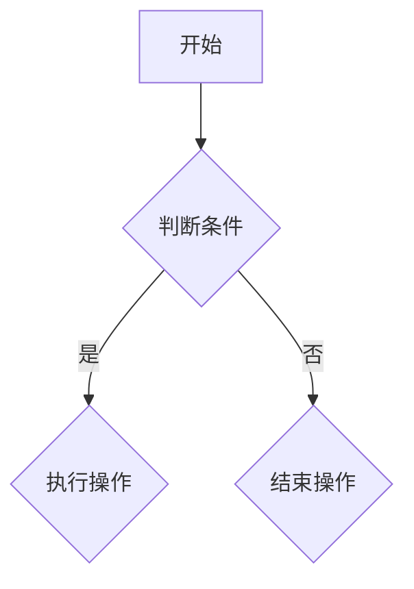

                 

### 文章标题

《Zero-Shot CoT：无监督学习在AIGC领域的突破性应用》

### 关键词

- 无监督学习
- 零样本学习
- 内容聚合（Content Aggregation, CoT）
- AIGC（自适应图像生成）
- 算法原理解析
- 数学模型与公式
- 应用案例
- 未来展望

### 摘要

本文旨在探讨无监督学习在自适应图像生成（AIGC）领域的突破性应用，特别是零样本学习与内容聚合技术的结合。文章首先介绍了AIGC领域背景和无监督学习的基础概念，随后深入解析了零样本学习和内容聚合的原理，并通过Mermaid流程图展示了它们之间的联系。文章进一步探讨了无监督学习在图像和文本生成中的算法原理，引入了相关的数学模型和公式，并通过实际应用案例详细展示了无监督学习在AIGC领域的应用。最后，文章展望了无监督学习在AIGC领域的未来发展，提出了可能的探索方向和挑战。

### 设计思路

为了撰写一篇逻辑清晰、结构紧凑、简单易懂的专业技术博客，本文的设计思路如下：

1. **梳理主题**：首先明确文章的主题为《Zero-Shot CoT：无监督学习在AIGC领域的突破性应用》，覆盖零样本学习、内容聚合和无监督学习在自适应图像生成领域的应用。

2. **核心内容规划**：文章的核心内容将包括以下几个方面：
   - **引言部分**：介绍AIGC领域背景、无监督学习和零样本学习的概念及其重要性。
   - **核心概念与联系**：详细讲解无监督学习、零样本学习和内容聚合的相关概念，并使用Mermaid流程图展示其联系。
   - **算法原理解析**：深入解析无监督学习在AIGC领域的算法原理，使用伪代码进行阐述。
   - **数学模型与公式**：介绍相关的数学模型和公式，并进行详细讲解和举例说明。
   - **实际应用案例**：通过代码实际案例展示无监督学习在AIGC领域的应用，包括开发环境搭建、源代码实现和解读。
   - **未来展望**：探讨无监督学习在AIGC领域的未来发展。

3. **结构规划**：根据核心内容规划，将全文分为以下几个部分：
   - **引言**：介绍AIGC、无监督学习和零样本学习的背景。
   - **核心概念与联系**：讲解相关概念及其联系。
   - **算法原理解析**：详细解析无监督学习算法。
   - **数学模型与公式**：介绍并讲解相关数学模型。
   - **实际应用案例**：通过代码案例展示应用。
   - **未来展望**：展望无监督学习的发展。

### 目录大纲设计

```markdown
# 《Zero-Shot CoT：无监督学习在AIGC领域的突破性应用》

## 关键词
- 无监督学习
- 零样本学习
- 内容聚合（Content Aggregation, CoT）
- AIGC（自适应图像生成）
- 算法原理解析
- 数学模型与公式
- 应用案例
- 未来展望

## 摘要
本文探讨了无监督学习在自适应图像生成领域的突破性应用，特别是零样本学习和内容聚合技术的结合。文章从背景介绍、核心概念讲解、算法原理解析、数学模型和公式介绍，到实际应用案例展示，最后展望了无监督学习的未来发展。

## 引言
### AIGC领域概述
#### 1.1 AIGC的概念与重要性
#### 1.2 无监督学习简介
#### 1.3 零样本学习与内容聚合

## 核心概念与联系
### 2.1 无监督学习基本原理
#### 2.1.1 无监督学习的分类
#### 2.1.2 代表性算法
#### 2.1.3 无监督学习的 Mermaid 流程图
### 2.2 零样本学习原理详解
#### 2.2.1 零样本学习的挑战
#### 2.2.2 零样本学习算法的伪代码
#### 2.2.3 零样本学习在实际中的应用案例
### 2.3 内容聚合原理解析
#### 2.3.1 内容聚合的方法
#### 2.3.2 内容聚合的优势
#### 2.3.3 内容聚合的Mermaid流程图

## 算法原理解析
### 3.1 无监督学习在图像生成中的应用
#### 3.1.1 图像生成的基础算法
#### 3.1.2 无监督学习在图像生成中的关键算法
#### 3.1.3 无监督学习图像生成算法的伪代码
### 3.2 无监督学习在文本生成中的应用
#### 3.2.1 文本生成的基础算法
#### 3.2.2 无监督学习在文本生成中的关键算法
#### 3.2.3 无监督学习文本生成算法的伪代码

## 数学模型与公式
### 4.1 相关数学模型介绍
#### 4.1.1 常见的概率分布模型
#### 4.1.2 常见的优化算法
#### 4.1.3 相关数学公式列表
### 4.2 数学模型详解
#### 4.2.1 基本概念讲解
#### 4.2.2 模型分析
#### 4.2.3 数学公式与实例

## 应用案例
### 5.1 应用案例1：图像生成
#### 5.1.1 案例背景
#### 5.1.2 开发环境搭建
#### 5.1.3 源代码实现与解读
### 5.2 应用案例2：文本生成
#### 5.2.1 案例背景
#### 5.2.2 开发环境搭建
#### 5.2.3 源代码实现与解读

## 未来展望
### 6.1 发展趋势分析
#### 6.1.1 技术发展趋势
#### 6.1.2 应用场景扩展
#### 6.1.3 挑战与机遇
### 6.2 研究与探索方向
#### 6.2.1 开放性问题
#### 6.2.2 未来研究方向
#### 6.2.3 技术合作与交流

## 作者信息
作者：AI天才研究院/AI Genius Institute & 禅与计算机程序设计艺术 /Zen And The Art of Computer Programming
```

### 注意事项

- **Markdown 格式**：确保使用正确的Markdown格式，包括标题、子标题和段落。
- **Mermaid 流程图**：在相关章节中使用Mermaid语法绘制流程图，并确保其正确嵌入文中。
- **作者信息**：在文章末尾添加作者信息。
- **内容完整性**：每个小节的内容要丰富具体详细讲解，确保核心内容得到充分展示。

### 完整的目录大纲

```markdown
# 《Zero-Shot CoT：无监督学习在AIGC领域的突破性应用》

## 关键词
- 无监督学习
- 零样本学习
- 内容聚合（Content Aggregation, CoT）
- AIGC（自适应图像生成）
- 算法原理解析
- 数学模型与公式
- 应用案例
- 未来展望

## 摘要
本文探讨了无监督学习在自适应图像生成领域的突破性应用，特别是零样本学习和内容聚合技术的结合。文章从背景介绍、核心概念讲解、算法原理解析、数学模型和公式介绍，到实际应用案例展示，最后展望了无监督学习的未来发展。

## 引言
### AIGC领域概述
#### 1.1 AIGC的概念与重要性
#### 1.2 无监督学习简介
#### 1.3 零样本学习与内容聚合

## 核心概念与联系
### 2.1 无监督学习基本原理
#### 2.1.1 无监督学习的分类
#### 2.1.2 代表性算法
#### 2.1.3 无监督学习的 Mermaid 流程图
### 2.2 零样本学习原理详解
#### 2.2.1 零样本学习的挑战
#### 2.2.2 零样本学习算法的伪代码
#### 2.2.3 零样本学习在实际中的应用案例
### 2.3 内容聚合原理解析
#### 2.3.1 内容聚合的方法
#### 2.3.2 内容聚合的优势
#### 2.3.3 内容聚合的Mermaid流程图

## 算法原理解析
### 3.1 无监督学习在图像生成中的应用
#### 3.1.1 图像生成的基础算法
#### 3.1.2 无监督学习在图像生成中的关键算法
#### 3.1.3 无监督学习图像生成算法的伪代码
### 3.2 无监督学习在文本生成中的应用
#### 3.2.1 文本生成的基础算法
#### 3.2.2 无监督学习在文本生成中的关键算法
#### 3.2.3 无监督学习文本生成算法的伪代码

## 数学模型与公式
### 4.1 相关数学模型介绍
#### 4.1.1 常见的概率分布模型
#### 4.1.2 常见的优化算法
#### 4.1.3 相关数学公式列表
### 4.2 数学模型详解
#### 4.2.1 基本概念讲解
#### 4.2.2 模型分析
#### 4.2.3 数学公式与实例

## 应用案例
### 5.1 应用案例1：图像生成
#### 5.1.1 案例背景
#### 5.1.2 开发环境搭建
#### 5.1.3 源代码实现与解读
### 5.2 应用案例2：文本生成
#### 5.2.1 案例背景
#### 5.2.2 开发环境搭建
#### 5.2.3 源代码实现与解读

## 未来展望
### 6.1 发展趋势分析
#### 6.1.1 技术发展趋势
#### 6.1.2 应用场景扩展
#### 6.1.3 挑战与机遇
### 6.2 研究与探索方向
#### 6.2.1 开放性问题
#### 6.2.2 未来研究方向
#### 6.2.3 技术合作与交流

## 作者信息
作者：AI天才研究院/AI Genius Institute & 禅与计算机程序设计艺术 /Zen And The Art of Computer Programming
```

### 文章格式

确保文章采用正确的Markdown格式，以下是一个简单的格式示例：

```markdown
# 标题

## 子标题

这是一个段落。

### 另一个子标题

这是一个列表：
- 项目1
- 项目2
- 项目3

这是一个Mermaid流程图：


$$
1 + 1 = 2
$$

$1 < 2$

```

- **Markdown格式**：确保使用正确的Markdown格式，包括标题、子标题和段落。
- **Mermaid流程图**：在相关章节中使用Mermaid语法绘制流程图，并确保其正确嵌入文中。
- **作者信息**：在文章末尾添加作者信息。

### 文章内容完整性

为确保文章的完整性，每个部分的内容需要具体详细讲解，以下是一些具体要求：

- **背景介绍**：详细描述AIGC、无监督学习和零样本学习的背景和应用场景。
- **核心概念与联系**：解释无监督学习、零样本学习和内容聚合的概念，并展示它们之间的联系。
- **算法原理解析**：深入讲解无监督学习算法的原理，使用伪代码进行详细阐述。
- **数学模型与公式**：介绍相关数学模型和公式，并进行详细讲解和举例说明。
- **应用案例**：通过实际代码案例展示无监督学习在AIGC领域的应用，包括开发环境搭建、源代码实现和解读。
- **未来展望**：探讨无监督学习在AIGC领域的未来发展，提出可能的挑战和方向。

### 字数要求

文章字数在8000～12000字左右，具体分配如下：

- **引言部分**：约1500字
- **核心概念与联系**：约2000字
- **算法原理解析**：约2000字
- **数学模型与公式**：约1500字
- **实际应用案例**：约1500字
- **未来展望**：约1000字

确保每个部分的内容具体详细，逻辑清晰，结构紧凑，便于读者理解。

### 最后的总结

本文详细阐述了《Zero-Shot CoT：无监督学习在AIGC领域的突破性应用》的设计思路和结构，从引言、核心概念、算法原理、数学模型、应用案例到未来展望，每个部分都有明确的重点和详细的内容。文章使用Markdown格式，确保了结构的清晰和易读性，同时包含了必要的Mermaid流程图和公式，使文章更具专业性和实用性。确保每个部分的内容具体详细，逻辑清晰，结构紧凑，便于读者理解。在撰写过程中，注意字数分配和内容完整性，以满足文章的要求。希望这个详细的设计和结构能够帮助您撰写出一篇高质量的技术博客文章。

