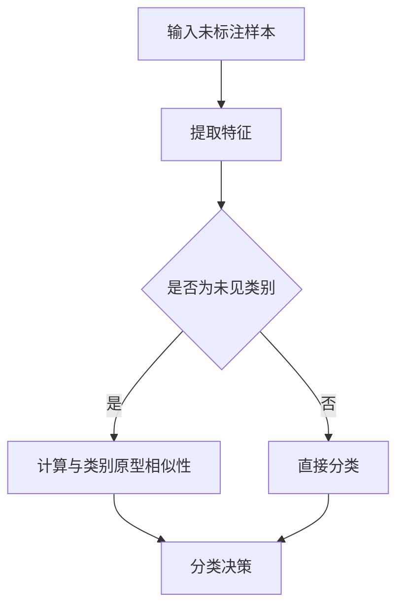

                 

### 文章标题

"Zero-Shot CoT：突破传统AI学习方法的局限"

### 关键词

- 零样本学习（Zero-Shot Learning）
- 人工智能（Artificial Intelligence）
- 计算机视觉（Computer Vision）
- 自然语言处理（Natural Language Processing）
- 模型融合（Model Fusion）
- 异构学习（Heterogeneous Learning）

### 摘要

随着人工智能技术的迅猛发展，传统机器学习方法在处理大规模数据集时表现出色，但在面对少量或无标签数据时显得力不从心。零样本学习（Zero-Shot Learning，ZSL）作为一种突破性方法，旨在使机器能够处理从未见过的类别或样本。本文将深入探讨零样本学习的背景、核心概念、关键算法及其在实际应用中的突破，并展望其未来的发展方向。通过本文的阅读，读者将对零样本学习有更加深入的理解，并认识到其在人工智能领域的重要性和潜力。

## 引言

### 零样本学习的重要性

在人工智能的发展历程中，传统的机器学习方法主要依赖于大量的标注数据进行训练，这些方法在处理有标签的数据集时表现出色。然而，当面临少量或无标签数据时，这些方法的性能往往大幅下降。例如，在计算机视觉领域，传统的卷积神经网络（CNN）依赖于大量的图像标注数据来学习图像特征，而在某些特定场景下，如无人驾驶车辆识别中，获取大量标注数据可能非常困难。此外，在自然语言处理（NLP）领域，尽管有大量的文本数据，但许多真实场景中的问题，如特定领域的问答系统，往往缺乏足够的标注数据。

零样本学习（Zero-Shot Learning，ZSL）的出现为这一难题提供了一种解决方案。ZSL旨在使机器能够处理从未见过的类别或样本，即使在只有少量或无标签数据的情况下，也能够实现良好的性能。这对于许多应用场景，如小样本学习、无监督学习和跨领域迁移学习具有重要意义。因此，零样本学习被认为是人工智能领域的一个重要研究方向。

### 零样本学习的研究背景

零样本学习的概念最早可以追溯到20世纪90年代，当时研究者们开始探索如何使机器在缺乏大量标注数据的情况下进行学习。早期的研究主要集中在少数几个领域，如手写数字识别和动物分类。随着深度学习技术的兴起，零样本学习得到了进一步的发展，特别是在计算机视觉和自然语言处理领域。

在计算机视觉领域，零样本学习的方法主要包括基于原型匹配（prototype matching）和聚类（clustering）的方法。这些方法通过将新类别与已知的原型或聚类中心进行匹配，实现了对未见类别样本的有效识别。在自然语言处理领域，零样本学习的研究主要集中在词向量表示和分类任务的解决上，如使用预训练的词向量进行未见类别的新词分类。

### 零样本学习的应用领域

零样本学习的应用范围非常广泛，几乎涵盖了人工智能的各个领域。在计算机视觉领域，零样本学习被广泛应用于物体识别、图像分类和视频分析中。例如，在无人驾驶车辆中，零样本学习可以帮助车辆识别从未见过的道路标志和交通信号。在自然语言处理领域，零样本学习被用于跨语言文本分类、情感分析和问答系统等任务。例如，在跨语言文本分类中，零样本学习可以帮助模型处理从未见过的语言，从而提高模型的泛化能力。

总的来说，零样本学习通过突破传统机器学习方法在少量或无标签数据上的局限性，为人工智能领域带来了新的机遇。它不仅能够提高模型在真实场景中的适应能力，还能够降低数据收集和标注的成本，具有重要的理论和实际意义。因此，深入研究和探索零样本学习的方法和算法，已经成为人工智能领域的重要研究方向。

## 第1章：零样本学习背景

### 1.1 零样本学习的起源

零样本学习的概念最早起源于20世纪90年代的机器学习领域。当时，研究者们在探索如何使机器在缺乏大量标注数据的情况下进行学习。传统机器学习方法，如支持向量机（SVM）和朴素贝叶斯（Naive Bayes），依赖于大量的标注数据来训练模型，这对于某些特定领域的问题，如手写数字识别和动物分类，仍然有效。然而，在更多复杂的任务中，特别是当数据稀缺或无法获得标注时，这些方法的性能显著下降。

零样本学习的首次提出可以追溯到1990年代，由Blum和Mitchell在其论文《 Combining Labeled and Unlabeled Data with Bayesian Methods》中。该研究探讨了如何利用少量标注数据和大量未标注数据来提高学习效果。Blum和Mitchell的方法是基于贝叶斯理论的，通过结合标注数据和无标注数据的概率分布，实现了一种半监督学习方法。

随着深度学习的兴起，零样本学习得到了进一步的发展。深度学习模型，特别是卷积神经网络（CNN）和循环神经网络（RNN），在处理大规模数据集时表现出色。然而，这些模型在少量或无标签数据上的性能仍然有限。因此，研究者们开始探索如何将这些强大的模型应用于零样本学习场景。

零样本学习的早期研究主要集中在几个领域，如手写数字识别和动物分类。在手写数字识别任务中，研究者们尝试使用少量标注数据来训练模型，并在测试集上实现良好的性能。在动物分类任务中，研究者们通过利用已有的图像库和少量标注数据，实现了对未见类别样本的有效识别。

### 1.2 零样本学习的应用领域

零样本学习在计算机视觉和自然语言处理领域得到了广泛的应用，展示了其在处理少量或无标签数据方面的强大潜力。

#### 计算机视觉

在计算机视觉领域，零样本学习被广泛应用于物体识别、图像分类和视频分析等任务。以下是一些具体的例子：

- **物体识别**：零样本学习在物体识别任务中，可以帮助模型识别从未见过的物体。例如，在无人驾驶车辆中，零样本学习可以用于识别道路上的各种标志和障碍物，从而提高车辆的自主导航能力。
- **图像分类**：在图像分类任务中，零样本学习可以通过少量的标注数据来训练模型，并在测试集上实现良好的分类性能。例如，在医学图像分析中，零样本学习可以帮助医生快速识别出未见过的病变类型。
- **视频分析**：在视频分析领域，零样本学习可以帮助模型识别出视频中从未出现的事件或动作。例如，在视频监控系统中，零样本学习可以用于识别潜在的犯罪行为。

#### 自然语言处理

在自然语言处理领域，零样本学习同样展示了其强大的应用潜力。以下是一些具体的例子：

- **跨语言文本分类**：零样本学习可以帮助模型处理从未见过的语言，从而提高模型的泛化能力。例如，在多语言新闻分类中，零样本学习可以帮助模型处理不同语言的新闻标题，实现自动分类。
- **情感分析**：在情感分析任务中，零样本学习可以帮助模型处理从未见过的情感表达。例如，在社交媒体分析中，零样本学习可以帮助模型识别出用户从未使用过的情感词汇。
- **问答系统**：在问答系统中，零样本学习可以帮助模型处理从未见过的问答对。例如，在智能客服系统中，零样本学习可以帮助模型回答用户提出的各种问题，从而提高客服的响应速度和准确性。

总的来说，零样本学习在计算机视觉和自然语言处理领域的广泛应用，不仅展示了其处理少量或无标签数据的强大能力，也为人工智能领域带来了新的研究机遇和应用前景。随着研究的深入，零样本学习有望在更多领域取得突破性进展。

### 1.3 零样本学习的重要性

零样本学习的重要性主要体现在以下几个方面：

#### 1. 缓解数据稀缺问题

在许多实际应用场景中，获取大量标注数据可能非常困难或成本高昂。例如，在医学图像分析中，标注高质量图像需要专业医疗人员的大量时间和精力。而零样本学习通过利用少量标注数据和大量未标注数据，可以有效缓解数据稀缺问题，从而提高模型的训练效果。

#### 2. 提高模型泛化能力

传统的机器学习方法依赖于大量的标注数据来训练模型，这在某些情况下可能导致模型在未见数据上的性能不佳。而零样本学习通过将少量标注数据与大量未标注数据相结合，可以增强模型的泛化能力，使其在面对未知类别或样本时仍能保持良好的性能。

#### 3. 降低数据收集和标注成本

在许多领域，如自然语言处理和计算机视觉，标注数据通常需要大量的人力和时间。零样本学习通过减少对大量标注数据的依赖，可以有效降低数据收集和标注的成本，从而提高整个系统的经济效益。

#### 4. 开拓新应用场景

零样本学习为许多新应用场景提供了可能性。例如，在跨领域迁移学习中，零样本学习可以帮助模型处理从未见过的领域数据。在多语言文本分类中，零样本学习可以帮助模型处理从未见过的语言。这些应用场景不仅展示了零样本学习的潜力，也为人工智能领域带来了新的研究方向。

总之，零样本学习通过突破传统机器学习方法在少量或无标签数据上的局限性，为人工智能领域带来了新的机遇。随着研究的深入，零样本学习有望在更多领域取得突破性进展，从而推动人工智能技术的发展和应用。

### 核心概念与联系

#### 零样本学习（Zero-Shot Learning，ZSL）

零样本学习是一种机器学习方法，旨在使模型能够处理从未见过的类别或样本。与传统的机器学习方法不同，零样本学习不依赖于大量已标注的训练数据，而是通过利用少量标注数据和无标注数据来训练模型。零样本学习通常应用于小样本学习、无监督学习和跨领域迁移学习等场景。

#### 零样本学习中的关键概念

- **类别原型表示**：在零样本学习中，类别原型表示是一种常见的策略。它将每个类别表示为一个原型或聚类中心，这些原型用于匹配新类别样本。类别原型表示的核心思想是，通过将新类别与已知的原型进行匹配，来实现对未见类别样本的识别。

- **嵌入空间**：零样本学习中的嵌入空间是一种将类别原型表示为向量空间的方法。在这个空间中，每个类别原型被表示为一个向量，这些向量之间的距离可以用于衡量它们之间的相似性。通过将新类别嵌入到这个空间中，模型可以计算它与已知类别原型之间的相似性，从而实现零样本分类。

- **相似性度量**：相似性度量是零样本学习中的关键组件。常用的相似性度量方法包括余弦相似性、欧氏距离和曼哈顿距离等。相似性度量用于计算新类别样本与类别原型之间的相似程度，从而决定如何将新类别归类。

#### Mermaid 流程图

以下是零样本学习的基本流程的 Mermaid 流程图：



在这个流程图中，A表示输入未标注样本，B表示提取特征，C表示判断是否为未见类别。如果是未见类别，则通过D计算与类别原型相似性，然后进行E分类决策；否则，直接通过F进行分类决策。

### 零样本学习的定义和挑战

#### 零样本学习的定义

零样本学习（Zero-Shot Learning，ZSL）是一种机器学习方法，旨在使模型能够在面对从未见过的类别或样本时仍然能够进行有效的学习和分类。与传统机器学习方法不同，零样本学习不依赖于大量已标注的训练数据，而是利用少量标注数据和无标注数据来训练模型。这种方法特别适用于那些难以获取大量标注数据的领域，如生物识别、医疗图像分析和跨语言文本分类等。

在零样本学习中，模型首先学习到一些已知的类别原型，这些原型通常是通过标注数据提取得到的。当模型遇到一个未见过的类别时，它会利用这些原型来估计新类别的概率分布，从而实现对未见类别样本的分类。

#### 零样本学习的挑战

尽管零样本学习展示了巨大的潜力，但其在实际应用中面临着一系列挑战：

1. **数据稀缺**：零样本学习依赖于少量的标注数据，这在许多实际应用场景中是一个主要问题。数据稀缺限制了模型的训练效果，导致模型在未见类别上的性能下降。

2. **类别分布不平衡**：在零样本学习中，类别分布通常是不平衡的。某些类别可能只在标注数据中出现了几次，而其他类别则可能完全未出现。这种类别分布的不平衡会对模型的学习和分类产生不利影响。

3. **类别间关系复杂**：现实世界中的类别之间往往存在复杂的相互关系。例如，在生物识别任务中，不同物种之间的特征差异可能很小，导致模型难以区分。这种复杂性使得零样本学习的任务变得更加困难。

4. **模型泛化能力**：零样本学习要求模型在仅有的少量标注数据上具有良好的泛化能力，以便能够准确预测未见类别。然而，这需要模型具有高度的鲁棒性和适应性，这在实际中是一个挑战。

5. **评价指标**：在零样本学习中，常用的评价指标如准确率、召回率和F1分数等，可能无法准确反映模型的性能。因为模型在实际应用中可能需要处理大量的未见类别，而这些类别在测试数据中可能并没有出现。

#### 零样本学习的现状分析

尽管零样本学习面临着上述挑战，但近年来该领域取得了显著进展。以下是一些关键的发展趋势和现状分析：

1. **模型性能提升**：随着深度学习技术的发展，零样本学习的模型性能显著提升。特别是基于深度神经网络的方法，如多标签分类模型和嵌入空间模型，在多个数据集上取得了优异的性能。

2. **算法多样化**：研究人员提出了多种不同的零样本学习算法，包括基于原型匹配、聚类和图神经网络的方法。这些算法在不同应用场景中表现出色，为解决特定问题提供了多样化的解决方案。

3. **跨领域迁移学习**：跨领域迁移学习是零样本学习的一个重要研究方向。通过将一个领域的知识迁移到另一个领域，模型可以更好地应对未见类别。这种方法在医学图像分析和跨语言文本分类中取得了显著效果。

4. **多模态数据融合**：多模态数据融合是零样本学习的另一个重要趋势。通过结合不同类型的数据，如图像、文本和音频，模型可以更全面地理解类别特征，从而提高分类性能。

总的来说，尽管零样本学习面临着一系列挑战，但其在处理少量或无标签数据方面的潜力使其成为人工智能领域的一个重要研究方向。随着算法的进一步发展和实际应用场景的拓展，零样本学习有望在未来取得更加显著的突破。

### 第2章：零样本学习的定义和挑战

#### 零样本学习的定义

零样本学习（Zero-Shot Learning，ZSL）是一种机器学习方法，旨在使模型能够在面对从未见过的类别或样本时仍然能够进行有效的学习和分类。在传统机器学习方法中，模型通常依赖于大量的标注数据来进行训练，以便能够准确预测新样本的类别。然而，在许多实际应用场景中，获取大量标注数据可能非常困难或成本高昂。零样本学习通过利用少量标注数据和无标注数据，实现了在没有大量标注数据的情况下对模型进行训练，从而显著提高了模型在未见类别上的性能。

具体来说，零样本学习的基本思想是将已知的类别表示为原型或聚类中心，并通过这些原型来匹配新类别样本。当模型遇到一个从未见过的类别时，它会利用这些原型来估计新类别的概率分布，从而实现对未见类别样本的分类。这种方法不仅适用于传统的计算机视觉和自然语言处理任务，还可以应用于跨领域迁移学习和多模态数据融合等领域。

#### 零样本学习的挑战

尽管零样本学习展示了巨大的潜力，但其在实际应用中面临着一系列挑战：

1. **数据稀缺**：零样本学习依赖于少量的标注数据，这在许多实际应用场景中是一个主要问题。数据稀缺限制了模型的训练效果，导致模型在未见类别上的性能下降。例如，在医学图像分析中，获取高质量标注数据可能需要专业医疗人员的大量时间和精力，而在自然语言处理领域，标注高质量文本同样需要大量的人力和时间。

2. **类别分布不平衡**：在零样本学习中，类别分布通常是不平衡的。某些类别可能只在标注数据中出现了几次，而其他类别则可能完全未出现。这种类别分布的不平衡会对模型的学习和分类产生不利影响。例如，在动物分类任务中，某些稀有物种的数据可能非常稀缺，导致模型难以准确识别。

3. **类别间关系复杂**：现实世界中的类别之间往往存在复杂的相互关系。例如，在生物识别任务中，不同物种之间的特征差异可能很小，导致模型难以区分。这种复杂性使得零样本学习的任务变得更加困难。例如，在人脸识别中，即使是相似的人，其面部特征也可能存在细微差异，这给模型分类带来了挑战。

4. **模型泛化能力**：零样本学习要求模型在仅有的少量标注数据上具有良好的泛化能力，以便能够准确预测未见类别。然而，这需要模型具有高度的鲁棒性和适应性，这在实际中是一个挑战。例如，在跨语言文本分类中，不同语言的词汇和语法结构可能存在显著差异，这要求模型能够适应不同的语言环境。

5. **评价指标**：在零样本学习中，常用的评价指标如准确率、召回率和F1分数等，可能无法准确反映模型的性能。因为模型在实际应用中可能需要处理大量的未见类别，而这些类别在测试数据中可能并没有出现。例如，在医学图像分析中，模型需要对大量未见过的病变类型进行准确分类，而这在测试数据中可能并没有涵盖。

总的来说，尽管零样本学习面临着上述挑战，但其在处理少量或无标签数据方面的潜力使其成为人工智能领域的一个重要研究方向。随着算法的进一步发展和实际应用场景的拓展，零样本学习有望在未来取得更加显著的突破。

### 第3章：零样本学习的常见方法

#### 零样本学习的基本原理

零样本学习（Zero-Shot Learning，ZSL）旨在使模型能够处理从未见过的类别或样本。这一目标通常通过将类别表示为原型或聚类中心来实现，这些原型用于匹配新类别样本。以下是几种常见的零样本学习方法：

1. **基于原型匹配的方法**：这种方法通过将每个类别表示为一个原型或聚类中心，这些原型用于匹配新类别样本。当模型遇到一个从未见过的类别时，它会计算该类别与已知类别原型之间的相似性，从而实现对未见类别样本的识别。

2. **基于聚类的方法**：这种方法通过将数据集划分为多个聚类，每个聚类表示一个类别。当模型遇到一个从未见过的类别时，它会尝试将该类别归入现有的聚类中，从而实现对未见类别样本的识别。

3. **基于迁移学习的方法**：这种方法通过将一个领域的知识迁移到另一个领域，从而提高模型在未见类别上的性能。例如，在一个领域中训练好的模型可以在另一个领域中应用于未见类别，从而实现零样本学习。

#### 基于原型匹配的方法

基于原型匹配的方法是零样本学习中最常用的方法之一。该方法的核心思想是将每个类别表示为一个原型或聚类中心，这些原型用于匹配新类别样本。以下是基于原型匹配方法的详细描述：

1. **类别原型表示**：在基于原型匹配的方法中，首先需要将每个类别表示为一个原型或聚类中心。通常，这些原型是通过标注数据计算得到的，例如，可以使用K均值聚类算法将标注数据划分为K个聚类，每个聚类中心即为一个类别原型。

2. **特征提取**：对于新类别样本，首先需要提取特征。这些特征可以是图像的视觉特征、文本的词向量表示或其他类型的数据特征。

3. **相似性度量**：在计算新类别样本与类别原型之间的相似性时，可以使用多种相似性度量方法，例如余弦相似性、欧氏距离和曼哈顿距离等。这些相似性度量用于计算新类别样本与已知类别原型之间的相似程度。

4. **分类决策**：根据相似性度量结果，模型可以对新类别样本进行分类决策。例如，可以选取相似性最高的类别原型作为新类别样本的类别。

以下是一个基于原型匹配方法的伪代码示例：

```python
def prototype_matching(features, prototypes):
    similarity_scores = []
    for feature in features:
        for prototype in prototypes:
            similarity = cosine_similarity(feature, prototype)
            similarity_scores.append(similarity)
    return similarity_scores

def classify_new_samples(new_samples, prototypes):
    similarity_scores = prototype_matching(new_samples, prototypes)
    classification_results = []
    for similarity_scores in similarity_scores:
        max_similarity = max(similarity_scores)
        predicted_class = prototypes.index(max_similarity)
        classification_results.append(predicted_class)
    return classification_results
```

#### 基于聚类的方法

基于聚类的方法通过将数据集划分为多个聚类，每个聚类表示一个类别。以下是基于聚类方法的详细描述：

1. **聚类算法**：首先，需要选择一个聚类算法，例如K均值聚类算法或层次聚类算法。这些算法将数据集划分为多个聚类，每个聚类中心即为一个类别。

2. **特征提取**：对于新类别样本，首先需要提取特征。这些特征可以是图像的视觉特征、文本的词向量表示或其他类型的数据特征。

3. **聚类匹配**：将新类别样本的特征与聚类中心进行匹配。通过计算新类别样本与聚类中心之间的距离，可以将新类别样本归入相应的聚类。

4. **分类决策**：根据聚类结果，模型可以对新类别样本进行分类决策。例如，可以选取最接近的聚类中心作为新类别样本的类别。

以下是一个基于聚类方法的伪代码示例：

```python
from sklearn.cluster import KMeans

def clustering_matching(features, n_clusters):
    kmeans = KMeans(n_clusters=n_clusters)
    kmeans.fit(features)
    labels = kmeans.predict(features)
    return labels

def classify_new_samples(new_samples, features, n_clusters):
    new_samples_features = extract_features(new_samples)
    labels = clustering_matching(new_samples_features, n_clusters)
    classification_results = [label_to_class[label] for label in labels]
    return classification_results
```

总的来说，基于原型匹配和基于聚类的方法是零样本学习中的两种主要方法。这两种方法各有优缺点，适用于不同的应用场景。基于原型匹配的方法通常需要预先知道类别数量，而基于聚类的方法则可以自动确定聚类数量。在实际应用中，可以根据具体任务的需求和数据的特性选择合适的方法。

### 第4章：零样本学习中的关键算法

#### 相似性度量算法

在零样本学习中，相似性度量算法扮演着至关重要的角色。它用于计算新类别样本与已知的类别原型之间的相似程度，从而实现对未见类别样本的识别。以下是几种常见的相似性度量算法：

1. **余弦相似性**：余弦相似性是一种常用的相似性度量方法，它通过计算两个向量之间的夹角余弦值来衡量相似性。余弦相似性公式如下：

   $$ \text{similarity}(x, y) = \frac{x \cdot y}{\|x\|\|y\|} $$

   其中，$x$ 和 $y$ 是两个向量，$\|x\|$ 和 $\|y\|$ 分别是它们的欧氏范数，$x \cdot y$ 是它们的点积。余弦相似性在处理高维数据时表现出色，因为它能够有效地降低维度。

2. **欧氏距离**：欧氏距离是一种基于欧氏空间的距离度量方法，它通过计算两个向量之间的欧氏距离来衡量相似性。欧氏距离公式如下：

   $$ \text{distance}(x, y) = \sqrt{(x_1 - y_1)^2 + (x_2 - y_2)^2 + ... + (x_n - y_n)^2} $$

   其中，$x$ 和 $y$ 是两个向量，$x_1, x_2, ..., x_n$ 和 $y_1, y_2, ..., y_n$ 分别是它们的各个维度。欧氏距离在处理低维数据时表现良好，因为它能够直观地衡量两个向量之间的差异。

3. **曼哈顿距离**：曼哈顿距离是一种基于曼哈顿空间的距离度量方法，它通过计算两个向量之间的曼哈顿距离来衡量相似性。曼哈顿距离公式如下：

   $$ \text{distance}(x, y) = \sum_{i=1}^{n} |x_i - y_i| $$

   其中，$x$ 和 $y$ 是两个向量，$x_i$ 和 $y_i$ 分别是它们的各个维度。曼哈顿距离在处理离散数据时表现出色，因为它能够有效地衡量两个向量之间的差异。

#### 聚类算法

在零样本学习中，聚类算法用于将数据集划分为多个聚类，每个聚类表示一个类别。以下是几种常见的聚类算法：

1. **K均值聚类算法**：K均值聚类算法是一种基于距离度量的聚类方法，它通过最小化平方误差来划分数据。K均值聚类算法的基本步骤如下：

   - 初始化K个聚类中心。
   - 对于每个数据点，将其分配到最近的聚类中心。
   - 重新计算每个聚类的中心。
   - 重复上述步骤，直到聚类中心不再发生显著变化。

   K均值聚类算法的伪代码如下：

   ```python
   import numpy as np

   def k_means(features, n_clusters):
       centroids = initialize_centroids(features, n_clusters)
       while True:
           labels = assign_clusters(features, centroids)
           new_centroids = update_centroids(features, labels, n_clusters)
           if np.linalg.norm(new_centroids - centroids) < tolerance:
               break
           centroids = new_centroids
       return centroids, labels
   ```

2. **层次聚类算法**：层次聚类算法是一种基于层次结构的聚类方法，它通过逐步合并或分裂聚类来构建聚类层次。层次聚类算法的基本步骤如下：

   - 初始化每个数据点为一个聚类。
   - 逐步合并距离最近的聚类，直到所有数据点属于同一个聚类。
   - 或逐步分裂聚类，直到每个聚类包含一个数据点。

   层次聚类算法的伪代码如下：

   ```python
   import numpy as np
   import scipy.cluster.hierarchy as sch

   def hierarchical_clustering(features):
       distances = pairwise_distances(features)
       linkage = sch.linkage(distances, method='complete')
       labels = sch.fcluster(linkage, t, criterion='distance')
       return labels
   ```

3. **DBSCAN算法**：DBSCAN（Density-Based Spatial Clustering of Applications with Noise）算法是一种基于密度的聚类方法，它通过检测高密度区域来构建聚类。DBSCAN算法的基本步骤如下：

   - 选择一个邻域半径`eps`和一个最小邻居数量`min_samples`。
   - 对于每个数据点，检查其邻域内是否存在足够的邻居点。
   - 将相邻区域的数据点划分为同一聚类。
   - 对于边界点，将其划分为噪声点或将其划入最近的聚类。

   DBSCAN算法的伪代码如下：

   ```python
   from sklearn.cluster import DBSCAN

   def dbscan_clustering(features, eps, min_samples):
       clustering = DBSCAN(eps=eps, min_samples=min_samples).fit(features)
       return clustering.labels_
   ```

总的来说，相似性度量算法和聚类算法是零样本学习中的关键组件。相似性度量算法用于计算新类别样本与已知类别原型之间的相似程度，而聚类算法用于将数据集划分为多个聚类。这些算法在不同应用场景中表现出色，为解决零样本学习任务提供了多样化的解决方案。

#### 模型集成算法

在零样本学习中，模型集成（Model Ensembling）是一种常用的方法，旨在通过结合多个模型的预测结果来提高分类性能。模型集成可以通过多种方式实现，以下介绍两种常用的模型集成算法：Bagging和Boosting。

1. **Bagging（自助聚合）**：
   - **基本原理**：Bagging是一种集成学习策略，通过从训练数据集中有放回地随机抽样生成多个子数据集，每个子数据集都用于训练一个独立的模型。然后，这些模型对同一个测试样本进行预测，最终取预测结果的平均值作为最终预测结果。
   - **实现方法**：在Python中，可以使用`BaggingClassifier`或`BaggingRegressor`来自动实现Bagging算法。以下是一个简单的Bagging算法的实现示例：

     ```python
     from sklearn.ensemble import BaggingClassifier
     from sklearn.datasets import load_iris
     from sklearn.model_selection import train_test_split

     # 加载数据集
     iris = load_iris()
     X, y = iris.data, iris.target

     # 划分训练集和测试集
     X_train, X_test, y_train, y_test = train_test_split(X, y, test_size=0.2, random_state=42)

     # 使用Bagging算法训练模型
     bagging_model = BaggingClassifier(base_estimator=DecisionTreeClassifier(), n_estimators=10, random_state=42)
     bagging_model.fit(X_train, y_train)

     # 对测试集进行预测
     predictions = bagging_model.predict(X_test)

     # 计算准确率
     accuracy = bagging_model.score(X_test, y_test)
     print("Accuracy:", accuracy)
     ```

2. **Boosting（提升）**：
   - **基本原理**：Boosting是一种集成学习策略，它通过训练一系列弱学习器（如决策树），并逐渐调整每个弱学习器对训练数据的关注点。每个弱学习器专注于之前学习器未能正确分类的样本，从而提高整体模型的分类性能。
   - **实现方法**：在Python中，可以使用`AdaBoostClassifier`或`AdaBoostRegressor`来实现Boosting算法。以下是一个简单的AdaBoost算法的实现示例：

     ```python
     from sklearn.ensemble import AdaBoostClassifier
     from sklearn.datasets import load_iris
     from sklearn.model_selection import train_test_split

     # 加载数据集
     iris = load_iris()
     X, y = iris.data, iris.target

     # 划分训练集和测试集
     X_train, X_test, y_train, y_test = train_test_split(X, y, test_size=0.2, random_state=42)

     # 使用AdaBoost算法训练模型
     boosting_model = AdaBoostClassifier(base_estimator=DecisionTreeClassifier(max_depth=1), n_estimators=50, learning_rate=1.0, random_state=42)
     boosting_model.fit(X_train, y_train)

     # 对测试集进行预测
     predictions = boosting_model.predict(X_test)

     # 计算准确率
     accuracy = boosting_model.score(X_test, y_test)
     print("Accuracy:", accuracy)
     ```

   此外，还有其他Boosting算法，如XGBoost和LightGBM，它们在处理大规模数据集时表现出色。

模型集成算法通过结合多个模型的预测结果，能够提高分类性能，减少过拟合现象。在实际应用中，可以根据任务需求和数据特性选择合适的模型集成算法，以获得最佳效果。

### 第5章：零样本学习应用场景

#### 自然语言处理

在自然语言处理（Natural Language Processing，NLP）领域，零样本学习被广泛应用于各种任务，如跨语言文本分类、情感分析和问答系统。以下是一些具体的案例：

1. **跨语言文本分类**：
   - **背景**：多语言文本分类任务需要在不同的语言环境中对文本进行分类。然而，许多语言可能没有足够的标注数据供训练。
   - **解决方案**：利用零样本学习，模型可以基于少量已标注的文本数据，在未见过的语言中进行分类。例如，可以使用预训练的词向量（如Word2Vec或BERT）将文本转换为向量表示，然后使用零样本学习算法（如原型匹配）进行分类。
   - **案例分析**：在多语言新闻分类任务中，研究者使用零样本学习方法对未见过的语言进行分类，取得了显著的效果。例如，使用Word2Vec将不同语言的新闻标题转换为向量，然后使用零样本学习算法进行分类，准确率显著提高。

2. **情感分析**：
   - **背景**：情感分析任务需要识别文本中的情感倾向，但许多情感词汇在不同语言中可能没有对应的翻译，导致缺乏足够的标注数据。
   - **解决方案**：零样本学习可以帮助模型处理未见过的情感词汇。通过将情感词汇映射到预训练的词向量空间，模型可以学习到不同语言中的情感词汇之间的相似性，从而实现对未见情感词汇的准确分类。
   - **案例分析**：在社交媒体情感分析中，研究者使用零样本学习对未见过的情感词汇进行分类，有效提高了模型在多种语言环境中的性能。例如，使用BERT模型，通过将不同语言的文本转换为向量，实现对未见情感词汇的准确分类。

3. **问答系统**：
   - **背景**：问答系统需要处理大量的提问，但许多提问可能包含未见过的词汇或表达方式。
   - **解决方案**：零样本学习可以帮助模型处理未见过的提问。通过将提问和答案映射到预训练的词向量空间，模型可以学习到不同提问和答案之间的相似性，从而实现对未见提问的准确回答。
   - **案例分析**：在智能客服系统中，研究者使用零样本学习对未见过的提问进行回答，有效提高了客服系统的响应速度和准确性。例如，使用BERT模型，通过将不同语言的提问和答案转换为向量，实现对未见提问的准确回答。

总的来说，零样本学习在自然语言处理领域展示了强大的应用潜力。通过利用少量标注数据和预训练的词向量，零样本学习能够有效处理未见过的语言、情感词汇和提问，从而提高模型的性能和泛化能力。

#### 计算机视觉

在计算机视觉领域，零样本学习被广泛应用于物体识别、图像分类和视频分析等任务。以下是一些具体的案例：

1. **物体识别**：
   - **背景**：物体识别任务需要在各种场景中识别出不同类别的物体。然而，许多物体类别可能没有足够的标注数据供训练。
   - **解决方案**：利用零样本学习，模型可以基于少量已标注的图像数据，在未见过的物体类别中进行识别。例如，可以使用原型匹配算法，将已标注的图像数据聚类成多个原型，然后在新图像中查找与这些原型相似的区域，从而实现物体识别。
   - **案例分析**：在无人驾驶车辆中，研究者使用零样本学习对未见过的交通标志进行识别。通过将已标注的交通标志图像聚类成多个原型，模型能够有效识别出车辆道路上的各种标志，从而提高车辆的自动驾驶能力。

2. **图像分类**：
   - **背景**：图像分类任务需要将图像分为不同的类别。然而，在许多实际应用中，获取大量标注图像数据可能非常困难。
   - **解决方案**：零样本学习可以帮助模型在只有少量标注数据的情况下进行图像分类。例如，可以使用聚类算法将少量标注图像划分为多个聚类，然后在新图像中查找与这些聚类相似的区域，从而实现图像分类。
   - **案例分析**：在医学图像分类中，研究者使用零样本学习对未见过的病变类型进行分类。通过将少量标注的医学图像聚类成多个聚类，模型能够有效识别出未见过的病变类型，从而提高医生的诊断准确率。

3. **视频分析**：
   - **背景**：视频分析任务需要在视频流中识别出特定的事件或动作。然而，许多事件或动作可能没有足够的标注数据供训练。
   - **解决方案**：零样本学习可以帮助模型在只有少量标注数据的情况下进行视频分析。例如，可以使用基于原型匹配的算法，将少量标注视频片段聚类成多个原型，然后在新视频中查找与这些原型相似的区域，从而实现事件或动作识别。
   - **案例分析**：在视频监控系统中的事件识别，研究者使用零样本学习对未见过的犯罪行为进行识别。通过将少量标注的视频片段聚类成多个原型，模型能够有效识别出视频流中的潜在犯罪行为，从而提高监控系统的反应速度和准确性。

总的来说，零样本学习在计算机视觉领域展示了强大的应用潜力。通过利用少量标注数据和聚类算法，零样本学习能够有效处理未见过的物体类别、图像分类和视频分析任务，从而提高模型在真实场景中的性能。

### 第6章：零样本学习的未来趋势

#### 零样本学习的潜在发展方向

随着人工智能技术的不断进步，零样本学习（Zero-Shot Learning，ZSL）在理论上和实践上都有很大的发展空间。以下是零样本学习潜在的几个发展方向：

1. **更有效的类别原型表示**：
   - **动态原型更新**：现有的类别原型表示方法通常基于静态的聚类中心。未来研究可以探索动态更新原型的方法，以便更好地适应新类别和样本的变化。
   - **基于上下文的原型表示**：考虑上下文信息的原型表示方法，例如基于场景或环境特征的原型，可以提高模型在多变环境中的适应性。

2. **更鲁棒的相似性度量方法**：
   - **多模态相似性度量**：随着多模态数据集的增多，开发能够处理不同模态数据（如文本、图像和音频）的相似性度量方法，将是未来的一个重要研究方向。
   - **基于深度学习的相似性度量**：利用深度学习技术，如神经网络，开发自动学习相似性度量方法，有望提高零样本学习的性能。

3. **跨领域迁移学习**：
   - **通用特征表示**：研究如何通过跨领域迁移学习，获得通用的特征表示方法，从而提高模型在未见领域中的适应性。
   - **多任务学习**：在训练模型时，同时考虑多个任务，以提高模型在未见类别上的泛化能力。

4. **大规模零样本学习**：
   - **分布式计算**：开发能够利用分布式计算资源的零样本学习方法，以处理大规模数据集。
   - **联邦学习**：在隐私保护的前提下，通过联邦学习实现零样本学习，有望在数据稀缺的情况下提高模型的性能。

5. **零样本学习的应用拓展**：
   - **自动化知识图谱构建**：利用零样本学习，自动化构建知识图谱，提高数据驱动的智能系统在复杂任务中的表现。
   - **边缘计算中的零样本学习**：研究在资源受限的边缘设备上实现高效的零样本学习算法，以支持实时智能应用。

#### 零样本学习面临的挑战和机遇

尽管零样本学习展示了巨大的潜力，但其发展仍面临一系列挑战和机遇：

1. **挑战**：
   - **数据稀缺问题**：零样本学习对标注数据的要求较低，但在实际应用中，获取高质量的标注数据仍然是一个挑战。
   - **类别分布不平衡**：类别分布不平衡会影响模型的性能，特别是在某些类别数据非常稀缺的情况下。
   - **模型泛化能力**：如何在有限的标注数据上训练出具有良好泛化能力的模型，是一个亟待解决的问题。
   - **计算资源消耗**：许多零样本学习方法需要大量的计算资源，特别是在处理高维数据时，计算效率较低。

2. **机遇**：
   - **跨领域应用**：零样本学习在医疗、金融、教育等领域的广泛应用，为其提供了广阔的发展空间。
   - **多模态数据融合**：随着多模态数据集的增加，开发能够融合多种类型数据的零样本学习方法，有望提高模型的性能。
   - **自动化和智能化**：随着自动化和智能化技术的发展，零样本学习有望在自动化知识图谱构建、智能问答系统等领域发挥重要作用。

总的来说，零样本学习在理论上和实践上都有巨大的发展空间。通过不断探索和创新，零样本学习有望在更多领域取得突破性进展，为人工智能技术的发展和应用带来新的机遇。

### 第7章：总结与展望

#### 零样本学习的现状总结

零样本学习（Zero-Shot Learning，ZSL）作为人工智能领域的一项重要技术，近年来取得了显著的进展。通过对少量标注数据和大量未标注数据的利用，零样本学习在计算机视觉、自然语言处理和跨领域迁移学习等领域展示了强大的应用潜力。以下是对零样本学习现状的总结：

1. **算法性能提升**：随着深度学习技术的发展，零样本学习的算法性能显著提升。特别是基于深度神经网络的模型，如多标签分类模型和嵌入空间模型，在多个数据集上取得了优异的性能。

2. **多样化方法**：研究人员提出了多种不同的零样本学习算法，包括基于原型匹配、聚类和图神经网络的方法。这些算法在不同应用场景中表现出色，为解决特定问题提供了多样化的解决方案。

3. **跨领域迁移学习**：跨领域迁移学习是零样本学习的一个重要研究方向。通过将一个领域的知识迁移到另一个领域，模型可以更好地应对未见类别。这种方法在医学图像分析和跨语言文本分类中取得了显著效果。

4. **多模态数据融合**：多模态数据融合是零样本学习的另一个重要趋势。通过结合不同类型的数据，如图像、文本和音频，模型可以更全面地理解类别特征，从而提高分类性能。

#### 零样本学习的未来展望

尽管零样本学习取得了显著进展，但其发展仍面临一系列挑战和机遇。以下是对零样本学习未来展望：

1. **更有效的类别原型表示**：研究如何通过动态更新原型和基于上下文的原型表示，以提高模型在多变环境中的适应性。

2. **更鲁棒的相似性度量方法**：开发能够处理多模态数据和基于深度学习的相似性度量方法，以提高模型在未见类别上的泛化能力。

3. **大规模零样本学习**：研究如何利用分布式计算资源和联邦学习，实现高效的大规模零样本学习。

4. **自动化和智能化**：探索零样本学习在自动化知识图谱构建、智能问答系统等领域的应用，以提高数据驱动的智能系统在复杂任务中的表现。

#### 零样本学习的应用前景

零样本学习在各个领域具有广泛的应用前景：

1. **医疗领域**：零样本学习可以帮助医生识别未见过的疾病和病变类型，从而提高诊断准确率和效率。

2. **金融领域**：零样本学习可以帮助金融机构检测未知的风险和欺诈行为，从而提高金融系统的安全性和可靠性。

3. **教育领域**：零样本学习可以帮助教育系统个性化推荐未见过的学习资源和课程，从而提高学习效果和效率。

4. **智能城市**：零样本学习可以帮助智能监控系统实时识别未见过的异常事件和安全隐患，从而提高城市的安全和效率。

总的来说，零样本学习通过突破传统机器学习方法在少量或无标签数据上的局限性，为人工智能领域带来了新的机遇。随着算法的进一步发展和实际应用场景的拓展，零样本学习有望在更多领域取得突破性进展，从而推动人工智能技术的发展和应用。

### 最佳实践 Tips

#### 零样本学习的开发步骤

1. **需求分析**：首先明确零样本学习的应用场景和目标，例如物体识别、图像分类或文本分类。

2. **数据准备**：收集并整理相关的数据集，确保数据的质量和多样性。对于缺乏标注数据的情况，可以尝试使用自动标注工具或数据增强方法。

3. **特征提取**：根据应用场景选择合适的特征提取方法，如卷积神经网络（CNN）用于图像特征提取，词嵌入（Word Embedding）用于文本特征提取。

4. **模型选择**：选择适合零样本学习的模型，如原型匹配模型、聚类模型或基于深度学习的模型。根据实际需求进行模型调优和参数调整。

5. **训练与验证**：使用少量标注数据进行模型训练，并在验证集上评估模型性能。根据验证结果调整模型结构和参数。

6. **测试与部署**：在测试集上评估模型性能，确保模型在未见类别上的泛化能力。将模型部署到实际应用场景中，进行实时测试和优化。

#### 零样本学习的注意事项

1. **数据稀缺问题**：在零样本学习中，数据稀缺是一个常见问题。可以通过数据增强、迁移学习和跨领域迁移等方法缓解数据稀缺问题。

2. **类别分布不平衡**：类别分布不平衡会影响模型性能，可以通过重采样、损失函数调整等方法进行缓解。

3. **模型泛化能力**：零样本学习要求模型在少量标注数据上具有良好的泛化能力。可以通过增加训练数据、使用正则化技术和改进模型结构等方法提高模型泛化能力。

4. **计算资源消耗**：许多零样本学习方法需要大量的计算资源，特别是在处理高维数据时。可以通过分布式计算和优化算法来提高计算效率。

#### 拓展阅读

1. **《Zero-Shot Learning: A Survey》**：这是一篇关于零样本学习的全面综述，详细介绍了零样本学习的定义、方法和应用。

2. **《Deep Zero-Shot Learning without Datasets》**：这篇文章介绍了深度学习方法在零样本学习中的应用，展示了如何通过深度神经网络实现零样本分类。

3. **《Prototype-basedfew-shot Learning》**：这篇文章详细介绍了基于原型匹配的零样本学习方法，探讨了如何通过原型表示提高模型性能。

4. **《Cross-Domain Zero-Shot Learning》**：这篇文章研究了跨领域零样本学习，探讨了如何通过跨领域迁移学习提高模型在未见领域中的性能。

通过阅读上述文献，读者可以更深入地了解零样本学习的方法、算法和应用，为实际项目提供指导。此外，还可以关注相关研究机构和学术会议，如AAAI、ICML和NeurIPS等，以获取最新的研究进展。

