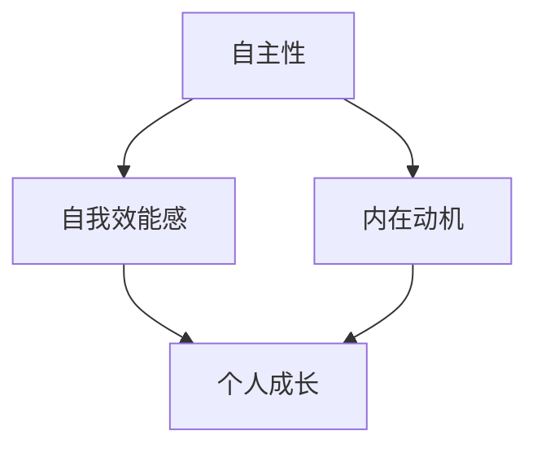

                 

### 文章标题：个人成长与意义感：自我实现的现代途径

### 文章关键词：个人成长、意义感、自我实现、现代途径

### 文章摘要：

在现代社会中，个人成长与意义感成为追求幸福和自我实现的重要途径。本文将探讨个人成长与意义感的概念及其关系，结合心理学理论和实践案例，分析现代途径下如何实现自我成长。通过详细阐述理论基础、成长策略与实践、成长中的障碍与应对，以及成长与意义感的案例研究，本文旨在为读者提供一套系统的自我实现方法。

---

### 目录

1. 引言
   1.1 书籍目的与读者对象
   1.2 个人成长与意义感的概念
   1.3 自我实现的现代途径

2. 个人成长的理论基础
   2.1 自我决定理论
   2.2 自我效能感
   2.3 自我概念与成长

3. 意义感的重要性
   3.1 意义感的定义与作用
   3.2 意义感与幸福感的关系

4. 成长策略与实践
   4.1 自我反思与自我认知
   4.2 情绪管理与成长
   4.3 人际关系与成长
   4.4 学习与成长

5. 成长中的障碍与应对
   5.1 成长过程中的常见障碍
   5.2 障碍的识别与克服
   5.3 成长中的反思与调整

6. 成长与意义感：实践案例研究
   6.1 案例研究一：自我实现之路
   6.2 案例研究二：从挫折到成长
   6.3 案例研究三：寻找生命意义

7. 总结与展望
   7.1 个人成长与意义感的重要性
   7.2 自我实现的可能性与挑战
   7.3 未来展望

### 附录

- A. 个人成长与意义感相关资源

---

### 引言

**1.1 书籍目的与读者对象**

在现代社会的快节奏生活中，个人成长与意义感成为许多人追求幸福和自我实现的重要途径。本书旨在为读者提供一套系统的自我实现方法，通过探讨个人成长与意义感的关系，结合心理学理论和实践案例，帮助读者理解并实践自我实现的现代途径。

本书面向希望提升个人成长和寻找生活意义的各类读者，包括学生、职场人士、心理学爱好者等。无论您是初入职场的新人，还是希望追求人生更高境界的职场人士，本书都将为您提供有价值的指导和启示。

**1.2 个人成长与意义感的概念**

个人成长是指个体在认知、情感、行为等方面的持续发展和进步。它涉及到知识的积累、能力的提升、自我认知的深化等多个方面。个人成长不仅是实现职业成功的关键，更是实现人生价值的重要途径。

意义感是指个体在生活中感受到的目的、意义和价值。它源于个体对自身存在意义的认知，是驱动个体行为和决策的重要动力。具有强烈意义感的人往往更加积极、有动力地面对生活中的挑战，从而实现更高的自我价值。

**1.3 自我实现的现代途径**

自我实现是指个体在成长过程中，充分发挥自身潜能，实现个人价值的过程。在现代途径下，个人成长与意义感是实现自我实现的重要途径。以下是一些关键要素：

1. 自我反思与自我认知：通过不断地反思和自我认知，个体可以更好地了解自己的优点和不足，从而制定出更有效的成长计划。

2. 情绪管理与成长：情绪是影响个体行为和决策的重要因素。学会情绪管理，可以帮助个体更好地应对生活中的挑战，促进个人成长。

3. 人际关系与成长：良好的人际关系对个人成长具有重要意义。通过建立和维护积极的人际关系，个体可以获得支持和鼓励，从而更好地实现自我成长。

4. 学习与成长：终身学习是个人成长的重要保障。不断学习和更新知识，可以帮助个体适应社会发展的需求，实现自我价值的提升。

5. 成长中的障碍与应对：在个人成长过程中，难免会遇到各种障碍和挑战。学会识别和克服这些障碍，是实现自我成长的关键。

6. 成长与意义感的实践案例研究：通过分析实践案例，个体可以更好地理解成长与意义感的关系，从而找到适合自己的自我实现路径。

**2. 个人成长的理论基础**

**2.1 自我决定理论**

自我决定理论认为，个体的自主性、自我效能感和内在动机是推动个人成长的核心要素。以下是一个简单的Mermaid流程图，展示了这些要素之间的关系：

**2.1.1 自主性**

自主性是指个体在行为决策中能够独立思考和选择的能力。它不仅影响个体的行为，还影响其情感和认知发展。以下是自主性的定义和作用：

- **定义**：自主性是指个体在行为决策中能够独立思考和选择的能力。
- **作用**：自主性有助于个体发展自我认知和自我效能感，从而促进个人成长。

**2.1.2 自我效能感**

自我效能感是指个体对自己完成特定任务的信心。它受到个人经验、社会支持和心理因素的影响。以下是自我效能感的定义和作用：

- **定义**：自我效能感是指个体对自己完成特定任务的信心。
- **作用**：自我效能感直接影响个体的行为选择和努力程度，从而影响个人成长。

**2.1.3 自我概念与成长**

自我概念是指个体对自己的整体认知和评价。它包括自我认知、自尊和自我效能感等方面。以下是自我概念与成长之间的关系：

- **定义**：自我概念是指个体对自己的整体认知和评价。
- **关系**：积极的自我概念有助于个体建立自信心，从而促进个人成长。

**3. 意义感的重要性**

**3.1 意义感的定义与作用**

意义感是指个体在生活中感受到的目的、意义和价值。它是驱使个体行为和决策的重要动力。以下是意义感的定义和作用：

- **定义**：意义感是指个体在生活中感受到的目的、意义和价值。
- **作用**：意义感有助于个体建立积极的生活态度，提高幸福感和满足感，从而促进个人成长。

**3.2 意义感与幸福感的关系**

意义感与幸福感之间存在密切关系。具有强烈意义感的人往往更容易感受到幸福。以下是意义感与幸福感之间的关系：

- **关系**：意义感是幸福感的重要来源，有助于个体建立积极的生活态度和情感状态。

**4. 成长策略与实践**

**4.1 自我反思与自我认知**

自我反思与自我认知是个人成长的重要途径。通过不断地反思和自我认知，个体可以更好地了解自己的优点和不足，从而制定出更有效的成长计划。以下是自我反思与自我认知的方法和工具：

- **方法**：定期进行自我反思，如写日记、记录思考等。
- **工具**：自我评估工具，如SWOT分析、能力矩阵等。

**4.2 情绪管理与成长**

情绪管理是个人成长的重要方面。学会情绪管理，可以帮助个体更好地应对生活中的挑战，从而促进个人成长。以下是情绪管理的方法和技巧：

- **方法**：情绪识别、情绪表达和情绪调节。
- **技巧**：深呼吸、冥想、运动等。

**4.3 人际关系与成长**

良好的人际关系对个人成长具有重要意义。通过建立和维护积极的人际关系，个体可以获得支持和鼓励，从而更好地实现自我成长。以下是人际关系管理的方法和策略：

- **方法**：有效沟通、倾听和同理心。
- **策略**：建立信任、冲突解决和团队协作。

**4.4 学习与成长**

终身学习是个人成长的重要保障。不断学习和更新知识，可以帮助个体适应社会发展的需求，实现自我价值的提升。以下是学习和成长的方法和策略：

- **方法**：制定学习计划、主动学习和反思总结。
- **策略**：利用在线学习资源、参加培训和研讨会。

**5. 成长中的障碍与应对**

在个人成长过程中，个体可能会遇到各种障碍和挑战。学会识别和克服这些障碍，是实现自我成长的关键。以下是成长中常见障碍的识别和应对策略：

- **障碍**：逃避与拖延、胆怯与恐惧、自我设限。
- **策略**：设定明确目标、建立行动计划、寻求支持和鼓励。

**6. 成长与意义感：实践案例研究**

**6.1 案例研究一：自我实现之路**

案例研究一介绍了一位职场人士通过自我反思、情绪管理和学习与成长，实现自我实现的历程。以下是案例研究的主要内容和启示：

- **内容**：案例中的个体如何识别自身的优势和不足，通过自我反思和情绪管理，逐步实现个人成长和自我实现。
- **启示**：个人成长需要持续的努力和自我反思，情绪管理是成长的重要保障。

**6.2 案例研究二：从挫折到成长**

案例研究二介绍了一位创业者如何从挫折中汲取经验，实现个人成长和自我实现。以下是案例研究的主要内容和启示：

- **内容**：案例中的个体如何在面对创业失败时，通过反思和调整，找到适合自己的成长路径。
- **启示**：面对挫折，重要的是保持积极的心态和持续的努力。

**6.3 案例研究三：寻找生命意义**

案例研究三介绍了一位年轻人在寻找生命意义的过程中，如何通过自我反思和学习，找到自己的人生目标。以下是案例研究的主要内容和启示：

- **内容**：案例中的个体如何通过自我反思和学习，逐步认识到生命的意义，并为之努力奋斗。
- **启示**：生命的意义需要个体自己去探索和发现，自我实现的过程是充满挑战和收获的。

**7. 总结与展望**

**7.1 个人成长与意义感的重要性**

个人成长与意义感是实现自我价值的两个重要方面。在现代社会中，个体需要不断成长，以适应不断变化的社会环境。同时，寻找和实现个人意义，有助于个体建立积极的生活态度和情感状态。

**7.2 自我实现的可能性与挑战**

自我实现是个人成长的目标。在实现自我过程中，个体可能会遇到各种挑战。但只要保持积极的心态和持续的努力，个体就有可能实现自我价值。

**7.3 未来展望**

随着社会的发展，个人成长与意义感的研究将更加深入。未来，个体可以通过更加科学和系统的方法，实现自我成长和自我实现。同时，人工智能等技术的进步，将为个人成长提供更多的可能性。

**附录**

**A. 个人成长与意义感相关资源**

以下是推荐的一些书籍、论文集和网络资源，供读者进一步学习和探索：

- 书籍推荐：
  - 《心理学与生活》（理查德·格里格斯著）
  - 《自我决定论：自主性、动机与人格》（迈克尔·瑞恩著）
  - 《意义的追求：人类动机的心理学探索》（埃里希·弗洛姆著）

- 论文集：
  - 《自我决定论：理论与实践》（迈克尔·瑞恩编）
  - 《意义感研究：理论与实践》（乔治·莱文森编）

- 网络资源：
  - 自我决定理论研究网：http://selfdeterminationtheory.org/
  - 心理学导论：https://www.psychologytoday.com/
  - 意义感研究协会：https://www.senseofmeaning.com/

---

**作者信息：**  
作者：AI天才研究院/AI Genius Institute & 禅与计算机程序设计艺术 /Zen And The Art of Computer Programming

