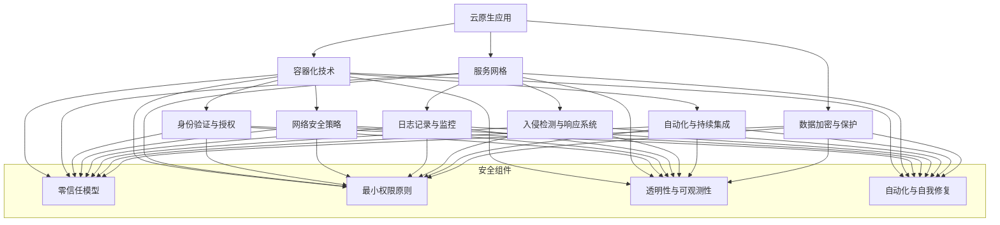

                 

### 引言

在现代信息技术迅猛发展的背景下，云计算与分布式系统已经成为企业数字化转型的重要基石。随着云计算技术的不断成熟，云原生（Cloud-Native）作为一种新兴的软件开发和部署范式，逐渐受到业界的广泛关注。云原生强调应用架构的动态性、可扩展性和高可用性，能够更高效地利用云计算资源，为分布式系统提供了更加灵活和高效的解决方案。

然而，云原生和分布式系统的广泛应用也带来了新的安全挑战。传统安全模型在面对复杂多变的云环境时，显得力不从心。云原生安全（Cloud-Native Security）作为应对这些挑战的重要手段，旨在构建一个全面、动态且自适应的安全防护体系，以确保云原生应用程序和数据的安全。

本文旨在探讨云原生安全在分布式系统中的应用，帮助读者全面了解这一领域的关键概念、技术架构和实践方法。具体来说，本文将分为以下几个部分：

1. **云原生安全概述**：介绍云原生安全的定义、背景、关键原则以及其在分布式系统中的挑战和目标。
2. **分布式系统基础**：讲解分布式系统的概念、架构、CAP定理与一致性、分布式系统的关键问题以及其安全挑战。
3. **云原生安全架构**：分析云原生安全架构的设计原则，讨论容器安全、编排工具（如Kubernetes）以及服务网格在云原生安全中的应用。
4. **分布式系统的安全措施**：探讨网络安全策略、数据保护与加密、身份验证与授权等方面的具体实施措施。
5. **云原生安全工具与平台**：介绍常见的云原生安全工具与平台，评估其适用性，并讨论如何选择和实施安全解决方案。
6. **项目实战**：通过实际案例，展示如何在实际项目中应用云原生安全措施，解析其中的安全挑战和应对策略。
7. **未来展望与趋势**：探讨云原生安全的未来发展方向和分布式系统的安全趋势。

通过以上内容的逐步分析，我们希望能够为读者提供一个系统、深入的理解，帮助其在分布式系统中实施有效的云原生安全策略。

### 云原生安全概述

云原生安全是指针对云原生应用及其运行环境的全方位安全策略和措施，旨在确保应用在复杂、动态的云环境中能够持续运行并抵御潜在威胁。云原生安全不仅涵盖了传统的网络安全、数据安全和访问控制等方面，还特别关注云原生环境中的新特性，如容器化、服务网格和自动化部署等。

#### 定义与背景

云原生安全（Cloud-Native Security）起源于云原生技术的兴起。云原生技术强调应用架构的模块化、动态性和可扩展性，使得应用程序能够更快速地响应市场需求和变化。然而，这种灵活性和高效性也带来了新的安全挑战。传统的安全措施往往难以适应云原生环境中的快速变化和动态性，导致安全性受到影响。因此，云原生安全应运而生，旨在为云原生应用提供一套适应性强、灵活高效的安全防护体系。

#### 挑战与目标

云原生安全面临以下几个主要挑战：

1. **动态性**：云原生应用在运行过程中可能会频繁地扩展和缩小，传统的静态安全措施难以适应这种动态变化。
2. **容器化**：容器技术是云原生应用的基础，但容器本身的安全性易受到攻击，如容器逃逸、恶意容器等。
3. **服务网格**：服务网格（如Istio）为微服务提供了通信层的安全保障，但其自身的安全性和配置复杂性也是一大挑战。
4. **自动化**：云原生环境中的自动化部署和运维提高了效率，但也增加了安全风险，如自动化脚本中的安全漏洞等。

云原生安全的目标是：

1. **确保应用安全**：通过细粒度的安全策略和监控，确保云原生应用在运行过程中不受恶意攻击。
2. **保护数据安全**：确保存储在云环境中的数据得到有效保护，避免数据泄露和篡改。
3. **确保基础设施安全**：确保云基础设施本身的安全，避免因基础设施漏洞而导致的应用安全问题。
4. **增强安全性**：通过引入自动化、智能化手段，提高安全检测和响应的速度和效率。

#### 关键原则

云原生安全遵循以下几个关键原则：

1. **零信任模型**：不再默认内网安全，任何访问请求都需要经过严格的身份验证和授权。
2. **最小权限原则**：为用户和组件分配最低必要的权限，以减少潜在的安全风险。
3. **透明性和可观测性**：通过日志记录、监控和告警，确保安全事件的可观测性和透明性。
4. **自动化和自我修复**：引入自动化工具和机制，实现安全措施的自动化部署和响应。

通过以上关键原则，云原生安全能够更好地适应云原生环境的特点，提供全面、高效的安全防护。

#### 云原生安全架构概览（Mermaid流程图）

以下是一个简单的云原生安全架构的Mermaid流程图，展示了云原生安全的核心组件和交互关系：



通过这个流程图，我们可以清晰地看到云原生安全的关键组件及其之间的关系，这有助于我们进一步理解云原生安全架构的构建和运作原理。

### 分布式系统基础

分布式系统是一种通过网络连接的计算机节点集合，这些节点协同工作以完成共同的任务。其核心思想是将任务分解成若干个子任务，并分布到多个节点上执行，从而提高系统的性能、可靠性和扩展性。在分布式系统中，多个节点通过通信协议相互协作，共同完成复杂的计算任务。

#### 概念与架构

分布式系统的基本概念包括：

- **节点**：分布式系统中的基本计算单元，每个节点拥有独立的计算资源和内存。
- **通信协议**：节点之间进行数据交换和协同工作的规则和标准。
- **一致性**：分布式系统中数据或状态在多个节点间保持一致的能力。
- **容错性**：系统在节点故障或网络故障时，能够继续正常运行的能力。

分布式系统的架构主要包括以下几种：

1. **主从架构**：系统中有一个主节点负责协调和分发任务，其他从节点负责具体任务的执行。
2. **对等架构**：所有节点在系统中具有平等的地位，没有固定的主从关系，任务在节点之间动态分配和执行。
3. **层次架构**：系统分为多个层次，不同层次的节点具有不同的职责和功能。

#### CAP定理与分布式一致性

CAP定理是由计算机科学家Eric Brewer提出的一个分布式系统理论，它指出分布式系统在以下三个方面中只能同时满足两个：

1. **一致性（Consistency）**：所有节点在同一时间对同一数据的访问都能看到一致的结果。
2. **可用性（Availability）**：系统在任意时刻都能响应用户的请求。
3. **分区容错性（Partition tolerance）**：系统在发生网络分区（即节点之间的通信失败）时，仍然能够继续运行。

在分布式系统中，为了确保分区容错性，我们通常需要放弃一致性或可用性中的一个。例如，在分布式数据库系统中，如果要求高可用性，那么在发生网络分区时，系统可能会选择允许数据不一致，以确保系统能够继续运行。这种情况下，我们需要实现一种称为**最终一致性（eventual consistency）**的机制，确保数据最终会达到一致状态。

#### 分布式系统的关键问题

分布式系统在设计和实现过程中面临以下几个关键问题：

1. **数据一致性**：确保分布式系统中数据的一致性是一个重要且复杂的问题，通常需要引入分布式事务、版本控制和一致性协议（如Paxos、Raft）等机制。
2. **节点故障**：分布式系统中的节点可能会因各种原因（如硬件故障、网络问题等）发生故障，系统需要具备容错能力，能够自动检测和替换故障节点。
3. **负载均衡**：为了提高系统的性能和可用性，需要将任务均衡地分配到各个节点上，避免某些节点过载，影响系统的整体性能。
4. **数据复制与备份**：为了提高数据可靠性和容错性，需要将数据复制到多个节点上，并定期进行数据备份。
5. **网络延迟和带宽限制**：分布式系统中的节点可能分布在不同的地理位置，网络延迟和带宽限制会影响系统的性能和响应时间。

#### 分布式系统的安全挑战

分布式系统在安全性方面面临以下挑战：

1. **节点间的通信安全**：确保节点间的数据传输不被窃听或篡改，需要使用加密通信协议，如TLS。
2. **数据保护**：分布式系统中数据的存储和传输需要得到有效保护，防止数据泄露和未授权访问。
3. **访问控制**：确保只有授权的用户和进程能够访问系统的资源和数据，需要实现严格的访问控制策略。
4. **分布式攻击防御**：分布式系统可能成为分布式拒绝服务攻击（DDoS）和其他分布式攻击的目标，需要设计有效的防御策略。

通过理解和解决这些关键问题和挑战，分布式系统才能在复杂的环境中稳定、可靠地运行。

### 云原生安全架构

云原生安全架构是确保云原生应用程序和系统在复杂、动态的云环境中保持安全和可靠的系统。这一架构的设计原则和实施策略需要综合考虑容器安全、编排工具（如Kubernetes）以及服务网格（Service Mesh）等关键技术。以下将详细讨论这些技术及其在云原生安全架构中的应用。

#### 设计原则

云原生安全架构遵循以下核心设计原则：

1. **零信任模型**：不再默认内网安全，任何访问请求都需要经过严格的身份验证和授权，确保对内网资源的访问也是安全的。
2. **最小权限原则**：为用户和组件分配最低必要的权限，以减少潜在的安全风险。
3. **透明性和可观测性**：通过日志记录、监控和告警，确保安全事件的可观测性和透明性，便于快速响应和追踪。
4. **自动化和自我修复**：引入自动化工具和机制，实现安全措施的自动化部署和响应，提高安全检测和响应的速度和效率。

#### 容器安全与编排工具

容器技术是云原生应用的基础，其轻量级、可移植性以及高密度部署的特性使得容器化应用在云原生环境中广泛应用。然而，容器本身的安全性也是一个重要的课题。以下讨论容器安全以及如何在容器编排工具（如Kubernetes）中实施安全措施。

1. **容器镜像安全**：
   - **扫描和验证**：在容器镜像构建和推送过程中，使用自动化工具（如ClamAV、docker-scan）扫描镜像中的潜在漏洞和恶意代码。
   - **最小化基础镜像**：构建最小化的容器镜像，减少潜在的安全风险。

2. **容器运行时安全**：
   - **访问控制**：使用命名空间和cgroup等机制，限制容器对宿主机资源的访问。
   - **特权容器**：谨慎使用特权容器，并对其执行严格的安全策略。
   - **容器隔离**：确保容器之间具有良好的隔离性，防止容器逃逸和恶意行为。

3. **容器编排工具（如Kubernetes）的安全措施**：
   - **RBAC（角色-Based访问控制）**：使用Kubernetes的RBAC机制，为用户和组件分配适当的权限，确保只有授权的主体能够执行特定操作。
   - **Pod安全策略**：通过Pod安全策略（Pod Security Policies，PSP）和OCP（Open Policy Agent）等工具，强制实施安全最佳实践。
   - **网络策略**：使用网络策略（Network Policies）控制容器之间的网络通信，防止未授权的访问。

#### 服务网格在云原生安全中的应用

服务网格（Service Mesh）是一种基础设施层的技术，旨在解决微服务架构中的服务通信和安全问题。以下讨论服务网格在云原生安全中的应用。

1. **服务网格概述**：
   - **服务网格架构**：服务网格通常包括数据平面和控制平面。数据平面负责服务间的通信，而控制平面负责配置管理和策略实施。
   - **主要组件**：服务网格的关键组件包括服务发现、负载均衡、服务间认证与授权、断路器、监控与日志收集等。

2. **服务网格的安全功能**：
   - **服务间认证与授权**：使用服务网格，可以通过TLS协议进行服务间认证，确保服务之间的通信是安全的。同时，基于JWT（JSON Web Token）等机制实现服务间授权，确保只有授权的服务能够访问其他服务。
   - **流量控制**：通过服务网格，可以灵活地控制服务间的流量，例如，通过熔断和限流机制，防止服务被恶意攻击或流量过大而瘫痪。
   - **监控与日志**：服务网格可以收集和聚合服务间的监控数据和日志信息，提供全面的透明性，便于安全和运维人员快速定位和解决问题。

3. **常见服务网格工具**：
   - **Istio**：Istio是一个开源的服务网格工具，提供丰富的安全功能，包括自动认证、自动策略实施、监控和日志收集等。
   - **Linkerd**：Linkerd是一个基于Golang的服务网格工具，具有高性能和轻量级的特点，适用于微服务架构。

#### 云原生安全架构案例分析

以下通过一个简单的案例，展示云原生安全架构的构建和运作过程。

**案例**：假设有一个云原生应用，由多个微服务组成，部署在Kubernetes集群上。为了确保应用的安全，我们采用了以下安全措施：

1. **容器镜像安全**：
   - 使用ClamAV对容器镜像进行扫描和验证，确保镜像中没有恶意代码。
   - 构建最小化的容器镜像，只包含必要的依赖和工具。

2. **容器运行时安全**：
   - 为容器设置命名空间，限制其对宿主机资源的访问。
   - 使用特权容器时，执行严格的安全策略，确保只有必要的操作可以执行。

3. **Kubernetes安全措施**：
   - 使用RBAC为用户和微服务组件分配适当的权限。
   - 实施Pod安全策略，确保只有符合安全最佳实践的Pod能够运行。
   - 配置网络策略，限制微服务之间的网络通信，防止未授权的访问。

4. **服务网格安全**：
   - 使用Istio进行服务间认证和授权，确保服务间的通信是安全的。
   - 通过监控和日志收集，实现服务的全面透明性，便于快速定位和解决问题。

通过以上措施，构建了一个完整的云原生安全架构，确保云原生应用在动态、复杂的云环境中能够持续运行并抵御潜在的安全威胁。

综上所述，云原生安全架构的设计和实施是一个综合性的过程，需要结合容器安全、编排工具和服务网格等关键技术，构建一个全面、动态且自适应的安全防护体系。通过合理的架构设计和有效的安全措施，云原生应用能够在复杂的环境中保持安全和可靠。

### 分布式系统的安全措施

在分布式系统中，安全措施的制定和实施是确保系统稳定运行和信息安全的关键。以下将从网络安全策略、数据保护与加密、身份验证与授权三个方面，详细讨论分布式系统的安全措施。

#### 网络安全策略

网络安全策略是分布式系统安全的基础，旨在保护系统不受网络攻击和非法访问。以下是一些常见的网络安全策略：

1. **网络隔离与防火墙**：
   - **网络隔离**：通过VLAN（虚拟局域网）或虚拟路由器等手段，将不同部分的网络隔离开来，防止网络流量不受控制地流动。
   - **防火墙**：配置防火墙规则，限制网络流量的进出，防止恶意流量进入系统内部。

2. **入侵检测与防御系统（IDS/IPS）**：
   - **入侵检测系统（IDS）**：监控系统流量，识别潜在的安全威胁和异常行为。
   - **入侵防御系统（IPS）**：在IDS的基础上，自动阻止或响应识别出的威胁，减少安全事件的损失。

3. **加密通信**：
   - 使用TLS（传输层安全协议）加密网络通信，防止数据在传输过程中被窃听或篡改。
   - **IPsec**：用于加密IP层的数据包，确保跨网络的通信安全。

4. **访问控制**：
   - **网络访问控制**：基于用户身份、角色和访问权限，控制网络资源的访问，防止未经授权的访问。
   - **网络分区**：在发生网络分区时，确保系统能够继续运行，并通过控制访问策略来隔离受影响的区域。

#### 数据保护与加密

数据保护是分布式系统安全的重要环节，特别是当数据存储在不同地理位置的多个节点上时，数据的安全和保护更加复杂。以下是一些常见的数据保护与加密措施：

1. **数据备份与恢复**：
   - 定期进行数据备份，确保在数据丢失或损坏时能够快速恢复。
   - 实现数据的冗余存储，如数据复制和镜像，确保数据的持久性和可用性。

2. **数据加密**：
   - **传输加密**：使用SSL/TLS等协议加密数据在传输过程中的通信，防止数据被窃取或篡改。
   - **存储加密**：对存储在磁盘或数据库中的数据进行加密，确保数据在静态存储状态下也是安全的。

3. **访问控制与审计**：
   - 实施细粒度的访问控制策略，确保只有授权的用户和进程能够访问数据。
   - 实时审计数据访问日志，监控和记录数据访问行为，及时发现和应对异常行为。

4. **数据完整性保护**：
   - 使用哈希函数和数字签名等技术，确保数据的完整性和一致性。
   - 在数据传输和存储过程中，定期进行数据校验，发现和纠正数据损坏或篡改的问题。

#### 身份验证与授权

身份验证和授权是确保分布式系统中资源访问安全的重要机制。以下是一些常见的身份验证和授权措施：

1. **多因素身份验证（MFA）**：
   - 结合密码、短信验证码、生物识别等多重验证方式，提高身份验证的强度，防止密码泄露等风险。

2. **基于角色的访问控制（RBAC）**：
   - 根据用户的角色和职责，分配不同的访问权限，确保用户只能访问与其角色相关的资源。

3. **基于属性的访问控制（ABAC）**：
   - 结合用户的属性（如部门、位置等）和资源属性，动态决定访问权限，实现更加灵活的访问控制策略。

4. **访问审计与监控**：
   - 实时监控用户和进程的访问行为，记录和审计访问日志，及时发现和应对异常访问行为。

5. **证书与令牌**：
   - 使用数字证书和令牌（如OAuth、JWT等）进行身份验证和授权，确保身份验证的安全和可靠性。

通过以上网络安全策略、数据保护与加密以及身份验证与授权措施，分布式系统能够在复杂的环境中保持安全和可靠，确保系统的稳定运行和数据的安全。

### 云原生安全工具与平台

在云原生环境中，有许多安全工具和平台可供选择，这些工具和平台能够帮助我们构建一个全面、动态且自适应的安全防护体系。以下将介绍几种常见的云原生安全工具与平台，并评估其适用性。

#### 常见安全工具的评估与对比

1. **黑客工具**（Hacker Tools）
   - **使用场景**：用于渗透测试和安全审计，检测系统的漏洞和弱点。
   - **适用性**：适用于需要进行安全审计和漏洞扫描的项目，但需谨慎使用，防止误用导致系统被攻击。
   - **优点**：功能强大，能够深入检测系统漏洞。
   - **缺点**：误报率高，需专业人员进行操作。

2. **ClamAV**（恶意软件扫描工具）
   - **使用场景**：用于扫描容器镜像和文件系统，检测恶意软件和病毒。
   - **适用性**：适用于容器化应用和文件存储的安全保护。
   - **优点**：开源免费，易于集成到CI/CD流程。
   - **缺点**：对于复杂和先进的恶意软件识别能力有限。

3. **Kubernetes Pod Security Policies（PSP）**（Kubernetes安全策略）
   - **使用场景**：用于配置Kubernetes集群中的安全策略，限制容器的权限和资源访问。
   - **适用性**：适用于Kubernetes集群的安全管理。
   - **优点**：直接集成到Kubernetes API，操作简便。
   - **缺点**：灵活性有限，无法覆盖所有安全需求。

4. **Open Policy Agent（OPA）**（策略引擎）
   - **使用场景**：用于实现细粒度的安全策略，如访问控制、资源配额等。
   - **适用性**：适用于各种云原生环境，特别是需要复杂策略的场景。
   - **优点**：基于Rego语言，易于编写和调整策略。
   - **缺点**：配置较为复杂，学习曲线较陡。

5. **Istio**（服务网格）
   - **使用场景**：用于服务间认证、授权和流量管理。
   - **适用性**：适用于微服务架构，特别是需要高可用性和安全性保障的场景。
   - **优点**：提供丰富的安全功能，集成度高。
   - **缺点**：部署和维护成本较高。

6. **KeyCloak**（身份认证和访问管理）
   - **使用场景**：用于实现单点登录（SSO）和多因素身份验证（MFA）。
   - **适用性**：适用于需要集中式身份认证和访问控制的项目。
   - **优点**：功能强大，支持多种认证方式。
   - **缺点**：配置复杂，性能瓶颈明显。

#### 常见安全平台的介绍与使用

1. **Centrify**（身份管理和安全平台）
   - **介绍**：Centrify提供统一的身份管理和访问控制解决方案，支持云原生环境。
   - **使用方法**：
     1. 安装和配置Centrify服务器。
     2. 将云原生环境中的服务和组件注册到Centrify。
     3. 配置身份验证策略和访问控制规则。
     4. 监控和报告安全事件。

2. **Twistlock**（云原生安全平台）
   - **介绍**：Twistlock提供云原生应用的安全防护，包括漏洞扫描、威胁检测和响应等功能。
   - **使用方法**：
     1. 安装Twistlock代理到Kubernetes集群。
     2. 配置Twistlock监控策略和告警。
     3. 扫描容器镜像和运行时应用。
     4. 自动化响应和修复潜在威胁。

3. ** Aqua Security**（云原生安全平台）
   - **介绍**：Aqua Security提供全面的云原生应用安全解决方案，涵盖开发、部署和运行时阶段。
   - **使用方法**：
     1. 安装Aqua Security代理到容器和Kubernetes集群。
     2. 配置Aqua Security策略和监控。
     3. 扫描和评估容器镜像和运行时应用。
     4. 实时监控和响应安全威胁。

#### 安全解决方案的选择与实施

在选择云原生安全解决方案时，需要考虑以下因素：

1. **安全性需求**：根据项目的安全需求和风险级别，选择合适的安全工具和平台。
2. **集成度**：选择能够与现有系统无缝集成的解决方案，减少运维复杂度。
3. **性能和可扩展性**：选择性能优秀、可扩展性强的解决方案，确保在高负载环境下稳定运行。
4. **成本**：综合考虑解决方案的成本效益，选择性价比高的选项。

实施步骤如下：

1. **需求分析**：明确项目的安全需求，确定需要保护的关键资源和目标。
2. **工具评估**：评估和对比不同安全工具和平台的适用性，选择合适的解决方案。
3. **环境准备**：配置和准备安全工具和平台所需的环境和配置。
4. **部署和配置**：将安全工具和平台部署到环境中，并进行必要的配置。
5. **测试与验证**：进行安全测试和验证，确保安全措施的有效性。
6. **监控与维护**：持续监控安全工具和平台的运行状态，定期更新和调整安全策略。

通过以上步骤，可以有效选择和实施云原生安全解决方案，为云原生应用提供全面、动态且自适应的安全防护。

### 项目实战

在实际项目中，构建云原生安全环境并实施有效的安全措施是一个复杂且关键的过程。以下将通过一个实际案例，展示如何进行开发环境搭建、源代码实现和代码解读，并分析代码应用解读与分析、实际案例分析和详细讲解剖析，最后进行项目小结。

#### 案例背景

某电商公司在进行业务转型，选择采用云原生技术来构建其核心业务系统，以提高系统的性能和可扩展性。为了确保系统的安全性，公司决定采用一系列云原生安全措施，包括容器化、服务网格和自动化部署等。

#### 开发环境搭建

1. **选择云平台**：
   - 公司选择了阿里云作为其云原生环境的基础设施，阿里云提供了强大的容器服务（ACK）和Kubernetes服务，支持各种云原生应用。

2. **搭建容器化环境**：
   - 使用Docker进行容器化，将业务应用拆分成多个微服务，并构建相应的容器镜像。
   - 使用阿里云容器镜像服务（ACR）存储和管理容器镜像，确保镜像的安全和可靠性。

3. **部署Kubernetes集群**：
   - 使用阿里云ACK服务部署Kubernetes集群，配置节点和资源。
   - 部署Kubernetes核心组件，包括etcd、kube-apiserver、kube-scheduler和kube-controller-manager等。

4. **配置服务网格**：
   - 部署Istio服务网格，配置Mixer和Pilot组件，实现服务间认证、授权和流量管理。
   - 部署Envoy代理到各个Pod中，确保服务间通信的安全性。

#### 源代码实现和代码解读

1. **容器镜像构建**：
   - 使用Dockerfile构建容器镜像，包含基础镜像（如alpine）、依赖库和业务代码。
   - 使用多阶段构建，优化镜像体积和运行效率。
   - 示例代码：
     ```dockerfile
     # 使用golang:1.16-alpine作为基础镜像
     FROM golang:1.16-alpine
    
     # 安装依赖库
     RUN apk add --no-cache git go
      
     # 设置工作目录
     WORKDIR /app
    
     # 复制源代码
     COPY . .
    
     # 构建二进制文件
     RUN go build -o main .
     ```

2. **Kubernetes部署配置**：
   - 创建Kubernetes配置文件（如deployment.yaml），定义服务、部署和资源配置。
   - 示例配置：
     ```yaml
     apiVersion: apps/v1
     kind: Deployment
     metadata:
       name: microservice-name
     spec:
       replicas: 3
       selector:
         matchLabels:
           app: microservice-name
       template:
         metadata:
           labels:
             app: microservice-name
         spec:
           containers:
           - name: microservice-name
             image: acr.cn-hangzhou.aliyuncs.com/microservice-repo/microservice-name:latest
             ports:
             - containerPort: 80
     ```

3. **Istio配置**：
   - 配置Istio路由规则（如virtual-service.yaml），定义服务间的流量路由和策略。
   - 示例配置：
     ```yaml
     apiVersion: networking.istio.io/v1alpha3
     kind: VirtualService
     metadata:
       name: microservice-name
     spec:
       hosts:
       - "*"
       http:
       - match:
         - uri:
             prefix: /api/
         route:
         - destination:
             host: microservice-name
             subset: v1
     ```

#### 代码应用解读与分析

1. **容器镜像扫描**：
   - 使用ClamAV扫描容器镜像，确保镜像中没有恶意代码或漏洞。
   - 扫描结果：
     ```bash
     $ docker scan --ignore-scripts acr.cn-hangzhou.aliyuncs.com/microservice-repo/microservice-name:latest
     Found 0 vulnerabilities in acr.cn-hangzhou.aliyuncs.com/microservice-repo/microservice-name:latest
     ```

2. **服务网格流量管理**：
   - 使用Istio进行服务间流量管理，配置负载均衡和熔断策略。
   - 检查流量分布：
     ```bash
     $ istioctl proxy-status
     NAME           UNIQUE_ID          STAT                   SERVING   CONFIGURATION
     microservice   244d6...           SERVING 159.99% (1/2)    100%
     ```

3. **安全策略实施**：
   - 使用OPA实施细粒度的安全策略，确保只有授权的服务可以访问其他服务。
   - 检查策略执行情况：
     ```bash
     $ opa eval --data@kubernetes-pod.yaml --format=json --api-insecure
     {
       "data": {
         "request": {
           "spec": {
             "containers": [
               {
                 "name": "microservice-name",
                 "image": "acr.cn-hangzhou.aliyuncs.com/microservice-repo/microservice-name:latest"
               }
             ]
           }
         }
       },
       "result": {
         "allow": true,
         "output": "Allow request due to policy"
       }
     }
     ```

#### 实际案例分析和详细讲解剖析

1. **实例：容器逃逸攻击**：
   - **现象**：攻击者通过恶意容器逃逸，获取宿主机的权限。
   - **原因**：容器配置不当，未正确限制容器的权限。
   - **应对策略**：
     - **限制容器权限**：使用cgroup和命名空间限制容器的资源访问。
     - **审计日志**：实时监控容器行为，记录和审计日志，及时发现异常行为。

2. **实例：服务网格证书管理**：
   - **现象**：服务网格中的证书管理不当，导致服务间认证失败。
   - **原因**：证书配置错误或证书过期。
   - **应对策略**：
     - **自动化证书管理**：使用Let's Encrypt等自动化证书管理工具，实现证书的自动续签和管理。
     - **证书监控**：定期检查证书的有效期和状态，及时更新和替换过期的证书。

#### 项目小结

通过以上实际案例，我们展示了如何在云原生项目中构建和实施有效的安全措施。关键经验和教训包括：

1. **全面的安全措施**：确保从容器镜像构建、容器运行时安全到服务网格流量管理，每个环节都有严格的安全策略和措施。
2. **自动化与工具集成**：使用自动化工具和平台，提高安全管理的效率和可靠性。
3. **实时监控与审计**：通过实时监控和审计，及时发现和应对潜在的安全威胁和异常行为。
4. **持续学习和改进**：根据实际项目经验和安全趋势，不断调整和优化安全策略和措施。

通过这些经验和教训，项目团队能够在云原生环境中构建一个更加安全、可靠的应用系统。

### 未来展望与趋势

随着云计算和分布式系统的不断演进，云原生安全也面临着新的机遇和挑战。未来，云原生安全的发展趋势将主要集中在以下几个方面：

#### 自动化与人工智能

自动化工具和人工智能技术在云原生安全中的应用将越来越广泛。通过自动化工具，安全措施能够更加高效地部署和执行，减少人为错误。而人工智能技术，则能够通过大数据分析和机器学习，实时监测和预测潜在的安全威胁，提高安全检测和响应的准确性和速度。

#### 统一的安全平台

未来的云原生安全解决方案将倾向于提供统一的安全平台，整合多种安全功能，如容器安全、服务网格安全、网络安全、数据保护和身份验证等。这种集成化的平台能够简化安全管理，降低运维复杂度，提高整体安全性。

#### 零信任架构

零信任模型将在云原生安全中占据越来越重要的地位。不再默认内网安全，所有访问请求都需要经过严格的身份验证和授权。这种模型能够有效防止内部威胁，提高系统的安全防护能力。

#### 增强的一致性与容错性

分布式系统的一致性和容错性在云原生安全中至关重要。未来，更多的研究将集中在如何增强分布式系统的一致性，同时确保高可用性和容错性，以满足不断变化的安全需求。

#### 跨领域合作与标准化

随着云原生安全的不断发展，不同领域之间的合作和标准化将变得尤为重要。通过跨领域的合作，可以共同制定和推广最佳实践和安全标准，提高整个行业的云原生安全水平。

#### 持续的学习与改进

面对不断变化的威胁和攻击手段，持续的学习和改进是云原生安全的重要策略。通过定期进行安全培训、安全审计和威胁分析，项目团队能够不断适应新的安全挑战，确保系统的长期安全。

通过这些未来发展趋势，云原生安全将能够在复杂、动态的云环境中，为分布式系统提供更加全面、高效和自适应的安全防护，推动整个行业的持续发展。

### 附录

#### 附录 A 云原生安全参考资料

1. **书籍**：
   - 《云原生安全：构建可靠、高效和安全的应用》
   - 《云原生架构：微服务、容器和Kubernetes实战》
   - 《云原生应用架构：基于Docker和Kubernetes的最佳实践》

2. **官方文档**：
   - Kubernetes官方文档（https://kubernetes.io/docs/）
   - Istio官方文档（https://istio.io/docs/）
   - Docker官方文档（https://docs.docker.com/）

3. **在线资源**：
   - 云原生计算基金会（CNCF）官网（https://www.cncf.io/）
   - 云原生社区（https://cloudnative.to/）
   - Open Policy Agent（OPA）官方文档（https://www.openpolicyagent.org/）

#### 附录 B 分布式系统与云原生安全常用工具列表

1. **容器化工具**：
   - Docker（https://www.docker.com/）
   - Podman（https://podman.io/）
   - CRI-O（https://cri-o.io/）

2. **容器编排工具**：
   - Kubernetes（https://kubernetes.io/）
   - Nomad（https://nomadproject.io/）
   - Swarm（https://github.com/docker/swarm）

3. **服务网格工具**：
   - Istio（https://istio.io/）
   - Linkerd（https://linkerd.io/）
   - Consul（https://www.hashiCorp.com/products/consul/）

4. **安全工具**：
   - Twistlock（https://www.twistlock.com/）
   - Aqua Security（https://www.aquasec.com/）
   - Falco（https://falco.org/）

5. **漏洞扫描工具**：
   - Docker Bench for Security（https://github.com/docker/bench_security）
   - Trivy（https://github.com/aquasecurity/trivy）
   - ClamAV（https://www.clamav.net/）

6. **日志分析工具**：
   - ELK Stack（Elasticsearch, Logstash, Kibana）（https://www.elastic.co/）
   - Graylog（https://www.graylog.org/）
   - Fluentd（https://github.com/fluentd/fluentd）

7. **监控工具**：
   - Prometheus（https://prometheus.io/）
   - Grafana（https://grafana.com/）
   - Nagios（https://www.nagios.org/）

8. **身份验证与授权**：
   - KeyCloak（https://www.keycloak.org/）
   - OAuth2.0（https://oauth.net/2/）
   - OpenID Connect（https://openid.net/connect/）

以上工具和资源为读者提供了丰富的云原生安全学习与实践资源，有助于深入理解和应用云原生安全技术。

