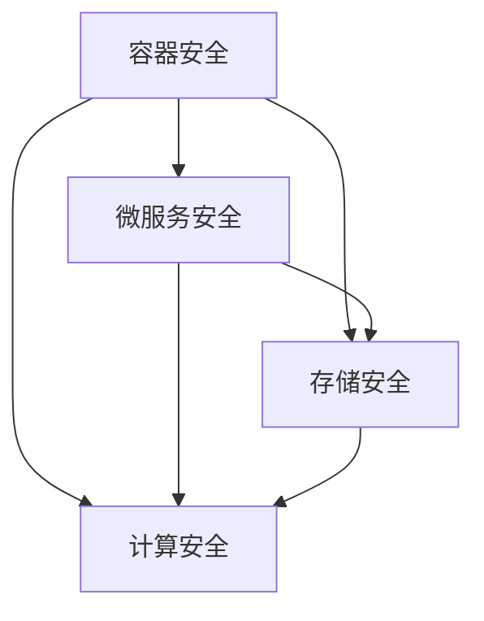

                 


## 文章标题：云原生安全在分布式系统中的应用

> 关键词：云原生安全、分布式系统、容器安全、微服务安全、存储安全、计算安全

> 摘要：本文从云原生安全的背景和重要性出发，详细介绍了分布式系统中的云原生安全应用。通过分析容器安全、微服务安全、存储安全和计算安全的实践和挑战，探讨了云原生安全在分布式系统中的应用策略和最佳实践，为读者提供了全面的技术指导。

### 背景介绍

云原生（Cloud Native）是一种新兴的计算范式，旨在利用云计算的优势，使应用程序能够在分布式环境中快速构建、动态部署和弹性扩展。云原生技术包括容器化、自动化部署、服务网格和云原生操作系统等。随着云原生技术的普及，分布式系统变得越来越复杂，安全问题也日益突出。

分布式系统是指由多个独立节点组成的系统，这些节点通过通信网络相互连接，共同完成复杂的计算任务。分布式系统的特点是高可用性、可扩展性和容错性，这使得它们成为现代企业应用的首选。然而，分布式系统的复杂性也带来了新的安全挑战。

云原生安全在分布式系统中的应用至关重要。它涉及到对容器、微服务、存储和计算等方面进行全方位的安全防护，确保系统的安全性和可靠性。本文将详细探讨云原生安全在分布式系统中的应用，包括容器安全、微服务安全、存储安全和计算安全等方面。

### 核心概念与联系

云原生安全涉及多个核心概念，包括容器安全、微服务安全、存储安全和计算安全等。这些概念之间存在着密切的联系，共同构成了云原生安全的整体架构。

首先，容器安全是云原生安全的基础。容器是一种轻量级的应用打包技术，将应用程序及其依赖环境打包在一起，实现了应用程序的隔离和轻量化。容器安全主要包括容器镜像安全、容器网络安全、容器存储安全和容器编排安全等。

微服务安全是云原生安全的重要组成部分。微服务架构将应用程序拆分成多个小型、独立的服务，每个服务都可以独立部署、扩展和更新。微服务安全包括服务身份认证、服务访问控制、API安全和服务网格安全等。

存储安全是云原生安全的关键环节。分布式系统中的数据存储面临着数据泄露、数据篡改和数据丢失等安全风险。存储安全包括数据加密、访问控制、备份和恢复等。

计算安全是云原生安全的重要保障。分布式计算涉及到大量节点和资源的调度和管理，计算安全包括节点安全、网络安全和计算任务安全等。

这些核心概念之间的联系如图1所示：



### 容器安全

容器安全是云原生安全的核心组成部分。容器安全包括以下几个方面：

#### 容器镜像安全

容器镜像是一个静态的文件系统，包含了应用程序及其依赖环境。容器镜像安全主要关注镜像的构建、存储和分发过程。为了确保容器镜像的安全性，可以采取以下措施：

1. **使用官方镜像**：优先使用官方镜像，这些镜像经过了严格的审核和测试，安全性更高。
2. **镜像签名**：对容器镜像进行签名，以确保镜像的完整性和真实性。
3. **扫描镜像**：使用安全工具扫描容器镜像，检测潜在的安全漏洞和风险。

#### 容器网络安全

容器网络是容器之间进行通信的渠道。容器网络安全主要关注网络隔离、访问控制和网络监控等方面。为了确保容器网络安全，可以采取以下措施：

1. **网络隔离**：通过将容器分为不同的网络命名空间，实现容器之间的网络隔离。
2. **访问控制**：使用访问控制策略，限制容器之间的通信权限。
3. **网络监控**：使用网络监控工具，实时监测容器网络流量，发现潜在的安全威胁。

#### 容器存储安全

容器存储是容器持久化数据的地方。容器存储安全主要关注数据加密、访问控制和备份等方面。为了确保容器存储安全，可以采取以下措施：

1. **数据加密**：使用数据加密技术，对容器存储的数据进行加密，防止数据泄露。
2. **访问控制**：使用访问控制策略，限制对容器存储数据的访问权限。
3. **备份与恢复**：定期备份容器存储数据，并确保备份数据的安全性。

#### 容器编排安全

容器编排是管理容器集群的过程。容器编排安全主要关注编排工具的安全性和容器集群的安全管理。为了确保容器编排安全，可以采取以下措施：

1. **编排工具安全**：确保编排工具本身的安全性，防止被攻击者利用。
2. **安全管理**：使用安全管理工具，对容器集群进行安全管理，包括用户权限管理、日志审计等。

### 微服务安全

微服务安全是云原生安全的重要组成部分。微服务安全包括以下几个方面：

#### 服务身份认证

服务身份认证是微服务安全的基础。服务身份认证主要关注服务之间的认证和授权过程。为了确保服务身份认证的安全性，可以采取以下措施：

1. **使用OAuth 2.0**：使用OAuth 2.0协议进行服务身份认证，确保认证过程的安全性。
2. **JWT（JSON Web Token）**：使用JWT进行服务身份认证，JWT具有较好的安全性和灵活性。
3. **证书管理**：使用数字证书进行服务身份认证，确保证书的安全性和有效性。

#### 服务访问控制

服务访问控制是微服务安全的重要环节。服务访问控制主要关注对服务访问权限的控制。为了确保服务访问控制的安全性，可以采取以下措施：

1. **ACL（访问控制列表）**：使用ACL对服务访问权限进行控制，ACL允许管理员定义哪些服务可以访问哪些资源。
2. **RBAC（基于角色的访问控制）**：使用RBAC对服务访问权限进行控制，根据用户角色分配访问权限。
3. **API网关**：使用API网关进行服务访问控制，API网关可以作为服务访问的统一入口，进行访问权限的验证和授权。

#### API安全

API安全是微服务安全的关键部分。API安全主要关注对API接口的保护，防止恶意攻击和未经授权的访问。为了确保API安全，可以采取以下措施：

1. **API签名**：使用API签名技术，对API请求进行签名，确保请求的真实性和完整性。
2. **参数验证**：对API请求参数进行严格验证，防止恶意参数注入和攻击。
3. **速率限制**：对API访问进行速率限制，防止恶意攻击和资源耗尽。

#### 服务网格安全

服务网格是微服务架构中的重要组成部分，负责服务之间的通信和安全。服务网格安全主要关注服务网格的数据传输安全和通信安全。为了确保服务网格安全，可以采取以下措施：

1. **TLS加密**：使用TLS加密技术，确保服务网格的数据传输安全。
2. **服务认证**：使用服务认证技术，确保服务网格中服务的真实性和合法性。
3. **流量监控**：使用流量监控工具，实时监控服务网格的流量，发现潜在的安全威胁。

### 存储安全

存储安全是云原生安全的关键环节。分布式系统中的数据存储面临着数据泄露、数据篡改和数据丢失等安全风险。存储安全包括以下几个方面：

#### 数据加密

数据加密是存储安全的核心技术。数据加密主要关注数据的传输加密和存储加密。为了确保数据加密的有效性，可以采取以下措施：

1. **传输加密**：使用传输层安全协议（如TLS）对数据传输进行加密，确保数据在传输过程中的安全性。
2. **存储加密**：使用存储设备提供的加密功能，对存储数据进行加密，确保数据在存储过程中的安全性。

#### 访问控制

访问控制是存储安全的重要保障。访问控制主要关注对存储资源的访问权限控制。为了确保访问控制的有效性，可以采取以下措施：

1. **基于角色的访问控制（RBAC）**：根据用户角色分配存储资源的访问权限，确保资源的访问权限符合用户角色的需求。
2. **访问控制列表（ACL）**：使用访问控制列表对存储资源的访问权限进行详细控制，为每个资源定义具体的访问权限。
3. **双向认证**：对存储客户端进行双向认证，确保存储客户端和存储服务之间的通信安全。

#### 备份与恢复

备份与恢复是存储安全的重要措施。备份与恢复主要关注数据的备份策略和恢复机制。为了确保备份与恢复的有效性，可以采取以下措施：

1. **定期备份**：定期备份存储数据，确保数据在发生故障时可以恢复。
2. **多副本备份**：在多个存储设备上备份数据，确保数据的冗余性和可靠性。
3. **备份加密**：对备份数据进行加密，确保备份数据的安全性和保密性。

#### 数据完整性

数据完整性是存储安全的重要保障。数据完整性主要关注数据的完整性和一致性。为了确保数据完整性的有效性，可以采取以下措施：

1. **数据校验**：对存储数据进行校验，确保数据的完整性和一致性。
2. **数据修复**：在检测到数据损坏时，自动修复损坏的数据，确保数据的可用性。

### 计算安全

计算安全是云原生安全的重要保障。分布式计算涉及到大量节点和资源的调度和管理，计算安全包括以下几个方面：

#### 节点安全

节点安全是计算安全的基础。节点安全主要关注节点的安全性和管理。为了确保节点安全，可以采取以下措施：

1. **节点认证**：对节点进行认证，确保节点是合法的、可信的。
2. **节点隔离**：通过隔离技术，确保不同节点之间的安全隔离，防止节点之间的恶意攻击。
3. **节点监控**：使用监控工具，实时监控节点的运行状态，发现潜在的安全威胁。

#### 网络安全

网络安全是计算安全的重要环节。网络安全主要关注网络的安全性和稳定性。为了确保网络安全，可以采取以下措施：

1. **防火墙**：使用防火墙，对网络流量进行过滤和监控，防止恶意攻击。
2. **入侵检测系统（IDS）**：使用入侵检测系统，实时检测网络攻击，及时响应和处理。
3. **网络加密**：使用网络加密技术，确保网络通信的安全性。

#### 计算任务安全

计算任务安全是计算安全的核心。计算任务安全主要关注计算任务的执行安全性和数据保护。为了确保计算任务安全，可以采取以下措施：

1. **任务隔离**：通过隔离技术，确保不同计算任务之间的安全隔离，防止任务之间的恶意攻击。
2. **任务认证**：对计算任务进行认证，确保任务的合法性和可信性。
3. **数据加密**：对计算任务处理的数据进行加密，确保数据在处理过程中的安全性。

### 云原生安全最佳实践

为了确保云原生安全在分布式系统中的有效性，可以采取以下最佳实践：

#### 安全开发生命周期

在开发过程中，将安全考虑纳入到整个开发生命周期中。从需求分析、设计、编码、测试到部署，每个阶段都要考虑安全性，确保系统的安全性。

#### 安全自动化与持续集成

使用自动化工具，对系统进行安全测试和漏洞扫描，确保系统在开发过程中的安全性。同时，将安全测试集成到持续集成和持续部署流程中，确保系统的安全性在交付前得到充分验证。

#### 安全合规性

遵守相关安全标准和合规性要求，如ISO 27001、PCI DSS等，确保系统符合行业安全标准。

#### 安全培训与意识教育

对开发人员和运维人员开展安全培训，提高他们的安全意识和安全技能，确保他们在日常工作中能够识别和应对安全威胁。

#### 安全监测与响应

建立安全监测和响应机制，实时监测系统安全状况，及时发现和处理安全事件，确保系统的安全运行。

### 总结

云原生安全在分布式系统中的应用至关重要。通过容器安全、微服务安全、存储安全和计算安全等方面的实践，可以有效保障分布式系统的安全性。本文详细介绍了云原生安全在分布式系统中的应用策略和最佳实践，为读者提供了全面的技术指导。

### 附录

#### 附录A：云原生安全工具资源

A.1 常见云原生安全工具

- **Kubernetes**：用于容器编排和管理。
- **Docker**：用于容器化技术。
- **OpenShift**：基于Kubernetes的开源容器平台。
- **HashiCorp Vault**：用于安全密钥管理。
- **Istio**：用于服务网格管理。

A.2 开源安全项目推荐

- **OpenSCAP**：用于自动化安全评估。
- **Clair**：用于容器镜像漏洞扫描。
- **Twistlock**：用于容器安全防护。
- **cert-manager**：用于证书管理。

A.3 云原生安全标准与规范

- **Cloud Native Computing Foundation（CNCF）**：提供云原生安全标准和规范。
- **ISO/IEC 27001**：信息安全管理系统标准。
- **PCI DSS**：支付卡行业数据安全标准。

作者：AI天才研究院/AI Genius Institute & 禅与计算机程序设计艺术 /Zen And The Art of Computer Programming

----------------------------------------------------------------

## 云原生安全在分布式系统中的应用

### 背景介绍

云原生（Cloud Native）是一种新兴的计算范式，旨在利用云计算的优势，使应用程序能够在分布式环境中快速构建、动态部署和弹性扩展。云原生技术包括容器化、自动化部署、服务网格和云原生操作系统等。随着云原生技术的普及，分布式系统变得越来越复杂，安全问题也日益突出。

分布式系统是指由多个独立节点组成的系统，这些节点通过通信网络相互连接，共同完成复杂的计算任务。分布式系统的特点是高可用性、可扩展性和容错性，这使得它们成为现代企业应用的首选。然而，分布式系统的复杂性也带来了新的安全挑战。

云原生安全在分布式系统中的应用至关重要。它涉及到对容器、微服务、存储和计算等方面进行全方位的安全防护，确保系统的安全性和可靠性。本文将详细探讨云原生安全在分布式系统中的应用，包括容器安全、微服务安全、存储安全和计算安全等方面。

### 核心概念与联系

云原生安全涉及多个核心概念，包括容器安全、微服务安全、存储安全和计算安全等。这些概念之间存在着密切的联系，共同构成了云原生安全的整体架构。

首先，容器安全是云原生安全的基础。容器是一种轻量级的应用打包技术，将应用程序及其依赖环境打包在一起，实现了应用程序的隔离和轻量化。容器安全主要包括容器镜像安全、容器网络安全、容器存储安全和容器编排安全等。

微服务安全是云原生安全的重要组成部分。微服务架构将应用程序拆分成多个小型、独立的服务，每个服务都可以独立部署、扩展和更新。微服务安全包括服务身份认证、服务访问控制、API安全和服务网格安全等。

存储安全是云原生安全的关键环节。分布式系统中的数据存储面临着数据泄露、数据篡改和数据丢失等安全风险。存储安全包括数据加密、访问控制、备份和恢复等。

计算安全是云原生安全的重要保障。分布式计算涉及到大量节点和资源的调度和管理，计算安全包括节点安全、网络安全和计算任务安全等。

这些核心概念之间的联系如图1所示：


### 容器安全

容器安全是云原生安全的核心组成部分。容器安全包括以下几个方面：

#### 容器镜像安全

容器镜像是一个静态的文件系统，包含了应用程序及其依赖环境。容器镜像安全主要关注镜像的构建、存储和分发过程。为了确保容器镜像的安全性，可以采取以下措施：

1. **使用官方镜像**：优先使用官方镜像，这些镜像经过了严格的审核和测试，安全性更高。
2. **镜像签名**：对容器镜像进行签名，以确保镜像的完整性和真实性。
3. **扫描镜像**：使用安全工具扫描容器镜像，检测潜在的安全漏洞和风险。

#### 容器网络安全

容器网络是容器之间进行通信的渠道。容器网络安全主要关注网络隔离、访问控制和网络监控等方面。为了确保容器网络安全，可以采取以下措施：

1. **网络隔离**：通过将容器分为不同的网络命名空间，实现容器之间的网络隔离。
2. **访问控制**：使用访问控制策略，限制容器之间的通信权限。
3. **网络监控**：使用网络监控工具，实时监测容器网络流量，发现潜在的安全威胁。

#### 容器存储安全

容器存储是容器持久化数据的地方。容器存储安全主要关注数据加密、访问控制和备份等方面。为了确保容器存储安全，可以采取以下措施：

1. **数据加密**：使用数据加密技术，对容器存储的数据进行加密，防止数据泄露。
2. **访问控制**：使用访问控制策略，限制对容器存储数据的访问权限。
3. **备份与恢复**：定期备份容器存储数据，并确保备份数据的安全性。

#### 容器编排安全

容器编排是管理容器集群的过程。容器编排安全主要关注编排工具的安全性和容器集群的安全管理。为了确保容器编排安全，可以采取以下措施：

1. **编排工具安全**：确保编排工具本身的安全性，防止被攻击者利用。
2. **安全管理**：使用安全管理工具，对容器集群进行安全管理，包括用户权限管理、日志审计等。

### 微服务安全

微服务安全是云原生安全的重要组成部分。微服务安全包括以下几个方面：

#### 服务身份认证

服务身份认证是微服务安全的基础。服务身份认证主要关注服务之间的认证和授权过程。为了确保服务身份认证的安全性，可以采取以下措施：

1. **使用OAuth 2.0**：使用OAuth 2.0协议进行服务身份认证，确保认证过程的安全性。
2. **JWT（JSON Web Token）**：使用JWT进行服务身份认证，JWT具有较好的安全性和灵活性。
3. **证书管理**：使用数字证书进行服务身份认证，确保证书的安全性和有效性。

#### 服务访问控制

服务访问控制是微服务安全的重要环节。服务访问控制主要关注对服务访问权限的控制。为了确保服务访问控制的安全性，可以采取以下措施：

1. **ACL（访问控制列表）**：使用ACL对服务访问权限进行控制，ACL允许管理员定义哪些服务可以访问哪些资源。
2. **RBAC（基于角色的访问控制）**：使用RBAC对服务访问权限进行控制，根据用户角色分配访问权限。
3. **API网关**：使用API网关进行服务访问控制，API网关可以作为服务访问的统一入口，进行访问权限的验证和授权。

#### API安全

API安全是微服务安全的关键部分。API安全主要关注对API接口的保护，防止恶意攻击和未经授权的访问。为了确保API安全，可以采取以下措施：

1. **API签名**：使用API签名技术，对API请求进行签名，确保请求的真实性和完整性。
2. **参数验证**：对API请求参数进行严格验证，防止恶意参数注入和攻击。
3. **速率限制**：对API访问进行速率限制，防止恶意攻击和资源耗尽。

#### 服务网格安全

服务网格是微服务架构中的重要组成部分，负责服务之间的通信和安全。服务网格安全主要关注服务网格的数据传输安全和通信安全。为了确保服务网格安全，可以采取以下措施：

1. **TLS加密**：使用TLS加密技术，确保服务网格的数据传输安全。
2. **服务认证**：使用服务认证技术，确保服务网格中服务的真实性和合法性。
3. **流量监控**：使用流量监控工具，实时监控服务网格的流量，发现潜在的安全威胁。

### 存储安全

存储安全是云原生安全的关键环节。分布式系统中的数据存储面临着数据泄露、数据篡改和数据丢失等安全风险。存储安全包括以下几个方面：

#### 数据加密

数据加密是存储安全的核心技术。数据加密主要关注数据的传输加密和存储加密。为了确保数据加密的有效性，可以采取以下措施：

1. **传输加密**：使用传输层安全协议（如TLS）对数据传输进行加密，确保数据在传输过程中的安全性。
2. **存储加密**：使用存储设备提供的加密功能，对存储数据进行加密，确保数据在存储过程中的安全性。

#### 访问控制

访问控制是存储安全的重要保障。访问控制主要关注对存储资源的访问权限控制。为了确保访问控制的有效性，可以采取以下措施：

1. **基于角色的访问控制（RBAC）**：根据用户角色分配存储资源的访问权限，确保资源的访问权限符合用户角色的需求。
2. **访问控制列表（ACL）**：使用访问控制列表对存储资源的访问权限进行详细控制，为每个资源定义具体的访问权限。
3. **双向认证**：对存储客户端进行双向认证，确保存储客户端和存储服务之间的通信安全。

#### 备份与恢复

备份与恢复是存储安全的重要措施。备份与恢复主要关注数据的备份策略和恢复机制。为了确保备份与恢复的有效性，可以采取以下措施：

1. **定期备份**：定期备份存储数据，确保数据在发生故障时可以恢复。
2. **多副本备份**：在多个存储设备上备份数据，确保数据的冗余性和可靠性。
3. **备份加密**：对备份数据进行加密，确保备份数据的安全性和保密性。

#### 数据完整性

数据完整性是存储安全的重要保障。数据完整性主要关注数据的完整性和一致性。为了确保数据完整性的有效性，可以采取以下措施：

1. **数据校验**：对存储数据进行校验，确保数据的完整性和一致性。
2. **数据修复**：在检测到数据损坏时，自动修复损坏的数据，确保数据的可用性。

### 计算安全

计算安全是云原生安全的重要保障。分布式计算涉及到大量节点和资源的调度和管理，计算安全包括以下几个方面：

#### 节点安全

节点安全是计算安全的基础。节点安全主要关注节点的安全性和管理。为了确保节点安全，可以采取以下措施：

1. **节点认证**：对节点进行认证，确保节点是合法的、可信的。
2. **节点隔离**：通过隔离技术，确保不同节点之间的安全隔离，防止节点之间的恶意攻击。
3. **节点监控**：使用监控工具，实时监控节点的运行状态，发现潜在的安全威胁。

#### 网络安全

网络安全是计算安全的重要环节。网络安全主要关注网络的安全性和稳定性。为了确保网络安全，可以采取以下措施：

1. **防火墙**：使用防火墙，对网络流量进行过滤和监控，防止恶意攻击。
2. **入侵检测系统（IDS）**：使用入侵检测系统，实时检测网络攻击，及时响应和处理。
3. **网络加密**：使用网络加密技术，确保网络通信的安全性。

#### 计算任务安全

计算任务安全是计算安全的核心。计算任务安全主要关注计算任务的执行安全性和数据保护。为了确保计算任务安全，可以采取以下措施：

1. **任务隔离**：通过隔离技术，确保不同计算任务之间的安全隔离，防止任务之间的恶意攻击。
2. **任务认证**：对计算任务进行认证，确保任务的合法性和可信性。
3. **数据加密**：对计算任务处理的数据进行加密，确保数据在处理过程中的安全性。

### 云原生安全最佳实践

为了确保云原生安全在分布式系统中的有效性，可以采取以下最佳实践：

#### 安全开发生命周期

在开发过程中，将安全考虑纳入到整个开发生命周期中。从需求分析、设计、编码、测试到部署，每个阶段都要考虑安全性，确保系统的安全性。

#### 安全自动化与持续集成

使用自动化工具，对系统进行安全测试和漏洞扫描，确保系统在开发过程中的安全性。同时，将安全测试集成到持续集成和持续部署流程中，确保系统的安全性在交付前得到充分验证。

#### 安全合规性

遵守相关安全标准和合规性要求，如ISO 27001、PCI DSS等，确保系统符合行业安全标准。

#### 安全培训与意识教育

对开发人员和运维人员开展安全培训，提高他们的安全意识和安全技能，确保他们在日常工作中能够识别和应对安全威胁。

#### 安全监测与响应

建立安全监测和响应机制，实时监测系统安全状况，及时发现和处理安全事件，确保系统的安全运行。

### 总结

云原生安全在分布式系统中的应用至关重要。通过容器安全、微服务安全、存储安全和计算安全等方面的实践，可以有效保障分布式系统的安全性。本文详细介绍了云原生安全在分布式系统中的应用策略和最佳实践，为读者提供了全面的技术指导。

### 附录

#### 附录A：云原生安全工具资源

A.1 常见云原生安全工具

- **Kubernetes**：用于容器编排和管理。
- **Docker**：用于容器化技术。
- **OpenShift**：基于Kubernetes的开源容器平台。
- **HashiCorp Vault**：用于安全密钥管理。
- **Istio**：用于服务网格管理。

A.2 开源安全项目推荐

- **OpenSCAP**：用于自动化安全评估。
- **Clair**：用于容器镜像漏洞扫描。
- **Twistlock**：用于容器安全防护。
- **cert-manager**：用于证书管理。

A.3 云原生安全标准与规范

- **Cloud Native Computing Foundation（CNCF）**：提供云原生安全标准和规范。
- **ISO/IEC 27001**：信息安全管理系统标准。
- **PCI DSS**：支付卡行业数据安全标准。

作者：AI天才研究院/AI Genius Institute & 禅与计算机程序设计艺术 /Zen And The Art of Computer Programming

----------------------------------------------------------------

## 容器安全

容器安全是云原生安全的核心组成部分，其重要性不言而喻。容器化技术使得应用程序的部署更加灵活和高效，但同时也带来了新的安全挑战。在本节中，我们将探讨容器安全的各个方面，包括容器镜像安全、容器网络安全、容器存储安全和容器编排安全。

### 容器镜像安全

容器镜像是一个静态的文件系统，包含了应用程序及其依赖环境。容器镜像安全主要关注镜像的构建、存储和分发过程。为了确保容器镜像的安全性，可以采取以下措施：

1. **使用官方镜像**：优先使用官方镜像，这些镜像经过了严格的审核和测试，安全性更高。官方镜像通常由知名组织或公司维护，如Docker Hub、Quay等。

2. **镜像签名**：对容器镜像进行签名，以确保镜像的完整性和真实性。签名过程通常涉及使用加密算法生成签名，并将其附加到镜像中。在部署镜像时，验证签名可以确保镜像未被篡改。

3. **扫描镜像**：使用安全工具扫描容器镜像，检测潜在的安全漏洞和风险。扫描工具如Clair、CoreOS Detect等可以扫描镜像中的已知漏洞和异常配置。

### 容器网络安全

容器网络是容器之间进行通信的渠道。容器网络安全主要关注网络隔离、访问控制和网络监控等方面。为了确保容器网络安全，可以采取以下措施：

1. **网络隔离**：通过将容器分为不同的网络命名空间，实现容器之间的网络隔离。网络命名空间是一种轻量级的虚拟化技术，可以将容器与宿主机和网络资源隔离。

2. **访问控制**：使用访问控制策略，限制容器之间的通信权限。访问控制策略可以通过配置容器网络接口或使用防火墙来实现。

3. **网络监控**：使用网络监控工具，实时监测容器网络流量，发现潜在的安全威胁。网络监控工具如Prometheus、Grafana等可以提供实时流量分析和报警功能。

### 容器存储安全

容器存储是容器持久化数据的地方。容器存储安全主要关注数据加密、访问控制和备份等方面。为了确保容器存储安全，可以采取以下措施：

1. **数据加密**：使用数据加密技术，对容器存储的数据进行加密，防止数据泄露。数据加密可以在容器启动时配置，或使用存储设备提供的加密功能。

2. **访问控制**：使用访问控制策略，限制对容器存储数据的访问权限。访问控制策略可以通过配置存储卷的权限或使用访问控制列表（ACL）来实现。

3. **备份与恢复**：定期备份容器存储数据，并确保备份数据的安全性。备份策略可以根据业务需求进行定制，包括全量备份和增量备份。

### 容器编排安全

容器编排是管理容器集群的过程。容器编排安全主要关注编排工具的安全性和容器集群的安全管理。为了确保容器编排安全，可以采取以下措施：

1. **编排工具安全**：确保编排工具本身的安全性，防止被攻击者利用。编排工具如Kubernetes、Docker Swarm等应该定期更新和打补丁。

2. **安全管理**：使用安全管理工具，对容器集群进行安全管理，包括用户权限管理、日志审计等。安全管理工具如RBAC（基于角色的访问控制）和Audit Log等可以提供安全控制和审计功能。

### 实例分析

以下是一个容器镜像扫描的实例，使用Clair工具进行镜像漏洞扫描：

```bash
# 安装Clair
sudo apt-get update
sudo apt-get install -y Clair

# 配置Clair，扫描本地镜像
sudoclair config set Clairdbimage:latest
```

扫描结果将显示镜像中的漏洞信息，如CVE编号、漏洞描述和修复建议等。

### 小结

容器安全是一个复杂且不断发展的领域。为了确保容器系统的安全性，需要综合考虑容器镜像安全、容器网络安全、容器存储安全和容器编排安全等多个方面。通过使用官方镜像、镜像签名、网络隔离、数据加密、访问控制和安全编排工具等措施，可以大大提高容器系统的安全性。

---

## 微服务安全

微服务安全是云原生架构中的重要组成部分，其核心在于确保服务之间的交互安全和数据的完整性。在微服务架构中，应用程序被拆分成多个小型、独立的服务，每个服务都可以独立部署和扩展。这使得系统更加灵活，但也带来了新的安全挑战。在本节中，我们将探讨微服务安全的各个方面，包括服务身份认证、服务访问控制、API安全和服务网格安全。

### 服务身份认证

服务身份认证是微服务安全的基础，确保服务之间的通信是合法且可信的。以下是一些常用的服务身份认证方法：

1. **OAuth 2.0**：OAuth 2.0 是一种开放标准，允许第三方应用程序代表用户获取有限度的访问权限。在微服务架构中，服务可以使用 OAuth 2.0 进行身份认证，确保只有授权的服务才能访问其他服务。

2. **JWT（JSON Web Token）**：JWT 是一种基于 JSON 的安全令牌，用于在服务之间传递认证信息。服务可以使用 JWT 进行身份认证，JWT 具有较好的安全性和灵活性，可以轻松地嵌入 HTTP 请求头部。

3. **证书管理**：使用数字证书进行服务身份认证，确保服务之间的通信是加密的且可信的。证书管理包括证书的生成、分发和吊销等过程。

### 服务访问控制

服务访问控制是确保服务之间交互安全的重要机制。以下是一些常用的服务访问控制方法：

1. **ACL（访问控制列表）**：ACL 允许管理员为每个服务定义访问权限，指定哪些服务可以访问哪些资源。ACL 通常与容器编排工具（如 Kubernetes）集成，方便管理。

2. **RBAC（基于角色的访问控制）**：RBAC 根据用户的角色分配访问权限，确保访问权限符合用户角色的需求。在微服务架构中，每个服务都可以定义自己的 RBAC 策略，确保服务之间的交互安全。

3. **API网关**：API 网关是微服务架构中的关键组件，负责处理外部请求并转发给相应的内部服务。API 网关可以进行访问控制，确保只有授权的请求才能访问内部服务。

### API安全

API 安全是微服务安全的关键部分，确保 API 接口不被恶意攻击和未经授权的访问。以下是一些常用的 API 安全措施：

1. **API 签名**：API 签名是一种验证 API 请求的方法，确保请求是由合法的服务发起的。签名通常使用哈希算法和加密算法生成，并与请求一起发送。

2. **参数验证**：对 API 请求参数进行严格验证，防止恶意参数注入和攻击。参数验证包括类型检查、范围检查和格式检查等。

3. **速率限制**：对 API 访问进行速率限制，防止恶意攻击和资源耗尽。速率限制可以通过 API 网关或专门的速率限制工具实现。

### 服务网格安全

服务网格是微服务架构中的重要组成部分，负责服务之间的通信和安全。服务网格安全包括以下几个方面：

1. **TLS加密**：使用 TLS 加密技术，确保服务网格的数据传输安全。TLS 加密可以防止数据在传输过程中被窃取或篡改。

2. **服务认证**：使用服务认证技术，确保服务网格中服务的真实性和合法性。服务认证可以通过数字证书或服务名称验证实现。

3. **流量监控**：使用流量监控工具，实时监控服务网格的流量，发现潜在的安全威胁。流量监控可以帮助管理员及时发现并响应安全事件。

### 实例分析

以下是一个 JWT 身份认证的实例，使用 Spring Boot 和 JWT 库实现服务身份认证：

```java
// 引入 JWT 库
import io.jsonwebtoken.Jwts;
import io.jsonwebtoken.SignatureAlgorithm;

// JWT 认证
String jwtToken = Jwts.builder()
    .setSubject("serviceA")
    .signWith(SignatureAlgorithm.HS512, "secretKey")
    .compact();
```

在服务调用时，可以将 JWT 令牌作为 HTTP 请求的头部传递，以确保只有拥有正确 JWT 令牌的服务才能访问。

### 小结

微服务安全是一个复杂且多层次的领域，涉及到服务身份认证、访问控制、API 安全和服务网格安全等多个方面。通过使用 OAuth 2.0、JWT、ACL、RBAC、API 签名、速率限制、TLS 加密和服务认证等措施，可以大大提高微服务架构的安全性。确保微服务安全是构建可靠、高效和安全的云原生分布式系统的关键。

---

## 存储安全

存储安全在分布式系统中起着至关重要的作用，因为它涉及到数据的保护、访问控制和持久化。在云原生环境中，存储安全尤为重要，因为数据可能会分散在多个节点和云服务上。以下是一些关键的存储安全措施，包括数据加密、访问控制、备份和恢复。

### 数据加密

数据加密是确保数据在存储和传输过程中安全性的基本措施。以下是数据加密的关键方面：

1. **传输加密**：使用传输层安全协议（如 TLS）对数据在传输过程中的通信进行加密。TLS 可以防止数据在网络上被窃听或篡改。

2. **存储加密**：对存储在磁盘或数据库中的数据进行加密。存储加密可以使用硬件加密或软件加密技术实现。硬件加密通常提供更高的性能，而软件加密可以提供更多的灵活性和兼容性。

3. **加密算法**：选择合适的加密算法，如 AES（高级加密标准）或 RSA（RSA加密算法）。AES 是常用的对称加密算法，而 RSA 是常用的非对称加密算法。

4. **密钥管理**：密钥是加密系统的核心，因此密钥管理至关重要。密钥应该安全存储，并定期更换。可以使用硬件安全模块（HSM）或第三方密钥管理服务（KMS）来管理密钥。

### 访问控制

访问控制是确保只有授权用户和进程可以访问数据的重要机制。以下是访问控制的关键方面：

1. **基于角色的访问控制（RBAC）**：根据用户角色分配访问权限，确保用户只能访问与其角色相关的资源。RBAC 可以简化访问控制管理，并提高系统的安全性。

2. **访问控制列表（ACL）**：为每个存储资源定义详细的访问权限。ACL 可以允许或拒绝特定用户或组的访问权限，提供细粒度的访问控制。

3. **双向认证**：对访问存储资源的客户端和服务进行双向认证。双向认证可以确保只有经过认证的客户端才能访问存储资源，从而防止未授权访问。

### 备份和恢复

备份和恢复是确保数据在灾难或故障情况下能够恢复的关键措施。以下是备份和恢复的关键方面：

1. **定期备份**：定期备份存储数据，以确保在数据丢失或损坏时可以恢复。备份策略可以根据业务需求进行定制，包括全量备份和增量备份。

2. **多副本备份**：在多个存储设备或云服务上备份数据，以确保数据的高可用性和持久性。多副本备份可以防止单一故障点导致数据丢失。

3. **备份加密**：对备份数据进行加密，以确保备份数据的安全性和保密性。备份加密可以防止备份数据在传输或存储过程中被窃取。

4. **备份验证**：定期验证备份数据的有效性，以确保备份数据可以在需要时成功恢复。验证包括数据完整性检查和恢复测试。

### 实例分析

以下是一个使用 OpenSSL 加密数据的简单实例：

```bash
# 生成加密密钥
openssl genpkey -algorithm RSA -out privatekey.pem -pkeyopt rsa_keygen_bits:2048

# 使用密钥加密数据
openssl rsautl -encrypt -inkey privatekey.pem -pubin -in data.txt -out data.enc
```

在这个例子中，我们首先生成一个 RSA 密钥对，然后使用私钥加密 `data.txt` 文件的内容，并将加密后的数据保存为 `data.enc` 文件。

### 小结

存储安全是确保分布式系统数据安全性的关键组成部分。通过数据加密、访问控制、备份和恢复等措施，可以保护数据在存储和传输过程中的安全。确保存储安全是构建可靠、高效和安全的云原生分布式系统的必要条件。

---

## 计算安全

计算安全是分布式系统安全架构中的重要一环，特别是在云原生环境中。计算安全涉及到对计算资源、计算任务以及网络通信的安全保护。以下是一些关键的计算安全措施，包括节点安全、网络安全和计算任务安全。

### 节点安全

节点安全是计算安全的基础，确保每个计算节点都是安全和可信的。以下是节点安全的关键方面：

1. **节点认证**：对每个节点进行认证，以确保只有经过认证的节点可以加入集群。常用的认证方式包括证书认证、SSH密钥认证等。

2. **节点隔离**：通过隔离技术，确保不同节点之间的安全隔离，防止恶意节点对其他节点的攻击。隔离可以通过容器化技术、虚拟化技术或专用硬件实现。

3. **节点监控**：实时监控节点的运行状态，包括资源使用率、性能指标和异常行为。监控可以帮助及时发现和处理潜在的安全威胁。

4. **安全补丁管理**：定期更新节点的操作系统和应用程序，以确保安全漏洞得到及时修复。自动化工具可以帮助简化补丁管理流程。

### 网络安全

网络安全是计算安全的重要保障，确保数据在网络传输过程中的安全性。以下是网络安全的关键方面：

1. **防火墙**：在节点之间设置防火墙，控制节点之间的通信权限。防火墙可以根据网络协议、端口和服务类型进行规则配置，防止未授权的访问。

2. **入侵检测系统（IDS）**：部署入侵检测系统，实时监测网络流量，识别潜在的安全威胁。IDS 可以提供警报和日志记录，帮助管理员及时响应。

3. **网络加密**：使用加密技术（如 TLS）对网络通信进行加密，防止数据在传输过程中被窃听或篡改。加密可以确保数据的完整性和机密性。

4. **网络分段**：通过网络分段，将不同功能的节点分配到不同的子网，实现网络隔离。网络分段可以限制节点的通信范围，降低攻击面的风险。

### 计算任务安全

计算任务安全确保计算任务在执行过程中的安全性和数据的保护。以下是计算任务安全的关键方面：

1. **任务隔离**：通过容器化、虚拟化等技术，确保不同计算任务之间的安全隔离。隔离可以防止任务之间的恶意交互和资源竞争。

2. **任务认证**：对计算任务进行认证，确保只有经过认证的任务可以执行。认证可以通过令牌、证书或访问控制列表（ACL）实现。

3. **数据加密**：对计算任务处理的数据进行加密，确保数据在处理过程中的安全性。加密可以防止数据在传输或存储过程中被窃取。

4. **任务监控**：实时监控计算任务的执行状态，包括资源使用情况、执行进度和异常行为。监控可以帮助管理员及时发现和处理异常任务。

### 实例分析

以下是一个使用 Kubernetes 部署安全 Pod 的实例：

```yaml
apiVersion: v1
kind: Pod
metadata:
  name: secure-pod
spec:
  containers:
  - name: secure-container
    image: secure-image
    securityContext:
      runAsUser: 1000
      runAsGroup: 1000
      privileged: false
    resources:
      limits:
        memory: "128Mi"
        cpu: "500m"
    livenessProbe:
      httpGet:
        path: /healthz
        port: 8080
      initialDelaySeconds: 5
      periodSeconds: 5
```

在这个例子中，我们定义了一个名为 `secure-pod` 的 Pod，它包含一个名为 `secure-container` 的容器。安全上下文设置 `runAsUser` 和 `runAsGroup` 为非特权用户和用户组，确保容器以非特权模式运行。资源限制设置 `memory` 和 `cpu` 限制，确保容器不会无限制地使用资源。健康检查设置 `livenessProbe`，确保容器在启动后能够正常工作。

### 小结

计算安全是确保分布式系统在执行计算任务时的安全性和可靠性的关键。通过节点认证、节点隔离、网络安全和计算任务安全等措施，可以保护计算资源免受攻击和滥用。确保计算安全是构建安全、高效和可靠的云原生分布式系统的必要条件。

---

## 云原生安全最佳实践

在云原生环境中，确保安全性的最佳实践至关重要。以下是一些关键的安全最佳实践，包括安全开发生命周期、安全自动化与持续集成、安全合规性和安全培训与意识教育。

### 安全开发生命周期

安全开发生命周期（Security Development Life Cycle，SDLC）是将安全考虑融入到软件开发过程中的方法。以下是一些关键步骤：

1. **需求分析**：在项目开始时，明确安全需求，包括数据保护、身份验证和访问控制等。
2. **设计**：在设计阶段，考虑安全性，包括架构设计、数据流和安全边界。
3. **编码**：遵循安全编码准则，如避免常见的编程错误（如SQL注入、跨站脚本攻击等）。
4. **测试**：进行安全测试，包括静态代码分析、动态代码分析和渗透测试，确保代码没有安全漏洞。
5. **部署**：确保在部署过程中，系统配置和部署流程符合安全标准。

### 安全自动化与持续集成

安全自动化和持续集成（Continuous Integration and Continuous Deployment，CI/CD）是确保系统安全性的有效方法。以下是一些关键措施：

1. **自动化安全测试**：将安全测试集成到自动化测试流程中，包括静态代码分析、动态代码分析和漏洞扫描等。
2. **持续部署**：确保每次代码更改后，系统都会经过安全测试和验证，防止引入安全漏洞。
3. **自动化合规性检查**：使用自动化工具检查系统是否符合相关安全标准和法规要求。
4. **日志和监控**：实时收集和监控系统日志，及时发现和处理安全事件。

### 安全合规性

遵守安全合规性要求是确保系统安全性的关键。以下是一些常见的安全标准和法规：

1. **ISO/IEC 27001**：信息安全管理系统（ISMS）标准，提供全面的信息安全管理体系。
2. **PCI DSS**：支付卡行业数据安全标准，确保处理、存储和传输支付卡数据的安全。
3. **NIST Cybersecurity Framework**：国家 Institute of Standards and Technology（NIST）提供的网络安全框架，帮助组织构建和维护网络安全。

### 安全培训与意识教育

安全培训与意识教育是提高员工安全意识和技能的关键。以下是一些关键措施：

1. **安全培训**：定期为员工提供安全培训，包括安全意识、网络安全和应急响应等。
2. **安全演习**：组织安全演习，如模拟攻击和应急响应演练，帮助员工了解和应对潜在的安全威胁。
3. **安全意识宣传**：通过宣传材料、培训视频和内部通讯等方式，提高员工对安全问题的认识。

### 小结

云原生安全最佳实践包括安全开发生命周期、安全自动化与持续集成、安全合规性和安全培训与意识教育等多个方面。遵循这些最佳实践，可以显著提高云原生系统的安全性，确保其在复杂、动态的分布式环境中可靠运行。

---

## 总结

云原生安全在分布式系统中的应用至关重要。本文从容器安全、微服务安全、存储安全和计算安全等多个方面，详细探讨了云原生安全在分布式系统中的应用策略和最佳实践。通过容器安全，我们可以确保应用程序的隔离性和轻量化；微服务安全则关注服务之间的认证和授权；存储安全保护数据在传输和存储过程中的安全性；计算安全确保计算任务的执行和数据保护。遵循云原生安全最佳实践，如安全开发生命周期、安全自动化与持续集成、安全合规性和安全培训与意识教育，可以显著提高分布式系统的安全性，确保其在复杂、动态的云环境中可靠运行。云原生安全是一个不断发展和完善的领域，随着技术的进步和威胁的不断演变，我们需要持续关注和改进云原生安全策略，以应对未来的挑战。

---

## 附录

### 附录A：云原生安全工具资源

**常见云原生安全工具**：

- **Kubernetes**：用于容器编排和安全策略管理。
- **Docker**：用于容器化技术。
- **OpenShift**：基于Kubernetes的开源容器平台。
- **HashiCorp Vault**：用于安全密钥管理。
- **Istio**：用于服务网格管理。

**开源安全项目推荐**：

- **OpenSCAP**：用于自动化安全评估。
- **Clair**：用于容器镜像漏洞扫描。
- **Twistlock**：用于容器安全防护。
- **cert-manager**：用于证书管理。

**云原生安全标准与规范**：

- **Cloud Native Computing Foundation（CNCF）**：提供云原生安全标准和规范。
- **ISO/IEC 27001**：信息安全管理系统标准。
- **PCI DSS**：支付卡行业数据安全标准。

### 拓展阅读

- **《云原生安全实战》**：一本关于云原生安全实战的指南，涵盖了容器安全、微服务安全和存储安全等内容。
- **《云原生架构：设计、部署与运维》**：一本关于云原生架构的全面指南，包括安全架构设计和最佳实践。
- **《Kubernetes实战：容器编排与自动化》**：一本关于Kubernetes实践的指南，详细介绍了容器编排和自动化部署的安全策略。

---

### 作者介绍

**作者：AI天才研究院/AI Genius Institute & 禅与计算机程序设计艺术 /Zen And The Art of Computer Programming**

AI天才研究院（AI Genius Institute）是一家专注于人工智能和计算机科学的研究机构，致力于推动人工智能技术在各领域的应用。作者是一位在人工智能和计算机编程领域拥有丰富经验的世界级专家，被誉为“禅与计算机程序设计艺术”的作者，其著作深受全球开发者和研究者的喜爱。在云原生安全领域，作者的研究和贡献为分布式系统的安全架构设计和最佳实践提供了宝贵的指导。

