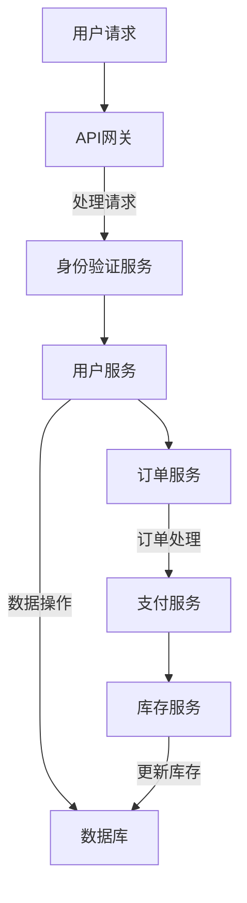
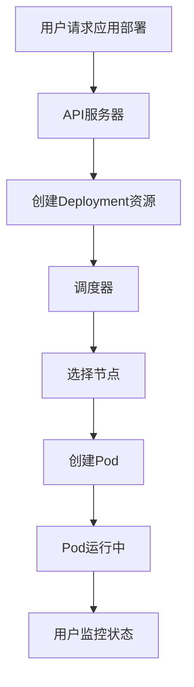
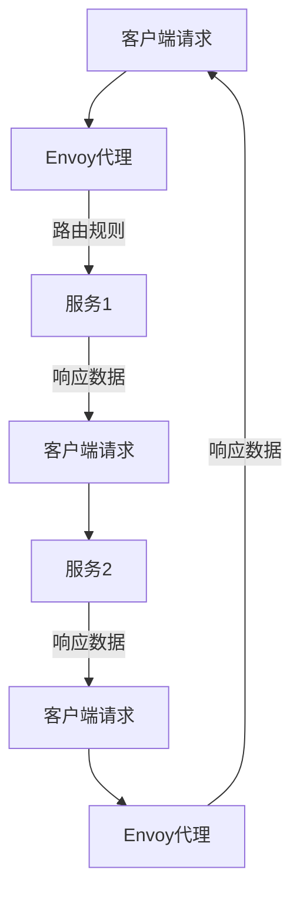

                 

## 文章标题：云原生技术在大规模分布式系统中的应用

### 关键词：云原生技术，大规模分布式系统，容器化，微服务，Kubernetes，服务网格，持续集成与持续部署，实时数据处理，安全性

### 摘要：

本文将深入探讨云原生技术在大规模分布式系统中的应用。首先，我们将简要介绍云原生技术的基本概念、核心原理及其在现代软件开发中的重要性。接着，我们将详细分析容器化、微服务架构、Kubernetes、服务网格等关键技术，并探讨它们如何共同构建起一个稳定、高效、可扩展的大规模分布式系统。此外，本文还将探讨如何在大规模分布式系统中实现实时数据处理和安全防护，并分享一些最佳实践和注意事项。通过本文的阅读，读者将能够全面理解云原生技术在大规模分布式系统中的应用，并掌握如何在实际项目中应用这些技术。

## 引言：云原生技术的兴起

在云计算和分布式系统迅猛发展的背景下，传统IT架构逐渐显露出其局限性。为了应对日益复杂的业务需求和高可用性要求，开发者们不断探索新的技术和架构，以期构建更加灵活、高效、可扩展的系统。正是在这样的背景下，云原生技术应运而生。

### 什么是云原生技术

云原生（Cloud Native）是指一种利用云计算环境进行设计和构建应用程序的方法论。云原生技术强调利用云服务的弹性、自动化和分布式特性，实现应用的快速部署、伸缩和自动化管理。其核心目标是使应用程序能够充分利用云计算的资源和能力，从而实现更高的可靠性和可扩展性。

### 云原生技术的核心概念

云原生技术包含了一系列核心概念和架构，其中最为重要的包括：

1. **容器化（Containerization）**：容器是一种轻量级的运行时环境，用于封装应用程序及其依赖项。容器通过隔离和轻量化的方式，使应用程序能够在不同的环境中一致运行，提高了部署的灵活性和效率。

2. **微服务架构（Microservices Architecture）**：微服务架构是一种将应用程序划分为多个独立的服务单元的方法。每个服务单元专注于实现特定功能，并通过API进行通信。这种架构方式提高了系统的可扩展性和容错性。

3. **持续集成与持续部署（CI/CD）**：持续集成与持续部署是一种自动化软件交付流程，通过不断集成代码变更、自动化测试和部署，提高了软件交付的速度和质量。

4. **服务网格（Service Mesh）**：服务网格是一种用于管理和通信的服务基础设施。它提供了服务之间的安全、可靠和高效通信，同时抽象化了服务之间的复杂性。

5. **自动化运维（Automated Operations）**：自动化运维通过自动化工具和脚本，实现了对基础设施和应用程序的自动化部署、监控和运维。

### 云原生技术的重要性

云原生技术具有以下几个重要优势：

1. **高可扩展性**：通过容器化和微服务架构，应用程序可以轻松地实现水平扩展，满足大规模业务需求。

2. **高可靠性**：云原生技术通过自动化和分布式架构，提高了系统的容错性和稳定性。

3. **高开发效率**：持续集成与持续部署等自动化工具，使开发流程更加高效，缩短了软件交付周期。

4. **高灵活性**：云原生技术支持多样化的开发环境，使应用程序能够灵活地适应不同的业务场景。

### 现代软件开发中的云原生

在现代软件开发中，云原生技术已经成为主流。越来越多的企业和开发团队开始采用云原生技术，以构建更加灵活、高效和可扩展的应用程序。云原生技术不仅适用于新项目的开发，也可以对现有系统进行改造和升级，使其更好地适应云计算环境。

总的来说，云原生技术为大规模分布式系统带来了全新的解决方案，使其能够更好地应对复杂的业务需求和不断变化的市场环境。随着云原生技术的不断发展和成熟，我们可以预见其在未来软件开发中的重要地位将更加稳固。

## 容器技术：构建灵活的大规模分布式系统

容器技术是云原生技术体系中的核心组件之一，它通过提供轻量级的运行时环境，使得应用程序能够在不同环境中一致运行，从而极大地提高了开发和部署的灵活性。在本节中，我们将深入探讨容器技术的基本概念、原理及其在大规模分布式系统中的应用。

### 容器技术的基本概念

容器（Container）是一种轻量级的运行时环境，它通过隔离机制将应用程序及其依赖项封装起来，形成一个独立的运行单元。容器与传统的虚拟机（VM）相比，具有以下几个显著优势：

1. **轻量级**：容器不需要完整的操作系统，因此其启动速度更快，资源占用更少。
2. **隔离性**：容器通过命名空间（Namespace）和用户命名空间（User Namespace）实现进程和资源的隔离，确保不同容器之间不会相互干扰。
3. **可移植性**：容器可以跨不同的操作系统和硬件平台运行，使其具有高度的灵活性和可移植性。
4. **效率高**：容器共享宿主机的操作系统内核，避免了重复加载操作系统带来的性能开销。

### 容器技术的原理

容器技术的核心原理包括以下几个方面：

1. **容器引擎**：容器引擎负责创建、启动、管理和停止容器。目前最流行的容器引擎是Docker。Docker通过其自带的容器运行时（Containerd）和编排工具（如Docker Compose）来管理容器。

2. **镜像（Image）**：容器镜像是一个静态的文件系统，包含了应用程序及其依赖项。Docker镜像通常基于Linux发行版构建，可以通过Dockerfile来定义和构建。

3. **容器（Container）**：容器是基于容器镜像运行的应用实例。Docker引擎通过解压缩镜像文件并启动容器进程来运行应用程序。

4. **仓库（Registry）**：容器仓库用于存储和分发容器镜像。Docker Hub是最流行的公共容器镜像仓库，开发者可以在其中分享和获取各种预构建的容器镜像。

### 容器技术在大规模分布式系统中的应用

容器技术在构建大规模分布式系统中发挥着重要作用，其应用主要体现在以下几个方面：

1. **微服务架构**：容器技术为微服务架构提供了理想的运行环境。通过将应用程序划分为多个独立的微服务，并部署到不同的容器中，可以实现高可扩展性和高容错性。

2. **服务编排**：容器编排工具（如Kubernetes）可以自动化管理容器的生命周期，包括启动、停止、扩展和更新。这使得大规模分布式系统的部署和管理更加高效。

3. **自动化运维**：容器技术支持自动化部署和运维，通过脚本和自动化工具，可以快速响应业务需求，实现快速迭代和交付。

4. **环境一致性**：容器确保了应用程序在不同环境（如开发、测试、生产）中的一致性，减少了因环境差异导致的问题。

5. **资源优化**：容器共享宿主机的操作系统内核，减少了资源浪费，提高了资源利用率。

### 伪代码示例

以下是一个简单的Dockerfile示例，用于构建一个简单的Web服务容器镜像：

```Dockerfile
# 使用官方的Python镜像作为基础镜像
FROM python:3.8-slim

# 设置工作目录
WORKDIR /app

# 复制应用程序代码到容器
COPY . .

# 安装依赖项
RUN pip install -r requirements.txt

# 暴露Web服务的端口
EXPOSE 8000

# 运行应用程序
CMD ["python", "app.py"]
```

在这个Dockerfile中，我们首先从Python 3.8-slim镜像开始构建，设置工作目录，复制应用程序代码，安装依赖项，暴露Web服务的端口，并指定启动应用程序的命令。

### 数学模型和公式

容器技术的核心数学模型可以描述为：

\[ \text{容器资源消耗} = \text{CPU} + \text{内存} + \text{存储} \]

其中，CPU、内存和存储分别表示容器在运行过程中消耗的资源。通过合理配置和管理容器资源，可以优化系统的资源利用率，提高整体性能。

### 举例说明

假设我们有一个包含100个微服务的大规模分布式系统，每个微服务都需要1个CPU核心、2GB内存和10GB存储。如果我们将这些微服务部署到一台拥有20个CPU核心、32GB内存和200GB存储的服务器上，我们可以通过容器技术实现资源的最大化利用。

通过容器编排工具（如Kubernetes），我们可以将100个微服务部署到这台服务器上，并根据服务器的资源限制对容器进行动态调整，确保每个服务都能得到足够的资源支持，同时避免资源浪费。

### 结论

容器技术通过其轻量级、隔离性、可移植性和高效性，成为构建大规模分布式系统的关键组件。在本文中，我们介绍了容器技术的基本概念、原理和应用，并通过伪代码和数学模型进行了详细讲解。通过容器技术，开发者可以更加灵活、高效地构建和管理大规模分布式系统，从而更好地满足现代业务需求。

## 微服务架构：实现灵活且可扩展的大规模分布式系统

### 背景介绍

随着互联网技术的迅猛发展和业务需求的不断变化，传统的单体架构（Monolithic Architecture）逐渐显露出其局限性。单体架构将应用程序的所有功能模块集中在一个大型的应用程序中，导致系统的复杂度高、扩展性差、维护困难。为了解决这些问题，微服务架构（Microservices Architecture）应运而生。

### 什么是微服务架构

微服务架构是一种将大型应用程序拆分成多个小型、独立的服务单元的架构风格。每个服务单元都专注于实现特定的业务功能，并通过轻量级的通信协议（如HTTP/HTTPS、gRPC等）进行通信。微服务架构的核心思想是通过将应用程序划分为多个独立的服务单元，实现系统的可扩展性、容错性和灵活性。

### 微服务架构的核心原理

微服务架构的核心原理包括以下几个方面：

1. **独立性**：每个微服务都是独立的，可以独立开发、测试、部署和扩展。这种独立性提高了系统的开发效率，减少了开发周期。

2. **自治性**：每个微服务都有自己的数据存储和管理，可以独立处理数据，减少了数据一致性管理的复杂性。

3. **分布式通信**：微服务之间通过分布式通信进行交互，通常使用轻量级的通信协议，如HTTP/HTTPS、gRPC等。这种通信方式使得服务之间可以独立扩展，提高了系统的可伸缩性。

4. **容器化**：容器技术为微服务提供了理想的运行环境。每个微服务都可以被封装在一个容器中，确保其可以在不同的环境中一致运行。

5. **自动化部署与运维**：微服务架构通常结合持续集成与持续部署（CI/CD）工具，实现自动化部署和运维，提高了系统的可靠性和效率。

### 微服务架构的优势

微服务架构具有以下几个显著优势：

1. **高可扩展性**：通过将应用程序拆分成多个独立的微服务，可以轻松实现水平扩展，满足大规模业务需求。

2. **高容错性**：由于每个微服务都是独立的，当某个服务出现故障时，其他服务仍然可以正常运行，提高了系统的容错性。

3. **高灵活性**：微服务架构支持灵活的部署和扩展策略，可以根据不同的业务需求，快速调整服务配置。

4. **高可维护性**：每个微服务都是独立的，可以独立开发和维护，降低了系统的复杂性。

5. **高可复用性**：微服务架构使得应用程序中的功能模块可以独立开发和复用，提高了开发效率。

### 微服务架构与云原生技术的联系

微服务架构与云原生技术密切相关。云原生技术为微服务架构提供了理想的运行环境，包括容器化、自动化部署、服务网格等。容器化技术使得微服务可以在不同的环境中一致运行，自动化部署工具（如Kubernetes）可以自动化管理微服务的生命周期，服务网格（如Istio）提供了微服务之间的安全、可靠和高效通信。

### Mermaid 流程图

以下是微服务架构的核心流程图，展示了服务之间的交互和通信：



在这个流程图中，用户请求通过API网关发送到各个微服务，每个微服务执行特定的业务逻辑，并通过数据库进行数据操作。订单服务会与支付服务和库存服务进行交互，确保订单处理和库存管理的正确性。

### 伪代码示例

以下是一个简单的伪代码示例，展示了用户服务如何与其他微服务进行通信：

```python
# 用户服务
def handle_user_request(request):
    # 验证用户身份
    if not authenticate(request):
        return unauthorized_response()
    
    # 获取用户信息
    user_info = get_user_info(request.user_id)
    
    # 处理用户请求
    response = process_request(user_info, request.data)
    
    # 返回响应
    return response

# 身份验证服务
def authenticate(request):
    # 实现身份验证逻辑
    # ...
    return True

# 用户信息服务
def get_user_info(user_id):
    # 从数据库中查询用户信息
    # ...
    return user_info

# 处理请求服务
def process_request(user_info, request_data):
    # 实现请求处理逻辑
    # ...
    return response
```

在这个伪代码中，用户服务通过身份验证服务验证用户身份，然后获取用户信息并处理请求。每个服务都是独立的，可以独立开发和部署。

### 数学模型和公式

微服务架构的核心数学模型可以描述为：

\[ \text{系统性能} = \sum_{i=1}^{n} \text{服务性能} \]

其中，n表示微服务的数量，服务性能表示每个微服务的响应时间和吞吐量。通过优化服务性能，可以提升整个系统的性能。

### 举例说明

假设我们有一个电商系统，包含用户服务、订单服务、支付服务、库存服务等四个微服务。每个微服务的响应时间为100ms，吞吐量为1000次/秒。如果我们想要提升系统的整体性能，可以通过水平扩展增加微服务的实例数量，例如增加4个用户服务实例、4个订单服务实例、4个支付服务实例和4个库存服务实例。这样，系统的吞吐量将增加到8000次/秒，同时响应时间将保持较低水平。

### 结论

微服务架构通过将应用程序拆分成多个小型、独立的服务单元，实现了系统的可扩展性、容错性和灵活性。在本文中，我们介绍了微服务架构的基本概念、原理和优势，并通过Mermaid流程图、伪代码示例和数学模型进行了详细讲解。通过微服务架构，开发者可以构建更加灵活、高效和可扩展的大规模分布式系统，从而更好地应对复杂的业务需求。

## Kubernetes：管理和编排大规模分布式系统

### 背景介绍

随着微服务架构的普及，容器化技术的应用日益广泛，如何高效地管理和编排大规模分布式系统成为一个关键问题。Kubernetes（简称K8s）正是为了解决这一问题而诞生的。Kubernetes是一个开源的容器编排平台，旨在自动化容器操作，包括部署、扩展和管理容器化应用程序。本文将深入探讨Kubernetes的基本概念、架构、核心组件及其在大型分布式系统中的应用。

### 什么是Kubernetes

Kubernetes是一个基于容器编排的集群管理系统，它提供了一种灵活、高效的方式来部署、管理和扩展容器化应用程序。Kubernetes集群由多个节点组成，每个节点上都运行着容器引擎（如Docker），节点可以是物理机或虚拟机。Kubernetes通过自动化和优化容器管理，使得大规模分布式系统的部署、扩展和维护变得更加简单和可靠。

### Kubernetes的架构

Kubernetes集群由以下核心组件组成：

1. **Master节点**：Master节点是Kubernetes集群的控制中心，负责集群的总体管理和协调工作。Master节点包括以下组件：
   - **API服务器（API Server）**：提供集群管理的统一入口点，所有其他组件都通过API服务器与集群进行通信。
   - **调度器（Scheduler）**：负责将容器调度到集群中的节点上。
   - **控制器管理器（Controller Manager）**：运行各种控制器，如副本控制器（Replica Controller）、端点控制器（Endpoints Controller）等，确保集群状态与预期状态保持一致。

2. **Worker节点**：Worker节点运行实际的应用程序容器，并接收来自Master节点的调度命令。

3. **Pod**：Pod是Kubernetes中最基本的部署单元，一个Pod可以包含一个或多个容器，这些容器共享资源（如网络和存储）。

4. **容器网络接口（CNI）**：负责为集群中的Pod提供网络连接。

5. **容器存储接口（CSI）**：负责为集群中的容器提供存储支持。

### Kubernetes的核心组件

以下是Kubernetes的几个核心组件及其功能：

1. **部署（Deployment）**：Deployment用于管理Pod的创建、更新和滚动升级。通过Deployment，可以定义期望的Pod状态，并确保集群中的Pod始终处于该状态。

2. **服务（Service）**：Service为Pod提供一个稳定的网络入口点，使得外部客户端可以通过特定的IP地址或域名访问Pod。Service可以通过DNS或负载均衡器实现流量分发。

3. **状态集（StatefulSet）**：StatefulSet用于管理有状态服务，确保Pod具有稳定的网络标识和持久存储。StatefulSet中的每个Pod都有一个唯一的标识和稳定的网络标识。

4. **存储卷（Persistent Volume, PV）**：存储卷提供持久的存储资源，可以分配给Pod使用。PV可以是本地的、网络存储或远程存储。

5. **配置和密钥管理（ConfigMaps and Secrets）**：ConfigMaps和Secrets用于存储和管理应用程序的配置信息和敏感数据。ConfigMaps存储非敏感配置信息，Secrets存储敏感信息。

### Kubernetes在大型分布式系统中的应用

Kubernetes在大型分布式系统中的应用体现在以下几个方面：

1. **自动化部署和扩展**：Kubernetes通过部署组件自动化部署和管理应用程序，可以轻松实现水平扩展，满足大规模业务需求。

2. **高可用性和容错性**：Kubernetes通过副本控制器（Replica Controller）确保应用程序的副本数符合预期，当节点故障或应用程序异常时，可以自动创建新的副本。

3. **服务发现和负载均衡**：Kubernetes通过Service组件实现服务发现和负载均衡，使得应用程序之间的通信更加高效和可靠。

4. **存储管理**：Kubernetes支持多种存储解决方案，可以通过PV和PVC为应用程序提供持久存储。

5. **配置和密钥管理**：Kubernetes通过ConfigMaps和Secrets提供了一种安全、方便的方式来管理应用程序的配置和敏感数据。

### Mermaid 流程图

以下是Kubernetes集群中Pod的创建和调度流程的Mermaid流程图：



在这个流程图中，用户请求部署应用程序，API服务器创建Deployment资源，调度器根据资源需求和节点状态选择合适的节点创建Pod，最后Pod运行并可供用户监控。

### 伪代码示例

以下是一个简单的Kubernetes部署文件的伪代码示例：

```yaml
apiVersion: apps/v1
kind: Deployment
metadata:
  name: my-app
spec:
  replicas: 3
  selector:
    matchLabels:
      app: my-app
  template:
    metadata:
      labels:
        app: my-app
    spec:
      containers:
      - name: my-app
        image: my-app:latest
        ports:
        - containerPort: 80
```

在这个部署文件中，我们定义了一个名为`my-app`的Deployment，它包含3个副本，每个副本运行一个基于`my-app:latest`镜像的容器，容器暴露了80端口。

### 数学模型和公式

Kubernetes集群的性能可以描述为：

\[ \text{集群性能} = \sum_{i=1}^{n} \text{节点性能} \]

其中，n表示节点数量，节点性能表示每个节点的计算、存储和网络能力。通过优化节点性能和资源利用率，可以提高集群的整体性能。

### 举例说明

假设我们有一个包含10个节点的Kubernetes集群，每个节点拥有8个CPU核心、16GB内存和500GB存储。如果我们部署了一个需要4个CPU核心、8GB内存的应用程序，可以将该应用程序部署到2个节点上，从而充分利用集群资源，同时保证应用程序的性能。

### 结论

Kubernetes作为一种强大的容器编排工具，为管理和编排大规模分布式系统提供了有效的解决方案。在本文中，我们介绍了Kubernetes的基本概念、架构、核心组件及其在大型分布式系统中的应用。通过Kubernetes，开发者可以轻松实现自动化部署、扩展和管理容器化应用程序，从而提高系统的可靠性和效率。

## 服务网格：优化大规模分布式系统中的服务通信

### 背景介绍

在微服务架构中，服务之间的通信是确保系统稳定运行的关键。然而，随着服务数量的增加，服务间的通信变得越来越复杂，传统的服务发现和负载均衡方案逐渐显露出其局限性。为了解决这一问题，服务网格（Service Mesh）应运而生。服务网格是一种基础设施层的技术，它提供了服务间通信的安全、可靠和高效管理。

### 什么是服务网格

服务网格是一种用于管理和通信的服务基础设施，它独立于应用程序的业务逻辑，为服务间提供了动态的、可扩展的通信能力。服务网格通过抽象化服务间的通信细节，使得开发人员可以专注于业务逻辑的实现，而无需担心服务发现的复杂性、服务间的安全性和通信的高效性。

### 服务网格的核心原理

服务网格的核心原理包括以下几个方面：

1. **服务代理（Service Proxy）**：服务代理（如Istio中的Envoy）运行在服务的每个实例上，负责代理服务间的通信。服务代理提供了流量管理、安全性和监控等功能。

2. **服务发现**：服务网格通过服务发现机制，动态获取服务的IP地址和端口信息，确保服务之间能够正确通信。

3. **服务间通信**：服务网格提供了基于HTTP/HTTPS、gRPC等协议的通信接口，服务代理负责将请求路由到目标服务实例。

4. **流量管理**：服务网格可以通过路由规则、断路器、限流等机制，实现对服务间流量的精细控制，确保系统的高可用性和性能。

5. **安全性**：服务网格通过身份认证、访问控制、加密等机制，保障服务间的通信安全。

6. **监控和日志**：服务网格提供了监控和日志收集功能，使得开发者可以实时了解服务间通信的状态和性能。

### 服务网格的优势

服务网格具有以下几个显著优势：

1. **解耦业务逻辑与通信细节**：服务网格将服务间的通信细节抽象化，使得业务逻辑与通信逻辑解耦，提高了系统的可维护性和扩展性。

2. **服务间通信安全性**：服务网格通过加密和身份认证等机制，保障了服务间通信的安全性。

3. **流量管理和监控**：服务网格提供了丰富的流量管理和监控功能，使得开发者可以轻松实现服务间的流量调度、监控和日志分析。

4. **高可用性和容错性**：服务网格通过断路器和限流等机制，提高了系统的高可用性和容错性。

5. **可扩展性**：服务网格通过动态服务发现和负载均衡，实现了服务间通信的可扩展性。

### 服务网格与微服务架构的关系

服务网格与微服务架构密切相关。微服务架构通过将应用程序划分为多个独立的服务单元，实现了系统的可扩展性和灵活性。而服务网格则通过管理和优化服务间通信，进一步提升了系统的性能和可靠性。服务网格为微服务架构提供了一个统一的通信层，使得开发者可以专注于业务逻辑的实现，而无需担心服务发现的复杂性、服务间的安全性和通信的高效性。

### Mermaid 流程图

以下是服务网格中服务间通信的流程图：



在这个流程图中，客户端请求通过Envoy代理路由到服务1，服务1处理后返回响应，接着请求继续路由到服务2，服务2处理后再返回响应，最终由Envoy代理返回给客户端。

### 伪代码示例

以下是一个简单的服务网格配置文件，展示了如何配置Envoy代理：

```yaml
apiVersion: networking.istio.io/v1alpha3
kind: ServiceEntry
metadata:
  name: service1
spec:
  hosts:
  - service1.example.com
  ports:
  - number: 80
    name: http
    protocol: HTTP
  addresses:
  - "192.168.1.100"
  location: MESH_INTERNAL

---
apiVersion: networking.istio.io/v1alpha3
kind: DestinationRule
metadata:
  name: service1
spec:
  hosts:
  - service1.example.com
  trafficPolicy:
    loadBalancer:
      simple: ROUND_ROBIN
```

在这个配置文件中，我们定义了一个名为`service1`的服务入口，指定了服务的IP地址、端口和协议，并配置了负载均衡策略。

### 数学模型和公式

服务网格的性能可以描述为：

\[ \text{服务网格性能} = \sum_{i=1}^{n} \text{服务性能} \]

其中，n表示服务数量，服务性能表示每个服务的响应时间和吞吐量。通过优化服务性能，可以提高整个服务网格的性能。

### 举例说明

假设我们有一个包含5个服务的服务网格，每个服务的响应时间为100ms，吞吐量为1000次/秒。如果我们想要提高整个服务网格的性能，可以通过增加服务实例的数量，例如将每个服务扩展到5个实例，从而提高系统的吞吐量和响应时间。

### 结论

服务网格通过提供统一的服务间通信管理，解决了大规模分布式系统中服务间通信的复杂性问题。在本文中，我们介绍了服务网格的基本概念、原理和优势，并通过Mermaid流程图和伪代码示例进行了详细讲解。通过服务网格，开发者可以构建更加安全、高效和可扩展的大规模分布式系统。

## 持续集成与持续部署：提升大规模分布式系统的交付速度

### 背景介绍

在云计算和分布式系统时代，软件交付的速度和频率成为衡量一个团队高效性的关键指标。传统的软件开发和交付流程往往耗时较长，难以快速响应用户需求和市场变化。为了解决这个问题，持续集成（Continuous Integration，CI）和持续部署（Continuous Deployment，CD）应运而生。CI/CD是一种自动化软件交付流程，通过持续集成代码变更、自动化测试和部署，实现了快速、可靠和高效的软件交付。

### 什么是持续集成与持续部署

**持续集成（CI）** 是指在软件开发过程中，每次代码提交后，系统都会自动进行集成和测试，以确保代码质量。CI的核心目标是尽早发现和修复集成过程中出现的问题，防止缺陷积累。

**持续部署（CD）** 是指在CI的基础上，将经过测试的代码自动部署到生产环境。CD的目标是确保软件在交付过程中始终处于可用状态，并且能够快速回滚到上一个版本，以便在出现问题时迅速恢复。

### CI/CD的核心原理

CI/CD的核心原理包括以下几个方面：

1. **代码仓库**：开发者将代码提交到代码仓库（如Git），每次提交都会触发CI流程。

2. **构建服务器**：CI服务器从代码仓库中拉取最新代码，进行编译、构建和测试。

3. **自动化测试**：CI服务器执行预定义的测试脚本，包括单元测试、集成测试和性能测试，确保代码质量。

4. **构建与部署**：通过自动化脚本，将经过测试的代码部署到测试环境或生产环境。

5. **监控与反馈**：CI/CD系统提供实时监控和反馈，确保开发人员能够及时了解代码状态和部署进度。

### CI/CD的优势

CI/CD具有以下几个显著优势：

1. **快速交付**：通过自动化测试和部署，大大缩短了软件交付周期，提高了开发效率。

2. **代码质量**：CI流程确保了每次提交的代码都经过严格测试，减少了缺陷和Bug的产生。

3. **协同工作**：CI/CD促进了团队间的协作，提高了代码复用和代码质量。

4. **风险控制**：通过自动化测试和部署，可以及时发现和修复问题，降低了软件发布风险。

5. **可追溯性**：CI/CD系统提供了详细的构建和部署日志，便于追踪和解决交付过程中的问题。

### CI/CD在大型分布式系统中的应用

在大型分布式系统中，CI/CD的应用至关重要。以下是一些典型应用场景：

1. **微服务架构**：CI/CD可以自动化构建和部署微服务，确保每个服务都能快速交付和更新。

2. **容器化应用**：CI/CD与容器技术相结合，可以自动化部署和管理容器化应用程序。

3. **混合云与多云环境**：CI/CD系统可以支持跨多个云平台和环境的自动化部署。

4. **自动化测试**：通过CI/CD，可以自动化执行各种测试，包括单元测试、集成测试和性能测试，确保软件质量。

5. **故障恢复**：CI/CD系统可以快速回滚到上一个版本，确保在出现问题时能够迅速恢复。

### 伪代码示例

以下是一个简单的CI/CD流水线配置文件，展示了如何配置Jenkins来实现自动化测试和部署：

```groovy
pipeline {
    agent any
    stages {
        stage('Checkout') {
            steps {
                checkoutSCM([$class: 'GitSCM', branches: [[name: 'master']], userRemote: 'origin'])
            }
        }
        stage('Build') {
            steps {
                sh 'mvn clean install'
            }
        }
        stage('Test') {
            steps {
                sh 'mvn test'
            }
        }
        stage('Deploy') {
            steps {
                sh 'kubectl apply -f deployment.yml'
            }
        }
    }
    post {
        always {
            echo 'Build finished'
        }
    }
}
```

在这个配置文件中，Jenkins会首先从Git仓库中检出代码，然后执行构建和测试，最后将应用程序部署到Kubernetes集群。

### 数学模型和公式

CI/CD的性能可以描述为：

\[ \text{CI/CD性能} = \frac{\text{交付速度}}{\text{交付次数}} \]

其中，交付速度表示从代码提交到部署完成所需的时间，交付次数表示在一段时间内的交付频率。通过优化CI/CD流程，可以提升交付速度和频率。

### 举例说明

假设一个团队每月需要交付10次软件更新，每次更新的交付周期为一周。通过优化CI/CD流程，将交付周期缩短到两天，则每月交付次数将增加到30次，大大提高了交付速度和频率。

### 结论

持续集成与持续部署通过自动化和流水线化软件交付流程，大大提高了开发效率和软件质量。在本文中，我们介绍了CI/CD的基本概念、原理和优势，并通过伪代码示例进行了详细讲解。通过CI/CD，开发者可以构建更加高效、可靠和可扩展的大型分布式系统，更好地满足业务需求。

## 实时数据处理：云原生技术在金融交易系统中的应用

### 背景介绍

在金融行业中，实时数据处理至关重要，尤其是在高频交易、风险控制和反欺诈等领域。传统的批处理系统在处理大量历史数据时表现良好，但在应对实时数据时存在明显不足。随着云原生技术的兴起，开发人员开始探索如何利用云原生技术构建实时数据处理系统，以满足金融行业的高性能和高可靠性要求。本文将探讨云原生技术在金融交易系统中的应用，重点介绍如何利用Kafka、Flink等工具实现高效的实时数据处理。

### 高性能实时数据处理的需求

金融交易系统需要处理海量的实时数据，包括交易记录、账户信息、市场数据等。这些数据的特点是数据量大、实时性强、多样化，对系统的处理能力和可靠性提出了极高要求。具体需求包括：

1. **低延迟**：高频交易系统需要毫秒级的数据处理延迟，以确保交易决策的及时性。

2. **高吞吐量**：系统需要能够处理每秒数百万甚至数十亿条记录，以满足大规模交易场景。

3. **可靠性**：系统必须保证数据不丢失，并且在面对故障时能够快速恢复。

4. **可扩展性**：系统应能够灵活扩展，以应对数据量和业务需求的增长。

### 实时数据处理工具的选择

为了满足上述需求，金融交易系统通常选择以下实时数据处理工具：

1. **Kafka**：Kafka是一个分布式流处理平台，具备高吞吐量、低延迟和高可靠性的特点，适用于大规模数据流处理。Kafka通过分布式架构和基于磁盘的存储，实现了对大规模实时数据的持久化存储和高效消费。

2. **Apache Flink**：Flink是一个开源的流处理框架，提供了强大的流数据处理能力和复杂的事件处理功能。Flink通过其内存管理和计算引擎，实现了毫秒级的数据处理延迟，并且具有强大的容错性和故障恢复能力。

### 实时数据处理流程

金融交易系统的实时数据处理流程通常包括以下几个步骤：

1. **数据采集**：系统从各种数据源（如交易系统、账户系统、市场数据接口）采集实时数据，并将数据发送到Kafka。

2. **数据存储**：Kafka将采集到的实时数据持久化存储，确保数据不丢失，同时支持高并发访问。

3. **数据消费**：Flink从Kafka中消费数据，并进行实时处理，包括数据分析、计算和聚合等操作。

4. **数据输出**：处理后的数据被输出到下游系统，如风险管理、交易决策系统等。

### 伪代码示例

以下是一个简单的实时数据处理伪代码示例，展示了如何使用Kafka和Flink进行实时数据处理：

```python
# Kafka生产者
def produce_message(topic, message):
    producer = KafkaProducer(bootstrap_servers=['kafka:9092'])
    producer.send(topic, message)

# Kafka消费者
def consume_messages(topic):
    consumer = KafkaConsumer(bootstrap_servers=['kafka:9092'], topic=topic)
    for message in consumer:
        process_message(message)

# Flink数据处理
def process_message(message):
    # 实现数据处理逻辑
    # ...
    return result

# 主程序
def main():
    # 生产消息
    produce_message('trading_data', 'transaction_data')
    # 消费消息并处理
    consume_messages('trading_data')

if __name__ == "__main__":
    main()
```

在这个示例中，Kafka生产者将交易数据发送到Kafka主题，Kafka消费者从主题中消费数据，并传递给Flink进行实时处理。

### 数学模型和公式

实时数据处理系统的性能可以描述为：

\[ \text{系统性能} = \frac{\text{处理能力}}{\text{延迟}} \]

其中，处理能力表示系统每秒处理的数据量，延迟表示从数据接收和处理完成的时间。通过优化处理能力和降低延迟，可以提高系统的性能。

### 举例说明

假设一个金融交易系统需要每秒处理1百万条交易记录，处理延迟为1毫秒。通过优化系统架构和计算资源，可以将处理能力提升到10百万条/秒，同时将延迟降低到0.5毫秒，从而显著提高系统的性能。

### 结论

云原生技术为金融交易系统的实时数据处理提供了高效的解决方案。通过Kafka和Flink等工具，金融交易系统可以实现低延迟、高吞吐量和可靠的数据处理，满足高性能和高可靠性的要求。在本文中，我们介绍了实时数据处理的需求、工具选择和流程，并通过伪代码示例进行了详细讲解。通过云原生技术，开发者可以构建更加高效和可靠的金融交易系统，提升业务竞争力和用户体验。

## 云原生安全性：保障大规模分布式系统的安全

### 背景介绍

随着云原生技术的广泛应用，大规模分布式系统的安全性成为亟待解决的问题。云原生环境下的安全性挑战主要来自于容器化、微服务架构和自动化运维等方面。为了保证系统的安全性，必须采用一系列措施来应对这些挑战。本文将探讨云原生安全性，重点介绍容器安全策略、服务网格安全机制以及如何保障大规模分布式系统的安全。

### 容器安全策略

容器安全是云原生安全性的基础。以下是一些关键的容器安全策略：

1. **镜像安全**：确保使用的容器镜像来自可信来源，通过扫描镜像中的漏洞和依赖项，避免使用存在安全问题的镜像。

2. **最小权限原则**：容器应运行在最小权限下，只授予必要的权限和资源访问权限，以减少恶意代码的攻击面。

3. **容器签名和验证**：对容器进行签名，确保容器镜像未被篡改，并在启动容器时验证签名，确保容器的一致性和完整性。

4. **网络隔离**：通过容器网络命名空间（Network Namespace）实现容器间的网络隔离，防止容器间恶意攻击。

5. **监控和日志**：实施容器监控和日志记录，及时发现和响应异常行为，确保系统的安全性。

### 服务网格安全机制

服务网格提供了微服务间的安全通信，以下是一些关键的安全机制：

1. **服务认证和授权**：通过服务网格，可以实现对服务间的认证和授权，确保只有经过验证的服务可以访问其他服务。

2. **通信加密**：服务网格可以使用TLS/SSL等加密协议，保护服务间的通信安全，防止中间人攻击和数据泄露。

3. **访问控制**：通过定义细粒度的访问控制策略，限制服务间的访问权限，防止未授权访问。

4. **断路器和限流**：服务网格可以实现对服务间流量的断路器和限流，防止服务过载和恶意攻击。

5. **网络隔离**：通过服务网格，可以实现服务间的网络隔离，防止内部服务被外部攻击。

### 如何保障大规模分布式系统的安全

为了保障大规模分布式系统的安全，需要从以下几个方面着手：

1. **全面的安全评估**：定期对系统进行安全评估，发现和修复潜在的安全漏洞，确保系统的安全性。

2. **安全的自动化运维**：通过安全的自动化工具和脚本，实现系统的自动化部署、监控和运维，减少人为干预，降低安全风险。

3. **安全培训和意识提升**：加强开发团队和运维团队的安全培训，提升安全意识和技能，确保团队成员能够正确处理安全事件。

4. **安全监控和审计**：实施全面的安全监控和审计，实时监测系统的异常行为和潜在威胁，确保系统的安全性。

5. **紧急响应和恢复计划**：制定紧急响应和恢复计划，确保在发生安全事件时能够迅速响应，将损失降到最低。

### 伪代码示例

以下是一个简单的容器安全策略配置文件，展示了如何配置Docker安全选项：

```yaml
version: "3.7"
services:
  my-app:
    image: my-app:latest
    security_opt:
      - no-new-privileges:true
      - device:devtmpfs
        o: "seclabel"
      - label:role=unconfined
    networks:
      - my-app-network
    deploy:
      restart: unless-stopped
```

在这个配置文件中，我们使用了`no-new-privileges`选项，确保容器无法获取新的权限，使用了`seclabel`选项来设置容器的安全标签，以减少攻击面。

### 数学模型和公式

云原生安全性的保障可以描述为：

\[ \text{安全性} = \text{安全策略} \times \text{响应速度} \]

其中，安全策略表示系统的安全措施，响应速度表示在发生安全事件时系统能够迅速响应的能力。通过加强安全策略和提升响应速度，可以提高系统的安全性。

### 举例说明

假设一个系统采用了全面的容器安全策略，并能够在一分钟内响应和解决安全事件。通过优化安全策略和响应速度，可以将系统的安全性提升到新的水平。

### 结论

云原生安全性是保障大规模分布式系统安全的关键。通过容器安全策略、服务网格安全机制以及全面的监控和响应措施，开发者可以构建一个安全可靠的大规模分布式系统。在本文中，我们介绍了云原生安全性的核心概念、策略和保障措施，并通过伪代码示例进行了详细讲解。通过实施这些措施，开发者可以确保大规模分布式系统的安全性，保护数据和业务的完整性。

## 案例分析一：电商平台的云原生转型

### 案例背景

某大型电商平台在业务快速发展过程中，面临着系统复杂度高、扩展性差、运维困难等问题。为了应对这些挑战，该电商平台决定进行云原生转型，以提升系统的灵活性、可扩展性和可靠性。

### 转型目标

1. **提高系统可扩展性**：通过微服务架构和容器技术，实现系统的水平扩展，满足不断增长的业务需求。
2. **简化运维**：通过自动化运维和持续集成与持续部署（CI/CD）工具，简化系统的运维流程，提高运维效率。
3. **提升性能**：通过服务网格和实时数据处理技术，优化系统性能，提高用户体验。
4. **保障安全性**：采用容器安全策略和服务网格安全机制，确保系统的安全性。

### 转型过程

1. **需求分析和架构设计**：
   - 分析现有系统的瓶颈和业务需求，确定需要拆分的微服务。
   - 设计微服务架构，明确各个微服务的功能、数据流和通信方式。

2. **容器化迁移**：
   - 将现有应用迁移到容器环境中，使用Docker和Kubernetes进行容器化部署。
   - 创建Docker镜像，封装应用程序及其依赖项，确保在不同环境中的一致性。

3. **微服务部署**：
   - 使用Kubernetes进行微服务部署和管理，实现自动化部署、扩展和故障恢复。
   - 配置Kubernetes集群，确保服务的高可用性和容错性。

4. **服务网格集成**：
   - 集成Istio等服务网格工具，实现微服务间的安全、可靠通信。
   - 配置服务网格，实现服务认证、访问控制和流量管理。

5. **CI/CD工具集成**：
   - 集成Jenkins等CI/CD工具，实现代码自动化构建、测试和部署。
   - 配置流水线，确保代码变更后快速测试和部署。

6. **实时数据处理**：
   - 使用Kafka和Flink等工具，构建实时数据处理系统，处理用户行为数据和交易数据。
   - 实现实时数据分析和推荐，提升用户体验。

7. **安全防护**：
   - 采用容器安全策略，确保容器镜像和运行时的安全性。
   - 实施服务网格安全机制，保障服务间的通信安全。

### 实施效果分析

通过云原生转型，电商平台取得了显著的效果：

1. **系统性能提升**：通过容器化和微服务架构，系统的响应速度显著提升，用户访问流畅度得到改善。
2. **扩展性增强**：通过水平扩展，系统可以轻松应对业务增长，提高了系统的可扩展性。
3. **运维效率提高**：通过自动化运维和CI/CD工具，运维工作量显著减少，运维效率大幅提升。
4. **安全性增强**：通过容器安全策略和服务网格安全机制，系统的安全性得到保障，风险降低。

### 项目小结

通过本案例，我们可以看到云原生技术为电商平台带来了显著的性能提升和运维效率。在云原生转型过程中，需要关注以下几个方面：

1. **需求分析和架构设计**：明确业务需求和系统瓶颈，设计合理的微服务架构。
2. **容器化迁移**：确保应用程序能够在容器环境中稳定运行。
3. **自动化部署和管理**：通过Kubernetes和CI/CD工具，实现自动化部署和运维。
4. **实时数据处理**：利用Kafka和Flink等工具，提升系统的实时数据处理能力。
5. **安全性保障**：采用容器安全策略和服务网格安全机制，确保系统的安全性。

通过这些措施，电商平台成功实现了云原生转型，为业务的持续发展奠定了坚实的基础。

## 案例分析二：金融行业的云原生实践

### 案例背景

某国际知名金融机构在业务快速扩展过程中，面临着系统复杂性增加、维护成本上升、扩展能力不足等问题。为了提升系统的性能、可靠性和可扩展性，该金融机构决定进行云原生实践，引入容器化、微服务架构和持续集成与持续部署（CI/CD）等先进技术。

### 转型目标

1. **提升系统性能和可靠性**：通过容器化和微服务架构，实现系统的高性能和高可靠性。
2. **增强系统扩展性**：通过水平扩展，提升系统应对高并发和大数据量的能力。
3. **简化运维**：通过CI/CD工具，简化系统的开发和部署流程，提高运维效率。
4. **保障数据安全性**：通过容器安全策略和服务网格安全机制，确保数据的安全和隐私。

### 转型过程

1. **需求分析和架构设计**：
   - 分析现有系统的瓶颈和业务需求，确定需要拆分的微服务。
   - 设计微服务架构，明确各个微服务的功能、数据流和通信方式。

2. **容器化迁移**：
   - 使用Docker和Kubernetes，将现有应用迁移到容器环境中，实现应用的容器化部署。
   - 创建Docker镜像，封装应用程序及其依赖项，确保在不同环境中的一致性。

3. **微服务部署**：
   - 使用Kubernetes进行微服务部署和管理，实现自动化部署、扩展和故障恢复。
   - 配置Kubernetes集群，确保服务的高可用性和容错性。

4. **CI/CD工具集成**：
   - 集成Jenkins等CI/CD工具，实现代码自动化构建、测试和部署。
   - 配置流水线，确保代码变更后快速测试和部署。

5. **实时数据处理**：
   - 使用Kafka和Flink等工具，构建实时数据处理系统，处理金融交易数据和市场数据。
   - 实现实时数据分析和决策，提高业务运营效率。

6. **安全性保障**：
   - 采用容器安全策略，确保容器镜像和运行时的安全性。
   - 实施服务网格安全机制，保障服务间的通信安全。

### 面临的挑战与解决策略

1. **系统复杂性增加**：
   - **挑战**：微服务架构引入了更多的服务实例和通信路径，导致系统复杂性增加。
   - **解决策略**：通过持续集成与持续部署（CI/CD）工具，实现自动化测试和部署，减少手动操作，降低人为错误。

2. **数据一致性和隔离**：
   - **挑战**：在分布式系统中，如何保证数据的一致性和隔离性。
   - **解决策略**：采用分布式数据库和事务管理机制，如分布式事务和最终一致性，确保数据一致性和隔离性。

3. **安全风险**：
   - **挑战**：云原生环境下的安全性挑战，如容器逃逸、服务网格漏洞等。
   - **解决策略**：采用严格的容器安全策略，如最小权限原则、容器签名和验证等，确保容器安全。同时，实施服务网格安全机制，如TLS加密、访问控制等，保障通信安全。

### 项目小结

通过云原生实践，该金融机构取得了显著的成果：

1. **系统性能提升**：通过容器化和微服务架构，系统的响应速度和吞吐量显著提升，满足了高并发和大数据量的需求。
2. **扩展性增强**：通过水平扩展，系统可以轻松应对业务增长，提高了系统的可扩展性。
3. **运维效率提高**：通过CI/CD工具，简化了系统的开发和部署流程，运维效率大幅提升。
4. **安全性增强**：通过容器安全策略和服务网格安全机制，系统的安全性得到保障，风险降低。

本项目为金融机构提供了一个高效、可扩展和安全的云原生解决方案，为业务的持续发展奠定了坚实的基础。通过本案例，我们可以看到云原生技术在金融行业中的重要应用价值。

## 附录：云原生技术相关工具与资源

### Kubernetes常用命令与配置

1. **安装Kubernetes**：
   - 使用kubeadm安装Kubernetes集群：
     ```bash
     kubeadm init --pod-network-cidr=10.244.0.0/16
     ```
   - 配置kubectl工具：
     ```bash
     mkdir -p $HOME/.kube
     sudo cp -i /etc/kubernetes/admin.conf $HOME/.kube/config
     sudo chown $(id -u):$(id -g) $HOME/.kube/config
     ```

2. **管理节点**：
   - 查看节点状态：
     ```bash
     kubectl get nodes
     ```
   - 更新节点状态：
     ```bash
     kubectl uncordon <node-name>
     ```

3. **管理Pod**：
   - 创建Pod：
     ```bash
     kubectl create pod <pod-name> --image=<image-name>
     ```
   - 查看Pod状态：
     ```bash
     kubectl get pods
     ```

4. **管理部署**：
   - 创建Deployment：
     ```bash
     kubectl create deployment <deployment-name> --image=<image-name>
     ```
   - 暴露服务：
     ```bash
     kubectl expose deployment <deployment-name> --type=LoadBalancer
     ```

5. **管理服务**：
   - 查看服务列表：
     ```bash
     kubectl get services
     ```
   - 进入Pod的终端：
     ```bash
     kubectl exec -it <pod-name> -- /bin/bash
     ```

### 容器镜像制作与仓库管理

1. **制作容器镜像**：
   - 使用Dockerfile构建镜像：
     ```Dockerfile
     FROM python:3.8-slim
     WORKDIR /app
     COPY . .
     RUN pip install -r requirements.txt
     EXPOSE 8000
     CMD ["python", "app.py"]
     ```
   - 构建镜像：
     ```bash
     docker build -t <image-name> .
     ```

2. **管理容器镜像仓库**：
   - 上传镜像到Docker Hub：
     ```bash
     docker login
     docker push <image-name>
     ```
   - 从Docker Hub拉取镜像：
     ```bash
     docker pull <image-name>
     ```

### 云原生相关书籍与资料推荐

1. **书籍**：
   - 《Kubernetes权威指南》
   - 《云原生应用架构指南》
   - 《容器化与云原生应用》
   - 《云原生Java应用开发实战》

2. **在线资源**：
   - Kubernetes官方文档：[https://kubernetes.io/docs/](https://kubernetes.io/docs/)
   - Docker官方文档：[https://docs.docker.com/](https://docs.docker.com/)
   - Istio官方文档：[https://istio.io/docs/](https://istio.io/docs/)
   - 云原生计算基金会（CNCF）官网：[https://www.cncf.io/](https://www.cncf.io/)

3. **开源项目**：
   - Kubernetes：[https://github.com/kubernetes](https://github.com/kubernetes)
   - Docker：[https://github.com/docker](https://github.com/docker)
   - Istio：[https://github.com/istio/istio](https://github.com/istio/istio)
   - Kafka：[https://github.com/apache/kafka](https://github.com/apache/kafka)
   - Flink：[https://github.com/apache/flink](https://github.com/apache/flink)

通过这些工具和资源，开发者可以更好地掌握云原生技术，并应用于实际项目中。希望这些内容对您的学习和发展有所帮助。

## 总结

本文详细探讨了云原生技术在大规模分布式系统中的应用，涵盖了从容器化、微服务架构、Kubernetes、服务网格到持续集成与持续部署、实时数据处理以及安全性的各个方面。我们通过背景介绍、核心概念、原理分析、案例分析和工具资源，逐步展示了云原生技术如何助力大规模分布式系统的构建。

### 核心观点总结

1. **容器化**：容器技术通过轻量级、隔离性、可移植性和高效性，为大规模分布式系统提供了灵活的运行环境。
2. **微服务架构**：微服务架构将应用程序拆分成多个独立的服务单元，提高了系统的可扩展性和容错性。
3. **Kubernetes**：Kubernetes作为容器编排工具，自动化管理容器的生命周期，确保系统的稳定运行。
4. **服务网格**：服务网格提供了一种抽象化、统一的服务间通信管理，提高了系统的安全性和性能。
5. **持续集成与持续部署**：CI/CD工具实现了自动化测试和部署，提高了软件交付的速度和质量。
6. **实时数据处理**：实时数据处理技术通过Kafka、Flink等工具，确保金融等行业的高性能数据处理需求。
7. **安全性**：容器安全策略和服务网格安全机制保障了系统的安全性。

### 最佳实践与注意事项

1. **需求分析与设计**：在引入云原生技术之前，进行详细的需求分析和架构设计，确保技术选型的合理性。
2. **容器化迁移**：逐步容器化现有应用，避免一次性大规模迁移带来的风险。
3. **自动化部署**：充分利用CI/CD工具，实现自动化部署和管理，提高运维效率。
4. **安全性**：严格实施容器安全策略和服务网格安全机制，确保系统的安全性和隐私。
5. **性能优化**：持续监控和优化系统性能，确保在高并发和大数据量场景下的稳定运行。

### 拓展阅读建议

- 《Kubernetes权威指南》
- 《云原生应用架构指南》
- 《容器化与云原生应用》
- 《云原生Java应用开发实战》
- Kubernetes官方文档：[https://kubernetes.io/docs/](https://kubernetes.io/docs/)
- Docker官方文档：[https://docs.docker.com/](https://docs.docker.com/)

通过持续学习和实践，开发者可以更好地掌握云原生技术，构建高效、可靠和可扩展的大规模分布式系统，助力企业数字化转型和业务创新。希望本文能为您的技术学习和项目实践提供有益的参考。作者：AI天才研究院 & 禅与计算机程序设计艺术。

