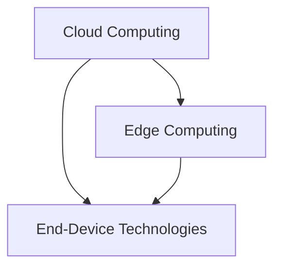
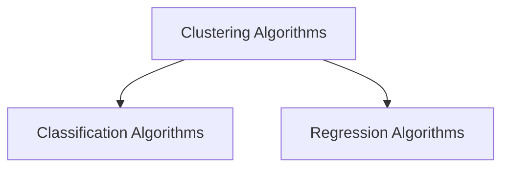
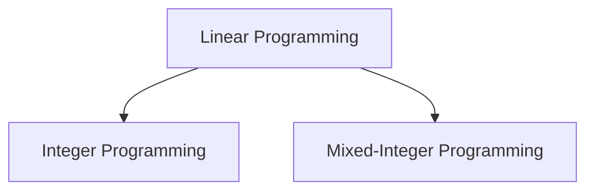

                 

### Cloud-Edge-End Collaborative Computing Development Trends

#### Keywords:
- Cloud-Edge-End Computing
- Collaborative Architecture
- Machine Learning
- Optimization Models
- Real-World Applications

#### Abstract:
This article delves into the development trends of cloud-edge-end collaborative computing, exploring the fundamental concepts, architectural principles, and practical applications. It provides a comprehensive overview of the key algorithms and mathematical models driving the field, along with real-world case studies and practical tips for developers. The article aims to offer insights into the future directions and challenges of cloud-edge-end computing, highlighting its significance in modern IT infrastructure.

---

## Introduction to Cloud-Edge-End Collaborative Computing

### Background

The rapid advancement of information technology has led to an increasing demand for efficient and scalable computing solutions. Traditional centralized computing models, which rely heavily on cloud infrastructures, have proven to be effective in handling large-scale data processing and storage. However, as the volume and complexity of data continue to grow, the limitations of this centralized approach have become more apparent. This has given rise to the concept of edge computing, which aims to bring computational power closer to the data sources and end-users.

### Core Concepts and Contact

Cloud computing, edge computing, and end-device technologies are the three main components of cloud-edge-end collaborative computing. Cloud computing provides scalable and on-demand access to computing resources, such as servers, storage, and databases. Edge computing, on the other hand, focuses on deploying computing resources at the network edge, closer to the data sources. End-device technologies refer to the various devices, such as smartphones, tablets, and IoT devices, that interact with the cloud and edge computing environments.

#### Mermaid Flowchart of Cloud-Edge-End Architecture

## Core Concepts and Architectural Principles

### Cloud Computing Fundamentals

Cloud computing provides on-demand access to a shared pool of configurable computing resources that can be rapidly provisioned and released with minimal management effort. The key characteristics of cloud computing are scalability, elasticity, and resource pooling.

#### Scalability

Scalability refers to the ability of a system to handle increasing workloads by adding resources as needed. Cloud computing platforms, such as Amazon Web Services (AWS), Microsoft Azure, and Google Cloud Platform (GCP), offer scalable solutions that can be easily adjusted to meet changing demands.

#### Elasticity

Elasticity is closely related to scalability but focuses on the ability of a system to automatically adjust its resources based on demand. In cloud computing, this means that resources can be added or removed dynamically, without manual intervention.

#### Resource Pooling

Resource pooling is the practice of sharing computing resources among multiple users and applications. This enables more efficient utilization of resources, as well as reduced costs and complexity.

### Edge Computing Principles

Edge computing aims to bring computational resources closer to the data sources and end-users, reducing latency and improving performance. The key principles of edge computing include data processing at the edge, decentralized architectures, and resource optimization.

#### Data Processing at the Edge

Data processing at the edge involves performing computations and analyses on the data as it is generated, rather than sending it to a remote cloud infrastructure. This can significantly reduce latency and bandwidth usage.

#### Decentralized Architectures

Edge computing relies on decentralized architectures, where computing resources are distributed across multiple locations, rather than being concentrated in a single data center. This helps to improve fault tolerance and scalability.

#### Resource Optimization

Resource optimization in edge computing involves efficiently managing and allocating resources across multiple edge devices and cloud infrastructures. This can be achieved through techniques such as load balancing, task scheduling, and energy management.

### End-Device Technologies

End-device technologies include a wide range of devices, such as smartphones, tablets, and IoT devices, that interact with the cloud and edge computing environments. These devices play a crucial role in collecting and transmitting data, as well as providing user interfaces and interaction points.

#### Device Management

Device management involves monitoring, maintaining, and securing the end-device technologies used in cloud-edge-end computing environments. This includes tasks such as device provisioning, firmware updates, and security patching.

#### Device Compatibility

Device compatibility is an important consideration in cloud-edge-end computing, as it ensures that different devices can effectively communicate and interact with each other. This requires the use of standardized protocols and APIs.

### Mermaid Flowchart of Cloud-Edge-End Architecture

## Key Algorithms and Principles Explained

### Machine Learning Algorithms for Collaborative Systems

Machine learning algorithms play a crucial role in cloud-edge-end collaborative computing, enabling the analysis and processing of large volumes of data in real-time. Some key machine learning algorithms used in collaborative systems include:

#### Clustering Algorithms

Clustering algorithms, such as K-means and DBSCAN, are used to group similar data points together. This can be useful for tasks such as data segmentation, anomaly detection, and customer segmentation.

#### Classification Algorithms

Classification algorithms, such as logistic regression, decision trees, and support vector machines, are used to assign data points to predefined categories. This can be useful for tasks such as spam detection, fraud detection, and image recognition.

#### Regression Algorithms

Regression algorithms, such as linear regression and polynomial regression, are used to model the relationship between input and output variables. This can be useful for tasks such as predicting stock prices, weather conditions, and energy consumption.

### Data Management and Storage Solutions

Effective data management and storage solutions are essential for cloud-edge-end collaborative computing, as they ensure the availability, reliability, and efficiency of data processing and analysis. Some key data management and storage solutions include:

#### Data Replication

Data replication involves creating multiple copies of data to ensure its availability in the event of a failure. This can be achieved through techniques such as master-slave replication and multi-master replication.

#### Data Partitioning

Data partitioning involves dividing large datasets into smaller, more manageable partitions. This can improve query performance and enable parallel processing of data.

#### Distributed File Systems

Distributed file systems, such as Hadoop Distributed File System (HDFS) and Google File System (GFS), are designed to store and manage large volumes of data across multiple nodes in a cluster. These systems enable efficient data access and processing, as well as fault tolerance and scalability.

### Mermaid Flowchart of Machine Learning Algorithms

## Mathematical Models and Formulations

### Optimization Models for Collaborative Computing

Optimization models are used to solve complex problems in cloud-edge-end collaborative computing, such as resource allocation, workload scheduling, and energy management. Some key optimization models include:

#### Linear Programming

Linear programming is a mathematical optimization technique used to find the maximum or minimum value of a linear objective function subject to linear constraints. This can be used to optimize resource allocation in cloud-edge-end computing environments.

#### Integer Programming

Integer programming is a type of mathematical optimization that deals with problems in which some or all of the variables are required to be integers. This can be used to solve problems such as task scheduling and device management in edge computing.

#### Mixed-Integer Programming

Mixed-integer programming is a mathematical optimization technique that combines linear programming and integer programming. This can be used to solve more complex problems in cloud-edge-end collaborative computing, such as network optimization and resource allocation.

### Performance Evaluation Metrics

Performance evaluation metrics are used to measure the effectiveness and efficiency of cloud-edge-end collaborative computing systems. Some key performance evaluation metrics include:

#### Response Time

Response time measures the time taken to process a request and return a result. This metric is crucial for applications that require real-time processing, such as online gaming and autonomous vehicles.

#### Throughput

Throughput measures the number of requests processed per unit of time. This metric is important for evaluating the scalability and performance of cloud-edge-end computing systems.

#### Latency

Latency measures the time delay between the submission of a request and the receipt of a response. This metric is crucial for applications that require low latency, such as video streaming and real-time communication.

### Mermaid Flowchart of Optimization Models

## Project Case Studies and Practical Applications

### Real-World Cloud-Edge-End Projects

This section will present several real-world case studies of cloud-edge-end collaborative computing projects, highlighting their objectives, challenges, and solutions.

#### Case Study 1: Smart Manufacturing

Objective: To optimize production processes and improve quality control in a manufacturing plant.

Challenges:
- Real-time monitoring and analysis of sensor data from production lines.
- Ensuring data security and privacy, as sensitive production information is involved.

Solution:
- Utilized cloud computing for data storage and processing, providing scalable and reliable infrastructure.
- Deployed edge computing devices on the production lines to process sensor data in real-time, reducing latency and bandwidth usage.
- Implemented machine learning algorithms to analyze production data and identify patterns and anomalies.

#### Case Study 2: Autonomous Vehicles

Objective: To develop a fully autonomous driving system that can safely navigate complex urban environments.

Challenges:
- Processing vast amounts of sensor data from cameras, LiDAR, and radar systems.
- Ensuring real-time decision-making and low latency in the presence of dynamic traffic conditions.

Solution:
- Leveraged cloud computing for centralized data processing and storage, providing a scalable and flexible infrastructure.
- Utilized edge computing devices in vehicles to process sensor data in real-time, reducing the need for constant communication with the cloud.
- Implemented machine learning algorithms for object recognition, path planning, and decision-making, ensuring accurate and efficient operation in various traffic scenarios.

### Hands-On Tutorials and Practical Guides

This section will provide hands-on tutorials and practical guides for setting up and deploying cloud-edge-end collaborative computing systems. Readers will learn how to:

- Set up development environments for cloud-edge-end computing.
- Configure and deploy edge computing devices.
- Implement and optimize machine learning algorithms for collaborative systems.
- Monitor and manage cloud-edge-end computing resources.

## Development Environments and Tools

### Setting Up Development Environments

Setting up development environments for cloud-edge-end computing involves several steps, including:

- Installing the necessary software and libraries on the cloud and edge devices.
- Configuring network settings to enable communication between cloud, edge, and end devices.
- Setting up version control systems for managing code and configurations.

### Leveraging Development Tools and Frameworks

Various development tools and frameworks can be used to simplify the process of developing and deploying cloud-edge-end collaborative computing systems. Some popular tools and frameworks include:

- **Docker**: An open-source platform for developing, shipping, and running applications across different environments.
- **Kubernetes**: An open-source container orchestration system for automating deployment, scaling, and management of containerized applications.
- **TensorFlow**: An open-source machine learning framework for developing and training machine learning models.
- **Kubeflow**: An open-source platform for building, training, and deploying machine learning workflows on Kubernetes.

## Future Directions and Challenges

### Future Directions

The future of cloud-edge-end collaborative computing is promising, with several emerging trends and technologies that are expected to shape its development. Some key future directions include:

- **Quantum Computing**: Quantum computing has the potential to revolutionize cloud-edge-end computing by enabling faster and more efficient processing of complex problems.
- **Edge AI**: The integration of AI algorithms and models at the edge can improve the performance and efficiency of edge computing systems.
- **5G Networks**: The deployment of 5G networks will enable faster and more reliable communication between cloud, edge, and end devices, facilitating real-time applications and services.
- **Automated Machine Learning (AutoML)**: AutoML will simplify the development and deployment of machine learning models, making it more accessible to a wider range of users.

### Challenges

Despite its promising future, cloud-edge-end collaborative computing faces several challenges that need to be addressed:

- **Data Security and Privacy**: Ensuring the security and privacy of data in cloud-edge-end environments is critical, as sensitive information is transmitted and stored across multiple locations.
- **Integration and Interoperability**: Ensuring seamless integration and interoperability between cloud, edge, and end-device technologies is essential for achieving a unified and efficient computing environment.
- **Scalability and Performance**: Ensuring the scalability and performance of cloud-edge-end computing systems as the volume and complexity of data continue to grow.
- **Energy Efficiency**: Developing energy-efficient solutions for edge devices and cloud infrastructures to reduce their environmental impact.

## Conclusion

In conclusion, cloud-edge-end collaborative computing offers a promising solution for addressing the challenges of modern computing environments. By leveraging the strengths of cloud computing, edge computing, and end-device technologies, cloud-edge-end collaborative computing can provide scalable, efficient, and secure solutions for a wide range of applications. However, addressing the challenges associated with this emerging field will require continued research and innovation.

### References

- **[1]** "Cloud Computing: Concepts, Technology, & Architecture" by Thomas Erl.
- **[2]** "Edge Computing: A Comprehensive Guide" by Cloud Native Computing Foundation.
- **[3]** "Machine Learning: A Probabilistic Perspective" by Kevin P. Murphy.
- **[4]** "Distributed Systems: Concepts and Design" by George Coulouris, Jean Dollimore, Tim Kindberg, and Gordon Blair.
- **[5]** "5G: A Comprehensive Guide to the Next Generation of Mobile Networks" by Christian Liau.

### About the Author

**Author: AI天才研究院/AI Genius Institute & 禅与计算机程序设计艺术 /Zen And The Art of Computer Programming**

**AI天才研究院**（AI Genius Institute）是一个专注于人工智能领域的研究与教育的机构，致力于推动人工智能技术的创新与应用。**禅与计算机程序设计艺术**（Zen And The Art of Computer Programming）是一部经典的技术畅销书，阐述了计算机编程的艺术和哲学。

