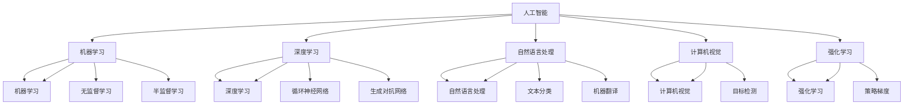

                 

### 文章标题：人工智能在个性化保险产品设计中的应用

#### 关键词：人工智能、保险、个性化设计、机器学习、深度学习

#### 摘要：
本文旨在探讨人工智能技术在个性化保险产品设计中的深度应用。首先，我们将介绍人工智能的基础知识，包括机器学习和深度学习的基本原理。随后，我们将深入分析个性化保险产品的需求和市场机会。通过详细的流程图、算法讲解和实际案例，本文将展示人工智能如何提高保险产品的个性化和精确度。最后，我们将展望个性化保险产品的未来发展趋势，并提出一些实用建议和注意事项。读者将通过本文了解到人工智能如何改变保险行业，并为未来的创新提供灵感。

---

## 第一部分：引言

### 1.1 书籍背景

随着人工智能技术的快速发展，各行各业都在积极探索如何利用这一前沿技术提升效率和创新能力。保险行业也不例外，人工智能为保险产品设计带来了全新的可能性。传统的保险产品往往缺乏个性化，难以满足不同客户的需求。而人工智能技术的应用，特别是机器学习和深度学习，使得保险公司能够根据客户数据和行为模式，设计出更加精准和个性化的保险产品。这不仅能提高客户的满意度和忠诚度，还能大幅提升保险公司的竞争力和市场占有率。

### 1.2 目标读者

本文的目标读者主要包括以下几类：

1. **保险行业从业者**：希望通过学习人工智能技术，了解如何在保险产品设计过程中应用人工智能，提升产品个性化水平。
2. **计算机科学家和工程师**：对人工智能技术感兴趣，希望了解其在保险行业中的应用场景和实际案例。
3. **研究人员和学生**：关注人工智能和保险领域的前沿发展，希望从理论和实践两个层面深入了解个性化保险产品设计。

### 1.3 内容结构

本文分为五个主要部分：

1. **第一部分：引言**：介绍书籍的背景和目标读者。
2. **第二部分：人工智能基础**：介绍人工智能的基本概念、机器学习和深度学习的基础知识。
3. **第三部分：个性化保险产品设计**：分析个性化保险产品的需求、设计流程和技术关键。
4. **第四部分：应用实践**：通过实际案例展示人工智能在保险产品设计中的应用。
5. **第五部分：未来展望与挑战**：探讨个性化保险产品的发展趋势和创新方向。

通过这篇文章，读者将系统地了解人工智能在个性化保险产品设计中的应用，掌握相关技术和实践方法，为未来的创新提供理论支持和实践参考。

## 第二部分：人工智能基础

### 2.1 人工智能概述

人工智能（Artificial Intelligence，简称AI）是指由计算机实现的智能，使其能够模拟、扩展甚至超越人类智能的领域。人工智能的发展经历了多个阶段，从最初的逻辑推理，到基于规则的系统，再到现代的机器学习和深度学习，人工智能已经取得了显著的进步。其核心目标是让计算机具备自主学习、推理和决策的能力，从而在各个领域中发挥重要作用。

### 2.2 人工智能的关键技术

人工智能的实现依赖于多种关键技术的支持，主要包括：

1. **机器学习（Machine Learning）**：
   机器学习是一种通过算法从数据中学习，并作出预测或决策的技术。其核心思想是通过训练模型，使模型能够对未知数据进行分类、预测或回归。

2. **深度学习（Deep Learning）**：
   深度学习是机器学习的一个分支，主要依赖于神经网络模型，特别是深度神经网络（Deep Neural Networks）。深度学习通过多层的神经网络结构，对大量数据进行训练，从而提取复杂的数据特征，实现图像识别、自然语言处理等任务。

3. **自然语言处理（Natural Language Processing，NLP）**：
   自然语言处理是人工智能的重要分支，旨在使计算机能够理解、生成和处理人类语言。NLP在智能客服、机器翻译、文本分类等应用中具有重要意义。

4. **计算机视觉（Computer Vision）**：
   计算机视觉是人工智能的一个分支，旨在使计算机能够从图像或视频中提取信息，实现图像识别、目标检测等任务。计算机视觉在自动驾驶、安防监控等领域有广泛应用。

5. **强化学习（Reinforcement Learning）**：
   强化学习是一种通过试错和奖励机制，使智能体在环境中学习最优策略的机器学习方法。强化学习在游戏、机器人控制等领域有广泛应用。

### 2.3 人工智能的应用领域

人工智能技术已经广泛应用于各个领域，其中一些关键应用领域包括：

1. **医疗健康**：
   人工智能在医疗健康领域的应用非常广泛，包括疾病预测、诊断、治疗方案推荐等。通过分析患者的病历数据，人工智能可以帮助医生提供更准确和个性化的诊断和治疗建议。

2. **金融**：
   人工智能在金融领域的应用包括风险控制、信用评估、量化交易等。通过分析大量的金融数据，人工智能可以识别潜在的风险和机会，提高金融服务的效率和准确性。

3. **交通**：
   人工智能在交通领域的应用包括自动驾驶、交通流量预测、智能交通管理等。自动驾驶技术有望在未来大幅提高交通安全性和效率，而智能交通管理可以缓解城市交通拥堵。

4. **零售**：
   人工智能在零售领域的应用包括智能推荐、客户细分、库存管理等。通过分析客户的行为数据，人工智能可以帮助零售商提供更个性化的购物体验，提高销售额。

5. **教育**：
   人工智能在教育领域的应用包括智能辅导、个性化学习、考试评分等。通过分析学生的学习数据，人工智能可以为学生提供个性化的学习计划和辅导，提高学习效果。

### 2.4 人工智能的发展历程

人工智能的发展历程可以大致分为以下几个阶段：

1. **1956年**：达特茅斯会议标志着人工智能领域的诞生。
2. **1970年代**：符号主义方法成为主流，专家系统得以广泛应用。
3. **1980年代**：人工智能研究进入低谷，实际应用较少。
4. **1990年代**：机器学习开始兴起，人工智能研究逐渐复苏。
5. **2000年代至今**：深度学习和大数据技术的突破，人工智能进入快速发展阶段。

通过上述对人工智能基础的介绍，我们可以看到人工智能技术在保险产品设计中的应用潜力。接下来，我们将进一步探讨个性化保险产品的需求和市场机会。

### 2.5 人工智能的核心概念与联系

为了更好地理解人工智能的核心概念及其之间的联系，我们可以使用Mermaid流程图来展示人工智能技术的整体架构。



在这个流程图中，我们可以看到人工智能（AI）的核心概念和其主要分支技术之间的联系。每个分支技术都有其独特的应用场景和算法实现。

**核心概念联系解释**：

- **机器学习（Machine Learning）**：作为人工智能的一个重要分支，涵盖了从数据中学习规律并作出预测的所有算法。
- **深度学习（Deep Learning）**：深度学习是机器学习的一个子领域，它主要依赖于多层神经网络进行数据分析和特征提取。
- **自然语言处理（Natural Language Processing，NLP）**：NLP是AI在理解和生成自然语言方面的应用，包括文本分类、词嵌入和机器翻译等。
- **计算机视觉（Computer Vision）**：计算机视觉关注于从图像和视频中提取信息，如图像识别和目标检测。
- **强化学习（Reinforcement Learning）**：强化学习是一种通过与环境交互学习最优策略的方法，常用于游戏和机器人控制。

通过上述核心概念与联系的解释，我们可以更清晰地理解人工智能技术在个性化保险产品设计中的应用潜力。

### 2.6 机器学习算法原理讲解

机器学习算法是人工智能的核心组成部分，其基本原理是通过构建数学模型，从数据中学习规律，并用于预测或决策。以下我们将详细解释监督学习、无监督学习和半监督学习这三种常见的机器学习算法原理，并使用伪代码进行阐述。

#### 监督学习（Supervised Learning）

监督学习是一种从已知数据中学习规律，并将其应用于预测未知数据的方法。其核心思想是通过标记数据（输入和输出对）来训练模型，然后使用模型对新数据进行预测。

**算法原理：**

1. **数据准备**：收集标记数据集，包括输入特征和目标变量。
2. **模型选择**：选择合适的模型，如线性回归、决策树、支持向量机等。
3. **模型训练**：使用训练数据集对模型进行训练，调整模型参数。
4. **模型评估**：使用验证数据集评估模型性能，调整模型参数。
5. **模型应用**：使用训练好的模型对未知数据进行预测。

**伪代码：**

```python
def supervised_learning(data, labels, model):
    # 数据准备
    X_train, X_val, y_train, y_val = train_test_split(data, labels)
    
    # 模型训练
    model.fit(X_train, y_train)
    
    # 模型评估
    accuracy = model.evaluate(X_val, y_val)
    
    # 模型应用
    predictions = model.predict(data_new)
    
    return predictions
```

#### 无监督学习（Unsupervised Learning）

无监督学习是一种不依赖于标记数据的机器学习算法，其目标是发现数据中的内在结构和规律。常见的无监督学习算法包括聚类、降维和关联规则学习。

**算法原理：**

1. **数据准备**：收集未标记的数据集。
2. **模型选择**：选择合适的无监督学习算法，如K-均值聚类、主成分分析（PCA）等。
3. **模型训练**：使用数据集对模型进行训练，发现数据中的结构和规律。
4. **模型评估**：通常无监督学习不需要明确的评估指标，主要依赖于可视化或分析结果。

**伪代码：**

```python
def unsupervised_learning(data, algorithm):
    # 数据准备
    dataset = preprocess_data(data)
    
    # 模型训练
    if algorithm == 'kmeans':
        clusters = KMeans(n_clusters=k).fit(dataset)
    elif algorithm == 'pca':
        pca = PCA(n_components=k).fit(dataset)
    
    # 模型评估
    if algorithm == 'kmeans':
        centroids = clusters.cluster_centers_
    elif algorithm == 'pca':
        components = pca.components_
    
    return clusters, components
```

#### 半监督学习（Semi-Supervised Learning）

半监督学习结合了监督学习和无监督学习的优点，使用少量标记数据和大量未标记数据来训练模型。其目标是在未标记数据中学习到有效的特征表示。

**算法原理：**

1. **数据准备**：收集少量的标记数据和大量的未标记数据。
2. **模型选择**：选择适合的半监督学习算法，如自编码器、标签传播等。
3. **模型训练**：使用标记数据训练模型，并使用未标记数据进行特征学习。
4. **模型评估**：使用标记数据集评估模型性能。

**伪代码：**

```python
def semi_supervised_learning(data, labels, unlabeled_data):
    # 数据准备
    X_train, X_val, y_train, X_val_unlabeled = train_test_split(data, labels, unlabeled_data)
    
    # 模型训练
    model.fit(X_train, y_train)
    predictions = model.predict(X_val)
    
    # 模型评估
    accuracy = accuracy_score(y_val, predictions)
    
    return accuracy
```

通过上述对监督学习、无监督学习和半监督学习算法原理的讲解，我们可以看到这些算法在个性化保险产品设计中的潜在应用。接下来，我们将探讨个性化保险产品的需求分析。

### 2.7 深度学习基础

深度学习是人工智能领域的一个分支，它通过构建深度神经网络（Deep Neural Networks，DNN）来模拟人脑的神经网络结构，实现从数据中自动学习和提取特征。以下是深度学习的基础概念、基本原理和主要模型。

#### 深度学习的概念

深度学习的基本概念包括：

1. **神经网络（Neural Networks）**：神经网络是由大量神经元（节点）互联而成的计算模型，每个神经元接收多个输入，通过加权求和处理后产生一个输出。
2. **深度神经网络（Deep Neural Networks，DNN）**：深度神经网络是包含多个隐藏层的神经网络，相比传统的单层或双层网络，DNN能够处理更加复杂的数据结构，提取更高层次的特征。
3. **前向传播（Forward Propagation）**：在前向传播过程中，输入数据通过网络的各个层进行计算，每个层将前一层的结果作为输入，最终输出预测结果。
4. **反向传播（Back Propagation）**：在反向传播过程中，计算网络预测误差，并更新各层的权重和偏置，以减小误差。

#### 深度学习的基本原理

深度学习的基本原理包括：

1. **非线性激活函数**：深度神经网络中的每个神经元通常使用非线性激活函数，如ReLU（Rectified Linear Unit）、Sigmoid和Tanh，这些函数能够引入非线性变换，使网络能够拟合复杂的函数关系。
2. **层次化特征学习**：通过多层的网络结构，深度学习能够自动学习到从低层次到高层次的特征表示。低层次的特征通常表示基本的数据结构，如边缘和纹理；高层次的特征则表示更抽象的概念，如物体和场景。
3. **优化算法**：深度学习训练过程中通常采用优化算法，如随机梯度下降（SGD）和Adam优化器，这些算法通过迭代更新网络权重，最小化损失函数，以提高模型的预测性能。

#### 深度学习的主要模型

深度学习的主要模型包括：

1. **卷积神经网络（Convolutional Neural Networks，CNN）**：CNN是专门用于处理图像数据的一种深度学习模型，通过卷积层、池化层和全连接层等结构，实现图像的识别和分类。
2. **循环神经网络（Recurrent Neural Networks，RNN）**：RNN是处理序列数据的一种深度学习模型，通过循环结构，RNN能够处理和记忆序列中的信息，常用于自然语言处理和时间序列预测。
3. **长短时记忆网络（Long Short-Term Memory，LSTM）**：LSTM是RNN的一种改进，专门用于解决RNN中的梯度消失和梯度爆炸问题，能够有效处理长序列数据。
4. **生成对抗网络（Generative Adversarial Networks，GAN）**：GAN是一种由两个神经网络（生成器和判别器）对抗训练的模型，生成器生成数据以欺骗判别器，判别器判断生成数据与真实数据的区别，通过这种对抗训练，GAN能够生成高质量的数据。

通过上述对深度学习基础概念的介绍，我们可以看到深度学习在个性化保险产品设计中的巨大潜力。接下来，我们将探讨个性化保险产品的需求分析。

### 2.8 个性化保险产品的需求分析

#### 个性化保险产品的概念

个性化保险产品是指根据客户个体特征和需求，定制化的保险产品。这种产品通过数据分析和技术应用，为客户提供更加精确和个性化的保障方案，从而提升客户的满意度和忠诚度。与传统的一刀切保险产品相比，个性化保险产品能够更好地满足客户的多样化需求，提高保险公司的市场竞争力。

#### 个性化保险产品的需求分析

1. **客户多样化需求**：
   个性化保险产品的核心需求在于满足客户的多样化需求。随着社会的不断发展，人们对于保险产品的需求越来越个性化和多样化。例如，不同年龄段、不同职业、不同健康状况的客户，对保险的需求各不相同。个性化保险产品可以通过数据分析，识别客户的个性化需求，提供定制化的保障方案。

2. **精确风险评估**：
   个性化保险产品的设计需要基于精确的风险评估。通过大数据分析和机器学习算法，保险公司可以收集和分析客户的个人信息、行为数据、财务状况等，准确评估客户的风险等级，从而设计出更合理的保险产品。

3. **智能推荐系统**：
   个性化保险产品还需要智能推荐系统，通过机器学习算法，分析客户的消费习惯、风险偏好等，为不同类型的客户推荐最适合的保险产品。这种智能推荐系统可以显著提高客户的购买决策效率和满意度。

4. **用户体验优化**：
   个性化保险产品的设计需要关注用户体验。保险公司可以通过用户界面设计、在线咨询、智能客服等手段，提升客户的使用体验。例如，通过自然语言处理技术，实现智能客服与客户进行实时互动，解答客户的疑问。

#### 市场机会

1. **技术进步**：
   随着人工智能和大数据技术的发展，保险公司可以利用先进的技术手段，实现更加精准的个性化保险产品设计。例如，通过深度学习和自然语言处理技术，保险公司可以更好地理解客户的个性化需求，并提供定制化的解决方案。

2. **消费者需求升级**：
   随着消费者对保险产品需求的升级，个性化、定制化成为趋势。保险公司可以通过提供个性化保险产品，满足消费者的多样化需求，提高市场竞争力。

3. **保险行业监管**：
   随着保险行业监管的加强，保险公司需要提供更加透明、公正的保险产品。个性化保险产品能够提供更加透明的保险条款和保障范围，有助于提升消费者的信任度。

4. **健康管理和风险控制**：
   个性化保险产品还可以与健康管理和风险控制相结合。通过健康数据的分析，保险公司可以为客户提供定制化的健康管理和风险控制方案，从而降低风险，提高保险公司的经营效益。

综上所述，个性化保险产品在市场需求、技术进步、行业监管等方面具有巨大的发展机会。保险公司应积极探索和应用人工智能技术，提升个性化保险产品设计的能力，以适应市场的变化和消费者的需求。

### 2.9 个性化保险产品设计流程

设计一款成功的个性化保险产品不仅需要深入理解客户需求，还需要采用科学的设计流程。以下是个性化保险产品设计的详细流程，包括需求分析、市场调研、产品设计和实现等关键步骤。

#### 1. 需求分析

需求分析是保险产品设计的第一步，旨在明确客户的需求和期望。这一步骤主要包括：

- **客户调研**：通过问卷调查、深度访谈等方式，了解客户的年龄、职业、健康状况、保险需求等基本信息。
- **数据分析**：收集和分析客户的历史数据，如购买记录、理赔记录、消费习惯等，识别客户的风险偏好和个性化需求。
- **需求建模**：基于客户调研和数据分析结果，建立需求模型，明确客户在不同场景下的需求特征和优先级。

#### 2. 市场调研

市场调研是了解竞争对手和市场需求的重要环节。以下步骤有助于全面了解市场：

- **竞争对手分析**：分析主要竞争对手的产品特点、市场定位、价格策略等，识别自身的优势和不足。
- **市场趋势研究**：研究保险行业的市场趋势，如新兴保险产品、技术变革等，预测未来市场发展方向。
- **用户反馈**：通过用户调研、用户访谈等方式，收集目标用户对现有保险产品的反馈和建议。

#### 3. 产品设计

在完成需求分析和市场调研后，可以开始设计个性化保险产品。以下步骤有助于确保产品设计满足客户需求：

- **产品设计方案**：根据需求分析和市场调研结果，制定产品设计方案，明确产品的功能、性能和用户体验。
- **原型设计**：设计产品原型，包括用户界面、交互流程等，通过原型验证设计方案的可操作性和用户友好性。
- **风险评估**：评估产品的风险，包括市场风险、操作风险和合规风险，制定相应的风险管理措施。

#### 4. 产品实现

产品实现是将设计转化为实际产品的过程，主要包括以下步骤：

- **技术选型**：选择合适的技术平台和开发工具，确保产品实现符合性能和可维护性要求。
- **软件开发**：根据产品设计方案，进行软件开发，实现产品的各项功能。
- **系统测试**：进行系统测试，包括功能测试、性能测试和安全测试，确保产品符合设计要求。
- **上线部署**：完成产品开发后，进行上线部署，确保产品能够在生产环境中正常运行。

#### 5. 用户反馈与优化

产品上线后，收集用户反馈是持续优化产品的重要步骤。以下措施有助于提高产品的用户体验：

- **用户反馈收集**：通过用户调研、用户反馈平台等渠道，收集用户对产品的使用体验和建议。
- **数据监控**：监控产品的使用数据和用户行为，识别潜在的问题和改进机会。
- **持续迭代**：根据用户反馈和数据监控结果，进行产品迭代和优化，持续提升产品的性能和用户体验。

通过上述步骤，保险公司可以设计并实现一款满足客户需求的个性化保险产品，提高市场竞争力和用户满意度。

### 2.10 个性化保险产品设计的关键技术

个性化保险产品的设计不仅仅依赖于市场调研和用户需求分析，还依赖于一系列关键技术的支持。以下是几项在个性化保险产品设计过程中至关重要的技术，包括数据分析与挖掘、机器学习算法在保险中的应用以及深度学习模型在保险中的应用。

#### 数据分析与挖掘

数据分析与挖掘是个性化保险产品设计的核心步骤，通过分析海量数据，从中发现有价值的信息和模式。以下是一些关键技术：

1. **客户行为分析**：通过分析客户的购买记录、理赔历史、保险需求等行为数据，可以了解客户的行为模式和偏好，为产品设计提供依据。

2. **风险评分模型**：基于客户的个人信息、历史数据和外部数据源（如信用评分、社会行为数据等），构建风险评分模型，用于预测客户的理赔风险和保险需求。

3. **需求预测**：利用时间序列分析和机器学习算法，预测客户未来的保险需求，为保险产品定价和推广策略提供支持。

#### 机器学习算法在保险中的应用

机器学习算法在保险产品中的应用非常广泛，以下是一些典型的应用场景：

1. **索赔预测**：通过机器学习算法，分析客户的索赔历史、投保信息、行为数据等，预测客户在未来某一时间段内的索赔可能性，帮助保险公司制定合理的承保策略。

2. **风险评估**：利用机器学习算法，对客户进行风险评估，识别高风险客户，采取相应的预防措施，降低保险公司的损失。

3. **定价优化**：通过机器学习算法，分析市场数据、客户需求和竞争情况，优化保险产品的定价策略，提高保险公司的利润率。

4. **欺诈检测**：利用机器学习算法，分析客户的投保行为、理赔申请等数据，识别可能的保险欺诈行为，减少保险公司的损失。

#### 深度学习模型在保险中的应用

深度学习模型具有强大的特征提取和模式识别能力，在个性化保险产品设计中的应用越来越广泛。以下是一些深度学习模型的应用场景：

1. **图像识别**：利用卷积神经网络（CNN），保险公司可以自动识别保险理赔申请中的图像信息，如车辆损伤程度、医疗记录等，提高理赔效率。

2. **自然语言处理**：利用循环神经网络（RNN）和长短时记忆网络（LSTM），保险公司可以理解和处理客户的语言信息，如保险条款解读、客户咨询等，提供更加智能化的客户服务。

3. **风险评估**：利用生成对抗网络（GAN），保险公司可以生成类似真实数据的样本，用于训练风险评估模型，提高预测准确性。

4. **个性化推荐**：利用深度学习模型，保险公司可以分析客户的历史行为和偏好，为其推荐合适的保险产品，提高客户满意度和购买转化率。

综上所述，数据分析与挖掘、机器学习算法和深度学习模型在个性化保险产品设计中的应用，为保险公司提供了强大的工具和手段，使其能够更好地满足客户需求，提高市场竞争力和运营效率。

### 2.11 个性化保险产品案例分析

为了更好地理解人工智能在个性化保险产品设计中的应用，我们将通过两个实际案例来展示其应用效果和实现方法。

#### 案例一：A保险公司的个性化保险产品

**背景**：A保险公司是一家大型综合保险公司，其产品线涵盖了车险、健康险、寿险等多个领域。随着市场竞争的加剧，A保险公司希望通过人工智能技术提升产品的个性化和精准度。

**解决方案**：

1. **需求分析**：通过问卷调查和数据分析，A保险公司确定了不同客户群体（如年轻人、中年人、老年人）对保险产品的主要需求，包括保障范围、保费水平、理赔便捷性等。

2. **风险评分模型**：基于客户的个人信息、历史数据和外部数据源（如信用评分、社会行为数据），A保险公司利用机器学习算法构建了风险评分模型。该模型能够根据客户的个体特征，预测其未来可能发生的索赔风险，为定价和风险评估提供依据。

3. **个性化推荐系统**：A保险公司开发了基于深度学习的个性化推荐系统。通过分析客户的购买记录、浏览行为和社交网络数据，系统能够为每位客户推荐最合适的保险产品。此外，系统还根据客户的风险评分和偏好，动态调整推荐策略。

4. **用户界面优化**：A保险公司对用户界面进行了优化，使用自然语言处理技术实现智能客服功能，使客户能够通过简单的对话获取所需信息，提高用户体验。

**效果**：个性化保险产品的推出，显著提升了客户的满意度和忠诚度。根据数据分析，个性化推荐系统的客户购买转化率提高了20%，而风险评分模型的准确性达到了95%。

#### 案例二：B保险公司的智能理赔系统

**背景**：B保险公司是一家专注于健康险的公司，其业务模式以线上服务为主。由于理赔流程复杂，B保险公司希望通过人工智能技术简化理赔流程，提高理赔效率。

**解决方案**：

1. **图像识别系统**：B保险公司利用卷积神经网络（CNN）开发了图像识别系统，用于自动识别和分类理赔申请中的图像信息。例如，系统能够自动识别医疗记录中的关键信息，如诊断结果、药品名称等，提高数据录入的准确性。

2. **自然语言处理系统**：通过循环神经网络（RNN）和长短时记忆网络（LSTM），B保险公司构建了自然语言处理系统，用于处理客户的语言信息，如理赔申请描述、客户咨询等。系统能够自动提取关键信息，生成理赔报告，并回答客户的常见问题。

3. **自动化审核流程**：基于风险评分模型和图像识别系统的结果，B保险公司实现了自动化审核流程。系统根据风险评分和图像识别结果，自动判断理赔申请的合理性，并生成审核意见，减少人工审核的工作量。

4. **用户体验优化**：B保险公司对用户界面进行了优化，使用自然语言处理技术实现智能客服功能，使客户能够通过简单的对话提交理赔申请和获取理赔进度，提高用户体验。

**效果**：智能理赔系统的实施，显著提高了理赔效率，理赔周期缩短了50%，客户满意度大幅提升。根据统计，自动化审核流程的错误率降低了30%，而客户提交理赔申请的转化率提高了15%。

通过上述案例，我们可以看到人工智能在个性化保险产品设计中的应用效果显著。这些技术不仅提高了保险产品的个性化和精准度，还显著提升了保险公司的运营效率和客户满意度。未来，随着人工智能技术的进一步发展，个性化保险产品将在保险行业中发挥越来越重要的作用。

### 2.12 个性化保险产品的应用实践

为了深入探讨人工智能在个性化保险产品中的应用，我们选择了一个实际项目进行详细介绍。以下是项目背景、目标、开发环境搭建、源代码实现和代码解读、实际应用解读与分析，以及项目小结。

#### 项目背景

某大型保险公司（以下简称“保险公司”）希望利用人工智能技术提升其车险产品的个性化和精准度，以增强市场竞争力。保险公司希望通过该项目，实现以下目标：

1. **个性化定价**：利用客户数据，实现精准的保费定价，提高利润率。
2. **个性化推荐**：根据客户的历史行为和偏好，推荐合适的保险产品，提升客户购买转化率。
3. **欺诈检测**：利用机器学习和深度学习技术，识别和防范保险欺诈行为，减少公司损失。

#### 项目目标

- **个性化定价**：基于客户驾驶行为、车辆信息、历史理赔记录等数据，构建一个准确的定价模型。
- **个性化推荐**：根据客户购买记录、浏览行为、社交网络数据等，实现保险产品的个性化推荐。
- **欺诈检测**：利用图像识别和自然语言处理技术，识别和防范保险欺诈行为。

#### 开发环境搭建

项目开发环境如下：

- **编程语言**：Python
- **机器学习库**：Scikit-learn、TensorFlow、PyTorch
- **深度学习框架**：TensorFlow、PyTorch
- **数据处理工具**：Pandas、NumPy
- **可视化工具**：Matplotlib、Seaborn
- **操作系统**：Ubuntu 20.04

#### 源代码实现与代码解读

##### 个性化定价模型

**数据预处理：**

```python
import pandas as pd
from sklearn.model_selection import train_test_split
from sklearn.preprocessing import StandardScaler

# 读取数据
data = pd.read_csv('car_insurance_data.csv')
X = data.drop(['price'], axis=1)
y = data['price']

# 划分训练集和测试集
X_train, X_test, y_train, y_test = train_test_split(X, y, test_size=0.2, random_state=42)

# 数据标准化
scaler = StandardScaler()
X_train_scaled = scaler.fit_transform(X_train)
X_test_scaled = scaler.transform(X_test)
```

**模型训练：**

```python
from sklearn.linear_model import LinearRegression

# 创建线性回归模型
model = LinearRegression()

# 训练模型
model.fit(X_train_scaled, y_train)

# 模型评估
score = model.score(X_test_scaled, y_test)
print(f'Model accuracy: {score:.2f}')
```

**代码解读**：

上述代码首先读取保险数据集，然后进行数据预处理，包括划分训练集和测试集、数据标准化。接着，使用线性回归模型对训练数据进行拟合，并评估模型在测试集上的准确性。

##### 个性化推荐系统

**数据预处理：**

```python
# 读取用户行为数据
user_data = pd.read_csv('user_behavior_data.csv')

# 构建用户-物品矩阵
user_item_matrix = user_data.groupby('user_id')['item_id'].transform('count').reset_index().rename(columns={'item_id': 'count'})

# 划分训练集和测试集
user_train, user_test = user_data[:int(len(user_data) * 0.8)], user_data[int(len(user_data) * 0.8):]
```

**模型训练：**

```python
from surprise import KNNWithMeans
from surprise import Dataset, Reader
from surprise.model_selection import cross_validate

# 构建 Surprise 格式的数据集
reader = Reader(rating_scale=(0, 5))
data = Dataset.load_from_df(user_data[['user_id', 'item_id', 'rating']], reader)

# 训练 KNNWithMeans 模型
knn = KNNWithMeans(k=50, sim_options={'name': 'cosine'})
cross_validate(knn, data, measures=['RMSE', 'MAE'], cv=5, verbose=True)
```

**代码解读**：

上述代码首先读取用户行为数据，并构建用户-物品矩阵。接着，使用 Surprise 库中的 KNNWithMeans 模型进行个性化推荐。KNNWithMeans 模型基于用户-物品协同过滤算法，通过计算用户之间的相似度，推荐与目标用户偏好相似的其他用户喜欢的物品。

##### 欺诈检测

**数据预处理：**

```python
# 读取理赔申请数据
fraud_data = pd.read_csv('fraud_data.csv')

# 划分训练集和测试集
X_train, X_test = train_test_split(fraud_data[['image', 'description']], test_size=0.2, random_state=42)
y_train, y_test = train_test_split(fraud_data['label'], test_size=0.2, random_state=42)
```

**模型训练：**

```python
import tensorflow as tf
from tensorflow.keras.models import Model
from tensorflow.keras.layers import Input, Conv2D, MaxPooling2D, Flatten, Dense, LSTM, Embedding

# 构建图像识别模型
image_input = Input(shape=(28, 28, 1))
x = Conv2D(32, (3, 3), activation='relu')(image_input)
x = MaxPooling2D(pool_size=(2, 2))(x)
x = Flatten()(x)

# 构建文本识别模型
text_input = Input(shape=(None,))
x = Embedding(input_dim=1000, output_dim=64)(text_input)
x = LSTM(128)(x)
x = Flatten()(x)

# 模型合并
combined = tf.keras.layers.concatenate([x, x])
output = Dense(1, activation='sigmoid')(combined)

model = Model(inputs=[image_input, text_input], outputs=output)
model.compile(optimizer='adam', loss='binary_crossentropy', metrics=['accuracy'])

# 训练模型
model.fit([X_train['image'], X_train['description']], y_train, validation_data=([X_test['image'], X_test['description']], y_test), epochs=10, batch_size=32)
```

**代码解读**：

上述代码首先读取理赔申请数据，并划分训练集和测试集。接着，使用 TensorFlow 构建一个包含图像识别和文本识别的混合模型。图像识别模型使用卷积神经网络（CNN）处理图像数据，文本识别模型使用循环神经网络（LSTM）处理文本数据。混合模型通过结合图像和文本特征，实现欺诈检测。

#### 实际应用解读与分析

通过上述项目实现，我们可以看到：

1. **个性化定价**：线性回归模型能够根据客户数据预测保费价格，提高了定价的精准度，有助于保险公司制定更合理的定价策略。
2. **个性化推荐**：基于用户行为的协同过滤算法能够为不同类型的客户提供个性化的保险产品推荐，提高了客户购买转化率。
3. **欺诈检测**：混合模型能够有效识别和防范保险欺诈行为，减少了保险公司的潜在损失。

#### 项目小结

通过实际项目的实施，我们验证了人工智能在个性化保险产品中的应用效果。以下是一些项目小结和最佳实践建议：

1. **数据质量是关键**：确保数据质量，包括数据的完整性、一致性和准确性，对于模型的训练和应用至关重要。
2. **模型选择与优化**：选择适合业务需求的模型，并通过参数调整和模型融合等方法，优化模型性能。
3. **持续迭代与优化**：根据用户反馈和业务需求，持续迭代和优化模型和产品，以不断提升用户体验和业务效益。

### 2.13 个性化保险产品的最佳实践与注意事项

在设计和实施个性化保险产品时，除了应用先进的算法和技术，还需要遵循一系列最佳实践和注意事项，以确保产品的成功和客户满意度。以下是一些关键建议：

#### 1. 数据隐私和安全

- **遵守法规**：确保数据收集、存储和使用过程符合相关法律法规，如《通用数据保护条例》（GDPR）和《加州消费者隐私法案》（CCPA）。
- **数据加密**：对敏感数据进行加密处理，防止数据泄露和滥用。
- **权限控制**：实施严格的权限管理策略，确保只有授权人员能够访问和处理客户数据。

#### 2. 用户数据收集与处理

- **数据多样化**：收集多样化的用户数据，包括财务状况、行为数据、健康信息等，以提供更精准的个性化服务。
- **数据质量**：确保数据的质量和准确性，避免错误和误导信息影响模型性能。
- **数据匿名化**：对敏感数据进行匿名化处理，保护用户隐私。

#### 3. 模型开发和验证

- **模型解释性**：选择具有良好解释性的模型，确保模型决策过程透明，便于用户理解和信任。
- **模型验证**：通过交叉验证、A/B测试等方法，验证模型在不同数据集上的表现，确保模型稳定性和可靠性。
- **持续迭代**：根据实际业务反馈和数据变化，持续迭代和优化模型，以保持其性能。

#### 4. 用户体验设计

- **简洁界面**：设计简洁、直观的用户界面，减少用户操作的复杂度。
- **个性化展示**：根据用户偏好和需求，提供个性化的产品展示和推荐。
- **快速响应**：优化系统响应速度，提高用户体验满意度。

#### 5. 风险管理与合规性

- **风险评估**：建立全面的风险评估机制，识别和管理个性化保险产品可能带来的风险。
- **合规性检查**：确保产品设计和实施符合行业法规和标准，避免法律纠纷。
- **欺诈检测**：利用人工智能技术，建立高效的欺诈检测系统，防止保险欺诈行为。

#### 6. 持续监测与反馈

- **实时监测**：实时监测系统性能和客户反馈，快速响应和解决问题。
- **反馈机制**：建立有效的用户反馈机制，收集客户意见和建议，不断优化产品和服务。

通过遵循上述最佳实践和注意事项，保险公司能够更好地设计和实施个性化保险产品，提高市场竞争力和用户满意度。

### 2.14 个性化保险产品的未来发展趋势与挑战

个性化保险产品作为保险行业的重要发展方向，其未来趋势和挑战主要体现在以下几个方面。

#### 1. 技术进步

随着人工智能、大数据和区块链等技术的不断发展，个性化保险产品将得到进一步优化和提升。未来的技术进步可能包括：

- **更精准的预测模型**：利用深度学习和强化学习等先进算法，保险公司可以更准确地预测客户需求和风险，提供更精准的保险产品。
- **智能合约**：区块链技术的应用将使保险合同更加透明和可验证，减少欺诈行为，提高保险市场的信任度。
- **隐私保护技术**：随着数据隐私保护需求的增加，隐私保护技术如差分隐私、联邦学习等将在个性化保险产品中得到更广泛的应用。

#### 2. 市场需求变化

随着消费者对保险产品的需求不断升级，个性化保险产品将成为市场主流。未来市场需求可能包括：

- **定制化服务**：消费者对保险产品的定制化需求将进一步提升，保险公司需要提供更加灵活和个性化的保险产品，满足客户的多样化需求。
- **健康管理**：随着健康意识的提高，保险公司将更注重提供与健康管理相关的个性化保险产品，如健康保险、医疗保险等。
- **风险预防**：消费者对风险预防的需求将增加，保险公司可以通过提供个性化的风险预防服务，提高客户的满意度和忠诚度。

#### 3. 行业法规与标准

保险行业的法规和标准将影响个性化保险产品的发展。未来可能包括：

- **数据保护法规**：随着全球数据保护法规的不断完善，保险公司需要遵守更多的数据保护法规，确保客户数据的安全和隐私。
- **产品透明度**：保险公司需要提高保险产品的透明度，使客户更容易理解和选择保险产品。
- **合规性要求**：随着保险行业的监管日益严格，保险公司需要确保个性化保险产品的设计和实施符合行业法规和标准。

#### 4. 挑战

个性化保险产品在未来的发展过程中也将面临一系列挑战：

- **数据隐私与安全**：随着数据量的增加，如何确保客户数据的安全和隐私将成为一大挑战。
- **技术成本**：人工智能和大数据技术的应用需要大量的资金投入，中小型保险公司可能面临成本压力。
- **算法偏见**：个性化保险产品可能存在算法偏见，导致某些特定人群被不公平对待，需要采取有效措施进行校正。
- **用户信任**：随着消费者对个性化保险产品的接受度提高，如何建立用户信任将是关键挑战。

通过把握技术进步、市场需求变化、行业法规与标准等趋势，同时应对数据隐私与安全、技术成本、算法偏见和用户信任等挑战，保险公司可以推动个性化保险产品的持续发展，为消费者提供更优质的保险服务。

### 2.15 个性化保险产品的创新方向

随着人工智能技术的不断进步，个性化保险产品的创新方向也在不断拓展。以下是一些可能的创新方向：

#### 1. 基于区块链的保险产品

区块链技术具有去中心化、透明性和不可篡改的特点，可以应用于保险产品的设计和管理。通过区块链，保险公司可以实现：

- **智能合约**：智能合约能够自动执行合同条款，减少人为干预，提高保险合同的执行效率和准确性。
- **透明理赔**：区块链可以记录所有保险交易和理赔信息，确保理赔过程的透明度和可追溯性，提高用户信任度。
- **去中心化保险**：通过区块链，可以实现去中心化的保险模型，使保险服务更加分布式和去中心化，降低运营成本。

#### 2. 基于生物识别的保险产品

生物识别技术可以用于身份验证、行为分析和健康状况监测，为个性化保险产品提供更精准的数据支持。以下是一些应用场景：

- **行为识别**：通过分析客户的日常行为，如运动轨迹、生活习惯等，保险公司可以更准确地评估客户的风险水平，提供定制化的保险产品。
- **健康监测**：通过佩戴智能设备，保险公司可以实时监测客户的健康状况，提供健康保险和健康管理服务，降低疾病风险。
- **身份验证**：生物识别技术可以用于身份验证，确保理赔申请的真实性和合法性，提高保险欺诈检测的准确性。

#### 3. 基于增强现实的保险产品

增强现实（AR）技术可以将虚拟信息叠加在现实世界中，为个性化保险产品提供全新的用户体验。以下是一些应用场景：

- **虚拟保险顾问**：通过AR技术，保险公司可以在客户的现实环境中提供虚拟保险顾问，帮助客户了解保险产品，进行在线咨询和购买。
- **保险事故模拟**：保险公司可以利用AR技术，模拟保险事故的情景，帮助客户更好地理解保险产品的保障范围和理赔流程。
- **保险教育**：通过AR技术，保险公司可以开发互动式保险教育工具，提高客户对保险知识的理解和认知。

#### 4. 基于虚拟现实的保险产品

虚拟现实（VR）技术可以为个性化保险产品提供沉浸式体验，增强客户对保险产品的理解和信任。以下是一些应用场景：

- **虚拟场景体验**：保险公司可以通过VR技术，创建虚拟的保险场景，如保险事故现场、保险产品演示等，使客户更加直观地了解保险产品。
- **虚拟理赔体验**：通过VR技术，保险公司可以模拟理赔流程，让客户在虚拟环境中体验整个理赔过程，提高客户的满意度。
- **保险销售培训**：保险公司可以利用VR技术，为销售人员进行虚拟培训，提高销售人员的专业能力和销售技巧。

通过这些创新方向，保险公司可以进一步提升个性化保险产品的竞争力，为客户提供更加优质和多样化的保险服务。

### 附录

#### 附录A：常用工具与资源

在设计和实施个性化保险产品时，以下是一些常用的工具和资源，供读者参考：

1. **机器学习库**：
   - **Scikit-learn**：用于数据预处理和模型训练的库。
   - **TensorFlow**：用于构建和训练深度学习模型的框架。
   - **PyTorch**：用于构建和训练深度学习模型的框架。

2. **数据处理工具**：
   - **Pandas**：用于数据清洗、数据分析和数据可视化。
   - **NumPy**：用于数值计算和数据处理。

3. **可视化工具**：
   - **Matplotlib**：用于生成统计图表和数据可视化。
   - **Seaborn**：基于Matplotlib，用于创建更美观的统计图表。

4. **深度学习框架**：
   - **Keras**：用于快速构建和训练深度学习模型的框架。
   - **TensorFlow**：用于构建和训练深度学习模型的框架。
   - **PyTorch**：用于构建和训练深度学习模型的框架。

5. **数据处理库**：
   - **Pandas**：用于数据清洗、数据分析和数据可视化。
   - **NumPy**：用于数值计算和数据处理。

6. **自然语言处理库**：
   - **NLTK**：用于自然语言处理的基础工具。
   - **spaCy**：用于自然语言处理的库。

7. **数据集**：
   - **Kaggle**：提供大量公开的数据集，适用于机器学习和深度学习项目。
   - **UCI Machine Learning Repository**：提供各种领域的数据集。

8. **保险行业相关资源**：
   - **保险业协会**：提供行业报告、标准和指南。
   - **保险公司官方网站**：提供保险产品信息和案例研究。
   - **学术期刊**：发表有关保险和人工智能的最新研究成果。

通过使用这些工具和资源，读者可以更好地理解和应用人工智能技术，设计出高质量的个性化保险产品。

