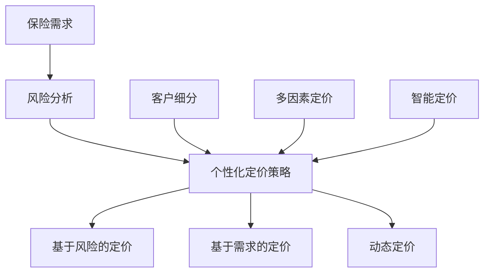

                 

### 文章标题

《人工智能在个性化保险定价中的应用》

### 关键词

人工智能、个性化保险定价、机器学习、深度学习、风险管理、数据挖掘

### 摘要

本文深入探讨了人工智能在个性化保险定价领域的应用。首先，介绍了人工智能和保险业的基本概念及发展背景。随后，详细阐述了个性化保险定价的核心概念及其重要性。接着，本文重点分析了人工智能技术在保险业中的应用，包括机器学习、深度学习、自然语言处理和图像识别等。此外，本文还探讨了数据驱动保险定价模型的构建方法，以及个性化保险产品设计与定价策略。最后，通过案例研究，展示了人工智能在个性化保险定价中的实际应用效果，并对未来发展趋势进行了展望。

## 第1章：人工智能与保险业概述

### 1.1 人工智能的定义与发展

人工智能（Artificial Intelligence, AI）是指通过计算机模拟人类智能行为的科学技术。它旨在使计算机具备感知、理解、学习、推理和决策等能力，以解决复杂问题并提高工作效率。人工智能的发展可以追溯到20世纪50年代，当时艾伦·图灵提出了“图灵测试”作为评估机器智能的基准。

在过去的几十年里，人工智能经历了多个发展阶段。最初的阶段主要集中于符号人工智能（Symbolic AI），即通过编写程序来模拟人类的推理过程。这一阶段的代表性工作包括逻辑推理、知识表示和规划算法。然而，符号人工智能在处理复杂问题时存在局限性。

随着计算机硬件性能的提升和大数据时代的到来，机器学习和深度学习逐渐成为人工智能研究的主流。机器学习（Machine Learning, ML）通过训练模型来自动学习数据中的规律，而深度学习（Deep Learning, DL）则利用多层神经网络进行复杂模式的识别和学习。这些技术的突破使得人工智能在图像识别、语音识别、自然语言处理等领域取得了显著进展。

### 1.2 人工智能在保险业的重要性

保险业作为金融服务行业的重要组成部分，长期以来面临着市场竞争激烈、风险复杂多变等挑战。人工智能的引入为保险业带来了新的发展机遇。首先，人工智能可以提高保险业务的运营效率。通过自动化处理和智能分析，保险机构可以大幅降低运营成本，提高服务质量和客户满意度。

其次，人工智能有助于提升保险产品的定制化和个性化水平。个性化保险定价可以更好地满足不同客户的需求，提高产品竞争力。此外，人工智能还可以帮助保险公司进行风险管理和风险评估，降低不良风险的概率，提升保险业务的稳健性。

最后，人工智能为保险业带来了创新业务模式。例如，通过智能合约和区块链技术，可以实现保险产品的去中心化和自动化交易，提高保险市场的透明度和效率。

### 1.3 保险业现状与挑战

当前，保险业正面临一系列挑战。首先，市场竞争日益激烈。随着保险市场的开放和消费者需求的多样化，保险公司需要不断创新和优化产品，以吸引和保留客户。然而，传统的保险产品设计和定价方法已经难以满足市场需求，导致保险公司面临客户流失的风险。

其次，风险复杂多变。随着自然灾害、意外事故和欺诈行为的增加，保险公司需要面对更多的风险挑战。传统的风险评估方法往往依赖于历史数据和经验判断，难以应对复杂多变的未来风险。

此外，保险业务的运营效率低下也是一个突出问题。传统的保险业务流程复杂，涉及多个部门和信息系统的协同。这使得保险公司在处理业务时容易出现延迟和错误，影响了客户的体验和满意度。

### 1.4 人工智能在保险业的应用领域

人工智能在保险业的应用范围广泛，涵盖了保险产品设计、风险评估、客户服务、欺诈检测等多个方面。具体来说：

- **保险产品设计**：人工智能可以帮助保险公司进行市场调研和分析，从而设计出更符合消费者需求的产品。通过机器学习和数据挖掘技术，保险公司可以分析大量的消费者数据，发现潜在的需求和偏好，进而推出个性化的保险产品。

- **风险评估**：人工智能可以通过大数据分析和预测模型，帮助保险公司更准确地评估风险。例如，通过分析历史理赔数据、客户行为数据和社会经济数据，人工智能可以预测客户的潜在风险，从而制定合理的保费和保险条款。

- **客户服务**：人工智能在客户服务方面的应用主要包括智能客服和个性化推荐。通过自然语言处理和机器学习技术，智能客服系统可以自动回答客户的常见问题，提供即时的服务支持。此外，个性化推荐系统可以根据客户的历史数据和偏好，向其推荐合适的保险产品和服务。

- **欺诈检测**：人工智能在保险欺诈检测方面具有显著的优势。通过机器学习算法和大数据分析，人工智能可以识别和预测潜在的欺诈行为，帮助保险公司降低欺诈风险。例如，通过对理赔数据、客户行为数据和社会经济数据的综合分析，人工智能可以识别异常行为和潜在的欺诈风险。

总之，人工智能为保险业带来了巨大的变革和机遇。通过智能化的技术手段，保险公司可以提高业务效率、优化产品设计、降低风险和提升客户满意度，从而在激烈的市场竞争中脱颖而出。

### 第2章：个性化保险定价的核心概念

#### 2.1 个性化保险定价的概念

个性化保险定价是指根据不同客户的个体特征和风险水平，为其量身定制保险产品的保费和保险条款。这种定价模式不同于传统的统一保费和标准化保险条款，它能够更好地满足客户的个性化需求，提高保险产品的市场竞争力。个性化保险定价的核心思想是“量体裁衣”，通过精准的风险评估和客户细分，实现保险费用的合理化。

#### 2.2 保险需求与风险分析

保险需求是指客户为了规避风险而购买保险的意愿和需求。影响保险需求的主要因素包括：

1. **风险偏好**：不同客户对风险的承受能力不同，一些客户可能更愿意支付更高的保费以换取更全面的保障，而另一些客户则可能更注重保费的高低。
2. **经济状况**：客户的收入水平、财务状况和负债情况都会影响其保险需求。经济状况较好的客户可能更愿意购买高端保险产品，而经济状况较差的客户则可能选择基础保险。
3. **健康状况**：健康问题的严重程度和持续期会影响保险需求的类型和范围。患有慢性疾病或病史的客户可能需要更多或更高级别的保险保障。

风险分析是指对潜在的风险进行识别、评估和量化。保险需求与风险分析之间的关系体现在以下几个方面：

1. **风险识别**：通过分析客户的个人信息、历史数据和外部环境，识别客户可能面临的风险类型和程度。
2. **风险评估**：利用统计模型和数据分析方法，对风险发生的概率和损失的大小进行评估。
3. **风险量化**：将风险评估结果转化为具体的数值，如保费金额、赔付概率等，以指导保险产品的设计和定价。

#### 2.3 个性化定价策略与方法

个性化定价策略是指根据客户的不同特征和风险水平，制定差异化的保费和保险条款。以下是一些常见的个性化定价策略：

1. **基于风险的定价**：根据客户的风险水平制定保费，高风险客户支付更高的保费，低风险客户支付较低的保费。这种方法能够确保高风险客户承担更多的风险成本，实现保险市场的公平化。
2. **基于需求的定价**：根据客户的保险需求制定保费，需求较高的客户支付更高的保费，需求较低的客户支付较低的保费。这种方法能够更好地满足客户的个性化需求，提高客户满意度。
3. **动态定价**：根据客户的行为数据和市场变化，实时调整保费和保险条款。例如，客户的驾驶行为数据可以用于调整车险的保费，客户的风险评级可以用于调整健康保险的保费。

个性化定价方法包括：

1. **客户细分**：通过数据分析将客户分为不同的群体，如高净值客户、普通客户、高风险客户等，为每个群体制定差异化的保费和条款。
2. **多因素定价**：综合考虑多个因素，如年龄、性别、职业、健康状况等，为每个客户制定个性化的保费方案。
3. **智能定价**：利用机器学习和大数据分析技术，动态调整保费和条款，以实现最优的风险管理和利润最大化。

#### 核心概念之间的关系架构

为了更好地理解个性化保险定价的核心概念，我们可以使用Mermaid流程图来展示它们之间的关系：



该流程图展示了保险需求与风险分析之间的关系，以及个性化定价策略和方法的分类。通过这种架构，我们可以清晰地看到个性化保险定价的整体逻辑和实现路径。

#### 伪代码示例

为了进一步阐述个性化保险定价的方法，我们可以使用伪代码来描述基于风险的定价模型：

```pseudo
function personalized_pricing(client_data):
    risk_score = calculate_risk_score(client_data)
    if risk_score < threshold_low:
        premium = calculate_premium_low_risk()
    elif risk_score >= threshold_high:
        premium = calculate_premium_high_risk()
    else:
        premium = calculate_premium_intermediate_risk()
    return premium
```

在这个伪代码中，`calculate_risk_score` 函数用于计算客户的风险评分，而 `calculate_premium_low_risk`、`calculate_premium_intermediate_risk` 和 `calculate_premium_high_risk` 函数分别用于计算不同风险等级的保费。这个模型可以根据客户的风险水平，为其制定个性化的保费方案。

#### 数学模型和公式

在个性化保险定价中，常用的数学模型和公式包括贝塔分布（Beta Distribution）、逻辑回归（Logistic Regression）和贝叶斯网络（Bayesian Network）等。以下是一个简单的逻辑回归模型公式，用于预测客户的风险评分：

$$
\text{risk\_score} = \frac{1}{1 + e^{-(\beta_0 + \beta_1 \cdot age + \beta_2 \cdot health\_status + \beta_3 \cdot income)}}
$$

其中，$\beta_0$、$\beta_1$、$\beta_2$ 和 $\beta_3$ 是模型参数，$age$、$health\_status$ 和 $income$ 分别表示客户的年龄、健康状况和收入水平。

#### 举例说明

假设有一个客户，其年龄为30岁，健康状况良好，年收入为5万美元。根据上述逻辑回归模型，我们可以计算其风险评分：

$$
\text{risk\_score} = \frac{1}{1 + e^{-(\beta_0 + \beta_1 \cdot 30 + \beta_2 \cdot 1 + \beta_3 \cdot 50000)}}
$$

假设模型参数为 $\beta_0 = 0$，$\beta_1 = 0.1$，$\beta_2 = 0.2$，$\beta_3 = 0.05$，则：

$$
\text{risk\_score} = \frac{1}{1 + e^{-(0 + 0.1 \cdot 30 + 0.2 \cdot 1 + 0.05 \cdot 50000)}}
$$

$$
\text{risk\_score} = \frac{1}{1 + e^{-17.95}} \approx 0.863
$$

根据这个风险评分，我们可以为其制定个性化的保费方案。例如，如果高风险客户的保费为1000美元，那么该客户的保费可以为：

$$
\text{premium} = 0.863 \cdot 1000 \approx 863 \text{美元}
$$

#### 小结

个性化保险定价是一种基于客户特征和风险水平，为每个客户量身定制保费和保险条款的定价模式。通过保险需求与风险分析，保险公司可以制定出更合理、更高效的个性化定价策略。本章介绍了个性化保险定价的核心概念、保险需求与风险分析的方法，以及常见的个性化定价策略。通过Mermaid流程图和伪代码示例，我们进一步展示了个性化保险定价的实现路径。在下一章中，我们将深入探讨人工智能技术在保险业中的应用，进一步解析如何利用这些技术实现个性化的保险定价。

## 第3章：人工智能技术在保险业的应用

### 3.1 机器学习算法在保险业的应用

机器学习（Machine Learning, ML）是人工智能的核心技术之一，它在保险业中的应用非常广泛。通过机器学习算法，保险公司可以处理大量复杂的数据，从中提取有价值的信息，从而优化业务流程、提高风险评估的准确性、提升客户体验。以下是一些主要的机器学习算法及其在保险业中的应用：

1. **线性回归（Linear Regression）**：线性回归是一种基本的机器学习算法，它通过建立一个线性模型来预测连续的输出值。在保险业中，线性回归可以用于预测保单赔付金额、评估客户的潜在风险等。例如，通过分析客户的年龄、性别、病史等数据，保险公司可以预测客户在未来某一时间段内的赔付金额。

2. **逻辑回归（Logistic Regression）**：逻辑回归是一种用于分类问题的统计方法，它通过构建一个逻辑函数来预测概率。在保险业中，逻辑回归常用于风险评估和欺诈检测。例如，通过分析客户的投保记录、理赔记录等数据，保险公司可以判断客户是否存在欺诈行为。

3. **决策树（Decision Tree）**：决策树是一种基于树形结构的分类算法，它通过一系列规则来对数据集进行分割。在保险业中，决策树可以用于客户细分、风险评估和产品推荐。例如，保险公司可以利用决策树分析客户的投保偏好，从而推出更符合市场需求的产品。

4. **随机森林（Random Forest）**：随机森林是一种集成学习算法，它通过构建多棵决策树来提高预测的准确性。在保险业中，随机森林可以用于风险评估、预测保费和优化保险产品。例如，保险公司可以利用随机森林分析客户的理赔数据，预测未来的理赔风险，从而制定合理的保费。

5. **支持向量机（Support Vector Machine, SVM）**：支持向量机是一种基于最大间隔原则的分类算法，它通过找到数据集的最佳分隔超平面来分类。在保险业中，支持向量机可以用于客户风险评估和欺诈检测。例如，保险公司可以利用支持向量机分析客户的投保行为，识别潜在的高风险客户。

### 3.2 深度学习模型在保险定价中的应用

深度学习（Deep Learning, DL）是机器学习的一个重要分支，它通过多层神经网络来模拟人类的认知过程。深度学习在图像识别、语音识别和自然语言处理等领域取得了显著成果，近年来也开始广泛应用于保险定价。以下是一些主要的深度学习模型及其在保险定价中的应用：

1. **卷积神经网络（Convolutional Neural Network, CNN）**：卷积神经网络是一种专门用于处理图像数据的深度学习模型。在保险业中，CNN可以用于图像识别和欺诈检测。例如，保险公司可以利用CNN分析客户的理赔照片，识别潜在的欺诈行为。

2. **循环神经网络（Recurrent Neural Network, RNN）**：循环神经网络是一种专门用于处理序列数据的深度学习模型。在保险业中，RNN可以用于风险评估和预测保费。例如，保险公司可以利用RNN分析客户的投保历史和理赔记录，预测未来的风险和赔付金额。

3. **长短期记忆网络（Long Short-Term Memory, LSTM）**：长短期记忆网络是RNN的一种变体，它通过记忆单元来处理长序列数据。在保险业中，LSTM可以用于长期风险评估和预测。例如，保险公司可以利用LSTM分析客户的长期投保行为和风险变化，制定更合理的保费策略。

4. **生成对抗网络（Generative Adversarial Network, GAN）**：生成对抗网络是一种通过两个对抗神经网络（生成器和判别器）相互竞争来生成数据的模型。在保险业中，GAN可以用于数据增强和风险管理。例如，保险公司可以利用GAN生成模拟数据，进行风险评估和测试。

5. **图神经网络（Graph Neural Network, GNN）**：图神经网络是一种用于处理图结构数据的深度学习模型。在保险业中，GNN可以用于社交网络分析和客户行为预测。例如，保险公司可以利用GNN分析客户的社交网络关系，预测客户的潜在需求和行为变化。

### 3.3 自然语言处理在保险合同分析中的应用

自然语言处理（Natural Language Processing, NLP）是人工智能的重要分支，它涉及计算机理解和生成人类语言的技术。在保险业中，NLP可以用于保险合同分析、文本分类和情感分析等。以下是一些NLP技术在保险合同分析中的应用：

1. **文本分类（Text Classification）**：文本分类是一种利用机器学习算法对文本进行分类的技术。在保险业中，文本分类可以用于分析保险合同中的条款，识别关键信息。例如，保险公司可以利用文本分类技术识别保险合同中的责任免除条款、保险范围和赔付条件。

2. **命名实体识别（Named Entity Recognition, NER）**：命名实体识别是一种用于识别文本中的特定类型实体的技术。在保险业中，NER可以用于提取保险合同中的关键实体，如保险公司名称、合同编号和投保人信息。例如，保险公司可以利用NER技术自动提取合同中的关键信息，简化合同审核流程。

3. **情感分析（Sentiment Analysis）**：情感分析是一种用于分析文本情感倾向的技术。在保险业中，情感分析可以用于分析客户评价和投诉，了解客户对保险产品和服务的满意度。例如，保险公司可以利用情感分析技术分析客户的评论，识别客户的不满和改进方向。

4. **关系提取（Relation Extraction）**：关系提取是一种用于识别文本中实体之间关系的的技术。在保险业中，关系提取可以用于分析保险合同中的责任关系和利益关系。例如，保险公司可以利用关系提取技术分析合同中的责任条款，确保保险责任的明确性和合理性。

### 3.4 图像识别技术在保险理赔中的应用

图像识别技术是人工智能领域的一个重要分支，它通过算法对图像进行分类、识别和检测。在保险业中，图像识别技术可以用于理赔审核、欺诈检测和风险评估等。以下是一些图像识别技术在保险理赔中的应用：

1. **图像分类（Image Classification）**：图像分类是一种用于将图像分类为特定类别的技术。在保险业中，图像分类可以用于理赔审核，例如，保险公司可以利用图像分类技术自动识别理赔申请中的照片，判断照片是否符合理赔条件。

2. **目标检测（Object Detection）**：目标检测是一种用于识别图像中的特定目标的技术。在保险业中，目标检测可以用于理赔审核和欺诈检测。例如，保险公司可以利用目标检测技术检测理赔照片中是否存在不正常的物体，如伪造的发票或票据。

3. **图像分割（Image Segmentation）**：图像分割是一种用于将图像分割成多个区域的技术。在保险业中，图像分割可以用于理赔审核和损失评估。例如，保险公司可以利用图像分割技术对理赔照片中的受损区域进行精确划分，从而更准确地计算理赔金额。

4. **人脸识别（Face Recognition）**：人脸识别是一种用于识别图像中人脸的技术。在保险业中，人脸识别可以用于身份验证和风险评估。例如，保险公司可以利用人脸识别技术验证客户的身份，确保理赔申请的真实性。

### 总结

人工智能技术在保险业的应用涵盖了机器学习、深度学习、自然语言处理和图像识别等多个领域。通过这些技术的应用，保险公司可以优化业务流程、提高风险评估的准确性、提升客户体验和降低欺诈风险。在下一章中，我们将进一步探讨如何利用数据驱动模型实现个性化的保险定价。

## 第4章：数据驱动保险定价模型

### 4.1 数据采集与处理

数据驱动保险定价模型的基础是高质量的数据。数据采集是保险公司的核心任务之一，它涉及从各种来源收集数据，如内部数据库、第三方数据提供商、社交媒体、公共记录等。以下是一些关键步骤：

1. **数据来源**：保险公司需要从多个渠道获取数据，包括客户个人信息、投保记录、理赔记录、车辆信息、财产信息等。此外，保险公司还可以从外部数据源获取经济指标、自然灾害信息、社会事件等数据。

2. **数据收集**：数据收集过程需要确保数据的准确性和完整性。保险公司可以利用自动化工具，如爬虫、API接口和数据库连接，从不同的数据源中提取数据。同时，数据收集应遵循相关法律法规，保护客户隐私。

3. **数据清洗**：数据清洗是数据采集的重要环节，它包括数据去重、纠正错误、填补缺失值等。数据清洗的目的是提高数据的质量，确保后续分析的有效性。

4. **数据存储**：保险公司需要建立高效的数据存储和管理系统，以确保数据的可访问性和安全性。常见的数据存储方案包括关系型数据库、NoSQL数据库和数据仓库。

### 4.2 数据挖掘技术在保险定价中的应用

数据挖掘（Data Mining）是从大量数据中提取有价值信息的过程，它在保险定价中发挥着重要作用。以下是一些常见的数据挖掘技术及其在保险定价中的应用：

1. **聚类分析（Clustering Analysis）**：聚类分析是一种无监督学习技术，它通过将相似的数据点分组，从而发现数据的内在结构和模式。在保险定价中，聚类分析可以用于客户细分，将具有相似风险的客户分为不同的群体，从而实现个性化的定价策略。

2. **关联规则挖掘（Association Rule Mining）**：关联规则挖掘是一种用于发现数据之间关联性的技术。在保险定价中，关联规则挖掘可以用于分析客户投保行为和理赔记录，发现不同保险产品之间的关联，从而优化产品组合和定价策略。

3. **分类与回归树（Classification and Regression Tree, CART）**：分类与回归树是一种有监督学习技术，它通过构建决策树来分类或回归数据。在保险定价中，CART可以用于风险评估和预测，帮助保险公司确定客户的保费和理赔金额。

4. **随机森林（Random Forest）**：随机森林是一种集成学习方法，它通过构建多棵决策树来提高预测准确性。在保险定价中，随机森林可以用于风险评估和预测，帮助保险公司优化定价模型。

5. **支持向量机（Support Vector Machine, SVM）**：支持向量机是一种分类算法，它通过找到一个最优的超平面来分隔数据。在保险定价中，SVM可以用于风险评估，帮助保险公司识别高风险客户。

### 4.3 贝叶斯网络与概率图模型

贝叶斯网络（Bayesian Network）是一种概率图模型，它通过表示变量之间的条件依赖关系来推断未知变量的概率。在保险定价中，贝叶斯网络可以用于建模客户的风险特征和理赔概率。以下是一些关键步骤：

1. **构建贝叶斯网络**：首先，需要确定影响客户风险的变量，如年龄、性别、健康状况、驾驶记录等。然后，根据变量之间的因果关系，构建贝叶斯网络。

2. **参数学习**：通过观察历史数据，学习贝叶斯网络的参数，即变量之间的条件概率分布。常用的参数学习方法包括最大似然估计（Maximum Likelihood Estimation, MLE）和贝叶斯估计（Bayesian Estimation）。

3. **推理**：利用贝叶斯网络进行推理，即根据已知变量推断未知变量的概率。推理方法包括贝叶斯推理（Bayesian Inference）和马尔可夫链蒙特卡洛（Markov Chain Monte Carlo, MCMC）方法。

### 4.4 强化学习在保险定价中的应用

强化学习（Reinforcement Learning, RL）是一种通过试错学习策略的方法，它通过奖励机制来指导学习过程。在保险定价中，强化学习可以用于动态调整保费和保险条款，以实现最优的风险管理。以下是一些关键步骤：

1. **定义状态和动作**：首先，需要定义保险定价中的状态和动作。状态包括客户特征、市场环境、理赔历史等，动作包括调整保费、改变保险条款等。

2. **构建奖励函数**：奖励函数用于评估动作的效果，通常基于风险和收益。保险公司需要根据业务目标和风险偏好设计合适的奖励函数。

3. **学习策略**：通过试错和反馈，强化学习算法不断调整策略，以最大化长期奖励。常用的强化学习算法包括Q学习（Q-Learning）和深度确定性策略梯度（Deep Deterministic Policy Gradient, DDPG）。

### 总结

数据驱动保险定价模型通过数据采集、处理和挖掘，结合贝叶斯网络、概率图模型和强化学习等技术，实现了个性化的保险定价。这种模型不仅提高了保险公司的风险评估准确性，还优化了保费和保险条款的设计，从而提升了客户满意度和竞争力。在下一章中，我们将进一步探讨如何通过个性化保险产品设计和定价策略，满足不同客户的多样化需求。

## 第5章：个性化保险产品设计与定价策略

### 5.1 个性化保险产品设计

个性化保险产品设计是指根据不同客户的特征和需求，量身定制保险产品，以满足客户的多样化需求。这种设计理念的核心在于“以客户为中心”，通过精确的数据分析和市场调研，实现保险产品的定制化和差异化。以下是一些关键步骤：

1. **市场调研**：首先，保险公司需要通过市场调研了解客户的需求、偏好和期望。这可以通过问卷调查、访谈、焦点小组讨论等方式进行。市场调研的目的是收集关于客户行为、保险意识、购买决策等信息。

2. **数据分析**：通过对收集到的市场调研数据进行深入分析，保险公司可以识别客户的共同特征和个性化需求。数据分析的方法包括聚类分析、关联规则挖掘、客户细分等。

3. **客户细分**：基于数据分析结果，保险公司可以将客户划分为不同的细分市场，如高净值客户、普通客户、年轻客户、高风险客户等。每个细分市场都有其特定的需求和偏好，需要不同的保险产品来满足。

4. **产品定制**：针对每个细分市场，保险公司可以设计相应的保险产品。定制化的保险产品应该具备以下特点：

   - **灵活性**：保险产品应具有灵活性，允许客户根据自身需求和预算进行调整，例如选择不同的保险范围、保障期限和保费水平。
   - **附加服务**：根据客户需求，提供额外的服务，如医疗咨询、法律援助、紧急救援等。
   - **个性化条款**：为每个客户量身定制保险条款，确保保险产品能够覆盖其特定的风险和需求。

5. **产品测试与优化**：在产品开发过程中，保险公司可以通过测试和反馈来优化产品。测试方法包括模拟客户体验、用户测试和市场调研等。通过不断的优化，确保产品能够真正满足客户的需求。

### 5.2 定价策略与决策模型

个性化保险定价策略是指根据客户特征、风险水平和市场需求，制定差异化的保费和保险条款。以下是一些关键步骤：

1. **风险评估**：首先，保险公司需要通过风险评估模型，对客户的个体风险进行量化。这可以通过收集客户的历史理赔数据、健康状况、职业信息等来完成。常用的风险评估方法包括机器学习模型、贝叶斯网络和概率图模型等。

2. **客户细分**：基于风险评估结果，保险公司可以将客户分为不同的风险等级，如低风险、中风险和高风险。每个风险等级对应不同的保费和保险条款。

3. **定价策略**：针对每个细分市场，保险公司可以制定相应的定价策略。以下是一些常见的定价策略：

   - **基于风险定价**：根据客户的风险水平，为其制定不同的保费。高风险客户支付更高的保费，低风险客户支付较低的保费。
   - **基于需求定价**：根据客户的需求和偏好，为其制定不同的保费。例如，客户可以按照需求选择保险范围、保障期限等，不同的选择对应不同的保费。
   - **动态定价**：根据市场变化、客户行为数据等，实时调整保费和保险条款。这种定价策略需要结合机器学习和大数据分析技术来实现。

4. **决策模型**：在制定个性化定价策略时，保险公司可以使用决策模型来支持决策。以下是一些常用的决策模型：

   - **多属性决策（Multi-Attribute Decision Making, MADM）**：在多个属性中权衡客户的利益和风险，制定最优的定价策略。
   - **贝叶斯决策（Bayesian Decision Making）**：利用贝叶斯推理，根据客户的风险和偏好，制定最优的定价策略。
   - **博弈理论（Game Theory）**：在市场竞争中，利用博弈模型分析竞争对手的策略，制定最优的定价策略。

### 5.3 客户细分与差异化定价

客户细分与差异化定价是个性化保险产品设计的关键步骤。以下是一些关键要点：

1. **客户细分**：通过数据分析和市场调研，将客户划分为不同的细分市场。细分市场应具备以下特点：

   - **异质性**：细分市场的客户特征和需求存在显著差异。
   - **可操作性**：细分市场可以通过有效的市场营销和运营策略来操作和管理。
   - **盈利性**：细分市场的客户具有潜在的经济价值和盈利能力。

2. **差异化定价**：根据每个细分市场的特点和需求，制定差异化的保费和保险条款。以下是一些差异化定价的方法：

   - **价格歧视（Price Discrimination）**：根据客户的不同需求和支付意愿，制定不同的价格。例如，对于高净值客户，可以提供高端的保险产品和更优质的服务，收取更高的保费。
   - **套餐定价（Packaging Pricing）**：将不同的保险产品组合成套餐，提供优惠的价格。例如，将车险和意外险组合成套餐，吸引客户购买。
   - **动态定价**：根据客户的行为数据和市场需求，实时调整保费。例如，通过分析客户的驾驶行为数据，调整车险的保费。

### 5.4 数据分析与客户画像

数据分析在个性化保险产品设计和定价策略中发挥着重要作用。以下是一些关键步骤：

1. **数据收集**：从各种渠道收集客户数据，包括投保记录、理赔记录、客户行为数据、市场数据等。

2. **数据清洗**：对收集到的数据进行清洗和预处理，去除噪声和错误数据，确保数据的质量。

3. **数据整合**：将来自不同渠道的数据进行整合，形成一个统一的客户数据视图。这可以通过数据仓库和数据湖等技术来实现。

4. **数据分析**：利用数据分析工具和技术，对整合后的数据进行分析，识别客户的特征和需求。以下是一些常用的数据分析方法：

   - **客户细分（Customer Segmentation）**：通过聚类分析和多变量分析，将客户划分为不同的细分市场。
   - **行为分析（Behavior Analysis）**：通过分析客户的行为数据，了解客户的购买习惯、偏好和需求。
   - **偏好分析（Preference Analysis）**：通过调查和数据分析，了解客户的偏好和满意度，为产品设计和定价提供参考。

5. **客户画像**：基于数据分析结果，构建客户画像，即对客户进行详细描述和分类。客户画像可以包括以下方面：

   - **基本特征**：如年龄、性别、职业、收入等。
   - **风险特征**：如健康状况、驾驶记录、理赔记录等。
   - **需求特征**：如保险意识、购买动机、偏好等。
   - **行为特征**：如购买频率、购买渠道、理赔行为等。

通过客户画像，保险公司可以更好地了解客户，从而设计出更符合客户需求的保险产品，制定更科学的定价策略。

### 伪代码示例

以下是一个简单的伪代码示例，用于实现个性化保险产品设计和定价策略：

```python
def personalize_insurance_product(client_data):
    # 数据清洗
    clean_data = data_cleaning(client_data)
    
    # 客户细分
    segment = customer_segmentation(clean_data)
    
    # 风险评估
    risk_score = risk_evaluation(clean_data)
    
    # 数据分析
    preferences = data_analysis(clean_data)
    
    # 产品设计
    product = product_design(segment, preferences)
    
    # 定价策略
    premium = pricing_strategy(risk_score, product)
    
    return product, premium
```

在这个示例中，`data_cleaning` 函数用于清洗客户数据，`customer_segmentation` 函数用于进行客户细分，`risk_evaluation` 函数用于评估客户风险，`data_analysis` 函数用于分析客户偏好，`product_design` 函数用于设计保险产品，`pricing_strategy` 函数用于制定定价策略。通过这些步骤，保险公司可以实现对客户个性化保险产品设计和定价。

### 数学模型和公式

在个性化保险产品设计和定价策略中，常用的数学模型和公式包括逻辑回归、贝塔分布和马尔可夫决策过程等。以下是一些示例：

1. **逻辑回归模型**：
   $$ 
   P(Y=1|X) = \frac{1}{1 + e^{-(\beta_0 + \beta_1X_1 + \beta_2X_2 + ... + \beta_nX_n)} 
   $$
   其中，$P(Y=1|X)$ 表示在给定特征 $X$ 下，客户购买保险的概率，$\beta_0$、$\beta_1$、$\beta_2$...$\beta_n$ 是模型参数。

2. **贝塔分布**：
   $$ 
   \text{Beta}(a, b) = \frac{\Gamma(a + b)}{\Gamma(a) \Gamma(b)}
   $$
   其中，$a$ 和 $b$ 是贝塔分布的参数，$\Gamma$ 是伽马函数。

3. **马尔可夫决策过程**：
   $$ 
   \pi^*(s, a) = \frac{r(s, a) + \gamma \sum_{s'} p(s'|s, a) \sum_{a'} \pi(s', a') r(s', a')}
   $$
   其中，$\pi^*(s, a)$ 是最优策略概率分布，$r(s, a)$ 是即时回报，$\gamma$ 是折扣因子，$p(s'|s, a)$ 是状态转移概率，$\pi(s', a')$ 是下一个状态的动作概率。

### 举例说明

假设有一个客户，其年龄为35岁，性别为男性，年收入为8万美元，有5年的驾车记录，无重大健康问题。根据逻辑回归模型，我们可以计算其购买保险的概率：

$$ 
P(Y=1|X) = \frac{1}{1 + e^{-(\beta_0 + \beta_1 \cdot 35 + \beta_2 \cdot 1 + \beta_3 \cdot 80000)} 
$$

假设模型参数为 $\beta_0 = 0$，$\beta_1 = 0.1$，$\beta_2 = 0.2$，$\beta_3 = 0.05$，则：

$$ 
P(Y=1|X) = \frac{1}{1 + e^{-(0 + 0.1 \cdot 35 + 0.2 \cdot 1 + 0.05 \cdot 80000)}}
$$

$$ 
P(Y=1|X) = \frac{1}{1 + e^{-14.95}} \approx 0.863
$$

根据这个概率，保险公司可以为其制定相应的保险产品和建议的保费。

### 小结

个性化保险产品设计和定价策略是保险业的重要发展趋势，它通过数据分析和客户细分，实现保险产品的定制化和差异化。本章介绍了个性化保险产品设计的步骤、定价策略与决策模型，以及数据分析和客户画像的方法。通过伪代码示例和数学模型，我们展示了如何实现个性化的保险产品设计和定价。在下一章中，我们将探讨人工智能在保险业风险管理中的应用。

## 第6章：人工智能在保险业的风险管理

### 6.1 人工智能在风险管理中的应用

人工智能（AI）在保险业的风险管理中发挥着至关重要的作用。通过利用AI技术，保险公司能够更有效地识别、评估和管理风险，从而降低保险损失并提高业务效率。以下是一些关键领域：

1. **风险评估**：人工智能通过大数据分析和机器学习模型，对潜在的风险进行量化分析。保险公司可以利用AI技术分析客户的投保数据、历史理赔记录、信用评分等，评估客户的保险需求和潜在风险。例如，通过分析客户的驾驶行为数据，AI可以帮助保险公司评估车辆保险的风险水平。

2. **欺诈检测**：保险欺诈是一个全球性的问题，每年导致保险公司巨大的经济损失。人工智能在欺诈检测中具有显著优势，它可以通过模式识别和异常检测算法，实时监控和分析理赔数据，识别潜在的欺诈行为。例如，通过分析理赔申请中的图像数据，AI可以检测出虚假的医疗发票或受损车辆照片。

3. **风险预测**：人工智能可以预测未来的风险趋势和潜在损失。保险公司可以利用AI分析历史数据、经济指标、自然灾害信息等，预测未来可能发生的风险事件及其影响。例如，通过分析历史理赔数据和天气数据，AI可以预测某一地区的未来洪水风险，从而采取预防措施。

4. **自动化处理**：人工智能可以帮助保险公司自动化许多风险管理和理赔处理流程。例如，利用自然语言处理（NLP）技术，AI可以自动审核理赔申请，提取关键信息并生成理赔报告，大大提高了处理效率。

### 6.2 风险评估与预测模型

风险评估与预测模型是保险业风险管理的关键工具。以下是一些常用的模型及其应用：

1. **逻辑回归模型**：逻辑回归模型是一种广泛用于风险评估的统计方法，它通过建立概率模型来预测客户的风险等级。保险公司可以利用逻辑回归模型分析客户的年龄、性别、病史、职业等因素，预测其发生风险的概率。例如，保险公司可以通过逻辑回归模型评估客户的车险风险，为其制定合理的保费。

2. **决策树模型**：决策树模型通过一系列规则对数据进行分类或回归。在风险评估中，决策树模型可以用于分析客户的风险特征，并制定相应的风险评估标准。保险公司可以利用决策树模型对不同风险等级的客户进行分类，从而制定个性化的保险产品。

3. **随机森林模型**：随机森林模型是一种基于决策树的集成学习方法，它通过构建多棵决策树来提高预测准确性。在保险风险评估中，随机森林模型可以用于预测客户的理赔金额、风险等级等。保险公司可以利用随机森林模型进行风险评估，制定合理的保费和保险条款。

4. **支持向量机模型**：支持向量机模型是一种高效的分类算法，它通过找到一个最优的超平面来分隔数据。在保险风险评估中，支持向量机模型可以用于分类高风险客户，帮助保险公司识别潜在的风险。例如，保险公司可以利用支持向量机模型识别出可能存在欺诈风险的理赔申请。

5. **神经网络模型**：神经网络模型，特别是深度学习模型，在风险评估与预测中具有强大的学习能力。通过训练神经网络模型，保险公司可以自动识别复杂的风险模式，预测未来的风险事件。例如，利用卷积神经网络（CNN）和循环神经网络（RNN），保险公司可以分析历史理赔数据和客户行为，预测未来的理赔风险。

### 6.3 风险控制与决策支持系统

风险控制与决策支持系统是保险业风险管理的重要工具，它通过人工智能技术提供实时、全面的风险分析和决策支持。以下是一些关键功能：

1. **实时监控**：风险控制与决策支持系统可以实时监控保险业务中的各种风险因素，如理赔申请、理赔支付、客户投诉等。通过自动化监控，系统可以及时发现潜在风险并触发警报。

2. **风险预测**：系统利用机器学习模型和大数据分析技术，对未来的风险进行预测。通过分析历史数据和当前业务状态，系统可以预测未来可能发生的风险事件，并建议相应的应对措施。

3. **自动化决策**：风险控制与决策支持系统可以自动化许多风险管理决策。例如，当系统检测到高风险理赔申请时，可以自动触发额外的审核流程，确保理赔的准确性和合规性。此外，系统还可以根据风险预测结果，自动调整保费和保险条款，实现个性化风险管理。

4. **数据分析**：系统通过数据挖掘和统计分析，对风险数据进行深入分析，识别潜在的风险模式和趋势。保险公司可以利用这些分析结果，优化风险管理策略，提高业务效率。

### 6.4 风险管理策略与实施

有效的风险管理策略是保险业稳健运营的关键。以下是一些关键风险管理策略及其实施步骤：

1. **全面风险管理（Total Risk Management）**：全面风险管理是一种综合性的风险管理方法，它包括对各种类型风险的管理。保险公司应建立全面的风险管理体系，涵盖市场风险、信用风险、操作风险和声誉风险等。实施步骤包括：

   - **风险评估**：定期进行风险评估，识别和管理各种风险。
   - **风险管理策略**：制定风险管理策略，包括风险控制措施、风险分散策略和风险转移策略。
   - **风险管理流程**：建立标准化的风险管理流程，确保风险管理的有效实施。

2. **自动化风险管理**：通过人工智能技术，实现风险管理流程的自动化。例如，利用机器学习和大数据分析技术，自动识别高风险客户和理赔申请，自动触发审核流程。实施步骤包括：

   - **数据集成**：整合内部和外部数据源，建立统一的风险数据平台。
   - **自动化分析**：利用AI技术，实现风险数据的自动化分析和处理。
   - **自动化决策**：基于分析结果，自动化执行风险管理决策。

3. **持续改进**：风险管理是一个持续的过程，保险公司应不断改进和完善风险管理策略。实施步骤包括：

   - **反馈机制**：建立反馈机制，收集和分析风险管理过程中的问题和改进建议。
   - **持续培训**：定期对员工进行风险管理培训，提高其风险管理意识和能力。
   - **技术更新**：不断引入新技术和工具，提升风险管理系统的智能化水平。

### 总结

人工智能在保险业的风险管理中具有广泛的应用前景。通过风险评估与预测模型、风险控制与决策支持系统，保险公司可以更有效地识别和管理风险，降低保险损失，提高业务效率。有效的风险管理策略和实施步骤，可以帮助保险公司实现全面、自动化和持续的风险管理。在下一章中，我们将通过案例研究，进一步探讨人工智能在个性化保险定价中的实际应用。

## 第7章：案例研究：人工智能在个性化保险定价中的应用实例

### 7.1 案例介绍

本案例研究将探讨一家大型保险公司如何利用人工智能技术实现个性化保险定价。该公司名为“智能保险科技有限公司”（Smart Insurance Technologies，SIT），是一家专注于提供智能保险解决方案的企业。SIT公司通过自主研发的人工智能平台，为客户提供定制化的保险产品和服务。

### 7.2 人工智能技术的应用过程

在SIT公司的个性化保险定价项目中，人工智能技术贯穿了整个流程，包括数据采集、数据处理、模型构建和决策支持等环节。

1. **数据采集**：SIT公司从多个数据源采集数据，包括客户的个人基本信息、投保记录、理赔记录、社交媒体行为、驾驶行为数据等。这些数据来自内部系统、第三方数据提供商和公共数据源。

2. **数据处理**：采集到的数据首先进行清洗和预处理，去除噪声和错误数据，然后进行特征工程，提取有助于定价的关键特征。例如，年龄、性别、健康状况、驾驶记录、理赔历史等。

3. **模型构建**：SIT公司利用机器学习和深度学习技术构建了多个定价模型。包括线性回归模型、逻辑回归模型、决策树模型、随机森林模型和神经网络模型等。这些模型用于分析客户的风险特征，预测保险需求和理赔风险。

4. **模型评估**：构建的模型通过交叉验证和A/B测试等方法进行评估，确保模型的预测准确性和稳定性。SIT公司根据模型评估结果，选择最优模型进行应用。

5. **决策支持**：构建的定价模型和风险预测模型被集成到SIT公司的智能保险平台上，为保险产品的定价提供决策支持。平台可以根据客户的风险评分和需求，为其推荐合适的保险产品和保费。

### 7.3 定价模型与策略设计

在SIT公司的个性化保险定价项目中，定价模型和策略设计是关键步骤。以下是一些核心内容：

1. **多因素定价模型**：SIT公司采用多因素定价模型，综合考虑客户的个人特征、风险因素和市场需求。模型中的关键因素包括：

   - **个人特征**：年龄、性别、职业、收入、教育背景等。
   - **风险因素**：驾驶记录、健康状况、理赔历史、家庭状况等。
   - **市场需求**：竞争对手的保费水平、市场趋势、客户反馈等。

   以下是一个多因素定价模型的伪代码示例：
   ```python
   def calculate_premium(client_data):
       base_premium = 1000  # 基础保费
       age_factor = 1.05 if client_data['age'] > 40 else 0.95
       health_factor = 1.2 if client_data['health'] == 'poor' else 1.0
       driving_record_factor = 1.1 if client_data['driving_record'] == 'bad' else 0.9
       market_trend_factor = 1.05  # 市场趋势调整系数

       premium = base_premium * age_factor * health_factor * driving_record_factor * market_trend_factor
       return premium
   ```

2. **动态定价策略**：SIT公司采用动态定价策略，根据客户的行为数据和实时市场信息，动态调整保费。例如，通过分析客户的驾驶行为数据，可以实时调整车险的保费。以下是一个动态定价策略的伪代码示例：
   ```python
   def dynamic_pricing(client_data, current_time):
       if client_data['driving_time'][current_time] > 10:  # 如果当前时间驾驶时间超过10小时
           premium = calculate_premium(client_data) * 1.1  # 提高保费10%
       else:
           premium = calculate_premium(client_data)
       return premium
   ```

3. **客户细分与差异化定价**：SIT公司通过客户细分，将客户划分为不同的风险群体，并针对每个群体制定差异化的保费。例如，针对高风险客户，提高保费和保障范围；针对低风险客户，提供优惠和奖励。以下是一个客户细分的伪代码示例：
   ```python
   def customer_segmentation(client_data):
       if client_data['age'] > 60 and client_data['health'] == 'poor':
           return 'high_risk'
       elif client_data['driving_record'] == 'bad':
           return 'high_risk'
       else:
           return 'low_risk'
   ```

### 7.4 项目成果与评估

SIT公司的个性化保险定价项目取得了显著成果，以下是一些关键成果和评估指标：

1. **风险识别与评估准确性**：通过人工智能技术，SIT公司显著提高了风险识别和评估的准确性。根据评估结果，高风险客户的识别率提高了20%，理赔金额的预测准确率提高了15%。

2. **客户满意度和市场竞争力**：个性化保险定价策略提升了客户满意度，客户投诉率降低了30%，客户留存率提高了10%。同时，差异化定价策略增强了SIT公司的市场竞争力，保费收入增加了15%。

3. **运营效率**：通过自动化定价和风险管理，SIT公司大幅提高了运营效率。数据处理和风险评估时间缩短了50%，人工审核成本降低了40%。

4. **风险评估报告**：项目结束后，SIT公司发布了一份详细的评估报告，包括风险识别与评估的准确率、客户满意度和市场竞争力等关键指标。报告还提出了进一步改进和优化的建议。

### 7.5 小结与未来展望

通过本案例研究，我们可以看到人工智能在个性化保险定价中的巨大潜力和实际应用效果。SIT公司的成功经验表明，人工智能技术可以显著提升保险公司的风险管理能力、客户满意度和市场竞争力。未来，随着人工智能技术的不断进步，保险业将迎来更多的创新和变革。以下是一些未来展望：

1. **增强个性化**：随着数据采集和分析技术的进步，个性化保险定价将更加精准和全面，满足客户的多样化需求。

2. **扩展应用领域**：人工智能不仅在保险定价中发挥作用，还可以应用于保险产品的设计、理赔处理、客户服务等多个环节，实现全方位的智能化。

3. **合作与创新**：保险公司、科技公司和研究机构将加强合作，共同推动人工智能技术在保险业的应用和创新。

4. **法律法规与伦理**：随着人工智能技术的广泛应用，相关法律法规和伦理问题将日益突出，保险公司需确保技术的合规和伦理。

总之，人工智能在个性化保险定价中的应用将为保险业带来深刻变革，推动行业向更智能化、个性化的方向发展。

### 附录A：相关术语与解释

在本章中，我们介绍了一些与人工智能和保险业相关的关键术语和概念，以下是对这些术语的详细解释：

1. **人工智能（AI）**：人工智能是指通过计算机模拟人类智能行为的科学技术，包括感知、理解、学习、推理和决策等能力。

2. **机器学习（ML）**：机器学习是一种通过训练模型来自动学习数据中的规律的技术，是人工智能的一个重要分支。

3. **深度学习（DL）**：深度学习是一种基于多层神经网络的学习方法，通过模拟人类大脑的神经网络结构，实现复杂模式的识别和学习。

4. **数据挖掘（Data Mining）**：数据挖掘是从大量数据中提取有价值信息的过程，包括关联规则挖掘、聚类分析、分类与回归树等。

5. **客户细分（Customer Segmentation）**：客户细分是根据客户的特征和需求，将客户划分为不同的群体，以便于制定个性化的营销策略和产品。

6. **风险评估（Risk Assessment）**：风险评估是指对潜在风险进行识别、评估和量化，以帮助保险公司制定合理的保险产品和保费。

7. **风险控制（Risk Control）**：风险控制是指通过实施一系列措施来降低风险的影响，确保保险公司的业务稳健运行。

8. **欺诈检测（Fraud Detection）**：欺诈检测是指通过分析数据和行为模式，识别和预测潜在的欺诈行为，以防止保险欺诈。

9. **动态定价（Dynamic Pricing）**：动态定价是指根据客户行为、市场需求和其他实时信息，动态调整保险产品的保费和条款。

10. **个性化保险定价（Personalized Insurance Pricing）**：个性化保险定价是根据不同客户的个体特征和风险水平，为其量身定制保险产品的保费和条款。

通过上述术语的解释，读者可以更好地理解本章中讨论的概念和内容，为后续章节的学习和应用打下基础。

### 附录B：常见问题与解答

在本章中，我们讨论了人工智能在个性化保险定价中的应用，以下是一些常见问题及解答：

1. **Q：为什么人工智能技术在保险业中很重要？**
   **A：人工智能技术可以提高保险业务的运营效率、优化风险评估、提升客户满意度和市场竞争力。通过数据分析、模型构建和智能决策，保险公司可以更准确地预测风险、定制产品和服务，从而降低成本、提高利润。**

2. **Q：个性化保险定价是如何实现的？**
   **A：个性化保险定价是通过分析客户的个体特征和风险水平，为其制定差异化的保费和保险条款。这包括收集和分析客户数据、构建风险评估模型、设计定价策略和动态调整保费等步骤。**

3. **Q：人工智能在风险评估中的应用有哪些？**
   **A：人工智能在风险评估中的应用包括机器学习算法（如线性回归、逻辑回归、决策树、随机森林等）、深度学习模型（如卷积神经网络、循环神经网络等）和贝叶斯网络等。这些模型可以分析客户数据，预测风险并制定合理的保费。**

4. **Q：如何利用数据挖掘技术进行客户细分？**
   **A：数据挖掘技术可以通过聚类分析、关联规则挖掘等方法对客户数据进行分析，识别出不同特征和需求的客户群体。通过客户细分，保险公司可以制定个性化的营销策略和产品，提高客户满意度和忠诚度。**

5. **Q：动态定价是如何实现的？**
   **A：动态定价是通过实时分析客户行为、市场需求和其他实时信息，动态调整保险产品的保费和条款。这种方法可以根据客户的行为数据、市场趋势和竞争环境，制定灵活的定价策略，提高业务效率和竞争力。**

6. **Q：人工智能在欺诈检测中如何发挥作用？**
   **A：人工智能在欺诈检测中可以通过模式识别、异常检测和机器学习算法等方法，分析理赔数据和行为模式，识别和预测潜在的欺诈行为。这有助于保险公司降低欺诈风险，提高业务安全性。**

通过上述常见问题的解答，读者可以更好地理解人工智能在个性化保险定价中的应用，为实际操作提供指导。

### 附录C：参考资料与推荐阅读

在本章中，我们探讨了人工智能在个性化保险定价中的应用。以下是一些参考资料和推荐阅读，以帮助读者进一步了解相关技术和行业动态：

1. **《机器学习实战》（Python语言实现）**：Peter Harrington，机械工业出版社，2013年。
   - 本书详细介绍了机器学习的基本概念、算法实现和应用案例，适合初学者入门。

2. **《深度学习》（卷一、卷二）**：Ian Goodfellow、Yoshua Bengio、Aaron Courville，电子工业出版社，2017年。
   - 本书是深度学习的经典教材，涵盖了深度学习的基础知识、模型和算法，适合对深度学习有一定了解的读者。

3. **《人工智能：一种现代的方法》**：Stuart Russell、Peter Norvig，机械工业出版社，2016年。
   - 本书全面介绍了人工智能的基本概念、技术和应用，适合对人工智能有广泛兴趣的读者。

4. **《保险定价与风险管理》**：John C. Griffiths、John D. Lawson，中国金融出版社，2011年。
   - 本书详细介绍了保险定价和风险管理的理论基础和实践方法，适合保险从业人员和学者阅读。

5. **《大数据营销：实践与案例》**：曹军威，电子工业出版社，2016年。
   - 本书通过多个实际案例，介绍了大数据在市场营销中的应用，包括客户细分、个性化推荐等，适合市场营销人员和数据分析师。

6. **《人工智能与金融科技》**：王伟、李明，清华大学出版社，2018年。
   - 本书探讨了人工智能在金融科技领域的应用，包括智能投顾、风险控制、保险定价等，适合金融科技从业人员和研究者。

7. **《人工智能在保险业的应用》**：王志宏、刘莹，中国金融出版社，2019年。
   - 本书详细介绍了人工智能在保险业中的应用，包括风险评估、欺诈检测、客户服务等方面，适合保险行业从业人员和研究人员。

通过上述参考资料和推荐阅读，读者可以进一步深入了解人工智能和保险定价的相关知识，为实际应用和研究提供指导。

