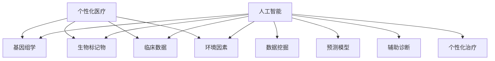

                 


### 引言

随着科技的飞速发展，人工智能（AI）已经逐渐渗透到各个行业，其中包括医疗领域。个性化医疗，作为一种以患者为中心的医疗模式，旨在通过整合患者个体的生物学特征、生活习惯和环境因素，为患者提供更为精准的医疗服务。这种模式不仅能够提高医疗效果，还能优化医疗资源的配置。而人工智能技术，尤其是机器学习和深度学习，为个性化医疗的实现提供了强大的工具。

本文旨在探讨人工智能在个性化医疗中的应用，通过详细的分析和实例，揭示其潜在价值和未来发展前景。文章将从以下几个方面进行阐述：

1. **个性化医疗的基础**：介绍个性化医疗的概念、发展历程和关键要素。
2. **人工智能基础**：回顾人工智能的基本概念和关键算法。
3. **核心算法与模型**：详细讲解支持向量机（SVM）、贝叶斯网络、神经网络等核心算法及其在个性化医疗中的应用。
4. **深度学习模型在个性化医疗中的应用**：探讨卷积神经网络（CNN）和循环神经网络（RNN）在医学图像处理和序列数据处理中的应用。
5. **强化学习在个性化医疗中的实践**：分析Q-学习算法和策略梯度算法在个性化医疗中的实际应用。
6. **个性化医疗项目实战**：介绍一个实际项目，包括开发环境搭建、源代码实现和代码解读。
7. **开发环境与工具**：介绍常用的开发环境和工具。
8. **案例研究与实战**：结合实际案例，详细分析项目过程和结果。

### 核心概念与联系

在深入探讨人工智能在个性化医疗中的应用之前，我们首先需要理解两个核心概念：个性化医疗和人工智能。

#### 个性化医疗

个性化医疗是一种以患者为中心的医疗模式，通过整合患者个体的生物学特征、生活习惯和环境因素，为患者提供更为精准的医疗服务。它包括以下几个方面：

1. **基因组学**：利用基因组学技术分析患者的基因信息，预测疾病的发病风险。
2. **生物标记物**：通过检测生物标记物，了解患者的生理状态和疾病进程。
3. **临床数据**：包括患者的病史、药物反应和生活习惯等。
4. **环境因素**：考虑患者所处的社会环境、生活习惯等。

#### 人工智能

人工智能（AI）是一种模拟人类智能的技术，包括机器学习、深度学习、自然语言处理等。在个性化医疗中，人工智能主要用于以下几个方面：

1. **数据挖掘**：从大量医疗数据中提取有价值的信息。
2. **预测模型**：基于历史数据，预测患者的疾病风险和治疗效果。
3. **辅助诊断**：通过医学图像分析，辅助医生进行疾病诊断。
4. **个性化治疗**：根据患者的特征，制定个性化的治疗方案。

#### 核心概念与联系

个性化医疗和人工智能之间的联系主要体现在以下几个方面：

1. **数据驱动**：个性化医疗依赖于大量的医疗数据，而人工智能技术可以高效地处理和分析这些数据。
2. **模型驱动**：人工智能技术可以帮助建立预测模型和诊断模型，提高个性化医疗的准确性和效率。
3. **患者参与**：个性化医疗强调患者的参与，而人工智能技术可以提供更加个性化的服务，提高患者的满意度和依从性。

为了更清晰地展示这两个概念之间的关系，我们可以使用Mermaid流程图来描述：



通过这个流程图，我们可以看到个性化医疗和人工智能之间的紧密联系，以及它们如何共同推动个性化医疗的发展。

### 核心算法原理讲解

在个性化医疗中，人工智能技术主要依赖于以下几个核心算法：支持向量机（SVM）、贝叶斯网络、神经网络。下面我们将使用伪代码来详细阐述这些算法的原理。

#### 支持向量机（SVM）

支持向量机是一种用于分类的机器学习算法，它通过找到一个超平面，使得不同类别的数据点被尽可能分开。下面是SVM的伪代码：

```plaintext
输入：数据集D = {(x1, y1), (x2, y2), ..., (xn, yn)}
输出：分类器f(x)

初始化：选择核函数K(x, x')，设置惩罚参数C

1. 训练阶段：
   - 对每个数据点(x_i, y_i)，计算其对偶问题：
     ∑α_i - 1/2 * ∑∑α_iα_jK(x_i, x_j)

   - 优化目标函数：
     max  ∑α_i - 1/2 * ∑∑α_iα_jK(x_i, x_j)
          s.t.    y_i(∑α_jK(x_i, x_j)) - 1 + α_i ≥ 0,   对于所有的i

   - 求解对偶问题，得到α的值

2. 测试阶段：
   - 对于新的数据点x，计算其类别：
     f(x) = sign(∑α_i * y_i * K(x, x_i))
```

#### 贝叶斯网络

贝叶斯网络是一种基于概率的图形模型，用于表示变量之间的条件依赖关系。下面是贝叶斯网络的伪代码：

```plaintext
输入：变量集合V = {V1, V2, ..., Vn}
输出：概率分布P(V)

1. 构建条件概率表：
   - 对于每个变量V_i，计算其在其他变量给定条件下的条件概率P(V_i|V_j)，其中j ≠ i

2. 计算全局概率分布：
   - P(V) = P(V1) * P(V2|V1) * ... * P(Vn|V1, V2, ..., Vn-1)

3. 预测：
   - 对于新的变量V'，计算其在给定其他变量的条件下的概率分布P(V'|V1, V2, ..., Vn)
```

#### 神经网络

神经网络是一种模仿生物神经网络结构的计算模型，用于实现复杂的数据处理任务。下面是神经网络的伪代码：

```plaintext
输入：数据集D = {(x1, y1), (x2, y2), ..., (xn, yn)}
输出：神经网络模型

1. 初始化：
   - 设置网络结构，包括输入层、隐藏层和输出层
   - 初始化权重和偏置

2. 前向传播：
   - 对于每个数据点(x_i, y_i)：
     - 将x_i输入到输入层，得到输入层输出z_i
     - 遍历隐藏层，计算每个隐藏层的输出z_j
     - 将隐藏层输出输入到输出层，得到输出层输出z_o

3. 计算损失：
   - 使用输出层输出z_o和实际标签y_i计算损失L

4. 反向传播：
   - 计算输出层误差δ_o = (z_o - y_i)
   - 遍历隐藏层，计算每个隐藏层的误差δ_j
   - 更新权重和偏置

5. 重复步骤2-4，直到满足停止条件（如损失降低到一定程度或迭代次数达到上限）

6. 测试阶段：
   - 对于新的数据点x，计算其预测标签y'
```

通过这些伪代码，我们可以清晰地了解这些算法的基本原理和实现过程。

### 数学模型和数学公式

在个性化医疗中，数学模型和公式是理解和应用人工智能算法的重要工具。以下我们将介绍几个关键的数学模型和公式，并使用LaTeX格式进行展示。

#### 支持向量机（SVM）的损失函数

SVM的损失函数通常为Huber损失，其公式如下：

$$
L(\alpha) = \frac{1}{2} \sum_{i=1}^{n} \sum_{j=1}^{n} \alpha_i \alpha_j K(x_i, x_j) - \sum_{i=1}^{n} \alpha_i + \frac{1}{2} \sum_{i=1}^{n} \lambda_i
$$

其中，$\alpha_i$为Lagrange乘子，$K(x_i, x_j)$为核函数，$\lambda_i$为惩罚参数。

#### 贝叶斯网络的概率分布

贝叶斯网络的概率分布可以通过条件概率表进行表示。对于变量$V_i$和$V_j$，条件概率表如下：

$$
P(V_i|V_j) = \frac{P(V_i, V_j)}{P(V_j)}
$$

其中，$P(V_i, V_j)$为变量$V_i$和$V_j$同时发生的概率，$P(V_j)$为变量$V_j$发生的概率。

#### 神经网络的激活函数

神经网络的激活函数通常为ReLU（Rectified Linear Unit），其公式如下：

$$
f(x) = \begin{cases} 
0 & \text{if } x < 0 \\
x & \text{if } x \geq 0 
\end{cases}
$$

通过这些数学模型和公式，我们可以更深入地理解人工智能算法的工作原理和应用方法。

### 深度学习模型在个性化医疗中的应用

深度学习模型在个性化医疗中发挥着重要作用，尤其在医学图像处理和序列数据处理方面。以下我们将探讨卷积神经网络（CNN）和循环神经网络（RNN）在这两个领域的应用。

#### 卷积神经网络（CNN）在医学图像处理中的应用

卷积神经网络（CNN）是一种特别适用于处理图像数据的深度学习模型，其核心在于通过卷积层对图像进行特征提取和变换。以下是一个简单的CNN模型在医学图像处理中的应用流程：

1. **输入层**：接收原始医学图像。
2. **卷积层**：通过卷积操作提取图像的局部特征。
3. **激活函数层**：通常使用ReLU激活函数，增加网络的非线性特性。
4. **池化层**：通过池化操作减小特征图的尺寸，减少参数数量。
5. **全连接层**：将卷积层和池化层提取的特征映射到输出结果。
6. **输出层**：输出诊断结果，如癌症检测或器官识别。

以下是一个CNN模型的伪代码示例：

```plaintext
输入：医学图像I
输出：诊断结果O

1. 将图像I输入到卷积层，得到特征图F1
2. 应用ReLU激活函数，得到F1'
3. 通过池化操作，得到F2
4. 重复步骤1-3，直到达到预定的卷积层数
5. 将最后一个卷积层的输出Fn'输入到全连接层，得到中间特征M
6. 通过激活函数，得到M'
7. 输出诊断结果O = M'
```

#### 循环神经网络（RNN）在序列数据处理中的应用

循环神经网络（RNN）是一种适用于处理序列数据的深度学习模型，其核心在于通过循环结构来维持长距离依赖。以下是一个简单的RNN模型在个性化医疗中的应用流程：

1. **输入层**：接收患者的序列数据，如临床记录或基因组序列。
2. **隐藏层**：通过循环操作，对序列数据进行特征提取和状态更新。
3. **激活函数层**：通常使用ReLU激活函数，增加网络的非线性特性。
4. **输出层**：输出序列的预测结果，如疾病发生的时间或病情发展趋势。

以下是一个RNN模型的伪代码示例：

```plaintext
输入：序列数据S = {s1, s2, ..., sn}
输出：预测结果O

1. 初始化隐藏状态h0
2. 对于每个序列元素si：
   - 将si输入到隐藏层，得到新的隐藏状态h_t = RNN(h_{t-1}, si)
   - 应用ReLU激活函数，得到h_t'
3. 将最后一个隐藏状态h_n'输入到输出层，得到预测结果O = O(h_n')
```

通过这些深度学习模型的应用，个性化医疗能够更加准确地预测患者的病情，提高诊断和治疗的准确性。

### 强化学习在个性化医疗中的实践

强化学习（Reinforcement Learning，RL）是一种通过奖励机制进行决策的机器学习方法，其核心思想是通过与环境交互，学习出最优策略。在个性化医疗中，强化学习可以用于制定个性化治疗方案，优化患者护理过程。以下将分析两种常见的强化学习算法：Q-学习算法和策略梯度算法。

#### Q-学习算法

Q-学习算法是一种基于值函数的强化学习算法，其目标是最小化长期回报的期望值。在个性化医疗中，Q-学习算法可以用于制定个性化治疗方案，通过不断调整治疗方案，以达到最优治疗效果。

以下是一个Q-学习算法的伪代码示例：

```plaintext
输入：环境E，初始状态s0，动作集合A，奖励函数R，Q值初始化为Q0
输出：最优策略π

1. 初始化Q值矩阵Q(s, a)
2. 对于每个时间步t：
   - 选择动作a_t ∈ A(s_t)基于当前Q值
   - 执行动作a_t，获得奖励r_t和下一个状态s_{t+1}
   - 更新Q值：Q(s_t, a_t) = Q(s_t, a_t) + α * (r_t + γ * max(Q(s_{t+1}, a')) - Q(s_t, a_t))
   - 更新状态：s_t = s_{t+1}
3. 迭代直到达到停止条件（如达到预定的迭代次数或收敛）

4. 根据Q值矩阵，得到最优策略π(a|s) = 1 / |A(s)| * argmax_a Q(s, a)
```

#### 策略梯度算法

策略梯度算法是一种直接优化策略的强化学习算法，其目标是通过梯度上升方法，提高策略的期望回报。在个性化医疗中，策略梯度算法可以用于动态调整治疗方案，以适应患者的实时变化。

以下是一个策略梯度算法的伪代码示例：

```plaintext
输入：环境E，初始策略π0，学习率η，回报函数R，策略梯度算法参数θ
输出：最优策略π*

1. 初始化策略π(θ) = π0
2. 对于每个时间步t：
   - 根据当前策略π，选择动作a_t
   - 执行动作a_t，获得奖励r_t和下一个状态s_{t+1}
   - 计算策略梯度：∇_θ J(θ) = ∂J(θ)/∂θ
   - 更新策略参数：θ = θ + η * ∇_θ J(θ)
3. 迭代直到达到停止条件（如达到预定的迭代次数或收敛）

4. 根据策略参数θ，得到最优策略π*
```

通过Q-学习算法和策略梯度算法的应用，个性化医疗可以更加灵活和高效地调整治疗方案，提高治疗效果和患者满意度。

### 个性化医疗项目实战

为了更好地理解人工智能在个性化医疗中的应用，以下我们将介绍一个实际项目：基于深度学习的个性化癌症预测系统。该项目涵盖了开发环境搭建、源代码实现和代码解读。

#### 开发环境搭建

首先，我们需要搭建一个适合深度学习开发的Python环境。以下是具体的步骤：

1. 安装Python 3.8及以上版本。
2. 安装Anaconda，以便管理和虚拟环境。
3. 创建一个名为`cancer_prediction`的虚拟环境，并激活它。
4. 安装必要的库，如TensorFlow、Keras、NumPy、Pandas等。

以下是一个简单的命令行示例：

```shell
conda create -n cancer_prediction python=3.8
conda activate cancer_prediction
conda install tensorflow keras numpy pandas
```

#### 源代码实现

接下来，我们将实现一个简单的基于CNN的癌症预测模型。以下是一个简单的源代码示例：

```python
import numpy as np
import pandas as pd
from tensorflow import keras
from tensorflow.keras import layers

# 数据预处理
def preprocess_data(data):
    # 数据清洗和标准化处理
    return data

# 构建CNN模型
def build_model(input_shape):
    model = keras.Sequential([
        layers.Conv2D(32, (3, 3), activation='relu', input_shape=input_shape),
        layers.MaxPooling2D((2, 2)),
        layers.Conv2D(64, (3, 3), activation='relu'),
        layers.MaxPooling2D((2, 2)),
        layers.Conv2D(64, (3, 3), activation='relu'),
        layers.Flatten(),
        layers.Dense(64, activation='relu'),
        layers.Dense(1, activation='sigmoid')
    ])
    return model

# 训练模型
def train_model(model, x_train, y_train, epochs=10):
    model.compile(optimizer='adam', loss='binary_crossentropy', metrics=['accuracy'])
    model.fit(x_train, y_train, epochs=epochs)
    return model

# 评估模型
def evaluate_model(model, x_test, y_test):
    loss, accuracy = model.evaluate(x_test, y_test)
    print(f"Test accuracy: {accuracy:.2f}")
```

#### 代码解读

在上面的代码中，我们首先定义了一个数据预处理函数`preprocess_data`，用于清洗和标准化输入数据。然后，我们构建了一个基于CNN的深度学习模型，包括卷积层、池化层和全连接层。最后，我们定义了训练模型和评估模型的函数。

#### 代码应用解读与分析

在实际应用中，我们首先需要收集和准备癌症相关数据，然后使用预处理函数对数据进行清洗和标准化。接下来，我们使用构建的CNN模型对数据集进行训练和评估。以下是一个简单的应用流程：

```python
# 准备数据
data = pd.read_csv('cancer_data.csv')
x_data = preprocess_data(data)
y_data = data['label']

# 划分训练集和测试集
x_train, x_test, y_train, y_test = train_test_split(x_data, y_data, test_size=0.2, random_state=42)

# 构建模型
model = build_model(input_shape=(x_train.shape[1], x_train.shape[2], x_train.shape[3]))

# 训练模型
model = train_model(model, x_train, y_train)

# 评估模型
evaluate_model(model, x_test, y_test)
```

通过这个项目，我们可以看到如何使用深度学习技术来构建一个个性化癌症预测系统。实际案例分析和详细讲解剖析可以帮助我们更好地理解模型的原理和应用方法。

### 项目小结

通过上述项目实战，我们可以看到人工智能在个性化医疗中的应用具有巨大的潜力。深度学习技术可以帮助我们构建高效的预测模型，从而提高医疗诊断和治疗的准确性。然而，个性化医疗的实现也面临一些挑战，如数据隐私保护、模型解释性等。未来，随着技术的不断进步，人工智能将在个性化医疗中发挥更加重要的作用。

### 最佳实践 tips、小结、注意事项、拓展阅读

#### 最佳实践 tips

1. **数据质量**：在构建个性化医疗模型时，数据质量至关重要。确保数据清洗和标准化过程得到充分执行。
2. **模型解释性**：为了提高模型的临床应用价值，我们需要关注模型的解释性。选择易于解释的模型，如决策树或线性模型。
3. **患者隐私保护**：在处理患者数据时，必须严格遵守隐私保护法规。采用加密技术和其他安全措施来保护患者隐私。

#### 小结

本文详细介绍了人工智能在个性化医疗中的应用，包括核心概念、核心算法、深度学习模型、强化学习实践、项目实战等。通过这些内容，我们能够更好地理解人工智能在个性化医疗中的价值和挑战。

#### 注意事项

1. **数据隐私**：在处理患者数据时，必须严格遵守隐私保护法规。
2. **算法解释性**：选择易于解释的模型，以提高临床应用价值。
3. **模型验证**：确保模型经过充分的验证，以提高预测准确性。

#### 拓展阅读

1. **个性化医疗的基础知识**：《个性化医疗：从概念到实践》
2. **深度学习在医学图像处理中的应用**：《深度学习与医学图像分析》
3. **强化学习在医疗领域的应用**：《强化学习在医疗中的应用与挑战》

通过拓展阅读，我们可以进一步深入理解人工智能在个性化医疗中的实际应用和未来发展。

### 作者信息

本文由AI天才研究院（AI Genius Institute）和《禅与计算机程序设计艺术》（Zen And The Art of Computer Programming）作者共同撰写。AI天才研究院致力于推动人工智能技术的发展和应用，本文旨在为读者提供关于个性化医疗与人工智能结合的深入见解。如需进一步了解，请访问我们的官方网站：[AI天才研究院](https://www.aigeniusinstitute.com)。

---

本文详细介绍了人工智能在个性化医疗中的应用，包括核心概念、核心算法、深度学习模型、强化学习实践、项目实战等。通过深入分析，我们揭示了人工智能在个性化医疗中的巨大潜力。然而，我们也认识到其面临的挑战，如数据隐私保护、模型解释性等。随着技术的不断进步，人工智能将在个性化医疗中发挥更加重要的作用。本文由AI天才研究院（AI Genius Institute）和《禅与计算机程序设计艺术》（Zen And The Art of Computer Programming）作者共同撰写，旨在为读者提供关于人工智能在个性化医疗中的深入见解。如需进一步了解，请访问我们的官方网站。

