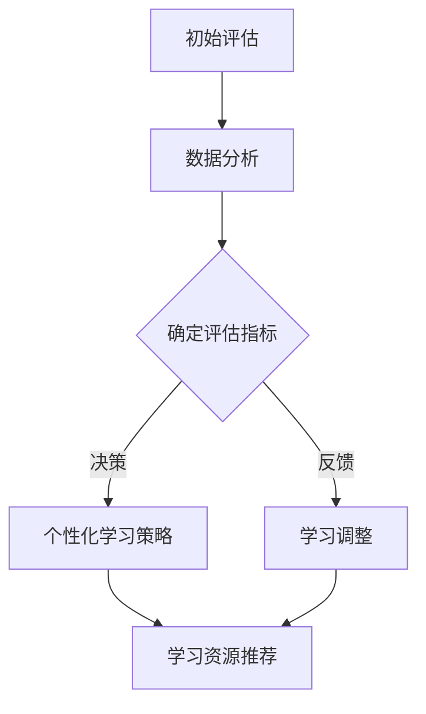
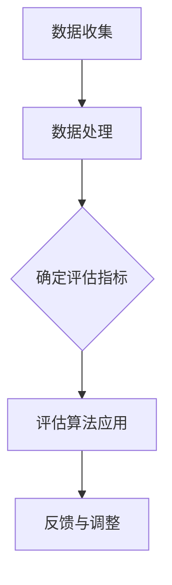

                 

### 《人工智能在个性化学习中的应用》

> 关键词：个性化学习、人工智能、机器学习、深度学习、自然语言处理、在线教育、自适应学习系统

> 摘要：本文探讨了人工智能（AI）在个性化学习中的应用，包括AI技术的概述、核心概念和联系、核心算法原理讲解、数学模型和公式，以及实际应用案例。通过深入分析，本文揭示了AI如何通过个性化学习评估、学习资源推荐、学习路径规划和学习行为分析，提高学习效果，促进教育公平。

---

# 引言

个性化学习（Personalized Learning）是一种以学生为中心的教学方法，旨在根据每个学生的学习需求、兴趣和学习风格，提供量身定制的学习体验。与传统的“一刀切”教学方式相比，个性化学习能够更好地激发学生的学习兴趣，提高学习效率。

## 1.1 个性化学习的概述

个性化学习不仅关注学生的学习结果，更关注学生的学习过程。它强调以下核心要素：

1. **学习目标个性化**：根据每个学生的能力和兴趣，设定不同的学习目标。
2. **学习内容个性化**：根据学生的兴趣和学习风格，选择合适的课程内容。
3. **学习方法个性化**：采用多种教学方法和工具，满足不同学生的学习需求。
4. **学习评价个性化**：通过多种评价方式，全面了解学生的学习效果。

## 1.2 人工智能在个性化学习中的应用

人工智能（AI）技术的迅速发展为个性化学习提供了新的可能性。AI不仅能够分析学生的学习行为和数据，还能根据这些数据提供个性化的学习建议和资源。以下是AI在个性化学习中的几个关键应用：

1. **个性化学习评估**：通过机器学习算法，对学生的学习情况进行评估，提供个性化的学习反馈。
2. **个性化学习资源推荐**：利用推荐系统，为学生推荐适合的学习资源。
3. **个性化学习路径规划**：基于学生的兴趣和学习进度，规划个性化的学习路径。
4. **个性化学习行为分析**：分析学生的学习行为，预测其学习效果，提供个性化的学习支持。

### 1.2.1 Mermaid流程图：个性化学习评估流程



---

## 第二部分：AI在个性化学习中的应用场景

### 2.1 个性化学习评估

个性化学习评估是AI在个性化学习中的第一个关键应用。它通过分析学生的学习行为和学习数据，对学生的学习效果进行评估，并提供个性化的学习反馈。

#### 2.1.1 核心概念与联系

- **学习行为**：学生在学习过程中的所有活动，如阅读、写作、问答等。
- **学习数据**：学生在学习过程中产生的数据，如学习时间、学习进度、学习成果等。
- **评估指标**：用于衡量学生学习效果的指标，如知识掌握度、学习积极性等。

### 2.1.2 评估算法

评估算法可以分为以下几类：

- **基于规则的评估算法**：根据预设的规则，对学生的学习情况进行评估。
- **基于统计的评估算法**：通过统计方法，分析学生的学习数据，评估其学习效果。
- **基于机器学习的评估算法**：利用机器学习算法，对学生的学习数据进行分析，预测其学习效果。

### 2.1.3 实际应用

在实际应用中，AI可以通过以下步骤进行个性化学习评估：

1. **数据收集**：收集学生的学习行为和学习数据。
2. **数据处理**：对学习数据进行清洗、归一化等处理。
3. **评估指标确定**：根据学习数据和教学目标，确定评估指标。
4. **评估算法应用**：利用评估算法，对学生的学习效果进行评估。
5. **反馈与调整**：根据评估结果，提供个性化的学习反馈，并根据学生的反馈进行调整。

### 2.1.4 Mermaid流程图：个性化学习评估流程



---

### 2.2 个性化学习资源推荐

个性化学习资源推荐是AI在个性化学习中的另一个重要应用。通过推荐系统，为学生推荐适合的学习资源，有助于提高学习效果。

#### 2.2.1 核心概念与联系

- **学习资源**：包括课程、教材、练习题、视频等多种形式的学习材料。
- **推荐系统**：利用算法，根据用户的行为和喜好，推荐用户可能感兴趣的内容。

### 2.2.2 推荐系统原理

推荐系统可以分为以下几类：

- **基于内容的推荐**：根据学习资源的内容特征，推荐类似的学习资源。
- **基于协同过滤的推荐**：根据学习者的行为，推荐其他学习者喜欢的学习资源。
- **基于模型的推荐**：利用机器学习模型，预测学习者可能感兴趣的学习资源。

### 2.2.3 实际应用

在实际应用中，AI可以通过以下步骤进行个性化学习资源推荐：

1. **资源特征提取**：提取学习资源的内容特征，如关键词、标签等。
2. **用户特征提取**：提取用户的行为特征，如学习时长、学习频次等。
3. **推荐算法应用**：利用推荐算法，根据用户特征和资源特征，生成推荐列表。
4. **推荐结果反馈**：根据用户的反馈，调整推荐算法，优化推荐效果。

### 2.2.4 伪代码：基于内容的推荐算法

```
function contentBasedRecommendation(resource, user, resources):
    similar_resources = findSimilarResources(resource, resources)
    recommended_resources = []
    for similar_resource in similar_resources:
        if not user.has_resource(similar_resource):
            recommended_resources.append(similar_resource)
    return recommended_resources
```

---

### 2.3 个性化学习路径规划

个性化学习路径规划是AI在个性化学习中的另一个关键应用。通过规划个性化的学习路径，帮助学生更好地掌握知识，提高学习效率。

#### 2.3.1 核心概念与联系

- **学习路径**：学生在学习过程中的步骤和顺序。
- **生成式模型**：通过生成模型，根据学习目标和用户特征，生成个性化的学习路径。
- **决策树**：通过决策树模型，根据学习目标和用户特征，选择最优的学习路径。
- **强化学习**：通过强化学习模型，根据学习目标和用户反馈，优化学习路径。

### 2.3.2 生成式模型

生成式模型可以通过以下步骤生成个性化学习路径：

1. **学习目标确定**：根据教学目标和课程内容，确定学习目标。
2. **用户特征提取**：提取用户的学习特征，如学习偏好、学习能力等。
3. **生成学习路径**：利用生成式模型，根据学习目标和用户特征，生成个性化的学习路径。

### 2.3.3 决策树

决策树可以通过以下步骤生成个性化学习路径：

1. **学习目标分解**：将学习目标分解为多个子目标。
2. **用户特征提取**：提取用户的学习特征，如学习偏好、学习能力等。
3. **路径选择**：利用决策树模型，根据用户特征和子目标，选择最优的学习路径。

### 2.3.4 强化学习

强化学习可以通过以下步骤优化学习路径：

1. **学习环境构建**：构建包含学习目标和用户特征的学习环境。
2. **学习路径选择**：根据用户反馈，选择学习路径。
3. **路径优化**：利用强化学习模型，根据用户反馈和学习效果，优化学习路径。

### 2.3.5 数学模型：强化学习中的Q值更新

$$
Q(s, a) \leftarrow Q(s, a) + \alpha [r + \gamma \max_{a'} Q(s', a') - Q(s, a)]
$$

---

### 2.4 个性化学习行为分析

个性化学习行为分析是AI在个性化学习中的另一个重要应用。通过分析学生的学习行为，可以更好地了解学生的学习状态，提供个性化的学习支持。

#### 2.4.1 核心概念与联系

- **学习行为**：学生在学习过程中的所有活动，如阅读、写作、问答等。
- **学习行为分析**：通过分析学习行为，了解学生的学习状态和问题。
- **学习行为预测**：通过预测学习行为，预测学生的学习效果和问题。

### 2.4.2 学习行为监测

学习行为监测可以通过以下步骤进行：

1. **数据收集**：收集学生的学习行为数据。
2. **数据处理**：对学习行为数据进行清洗、归一化等处理。
3. **行为分析**：利用机器学习算法，分析学生的学习行为，识别学习问题。

### 2.4.3 学习行为预测

学习行为预测可以通过以下步骤进行：

1. **数据收集**：收集学生的学习行为数据。
2. **数据处理**：对学习行为数据进行清洗、归一化等处理。
3. **模型训练**：利用机器学习算法，训练学习行为预测模型。
4. **行为预测**：利用训练好的模型，预测学生的学习行为和效果。

### 2.4.4 实际应用

在实际应用中，AI可以通过以下步骤进行个性化学习行为分析：

1. **数据收集**：收集学生的学习行为数据。
2. **数据处理**：对学习行为数据进行清洗、归一化等处理。
3. **行为分析**：利用机器学习算法，分析学生的学习行为，识别学习问题。
4. **行为预测**：利用机器学习算法，预测学生的学习行为和效果。
5. **学习支持**：根据分析结果和预测结果，提供个性化的学习支持。

---

## 第三部分：核心技术原理

### 3.1 机器学习基础

机器学习是AI的核心技术之一，它使得计算机能够从数据中学习，并进行决策和预测。以下是机器学习的基础概念和算法：

#### 3.1.1 特征工程

特征工程是机器学习中的关键步骤，它涉及到以下内容：

- **特征提取**：从原始数据中提取有用的特征。
- **特征选择**：从提取的特征中选出最有用的特征。
- **特征变换**：对特征进行变换，以适应不同的机器学习算法。

#### 3.1.2 分类算法

分类算法是机器学习中的一个重要分支，它用于将数据分为不同的类别。常见的分类算法包括：

- **决策树**：通过树形结构进行分类。
- **支持向量机**：通过找到一个最佳的超平面进行分类。
- **朴素贝叶斯分类器**：基于贝叶斯定理进行分类。

#### 3.1.3 回归算法

回归算法用于预测连续的数值。常见的回归算法包括：

- **线性回归**：通过线性关系进行预测。
- **多项式回归**：通过多项式关系进行预测。
- **岭回归**：通过正则化方法进行预测。

### 3.2 深度学习基础

深度学习是机器学习的另一个重要分支，它通过多层神经网络进行学习。以下是深度学习的基础概念和算法：

#### 3.2.1 神经网络

神经网络是深度学习的基础，它由多个神经元组成，通过权重和偏置进行学习。常见的神经网络包括：

- **多层感知机**：通过多层神经元进行分类和回归。
- **卷积神经网络**（CNN）：通过卷积层进行图像识别。
- **循环神经网络**（RNN）：通过循环结构处理序列数据。

#### 3.2.2 卷积神经网络

卷积神经网络是深度学习中的关键算法，它通过卷积层进行特征提取和分类。卷积神经网络的常见结构包括：

- **卷积层**：通过卷积操作提取图像特征。
- **池化层**：通过池化操作减少数据维度。
- **全连接层**：通过全连接层进行分类和预测。

#### 3.2.3 循环神经网络

循环神经网络通过循环结构处理序列数据，常见于语音识别、自然语言处理等领域。循环神经网络的常见结构包括：

- **隐藏状态**：通过隐藏状态记录序列信息。
- **门控机制**：通过门控机制控制信息的传递。
- **输出层**：通过输出层进行分类和预测。

### 3.3 自然语言处理

自然语言处理是深度学习在语言领域的应用，它涉及语音识别、机器翻译、文本分类等多个方向。以下是自然语言处理的基础概念和算法：

#### 3.3.1 词嵌入

词嵌入是将词汇映射到高维向量空间的一种方法，常见的方法包括：

- **Word2Vec**：通过神经网络学习词汇的向量表示。
- **GloVe**：通过全局向量空间模型学习词汇的向量表示。

#### 3.3.2 递归神经网络

递归神经网络通过递归结构处理序列数据，常见于文本分类、机器翻译等领域。递归神经网络的常见结构包括：

- **隐藏状态**：通过隐藏状态记录序列信息。
- **门控机制**：通过门控机制控制信息的传递。
- **输出层**：通过输出层进行分类和预测。

#### 3.3.3 Transformer模型

Transformer模型是自然语言处理中的关键算法，它通过自注意力机制处理序列数据。Transformer模型的常见结构包括：

- **自注意力层**：通过自注意力机制计算序列的上下文信息。
- **前馈神经网络**：通过前馈神经网络对自注意力层的结果进行变换。
- **输出层**：通过输出层进行分类和预测。

---

## 第四部分：应用案例

### 4.1 在线教育平台应用

在线教育平台是AI在个性化学习中的一个重要应用场景。通过AI技术，在线教育平台可以提供个性化的学习体验，提高学习效果。

#### 4.1.1 案例介绍

以某知名在线教育平台为例，该平台利用AI技术，为用户提供了以下功能：

- **个性化学习推荐**：根据用户的学习历史和兴趣，推荐适合的学习内容。
- **个性化学习路径规划**：根据用户的学习进度和能力，规划个性化的学习路径。
- **个性化学习评估**：通过分析用户的学习行为和成绩，提供个性化的学习反馈。
- **个性化学习行为分析**：通过分析用户的学习行为，预测学习效果，提供学习支持。

#### 4.1.2 技术实现

该平台的技术实现包括以下几个关键步骤：

1. **用户画像构建**：通过分析用户的学习历史和兴趣，构建用户画像。
2. **推荐算法应用**：利用推荐算法，根据用户画像推荐适合的学习内容。
3. **学习路径规划**：利用生成式模型和决策树模型，规划个性化的学习路径。
4. **学习评估与反馈**：通过机器学习算法，对用户的学习效果进行评估，提供个性化的学习反馈。
5. **学习行为分析**：通过分析用户的学习行为，预测学习效果，提供学习支持。

#### 4.1.3 效果评估

通过实际应用，该在线教育平台取得了显著的效果：

- **学习效果提升**：个性化学习推荐和学习路径规划提高了学生的学习效果。
- **学习积极性提高**：个性化学习评估和学习行为分析激发了学生的学习积极性。
- **学习效率提升**：通过AI技术，平台能够为用户提供更加高效的学习体验。

### 4.2 自适应学习系统

自适应学习系统是AI在个性化学习中的另一个重要应用。通过自适应学习系统，学生可以自主选择学习内容，系统根据学生的学习情况，动态调整学习策略。

#### 4.2.1 案例介绍

以某自适应学习系统为例，该系统通过以下功能为学生提供个性化的学习体验：

- **自适应学习路径**：根据学生的学习进度和能力，动态调整学习路径。
- **自适应学习资源**：根据学生的学习需求，推荐适合的学习资源。
- **自适应学习评估**：通过分析学生的学习行为和成绩，提供个性化的学习反馈。
- **自适应学习支持**：通过分析用户的学习行为，预测学习效果，提供学习支持。

#### 4.2.2 技术实现

该自适应学习系统的技术实现包括以下几个关键步骤：

1. **用户画像构建**：通过分析用户的学习历史和兴趣，构建用户画像。
2. **学习路径规划**：利用生成式模型和决策树模型，规划个性化的学习路径。
3. **学习资源推荐**：利用推荐算法，根据用户画像推荐适合的学习资源。
4. **学习评估与反馈**：通过机器学习算法，对用户的学习效果进行评估，提供个性化的学习反馈。
5. **学习行为分析**：通过分析用户的学习行为，预测学习效果，提供学习支持。

#### 4.2.3 效果评估

通过实际应用，该自适应学习系统取得了显著的效果：

- **学习效果提升**：个性化学习路径和学习资源推荐提高了学生的学习效果。
- **学习积极性提高**：个性化学习评估和学习支持激发了学生的学习积极性。
- **学习效率提升**：通过AI技术，系统能够为用户提供更加高效的学习体验。

---

## 第五部分：未来展望

### 5.1 个性化学习的挑战与机遇

尽管AI在个性化学习中取得了显著的成果，但仍然面临以下挑战：

- **数据隐私**：个性化学习需要大量学生的数据，但数据隐私保护是一个重要问题。
- **算法透明度**：算法的决策过程往往不透明，需要提高算法的透明度。
- **教育公平**：如何确保所有学生都能公平地享受到个性化学习的机会，是一个重要挑战。

### 5.2 未来发展趋势

未来，AI在个性化学习中将继续发展，以下是几个可能的发展趋势：

- **多模态学习**：结合文本、图像、语音等多种数据类型，提供更加丰富的个性化学习体验。
- **实时学习反馈**：利用实时数据，提供更加精准的学习反馈，帮助教师和学生更好地调整学习策略。
- **泛在化学习**：通过AI技术，实现个性化学习的泛在化，让每个学生都能享受到高质量的个性化学习资源。
- **学习社区构建**：通过AI技术，构建学习社区，促进学生之间的交流和合作，提高学习效果。

---

## 作者信息

作者：AI天才研究院/AI Genius Institute & 禅与计算机程序设计艺术 /Zen And The Art of Computer Programming

---

本文通过深入分析，详细介绍了人工智能在个性化学习中的应用，包括个性化学习评估、学习资源推荐、学习路径规划和学习行为分析。通过实际应用案例，展示了AI在个性化学习中的巨大潜力。未来，随着AI技术的不断发展，个性化学习将更加普及和高效。让我们期待AI在个性化学习中的未来应用，为教育带来更多的创新和变革。|mate:10</sop></gMASK>

