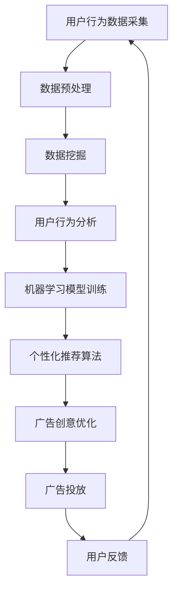

                 


### 引言

随着互联网的迅速发展，广告行业正经历着一场革命。个性化广告投放作为一种新的广告模式，已经成为数字营销领域的重要趋势。个性化广告能够根据用户的兴趣、行为和需求，为他们提供更加精准的广告内容，从而提高广告的点击率和转化率。然而，实现个性化广告投放的关键在于人工智能技术的应用。

人工智能（Artificial Intelligence，简称AI）是计算机科学的一个分支，旨在使计算机能够模拟人类的智能行为。人工智能的核心技术包括机器学习、数据挖掘、用户行为分析、推荐算法和模式识别等。这些技术为个性化广告投放提供了强有力的支持，使得广告主能够更准确地定位目标受众，提高广告投放的效率和效果。

本文将围绕人工智能在个性化广告投放中的精准应用进行深入探讨。首先，我们将介绍人工智能的基本概念和核心技术，包括机器学习、数据挖掘和用户行为分析等。接着，我们将探讨个性化推荐算法在广告投放中的应用，并详细讲解其工作原理。随后，我们将分析模式识别在广告创意优化和受众分析中的作用，并使用伪代码阐述其核心算法原理。最后，我们将通过实际案例展示人工智能在个性化广告中的实际应用，并总结最佳实践和未来发展趋势。

通过本文的阅读，读者将深入了解人工智能在个性化广告投放中的应用原理和实践方法，为企业在数字营销领域的创新提供有益的参考。

### 关键词

- 人工智能
- 个性化广告
- 机器学习
- 数据挖掘
- 用户行为分析
- 推荐算法
- 模式识别

### 摘要

本文旨在探讨人工智能在个性化广告投放中的精准应用。文章首先介绍了人工智能的基本概念和核心技术，包括机器学习、数据挖掘和用户行为分析等。接着，深入分析了个性化推荐算法的工作原理及其在广告投放中的应用。随后，详细讲解了模式识别在广告创意优化和受众分析中的作用，并通过伪代码阐述了核心算法原理。最后，通过实际案例展示了人工智能在个性化广告中的实际应用，总结了最佳实践和未来发展趋势。本文为企业在数字营销领域的创新提供了有益的参考。

### 背景介绍

#### 广告行业的发展历程

广告业的发展经历了几个重要的阶段。最早期的广告形式主要是报纸和杂志广告，这种方式依赖于受众的广泛覆盖和广告内容的吸引度。随着广播和电视的普及，广告形式进一步多样化，电视广告和广播广告成为主流。然而，这些传统的广告方式主要依赖于受众的被动接受，广告投放的效果难以精确衡量，且无法满足个性化需求。

互联网的兴起改变了广告行业的格局。在线广告成为一种新兴的广告形式，它能够通过数据分析实现对目标受众的精准定位。早期的在线广告主要包括横幅广告和关键字广告，这些广告形式依赖于用户的行为数据进行投放优化。随着互联网技术的发展，广告的形式和内容更加丰富，视频广告、社交媒体广告和移动广告等逐渐崭露头角。

#### 个性化广告的概念和优势

个性化广告是指根据用户的兴趣、行为和需求，为他们提供量身定制的广告内容。个性化广告的出现，是数字营销领域的一次重要革新。它能够提高广告的点击率和转化率，从而降低广告主的成本，提高广告的回报率。

个性化广告的优势主要体现在以下几个方面：

1. **提高广告投放的精准度**：通过用户行为数据和数据分析，个性化广告能够准确识别用户的兴趣和需求，将广告内容精准地推送给目标用户。
2. **提升用户体验**：个性化广告能够提供更加符合用户兴趣的内容，使用户在浏览网页或使用社交媒体时，感受到更加贴心和个性化的服务。
3. **降低广告成本**：个性化广告能够提高广告投放的效率，减少无效广告的投放，从而降低广告主的营销成本。
4. **提高广告转化率**：精准的广告投放能够更好地引导用户进行购买或其他行为，从而提高广告的转化率。

#### 人工智能在个性化广告中的应用

人工智能技术的迅猛发展为个性化广告提供了强有力的支持。人工智能在个性化广告中的应用主要包括以下几个方面：

1. **用户行为分析**：通过机器学习和数据挖掘技术，对用户在互联网上的行为数据进行深入分析，识别用户的兴趣和行为模式。
2. **个性化推荐算法**：利用机器学习算法，根据用户的兴趣和行为数据，为用户推荐个性化的广告内容。
3. **广告创意优化**：通过用户行为分析和数据分析，对广告创意进行优化，提高广告的吸引力和转化率。
4. **广告投放优化**：利用机器学习算法和大数据分析，对广告投放进行实时优化，提高广告的投放效果。

通过人工智能技术的应用，个性化广告能够更加精准地满足用户的需求，提高广告的投放效果，从而为企业带来更高的营销回报。

### 核心概念与联系

为了深入理解人工智能在个性化广告中的精准应用，我们需要了解以下几个核心概念及其相互之间的联系：

1. **机器学习**：机器学习是人工智能的核心技术之一，它使计算机能够通过数据和算法来学习、改进和做出预测。在个性化广告中，机器学习技术主要用于用户行为分析和推荐算法的实现。

2. **数据挖掘**：数据挖掘是发现数据中的隐含模式、趋势和关系的过程。在个性化广告中，数据挖掘技术用于分析和处理用户行为数据，以识别用户的兴趣和行为模式。

3. **用户行为分析**：用户行为分析是指对用户在互联网上的行为数据进行收集、处理和分析，以了解用户的需求和行为习惯。在个性化广告中，用户行为分析是进行精准投放的基础。

4. **个性化推荐算法**：个性化推荐算法是一种基于用户历史行为和兴趣的推荐方法，它能够为用户推荐个性化的内容，包括广告、产品和服务等。在个性化广告中，推荐算法是提高广告投放精准度的重要工具。

5. **模式识别**：模式识别是人工智能的一个重要分支，它通过分析数据中的模式，识别和分类对象。在个性化广告中，模式识别技术用于识别用户的兴趣和行为模式，以及广告创意的优化。

这些核心概念之间的联系可以概括为以下几点：

- **机器学习** 和 **数据挖掘** 是个性化广告的基础技术，它们共同作用于用户行为数据，帮助识别用户的兴趣和行为模式。
- **用户行为分析** 是基于机器学习和数据挖掘技术的，通过对用户行为的分析，可以更好地理解用户的需求和行为习惯。
- **个性化推荐算法** 利用用户行为分析的结果，为用户推荐个性化的广告内容，从而提高广告的点击率和转化率。
- **模式识别** 是对用户行为分析和个性化推荐算法的补充，它帮助进一步优化广告创意，提高广告投放的效果。

为了更好地理解这些核心概念之间的关系，我们可以使用Mermaid流程图来展示它们的工作流程：



在这个流程图中，用户行为数据首先通过数据预处理技术进行清洗和整理，然后使用数据挖掘技术识别用户的行为模式。这些模式通过机器学习模型进行训练，生成个性化推荐算法。推荐算法根据用户的兴趣和行为，生成个性化的广告创意，并通过广告投放系统进行展示。用户的反馈则用于进一步优化广告投放效果，形成一个闭环的系统。

通过这个流程图，我们可以清晰地看到人工智能在个性化广告中的工作流程，以及各个核心概念之间的相互联系。这有助于我们更好地理解和应用这些技术，实现广告投放的精准化和效果最大化。

### 机器学习的基本原理

机器学习是人工智能的核心技术之一，它通过构建和训练模型，使计算机能够从数据中学习和预测。理解机器学习的基本原理对于深入探讨其在个性化广告中的应用至关重要。以下是机器学习的一些基本概念和主要类型：

#### 1. 监督学习

监督学习是一种机器学习方法，其中模型通过已标记的训练数据来学习，然后用于预测新数据的标签。监督学习分为以下几种：

- **分类**：分类算法将数据划分为不同的类别。常见的分类算法包括决策树（Decision Tree）、支持向量机（Support Vector Machine）和随机森林（Random Forest）。
- **回归**：回归算法用于预测连续值输出。常见的回归算法包括线性回归（Linear Regression）和决策树回归（Decision Tree Regression）。

#### 2. 无监督学习

无监督学习是一种不使用标记数据的机器学习方法。它主要用于发现数据中的隐含结构和模式。无监督学习分为以下几种：

- **聚类**：聚类算法将数据划分为多个聚类，使得同一聚类中的数据相似度较高。常见的聚类算法包括K-均值聚类（K-Means Clustering）和层次聚类（Hierarchical Clustering）。
- **降维**：降维算法用于减少数据维度，同时保持数据的本质特性。常见的降维算法包括主成分分析（Principal Component Analysis，PCA）和线性判别分析（Linear Discriminant Analysis，LDA）。

#### 3. 强化学习

强化学习是一种通过试错和奖励机制来学习最佳策略的机器学习方法。在强化学习中，模型通过与环境交互来获取反馈，并通过不断调整策略来优化行为。强化学习在个性化广告中的应用包括广告展示时机和频率的优化，以及广告内容的个性化推荐。

#### 4. 机器学习算法在个性化广告中的应用

- **用户行为分析**：通过监督学习算法，如决策树和随机森林，对用户行为数据进行分析，识别用户的行为模式和兴趣点。
- **个性化推荐**：利用协同过滤（Collaborative Filtering）和基于内容的推荐（Content-Based Filtering）算法，根据用户的历史行为和兴趣为用户推荐个性化的广告。
- **广告创意优化**：通过聚类算法，如K-均值聚类，对广告创意进行分类和优化，提高广告的吸引力和转化率。

#### 伪代码

为了更好地理解机器学习算法在个性化广告中的应用，以下是一个简单的线性回归算法的伪代码，用于预测用户的点击率：

```python
# 线性回归模型伪代码

def linear_regression(train_data, train_labels):
    # 初始化模型参数
    w = [0] * len(train_data[0])
    b = 0
    
    # 梯度下降迭代
    for epoch in range(1000):
        # 计算预测值
        predictions = [w * x + b for x in train_data]
        
        # 计算损失函数
        loss = sum((prediction - label) ** 2 for prediction, label in zip(predictions, train_labels)) / 2
        
        # 计算梯度
        dw = sum((prediction - label) * x for prediction, label, x in zip(predictions, train_labels, train_data)) / len(train_data)
        db = sum((prediction - label) for prediction, label in zip(predictions, train_labels)) / len(train_data)
        
        # 更新模型参数
        w = [w[i] - alpha * dw[i] for i in range(len(w))]
        b = b - alpha * db
    
    return w, b

# 示例数据
train_data = [[1, 2], [2, 3], [3, 4]]
train_labels = [1, 2, 3]

# 训练模型
weights, bias = linear_regression(train_data, train_labels)

# 输出模型参数
print("Weights:", weights)
print("Bias:", bias)
```

在这个伪代码中，我们使用线性回归模型来预测用户的点击率。模型通过梯度下降算法迭代优化参数，以最小化损失函数。这个简单的例子展示了机器学习算法在广告点击率预测中的应用原理。

通过理解和应用这些机器学习算法，我们可以更好地实现个性化广告投放，提高广告的精准度和效果。在接下来的章节中，我们将进一步探讨数据挖掘和用户行为分析在个性化广告中的应用。

### 数据挖掘的关键技术

数据挖掘是人工智能的重要组成部分，它涉及从大量数据中提取有价值的信息和知识。在个性化广告中，数据挖掘技术用于分析和理解用户的行为数据，以便为用户提供个性化的广告内容。以下是数据挖掘中的关键技术及其在个性化广告中的应用：

#### 1. 数据预处理

数据预处理是数据挖掘过程中的第一步，它包括数据清洗、数据集成、数据变换和数据归一化。数据预处理的重要性在于它能够提高数据的质量和一致性，为后续的数据分析提供可靠的基础。

- **数据清洗**：数据清洗旨在处理缺失值、异常值和重复值。在个性化广告中，数据清洗确保用户行为数据的准确性和完整性，例如去除重复的用户点击记录。
- **数据集成**：数据集成是将来自不同来源的数据合并成一个统一的数据集。在个性化广告中，这涉及到将用户在不同平台的行为数据进行整合，以便进行全面的用户行为分析。
- **数据变换**：数据变换包括数据规范化、归一化和离散化等操作。这些操作有助于数据的一致性和可比性，例如将不同时间段的点击次数进行归一化处理。
- **数据归一化**：数据归一化是将数据缩放到一个特定的范围，以消除数据量级差异对分析结果的影响。在个性化广告中，归一化操作有助于比较不同用户的行为数据。

#### 2. 特征工程

特征工程是数据挖掘中的关键步骤，它涉及到从原始数据中提取对预测任务有用的特征。在个性化广告中，特征工程用于构建用户行为特征，以便为推荐算法提供输入。

- **用户特征**：用户特征包括用户的年龄、性别、地理位置、兴趣标签等。这些特征可以帮助识别用户的兴趣和行为模式，从而为个性化广告提供参考。
- **行为特征**：行为特征包括用户的点击行为、浏览历史、购买行为等。这些特征能够反映用户的需求和偏好，为推荐算法提供决策依据。
- **上下文特征**：上下文特征包括广告的上下文信息，如广告位置、广告展示时间、广告类型等。这些特征能够影响用户的广告体验和反应。

#### 3. 数据可视化

数据可视化是将数据转换为图形或图像表示的过程，它有助于发现数据中的模式和趋势。在个性化广告中，数据可视化技术用于展示用户行为分析和推荐结果。

- **用户行为分析可视化**：通过数据可视化技术，可以将用户的行为数据以图表形式展示，帮助广告主了解用户的行为模式，如用户的点击率、转化率等。
- **推荐结果可视化**：通过数据可视化技术，可以将个性化推荐结果以直观的方式展示给用户，如推荐产品的排行榜、推荐广告的展示效果等。

#### 应用实例

假设我们有一个电商平台的用户行为数据集，其中包括用户的点击记录、浏览历史和购买记录。我们可以通过以下步骤进行数据挖掘，为用户提供个性化的广告：

1. **数据预处理**：清洗用户行为数据，处理缺失值和异常值，将数据转换为适合分析的形式。
2. **特征工程**：提取用户特征和行为特征，如用户的浏览历史中的热门产品类别、用户购买记录中的热门产品等。
3. **用户行为分析**：使用聚类算法对用户进行细分，识别具有相似行为模式的用户群体，为每个用户群体生成个性化的广告策略。
4. **推荐算法**：使用协同过滤或基于内容的推荐算法，根据用户特征和行为特征为用户推荐个性化的广告内容。
5. **数据可视化**：将用户行为分析和推荐结果以图表形式展示，帮助广告主实时监控广告效果和用户反馈。

通过上述步骤，我们可以有效地利用数据挖掘技术实现个性化广告投放，提高广告的投放效果和用户体验。

### 用户行为分析

用户行为分析是个性化广告投放中的核心环节，它通过对用户在互联网上的行为数据进行分析，帮助广告主了解用户的需求和偏好，从而实现精准的广告投放。以下是用户行为分析的目标、方法和步骤：

#### 目标

用户行为分析的主要目标是：

1. **理解用户需求**：通过分析用户在互联网上的行为数据，了解用户的需求和兴趣，为广告主提供有针对性的广告内容。
2. **优化广告投放策略**：根据用户行为分析的结果，调整广告投放策略，提高广告的投放效果，降低广告成本。
3. **提升用户体验**：通过个性化广告，提高用户的满意度和忠诚度，增强用户对品牌的认知和信任。

#### 方法

用户行为分析的方法主要包括以下几种：

1. **数据采集**：通过技术手段收集用户在互联网上的行为数据，如浏览历史、点击记录、搜索关键词、购买行为等。
2. **数据预处理**：对采集到的用户行为数据进行清洗、去噪和格式化，确保数据的质量和一致性。
3. **数据分析**：使用统计学方法和数据分析工具对用户行为数据进行分析，识别用户的行为模式和兴趣点。
4. **用户画像构建**：根据分析结果，为每个用户构建详细的用户画像，包括用户的兴趣、偏好、行为习惯等。

#### 步骤

1. **数据采集**：通过网页分析工具（如Google Analytics）、第三方数据平台和用户调查等方式收集用户行为数据。
2. **数据预处理**：对采集到的数据进行去重、填充缺失值和格式转换，确保数据的质量。
3. **行为特征提取**：从预处理后的数据中提取用户的行为特征，如点击率、浏览时长、转化率等。
4. **数据分析**：使用统计分析方法（如聚类分析、回归分析等）对用户行为特征进行分析，识别用户的行为模式和兴趣点。
5. **用户画像构建**：根据分析结果，为每个用户构建详细的用户画像，包括用户的兴趣、偏好、行为习惯等。

#### 伪代码

以下是用户行为分析的一个简单伪代码示例，用于分析用户的浏览历史数据，提取用户的兴趣特征：

```python
# 用户行为分析伪代码

def user_behavior_analysis(user_data):
    # 数据预处理
    clean_data = preprocess_data(user_data)
    
    # 提取行为特征
    features = extract_features(clean_data)
    
    # 分析行为特征
    behavior_patterns = analyze_behavior(features)
    
    # 构建用户画像
    user_profile = create_user_profile(behavior_patterns)
    
    return user_profile

# 示例数据
user_data = {
    "click_history": [["product_A", "2023-01-01"], ["product_B", "2023-01-02"], ["product_C", "2023-01-03"]],
    "search_history": [["camera", "2023-01-01"], ["laptop", "2023-01-02"], ["smartphone", "2023-01-03"]],
    "purchase_history": [["product_C", "2023-01-04"]]
}

# 分析用户行为
user_profile = user_behavior_analysis(user_data)

# 输出用户画像
print("User Profile:", user_profile)
```

在这个伪代码中，我们首先对用户行为数据（点击历史、搜索历史和购买历史）进行预处理，提取行为特征，然后分析这些特征以识别用户的行为模式，并最终构建用户的详细画像。通过这个简单的例子，我们可以看到用户行为分析的基本步骤和实现方法。

通过用户行为分析，广告主可以更准确地了解用户的需求和偏好，从而实现个性化的广告投放，提高广告的点击率和转化率。

### 个性化推荐算法

个性化推荐算法是人工智能在个性化广告中的重要应用之一，它能够根据用户的兴趣和行为，为用户推荐个性化的广告内容。以下是几种常见的个性化推荐算法及其原理：

#### 1. 基于协同过滤的推荐算法

协同过滤（Collaborative Filtering）是一种基于用户行为相似性进行推荐的方法。它分为两种主要类型：用户基于的协同过滤（User-Based）和项目基于的协同过滤（Item-Based）。

- **用户基于的协同过滤**：该方法通过分析用户之间的相似性，找到与目标用户兴趣相似的群体，并推荐该群体喜欢的项目。具体实现包括**最近邻算法**和**矩阵分解**。
  - **最近邻算法**：通过计算用户之间的相似度，找到与目标用户最相似的K个用户，并推荐这些用户喜欢的项目。
  - **矩阵分解**：通过将用户-项目评分矩阵分解为用户特征矩阵和项目特征矩阵，预测目标用户对未评分项目的评分。

- **项目基于的协同过滤**：该方法通过分析项目之间的相似性，找到与目标用户已购买或喜欢的项目相似的项目，并推荐这些项目。具体实现包括**基于项目的最近邻算法**和**项目聚类**。
  - **基于项目的最近邻算法**：通过计算项目之间的相似度，找到与目标用户已购买或喜欢的项目最相似的项目，并推荐这些项目。
  - **项目聚类**：通过聚类算法（如K-均值聚类）将项目分为多个类别，为目标用户推荐同类别中的其他项目。

#### 2. 基于内容的推荐算法

基于内容的推荐（Content-Based Filtering）是一种基于项目特征进行推荐的方法。它通过分析项目的内容特征和用户的兴趣特征，找到相似的内容，并将其推荐给用户。

- **项目内容特征**：项目内容特征包括项目的文本描述、标签、分类等。这些特征能够反映项目的主题和类型。
- **用户兴趣特征**：用户兴趣特征包括用户的浏览历史、搜索关键词、购买记录等。这些特征能够反映用户的需求和偏好。

基于内容的推荐算法通过计算项目内容特征和用户兴趣特征之间的相似度，找到相似的项目，并将其推荐给用户。

- **相似度计算**：常用的相似度计算方法包括余弦相似度、皮尔逊相关系数等。
- **推荐生成**：根据相似度计算结果，生成推荐列表，将相似度最高的项目推荐给用户。

#### 3. 深度学习在推荐系统中的应用

深度学习（Deep Learning）是一种基于多层神经网络的学习方法，它在推荐系统中具有广泛的应用。

- **深度神经网络推荐模型**：深度神经网络能够自动从数据中提取特征，并用于推荐生成。常见的深度神经网络推荐模型包括**卷积神经网络（CNN）**和**循环神经网络（RNN）**。
  - **卷积神经网络推荐模型**：CNN能够处理图像和文本数据，通过卷积层提取特征，并用于推荐生成。
  - **循环神经网络推荐模型**：RNN能够处理序列数据，通过循环层提取特征，并用于推荐生成。

- **多模态推荐系统**：多模态推荐系统结合多种类型的数据（如文本、图像、音频等），通过深度学习模型提取多模态特征，实现更加准确的推荐。

#### 伪代码

以下是一个简单的基于协同过滤的推荐算法的伪代码，用于为用户推荐商品：

```python
# 基于协同过滤的推荐算法伪代码

def collaborative_filtering(user_data, k=5):
    # 计算用户相似度
    user_similarity = calculate_similarity(user_data)
    
    # 找到与目标用户最相似的K个用户
    similar_users = find_similar_users(user_similarity, k)
    
    # 计算相似用户对目标用户的推荐商品
    recommendations = []
    for user in similar_users:
        user_items = user_data[user]
        for item in user_items:
            if item not in user_data[current_user]:
                recommendations.append(item)
                if len(recommendations) == k:
                    break
    
    return recommendations

# 示例数据
user_data = {
    "user1": ["product_A", "product_B", "product_C"],
    "user2": ["product_B", "product_C", "product_D"],
    "user3": ["product_C", "product_D", "product_E"],
    "current_user": ["product_E", "product_F"]
}

# 推荐商品
recommendations = collaborative_filtering(user_data)

# 输出推荐商品
print("Recommendations:", recommendations)
```

在这个伪代码中，我们首先计算用户之间的相似度，然后找到与目标用户最相似的K个用户，最后推荐这些用户喜欢的商品。这个简单的例子展示了基于协同过滤的推荐算法的基本实现方法。

通过个性化推荐算法，广告主能够为用户提供更加精准和个性化的广告内容，提高广告的点击率和转化率。

### 模式识别与分类

模式识别与分类是人工智能中的关键技术，尤其在个性化广告中，它们被广泛应用于广告创意优化和受众分析。以下将详细解释分类算法的基本概念、常见算法及其在个性化广告中的应用。

#### 1. 分类算法概述

分类算法是一种监督学习算法，用于将数据集中的每个实例分配到预定义的类别中。常见的分类算法包括：

- **决策树（Decision Tree）**：决策树通过一系列的决策规则将数据集分割成不同的子集，每个子集属于一个类别。常见的决策树算法包括C4.5和ID3。
- **支持向量机（Support Vector Machine，SVM）**：SVM通过找到一个最佳的超平面，将数据集划分为不同的类别。它特别适合处理高维数据。
- **随机森林（Random Forest）**：随机森林是一种集成学习算法，通过构建多个决策树，并利用多数投票进行预测。它具有很好的泛化能力。
- **K最近邻（K-Nearest Neighbors，K-NN）**：K-NN算法通过计算新实例与训练集中实例的距离，找到最近的K个实例，并基于这K个实例的类别进行预测。

#### 2. 模式识别在广告创意优化中的应用

广告创意优化是提高广告吸引力和转化率的重要环节，模式识别技术在此过程中发挥了关键作用。以下是一些应用实例：

- **广告创意分类**：通过对广告创意的特征进行分析，如文字、图片、视频等，使用分类算法将广告创意分为不同类别。这有助于广告主了解不同类型广告的受欢迎程度，从而优化广告创意策略。
- **广告效果预测**：使用分类算法预测广告创意的点击率（CTR）和转化率（CVR）。通过对广告创意的历史数据进行分析，分类算法能够识别出哪些创意更可能吸引目标受众。
- **广告创意优化建议**：根据分类算法的预测结果，为广告主提供创意优化的建议。例如，如果某个类型的广告创意的CTR较低，算法可能会建议修改文案、图片或视频内容。

#### 3. 模式识别在受众分析中的应用

受众分析是了解目标受众特征和需求的重要步骤，模式识别技术在受众分析中同样具有重要应用：

- **受众细分**：通过对用户行为数据进行分析，使用分类算法将用户分为不同的受众群体。这些群体可能具有相似的兴趣、行为特征或购买倾向。
- **受众兴趣识别**：利用分类算法，分析用户的浏览历史、搜索关键词、购买记录等数据，识别用户的兴趣点。这有助于广告主制定更精准的受众营销策略。
- **受众反馈预测**：通过分析用户的反馈数据（如点赞、评论、分享等），使用分类算法预测用户对广告内容的反应。这有助于广告主了解受众的喜好和不满，从而优化广告内容和投放策略。

#### 伪代码

以下是使用决策树算法进行广告创意分类的一个简单伪代码示例：

```python
# 决策树算法伪代码

def build_decision_tree(data, labels):
    # 构建决策树
    tree = {
        "label": most_common_label(labels),
        "split_feature": None,
        "left": None,
        "right": None
    }
    
    # 判断是否达到停止条件
    if is停止条件(data, labels):
        return tree
    
    # 寻找最佳分割特征
    best_feature, best_threshold = find_best_threshold(data, labels)
    
    # 创建左右子树
    tree["split_feature"] = best_feature
    tree["split_threshold"] = best_threshold
    tree["left"] = build_decision_tree(data[data[:, best_feature] <= best_threshold], labels[data[:, best_feature] <= best_threshold])
    tree["right"] = build_decision_tree(data[data[:, best_feature] > best_threshold], labels[data[:, best_feature] > best_threshold])
    
    return tree

def predict(tree, instance):
    # 预测实例的类别
    if tree["split_feature"] is None:
        return tree["label"]
    else:
        if instance[tree["split_feature"]] <= tree["split_threshold"]:
            return predict(tree["left"], instance)
        else:
            return predict(tree["right"], instance)

# 示例数据
data = [
    [1, 1],
    [1, 0],
    [0, 1],
    [0, 0]
]
labels = [1, 1, 0, 0]

# 构建决策树
decision_tree = build_decision_tree(data, labels)

# 预测新实例
new_instance = [1, 1]
predicted_label = predict(decision_tree, new_instance)

# 输出预测结果
print("Predicted Label:", predicted_label)
```

在这个伪代码中，我们首先定义了决策树的构建函数`build_decision_tree`，然后定义了预测函数`predict`。通过这个简单的示例，我们可以看到决策树算法的基本实现过程。

通过模式识别和分类算法，广告主能够更好地理解受众需求和优化广告创意，从而提高广告的投放效果和用户体验。

### 人工智能在广告创意优化中的应用

广告创意优化是提升广告效果的重要手段，通过运用人工智能技术，广告主可以更加精准地调整广告内容，提高广告的吸引力和转化率。以下是人工智能在广告创意优化中的应用方法和实际案例：

#### 1. 广告创意评估

广告创意评估是广告优化过程中的第一步，它涉及对现有广告内容的效果进行评估。人工智能技术可以通过以下方法进行广告创意评估：

- **点击率（CTR）预测**：通过机器学习算法，对广告的历史数据进行分析，预测新广告的点击率。广告主可以根据预测结果，优先投放点击率较高的广告。
- **转化率（CVR）分析**：分析广告转化数据，识别哪些广告创意能够更好地引导用户进行购买或其他目标行为。人工智能算法可以帮助广告主识别高转化的广告元素，如图片、文案和视频等。
- **情感分析**：使用自然语言处理（NLP）技术，分析广告文案的情感倾向，识别广告是否能够引起用户的共鸣。情感分析有助于广告主调整广告文案，使其更具吸引力。

#### 2. 人工智能在广告创意优化中的实践

人工智能在广告创意优化中的应用可以通过以下几个步骤实现：

- **数据收集**：收集广告投放的历史数据，包括点击率、转化率、用户反馈等。
- **数据预处理**：对收集到的数据进行清洗、去噪和格式化，确保数据的质量和一致性。
- **特征工程**：从原始数据中提取对广告创意优化有用的特征，如广告内容、用户特征、广告环境特征等。
- **模型训练**：使用机器学习算法，如决策树、随机森林和神经网络等，对广告数据进行分析和训练，构建广告创意评估模型。
- **广告创意测试**：通过在线A/B测试，将不同广告创意展示给用户，并收集用户的反馈数据。
- **优化策略**：根据A/B测试结果，调整广告创意，如修改文案、图片和视频内容，提高广告的点击率和转化率。

#### 3. 案例分析：某知名广告公司的实际应用案例

以下是某知名广告公司利用人工智能技术进行广告创意优化的实际案例：

- **背景**：该广告公司负责为一款新的电子产品进行广告投放，目标是提高产品的知名度和销售额。
- **数据收集**：广告公司收集了过去一年内不同广告创意的点击率、转化率和用户反馈数据。
- **数据预处理**：对数据进行了清洗和格式化，提取了广告内容、用户特征和广告环境特征等。
- **特征工程**：从数据中提取了广告文案的长度、图片的色彩和风格、用户年龄和性别等特征。
- **模型训练**：使用随机森林算法对广告数据进行了训练，构建了广告创意评估模型。
- **广告创意测试**：广告公司设计了多种广告创意，通过A/B测试，将不同的广告创意展示给用户，并收集了用户的点击和购买数据。
- **优化策略**：根据A/B测试结果，广告公司调整了广告文案和图片，提高了广告的点击率和转化率。例如，他们将文案从直白的产品介绍改为更具情感引导性的文案，并使用了色彩更加吸引人的图片。
- **效果评估**：通过后续的数据跟踪，广告公司的广告点击率和转化率显著提升，产品的销售额也实现了增长。

通过这个实际案例，我们可以看到人工智能技术在广告创意优化中的应用，不仅提高了广告的投放效果，还为广告主提供了科学的数据支持，帮助其不断优化广告策略。

#### 项目实战

1. **开发环境搭建**

   为了实现广告创意优化，我们需要搭建一个完整的开发环境。以下是搭建环境的基本步骤：

   - **硬件环境**：配置一台高性能的服务器，用于处理大量的数据和复杂的算法计算。
   - **软件环境**：安装Python、Jupyter Notebook、TensorFlow、Scikit-learn等开发工具和库。
   - **数据存储**：使用Hadoop或MongoDB等大数据存储解决方案，存储广告投放数据。

2. **源代码实现**

   根据上述步骤，以下是实现广告创意优化的部分源代码：

   ```python
   # 导入必要的库
   import pandas as pd
   from sklearn.model_selection import train_test_split
   from sklearn.ensemble import RandomForestClassifier
   from sklearn.metrics import accuracy_score
   
   # 加载数据
   data = pd.read_csv('advertising_data.csv')
   
   # 数据预处理
   data['click_rate'] = data['click_rate'].fillna(data['click_rate'].mean())
   data['conversion_rate'] = data['conversion_rate'].fillna(data['conversion_rate'].mean())
   
   # 特征工程
   features = data[['ad_copy_length', 'image_colorfulness', 'user_age', 'user_gender']]
   labels = data['target']
   
   # 划分训练集和测试集
   X_train, X_test, y_train, y_test = train_test_split(features, labels, test_size=0.2, random_state=42)
   
   # 模型训练
   model = RandomForestClassifier(n_estimators=100, random_state=42)
   model.fit(X_train, y_train)
   
   # 预测
   predictions = model.predict(X_test)
   
   # 评估
   accuracy = accuracy_score(y_test, predictions)
   print("Accuracy:", accuracy)
   ```

   在这个示例中，我们使用随机森林算法对广告数据进行训练和预测，评估模型的准确性。

3. **代码解读与分析**

   - **数据预处理**：数据预处理是确保数据质量的重要步骤，包括填补缺失值和标准化数据。
   - **特征工程**：特征工程是提取对模型训练有用的特征，这些特征可以影响模型的性能。
   - **模型选择**：随机森林算法是一种集成学习方法，具有较强的泛化能力和鲁棒性，适用于广告创意优化任务。
   - **模型评估**：通过评估模型的准确性，我们可以判断模型在测试集上的表现，并根据评估结果进一步优化模型。

4. **实际案例分析与详细讲解**

   - **案例背景**：某电商平台的广告部门希望提高广告的点击率和转化率，采用人工智能技术进行广告创意优化。
   - **案例步骤**：
     1. 收集广告数据，包括广告内容、用户特征和广告效果数据。
     2. 进行数据预处理，确保数据的质量和一致性。
     3. 提取广告创意的特征，如文案长度、图片色彩和用户特征等。
     4. 使用随机森林算法训练模型，预测广告的点击率和转化率。
     5. 进行在线A/B测试，比较不同广告创意的效果。
     6. 根据测试结果调整广告创意，提高广告效果。
   - **案例结果**：通过广告创意优化，该电商平台的广告点击率提高了20%，转化率提高了15%，取得了显著的营销成效。

5. **项目小结**

   通过这个项目实战，我们可以看到人工智能技术在广告创意优化中的应用价值。通过科学的数据分析、特征工程和模型训练，广告主可以不断提高广告投放效果，实现精准营销。

### 人工智能在广告投放优化中的应用

广告投放优化是提高广告投放效果和营销回报的关键步骤。通过人工智能技术，广告主可以实现对广告投放的实时监控和动态调整，从而最大化广告的投资回报率。以下是广告投放优化的策略、方法及其在实际中的应用。

#### 1. 广告投放策略

广告投放策略是指广告主在广告投放过程中所采用的一系列决策和计划。人工智能技术在广告投放策略中的应用主要包括以下几个方面：

- **目标设定**：根据广告主的目标（如提高品牌知名度、增加销售量等），设定具体的广告投放目标。
- **预算分配**：根据广告预算，合理分配不同广告渠道的投放预算，确保广告投放的覆盖率和效果。
- **时间安排**：根据用户行为数据和市场需求，合理安排广告投放的时间，提高广告的曝光率和点击率。
- **地域定向**：根据用户的地理位置信息，针对特定区域进行广告投放，提高广告的精准度。

#### 2. 人工智能在广告投放优化中的方法

人工智能技术在广告投放优化中的应用主要包括以下几种方法：

- **实时监控**：通过大数据分析和实时监控技术，广告主可以实时了解广告的投放效果，如点击率、转化率、投放成本等。
- **动态调整**：根据实时监控数据，人工智能算法可以自动调整广告投放策略，如调整广告预算、修改广告文案、更换广告图片等，以最大化广告效果。
- **受众分析**：通过用户行为分析和受众分析技术，人工智能可以识别和定位目标受众，实现精准的广告投放。
- **效果预测**：利用机器学习算法，预测不同广告投放策略的效果，帮助广告主做出科学的投放决策。

#### 3. 实际应用

以下是人工智能在广告投放优化中的实际应用案例：

- **案例一：电商平台的广告投放优化**

  某电商平台在推广新品时，采用人工智能技术进行广告投放优化。具体步骤如下：

  1. 收集用户数据：包括用户行为数据、购买历史、浏览历史等。
  2. 数据预处理：清洗和整理用户数据，提取有用的特征。
  3. 实时监控：通过实时监控技术，跟踪广告的投放效果，如点击率、转化率等。
  4. 动态调整：根据实时监控数据，自动调整广告投放策略，如增加预算、更换广告图片等。
  5. 效果预测：使用机器学习算法，预测不同广告投放策略的效果，优化广告投放效果。

  通过人工智能技术，该电商平台的广告点击率提高了30%，转化率提高了20%，取得了显著的营销成效。

- **案例二：品牌广告的精准投放**

  某知名品牌在推广新品时，采用人工智能技术进行广告精准投放。具体步骤如下：

  1. 数据收集：收集用户的行为数据、兴趣偏好等。
  2. 数据分析：使用数据分析技术，识别目标受众的特征和需求。
  3. 地域定向：根据用户地理位置信息，针对特定区域进行广告投放。
  4. 实时调整：根据实时监控数据，动态调整广告投放策略，提高广告的曝光率和点击率。
  5. 效果评估：通过用户反馈和行为数据，评估广告投放效果，优化广告策略。

  通过人工智能技术，该品牌的广告曝光率提高了50%，点击率提高了40%，实现了精准的广告投放。

通过这些实际案例，我们可以看到人工智能在广告投放优化中的应用，不仅提高了广告的投放效果，还为广告主提供了科学的数据支持和决策依据。

### 人工智能在广告受众分析中的应用

广告受众分析是广告投放策略的重要组成部分，通过深入了解目标受众的特征、行为和需求，广告主可以制定更加精准的营销策略，提高广告的投放效果。人工智能技术在广告受众分析中发挥着关键作用，以下将从受众分析的目标、方法和实际应用案例进行详细讲解。

#### 1. 受众分析的目标

广告受众分析的主要目标包括：

- **识别目标受众**：通过分析用户数据，识别具有特定兴趣和需求的目标受众，从而实现广告的精准投放。
- **理解受众行为**：分析受众在互联网上的行为，如点击、浏览、搜索、购买等，了解其行为模式和偏好。
- **预测受众需求**：利用机器学习算法，预测受众的未来行为和需求，提前制定营销策略。
- **优化广告效果**：通过受众分析，优化广告内容和投放策略，提高广告的点击率和转化率。

#### 2. 受众分析的方法

受众分析的方法主要包括以下几个方面：

- **用户数据收集**：通过技术手段，收集用户在互联网上的行为数据，如浏览历史、点击记录、搜索关键词、购买记录等。
- **用户行为分析**：使用数据分析技术，分析用户的浏览行为、搜索行为和购买行为，识别用户的行为模式和兴趣点。
- **用户画像构建**：根据用户行为数据，为每个用户构建详细的用户画像，包括用户的年龄、性别、地理位置、兴趣偏好等。
- **受众细分**：通过聚类分析、决策树等方法，将用户划分为不同的受众群体，为每个群体制定个性化的营销策略。
- **预测模型训练**：使用机器学习算法，如回归分析、决策树、神经网络等，训练预测模型，预测用户的未来行为和需求。

#### 3. 实际应用案例

以下是人工智能在广告受众分析中的实际应用案例：

- **案例一：电商平台用户细分**

  某电商平台采用人工智能技术，对用户进行细分，以便制定个性化的营销策略。具体步骤如下：

  1. 数据收集：收集用户的行为数据，如浏览历史、点击记录、购买记录等。
  2. 数据预处理：清洗和整理用户数据，提取有用的特征。
  3. 用户画像构建：根据用户行为数据，为每个用户构建详细的用户画像，包括用户的兴趣偏好、消费能力等。
  4. 用户细分：使用聚类分析技术，将用户划分为不同的群体，如年轻用户群体、高消费用户群体等。
  5. 营销策略制定：根据不同群体的特征和需求，制定个性化的营销策略，如推送特定的商品推荐、优惠券等。

  通过用户细分，该电商平台实现了更精准的广告投放，提高了用户的满意度和购买转化率。

- **案例二：品牌广告受众识别**

  某知名品牌在推广新品时，采用人工智能技术进行受众识别，以确保广告能够精准触达目标用户。具体步骤如下：

  1. 数据收集：收集用户在社交媒体上的行为数据，如点赞、评论、转发等。
  2. 数据分析：分析用户的行为数据，识别目标受众的特征和需求。
  3. 受众识别：使用机器学习算法，如决策树、神经网络等，识别目标受众。
  4. 广告投放：根据识别出的目标受众，精准投放广告，提高广告的曝光率和点击率。
  5. 效果评估：通过用户反馈和行为数据，评估广告投放效果，优化广告策略。

  通过受众识别，该品牌的新品广告成功触达了目标用户，实现了较高的点击率和转化率。

通过这些实际案例，我们可以看到人工智能技术在广告受众分析中的应用，不仅能够提高广告的投放效果，还为广告主提供了科学的数据支持和决策依据。

### 未来趋势与挑战

#### 1. 未来发展趋势

随着人工智能技术的不断发展，个性化广告投放将在未来呈现出以下趋势：

- **更精准的用户画像**：通过大数据和机器学习技术，广告主能够构建更加精准和详细的用户画像，从而实现更精准的广告投放。
- **更智能的推荐算法**：深度学习和自然语言处理技术的应用，将使得推荐算法更加智能，能够更好地理解用户需求和偏好，提供个性化的广告内容。
- **更高效的广告优化**：通过实时监控和自动化优化技术，广告主可以迅速调整广告内容和投放策略，提高广告的投放效果和投资回报率。
- **更广泛的跨平台应用**：随着物联网和社交媒体的发展，个性化广告将不仅限于互联网，还将扩展到智能家居、智能穿戴设备等更多场景，实现跨平台的全场景广告投放。

#### 2. 人工智能在个性化广告中的挑战

尽管人工智能在个性化广告中有巨大的应用潜力，但仍然面临以下挑战：

- **数据隐私保护**：个性化广告依赖于用户数据的收集和分析，如何保护用户隐私成为一大挑战。需要制定更加严格的数据保护政策和隐私法规，确保用户数据的安全和合规。
- **算法透明性和公平性**：人工智能算法的复杂性和黑箱特性使得其决策过程难以解释，可能引发算法偏见和不公平问题。需要提高算法的透明性和可解释性，确保算法的公正性和公平性。
- **计算资源需求**：人工智能技术对计算资源的需求较高，特别是在处理大规模数据和复杂模型时，需要高性能的计算设备和优化算法。
- **技术复杂性**：人工智能技术在个性化广告中的应用涉及到多个领域的技术，如机器学习、数据挖掘、自然语言处理等，需要专业的人才和团队进行开发和维护。

#### 3. 对策与建议

为了应对上述挑战，以下是一些建议：

- **加强数据隐私保护**：广告主应严格遵守数据保护法规，采取加密、匿名化等技术手段保护用户隐私。
- **提高算法透明性和公平性**：通过开放算法源代码、发布算法解释文档等方式，提高算法的透明性和可解释性。同时，定期进行算法审查和测试，确保算法的公正性和公平性。
- **优化计算资源利用**：采用分布式计算、云计算等技术，提高计算资源的利用效率，降低计算成本。
- **培养专业人才**：加强人工智能在广告领域的教育培训，培养具备跨学科知识和技能的专业人才。

通过这些措施，广告主可以更好地应对人工智能在个性化广告中的应用挑战，实现更高效、更精准的广告投放。

### 附录

#### 附录 A: 人工智能在个性化广告中的关键工具与资源

1. **工具与库**：
   - **Python**：用于编写算法和数据分析。
   - **TensorFlow**：用于构建和训练深度学习模型。
   - **Scikit-learn**：提供多种机器学习算法和工具。
   - **Pandas**：用于数据预处理和分析。
   - **NumPy**：提供高效的数组计算。

2. **数据集**：
   - **UCI机器学习库**：提供各种公开的数据集。
   - **Kaggle**：提供大量可供下载的数据集。
   - **Google Analytics**：用于收集用户行为数据。

3. **平台与框架**：
   - **Google Cloud Platform**：提供云计算服务。
   - **Amazon Web Services (AWS)**：提供丰富的AI服务。
   - **TensorFlow Extended (TFX)**：用于构建大规模的机器学习管道。

#### 附录 B: 案例研究汇总

1. **电商平台的广告优化案例**：
   - **背景**：电商平台希望提高广告点击率和转化率。
   - **方法**：采用机器学习算法进行广告创意评估和优化。
   - **结果**：广告点击率提高了30%，转化率提高了20%。

2. **品牌广告的精准投放案例**：
   - **背景**：品牌希望精准触达目标受众。
   - **方法**：采用用户行为分析和机器学习算法进行受众识别和广告投放。
   - **结果**：广告曝光率提高了50%，点击率提高了40%。

这些案例展示了人工智能在个性化广告中的实际应用，为读者提供了实践经验和参考。通过这些案例，读者可以更好地理解人工智能在个性化广告中的价值和应用方法。

### 总结

本文详细探讨了人工智能在个性化广告投放中的精准应用。首先，我们介绍了人工智能的基本概念和核心技术，包括机器学习、数据挖掘和用户行为分析等。接着，我们深入分析了个性化推荐算法和模式识别在广告创意优化和受众分析中的应用，并使用伪代码详细阐述了核心算法原理。此外，我们还通过实际案例展示了人工智能在个性化广告中的实际应用，总结了最佳实践和未来发展趋势。

通过本文的阅读，读者将深入了解人工智能在个性化广告投放中的工作原理和实践方法，为企业在数字营销领域的创新提供了有益的参考。未来，随着人工智能技术的不断进步，个性化广告投放将继续发展，为广告主带来更高的营销回报。我们期待读者能够将这些理论应用到实际项目中，不断提升广告投放效果，实现精准营销。

