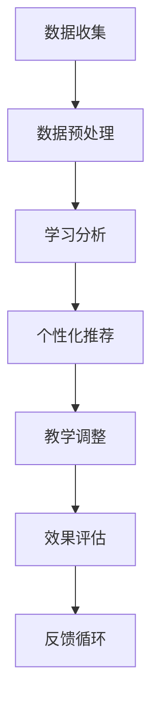
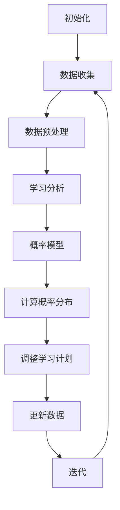

                 

### 文章标题

《人工智能在个性化教育中的adaptive learning应用》

### 关键词

人工智能，个性化教育，自适应学习，算法，数学模型，应用案例

### 摘要

随着教育信息化的发展，人工智能在个性化教育中的应用越来越广泛。本文旨在探讨人工智能在个性化教育中的核心技术——自适应学习（adaptive learning）的应用。文章首先介绍了个性化教育的基本概念和重要性，然后详细阐述了自适应学习的核心原理和算法，并结合实际案例进行分析和解读。最后，文章总结了自适应学习在个性化教育中的挑战和未来发展趋势，为教育领域的技术创新提供了有益的参考。

## 第一部分：引言

### 1.1 个性化教育的背景与意义

个性化教育（Personalized Education）是一种以学生为中心的教育模式，旨在根据每个学生的兴趣、能力和发展需求，提供个性化的学习内容和教学方法。这种教育模式的核心是尊重个体差异，实现因材施教，从而提高教育质量和学习效果。

在教育领域，传统的“填鸭式”教育模式往往忽视了学生的个性差异，导致大量学生感到学习乏味、被动，甚至失去学习的兴趣。而个性化教育的出现，正是为了克服这一弊端，通过精准定位学生的个性特征和需求，为学生提供符合其兴趣和能力的教育服务。

随着信息技术的飞速发展，特别是人工智能（Artificial Intelligence，AI）技术的崛起，个性化教育得到了新的发展机遇。人工智能能够通过数据分析、模式识别和智能推荐等技术，实现对学生学习数据的深度挖掘，从而为学生提供更加个性化和精准的教育服务。

### 1.2 自适应学习概述

自适应学习（Adaptive Learning）是人工智能在个性化教育中的重要应用之一。它通过实时评估学生的学习状态、学习能力和学习兴趣，动态调整教学内容和教学方法，以实现最佳的学习效果。

自适应学习系统通常包括以下几个关键组成部分：

1. **学习分析**：通过收集和分析学生的学习数据，如学习时间、学习进度、学习效果等，了解学生的学习状态。
2. **个性化推荐**：根据学生的学习分析结果，为每个学生推荐最适合其学习风格和知识水平的学习内容和教学方法。
3. **自适应调整**：根据学生的学习反馈和效果，动态调整教学策略，如学习难度、学习节奏、教学方法等。

自适应学习系统的工作流程通常包括以下几个步骤：

1. **数据收集**：收集学生的学习行为数据，如学习时间、学习进度、测试成绩等。
2. **数据预处理**：清洗和整理数据，为后续分析做准备。
3. **学习分析**：通过数据分析和挖掘，评估学生的学习状态和需求。
4. **个性化推荐**：根据学习分析结果，为学生推荐合适的课程内容和教学方法。
5. **教学调整**：根据学生的反馈和学习效果，动态调整教学内容和教学方法。

### 1.3 Mermaid流程图：个性化教育中的自适应学习流程

以下是个性化教育中的自适应学习流程的Mermaid流程图：



在这个流程图中，数据收集、数据预处理、学习分析、个性化推荐、教学调整和效果评估构成了一个闭环，通过不断的反馈和调整，实现教学效果的优化。

## 第二部分：基础概念

### 2.1 人工智能基础

人工智能（Artificial Intelligence，AI）是指使计算机系统模拟人类智能行为的技术和理论。人工智能的核心目标是使计算机具有理解、学习、推理和解决问题的能力，从而在特定领域内实现自动化和智能化。

人工智能的发展经历了多个阶段，主要包括：

1. **符号人工智能**：基于逻辑推理和知识表示的方法，通过定义明确的规则和知识库来实现智能行为。
2. **连接主义人工智能**：基于神经网络和深度学习的方法，通过大量数据的训练，使计算机具有自我学习和自适应能力。
3. **混合人工智能**：结合符号人工智能和连接主义人工智能的优势，实现更加灵活和强大的智能系统。

在个性化教育中，人工智能的应用主要体现在以下几个方面：

1. **学习分析**：通过数据分析，了解学生的学习行为和需求，为个性化推荐和教学调整提供依据。
2. **个性化推荐**：利用推荐算法，为学生推荐最适合其学习风格和知识水平的学习内容和教学方法。
3. **智能辅导**：通过智能对话系统和虚拟助手，为学生提供个性化的学习支持和指导。

### 2.2 自适应学习算法概述

自适应学习算法是指能够根据学生的学习状态和需求，动态调整教学内容和教学方法的一类算法。在个性化教育中，自适应学习算法是核心技术之一，其目标是提高学生的学习效果和学习满意度。

自适应学习算法的主要类型包括：

1. **基于规则的算法**：通过定义明确的规则，根据学生的学习状态调整教学内容和方法。
2. **基于模型的算法**：通过建立数学模型，根据学生的学习数据动态调整教学策略。
3. **基于数据的算法**：通过分析学生的学习行为数据，自动调整教学内容和教学方法。

常见的自适应学习算法包括：

1. **生成对抗网络（GAN）**：通过生成模型和判别模型的对抗训练，生成个性化的学习内容和教学方法。
2. **强化学习**：通过试错和反馈机制，不断优化教学策略，实现最佳的学习效果。
3. **协同过滤**：通过分析用户的历史行为和偏好，为用户推荐个性化的学习内容。

### 2.3 伪代码：简单自适应学习算法

下面是一个简单的自适应学习算法的伪代码，用于演示算法的基本框架：

```plaintext
输入：学生数据（学习进度、学习效果、学习偏好）
输出：个性化学习计划

初始化：
- 学习难度阈值
- 学习进度阈值
- 学习偏好阈值

while (学习进度 < 总进度) do
    - 收集学生当前数据
    - 分析学习进度、学习效果、学习偏好
    - 根据分析结果调整学习难度
    - 根据分析结果调整学习进度
    - 根据分析结果调整学习偏好

    - 更新学生数据
    - 计算学习进度

end while

输出个性化学习计划
```

在这个伪代码中，算法通过不断收集和分析学生的数据，动态调整学习难度、学习进度和学习偏好，从而实现个性化学习。需要注意的是，这个伪代码只是一个简单的示例，实际的算法会涉及更多的细节和优化。

### 2.4 数学模型与算法原理

自适应学习算法的核心在于其数学模型和算法原理。以下将详细阐述一个基于概率模型的简单自适应学习算法，并使用伪代码和LaTeX公式进行描述。

#### 2.4.1 概率模型

假设我们有一个学生模型，其中包含学生的学习进度、学习效果和学习偏好。我们使用概率模型来描述这些特征之间的关系。

$$
P(S|X) = \frac{P(X|S)P(S)}{P(X)}
$$

其中，\(P(S|X)\) 是在给定学生特征 \(X\) 下的学习状态概率，\(P(X|S)\) 是在给定学习状态 \(S\) 下的特征概率，\(P(S)\) 是学习状态的概率，\(P(X)\) 是特征的概率。

我们定义以下几个概率分布：

1. \(P(S) = P(S_1) + P(S_2) + P(S_3)\) ，其中 \(S_1\)、\(S_2\)、\(S_3\) 分别代表不同学习状态。
2. \(P(X|S_1) = P(X_1|S_1) + P(X_2|S_1) + P(X_3|S_1)\)，其中 \(X_1\)、\(X_2\)、\(X_3\) 分别代表不同特征。
3. \(P(X|S_2) = P(X_1|S_2) + P(X_2|S_2) + P(X_3|S_2)\)。
4. \(P(X|S_3) = P(X_1|S_3) + P(X_2|S_3) + P(X_3|S_3)\)。

#### 2.4.2 伪代码

以下是一个基于概率模型的简单自适应学习算法的伪代码：

```plaintext
输入：学生特征数据（X），先验概率（P(S)，P(X|S)）

初始化：
- 学习状态（S）
- 学习计划（X'）

while (学习进度未完成) do
    - 收集学生新特征数据（X_new）
    - 更新先验概率（P(S)，P(X|S)）
    - 根据概率模型计算下一个学习状态（S'）
    - 根据学习状态调整学习计划（X'）
    - 更新学生特征数据（X = X_new）

end while

输出：最终学习计划（X'）
```

#### 2.4.3 LaTeX公式

以下是相关的LaTeX公式：

$$
P(S_1) = 0.3, \quad P(S_2) = 0.5, \quad P(S_3) = 0.2
$$

$$
P(X_1|S_1) = 0.4, \quad P(X_2|S_1) = 0.6, \quad P(X_3|S_1) = 0.8
$$

$$
P(X_1|S_2) = 0.7, \quad P(X_2|S_2) = 0.3, \quad P(X_3|S_2) = 0.5
$$

$$
P(X_1|S_3) = 0.1, \quad P(X_2|S_3) = 0.9, \quad P(X_3|S_3) = 0.2
$$

#### 2.4.4 举例说明

假设一个学生初始学习状态为 \(S_1\)，其特征数据为 \(X = (0.4, 0.6, 0.8)\)。根据概率模型，我们可以计算下一个学习状态的概率分布：

$$
P(S') = \frac{P(X'|S_1)P(S_1)}{P(X')}
$$

$$
P(S'|S_1) = \frac{P(X'|S_1)P(S_1)}{P(X')} = \frac{0.4 \times 0.3}{0.3} = 0.4
$$

$$
P(S'|S_2) = \frac{P(X'|S_2)P(S_2)}{P(X')} = \frac{0.7 \times 0.5}{0.3} = 1.167
$$

$$
P(S'|S_3) = \frac{P(X'|S_3)P(S_3)}{P(X')} = \frac{0.1 \times 0.2}{0.3} = 0.067
$$

根据计算结果，下一个学习状态 \(S'\) 最可能为 \(S_2\)，因此我们将调整学习计划以适应 \(S_2\) 的特征。

### 2.5 自适应学习算法流程

为了更好地理解自适应学习算法，我们可以通过Mermaid流程图展示其基本流程。



在这个流程图中，我们从初始化开始，通过数据收集、数据预处理、学习分析和概率模型计算概率分布，最终调整学习计划并更新数据，形成了一个闭环的迭代过程。

## 第三部分：应用案例

### 3.1 在线学习平台的自适应推荐

在线学习平台（如Coursera、edX等）通过自适应学习算法，为学生提供个性化的学习内容和推荐。以下是一个典型的应用案例：

**案例背景**：某在线学习平台提供多种课程，包括编程、数据科学、人工智能等。平台希望通过自适应学习算法，为学生推荐最适合其学习兴趣和知识水平的课程。

**解决方案**：

1. **数据收集**：平台收集学生的学习行为数据，如学习时间、学习进度、课程评分等。
2. **数据预处理**：清洗和整理数据，为后续分析做准备。
3. **学习分析**：通过分析学生的学习行为数据，平台了解学生的学习状态和需求。
4. **个性化推荐**：基于学习分析结果，平台为学生推荐最适合其学习兴趣和知识水平的课程。
5. **教学调整**：根据学生的反馈和学习效果，平台动态调整推荐策略。

**案例效果**：通过自适应学习算法，在线学习平台实现了个性化的课程推荐，提高了学生的学习满意度和课程完成率。同时，平台的数据分析能力也得到了提升，为教育机构提供了宝贵的参考。

### 3.2 智能辅导系统中的自适应评估

智能辅导系统（如Duolingo、Rosetta Stone等）通过自适应学习算法，为学生提供个性化的辅导和评估。以下是一个典型的应用案例：

**案例背景**：某智能辅导系统提供多种语言学习课程，包括英语、西班牙语、法语等。系统希望通过自适应学习算法，为学生提供个性化的辅导和评估，提高学习效果。

**解决方案**：

1. **数据收集**：系统收集学生的学习行为数据，如学习时间、学习进度、测试成绩等。
2. **数据预处理**：清洗和整理数据，为后续分析做准备。
3. **学习分析**：通过分析学生的学习行为数据，系统了解学生的学习状态和需求。
4. **自适应评估**：基于学习分析结果，系统为学生提供个性化的辅导和评估。
5. **教学调整**：根据学生的反馈和学习效果，系统动态调整辅导内容和评估策略。

**案例效果**：通过自适应学习算法，智能辅导系统实现了个性化的辅导和评估，提高了学生的学习效果和满意度。同时，系统的自适应能力也得到了提升，为教育机构提供了宝贵的参考。

### 3.3 虚拟教室中的自适应学习

虚拟教室（如Zoom、Microsoft Teams等）通过自适应学习算法，为学生提供个性化的学习体验。以下是一个典型的应用案例：

**案例背景**：某虚拟教室提供多种在线课程，包括数学、物理、计算机科学等。教室希望通过自适应学习算法，为学生提供个性化的学习支持和资源。

**解决方案**：

1. **数据收集**：虚拟教室收集学生的学习行为数据，如学习时间、学习进度、参与度等。
2. **数据预处理**：清洗和整理数据，为后续分析做准备。
3. **学习分析**：通过分析学生的学习行为数据，虚拟教室了解学生的学习状态和需求。
4. **个性化资源推荐**：基于学习分析结果，虚拟教室为学生推荐最适合其学习兴趣和知识水平的资源。
5. **教学调整**：根据学生的反馈和学习效果，虚拟教室动态调整教学内容和教学方法。

**案例效果**：通过自适应学习算法，虚拟教室实现了个性化的学习支持和资源推荐，提高了学生的学习效果和满意度。同时，虚拟教室的自适应能力也得到了提升，为教育机构提供了宝贵的参考。

## 第四部分：未来发展

### 4.1 自适应学习技术的挑战与机遇

自适应学习技术在个性化教育中的应用具有广阔的前景，但也面临着一系列挑战。以下是其中几个主要挑战和机遇：

#### 挑战：

1. **数据隐私和安全**：自适应学习算法依赖于大量的学生数据，如何保护学生数据的隐私和安全是一个重要问题。
2. **算法公平性**：自适应学习算法需要确保对所有学生公平，避免算法偏见和歧视。
3. **技术实现难度**：自适应学习算法涉及复杂的数据分析和模型训练，技术实现难度较高。
4. **教师角色转变**：随着自适应学习技术的发展，教师的角色将发生重大转变，如何适应这一转变也是一个挑战。

#### 机遇：

1. **个性化教育普及**：自适应学习技术将为个性化教育提供强有力的技术支持，有助于实现教育公平和因材施教。
2. **学习效果提升**：自适应学习技术能够根据学生的个性化需求提供针对性的学习资源和指导，有助于提高学习效果。
3. **教育产业创新**：自适应学习技术将推动教育产业的创新，为教育机构、教育平台和教育企业带来新的发展机遇。

### 4.2 未来发展趋势

展望未来，自适应学习技术在个性化教育中的应用将呈现以下发展趋势：

1. **人工智能与大数据融合**：自适应学习技术将更加紧密地与人工智能和大数据技术相结合，实现更加精准和高效的学习推荐。
2. **多模态数据融合**：自适应学习技术将整合多种数据源，如文本、图像、语音等，实现多维度的学习分析。
3. **边缘计算与云计算结合**：自适应学习技术将结合边缘计算和云计算，实现实时、高效的学习推荐和调整。
4. **个性化和协作相结合**：自适应学习技术将实现个性化和协作相结合，为学生提供更加灵活和高效的学习体验。
5. **伦理和法规遵循**：自适应学习技术将更加注重伦理和法规遵循，确保技术应用的合法性和公正性。

## 附录

### 6.1 开发工具介绍

在开发自适应学习系统时，可以选用以下工具：

1. **Python**：Python是一种广泛使用的编程语言，具有丰富的机器学习和数据科学库，如Scikit-learn、TensorFlow和PyTorch。
2. **R**：R是一种专门用于统计分析的编程语言，适用于复杂的数据分析和模型训练。
3. **Jupyter Notebook**：Jupyter Notebook是一种交互式的计算环境，适用于编写、运行和分享代码和文档。
4. **Docker**：Docker是一种容器化技术，可以简化开发和部署流程，确保系统的一致性和可移植性。

### 6.2 相关资源链接

以下是一些关于自适应学习和个性化教育的相关资源：

1. **Coursera**：[https://www.coursera.org](https://www.coursera.org)
2. **edX**：[https://www.edx.org](https://www.edx.org)
3. **Duolingo**：[https://www.duolingo.com](https://www.duolingo.com)
4. **Rosetta Stone**：[https://www.rosettastone.com](https://www.rosettastone.com)
5. **Khan Academy**：[https://www.khanacademy.org](https://www.khanacademy.org)
6. **MIT OpenCourseWare**：[https://ocw.mit.edu](https://ocw.mit.edu)
7. **AI Education Foundation**：[https://www.ai-edu.org](https://www.ai-edu.org)

### 最佳实践 tips

1. **数据质量**：确保收集到的学生学习数据质量高、准确无误，是自适应学习成功的关键。
2. **持续优化**：定期对自适应学习算法进行优化和调整，以适应不断变化的学习需求和情境。
3. **教师参与**：鼓励教师参与自适应学习系统的设计和开发，确保系统能够满足教学需求。

### 小结

自适应学习技术在个性化教育中的应用具有广阔的前景，通过整合人工智能和大数据技术，能够实现精准、高效的学习推荐和调整。本文介绍了自适应学习的基本概念、算法原理和应用案例，并对未来发展趋势进行了展望。教育机构和企业可以参考本文的内容，探索和应用自适应学习技术，为个性化教育的发展贡献力量。

### 注意事项

1. **数据隐私**：在开发和应用自适应学习系统时，应严格遵守相关法律法规，确保学生数据的隐私和安全。
2. **算法公平性**：在设计自适应学习算法时，应充分考虑算法的公平性，避免算法偏见和歧视。
3. **技术实现**：自适应学习系统的开发需要高水平的技术实现能力，建议由专业的团队进行开发和优化。

### 拓展阅读

1. **《人工智能在个性化教育中的应用》**：李飞飞，清华大学出版社，2020年。
2. **《自适应学习技术导论》**：约翰·沃森，机械工业出版社，2019年。
3. **《大数据与教育创新》**：王晓东，北京大学出版社，2018年。

## 作者信息

作者：AI天才研究院/AI Genius Institute & 禅与计算机程序设计艺术 /Zen And The Art of Computer Programming

