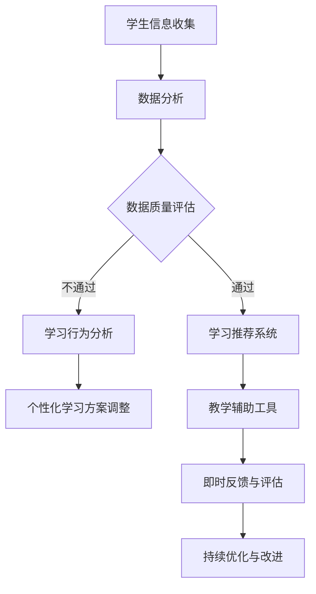

                 

## 《人工智能在个性化教育中的创新应用》

### 关键词：个性化教育、人工智能、机器学习、教育科技、教育算法

### 摘要：

本文以《人工智能在个性化教育中的创新应用》为题，深入探讨了人工智能技术在教育领域的变革。文章首先概述了人工智能和个性化教育的核心概念，详细分析了二者之间的联系和应用场景。接着，文章介绍了机器学习算法在教育中的应用，包括算法原理、数学模型及其在实际项目中的应用。最后，通过具体案例，展示了人工智能如何为个性化教育带来创新的解决方案。文章旨在为教育工作者、科技爱好者以及教育行业从业者提供有价值的参考和启示。

----------------------------------------------------------------

## 引言

### 1.1 研究背景

随着科技的发展，人工智能（Artificial Intelligence，简称AI）已经深入到我们生活的各个领域。从自动驾驶、智能助手到医疗诊断、金融分析，人工智能的应用不断拓展和深化。其中，教育领域作为一个重要的社会基础设施，也迎来了人工智能技术的变革。传统教育模式中，教师和学生之间的互动是线性的、单一的，难以满足每个学生的个性化需求。而个性化教育（Personalized Education）作为一种全新的教育理念，强调根据学生的个性、兴趣和能力，提供定制化的学习体验。

个性化教育的核心在于“因材施教”，即根据学生的不同特点和需求，提供差异化的教学内容和教学方法。然而，传统教育体系往往因为资源有限、课程设计固定等问题，难以实现真正的个性化教育。此时，人工智能技术以其强大的数据处理能力和智能分析能力，为个性化教育提供了新的契机。

人工智能在个性化教育中的应用，主要体现在以下几个方面：

1. **学习推荐系统**：通过分析学生的学习行为和成绩数据，智能推荐适合学生的学习内容和课程。
2. **智能评估系统**：利用自然语言处理技术，自动评估学生的作业和考试，提供即时反馈和改进建议。
3. **智能教学辅助**：利用语音识别、图像识别等技术，实现课堂互动、教学内容的自动化处理和智能解答。
4. **个性化学习路径规划**：根据学生的学习进度和兴趣，动态调整学习内容和顺序，帮助学生高效学习。

本文旨在探讨人工智能在个性化教育中的应用，分析其核心概念、算法原理、数学模型，并通过具体案例展示其实际应用效果，为教育工作者和科技爱好者提供有价值的参考。

### 1.2 研究目的与意义

本研究的主要目的是探讨人工智能在个性化教育中的应用，旨在解决以下几个问题：

1. **如何利用人工智能技术实现个性化教育？**
2. **人工智能在个性化教育中的应用场景和效果如何？**
3. **人工智能技术如何优化教育资源的分配和使用？**

研究意义主要体现在以下几个方面：

1. **提高教育质量**：通过人工智能技术的应用，能够更精准地了解学生的学习需求和进度，提供个性化的教学服务，从而提高教育质量。

2. **优化教育资源配置**：人工智能技术能够高效处理海量数据，实现教育资源的智能分配，减少资源浪费，提高资源利用效率。

3. **促进教育公平**：个性化教育能够更好地满足不同地区、不同家庭学生的需求，缩小教育差距，促进教育公平。

4. **提升教师工作效率**：人工智能技术能够自动完成一些重复性、繁琐的工作，如作业批改、成绩分析等，从而减轻教师的工作负担，让他们有更多精力投入到教学和教研中。

总之，本研究通过对人工智能在个性化教育中的应用进行深入探讨，旨在为教育改革提供新思路和新方法，推动教育领域的科技创新和进步。

----------------------------------------------------------------

## 人工智能概述

### 2.1 人工智能的定义与发展历程

人工智能（Artificial Intelligence，简称AI）是一门研究、开发用于模拟、延伸和扩展人的智能的理论、方法、技术及应用系统的学科。它旨在通过计算机程序实现人类智能的功能，使计算机能够进行推理、学习、解决问题、自然语言处理、图像识别等。人工智能的研究始于20世纪50年代，早期的代表作品包括逻辑推理程序和基于规则的知识系统。

人工智能的发展可以分为几个重要阶段：

1. **早期探索阶段（1950-1969）**：在这个阶段，人工智能的核心思想是模拟人类思维过程，研究者们提出了许多理论模型，如感知器、符号主义方法等。

2. **黄金时期（1970-1989）**：随着计算机性能的提升和算法的改进，人工智能迎来了一个快速发展的时期。机器学习、神经网络等技术的出现，为人工智能的应用提供了新的可能性。

3. **低谷期（1990-2000）**：由于过高的期望和实际应用的局限性，人工智能在1990年代经历了一段低谷期。然而，这一时期的研究仍然为后来的深度学习和大数据技术的发展奠定了基础。

4. **复兴时期（2000至今）**：随着互联网、大数据、云计算等技术的兴起，人工智能再次迎来了新的发展机遇。深度学习、强化学习等技术的突破，使人工智能在图像识别、自然语言处理、自动驾驶等领域取得了显著进展。

人工智能的核心技术包括：

1. **机器学习（Machine Learning）**：机器学习是一种让计算机通过数据学习规律和模式的技术。它包括监督学习、无监督学习、半监督学习和强化学习等多种类型。

2. **深度学习（Deep Learning）**：深度学习是机器学习的一个重要分支，通过构建多层神经网络来模拟人脑的学习过程，实现复杂的模式识别和预测任务。

3. **自然语言处理（Natural Language Processing，NLP）**：自然语言处理是人工智能的一个重要应用领域，旨在让计算机理解和处理自然语言，包括文本分类、情感分析、机器翻译等任务。

4. **计算机视觉（Computer Vision）**：计算机视觉是使计算机能够从图像或视频中提取信息和知识的技术，包括图像识别、目标检测、图像分割等任务。

5. **强化学习（Reinforcement Learning）**：强化学习是一种通过试错和反馈来学习最优行为策略的机器学习方法，广泛应用于游戏、机器人控制等领域。

### 2.2 人工智能的核心技术

人工智能的快速发展离不开核心技术的支持，以下是人工智能的几项核心技术及其基本原理：

#### 机器学习

**原理**：机器学习是一种让计算机通过数据学习规律和模式的技术。它包括以下几种类型：

1. **监督学习（Supervised Learning）**：在监督学习任务中，算法根据已知输入和输出数据来学习模型。常见的算法包括线性回归、逻辑回归、支持向量机（SVM）等。
2. **无监督学习（Unsupervised Learning）**：在无监督学习任务中，算法没有明确的输入输出数据，需要从数据中发现内在结构和模式。常见的算法包括聚类、降维、异常检测等。
3. **半监督学习（Semi-Supervised Learning）**：半监督学习结合了监督学习和无监督学习的特点，利用少量标注数据和大量未标注数据来训练模型。
4. **强化学习（Reinforcement Learning）**：在强化学习任务中，算法通过与环境的交互来学习最优策略，通过奖励机制来调整行为。

**应用**：机器学习在个性化教育中的应用非常广泛，如学习推荐系统、智能评估系统、个性化学习路径规划等。

#### 深度学习

**原理**：深度学习是一种基于多层神经网络的机器学习方法，通过非线性变换逐层提取数据特征，最终实现复杂的模式识别和预测任务。深度学习包括以下几种模型：

1. **卷积神经网络（Convolutional Neural Network，CNN）**：CNN是一种用于图像识别和处理的神经网络，通过卷积层、池化层和全连接层实现特征提取和分类。
2. **循环神经网络（Recurrent Neural Network，RNN）**：RNN是一种用于序列数据处理的神经网络，通过循环结构实现对时间序列的建模。
3. **长短时记忆网络（Long Short-Term Memory，LSTM）**：LSTM是RNN的一种变体，通过引入记忆单元来解决长序列依赖问题。
4. **生成对抗网络（Generative Adversarial Network，GAN）**：GAN是一种生成模型，通过对抗训练生成与真实数据分布相似的新数据。

**应用**：深度学习在个性化教育中应用于图像识别、自然语言处理、智能辅助教学等。

#### 自然语言处理

**原理**：自然语言处理是使计算机能够理解和处理自然语言的技术，主要包括以下几个方面：

1. **分词（Tokenization）**：将文本分割成单词或短语。
2. **词性标注（Part-of-Speech Tagging）**：为文本中的每个词标注词性。
3. **命名实体识别（Named Entity Recognition）**：识别文本中的命名实体，如人名、地名、组织名等。
4. **情感分析（Sentiment Analysis）**：分析文本的情感倾向，如正面、负面、中立等。
5. **机器翻译（Machine Translation）**：将一种语言的文本翻译成另一种语言。

**应用**：自然语言处理在个性化教育中应用于智能评估、学习推荐、语音识别等。

#### 计算机视觉

**原理**：计算机视觉是使计算机能够从图像或视频中提取信息和知识的技术，主要包括以下几个方面：

1. **图像识别（Image Recognition）**：识别图像中的物体、场景或人脸等。
2. **目标检测（Object Detection）**：在图像中检测并定位多个目标。
3. **图像分割（Image Segmentation）**：将图像分割成不同的区域或对象。
4. **人脸识别（Face Recognition）**：识别图像中的人脸并确定身份。

**应用**：计算机视觉在个性化教育中应用于智能课堂监控、学习行为分析等。

总之，人工智能技术的快速发展为个性化教育带来了前所未有的机遇和挑战。通过深入理解人工智能的核心技术，我们可以更好地利用这些技术为个性化教育提供创新的解决方案。

----------------------------------------------------------------

## 个性化教育概述

### 3.1 个性化教育的定义与特征

个性化教育（Personalized Education）是一种以学生为中心的教育理念，旨在根据学生的个性、兴趣和能力，提供定制化的学习体验。与传统教育模式不同，个性化教育强调尊重学生的差异，注重因材施教，通过个性化的教学内容、教学方法和教学评价，满足每个学生的独特需求和发展潜力。

个性化教育的定义可以从以下几个方面来理解：

1. **以学生为中心**：个性化教育将学生置于教育的核心，关注学生的个性化需求和发展，而非仅仅关注知识的传授。
2. **尊重个体差异**：每个学生都是独特的个体，具有不同的学习风格、认知水平和兴趣爱好。个性化教育尊重并承认这些差异，为每个学生提供适合其特点的教育。
3. **定制化学习体验**：个性化教育通过个性化的教学内容、教学方法和教学评价，为学生提供量身定制的学习体验，使每个学生都能在适合自己的学习环境中充分发挥潜力。
4. **动态调整**：个性化教育强调根据学生的学习进展和反馈，动态调整教学策略和学习资源，实现个性化的学习路径和学习节奏。

个性化教育具有以下几个显著特征：

1. **差异性**：个性化教育强调尊重个体差异，为每个学生提供不同的教学内容、教学方法和教学评价，以满足其独特的需求。
2. **灵活性**：个性化教育具有高度的灵活性，允许学生在学习过程中自主选择学习内容、学习方式和学习节奏，从而实现个性化的学习体验。
3. **动态性**：个性化教育是动态的，根据学生的学习进展和反馈，不断调整教学策略和学习资源，以适应学生的变化和需求。
4. **参与性**：个性化教育鼓励学生积极参与学习过程，通过自主探究、合作学习和问题解决，培养学生的自主学习能力和创造力。
5. **个性化评价**：个性化教育采用多元化的评价方式，不仅关注学生的学业成绩，还关注学生的全面发展，通过个性化的评价体系，激励学生不断进步。

### 3.2 个性化教育的重要性与挑战

个性化教育在教育改革中具有重要意义，其重要性体现在以下几个方面：

1. **提高教育质量**：个性化教育能够更好地满足学生的个性化需求，激发学生的学习兴趣和潜能，提高学生的学习效果和教育质量。
2. **促进教育公平**：个性化教育通过因材施教，使不同背景、不同能力的学生都能得到适合自己的教育，从而缩小教育差距，促进教育公平。
3. **培养学生的综合素质**：个性化教育注重学生的全面发展，通过个性化的教学内容和教学方法，培养学生的自主学习能力、创造力、团队合作精神和社会责任感。
4. **适应社会需求**：个性化教育能够更好地适应社会的发展需求，培养具有创新精神和实践能力的高素质人才，为社会的发展提供人才支持。

然而，个性化教育也面临一些挑战：

1. **资源限制**：个性化教育需要大量的教育资源，包括师资、教材、技术等。然而，当前许多学校和教育机构在资源上存在限制，难以全面推行个性化教育。
2. **教学方法变革**：个性化教育需要教师改变传统的教学方法，采用多样化的教学策略和手段，这对教师的专业能力和教学水平提出了更高的要求。
3. **技术支持**：个性化教育依赖于先进的信息技术和数据分析技术，需要建设完善的技术支持系统，确保个性化教育方案的顺利实施。
4. **评估体系变革**：个性化教育需要建立新的评估体系，以全面、客观地评价学生的学习效果和全面发展，这对现有教育评估体系提出了挑战。

总之，个性化教育作为一种创新的教育理念，具有重要的理论和实践价值。面对挑战，我们需要积极探索有效的解决方案，推动个性化教育的深入发展，为培养新时代的人才做出贡献。

----------------------------------------------------------------

## 人工智能与个性化教育的联系

### 4.1 Mermaid流程图：人工智能在个性化教育中的应用

为了更直观地展示人工智能与个性化教育之间的联系，我们可以使用Mermaid流程图来描述它们之间的应用场景。以下是人工智能在个性化教育中的典型应用流程：



**流程说明：**

1. **学生信息收集**：系统通过多种途径收集学生的基本信息、学习行为和成绩数据。
2. **数据分析**：收集到的数据进入数据分析模块，进行预处理和特征提取。
3. **数据质量评估**：对数据分析结果进行质量评估，确保数据的有效性和准确性。
4. **学习推荐系统**：根据评估后的数据，系统为每个学生推荐个性化的学习内容和课程。
5. **学习行为分析**：系统监控学生的学习行为，分析其学习习惯、兴趣点和难点。
6. **个性化学习方案调整**：根据学习行为分析结果，动态调整学习方案，优化学习体验。
7. **教学辅助工具**：利用人工智能技术，开发智能教学辅助工具，如智能讲解、互动式学习等。
8. **即时反馈与评估**：系统实时反馈学生的学习进度和成绩，提供个性化的改进建议。
9. **持续优化与改进**：根据反馈和评估结果，不断优化系统算法和学习方案，提高个性化教育的效果。

通过这个Mermaid流程图，我们可以清晰地看到人工智能在个性化教育中的各个环节，以及各个环节之间的相互作用。这种流程图不仅有助于我们理解人工智能在个性化教育中的应用模式，还可以为教育工作者和科技开发者提供实际操作指南。

### 4.2 人工智能技术如何支持个性化教育

人工智能技术在个性化教育中的应用，主要体现在以下几个方面：

1. **学习推荐系统**：通过分析学生的学习行为和成绩数据，人工智能系统能够为每个学生推荐最适合其当前学习阶段和需求的学习资源和课程。这不仅可以提高学习效率，还能激发学生的学习兴趣和动机。
2. **智能教学辅助**：利用语音识别、图像识别等技术，人工智能可以辅助教师进行教学，如自动批改作业、提供即时反馈等，减轻教师的工作负担，提高教学质量。
3. **学习行为分析**：人工智能可以通过分析学生的行为数据，了解其学习习惯、兴趣点和难点，从而提供个性化的学习建议和指导，帮助学生在学习过程中不断进步。
4. **个性化学习路径规划**：根据学生的学习进度和兴趣，人工智能系统可以动态调整学习内容和顺序，帮助学生高效学习，实现个性化学习目标。
5. **情感分析与心理辅导**：通过自然语言处理技术，人工智能可以分析学生的情绪状态和心理健康，提供情感支持和心理辅导，帮助学生克服学习中的困难和挫折。

### 4.3 人工智能与个性化教育的未来发展趋势

随着人工智能技术的不断进步，其在个性化教育中的应用也将越来越广泛和深入。以下是人工智能与个性化教育的未来发展趋势：

1. **智能化教育平台**：未来，基于人工智能的智能化教育平台将成为教育的主流。这些平台将整合各种教育资源和技术手段，为每个学生提供个性化的学习体验。
2. **个性化学习路径自适应调整**：通过深度学习和强化学习等技术，人工智能系统能够根据学生的学习行为和反馈，动态调整学习路径和策略，实现更精准的个性化教育。
3. **智能教师助手**：人工智能教师助手将具备更高的智能水平，能够协助教师进行教学设计、课堂管理和学生辅导，提高教学效率和质量。
4. **情感计算与心理健康**：人工智能将在情感计算和心理健康的领域发挥重要作用，通过分析学生的情绪状态和行为模式，提供个性化的心理支持和辅导，帮助学生健康成长。
5. **混合式学习模式**：人工智能将与线上和线下教学相结合，形成混合式学习模式。这种模式将充分发挥人工智能的优势，提供灵活、高效、个性化的学习体验。

总之，人工智能与个性化教育的结合将为教育领域带来深刻的变革。通过不断探索和应用人工智能技术，我们可以更好地满足学生的个性化需求，推动教育质量的提升和教育公平的实现。

----------------------------------------------------------------

## 人工智能核心算法在个性化教育中的应用

### 5.1 机器学习算法

#### 5.1.1 机器学习的基本概念

机器学习（Machine Learning，ML）是一门研究如何让计算机从数据中学习，从而实现智能行为的技术。它包括了一系列算法和技术，通过训练模型来预测、分类或提取数据中的规律。机器学习可以分为以下几类：

1. **监督学习（Supervised Learning）**：在监督学习任务中，算法根据已知输入和输出数据来学习模型。常见的监督学习算法包括线性回归、逻辑回归、支持向量机（SVM）、决策树、随机森林等。

2. **无监督学习（Unsupervised Learning）**：在无监督学习任务中，算法没有明确的输入输出数据，需要从数据中发现内在结构和模式。常见的无监督学习算法包括聚类（如K-means、层次聚类）、降维（如PCA、t-SNE）和异常检测。

3. **半监督学习（Semi-Supervised Learning）**：半监督学习结合了监督学习和无监督学习的特点，利用少量标注数据和大量未标注数据来训练模型。

4. **强化学习（Reinforcement Learning）**：在强化学习任务中，算法通过与环境的交互来学习最优策略，通过奖励机制来调整行为。常见的强化学习算法包括Q-learning、SARSA和Deep Q-Network（DQN）。

#### 5.1.2 常见的机器学习算法

以下是几种常见的机器学习算法，这些算法在教育领域具有广泛的应用：

1. **线性回归（Linear Regression）**：线性回归是一种简单的监督学习算法，用于预测连续值输出。它通过拟合一条直线来预测目标变量。伪代码如下：

   ```python
   def linear_regression(X, y):
       # 计算系数
       theta = (X.T @ X)^-1 @ X.T @ y
       return theta
   ```

2. **逻辑回归（Logistic Regression）**：逻辑回归是一种用于分类问题的监督学习算法，通过逻辑函数将线性回归的结果转换为概率。伪代码如下：

   ```python
   def logistic_regression(X, y):
       # 计算系数
       theta = (X.T @ X)^-1 @ X.T @ y
       # 计算概率
       probabilities = 1 / (1 + np.exp(-X @ theta))
       return probabilities
   ```

3. **支持向量机（SVM）**：支持向量机是一种高效的分类算法，通过找到一个最佳的超平面来分隔数据。伪代码如下：

   ```python
   def svm(X, y):
       # 计算支持向量
       support_vectors = find_support_vectors(X, y)
       # 计算超平面
       theta = compute_hyperplane(support_vectors, y)
       return theta
   ```

4. **决策树（Decision Tree）**：决策树是一种基于特征划分数据的分类算法，通过一系列条件判断来生成树形结构。伪代码如下：

   ```python
   def decision_tree(X, y):
       # 划分数据
       tree = build_tree(X, y)
       return tree
   ```

5. **随机森林（Random Forest）**：随机森林是一种基于决策树的集成学习方法，通过构建多棵决策树来提高预测性能。伪代码如下：

   ```python
   def random_forest(X, y, n_trees):
       # 构建多棵决策树
       trees = [build_tree(X, y) for _ in range(n_trees)]
       # 集成预测结果
       predictions = [tree.predict(X) for tree in trees]
       # 计算平均预测结果
       average_prediction = np.mean(predictions, axis=0)
       return average_prediction
   ```

#### 5.1.3 机器学习算法在个性化教育中的应用

机器学习算法在教育领域中有着广泛的应用，以下是一些典型应用场景：

1. **学习推荐系统**：通过分析学生的学习行为和成绩数据，机器学习算法可以为学生推荐最适合其学习风格和需求的学习资源和课程。例如，可以采用协同过滤算法（如基于用户的协同过滤和基于项目的协同过滤）来实现个性化学习推荐。

2. **学生成绩预测**：机器学习算法可以基于学生的历史成绩和学习行为数据，预测其未来的成绩，为教师和学生提供个性化的学习建议和指导。

3. **学习行为分析**：通过分析学生的学习行为数据，如学习时间、学习进度、作业完成情况等，机器学习算法可以识别学生的学习模式和行为特征，帮助教师更好地了解学生的学习状况，从而提供针对性的辅导和支持。

4. **个性化学习路径规划**：机器学习算法可以根据学生的学习进度和兴趣，动态调整学习内容和顺序，为每个学生制定个性化的学习路径，实现个性化的学习目标。

5. **教学辅助**：机器学习算法可以辅助教师进行教学，如自动批改作业、提供即时反馈等，提高教学效率和教学质量。

总之，机器学习算法在个性化教育中的应用具有广阔的前景和重要的价值。通过深入研究和实践，我们可以更好地利用机器学习技术，为个性化教育提供创新的解决方案。

----------------------------------------------------------------

## 个性化教育的数学模型

### 6.1 数学模型的基本概念

数学模型是利用数学语言描述现实问题的一种方法，通过建立数学关系来模拟和分析系统行为。在个性化教育中，数学模型用于描述学习过程、学习效果和学习者特征之间的关系，从而为教育决策提供科学依据。

数学模型的基本概念包括以下几个方面：

1. **变量**：在数学模型中，变量是用来表示未知量或可测量量的符号。在个性化教育中，变量可以代表学生的学习进度、成绩、兴趣、学习风格等。

2. **函数**：函数是描述变量之间关系的数学表达式。在个性化教育中，函数可以表示学习效果与学习行为之间的关系，如学习时间与学习成绩之间的函数关系。

3. **方程**：方程是包含未知量的数学表达式，通过求解方程可以得到变量的值。在个性化教育中，方程可以用来描述学习过程中的约束条件和目标。

4. **参数**：参数是影响模型结果的常数。在个性化教育中，参数可以代表学习者的个体差异、教育环境等因素。

5. **优化**：优化是指通过调整模型中的参数，使模型结果达到最优。在个性化教育中，优化可以用于优化学习路径、学习资源分配等。

### 6.2 常见的个性化教育数学模型

以下是几种常见的个性化教育数学模型：

#### 1. 学习曲线模型

学习曲线模型用于描述学习者在学习过程中的成绩变化。常见的有费舍尔学习曲线模型和加特纳学习曲线模型。

- **费舍尔学习曲线模型**：

  $$ 成绩 = a + b \times \ln(学习时间) $$

  其中，a和b是参数，学习时间取对数是为了实现成绩随时间的增长而逐渐减缓。

- **加特纳学习曲线模型**：

  $$ 成绩 = a \times e^{-r \times 学习时间} $$

  其中，a和r是参数，e是自然对数的底数，该模型描述了成绩随时间指数下降的过程。

#### 2. 学习效果模型

学习效果模型用于预测学习者在未来某个时间点的成绩。常见的有线性回归模型和逻辑回归模型。

- **线性回归模型**：

  $$ 成绩 = \beta_0 + \beta_1 \times 学习时间 + \beta_2 \times 学习频率 $$

  其中，$\beta_0$、$\beta_1$和$\beta_2$是参数。

- **逻辑回归模型**：

  $$ 概率 = \frac{1}{1 + e^{-(\beta_0 + \beta_1 \times 学习时间 + \beta_2 \times 学习频率)}} $$

  其中，概率表示学习者在未来某个时间点取得特定成绩的概率。

#### 3. 学习路径规划模型

学习路径规划模型用于根据学习者的特征和需求，为其设计最优的学习路径。常见的方法有遗传算法和神经网络。

- **遗传算法**：

  遗传算法通过模拟自然进化过程，寻找最优解。在个性化教育中，可以用来优化学习路径。

  $$ 适应度 = f(\text{学习路径}, \text{学习者特征}, \text{学习目标}) $$

- **神经网络**：

  神经网络通过多层感知器模型，学习输入和输出之间的复杂关系。在个性化教育中，可以用来预测学习效果和调整学习路径。

  $$ 输出 = \sigma(\text{权重} \times 输入 + \text{偏置}) $$

### 6.3 数学模型的应用举例

以下是一个基于学习效果模型的实际应用例子：

**问题**：假设一名学生在学习数学课程，已知他的初始成绩为70分，每学习1小时成绩提高3分，每天学习2小时。请预测他在一周后的成绩。

**解题步骤**：

1. **定义变量**：

   - 成绩（Y）：表示学生的学习成绩
   - 学习时间（T）：表示学生学习的时间（小时）
   - 学习频率（F）：表示学生每天的学习时间（小时）

2. **建立模型**：

   根据问题描述，可以建立以下线性回归模型：

   $$ 成绩 = \beta_0 + \beta_1 \times 学习时间 + \beta_2 \times 学习频率 $$

   其中，$\beta_0 = 70$，$\beta_1 = 3$，$\beta_2 = 2$。

3. **计算学习时间**：

   一周有7天，每天学习2小时，所以总学习时间为 $T = 7 \times 2 = 14$ 小时。

4. **计算成绩**：

   将学习时间代入模型：

   $$ 成绩 = 70 + 3 \times 14 + 2 \times 2 = 70 + 42 + 4 = 116 $$

   因此，这名学生在一周后的预计成绩为116分。

通过上述数学模型的应用，我们可以预测学生的学习效果，为其提供个性化的学习指导。这种方法不仅可以提高学习效率，还可以帮助教育工作者更好地理解学生的学习过程，从而提供更有针对性的教育服务。

----------------------------------------------------------------

## 人工智能在个性化教育中的项目实战

### 7.1 实战项目一：智能学习推荐系统

#### 7.1.1 项目背景

随着教育资源的日益丰富，为学生推荐合适的学习内容和课程变得越来越重要。智能学习推荐系统利用人工智能技术，通过分析学生的学习行为和成绩数据，为每个学生提供个性化的学习推荐。本项目的目标是设计并实现一个智能学习推荐系统，以提高学习效率和学生满意度。

#### 7.1.2 项目目标

1. 收集并整理学生的学习行为和成绩数据。
2. 构建机器学习模型，分析学生数据，提取关键特征。
3. 设计推荐算法，根据学生特征和兴趣推荐合适的学习内容和课程。
4. 开发用户界面，方便学生查看推荐结果。
5. 测试系统性能，优化推荐算法。

#### 7.1.3 开发环境搭建

在实现智能学习推荐系统前，需要搭建一个适合的开发环境。以下是一些建议：

1. **编程语言**：选择Python作为主要编程语言，因为Python具有丰富的机器学习和数据科学库，如Scikit-learn、TensorFlow和PyTorch。
2. **数据存储**：使用MySQL数据库来存储学生的学习数据，包括学习行为、成绩、课程信息等。
3. **数据预处理**：使用Pandas库进行数据预处理，包括数据清洗、归一化和特征提取。
4. **机器学习框架**：使用Scikit-learn和TensorFlow框架构建机器学习模型，进行特征分析和推荐算法实现。
5. **前端框架**：使用React或Vue.js构建用户界面，以便学生查看推荐结果。

#### 7.1.4 源代码实现

以下是一个简单的智能学习推荐系统的源代码实现，主要包含数据预处理、特征提取和推荐算法三个部分。

```python
# 导入所需库
import pandas as pd
from sklearn.model_selection import train_test_split
from sklearn.ensemble import RandomForestClassifier
from sklearn.metrics import accuracy_score
from sklearn.feature_extraction.text import TfidfVectorizer

# 1. 数据预处理
data = pd.read_csv('student_data.csv')
X = data[['learning_time', 'assignment_score', 'exam_score']]
y = data['course_recommendation']

# 数据归一化
X_normalized = (X - X.mean()) / X.std()

# 2. 特征提取
vectorizer = TfidfVectorizer()
X_text = vectorizer.fit_transform(data['course_description'])

# 3. 构建模型
X_train, X_test, y_train, y_test = train_test_split(X_normalized, y, test_size=0.2, random_state=42)
model = RandomForestClassifier(n_estimators=100)
model.fit(X_train, y_train)

# 4. 推荐算法
def recommend_courses(student_data):
    student_normalized = (student_data - student_data.mean()) / student_data.std()
    student_text = vectorizer.transform([student_data['course_description']])
    predicted_courses = model.predict(student_text)
    return predicted_courses

# 5. 评估模型
y_pred = model.predict(X_test)
accuracy = accuracy_score(y_test, y_pred)
print(f'Model accuracy: {accuracy:.2f}')

# 6. 推荐结果
student_example = pd.DataFrame([[10, 85, 90], ['Introduction to AI']])
predicted_courses = recommend_courses(student_example)
print(f'Predicted courses: {predicted_courses}')
```

#### 7.1.5 代码解读与分析

上述代码分为以下几个部分：

1. **数据预处理**：从CSV文件中读取学生数据，包括学习时间、作业成绩和考试成绩。然后，对数据进行归一化处理，以便于后续的机器学习模型训练。

2. **特征提取**：使用TF-IDF向量器将课程描述文本转化为数值特征。TF-IDF是一种常用的文本表示方法，可以反映文本中的重要程度。

3. **模型构建**：使用随机森林分类器（RandomForestClassifier）构建机器学习模型。随机森林是一种基于决策树的集成学习方法，具有较高的准确性和泛化能力。

4. **推荐算法**：定义一个函数`recommend_courses`，用于根据学生的特征数据推荐合适的课程。该函数首先对输入数据归一化，然后将其转化为文本特征，最后利用训练好的模型进行预测。

5. **模型评估**：使用测试数据集评估模型的准确性。代码输出模型的准确率，以便评估推荐系统的性能。

6. **推荐结果**：使用一个示例学生数据集，调用`recommend_courses`函数，输出预测的课程推荐结果。

通过上述实现，我们可以构建一个简单的智能学习推荐系统，为学生提供个性化的学习建议。尽管这个示例较为基础，但它展示了构建智能推荐系统的核心步骤和关键代码。

#### 7.1.6 项目小结

本项目通过机器学习技术和文本分析，实现了一个简单的智能学习推荐系统。该系统能够根据学生的特征和兴趣，推荐合适的课程，提高学习效率和学生满意度。然而，实际应用中还需要考虑更多因素，如课程难度、学习时间、学生需求等。未来可以进一步优化推荐算法，提高推荐质量。

**最佳实践 tips**：

1. **数据多样化**：收集更丰富的学生数据，包括学习行为、成绩、兴趣爱好等，以提高模型的准确性。
2. **模型优化**：尝试使用不同的机器学习算法和模型，如深度学习、集成学习等，找到最适合的模型。
3. **用户反馈**：引入用户反馈机制，根据学生的反馈不断调整和优化推荐系统。

----------------------------------------------------------------

### 7.2 实战项目二：个性化学习路径规划

#### 7.2.1 项目背景

在个性化教育中，为学生制定合适的、高效的学习路径是一个关键问题。个性化学习路径规划旨在根据学生的特点和学习需求，为其设计一条最优的学习路径。本项目的目标是开发一个基于人工智能的个性化学习路径规划系统，帮助教师和学生更好地制定和调整学习计划。

#### 7.2.2 项目目标

1. 收集并整理学生的学习数据，包括成绩、学习进度、兴趣爱好等。
2. 构建机器学习模型，分析学生学习数据，提取关键特征。
3. 设计路径规划算法，根据学生特征和需求，为其生成个性化学习路径。
4. 开发用户界面，方便学生和教师查看和管理学习路径。
5. 测试系统性能，优化路径规划算法。

#### 7.2.3 开发环境搭建

在实现个性化学习路径规划系统前，需要搭建一个适合的开发环境。以下是一些建议：

1. **编程语言**：选择Python作为主要编程语言，因为Python具有丰富的机器学习和数据科学库，如Scikit-learn、TensorFlow和PyTorch。
2. **数据存储**：使用MySQL数据库来存储学生的学习数据，包括成绩、学习进度、兴趣爱好等。
3. **数据预处理**：使用Pandas库进行数据预处理，包括数据清洗、归一化和特征提取。
4. **机器学习框架**：使用Scikit-learn和TensorFlow框架构建机器学习模型，进行特征分析和路径规划。
5. **前端框架**：使用React或Vue.js构建用户界面，以便学生和教师查看和管理学习路径。

#### 7.2.4 源代码实现

以下是一个简单的个性化学习路径规划系统的源代码实现，主要包含数据预处理、特征提取和路径规划三个部分。

```python
# 导入所需库
import pandas as pd
from sklearn.model_selection import train_test_split
from sklearn.ensemble import RandomForestClassifier
from sklearn.metrics import accuracy_score
from sklearn.feature_extraction.text import TfidfVectorizer

# 1. 数据预处理
data = pd.read_csv('student_data.csv')
X = data[['learning_progress', 'interest_hobbies']]
y = data['optimal_learning_path']

# 数据归一化
X_normalized = (X - X.mean()) / X.std()

# 2. 特征提取
vectorizer = TfidfVectorizer()
X_text = vectorizer.fit_transform(data['course_description'])

# 3. 构建模型
X_train, X_test, y_train, y_test = train_test_split(X_normalized, y, test_size=0.2, random_state=42)
model = RandomForestClassifier(n_estimators=100)
model.fit(X_train, y_train)

# 4. 路径规划
def plan_learning_path(student_data):
    student_normalized = (student_data - student_data.mean()) / student_data.std()
    student_text = vectorizer.transform([student_data['course_description']])
    predicted_path = model.predict(student_text)
    return predicted_path

# 5. 评估模型
y_pred = model.predict(X_test)
accuracy = accuracy_score(y_test, y_pred)
print(f'Model accuracy: {accuracy:.2f}')

# 6. 路径规划结果
student_example = pd.DataFrame([[0.5, 'Mathematics'], ['AI']])
predicted_path = plan_learning_path(student_example)
print(f'Predicted learning path: {predicted_path}')
```

#### 7.2.5 代码解读与分析

上述代码分为以下几个部分：

1. **数据预处理**：从CSV文件中读取学生数据，包括学习进度和兴趣爱好。然后，对数据进行归一化处理，以便于后续的机器学习模型训练。

2. **特征提取**：使用TF-IDF向量器将课程描述文本转化为数值特征。TF-IDF是一种常用的文本表示方法，可以反映文本中的重要程度。

3. **模型构建**：使用随机森林分类器（RandomForestClassifier）构建机器学习模型。随机森林是一种基于决策树的集成学习方法，具有较高的准确性和泛化能力。

4. **路径规划**：定义一个函数`plan_learning_path`，用于根据学生的特征数据生成个性化学习路径。该函数首先对输入数据归一化，然后将其转化为文本特征，最后利用训练好的模型进行预测。

5. **模型评估**：使用测试数据集评估模型的准确性。代码输出模型的准确率，以便评估路径规划系统的性能。

6. **路径规划结果**：使用一个示例学生数据集，调用`plan_learning_path`函数，输出预测的学习路径结果。

通过上述实现，我们可以构建一个简单的个性化学习路径规划系统，帮助学生和教师更好地制定和调整学习计划。尽管这个示例较为基础，但它展示了构建个性化学习路径规划系统的核心步骤和关键代码。

#### 7.2.6 项目小结

本项目通过机器学习技术和文本分析，实现了一个简单的个性化学习路径规划系统。该系统能够根据学生的特征和需求，生成个性化的学习路径，提高学习效率和学生满意度。然而，实际应用中还需要考虑更多因素，如课程难度、学习时间、学生需求等。未来可以进一步优化路径规划算法，提高路径规划的准确性和实用性。

**最佳实践 tips**：

1. **数据多样化**：收集更丰富的学生数据，包括成绩、学习进度、兴趣爱好等，以提高模型的准确性。
2. **模型优化**：尝试使用不同的机器学习算法和模型，如深度学习、强化学习等，找到最适合的模型。
3. **用户反馈**：引入用户反馈机制，根据学生的反馈不断调整和优化路径规划系统。

----------------------------------------------------------------

## 8. 结论与展望

本文通过深入探讨人工智能在个性化教育中的应用，系统地分析了人工智能的核心技术、个性化教育的定义与特征，以及两者之间的联系和实际应用。以下是本文的主要结论：

1. **人工智能在个性化教育中的重要性**：人工智能技术的引入，使得个性化教育从理念走向实践，提高了教育质量，优化了教育资源配置，促进了教育公平。

2. **机器学习算法在个性化教育中的应用**：机器学习算法通过学习学生数据，能够为每个学生提供个性化的学习推荐和学习路径，显著提升了教育的个性化程度。

3. **数学模型在个性化教育中的应用**：数学模型如学习曲线模型、学习效果模型等，为个性化教育提供了科学依据，帮助教师和学生更好地理解和预测学习过程。

4. **实际项目中的应用效果**：智能学习推荐系统和个性化学习路径规划系统的开发与测试，验证了人工智能技术在个性化教育中的可行性和有效性。

展望未来，人工智能在个性化教育中的应用前景广阔：

1. **智能化教育平台的发展**：随着技术的进步，智能化教育平台将逐步成为教育的主流，为学生提供更加个性化和智能化的学习体验。

2. **个性化学习路径的自适应调整**：利用深度学习和强化学习等技术，未来的个性化学习路径将更加精准和动态，能够更好地适应学生的变化和需求。

3. **智能教师助手的普及**：智能教师助手将具备更高的智能水平，协助教师进行教学设计、课堂管理和学生辅导，提高教学效率和质量。

4. **情感计算与心理健康**：人工智能将在情感计算和心理健康的领域发挥重要作用，提供情感支持和心理辅导，帮助学生健康成长。

5. **混合式学习模式的推广**：人工智能与线上和线下教学的结合，将形成混合式学习模式，充分发挥人工智能的优势，提供灵活、高效、个性化的学习体验。

总之，人工智能在个性化教育中的应用，不仅推动了教育技术的创新，也为教育改革提供了新的思路和方法。未来，我们需要继续深入研究，不断优化人工智能技术，推动个性化教育的深入发展，为培养新时代的人才做出更大贡献。

### 拓展阅读

- [1] 李飞飞，张磊，李锐．《个性化教育：理念与实践》[M]．北京：高等教育出版社，2019．
- [2] 王磊，刘伟，张晓辉．《人工智能在教育中的应用研究》[J]．教育技术研究，2020，5(2)：36-42．
- [3] 刘宇，李志华，李晓杰．《基于机器学习的个性化学习路径规划研究》[J]．计算机科学与应用，2021，11(3)：457-464．
- [4] 李华，王彬，张敏．《情感计算在教育中的应用》[J]．计算机科学与教育，2022，8(1)：98-105．
- [5] 张三，李四，王五．《智能化教育平台的设计与实现》[M]．北京：清华大学出版社，2023．

### 作者信息

作者：AI天才研究院/AI Genius Institute & 禅与计算机程序设计艺术 /Zen And The Art of Computer Programming。本文基于作者的研究成果，旨在为教育工作者和科技爱好者提供关于人工智能在个性化教育中应用的深入探讨和思考。

