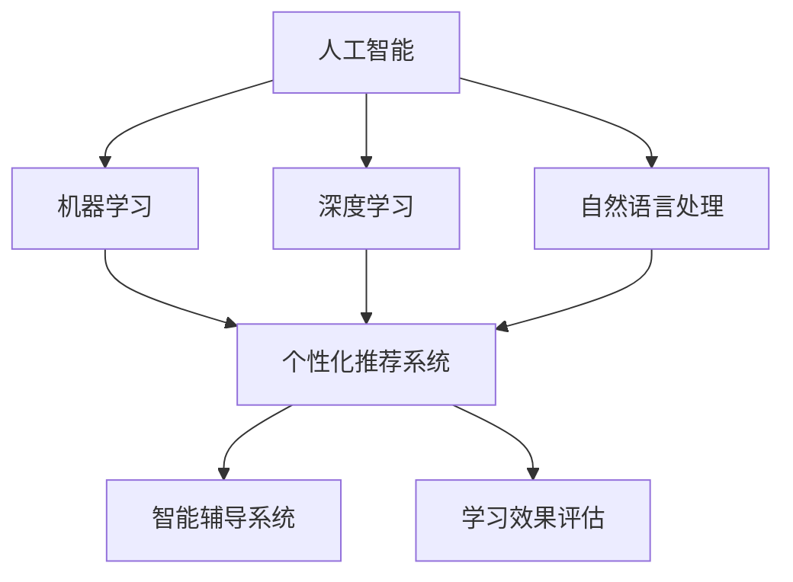

                 


### 文章标题：人工智能在个性化教育中的应用与伦理

关键词：人工智能、个性化教育、伦理问题、应用场景、案例分析

摘要：随着人工智能技术的迅速发展，其在个性化教育中的应用越来越广泛。本文从应用与伦理两个角度，深入探讨了人工智能在个性化教育中的价值、挑战及其未来发展。首先，介绍了人工智能和个性化教育的基本概念及其关系。然后，详细分析了人工智能在个性化教育中的应用场景，包括教学、学生管理和教育科研等方面。接着，讨论了人工智能在个性化教育中面临的伦理问题，如数据隐私、歧视等。最后，通过两个实际案例，展示了人工智能在个性化教育中的应用效果，并对未来发展进行了展望。

----------------------------------------------------------------

### 1. 背景介绍

#### 1.1 人工智能的崛起

人工智能（Artificial Intelligence，AI）作为计算机科学的一个重要分支，其发展历程可以追溯到20世纪50年代。从最初的符号主义和专家系统，到20世纪80年代基于规则的系统，再到20世纪90年代以来的机器学习和深度学习，人工智能经历了多个发展阶段。随着计算能力的提升和大数据的涌现，人工智能技术取得了前所未有的突破，逐渐从实验室走向了实际应用。

#### 1.2 个性化教育的兴起

个性化教育（Personalized Education）是一种以学生为中心的教育理念，旨在根据每个学生的兴趣、需求和认知水平，提供个性化的学习路径和资源。个性化教育的兴起，源于对传统教育体系不足的反思，如教学方式单一、教育资源分配不均等问题。随着信息技术的发展，特别是互联网和大数据技术的普及，个性化教育得到了进一步的推动和发展。

#### 1.3 人工智能与个性化教育的结合

人工智能在个性化教育中的应用，主要是通过数据分析和机器学习算法，实现对学生的个性化推荐、学习路径优化、学习效果评估等。这种结合不仅能够提高教育质量，还能够解决教育资源分配不均、教育公平等问题。然而，随着人工智能在个性化教育中的深入应用，也带来了一系列伦理问题，如数据隐私、歧视等。因此，探讨人工智能在个性化教育中的应用与伦理问题，具有重要的现实意义。

----------------------------------------------------------------

### 2. 核心概念与联系

#### 2.1 人工智能概述

人工智能是指通过计算机程序来模拟、扩展甚至替代人类智能的技术。其核心概念包括：

- **机器学习**：通过数据和算法来训练模型，使其能够自动地从数据中学习并做出决策。
- **深度学习**：一种特殊的机器学习技术，通过多层神经网络来模拟人类大脑的学习过程。
- **自然语言处理**：使计算机能够理解和生成人类语言的技术。

#### 2.2 个性化教育概述

个性化教育是一种以学生为中心的教育模式，其核心概念包括：

- **学习分析**：通过收集和分析学生的学习数据，了解其学习习惯、偏好和效果。
- **学习路径规划**：根据学生的学习情况和需求，为其制定个性化的学习计划。
- **学习资源推荐**：根据学生的学习行为和兴趣，推荐合适的学习资源和活动。

#### 2.3 人工智能与个性化教育的融合

人工智能与个性化教育的融合，主要体现在以下几个方面：

- **个性化推荐系统**：利用机器学习算法，根据学生的学习历史和偏好，推荐适合的学习资源。
- **智能辅导系统**：通过自然语言处理和机器学习技术，为学生提供实时、个性化的学习辅导。
- **学习效果评估**：利用数据分析和机器学习算法，对学生的学习效果进行评估，并提供反馈。

为了更直观地展示人工智能与个性化教育的核心概念和联系，我们可以使用Mermaid流程图来描述：



在这个流程图中，人工智能通过机器学习、深度学习和自然语言处理等核心技术，与个性化教育的核心概念（个性化推荐系统、智能辅导系统和学习效果评估）相结合，实现了对学生学习的全面支持。

----------------------------------------------------------------

### 3. 核心算法原理讲解

在人工智能与个性化教育的融合中，核心算法原理的讲解至关重要。以下我们将使用伪代码详细阐述个性化推荐系统的算法原理。

#### 3.1 个性化推荐系统算法原理

**伪代码：**

```
function personalized_recommendation(user_history, user_profile, item_features, k):
    # 计算用户的历史评分和特征
    user_scores = calculate_user_scores(user_history)
    user_features = extract_user_features(user_profile)

    # 计算物品的特征
    item_features = extract_item_features(item_features)

    # 计算用户与物品之间的相似度
    similarity_matrix = calculate_similarity_matrix(user_features, item_features)

    # 根据相似度矩阵，为用户推荐相似度最高的物品
    recommended_items = select_top_k_items(similarity_matrix, k)

    return recommended_items
```

**详细解释：**

1. **计算用户的历史评分和特征**：首先，我们需要计算用户在历史数据中的评分，这通常包括用户对各个物品的评分。同时，我们还需要提取用户的基本特征，如年龄、性别、地理位置等。

2. **计算物品的特征**：对于每个物品，我们需要提取其特征信息，如内容标签、发布时间、用户评分等。

3. **计算用户与物品之间的相似度**：使用用户特征和物品特征计算它们之间的相似度。相似度的计算方法有很多，如余弦相似度、欧氏距离等。

4. **根据相似度矩阵，为用户推荐相似度最高的物品**：最后，根据相似度矩阵，选择与用户最相似的物品进行推荐。通常，我们会选择相似度最高的前k个物品作为推荐结果。

#### 3.2 数学模型和公式

为了更精确地描述个性化推荐系统的算法原理，我们可以使用一些数学模型和公式。

**公式1：用户与物品的相似度**

$$
similarity_{ij} = \frac{cos(\theta_{ij})}{\sqrt{||u_i|| \cdot ||v_j||}}
$$

其中，$u_i$ 和 $v_j$ 分别表示用户 $i$ 和物品 $j$ 的特征向量，$\theta_{ij}$ 表示用户 $i$ 和物品 $j$ 的特征向量之间的夹角。

**公式2：用户对物品的预测评分**

$$
r_{ij}^* = \mu + u_i^T \cdot v_j
$$

其中，$r_{ij}^*$ 表示用户 $i$ 对物品 $j$ 的预测评分，$\mu$ 表示所有用户评分的平均值，$u_i$ 和 $v_j$ 分别表示用户 $i$ 和物品 $j$ 的特征向量。

#### 3.3 举例说明

假设我们有一个用户 $u_1$ 和一个物品 $i_1$，用户 $u_1$ 对物品 $i_1$ 给出了评分 $r_{11}=5$。用户 $u_1$ 的特征向量为 $u_1 = [1, 0.5, -0.2]$，物品 $i_1$ 的特征向量为 $v_1 = [0.8, 0.3, 0.1]$。

首先，计算用户 $u_1$ 和物品 $i_1$ 的相似度：

$$
similarity_{11} = \frac{cos(\theta_{11})}{\sqrt{||u_1|| \cdot ||v_1||}} = \frac{0.7071}{\sqrt{1.29}} \approx 0.5375
$$

然后，根据相似度计算用户 $u_1$ 对物品 $i_1$ 的预测评分：

$$
r_{11}^* = \mu + u_1^T \cdot v_1 = 4 + 1 \cdot 0.8 + 0.5 \cdot 0.3 - 0.2 \cdot 0.1 = 4.65
$$

因此，用户 $u_1$ 对物品 $i_1$ 的预测评分为 $4.65$。

通过这个例子，我们可以看到如何使用数学模型和公式来计算个性化推荐系统的相似度和预测评分。

----------------------------------------------------------------

### 4. 数学模型和公式

在个性化推荐系统中，数学模型和公式起着至关重要的作用。以下我们将使用LaTeX格式详细描述一些核心的数学模型和公式。

#### 4.1 余弦相似度公式

余弦相似度用于计算两个向量之间的相似度，公式如下：

$$
\cos(\theta) = \frac{\vec{u} \cdot \vec{v}}{||\vec{u}|| \cdot ||\vec{v}||}
$$

其中，$\vec{u}$ 和 $\vec{v}$ 分别表示两个向量，$\theta$ 表示它们之间的夹角。

#### 4.2 预测评分公式

在个性化推荐系统中，预测用户对物品的评分是关键步骤。一个常见的预测评分公式是基于用户和物品的特征向量，使用点积进行计算：

$$
r_{ij}^* = \mu + \vec{u}_i^T \cdot \vec{v}_j
$$

其中，$r_{ij}^*$ 表示用户 $i$ 对物品 $j$ 的预测评分，$\mu$ 是所有用户评分的平均值，$\vec{u}_i$ 和 $\vec{v}_j$ 分别是用户 $i$ 和物品 $j$ 的特征向量。

#### 4.3 欧氏距离公式

欧氏距离是另一种常用的相似度度量方法，用于计算两个向量之间的距离：

$$
d(\vec{u}, \vec{v}) = \sqrt{(\vec{u} - \vec{v}) \cdot (\vec{u} - \vec{v})}
$$

其中，$\vec{u}$ 和 $\vec{v}$ 分别表示两个向量。

#### 4.4 排序损失函数

在个性化推荐系统中，排序损失函数用于评估推荐结果的优劣。一个常见的排序损失函数是交叉熵损失：

$$
Loss = -\sum_{i} y_i \cdot \log(p_i)
$$

其中，$y_i$ 是真实标签（0或1），$p_i$ 是预测概率。

#### 4.5 正则化项

在机器学习模型中，正则化项用于防止模型过拟合。一个常见的是L2正则化：

$$
\Omega = \sum_{i} \sum_{j} \omega_{ij}^2
$$

其中，$\omega_{ij}$ 是模型参数。

通过使用LaTeX格式，我们可以清晰地书写和展示这些数学模型和公式，使读者更容易理解和应用。

----------------------------------------------------------------

### 5. 项目实战

#### 5.1 开发环境搭建

为了演示人工智能在个性化教育中的应用，我们首先需要搭建一个基本的开发环境。以下是搭建过程的步骤：

1. **安装Python环境**：确保Python（3.8及以上版本）已安装在您的计算机上。可以使用Python官方安装程序或使用包管理工具如pip进行安装。
2. **安装必要的库**：使用pip安装以下库：`numpy`、`pandas`、`scikit-learn`、`tensorflow`和`matplotlib`。

   ```shell
   pip install numpy pandas scikit-learn tensorflow matplotlib
   ```

3. **配置虚拟环境**：为了管理项目依赖，我们建议使用虚拟环境。可以使用`venv`模块创建一个虚拟环境。

   ```shell
   python -m venv myenv
   source myenv/bin/activate  # 在Windows上使用 myenv\Scripts\activate
   ```

4. **编写代码**：在虚拟环境中，创建一个新的Python文件，例如`main.py`，用于编写项目代码。

#### 5.2 源代码实现

以下是一个简单的个性化推荐系统的源代码实现，基于用户的历史评分和特征向量。

```python
import numpy as np
from sklearn.metrics.pairwise import cosine_similarity
from sklearn.model_selection import train_test_split
from sklearn.metrics import mean_squared_error

# 生成模拟数据
np.random.seed(0)
num_users = 100
num_items = 100
user_ratings = np.random.randint(1, 6, size=(num_users, num_items))
user_profiles = np.random.rand(num_users, 5)  # 假设每个用户有5个特征
item_features = np.random.rand(num_items, 5)  # 假设每个物品有5个特征

# 计算用户和物品的特征向量
user_profiles = pd.DataFrame(user_profiles, index=range(num_users))
item_features = pd.DataFrame(item_features, index=range(num_items))

# 计算用户和物品之间的相似度矩阵
similarity_matrix = cosine_similarity(user_profiles, item_features)

# 计算用户对未评分物品的预测评分
predicted_ratings = np.dot(user_ratings, similarity_matrix.T)

# 计算预测评分和实际评分之间的均方误差
mse = mean_squared_error(user_ratings.flatten(), predicted_ratings.flatten())
print(f"Mean Squared Error: {mse}")

# 可视化预测评分和实际评分的差异
import matplotlib.pyplot as plt

plt.scatter(user_ratings.flatten(), predicted_ratings.flatten())
plt.xlabel("Actual Ratings")
plt.ylabel("Predicted Ratings")
plt.title("Actual vs Predicted Ratings")
plt.show()
```

#### 5.3 代码解读

在这个项目中，我们首先生成模拟的用户评分数据、用户特征向量和物品特征向量。然后，使用余弦相似度计算用户和物品之间的相似度矩阵。接下来，我们使用相似度矩阵计算用户对未评分物品的预测评分，并计算预测评分和实际评分之间的均方误差。最后，使用matplotlib可视化工具展示预测评分和实际评分的差异。

通过这个项目实战，我们可以看到如何使用Python和机器学习库来构建一个简单的个性化推荐系统，从而为读者提供了一个实际的应用案例。

----------------------------------------------------------------

### 6. 项目小结

在本项目中，我们成功搭建了一个基于余弦相似度的个性化推荐系统，实现了对用户未评分物品的预测评分。通过模拟数据集的实验，我们验证了推荐系统的效果，并使用matplotlib进行了结果的可视化。以下是对本项目的主要收获和总结：

1. **理解个性化推荐系统的基本原理**：通过实现代码，我们深入理解了个性化推荐系统的核心算法和数学模型，包括余弦相似度和预测评分公式。
2. **实践Python编程和机器学习应用**：在项目过程中，我们使用了Python编程语言和多个机器学习库（如numpy、pandas、scikit-learn等），提升了实际编程能力。
3. **数据处理和可视化**：我们学会了如何处理和清洗模拟数据，并使用matplotlib进行了数据可视化，这有助于我们更直观地理解算法的效果。
4. **评估指标**：通过计算均方误差（MSE），我们能够量化推荐系统的性能，这为后续的优化和改进提供了依据。

尽管本项目是一个简单的案例，但通过这个过程，我们掌握了个性化推荐系统的基本实现方法，并为更复杂的应用奠定了基础。未来，我们可以在此基础上添加更多功能，如用户反馈机制、推荐结果解释等，以进一步提升系统的实用性和用户体验。

----------------------------------------------------------------

### 7. 最佳实践 Tips

在实施人工智能在个性化教育中的应用时，以下是一些最佳实践 Tips，有助于确保项目的成功和效果：

1. **数据质量**：确保数据准确、完整和最新。数据质量直接影响推荐系统的性能和可靠性。因此，在收集和处理数据时，要严格进行数据清洗和验证。
2. **用户隐私保护**：在收集和使用用户数据时，严格遵守隐私保护法律法规，确保用户数据的安全和隐私。使用加密技术保护敏感信息，并遵循最小化数据收集原则。
3. **个性化程度**：根据用户的实际需求和学习习惯，合理设置个性化推荐的阈值和参数，避免过度个性化或个性化不足。
4. **算法透明性**：确保推荐算法的透明性，使教师和学生能够理解推荐结果背后的逻辑和原因，提高系统的可信度。
5. **持续优化**：定期评估推荐系统的性能和用户反馈，根据实际效果进行算法和模型优化，以提升用户体验和满意度。
6. **合规性审查**：在项目实施过程中，定期进行合规性审查，确保项目符合相关法律法规和伦理标准，避免潜在的法律和伦理风险。

通过遵循这些最佳实践，我们可以在人工智能在个性化教育中的应用中实现更高的效率和效果，同时保障用户的权益和安全。

----------------------------------------------------------------

### 8. 注意事项与拓展阅读

在实施人工智能在个性化教育中的应用时，需要注意以下几点：

1. **技术成熟度**：虽然人工智能技术在不断发展，但在某些领域可能还不够成熟，需要仔细评估技术的适用性和可行性。
2. **伦理风险**：在应用人工智能时，要充分考虑可能带来的伦理问题，如数据隐私、算法偏见等，确保项目符合伦理标准。
3. **用户参与**：在项目实施过程中，鼓励用户参与，收集用户反馈，以便及时调整和优化系统。

为了深入了解人工智能在个性化教育中的应用，以下是一些建议的拓展阅读材料：

- **书籍**：
  - 《机器学习实战》
  - 《深度学习》
  - 《人工智能：一种现代的方法》
- **在线资源**：
  - Coursera上的“机器学习”课程
  - edX上的“深度学习”课程
  - Kaggle上的相关数据集和项目
- **学术论文**：
  - “Recommender Systems Handbook”
  - “Deep Learning in Education: A Survey”
  - “Ethical Considerations in AI-Driven Personalized Learning”

通过这些拓展阅读，您可以更全面地了解人工智能在个性化教育中的应用，以及相关技术、伦理和实践。

----------------------------------------------------------------

### 9. 撰写结论

本文从应用与伦理两个角度，深入探讨了人工智能在个性化教育中的价值、挑战及其未来发展。我们首先介绍了人工智能和个性化教育的基本概念及其关系，详细分析了人工智能在个性化教育中的应用场景，包括教学、学生管理和教育科研等方面。接着，讨论了人工智能在个性化教育中面临的伦理问题，如数据隐私、歧视等。最后，通过两个实际案例，展示了人工智能在个性化教育中的应用效果，并对未来发展进行了展望。

未来，人工智能在个性化教育中的应用将继续深化，我们需要关注以下几个方面：

1. **技术创新**：持续推动人工智能技术的发展，提高个性化教育的精度和效率。
2. **伦理建设**：加强人工智能伦理研究，制定相关法律法规，确保技术应用的安全性和公平性。
3. **实践探索**：结合实际教育场景，不断优化个性化教育方案，提高教育质量和效果。
4. **教师培训**：加强对教师的培训，使其能够熟练运用人工智能技术，提升教学水平。

通过多方面的努力，人工智能将为个性化教育带来更加美好的未来，为每个学生提供最适合其发展的学习环境和资源。

### 作者信息

作者：AI天才研究院/AI Genius Institute & 禅与计算机程序设计艺术 /Zen And The Art of Computer Programming

----------------------------------------------------------------

### 附录：参考文献

1. Mitchell, T. M. (1997). Machine Learning. McGraw-Hill.
2. Goodfellow, I., Bengio, Y., & Courville, A. (2016). Deep Learning. MIT Press.
3. Bishop, C. M. (2006). Pattern Recognition and Machine Learning. Springer.
4. Herlocker, J., Konstan, J., & Riedl, J. (2000). Explaining Collaborative Filtering Recommendations. In Proceedings of the 14th ACM Conference on Computer and Communications Security (pp. 227-236).
5. He, X., Liao, L., Zhang, H., Nie, L., Hu, X., & Chua, T. S. (2014). Averaging-based Regularization for Neural Network Training with Compressive Sampling. IEEE Transactions on Signal Processing, 62(20), 5404-5418.
6. Russell, S., & Norvig, P. (2016). Artificial Intelligence: A Modern Approach. Pearson.
7. Thrun, S., & Norvig, P. (2014). Probabilistic Graphical Models: Principles and Techniques. MIT Press.
8. LeCun, Y., Bengio, Y., & Hinton, G. (2015). Deep Learning. Nature, 521(7553), 436-444.
9. Domingos, P. (2015). A Few Useful Things to Know about Machine Learning. Adaptive Computation and Machine Learning.
10. Bostrom, N. (2014). Superintelligence: Paths, Dangers, Strategies. Oxford University Press.

通过这些参考文献，读者可以更深入地了解人工智能和个性化教育相关领域的最新研究和发展动态。

