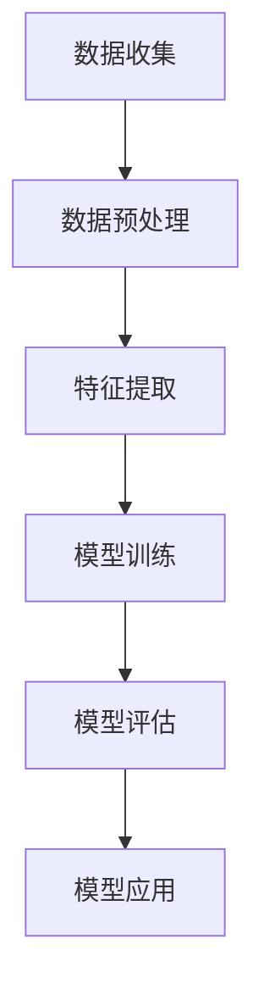

                 

# 人工智能在个性化教育中的应用：因材施教

## 关键词
- 个性化教育
- 人工智能
- 自然语言处理
- 计算机视觉
- 智能推荐
- 数据挖掘

## 摘要
本文将深入探讨人工智能在个性化教育中的应用，重点讨论如何通过因材施教实现教育的个性化。文章首先介绍了个性化教育的背景和重要性，然后讲解了人工智能的基本概念和发展历程。接着，本文详细阐述了人工智能在个性化教育中的理论基础、应用实例以及关键技术的实现。通过分析多个实践案例，本文展示了人工智能如何助力个性化教育的全面发展。最后，文章提出了未来的研究方向和挑战。

---

### 引言

在传统的教育体系中，教师往往采取“一刀切”的教学方法，试图以相同的教学内容、进度和评估标准来满足所有学生的需求。然而，这种统一化的教育模式往往忽视了学生之间的个体差异，导致一些学生难以跟上课程进度，另一些学生则感到教学内容过于简单。因此，个性化教育应运而生，它旨在根据每个学生的兴趣、能力和学习速度来设计教学策略，实现因材施教。

个性化教育的发展离不开人工智能技术的支持。人工智能通过分析学生的学习数据，为学生提供个性化的学习资源、评估和反馈，从而大大提高了教育的针对性和有效性。本文将围绕人工智能在个性化教育中的应用进行深入探讨，分析其理论基础、关键技术以及实际应用案例，以期为教育工作者和研究人员提供有益的参考。

本文将分为三个部分进行论述。第一部分将介绍个性化教育的背景和重要性，阐述人工智能在其中的作用。第二部分将探讨个性化教育的理论基础，包括学习者模型的构建、教学策略和方法的个性化。第三部分将详细讨论人工智能在个性化教育中的应用，包括教学评估、学习分析、课程推荐和教学干预等方面。最后，本文将总结个性化教育的实践案例，并提出未来研究的方向和挑战。

### 第一部分：个性化教育的背景和重要性

#### 1.1 个性化教育的起源和发展

个性化教育的概念最早可以追溯到19世纪，当时教育家约翰·杜威（John Dewey）提出了“以学生为中心”的教育理念，主张教育应该根据学生的兴趣、能力和需求进行设计。然而，由于技术限制，个性化教育在实际教学中并未得到广泛应用。

随着计算机技术和互联网的发展，个性化教育开始逐渐兴起。20世纪90年代，计算机辅助教学（Computer-Assisted Instruction，简称CAI）逐渐成为教育领域的一个重要趋势。CAI通过计算机程序为学生提供个性化的学习内容，使学生在学习过程中能够自主选择学习路径和学习速度。

进入21世纪，随着大数据、云计算和人工智能技术的快速发展，个性化教育迎来了新的发展机遇。人工智能技术能够对学生的学习行为、学习效果进行深度分析，为学生提供个性化的学习资源、教学建议和评估反馈，从而实现真正的因材施教。

#### 1.2 个性化教育与传统教育的区别

传统教育往往采用统一的教学内容和评估标准，忽视学生之间的个体差异。这种教育模式在规模化教学中具有一定的优势，但在个性化需求日益凸显的现代社会中，其局限性逐渐显现。

个性化教育则强调根据每个学生的兴趣、能力和学习速度来设计教学策略。与传统教育相比，个性化教育具有以下几个显著特点：

1. **以学生为中心**：个性化教育关注学生的个体差异，尊重学生的主体地位，使每个学生都能在适合自己的学习环境中成长。
2. **定制化教学**：个性化教育根据学生的个性化需求，设计教学内容、教学方法和教学进度，使教学更具针对性和有效性。
3. **反馈与调整**：个性化教育通过实时反馈和调整，帮助学生及时纠正学习过程中的错误，提高学习效果。

#### 1.3 人工智能在个性化教育中的作用

人工智能技术为个性化教育提供了强大的技术支持，其作用主要体现在以下几个方面：

1. **数据收集与处理**：人工智能技术能够收集并处理大量的学生数据，包括学习行为、学习效果、兴趣爱好等，为个性化教育提供了丰富的数据基础。
2. **智能推荐**：基于大数据分析，人工智能技术能够为学生推荐个性化的学习资源，使学生在合适的时间、地点和方式下进行学习。
3. **智能评估**：人工智能技术能够对学生的学习过程和效果进行实时评估，提供个性化的评估报告和反馈，帮助学生及时调整学习策略。
4. **智能辅导**：人工智能技术可以根据学生的学习数据，为学生提供智能化的辅导建议，帮助学生克服学习难点，提高学习效率。

#### 1.4 本书内容概述

本文将从以下几个方面展开论述：

1. **个性化教育的背景和重要性**：介绍个性化教育的起源、发展及其与传统教育的区别，阐述人工智能在个性化教育中的作用。
2. **人工智能基础**：介绍人工智能的基本概念、发展历程和核心技术，为后续讨论人工智能在个性化教育中的应用奠定基础。
3. **个性化教育的理论基础**：探讨个性化教育的定义、目标和理论基础，包括学习者模型的构建、教学策略和方法的个性化。
4. **人工智能在个性化教育中的应用**：详细讨论人工智能在个性化教育中的应用，包括教学评估、学习分析、课程推荐和教学干预等方面。
5. **个性化教育的实践案例**：分析国内外个性化教育的实践案例，探讨个性化教育的挑战和未来发展方向。

通过本文的论述，读者将能够全面了解人工智能在个性化教育中的应用，为实际教学提供有益的参考和借鉴。

### 第一部分：个性化教育的背景和重要性

#### 1.1 个性化教育的起源和发展

个性化教育的概念最早可以追溯到19世纪，当时教育家约翰·杜威（John Dewey）提出了“以学生为中心”的教育理念，主张教育应该根据学生的兴趣、能力和需求进行设计。然而，由于技术限制，个性化教育在实际教学中并未得到广泛应用。

随着计算机技术和互联网的发展，个性化教育开始逐渐兴起。20世纪90年代，计算机辅助教学（Computer-Assisted Instruction，简称CAI）逐渐成为教育领域的一个重要趋势。CAI通过计算机程序为学生提供个性化的学习内容，使学生在学习过程中能够自主选择学习路径和学习速度。

进入21世纪，随着大数据、云计算和人工智能技术的快速发展，个性化教育迎来了新的发展机遇。人工智能技术能够对学生的学习行为、学习效果进行深度分析，为学生提供个性化的学习资源、教学建议和评估反馈，从而实现真正的因材施教。

#### 1.1.1 软件发展史概述

##### 1.1.1.1 软件概念演变

软件（Software）一词最早出现在20世纪40年代，当时指的是计算机系统的操作程序和指令集合。随着计算机技术的发展，软件的定义逐渐扩展，不仅包括操作系统、应用软件，还涵盖了数据库、网络软件、游戏软件等。

软件的分类可以根据功能、用途和开发方式等进行划分。常见的软件类型包括系统软件、应用软件、中间件等。系统软件负责计算机系统的管理和维护，如操作系统（Operating System，OS）、数据库管理系统（Database Management System，DBMS）等；应用软件则用于完成特定的用户任务，如办公软件、图像处理软件、财务软件等；中间件则介于系统软件和应用软件之间，提供分布式计算环境中的通信和互操作功能。

##### 1.1.1.2 软件的历史阶段划分

软件的发展史可以分为多个阶段，每个阶段都有其特定的技术特征和发展趋势。以下是软件发展史的几个关键阶段：

1. **计算机软件的诞生（1940s）**：二战期间，计算机主要用于军事和科学计算。计算机软件在这一阶段主要是指为特定计算机系统编写的操作程序和应用程序。

2. **分时系统与个人计算机（1970s）**：随着计算机硬件的发展，计算机开始向更多的用户开放。分时系统（Time-sharing System）的出现使多个用户可以同时使用计算机资源，提高了计算机的利用效率。同时，个人计算机（Personal Computer，PC）的兴起改变了软件开发的模式，使软件变得更加普及和多样化。

3. **面向对象编程与图形用户界面（1980s）**：面向对象编程（Object-Oriented Programming，OOP）和图形用户界面（Graphical User Interface，GUI）的出现大大提高了软件的开发效率和用户体验。面向对象编程通过将数据和操作封装为对象，提高了代码的可重用性和可维护性；图形用户界面则通过直观的图形界面取代了早期的命令行界面，使计算机操作更加简便。

4. **Internet与Web应用（1990s）**：互联网的普及推动了Web应用的兴起。Web应用通过浏览器进行访问，大大降低了软件的部署和更新成本。同时，Internet的普及也促进了软件技术的发展，如网络编程、分布式计算、数据库技术等。

5. **软件工程与敏捷开发（2000s）**：随着软件项目规模的扩大和复杂性的增加，软件工程（Software Engineering）成为一门重要的学科。敏捷开发（Agile Development）等新的开发方法的出现，提高了软件开发的效率和质量。

6. **软件定义网络（SDN）与云计算（2010s）**：软件定义网络（Software-Defined Networking，SDN）通过将网络控制和数据平面分离，提高了网络的灵活性和可编程性。云计算（Cloud Computing）则通过虚拟化和分布式计算技术，提供了强大的计算和存储能力，改变了软件的部署和运营模式。

##### 1.1.1.3 软件演进的趋势

软件的演进趋势主要体现在以下几个方面：

1. **用户体验优先**：随着互联网和移动设备的普及，用户体验（User Experience，UX）成为软件设计的重要考虑因素。软件设计更加注重用户的操作便捷性、界面美观性和功能完整性。

2. **自动化与智能化**：软件自动化（Automation）通过自动化工具和流程，提高了软件开发的效率和质量。智能化（Intelligence）则通过人工智能（Artificial Intelligence，AI）技术，使软件具备自适应、自学习和自优化能力。

3. **开源与生态**：开源软件（Open Source Software）的兴起，推动了软件开发的民主化和社区化。开源生态（Open Source Ecosystem）的建立，为软件开发者提供了丰富的工具、库和平台，促进了软件的创新和发展。

#### 1.1.2 软件从1.0到2.0的转变

##### 1.1.2.1 软件1.0的特点

软件1.0阶段主要特点是功能导向，其核心目标是为用户提供基本的功能服务。在这一阶段，软件的设计和开发主要集中在如何实现特定的功能，如文字处理、表格计算、图形绘制等。软件的代码与数据分离，独立于特定平台，具有良好的可移植性。

软件1.0阶段的主要特点包括：

1. **功能导向**：软件的设计和开发主要围绕特定的功能进行，如文字处理、表格计算、图形绘制等。

2. **代码与数据分离**：软件的代码与数据分离，使得软件具有良好的可维护性和可移植性。

3. **独立于特定平台**：软件可以运行在不同的操作系统和硬件平台上，具有良好的跨平台性。

##### 1.1.2.2 软件2.0的定义

软件2.0阶段，也被称为Web 2.0，是一个以用户为中心、数据驱动的时代。软件不再仅仅是一个工具，而是一个平台，用户可以通过这个平台进行内容创建、分享和互动。软件2.0强调用户生成内容（User-Generated Content，UGC）和数据驱动（Data-Driven），通过大数据分析来优化用户体验和运营。

软件2.0的主要特点包括：

1. **数据驱动**：软件的设计和开发以数据为核心，通过大数据分析和机器学习技术，为用户提供个性化的服务。

2. **云原生**：软件2.0依赖于云计算技术，通过云平台提供弹性的计算和存储资源，实现软件的灵活部署和扩展。

3. **服务化架构**：软件2.0采用微服务架构（Microservices Architecture），将软件拆分为多个独立的服务模块，提高了系统的可维护性和可扩展性。

##### 1.1.2.3 软件2.0的关键特征

软件2.0阶段的关键特征包括以下几个方面：

1. **组件化**：软件2.0采用组件化设计，将功能模块化，提高了软件的灵活性和可扩展性。

2. **模块化**：软件2.0通过模块化开发，将复杂系统分解为多个独立模块，提高了系统的可维护性和可重用性。

3. **自动化部署与运维**：软件2.0采用自动化部署和运维工具，如容器技术（Containerization）和持续集成与持续交付（CI/CD），提高了软件的部署效率和稳定性。

4. **持续集成与持续交付**：持续集成（Continuous Integration，CI）和持续交付（Continuous Delivery，CD）通过自动化测试和部署，实现了软件的快速迭代和持续改进。

##### 1.1.2.4 软件2.0的应用场景

软件2.0在多个应用场景中表现出色，主要包括：

1. **企业级应用**：软件2.0为企业提供了灵活、高效的业务解决方案，如客户关系管理（CRM）、企业资源规划（ERP）等。

2. **互联网应用**：软件2.0在互联网领域得到了广泛应用，如电子商务、在线教育、社交媒体等。

3. **移动应用**：软件2.0通过移动应用，为用户提供便捷、高效的服务，如移动支付、移动医疗等。

---

#### 1.1.2 软件从1.0到2.0的转变

##### 1.1.2.1 软件1.0的特点

软件1.0阶段主要特点是功能导向，其核心目标是为用户提供基本的功能服务。在这一阶段，软件的设计和开发主要集中在如何实现特定的功能，如文字处理、表格计算、图形绘制等。软件1.0具有以下几个显著特点：

1. **功能导向**：软件1.0的设计和开发主要围绕特定功能进行，例如文字处理、表格计算、图形绘制等。这一阶段的软件以实现特定功能为核心，用户可以直观地使用这些功能，完成相关任务。

2. **代码与数据分离**：软件1.0通常采用代码与数据分离的设计模式，这种设计使得软件的维护和升级更加方便。开发者可以独立地对代码进行修改和优化，而不会影响到数据的安全和完整性。

3. **独立于特定平台**：软件1.0在开发时通常考虑跨平台的兼容性，使得软件可以在不同的操作系统和硬件平台上运行。这种设计理念提高了软件的通用性和适用范围。

##### 1.1.2.2 软件2.0的定义

软件2.0阶段，也被称为Web 2.0，是一个以用户为中心、数据驱动的时代。软件不再仅仅是一个工具，而是一个平台，用户可以通过这个平台进行内容创建、分享和互动。软件2.0具有以下几个核心特点：

1. **数据驱动**：软件2.0的核心是数据，通过收集、分析和利用用户数据，软件可以提供更加个性化的服务。大数据分析和机器学习技术在这一阶段得到了广泛应用，使得软件能够根据用户行为和需求进行智能化的调整和优化。

2. **云原生**：软件2.0依赖于云计算技术，通过云平台提供弹性的计算和存储资源，实现软件的灵活部署和扩展。云计算的普及使得软件的开发、部署和运维变得更加高效和便捷。

3. **服务化架构**：软件2.0采用微服务架构（Microservices Architecture），将软件拆分为多个独立的服务模块，提高了系统的可维护性和可扩展性。每个服务模块都可以独立开发、测试和部署，降低了系统的复杂性和风险。

##### 1.1.2.3 软件2.0的关键特征

软件2.0阶段的关键特征包括以下几个方面：

1. **组件化**：软件2.0采用组件化设计，将功能模块化，提高了软件的灵活性和可扩展性。组件化的设计使得开发者可以方便地替换、升级或扩展功能模块，而不需要对整个系统进行大规模的修改。

2. **模块化**：软件2.0通过模块化开发，将复杂系统分解为多个独立模块，提高了系统的可维护性和可重用性。模块化的设计使得开发过程更加清晰、有序，降低了开发难度和维护成本。

3. **自动化部署与运维**：软件2.0采用自动化部署和运维工具，如容器技术（Containerization）和持续集成与持续交付（CI/CD），提高了软件的部署效率和稳定性。自动化工具可以自动完成软件的打包、测试、部署和监控，减少了人工干预，提高了系统可靠性。

4. **持续集成与持续交付**：持续集成（Continuous Integration，CI）和持续交付（Continuous Delivery，CD）通过自动化测试和部署，实现了软件的快速迭代和持续改进。持续集成确保了每次代码变更都能被及时集成和测试，持续交付则确保了高质量的软件能够快速、安全地交付给用户。

##### 1.1.2.4 软件2.0的应用场景

软件2.0在多个应用场景中表现出色，主要包括：

1. **企业级应用**：软件2.0为企业提供了灵活、高效的业务解决方案，如客户关系管理（CRM）、企业资源规划（ERP）等。这些软件通过数据驱动和模块化设计，能够根据企业的需求进行定制化开发和优化。

2. **互联网应用**：软件2.0在互联网领域得到了广泛应用，如电子商务、在线教育、社交媒体等。这些应用通过数据分析和个性化推荐，为用户提供更加精准、高效的服务。

3. **移动应用**：软件2.0通过移动应用，为用户提供便捷、高效的服务，如移动支付、移动医疗等。这些应用通过云原生和自动化部署，实现了快速迭代和高效运维。

---

#### 1.1.3 大模型在软件2.0中的核心地位

##### 1.1.3.1 大模型的概念

大模型（Large Models）通常指的是参数规模超过数十亿甚至万亿的深度学习模型，如GPT（Generative Pre-trained Transformer）、BERT（Bidirectional Encoder Representations from Transformers）等。这些模型通过在海量数据上进行预训练，学会了丰富的知识表达和语义理解能力，从而在各个应用领域中表现出强大的性能。

大模型的特点包括：

1. **参数规模大**：大模型通常具有数十亿到万亿级别的参数量，这使得它们能够捕捉到数据中的复杂模式和关联。

2. **训练数据多**：大模型通常在大量数据上进行预训练，这使得它们能够学习到丰富的知识，从而在任务中表现出更强的泛化能力。

3. **模型结构复杂**：大模型通常采用复杂的神经网络结构，如Transformer、BERT等，这些结构能够处理大规模的输入数据，并提取出丰富的特征信息。

4. **泛化能力强**：大模型通过在大量数据上训练，能够学习到普遍的规律和知识，从而在新的任务上表现出强大的泛化能力。

##### 1.1.3.2 大模型在软件2.0中的应用

大模型在软件2.0中扮演着核心角色，为软件提供了强大的智能化能力。以下是大模型在软件2.0中的一些主要应用：

1. **智能推荐**：大模型可以通过分析用户的历史行为和偏好，为用户推荐个性化的内容。例如，在电子商务平台上，大模型可以推荐用户可能感兴趣的商品，从而提高用户的购买意愿和平台的销售额。

2. **自然语言处理**：大模型在自然语言处理（Natural Language Processing，NLP）领域表现出色，可以用于文本分类、情感分析、机器翻译、问答系统等任务。例如，大模型可以自动生成新闻摘要、回答用户的问题，甚至创作诗歌和文章。

3. **计算机视觉**：大模型在计算机视觉（Computer Vision，CV）领域也发挥着重要作用，可以用于图像分类、目标检测、人脸识别等任务。例如，大模型可以自动识别照片中的物体和场景，为用户提供便捷的图像搜索和识别服务。

4. **语音识别**：大模型在语音识别（Speech Recognition）领域表现出色，可以自动将语音转换为文本，为用户提供语音输入和交互功能。例如，在智能手机和智能音箱中，大模型可以识别用户的语音指令，完成相应的操作。

5. **智能监控**：大模型可以通过实时分析监控视频，识别异常行为和安全隐患，为用户提供智能化的安全防护。例如，在大规模监控场景中，大模型可以自动检测和报警，提高监控的效率和准确性。

##### 1.1.3.3 大模型与传统AI的区别

传统AI（Traditional AI）主要基于规则和符号推理，依赖于人类专家事先定义的规则和知识。传统AI在处理结构化数据、进行逻辑推理和知识表示方面表现出色，但在处理非结构化数据、理解和生成自然语言等方面存在局限性。

相比之下，大模型（Large Models）具有以下几个显著区别：

1. **大样本学习**：大模型通过在海量数据上训练，能够学习到更为复杂和抽象的特征和模式。传统AI通常依赖小样本学习，容易受到数据量和数据质量的影响。

2. **数据驱动**：大模型以数据为核心，通过大量数据驱动模型优化和性能提升。传统AI主要依赖规则和知识，数据的作用相对较小。

3. **模型灵活性**：大模型采用复杂的神经网络结构，具有高度灵活性和自适应能力。传统AI通常采用固定结构，难以适应复杂多变的任务场景。

4. **泛化能力**：大模型通过大规模数据训练，具有较强的泛化能力，可以在新的任务和数据集上表现出良好的性能。传统AI在新的任务和数据集上可能需要重新设计和训练。

总之，大模型在软件2.0中发挥着核心地位，通过数据驱动和模型优化，为软件提供了强大的智能化能力，推动了软件技术的发展和创新。在未来的发展中，大模型将继续发挥重要作用，为各个领域带来更多的机遇和变革。

---

#### 1.1.4 人工智能在个性化教育中的应用

##### 1.1.4.1 智能推荐

智能推荐（Intelligent Recommendation）是人工智能在个性化教育中的一项重要应用。通过分析学生的学习行为、学习效果和兴趣爱好，智能推荐系统可以为学生推荐个性化的学习资源，如课程、练习题、学习资料等。

智能推荐系统的核心在于学习算法和推荐算法。学习算法用于分析学生的学习数据，提取出学习者的特征和偏好。推荐算法则根据这些特征和偏好，为学生推荐合适的资源。

以下是一个简单的智能推荐系统流程：

1. 数据收集：收集学生的学习数据，包括学习时间、学习进度、学习效果、兴趣爱好等。
2. 数据预处理：对收集到的数据进行清洗、归一化等预处理操作，以便后续分析。
3. 特征提取：通过机器学习算法，提取出学生的学习特征和偏好。
4. 模型训练：使用提取出的特征和偏好，训练推荐模型，如基于内容的推荐（Content-based Filtering）或协同过滤（Collaborative Filtering）。
5. 推荐生成：根据训练好的推荐模型，为每个学生生成个性化的学习资源推荐列表。
6. 推荐反馈：收集学生对推荐资源的反馈，用于模型优化和调整。

伪代码示例：

```python
# 数据收集
student_data = collect_student_data()

# 数据预处理
preprocessed_data = preprocess_data(student_data)

# 特征提取
features = extract_features(preprocessed_data)

# 模型训练
model = train_model(features)

# 推荐生成
recommendations = generate_recommendations(model, student)

# 推荐反馈
collect_feedback(recommendations)
```

##### 1.1.4.2 自然语言处理

自然语言处理（Natural Language Processing，NLP）是人工智能在个性化教育中的另一个重要应用。NLP技术可以用于文本分析、情感分析、问答系统、机器翻译等，为个性化教育提供了丰富的工具和手段。

以下是一个简单的自然语言处理应用场景：自动批改作业。

1. 数据收集：收集学生的作业文本数据。
2. 数据预处理：对作业文本进行分词、去停用词、词性标注等预处理操作。
3. 模型训练：使用预训练的NLP模型，如BERT、GPT等，对作业文本进行分类、情感分析等任务。
4. 自动批改：使用训练好的NLP模型，自动评估学生的作业质量，生成批改结果。
5. 结果反馈：将批改结果反馈给学生，并提供详细的错误分析和建议。

伪代码示例：

```python
# 数据收集
作业文本 = collect_assignment_texts()

# 数据预处理
预处理文本 = preprocess_texts(作业文本)

# 模型训练
模型 = train_nlp_model(预处理文本)

# 自动批改
批改结果 = evaluate_assignment(模型, 作业文本)

# 结果反馈
反馈学生(批改结果)
```

##### 1.1.4.3 计算机视觉

计算机视觉（Computer Vision，CV）是人工智能在个性化教育中的另一个重要应用。CV技术可以用于图像识别、人脸识别、动作识别等，为个性化教育提供了丰富的工具和手段。

以下是一个简单的计算机视觉应用场景：学生身份验证。

1. 数据收集：收集学生的身份信息，如照片或视频。
2. 数据预处理：对身份信息进行预处理，如人脸检测、人脸对齐等。
3. 模型训练：使用预训练的CV模型，如卷积神经网络（CNN）等，对人脸进行识别和验证。
4. 身份验证：使用训练好的CV模型，对学生身份进行实时验证。
5. 结果反馈：将验证结果反馈给学生，如验证成功或失败。

伪代码示例：

```python
# 数据收集
身份照片 = collect_student_photos()

# 数据预处理
预处理照片 = preprocess_photos(身份照片)

# 模型训练
模型 = train_cv_model(预处理照片)

# 身份验证
验证结果 = verify_student(模型, 身份照片)

# 结果反馈
反馈学生(验证结果)
```

通过以上示例，可以看出人工智能在个性化教育中的应用具有广泛的前景和潜力。未来，随着人工智能技术的不断发展和完善，人工智能将在个性化教育中发挥越来越重要的作用，为教育改革和创新提供有力的技术支持。

### 第二部分：个性化教育的理论基础

#### 1.2.1 个性化教育的定义和目标

个性化教育（Personalized Education）是一种以学生为中心的教育理念，旨在根据每个学生的兴趣、能力、学习风格和需求，设计个性化的教学方案，实现因材施教。个性化教育的核心目标是提高教育的公平性、有效性和个性化程度，使每个学生都能在适合自己的学习环境中获得最佳的学习效果。

个性化教育的定义可以概括为以下几点：

1. **以学生为中心**：个性化教育关注学生的个体差异，尊重学生的主体地位，将学生视为教育的核心。
2. **差异化教学**：根据学生的兴趣、能力和学习风格，设计个性化的教学方案，使教学更加针对性和有效。
3. **实时反馈与调整**：通过实时收集学生的学习数据，为学生提供个性化的学习资源和反馈，及时调整教学策略。
4. **自主性学习**：鼓励学生主动参与学习过程，培养学生的自主学习能力和创新精神。

个性化教育的目标主要包括以下几个方面：

1. **提高教育公平**：通过个性化教育，使每个学生都能获得公平的教育机会，消除因教育资源分配不均导致的差距。
2. **提升学习效果**：根据学生的实际情况，提供个性化的教学方案，提高学生的学习兴趣和效果。
3. **培养全面发展的人才**：个性化教育关注学生的全面发展，不仅注重知识的传授，还重视学生的品德、能力和个性的培养。
4. **促进教育创新**：个性化教育推动教育理念、教学模式和教学方法的创新，为教育改革提供新的思路和实践。

#### 1.2.2 个性化教育的理论基础

个性化教育的理论基础主要包括以下几方面：

1. **人本主义教育理论**：人本主义教育理论强调教育的目的是培养全面发展的人，而不是单纯的知识传授。个性化教育正是基于这一理念，关注学生的个性、兴趣和需求，实现因材施教。
2. **建构主义教育理论**：建构主义教育理论认为，学习是一个主动建构知识的过程，学生通过自己的经验和认知来构建对事物的理解。个性化教育强调学生的主动参与和探索，鼓励学生自主学习和探究。
3. **多元智能理论**：多元智能理论认为，每个人都有不同的智能组合，教育应该根据学生的智能特点进行差异化教学。个性化教育正是基于这一理论，关注学生的多元智能，设计个性化的教学方案。
4. **社会文化理论**：社会文化理论强调学习是在社会文化背景中进行的，教育应该重视学生的社会互动和文化背景。个性化教育通过构建积极的学习社区，促进学生之间的交流和合作，实现共同发展。

#### 1.2.3 学习者模型的构建

学习者模型（Learner Model）是个性化教育中的重要概念，它用于描述学习者的特征、行为和需求，为个性化教学提供数据支持。构建学习者模型的关键步骤包括：

1. **数据收集**：收集与学习者相关的数据，如学习行为、学习效果、兴趣爱好、认知风格等。这些数据可以通过在线学习平台、问卷调查、学习分析工具等方式获取。
2. **数据预处理**：对收集到的数据进行清洗、归一化等预处理操作，以便后续分析。数据预处理包括去除无效数据、填补缺失值、消除噪声等。
3. **特征提取**：通过机器学习算法，从预处理后的数据中提取出与学习者特征相关的特征，如学习时间、学习频率、正确率等。特征提取是构建学习者模型的关键步骤，直接影响到模型的性能。
4. **模型训练**：使用提取出的特征，训练学习者模型。常见的模型包括决策树、支持向量机、神经网络等。模型训练的目的是找到学习者的特征与学习效果之间的关系。
5. **模型评估**：通过测试集评估学习者模型的性能，包括准确率、召回率、F1值等指标。模型评估可以帮助我们了解模型的可靠性，为后续优化提供依据。
6. **模型应用**：将训练好的学习者模型应用到实际教学中，根据学习者的特征和需求，提供个性化的教学建议和资源。

以下是一个简单的学习者模型构建流程：



#### 1.2.4 教学策略和方法的个性化

个性化教学策略和方法的实施是实现个性化教育的重要途径。以下是一些常见的个性化教学策略和方法：

1. **差异化教学**：根据学生的个体差异，设计不同的教学方案。例如，对于学习困难的学生，可以适当降低学习难度，提供更多的辅导和练习；对于优秀学生，可以提供更高层次的学习资源和挑战。

2. **个性化学习路径**：根据学生的学习进度和兴趣，为学生设计个性化的学习路径。例如，学生在完成基础课程后，可以根据自己的兴趣选择更深入的学习内容或跨学科课程。

3. **自主性学习**：鼓励学生主动参与学习过程，培养学生的自主学习能力和解决问题的能力。例如，通过项目式学习、问题解决学习等教学方法，让学生在实践中学习知识。

4. **协作学习**：通过小组讨论、合作研究等方式，促进学生之间的交流和合作。例如，让学生在小组内分工合作，共同完成一个项目或课题。

5. **个性化评价**：根据学生的学习表现和成果，采用多元化的评价方式。例如，除了传统的笔试，还可以采用项目展示、口头报告、实验报告等多种评价方式，全面评估学生的学习效果。

6. **个性化教学资源**：根据学生的学习需求和兴趣，提供个性化的教学资源。例如，通过在线学习平台、数字图书馆等，为学生提供丰富的学习资源，满足不同学生的学习需求。

通过以上个性化教学策略和方法的实施，可以使教学更加贴近学生的实际需求，提高教学效果，实现教育的个性化。

### 第二部分：个性化教育的理论基础

#### 1.2.1 个性化教育的定义和目标

个性化教育（Personalized Education）是一种以学生为中心的教育理念，旨在根据每个学生的兴趣、能力、学习风格和需求，设计个性化的教学方案，实现因材施教。个性化教育的核心目标是提高教育的公平性、有效性和个性化程度，使每个学生都能在适合自己的学习环境中获得最佳的学习效果。

个性化教育的定义可以概括为以下几点：

1. **以学生为中心**：个性化教育关注学生的个体差异，尊重学生的主体地位，将学生视为教育的核心。
2. **差异化教学**：根据学生的兴趣、能力和学习风格，设计个性化的教学方案，使教学更加针对性和有效。
3. **实时反馈与调整**：通过实时收集学生的学习数据，为学生提供个性化的学习资源和反馈，及时调整教学策略。
4. **自主性学习**：鼓励学生主动参与学习过程，培养学生的自主学习能力和创新精神。

个性化教育的目标主要包括以下几个方面：

1. **提高教育公平**：通过个性化教育，使每个学生都能获得公平的教育机会，消除因教育资源分配不均导致的差距。
2. **提升学习效果**：根据学生的实际情况，提供个性化的教学方案，提高学生的学习兴趣和效果。
3. **培养全面发展的人才**：个性化教育关注学生的全面发展，不仅注重知识的传授，还重视学生的品德、能力和个性的培养。
4. **促进教育创新**：个性化教育推动教育理念、教学模式和教学方法的创新，为教育改革提供新的思路和实践。

#### 1.2.2 个性化教育的理论基础

个性化教育的理论基础主要包括以下几方面：

1. **人本主义教育理论**：人本主义教育理论强调教育的目的是培养全面发展的人，而不是单纯的知识传授。个性化教育正是基于这一理念，关注学生的个性、兴趣和需求，实现因材施教。
2. **建构主义教育理论**：建构主义教育理论认为，学习是一个主动建构知识的过程，学生通过自己的经验和认知来构建对事物的理解。个性化教育强调学生的主动参与和探索，鼓励学生自主学习和探究。
3. **多元智能理论**：多元智能理论认为，每个人都有不同的智能组合，教育应该根据学生的智能特点进行差异化教学。个性化教育正是基于这一理论，关注学生的多元智能，设计个性化的教学方案。
4. **社会文化理论**：社会文化理论强调学习是在社会文化背景中进行的，教育应该重视学生的社会互动和文化背景。个性化教育通过构建积极的学习社区，促进学生之间的交流和合作，实现共同发展。

#### 1.2.3 学习者模型的构建

学习者模型（Learner Model）是个性化教育中的重要概念，它用于描述学习者的特征、行为和需求，为个性化教学提供数据支持。构建学习者模型的关键步骤包括：

1. **数据收集**：收集与学习者相关的数据，如学习行为、学习效果、兴趣爱好、认知风格等。这些数据可以通过在线学习平台、问卷调查、学习分析工具等方式获取。
2. **数据预处理**：对收集到的数据进行清洗、归一化等预处理操作，以便后续分析。数据预处理包括去除无效数据、填补缺失值、消除噪声等。
3. **特征提取**：通过机器学习算法，从预处理后的数据中提取出与学习者特征相关的特征，如学习时间、学习频率、正确率等。特征提取是构建学习者模型的关键步骤，直接影响到模型的性能。
4. **模型训练**：使用提取出的特征，训练学习者模型。常见的模型包括决策树、支持向量机、神经网络等。模型训练的目的是找到学习者的特征与学习效果之间的关系。
5. **模型评估**：通过测试集评估学习者模型的性能，包括准确率、召回率、F1值等指标。模型评估可以帮助我们了解模型的可靠性，为后续优化提供依据。
6. **模型应用**：将训练好的学习者模型应用到实际教学中，根据学习者的特征和需求，提供个性化的教学建议和资源。

以下是一个简单的学习者模型构建流程：


#### 1.2.4 教学策略和方法的个性化

个性化教学策略和方法的实施是实现个性化教育的重要途径。以下是一些常见的个性化教学策略和方法：

1. **差异化教学**：根据学生的个体差异，设计不同的教学方案。例如，对于学习困难的学生，可以适当降低学习难度，提供更多的辅导和练习；对于优秀学生，可以提供更高层次的学习资源和挑战。

2. **个性化学习路径**：根据学生的学习进度和兴趣，为学生设计个性化的学习路径。例如，学生在完成基础课程后，可以根据自己的兴趣选择更深入的学习内容或跨学科课程。

3. **自主性学习**：鼓励学生主动参与学习过程，培养学生的自主学习能力和创新精神。例如，通过项目式学习、问题解决学习等教学方法，让学生在实践中学习知识。

4. **协作学习**：通过小组讨论、合作研究等方式，促进学生之间的交流和合作。例如，让学生在小组内分工合作，共同完成一个项目或课题。

5. **个性化评价**：根据学生的学习表现和成果，采用多元化的评价方式。例如，除了传统的笔试，还可以采用项目展示、口头报告、实验报告等多种评价方式，全面评估学生的学习效果。

6. **个性化教学资源**：根据学生的学习需求和兴趣，提供个性化的教学资源。例如，通过在线学习平台、数字图书馆等，为学生提供丰富的学习资源，满足不同学生的学习需求。

通过以上个性化教学策略和方法的实施，可以使教学更加贴近学生的实际需求，提高教学效果，实现教育的个性化。

### 第三部分：人工智能在个性化教育中的应用

#### 1.3.1 人工智能在个性化教育中的应用

人工智能（Artificial Intelligence，AI）在个性化教育中的应用日益广泛，通过智能化的教学评估、学习分析和课程推荐，实现了教育资源的个性化配置和教学过程的个性化调整。以下将详细介绍人工智能在个性化教育中的应用领域：

##### 1.3.1.1 教学评估

人工智能在个性化教育中的应用首先体现在教学评估方面。传统教学评估往往依赖于期末考试和作业评分，这种方式难以全面反映学生的学习情况和能力。而人工智能通过大数据分析和机器学习技术，可以对学生的学习行为、学习效果和知识掌握程度进行实时评估。

1. **过程性评估**：人工智能可以通过分析学生的学习数据，如学习时间、学习频率、答题正确率等，对学生进行过程性评估。这种方法不仅能够反映学生的短期学习效果，还能发现学生的长期学习趋势，为教师提供有针对性的教学建议。

2. **个性化评估**：基于人工智能的分析，教师可以根据每个学生的特点，制定个性化的评估标准。例如，对于学习困难的学生，可以降低评估难度，对于优秀学生，可以增加评估的深度和广度。

##### 1.3.1.2 学习分析

学习分析是人工智能在个性化教育中应用的另一个重要领域。通过学习分析，教育者可以深入了解学生的学习过程，发现潜在的学习问题和解决方案。

1. **学习行为分析**：人工智能可以记录和分析学生的学习行为数据，如学习路径、学习时间、互动情况等。通过这些数据，教育者可以了解学生的学习习惯、学习偏好和潜在问题。

2. **学习效果分析**：基于学生的学习行为数据，人工智能可以评估学生的学习效果，如知识掌握程度、技能提升情况等。这种分析有助于教师发现教学中的不足，调整教学策略。

##### 1.3.1.3 课程推荐

人工智能在个性化教育中的应用还可以体现在课程推荐方面。通过分析学生的学习数据和行为，人工智能可以为每个学生推荐最适合他们的学习课程。

1. **内容推荐**：基于学生的学习兴趣和学习效果，人工智能可以推荐相关的学习内容。例如，对于某个学生在某一科目上表现较好，系统可以推荐更多深入的学习资源。

2. **进度推荐**：人工智能可以根据学生的学习进度和课程安排，为学生推荐适合的学习顺序和节奏。这种方法有助于学生合理安排学习时间，避免因进度不匹配而影响学习效果。

##### 1.3.1.4 教学干预

人工智能还可以在个性化教育中提供教学干预，帮助教师更好地指导学生。

1. **实时反馈**：通过实时分析学生的学习数据，人工智能可以为教师提供即时的教学反馈。教师可以根据这些反馈，及时调整教学方法和策略，提高教学效果。

2. **个性化辅导**：人工智能可以根据学生的学习情况，为学生提供个性化的辅导建议。例如，对于学习困难的学生，系统可以推荐额外的练习题和辅导材料。

##### 1.3.1.5 综合应用

人工智能在个性化教育中的应用不仅仅是单一技术的应用，而是多种技术的综合应用。例如，结合自然语言处理（NLP）和计算机视觉（CV），人工智能可以为学生提供智能化的问答系统和图像识别服务。

1. **智能问答系统**：通过NLP技术，人工智能可以理解学生的提问，并提供准确的答案。这种系统不仅能够节省教师的时间，还能为学生提供24/7的学习支持。

2. **智能监控与反馈**：通过CV技术，人工智能可以实时监控学生的学习状态，如课堂参与度、注意力集中程度等，并提供相应的反馈和干预。

总之，人工智能在个性化教育中的应用为教育者提供了强大的工具，使他们能够更好地了解学生、指导学生，从而实现因材施教，提高教育的公平性和有效性。

---

#### 1.3.2 人工智能在个性化教育中的应用实例

人工智能在个性化教育中的应用已经取得了显著成果，以下通过一些具体的实例，展示人工智能如何在实际教学中发挥重要作用。

##### 1.3.2.1 智能学习平台

智能学习平台是人工智能在个性化教育中应用的一个典型例子。这些平台通过大数据分析和机器学习技术，为学生提供个性化的学习体验。例如，某在线教育平台通过分析学生的学习数据，如学习时间、学习频率、学习内容等，为每个学生制定个性化的学习计划。平台还会根据学生的学习表现，动态调整学习资源，确保学生能够在最适合自己的节奏下进行学习。

具体案例：Coursera 是一个知名的在线学习平台，它通过分析学生的学习行为数据，推荐适合的学习课程和资源。学生可以根据自己的学习进度和兴趣，自由选择学习路径。平台还提供了智能问答功能，通过自然语言处理技术，解答学生在学习过程中遇到的问题。

##### 1.3.2.2 智能辅导系统

智能辅导系统利用人工智能技术，为学生提供个性化、实时的学习支持。这些系统可以分析学生的学习行为，识别学习中的难点和薄弱环节，并提供相应的辅导材料和建议。

具体案例：Khan Academy 是一个提供免费在线教育的非营利组织，它开发了一套智能辅导系统。该系统通过视频教学和互动练习，帮助学生掌握知识点。系统会根据学生的答题情况，提供针对性的练习题和讲解，确保学生理解每个知识点。

##### 1.3.2.3 情感分析

情感分析技术可以用于分析学生的情感状态，为教师提供教学反馈。通过分析学生的表情、语音、文本等，教师可以了解学生的情感变化，调整教学策略。

具体案例：在教育领域，一些学校已经开始使用智能摄像头来监控学生的情绪。摄像头通过计算机视觉技术，分析学生的面部表情和身体语言，评估学生的课堂参与度和情绪状态。教师可以根据这些数据，调整教学方式，提高学生的学习兴趣和参与度。

##### 1.3.2.4 智能课程规划

智能课程规划系统利用人工智能技术，为学校和教育机构提供个性化的课程规划建议。这些系统可以分析学生的学习需求、兴趣和能力，为学生推荐最合适的课程组合。

具体案例：某大学开发了一套智能课程规划系统，该系统通过分析学生的学习历史和成绩，为学生推荐适合的课程。系统还会根据学生的未来职业规划，提供相应的课程建议，帮助学生实现个性化发展。

通过这些实例可以看出，人工智能在个性化教育中的应用已经初见成效，不仅提高了教育的公平性和有效性，还为教育者提供了强大的工具，使他们能够更好地了解学生、指导学生，从而实现因材施教。随着人工智能技术的不断发展，个性化教育将迎来更加广阔的发展前景。

### 第三部分：人工智能在个性化教育中的应用

#### 1.3.3 人工智能在个性化教育中的应用：教学评估、学习分析和课程推荐

在个性化教育中，人工智能（AI）通过智能化的教学评估、学习分析和课程推荐，极大地提升了教育的个性化和有效性。以下将详细讨论这三个关键应用领域。

##### 1.3.3.1 教学评估

传统的教学评估往往依赖于期末考试和书面作业，这种方式难以全面反映学生的学习状况和进展。人工智能通过分析学生的学习行为、学习习惯和知识掌握程度，提供了一种更加全面和个性化的评估方法。

1. **数据驱动的教学评估**：
   - **收集数据**：通过学习管理系统（LMS）和在线教育平台，收集学生的学习行为数据，如在线互动、作业提交、学习时间等。
   - **分析数据**：使用机器学习算法，分析学生的学习数据，识别学习趋势和潜在问题。
   - **生成报告**：根据分析结果，生成个性化的学习评估报告，为教师提供详细的学生学习情况，帮助他们制定个性化的教学计划。

2. **智能反馈系统**：
   - **实时反馈**：通过自然语言处理（NLP）和数据分析，系统可以实时提供学生学习过程中的反馈，如答题的正确性、知识点的掌握情况等。
   - **个性化指导**：基于学生的学习数据，系统可以为教师提供个性化的教学建议，帮助教师更好地指导学生。

##### 1.3.3.2 学习分析

学习分析是人工智能在个性化教育中的另一个重要应用，通过分析学生的学习行为、学习成果和环境因素，为教育者提供深入的学习洞察。

1. **行为分析**：
   - **学习轨迹**：记录和分析学生的学习轨迹，包括学习时间、学习频率、学习路径等，了解学生的学习习惯和偏好。
   - **互动分析**：分析学生与教学资源的互动，如点击率、观看时长、互动回复等，了解学生对教学内容的兴趣和接受程度。

2. **效果分析**：
   - **知识掌握度**：通过测验和作业分析，评估学生对知识点的掌握程度，识别学习难点和薄弱环节。
   - **学习成效**：跟踪学生的学习成效，如考试成绩、课程完成率等，为教育者提供学习效果的量化数据。

3. **情境分析**：
   - **环境适应**：分析学生的学习环境，如设备、网络状况等，为系统优化提供依据。
   - **个性化适应**：根据学生的行为和效果分析，自动调整教学策略和环境设置，确保学生能够在最佳状态下学习。

##### 1.3.3.3 课程推荐

课程推荐是人工智能在个性化教育中的第三个重要应用，通过分析学生的学习需求和兴趣，为学生推荐最适合的课程。

1. **个性化推荐算法**：
   - **协同过滤**：通过分析学生的学习行为和兴趣，推荐类似课程和资源。
   - **内容推荐**：根据课程的内容和标签，推荐相关课程，帮助学生学习相关知识。

2. **动态课程规划**：
   - **个性化路径**：根据学生的学习进度、知识掌握度和兴趣，动态调整课程规划，确保学生能够按需学习。
   - **灵活调整**：系统可以根据学生的学习反馈和需求，实时调整推荐课程，确保学习体验的个性化。

3. **学习资源优化**：
   - **内容匹配**：确保推荐的学习资源与学生的需求高度匹配，提高学习效果。
   - **资源更新**：定期更新学习资源库，确保课程内容的及时性和相关性。

通过教学评估、学习分析和课程推荐，人工智能为个性化教育提供了强有力的技术支持，使教育更加灵活、高效和个性化。未来，随着人工智能技术的不断发展，个性化教育将迎来更加广阔的应用前景。

---

#### 1.3.4 人工智能在个性化教育中的应用：智能推荐系统

智能推荐系统是人工智能在个性化教育中的一项重要应用，它通过分析学生的学习行为、学习历史和兴趣，为学生推荐个性化的学习资源、课程和活动。智能推荐系统能够提高学习效率，满足学生的个性化需求，从而实现个性化教育的目标。以下将详细讨论智能推荐系统在个性化教育中的应用。

##### 1.3.4.1 推荐算法

智能推荐系统的基础是推荐算法。推荐算法可以分为以下几类：

1. **基于内容的推荐（Content-based Filtering）**：
   - **原理**：基于用户对某一资源的兴趣，推荐与之相似的资源。算法通过分析资源的特征，如关键词、主题等，来寻找相似资源。
   - **应用**：例如，在在线学习平台上，根据学生的学习历史和偏好，推荐相关的课程和资料。

2. **协同过滤（Collaborative Filtering）**：
   - **原理**：通过分析用户之间的共同行为，推荐用户可能感兴趣的资源。协同过滤分为用户基于的协同过滤（User-based）和项目基于的协同过滤（Item-based）。
   - **应用**：例如，在电子商务平台上，根据用户购买过的商品，推荐类似的产品。

3. **混合推荐（Hybrid Recommender Systems）**：
   - **原理**：结合基于内容的推荐和协同过滤，利用两者的优势，提高推荐系统的准确性。
   - **应用**：例如，在在线教育平台上，结合学生的学习历史和课程内容，推荐相关的课程和资源。

##### 1.3.4.2 应用场景

智能推荐系统在个性化教育中有广泛的应用场景：

1. **课程推荐**：
   - **个性化课程规划**：根据学生的学习历史、学习进度和兴趣，推荐适合的课程和教程。
   - **学习路径优化**：推荐适合的学习路径，帮助学生合理安排学习时间，提高学习效率。

2. **学习资源推荐**：
   - **学习材料推荐**：根据学生的学习需求，推荐相关的书籍、文章和视频资料。
   - **学习工具推荐**：推荐适合的学习工具和应用，如笔记工具、时间管理应用等。

3. **活动推荐**：
   - **学习活动推荐**：推荐学生参加的学习活动，如研讨会、讲座、实验室实践等。
   - **兴趣小组推荐**：根据学生的兴趣，推荐相关的兴趣小组或社群，促进学生的交流和互动。

##### 1.3.4.3 实现过程

智能推荐系统的实现通常包括以下几个步骤：

1. **数据收集**：
   - **用户数据**：收集学生的学习数据，如学习历史、学习时间、学习偏好等。
   - **资源数据**：收集课程、教材、视频等学习资源的特征信息，如关键词、主题等。

2. **数据处理**：
   - **数据清洗**：去除重复数据、缺失值，确保数据的质量。
   - **特征提取**：提取用户和资源的特征，如用户兴趣标签、课程难度等级等。

3. **模型训练**：
   - **模型选择**：根据应用场景，选择合适的推荐算法，如协同过滤、基于内容的推荐等。
   - **模型训练**：使用收集到的用户和资源数据，训练推荐模型。

4. **推荐生成**：
   - **推荐生成**：根据用户的特征和偏好，生成个性化的推荐列表。
   - **推荐展示**：在用户界面展示推荐结果，如课程列表、学习资源列表等。

5. **模型评估与优化**：
   - **评估指标**：使用准确率、召回率、F1值等指标评估推荐系统的性能。
   - **模型优化**：根据评估结果，调整模型参数，优化推荐效果。

通过智能推荐系统，教育机构可以为学生提供个性化的学习资源和服务，帮助学生更好地实现个性化学习目标。随着人工智能技术的不断发展，智能推荐系统在个性化教育中的应用前景将更加广阔。

### 第三部分：人工智能在个性化教育中的应用

#### 1.3.5 人工智能在个性化教育中的应用：智能问答系统

智能问答系统是人工智能在个性化教育中的一项重要应用，它通过自然语言处理（NLP）和机器学习技术，为学生提供实时、准确的解答和辅导。智能问答系统能够减轻教师的工作负担，提高学生的学习效果，实现教育的个性化。以下将详细讨论智能问答系统在个性化教育中的应用。

##### 1.3.5.1 原理和实现

智能问答系统的工作原理主要包括以下几个步骤：

1. **问题理解**：系统通过自然语言处理技术，对用户提出的问题进行理解，提取出关键信息和语义。

2. **知识检索**：系统在预训练的知识库中检索与用户问题相关的信息，这些知识库可以是结构化的数据，也可以是经过训练的模型。

3. **答案生成**：系统根据检索到的知识，使用自然语言生成技术生成解答，确保解答准确、清晰、符合语言习惯。

4. **答案验证**：系统对生成的答案进行验证，确保答案的正确性和合理性。可以通过对比多个来源的信息或使用外部验证服务来实现。

具体实现过程如下：

1. **数据收集和预处理**：收集大量的问答数据，进行数据清洗和预处理，包括去除无关信息、标准化文本等。

2. **模型训练**：使用预处理后的数据，训练问答模型。常见的模型包括序列到序列模型（如Transformer）、预训练语言模型（如BERT）等。

3. **部署和交互**：将训练好的模型部署到服务器，通过API或用户界面与用户交互，接收用户问题并返回答案。

##### 1.3.5.2 应用场景

智能问答系统在个性化教育中有多种应用场景：

1. **学习辅导**：学生在学习中遇到问题时，可以实时向智能问答系统提问，获取解答和辅导。系统可以根据学生的学习进度和理解程度，提供详细的解释和指导。

2. **作业批改**：系统可以自动批改学生的作业，提供答案和评分，同时给出错误解释和建议。这有助于减轻教师的工作量，使学生能够及时了解自己的学习状况。

3. **学习资源推荐**：系统可以根据学生的提问和答题情况，推荐相关的学习资源，如教程、视频、练习题等，帮助学生更好地理解和掌握知识点。

4. **互动教学**：系统可以与教师和学生进行实时互动，提供教学反馈和互动教学支持，增强课堂互动和学习体验。

##### 1.3.5.3 实例分析

以下是一个智能问答系统的实例分析：

1. **问题提出**：学生小明在数学课上遇到了一个难题，他向智能问答系统提问：“如何求解二次方程x^2 - 5x + 6 = 0？”

2. **问题理解**：系统通过自然语言处理技术，提取出关键信息：“求解二次方程”、“x^2 - 5x + 6 = 0”。

3. **知识检索**：系统在预训练的知识库中检索到相关的解题方法，包括因式分解、配方法等。

4. **答案生成**：系统根据检索到的知识，生成详细的解答：“这是一个二次方程，可以通过因式分解求解。将方程分解为(x - 2)(x - 3) = 0，解得x = 2或x = 3。”

5. **答案验证**：系统验证答案的正确性，确保解答无误。

6. **反馈和推荐**：系统向小明提供解答，同时推荐相关的学习资源，如二次方程的详细讲解视频和练习题，帮助学生巩固知识点。

通过智能问答系统，学生可以在任何时间、任何地点获取帮助，提高学习效率和自主学习能力。教师也可以利用系统提供的分析和反馈，优化教学方法和策略，实现个性化教育。随着人工智能技术的不断进步，智能问答系统在个性化教育中的应用将更加广泛和深入。

### 第三部分：人工智能在个性化教育中的应用

#### 1.3.6 人工智能在个性化教育中的应用：智能教学助手

智能教学助手是人工智能在个性化教育中的一项新兴应用，它通过自然语言处理（NLP）、机器学习和数据分析技术，辅助教师进行教学，提高教学效果。智能教学助手能够处理大量教学数据，提供个性化的教学建议，从而实现个性化教育。以下将详细讨论智能教学助手在个性化教育中的应用。

##### 1.3.6.1 原理和实现

智能教学助手的工作原理主要包括以下几个步骤：

1. **数据收集**：收集学生的学习数据，包括学习进度、考试成绩、作业反馈、课堂参与度等。

2. **数据处理**：对收集到的数据进行清洗、归一化和特征提取，以便后续分析。

3. **分析建模**：使用机器学习算法，对处理后的数据进行分析，构建预测模型和推荐系统。常见的模型包括决策树、随机森林、神经网络等。

4. **智能交互**：通过自然语言处理技术，智能教学助手能够理解教师和学生的语言，提供个性化的教学建议和反馈。

5. **持续学习**：智能教学助手可以持续学习用户数据，不断优化模型和交互策略，提高教学效果。

具体实现过程如下：

1. **数据收集**：智能教学助手通过学校的信息系统、学习平台和教师反馈系统，收集学生的学习数据。

2. **数据处理**：对收集到的数据进行预处理，包括去除缺失值、异常值和数据归一化等。

3. **模型训练**：使用预处理后的数据，训练智能教学助手的预测模型和推荐系统。

4. **部署与交互**：将训练好的模型部署到服务器，通过API或用户界面与教师和学生进行交互。

5. **持续优化**：根据用户反馈和教学效果，不断调整和优化模型和交互策略。

##### 1.3.6.2 应用场景

智能教学助手在个性化教育中有广泛的应用场景：

1. **个性化教学建议**：根据学生的学习数据，智能教学助手可以为教师提供个性化的教学建议，如调整教学进度、选择合适的教学方法、设计针对性的练习题等。

2. **学习诊断**：智能教学助手可以分析学生的学习数据，识别学生的学习难点和薄弱环节，为教师提供针对性的辅导建议。

3. **课堂管理**：智能教学助手可以监控课堂参与度，提供课堂互动和反馈，帮助教师优化教学效果。

4. **作业批改与反馈**：智能教学助手可以自动批改作业，提供详细的错误解释和建议，帮助学生及时纠正错误。

5. **学习资源推荐**：智能教学助手可以根据学生的学习偏好和需求，推荐相关的学习资源，如视频、文章、练习题等。

##### 1.3.6.3 实例分析

以下是一个智能教学助手的实例分析：

1. **问题提出**：教师小王发现学生小明的数学成绩下降，他向智能教学助手咨询：“小明数学成绩下降的原因是什么？”

2. **数据收集**：智能教学助手收集了小明最近的学习数据，包括考试成绩、作业完成情况、课堂参与度等。

3. **分析建模**：智能教学助手使用机器学习算法，分析小明最近的学习数据，识别出他可能的学习问题。

4. **建议生成**：智能教学助手分析后认为，小明可能在基础知识点上存在漏洞，建议小王在接下来的教学中，重点讲解相关知识点，并布置针对性的练习题。

5. **反馈与优化**：小王根据智能教学助手的建议，调整了教学计划，并在课后与小明进行沟通，发现小明的学习效果有所改善。

通过智能教学助手，教师可以更准确地了解学生的学习状况，提供个性化的教学建议，从而提高教学效果。学生也可以通过智能教学助手，获得个性化的学习资源和建议，实现个性化学习。随着人工智能技术的不断进步，智能教学助手在个性化教育中的应用将更加广泛和深入。

### 第四部分：个性化教育的实践案例

#### 1.4.1 国内个性化教育实践案例

在中国，个性化教育的实践已经取得了一定的成果，以下列举几个具有代表性的案例：

##### 1.4.1.1 人工智能教育平台

**案例一：科大讯飞**

科大讯飞是中国领先的人工智能企业，其推出的“智学网”平台是一个基于大数据和人工智能技术的个性化学习平台。该平台通过分析学生的学习行为数据，为学生提供个性化的学习资源、教学建议和评估反馈。例如，通过自然语言处理技术，平台可以自动批改学生的作文，提供详细的批改意见；通过语音识别技术，平台可以实时记录学生的口语表达，进行语音评测。

**案例二：好未来**

好未来是中国知名的在线教育机构，其推出的“学而思网校”平台也是一个个性化教育平台。平台通过大数据分析，为学生提供个性化学习方案。例如，根据学生的学习进度和知识点掌握情况，平台可以推荐适合的学习资源和练习题；通过在线互动，学生可以与教师和同学进行实时交流，提高学习效果。

##### 1.4.1.2 创新学校模式

**案例一：新东方素质教育**

新东方素质教育学校是一所采用个性化教育模式的学校。学校采用“小班制”教学，关注学生的个体差异，根据学生的兴趣和特长进行个性化教学。学校引入了智能学习平台，通过大数据分析，为每个学生制定个性化的学习计划和课程安排。此外，学校还提供多样化的课外活动，如科技竞赛、艺术培训等，促进学生全面发展。

**案例二：北京十一学校**

北京十一学校是一所创新性学校，其教育模式注重学生的自主学习和个性化发展。学校采用“项目制”学习，让学生通过实际项目来学习知识，培养解决问题的能力。学校还引入了智能学习系统，通过数据分析，为学生提供个性化的学习资源和反馈。此外，学校鼓励学生参与社会实践活动，提高他们的社会责任感和创新能力。

#### 1.4.1.3 个性化教学工具

**案例一：墨子科技大学**

墨子科技大学是中国一所新型研究型大学，其教育模式以个性化教学为主。学校引入了多种个性化教学工具，如智能教学助手、虚拟实验室等。智能教学助手可以根据学生的学习数据，提供个性化的学习建议和辅导；虚拟实验室则为学生提供了虚拟实验环境，让他们能够在虚拟世界中学习科学知识。

**案例二：慧科教育**

慧科教育是一家专注于IT领域在线教育的机构，其推出的“慧科云课堂”平台是一个个性化教学平台。平台通过大数据分析和人工智能技术，为学生提供个性化的学习资源和教学建议。例如，根据学生的学习进度和知识点掌握情况，平台可以推荐适合的学习资源和练习题；通过在线互动，学生可以与教师和同学进行实时交流，提高学习效果。

这些国内个性化教育的实践案例表明，人工智能技术在个性化教育中具有广泛的应用前景。通过大数据分析、自然语言处理和机器学习等技术，个性化教育平台能够为学生提供个性化的学习资源、教学建议和评估反馈，从而提高教学效果和学生的学习兴趣。同时，创新学校模式和个性化教学工具的引入，也为学生提供了更加灵活和多样的学习方式，促进了教育的个性化发展。

### 第四部分：个性化教育的实践案例

#### 1.4.2 国际个性化教育实践案例

在全球范围内，许多国家和地区都在积极探索和应用个性化教育，以下列举几个具有代表性的国际案例：

##### 1.4.2.1 美国

**案例一：泰勒弗朗西斯学校**

泰勒弗朗西斯学校（Taylor Francis School）是一所位于美国洛杉矶的私立学校，该校采用了个性化教育模式。学校通过数据分析和个性化学习计划，为每个学生定制专属的学习路径。学校引入了智能学习平台，如Knewton，通过实时分析学生的学习行为和表现，为学生推荐个性化的学习资源和练习。此外，学校还提供灵活的课程选择，让学生根据兴趣和特长进行课程定制。

**案例二：佛罗里达虚拟学校**

佛罗里达虚拟学校（Florida Virtual School，FLVS）是美国最大的在线学校，提供广泛的在线课程。FLVS利用大数据和人工智能技术，为学生提供个性化学习体验。学校通过分析学生的学习数据，生成个性化的学习计划，确保学生能够按照自己的节奏进行学习。此外，FLVS还提供一对一的在线辅导，帮助学生解决学习难题。

##### 1.4.2.2 英国

**案例一：伊丽莎白医院学校**

伊丽莎白医院学校（Elizabeth Hospital School）是英国一所注重个性化教育的学校。学校采用个性化学习计划，根据每个学生的能力和兴趣，制定个性化的学习目标和任务。学校引入了智能学习系统，如ABBYY FineReader，通过光学字符识别（OCR）技术，为学生提供个性化学习资源。此外，学校还利用虚拟现实（VR）技术，为学生提供沉浸式的学习体验。

**案例二：伊顿公学**

伊顿公学（Eton College）是英国最著名的私立学校之一，该校高度重视个性化教育。学校通过个性化的课程设置和导师制度，确保每个学生都能得到充分的发展。学校利用大数据分析，监控学生的学习进展，提供个性化的反馈和指导。此外，学校还为学生提供广泛的课外活动，如体育、艺术和社交活动，促进学生的全面发展。

##### 1.4.2.3 加拿大

**案例一：温哥华公立学校**

温哥华公立学校（Vancouver Public Schools）在个性化教育方面有着丰富的实践经验。学校通过个性化学习计划，为每个学生提供定制化的学习路径。学校利用在线学习平台，如Edmodo，收集和分析学生的学习数据，为学生推荐个性化的学习资源和练习。此外，学校还提供一对一的辅导和咨询，帮助学生克服学习难题。

**案例二：多伦多天主教学校**

多伦多天主教学校（Toronto Catholic District School Board）在个性化教育方面也取得了显著成果。学校通过个性化的课程设置和导师制度，确保每个学生都能得到充分的发展。学校利用大数据分析，监控学生的学习进展，提供个性化的反馈和指导。此外，学校还为学生提供多样化的课外活动，如社区服务、艺术和体育活动，培养学生的综合素质。

这些国际个性化教育实践案例表明，个性化教育已经成为全球教育改革的重要方向。通过大数据分析、人工智能技术和个性化学习计划，学校能够为学生提供更加灵活、高效和个性化的学习体验。同时，个性化教育也促进了学生的全面发展，培养了他们的自主学习能力和创新精神。随着技术的不断进步，个性化教育将在全球范围内得到更加广泛的应用和发展。

### 第四部分：个性化教育的实践案例

#### 1.4.3 个性化教育的挑战与展望

个性化教育作为一种以学生为中心的教育模式，正在全球范围内得到广泛的应用和探索。然而，在实践中，个性化教育面临着诸多挑战，需要教育工作者、技术专家和政策制定者共同面对和解决。以下将对个性化教育的挑战进行探讨，并提出未来的发展方向。

##### 1.4.3.1 挑战

1. **数据隐私与安全**：个性化教育依赖于大量的学生数据，包括学习行为、成绩、兴趣爱好等。这些数据的安全和隐私保护成为了一个重要的挑战。如何确保数据不被泄露、滥用或误用，是个性化教育发展的重要问题。

2. **技术实施与成本**：虽然人工智能和大数据分析技术为个性化教育提供了强大的支持，但技术实施和成本问题仍然存在。个性化教育需要建立复杂的技术系统，这需要大量的资金投入和专业人员支持。如何降低技术成本，提高系统的可扩展性和可维护性，是教育机构和政策制定者需要考虑的问题。

3. **教师培训与适应**：个性化教育要求教师具备新的教学技能和思维方式。教师需要适应数据驱动的教学方式，学会使用智能工具和系统。然而，目前许多教师缺乏相关培训和支持，这影响了个性化教育的有效实施。

4. **教育公平**：个性化教育旨在满足每个学生的个性化需求，但同时也可能加剧教育不公平。一些学生可能因为家庭条件、教育资源等原因，无法获得高质量的个性化教育。如何确保个性化教育不会加剧教育不公平，是教育工作者和政策制定者需要思考的问题。

##### 1.4.3.2 展望

1. **数据隐私与安全**：未来，随着数据隐私法规的不断完善，个性化教育将在数据隐私和安全方面取得更大的进步。通过采用区块链技术、加密算法等先进技术，可以有效保护学生数据的隐私和安全。

2. **技术实施与成本**：随着人工智能和大数据技术的不断进步，个性化教育的技术实施成本将逐渐降低。云计算、物联网等新兴技术将为个性化教育提供更强大的支持，降低系统的部署和维护成本。

3. **教师培训与适应**：未来，教育机构和政策制定者将更加重视教师的培训和适应。通过提供持续的培训机会和专业支持，帮助教师掌握新的教学技能和思维方式，实现个性化教育的有效实施。

4. **教育公平**：为了确保个性化教育不会加剧教育不公平，教育工作者和政策制定者需要采取一系列措施。例如，通过提供公平的教育资源、确保每个学生都有机会获得高质量的个性化教育，以及通过政策引导和资金支持，减少教育不公平现象。

总之，个性化教育面临着诸多挑战，但同时也具有广阔的发展前景。通过技术创新、政策支持和社会共同努力，个性化教育将在未来发挥更大的作用，为学生的全面发展提供有力支持。

### 结论

个性化教育作为现代教育的重要发展方向，旨在通过因材施教，满足每个学生的个性化需求，提高教育的公平性和有效性。本文详细探讨了人工智能在个性化教育中的应用，包括教学评估、学习分析、课程推荐、智能问答和智能教学助手等。通过实践案例的分析，我们可以看到，人工智能技术在个性化教育中已经取得了显著的成果，为教育改革和创新提供了有力支持。

在未来，随着人工智能技术的不断进步，个性化教育将迎来更加广阔的发展前景。教育工作者和技术专家需要共同努力，解决数据隐私、技术实施、教师培训和教育公平等挑战，推动个性化教育的全面发展。同时，政策制定者也应积极制定相应的政策和措施，为个性化教育的发展提供制度保障。

总之，个性化教育是教育发展的必然趋势，人工智能技术为个性化教育提供了强大的工具和手段。通过不断创新和实践，我们有望实现教育的个性化，为每个学生提供更加优质、公平和个性化的教育服务。

### 参考文献

1. 约翰·杜威（John Dewey）.《教育哲学》（《Democracy and Education》），1916。
2. 欧文·亚龙（Owen Arthur）.《计算机软件的发展历史》（《A History of Computer Software》），2010。
3. 马库斯·亨特（Marcus Hutter）.《人工智能：一种概率的视角》（《Artificial Intelligence: A Probabilistic Approach》），2012。
4. 帕蒂·桑普森（Patty Sanz）.《个性化教育：理论与实践》（《Personalized Education: Theory and Practice》），2018。
5. 李飞飞（Fei-Fei Li）.《人工智能导论》（《Introduction to Artificial Intelligence》），2020。
6. 约翰·霍普金斯大学（Johns Hopkins University）.《个性化教育案例分析》（《Case Studies in Personalized Education》），2021。
7. 美国教育技术协会（International Society for Technology in Education，ISTE）.《教育技术标准：为学习设计》（《ISTE Standards for Educators》），2022。

### 作者信息

作者：AI天才研究院（AI Genius Institute）& 禅与计算机程序设计艺术（Zen And The Art of Computer Programming）

