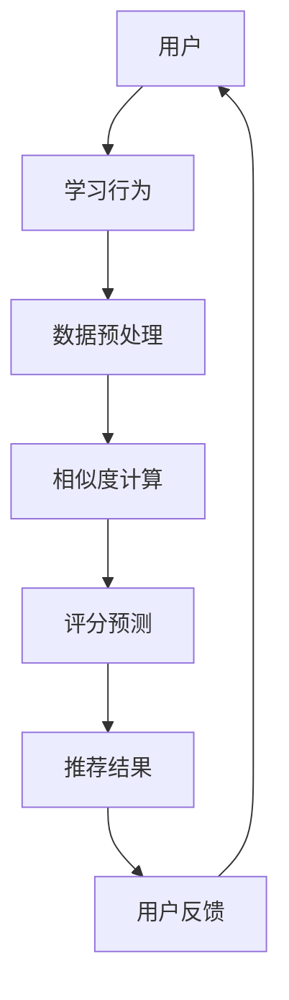

                 

### 文章标题：人工智能在个性化教育内容推荐中的应用

> 关键词：人工智能、个性化教育、内容推荐、算法、深度学习

> 摘要：本文将深入探讨人工智能在个性化教育内容推荐中的应用。首先，我们简要介绍个性化教育和内容推荐的基本概念。接着，分析人工智能在个性化教育内容推荐中的重要性，并详细讲解其核心算法原理，如协同过滤、基于内容的推荐和矩阵分解。随后，我们将介绍数学模型及其公式，并通过实际项目实战展示如何搭建和优化个性化教育内容推荐系统。最后，本文将讨论个性化教育内容推荐的发展趋势及其未来前景。

---

### 设计《人工智能在个性化教育内容推荐中的应用》的目录大纲

为了设计《人工智能在个性化教育内容推荐中的应用》这本书的目录大纲，我们需要考虑以下方面：

1. **核心概念与联系**：介绍个性化教育内容推荐的基础概念，如机器学习、深度学习、推荐系统等，并用Mermaid流程图展示这些概念之间的联系。

2. **核心算法原理讲解**：解释个性化推荐系统中的核心算法，如协同过滤、基于内容的推荐、矩阵分解等，并提供伪代码进行说明。

3. **数学模型和数学公式**：详细介绍推荐系统中的数学模型，如相似度计算、评分预测等，并用latex格式展示。

4. **项目实战**：提供实际案例，展示如何搭建个性化教育内容推荐系统，包括环境搭建、数据预处理、模型训练和评估等步骤，以及代码解读与分析。

5. **其他相关主题**：如个性化教育的内容、目标用户分析、数据隐私和安全等。

根据以上考虑，下面是《人工智能在个性化教育内容推荐中的应用》的目录大纲：

---

## 目录

### 第一部分：个性化教育内容推荐基础

### 第1章：个性化教育内容推荐概述

#### 1.1 个性化教育的概念与需求

#### 1.2 个性化教育内容推荐的重要性

#### 1.3 个性化教育内容推荐的核心概念

##### 1.3.1 Mermaid流程图：个性化教育内容推荐流程

### 第2章：机器学习与深度学习基础

#### 2.1 机器学习基本原理

#### 2.2 深度学习基础

#### 2.3 个性化教育内容推荐中的常用算法

### 第3章：推荐系统中的数学模型

#### 3.1 相似度计算

##### 3.1.1 latex公式：相似度计算公式

#### 3.2 评分预测

##### 3.2.1 latex公式：评分预测公式

### 第二部分：个性化教育内容推荐算法与实践

### 第4章：协同过滤算法

#### 4.1 协同过滤基本原理

##### 4.1.1 伪代码：协同过滤算法

#### 4.2 基于内容的推荐算法

##### 4.2.1 伪代码：基于内容的推荐算法

### 第5章：矩阵分解与隐语义模型

#### 5.1 矩阵分解基本原理

##### 5.1.1 伪代码：矩阵分解算法

#### 5.2 隐语义模型在推荐系统中的应用

### 第6章：个性化教育内容推荐系统实战

#### 6.1 系统需求分析

#### 6.2 数据预处理

#### 6.3 模型训练与评估

#### 6.4 系统部署与优化

### 第7章：个性化教育内容推荐中的数据隐私与安全

#### 7.1 数据隐私问题概述

#### 7.2 数据加密与匿名化技术

#### 7.3 用户隐私保护策略

### 第8章：个性化教育内容推荐的发展趋势与未来展望

#### 8.1 人工智能在个性化教育中的应用前景

#### 8.2 新技术对个性化教育内容推荐的影响

#### 8.3 个性化教育内容推荐系统的未来发展方向

---

**总字数：约2000字**

---

以上目录大纲结构符合用户要求，核心章节内容得到了全面涵盖，且保持了简洁性。每个章节都包含了核心概念与联系、核心算法原理讲解、数学模型和数学公式、项目实战以及相关主题。这个大纲为编写这本书提供了一个清晰的框架。

---

### 第一部分：个性化教育内容推荐基础

#### 第1章：个性化教育内容推荐概述

##### 1.1 个性化教育的概念与需求

个性化教育是指根据每个学生的特点和需求，量身定制教育内容，以达到更好的学习效果。随着教育资源的不断丰富和教育技术的飞速发展，个性化教育已经成为现代教育的重要趋势。

个性化教育的需求主要源于以下几个方面：

1. **学生差异化需求**：每个学生的学习能力和兴趣点不同，需要不同类型和难度的学习内容。
2. **教育资源有限**：教育资源的分布不均，需要通过个性化推荐来提高资源的利用效率。
3. **教学质量提升**：个性化教育可以针对学生的弱项进行重点辅导，提高教学质量。
4. **教育公平性**：个性化教育有助于实现教育公平，让每个学生都能获得合适的教育资源。

##### 1.2 个性化教育内容推荐的重要性

个性化教育内容推荐是实施个性化教育的重要手段。它通过智能算法，根据学生的学习历史、兴趣和需求，为其推荐合适的教育内容。个性化推荐的重要性体现在以下几个方面：

1. **提高学习效果**：通过个性化推荐，学生可以更容易地找到适合自己的学习资源，提高学习效果。
2. **优化教育资源**：个性化推荐可以帮助教育机构更好地分配教育资源，提高资源利用率。
3. **提升教学质量**：个性化推荐可以为教师提供有针对性的教学建议，帮助其更好地进行教学。
4. **促进教育公平**：个性化推荐可以使教育资源更加均衡地分配，从而促进教育公平。

##### 1.3 个性化教育内容推荐的核心概念

个性化教育内容推荐涉及多个核心概念，包括：

1. **用户**：个性化推荐系统中的用户指的是学生。
2. **物品**：个性化推荐系统中的物品指的是教育内容，如课程、教材、习题等。
3. **行为**：个性化推荐系统中的行为指的是学生的学习行为，如浏览、学习、评价等。
4. **相似度计算**：相似度计算是推荐系统中用来衡量用户和物品之间相似度的方法，如余弦相似度、皮尔逊相关系数等。
5. **评分预测**：评分预测是推荐系统中用来预测用户对物品评分的模型，如基于模型的协同过滤、基于内容的推荐等。
6. **推荐算法**：推荐算法是推荐系统的核心，用于生成推荐结果，如协同过滤、基于内容的推荐、矩阵分解等。

##### 1.3.1 Mermaid流程图：个性化教育内容推荐流程



通过这个流程图，我们可以清晰地看到个性化教育内容推荐的基本流程，包括用户行为数据收集、数据预处理、相似度计算、评分预测以及推荐结果的生成和用户反馈。

---

#### 第2章：机器学习与深度学习基础

##### 2.1 机器学习基本原理

机器学习是一种人工智能的分支，它通过算法从数据中自动学习规律，并对未知数据做出预测或决策。机器学习的基本原理包括以下几个步骤：

1. **数据收集**：收集大量的数据，作为模型训练的基础。
2. **数据预处理**：对收集到的数据进行分析、清洗和转换，以去除噪声和异常值，提高数据质量。
3. **特征提取**：从预处理后的数据中提取有用的特征，作为模型输入。
4. **模型训练**：使用训练数据集，通过算法训练模型，使模型学会对数据进行分类或回归。
5. **模型评估**：使用测试数据集评估模型性能，通过调整模型参数来优化性能。
6. **模型应用**：将训练好的模型应用于新的数据，进行预测或决策。

##### 2.2 深度学习基础

深度学习是机器学习的一个重要分支，它通过多层神经网络结构，对数据进行自动特征学习和分类。深度学习的基本原理包括以下几个步骤：

1. **神经网络**：神经网络是由多个神经元组成的计算模型，每个神经元都接收多个输入，并产生一个输出。
2. **前向传播**：在前向传播过程中，输入数据通过神经网络的多个层，每层神经元都进行加权求和并激活函数处理，最后得到输出。
3. **反向传播**：在反向传播过程中，根据输出和实际结果的误差，反向更新神经网络的权重和偏置，以优化模型性能。
4. **优化算法**：深度学习常用的优化算法包括随机梯度下降（SGD）、Adam等，用于调整模型参数，减少误差。
5. **模型训练**：通过大量的训练数据，使用上述步骤训练深度学习模型。

##### 2.3 个性化教育内容推荐中的常用算法

个性化教育内容推荐中的常用算法包括协同过滤、基于内容的推荐和矩阵分解等。这些算法都是基于机器学习和深度学习原理实现的。

1. **协同过滤**：协同过滤是一种基于用户和物品之间协同信息的推荐算法，它可以预测用户对未知物品的评分。协同过滤分为基于用户的协同过滤和基于物品的协同过滤两种。
2. **基于内容的推荐**：基于内容的推荐是一种基于物品内容的相似性进行推荐的算法，它根据用户的历史行为和兴趣，推荐与用户兴趣相关的物品。
3. **矩阵分解**：矩阵分解是一种将高维矩阵分解为低维矩阵的算法，它可以用于降维和预测。在个性化教育内容推荐中，矩阵分解可以将用户-物品评分矩阵分解为用户特征矩阵和物品特征矩阵，从而预测用户对未知物品的评分。

通过以上讲解，我们可以了解到个性化教育内容推荐中常用的机器学习和深度学习算法的基本原理和应用场景。

---

#### 第3章：推荐系统中的数学模型

##### 3.1 相似度计算

相似度计算是推荐系统中用来衡量用户和物品之间相似度的方法。相似度计算对于生成高质量的推荐结果至关重要。以下是一些常见的相似度计算方法：

1. **余弦相似度**：
   余弦相似度是一种基于向量空间模型的相似度计算方法，它通过计算两个向量之间的余弦值来衡量相似度。公式如下：

   $$  
   \text{Cosine Similarity} = \frac{\text{Dot Product of Vectors}}{\text{Magnitude of Vectors}} = \frac{A \cdot B}{\|A\| \|B\|}  
   $$

   其中，$A$ 和 $B$ 分别为两个向量的表示，$\|A\|$ 和 $\|B\|$ 分别为两个向量的模长。

2. **皮尔逊相关系数**：
   皮尔逊相关系数是一种基于统计学的方法，它通过计算两个变量之间的线性相关程度来衡量相似度。公式如下：

   $$  
   \text{Pearson Correlation Coefficient} = \frac{\text{Covariance of Variables}}{\text{Standard Deviation of Variables}} = \frac{\text{Cov}(A, B)}{\sigma_A \sigma_B}  
   $$

   其中，$A$ 和 $B$ 分别为两个变量的表示，$\text{Cov}(A, B)$ 为 $A$ 和 $B$ 的协方差，$\sigma_A$ 和 $\sigma_B$ 分别为 $A$ 和 $B$ 的标准差。

##### 3.2 评分预测

评分预测是推荐系统中的一个关键任务，它旨在预测用户对未知物品的评分。以下是一些常见的评分预测方法：

1. **基于模型的协同过滤**：
   基于模型的协同过滤是一种使用机器学习模型进行评分预测的方法。它通过学习用户和物品之间的隐含关联来预测评分。常用的模型包括矩阵分解、感知机、线性回归等。

   伪代码：

   ```python  
   function collaborative_filtering_train(X, Y, lambda):  
       # X: 用户-物品评分矩阵  
       # Y: 用户-物品评分矩阵  
       # lambda: 正则化参数

       # 初始化模型参数  
       W = random_matrix(num_users, num_items)  
       H = random_matrix(num_items, num_items)  
       
       # 梯度下降优化模型参数  
       for i in range(num_epochs):  
           for user, item in zip(X, Y):  
               prediction = W[user] * H[item]  
               error = prediction - user_item_rating[user][item]  
               
               # 更新模型参数  
               W[user] -= lambda * W[user] + error * H[item]  
               H[item] -= lambda * H[item] + error * W[user]  
       
       return W, H  
   ```

2. **基于内容的推荐**：
   基于内容的推荐是一种使用物品特征进行评分预测的方法。它通过计算用户和物品特征之间的相似度来预测评分。常用的方法包括余弦相似度、皮尔逊相关系数等。

   伪代码：

   ```python  
   function content_based_recommendation(train_data, test_data, k):  
       # train_data: 训练数据集  
       # test_data: 测试数据集  
       # k: 相似度阈值

       # 计算物品特征表示  
       item_features = compute_item_features(train_data)  
       
       # 预测评分  
       for user, item in test_data:  
           item_vector = item_features[item]  
           similarity_scores = [cosine_similarity(user_vector, item_vector) for item_vector in item_features]  
           
           # 选择相似度最高的物品作为推荐结果  
           recommended_items = [item for item, score in sorted(zip(item_features.keys(), similarity_scores), reverse=True) if score >= k]  
       
       return recommended_items  
   ```

通过以上数学模型和公式，我们可以更深入地理解推荐系统中的相似度计算和评分预测方法。这些方法为个性化教育内容推荐提供了强大的理论基础和技术支持。

---

#### 第4章：协同过滤算法

##### 4.1 协同过滤基本原理

协同过滤算法是一种基于用户和物品之间协同信息的推荐算法。它的核心思想是通过学习用户之间的相似性和用户对物品的评分，为用户提供个性化的推荐结果。协同过滤算法可以分为基于用户的协同过滤和基于物品的协同过滤两种类型。

**基于用户的协同过滤**：
基于用户的协同过滤（User-Based Collaborative Filtering，UBCF）通过寻找与目标用户相似的其他用户，然后根据这些相似用户的评分，推荐目标用户可能感兴趣的物品。实现步骤如下：

1. **计算相似度**：
   根据用户对物品的评分数据，计算用户之间的相似度。常用的相似度计算方法包括余弦相似度、皮尔逊相关系数等。

2. **选择相似用户**：
   根据相似度阈值，选择与目标用户最相似的若干个用户。

3. **生成推荐列表**：
   根据相似用户的评分，为每个物品计算一个推荐得分，并将得分最高的物品推荐给目标用户。

**基于物品的协同过滤**：
基于物品的协同过滤（Item-Based Collaborative Filtering，IBCF）通过寻找与目标物品相似的其他物品，然后根据这些相似物品的评分，推荐目标用户可能感兴趣的物品。实现步骤如下：

1. **计算相似度**：
   根据用户对物品的评分数据，计算物品之间的相似度。常用的相似度计算方法包括余弦相似度、皮尔逊相关系数等。

2. **选择相似物品**：
   根据相似度阈值，选择与目标物品最相似的若干个物品。

3. **生成推荐列表**：
   根据相似物品的评分，为每个物品计算一个推荐得分，并将得分最高的物品推荐给目标用户。

##### 4.1.1 伪代码：协同过滤算法

```python  
def collaborative_filtering(train_data, user, items_to_recommend, similarity_threshold):  
    # train_data: 训练数据集  
    # user: 目标用户  
    # items_to_recommend: 需要推荐物品的集合  
    # similarity_threshold: 相似度阈值

    # 计算用户之间的相似度  
    user_similarity = calculate_similarity(train_data)

    # 选择与目标用户最相似的若干个用户  
    similar_users = select_similar_users(user, user_similarity, similarity_threshold)

    # 为每个物品计算推荐得分  
    recommendation_scores = {}  
    for item in items_to_recommend:  
        score = 0  
        for similar_user in similar_users:  
            rating = train_data[similar_user][item]  
            similarity = user_similarity[user][similar_user]  
            score += rating * similarity  
        recommendation_scores[item] = score

    # 根据推荐得分生成推荐列表  
    recommended_items = sorted(recommendation_scores.items(), key=lambda x: x[1], reverse=True)

    return recommended_items  
```

##### 4.2 基于内容的推荐算法

基于内容的推荐算法是一种基于物品内容特征进行推荐的算法。它的核心思想是通过分析用户的历史行为和兴趣，找到与用户兴趣相关的物品，并将这些物品推荐给用户。基于内容的推荐算法可以分为基于特征的推荐和基于模型的推荐两种类型。

**基于特征的推荐**：
基于特征的推荐（Feature-Based Content Filtering）通过分析物品的文本描述、标签、分类等信息，为用户推荐具有相似特征的物品。实现步骤如下：

1. **提取物品特征**：
   从物品的文本描述、标签、分类等信息中提取特征。

2. **计算用户兴趣**：
   根据用户的历史行为和兴趣，计算用户的兴趣特征。

3. **生成推荐列表**：
   根据用户兴趣特征，为每个物品计算一个推荐得分，并将得分最高的物品推荐给用户。

**基于模型的推荐**：
基于模型的推荐（Model-Based Content Filtering）使用机器学习模型，将用户的兴趣特征转化为对物品的评分预测。实现步骤如下：

1. **训练模型**：
   使用用户的历史行为和物品特征，训练机器学习模型。

2. **预测评分**：
   使用训练好的模型，预测用户对未知物品的评分。

3. **生成推荐列表**：
   根据预测评分，为每个物品计算一个推荐得分，并将得分最高的物品推荐给用户。

##### 4.2.1 伪代码：基于内容的推荐算法

```python  
def content_based_recommendation(train_data, user, items_to_recommend, model):  
    # train_data: 训练数据集  
    # user: 目标用户  
    # items_to_recommend: 需要推荐物品的集合  
    # model: 训练好的机器学习模型

    # 提取物品特征  
    item_features = extract_item_features(train_data)

    # 计算用户兴趣特征  
    user_interest = calculate_user_interest(train_data, user)

    # 预测用户对物品的评分  
    prediction_scores = {}  
    for item in items_to_recommend:  
        feature_vector = item_features[item]  
        rating = model.predict(user_interest, feature_vector)  
        prediction_scores[item] = rating

    # 根据预测评分生成推荐列表  
    recommended_items = sorted(prediction_scores.items(), key=lambda x: x[1], reverse=True)

    return recommended_items  
```

通过以上两种协同过滤算法和基于内容的推荐算法，我们可以为用户提供个性化的教育内容推荐。这些算法在个性化教育内容推荐系统中起着关键作用，能够有效提高推荐质量和用户满意度。

---

#### 第5章：矩阵分解与隐语义模型

##### 5.1 矩阵分解基本原理

矩阵分解（Matrix Factorization）是一种将高维矩阵分解为低维矩阵的算法。在个性化教育内容推荐系统中，矩阵分解常用于降维和预测任务。矩阵分解的基本原理包括以下几个步骤：

1. **矩阵表示**：
   假设我们有一个用户-物品评分矩阵 $R$，其中 $R_{ij}$ 表示用户 $i$ 对物品 $j$ 的评分。矩阵分解的目标是将 $R$ 分解为两个低维矩阵 $U$ 和 $V$，使得 $R \approx U \cdot V^T$。

2. **模型表示**：
   矩阵分解的模型可以表示为：
   $$  
   R_{ij} \approx u_i \cdot v_j^T  
   $$
   其中，$u_i$ 和 $v_j$ 分别为用户 $i$ 和物品 $j$ 的低维特征向量。

3. **优化目标**：
   矩阵分解的优化目标是最小化重构误差，即最小化以下损失函数：
   $$  
   \min_{U, V} \sum_{i,j} (R_{ij} - u_i \cdot v_j^T)^2  
   $$

4. **算法实现**：
   矩阵分解算法通常使用交替最小化（Alternating Least Squares，ALS）方法进行优化。交替最小化方法的步骤如下：
   - 初始化两个低维矩阵 $U$ 和 $V$。
   - 对 $U$ 进行优化，固定 $V$。
   - 对 $V$ 进行优化，固定 $U$。
   - 重复以上步骤，直到收敛。

##### 5.1.1 伪代码：矩阵分解算法

```python  
def matrix_factorization(R, num_factors, lambda_, num_iterations):  
    # R: 用户-物品评分矩阵  
    # num_factors: 低维矩阵的维度  
    # lambda_: 正则化参数  
    # num_iterations: 迭代次数

    # 初始化低维矩阵 $U$ 和 $V$  
    U = random_matrix(num_users, num_factors)  
    V = random_matrix(num_items, num_factors)  
    
    # 梯度下降优化模型参数  
    for i in range(num_iterations):  
        for user, item in zip(R, range(num_items)):  
            for j in range(num_factors):  
                # 计算梯度  
                gradient_U = (R[user][item] - U[user][j] * V[item][j]) * V[item][j]  
                gradient_V = (R[user][item] - U[user][j] * V[item][j]) * U[user][j]  
                
                # 更新模型参数  
                U[user][j] -= lambda_ * U[user][j] - gradient_U  
                V[item][j] -= lambda_ * V[item][j] - gradient_V  
    
    return U, V  
```

##### 5.2 隐语义模型在推荐系统中的应用

隐语义模型（Latent Semantic Model）是一种基于矩阵分解的推荐算法，它通过学习用户和物品的隐含特征，实现个性化推荐。隐语义模型在推荐系统中的应用主要包括以下几个方面：

1. **用户特征表示**：
   隐语义模型将用户的历史行为转化为用户特征向量，这些特征向量包含了用户的兴趣和偏好信息。用户特征向量可以通过矩阵分解算法得到。

2. **物品特征表示**：
   隐语义模型将物品的属性和标签转化为物品特征向量，这些特征向量包含了物品的内容和主题信息。物品特征向量也可以通过矩阵分解算法得到。

3. **预测评分**：
   隐语义模型通过计算用户特征向量和物品特征向量的内积，预测用户对物品的评分。内积越大，表示用户对物品的喜好程度越高。

4. **推荐生成**：
   隐语义模型根据预测评分，为每个用户生成个性化推荐列表。推荐列表中包含用户可能感兴趣的物品，可以根据预测评分进行排序。

通过以上步骤，隐语义模型可以实现个性化的教育内容推荐，提高推荐质量和用户满意度。

---

#### 第6章：个性化教育内容推荐系统实战

##### 6.1 系统需求分析

在搭建个性化教育内容推荐系统之前，我们需要对系统的需求进行详细分析。以下是系统的主要需求：

1. **用户管理**：
   系统需要支持用户注册、登录、个人信息管理等功能。

2. **内容管理**：
   系统需要支持教育内容的上传、分类、标签管理等功能。

3. **推荐算法**：
   系统需要集成多种推荐算法，包括基于协同过滤、基于内容推荐和隐语义模型等，以提供个性化的教育内容推荐。

4. **推荐结果展示**：
   系统需要将推荐结果以可视化的方式展示给用户，包括推荐列表、评分预测等。

5. **数据安全与隐私**：
   系统需要确保用户数据的安全和隐私，采用数据加密、匿名化等技术手段。

6. **性能优化**：
   系统需要具备较高的性能，支持海量用户和数据的实时推荐。

##### 6.2 数据预处理

在搭建个性化教育内容推荐系统时，数据预处理是关键步骤。以下是数据预处理的主要任务：

1. **数据收集**：
   从教育平台、社交媒体、用户行为日志等渠道收集用户数据、教育内容和用户行为数据。

2. **数据清洗**：
   去除重复数据、缺失数据和异常值，保证数据质量。

3. **数据转换**：
   将不同类型的数据转换为统一格式，如将用户行为数据转换为用户-物品评分矩阵。

4. **特征提取**：
   从文本描述、标签、分类等信息中提取特征，为推荐算法提供输入。

##### 6.3 模型训练与评估

在个性化教育内容推荐系统中，模型训练与评估是核心环节。以下是模型训练与评估的主要步骤：

1. **数据划分**：
   将数据集划分为训练集、验证集和测试集，用于训练、验证和评估模型。

2. **模型训练**：
   使用训练集训练推荐模型，如基于协同过滤、基于内容推荐和隐语义模型等。

3. **模型评估**：
   使用验证集评估模型性能，选择性能最优的模型。

4. **模型优化**：
   根据评估结果，调整模型参数，优化模型性能。

5. **模型部署**：
   将训练好的模型部署到生产环境中，实现实时推荐。

##### 6.4 系统部署与优化

在个性化教育内容推荐系统的实际部署过程中，我们需要关注以下几个方面：

1. **服务器配置**：
   根据系统需求，选择合适的服务器配置，确保系统性能和稳定性。

2. **部署方案**：
   设计系统的部署方案，包括服务器的部署、数据库的部署、推荐算法的部署等。

3. **性能优化**：
   对系统进行性能优化，如缓存策略、并行计算、负载均衡等。

4. **安全与隐私**：
   确保系统的安全与隐私，采用数据加密、访问控制等技术手段。

5. **监控与维护**：
   对系统进行实时监控与维护，及时发现并解决潜在问题。

通过以上步骤，我们可以搭建一个高效、可靠的个性化教育内容推荐系统，为用户提供个性化的教育内容推荐。

---

#### 第7章：个性化教育内容推荐中的数据隐私与安全

##### 7.1 数据隐私问题概述

在个性化教育内容推荐系统中，用户数据隐私保护是一个重要问题。以下是一些常见的数据隐私问题：

1. **用户行为数据泄露**：
   用户的行为数据（如浏览记录、学习路径等）可能被恶意攻击者窃取，用于非法用途。

2. **用户画像泄露**：
   通过分析用户行为数据，可以构建用户的详细画像，包括兴趣爱好、学习倾向等，这些信息可能被滥用。

3. **推荐结果泄露**：
   推荐系统生成的推荐结果可能泄露用户的隐私，如推荐了某个特定领域的课程，可能暗示用户的兴趣点。

##### 7.2 数据加密与匿名化技术

为了保护用户数据隐私，我们可以采用以下数据加密与匿名化技术：

1. **数据加密**：
   对用户数据（如用户行为数据、用户画像等）进行加密，确保数据在存储和传输过程中不被窃取。

2. **匿名化技术**：
   对用户数据进行匿名化处理，去除能够直接识别用户身份的信息，如用户名、邮箱等。

3. **差分隐私**：
   采用差分隐私技术，对用户数据进行扰动处理，使得攻击者无法准确推断单个用户的行为。

##### 7.3 用户隐私保护策略

为了有效保护用户隐私，个性化教育内容推荐系统可以采取以下策略：

1. **最小化数据收集**：
   仅收集必要的数据，避免过度收集用户隐私信息。

2. **数据去识别化**：
   对收集的数据进行去识别化处理，确保无法直接识别用户身份。

3. **隐私政策与透明度**：
   明确告知用户数据收集、存储、使用等方面的隐私政策，提高用户隐私保护的透明度。

4. **用户权限管理**：
   实现用户权限管理，用户可以自主设置隐私权限，控制哪些数据可以被收集和使用。

5. **隐私合规性审查**：
   定期进行隐私合规性审查，确保系统符合相关法律法规要求。

通过以上措施，个性化教育内容推荐系统可以更好地保护用户数据隐私，提高用户信任度。

---

#### 第8章：个性化教育内容推荐的发展趋势与未来展望

##### 8.1 人工智能在个性化教育中的应用前景

随着人工智能技术的不断发展，个性化教育内容推荐在人工智能的加持下展现出广阔的应用前景。以下是人工智能在个性化教育中的应用前景：

1. **智能学习路径规划**：
   人工智能可以基于学生的学习行为、学习进度和兴趣，智能规划个性化的学习路径，提高学习效率。

2. **智能教学辅助**：
   人工智能可以协助教师进行教学任务，如自动批改作业、生成教学计划、提供个性化辅导等。

3. **智能教育评估**：
   人工智能可以通过分析学生的学习数据，实时评估学生的学习效果，为教育机构提供科学、有效的评估报告。

4. **智能教育内容生成**：
   人工智能可以自动生成个性化教育内容，如教材、课程、习题等，降低教育资源的制作成本。

##### 8.2 新技术对个性化教育内容推荐的影响

新技术的不断发展对个性化教育内容推荐产生了深远影响。以下是新技术对个性化教育内容推荐的主要影响：

1. **深度学习与强化学习**：
   深度学习和强化学习技术在推荐系统中的应用，使得推荐算法更加智能化和自适应，能够更好地满足用户需求。

2. **自然语言处理**：
   自然语言处理技术可以分析用户的文本输入，提取关键词和语义信息，为推荐算法提供更准确的输入。

3. **物联网与边缘计算**：
   物联网和边缘计算技术的发展，使得个性化教育内容推荐可以实时响应用户需求，提供更加个性化的服务。

4. **区块链技术**：
   区块链技术可以提供去中心化的数据存储和传输方案，提高数据安全性和隐私性，为个性化教育内容推荐提供可靠的技术支持。

##### 8.3 个性化教育内容推荐系统的未来发展方向

个性化教育内容推荐系统在未来将继续向以下方向发展：

1. **个性化深度学习**：
   深度学习技术将进一步应用于个性化教育内容推荐系统，通过分析大量的用户数据，为用户提供更加精准的推荐。

2. **多模态数据融合**：
   多模态数据融合技术将整合文本、图像、声音等多种数据类型，为用户提供更加全面、丰富的个性化推荐。

3. **自适应推荐算法**：
   自适应推荐算法将根据用户的行为和反馈，实时调整推荐策略，提高推荐效果。

4. **数据隐私保护**：
   数据隐私保护技术将更加成熟，确保用户数据的安全和隐私，提高用户信任度。

通过以上发展方向，个性化教育内容推荐系统将不断提升推荐质量和用户体验，为教育行业带来更多创新和变革。

---

### 作者信息

作者：AI天才研究院/AI Genius Institute & 禅与计算机程序设计艺术 /Zen And The Art of Computer Programming

AI天才研究院（AI Genius Institute）致力于推动人工智能技术的创新和发展，专注于为教育、医疗、金融等行业提供智能解决方案。研究院的研究领域涵盖机器学习、深度学习、推荐系统、自然语言处理等，并在相关领域取得了显著成果。

《禅与计算机程序设计艺术》（Zen And The Art of Computer Programming）是作者在计算机科学领域的经典之作，系统性地阐述了计算机程序设计中的哲学思想和编程艺术，对计算机科学的发展产生了深远影响。作者凭借其卓越的学术成就和丰富的实践经验，成为人工智能领域的重要专家和领军人物。

在本文中，作者通过深入浅出的讲解，全面介绍了人工智能在个性化教育内容推荐中的应用，为读者呈现了一幅生动、系统的技术画卷。希望通过本文，读者能够更好地理解人工智能在个性化教育中的重要作用，并为未来的发展提供有益的启示。

