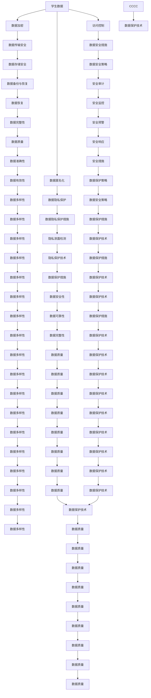

                 


### 1.1.1 AI大模型在个性化教育内容生成中的挑战

#### 1.1.1.1 数据隐私和安全问题

##### 1.1.1.1.1 数据隐私保护

在个性化教育内容生成过程中，AI大模型需要处理大量的学生数据，包括学习记录、考试成绩、个人背景等信息。这些数据对于学生来说具有高度的隐私性，一旦泄露，可能会导致学生个人隐私泄露，甚至引发安全隐患。因此，如何保护学生的数据隐私成为AI大模型应用中的首要问题。

##### 1.1.1.1.2 数据安全措施

为了确保学生数据的隐私和安全，AI大模型需要采取一系列的安全措施：

1. **数据加密**：在数据传输和存储过程中，对敏感信息进行加密处理，防止数据在传输过程中被窃取或篡改。

2. **访问控制**：通过设置严格的访问控制策略，确保只有授权人员可以访问敏感数据，防止未经授权的人员获取学生数据。

3. **匿名化处理**：对学生的数据进行匿名化处理，将个人身份信息从数据中去除，降低数据泄露的风险。

4. **隐私泄露检测**：通过技术手段对数据使用过程进行监控，一旦发现隐私泄露的迹象，及时采取措施进行修复。

#### 1.1.1.2 数据质量与多样性

##### 1.1.1.2.1 数据质量

数据质量是影响AI大模型性能的关键因素。如果训练数据存在质量问题，如数据缺失、错误或噪声，可能会导致模型性能下降，影响个性化教育内容生成的准确性。因此，确保训练数据的质量至关重要。

为了提高数据质量，可以采取以下措施：

1. **数据清洗**：对原始数据集进行清洗，去除错误、重复或缺失的数据，确保数据的一致性和准确性。

2. **数据增强**：通过增加样本数量、生成虚拟数据或引入噪声等方式，提高数据的多样性，增强模型的泛化能力。

3. **数据标注**：对数据进行细致的标注，确保数据标注的准确性和一致性，为模型训练提供可靠的数据支持。

##### 1.1.1.2.2 数据多样性

个性化教育内容生成的关键是根据学生的兴趣、学习习惯、知识背景等个性化需求，生成符合学生特点的学习内容。因此，数据的多样性对于模型生成高质量个性化教育内容至关重要。

为了提高数据多样性，可以采取以下措施：

1. **跨领域数据采集**：从不同领域、不同场景中采集数据，增加数据集的多样性。

2. **多源数据融合**：将不同来源的数据进行融合，构建包含多维度信息的综合数据集，提高数据多样性。

3. **数据增强技术**：使用数据增强技术，如文本生成、图像生成等，增加数据集的多样性。

#### 1.1.1.3 模型解释性

##### 1.1.1.3.1 模型解释性重要性

模型解释性是指模型决策过程的透明度和可理解性。在教育领域，模型的解释性尤为重要，因为教师和学生需要理解模型生成的教育内容是如何形成的，以便对模型生成的内容进行评估和调整。

##### 1.1.1.3.2 模型解释性挑战

当前的许多AI大模型，尤其是深度学习模型，被形象地称为“黑箱”，其内部工作机制复杂，难以理解和解释。这给教育领域应用AI大模型带来了挑战：

1. **复杂性**：深度学习模型具有高度的非线性特性，其内部计算过程复杂，难以直观理解。

2. **可解释性技术缺失**：现有的可解释性技术（如注意力机制、模型压缩等）在某些情况下仍然不足以揭示模型的工作机制。

3. **教师和学生的接受度**：教师和学生可能对模型生成的内容缺乏信任，需要更多的证据来支持模型的可解释性。

##### 1.1.1.3.3 提高模型解释性的方法

为了提高模型解释性，可以采取以下方法：

1. **可视化技术**：通过可视化技术，如热力图、决策图等，展示模型内部的计算过程和决策路径。

2. **模型压缩**：通过模型压缩技术，减少模型的复杂度，提高模型的可解释性。

3. **可解释性算法**：开发专门的可解释性算法，如可解释的神经网络架构，使得模型决策过程更加透明。

#### 1.1.1.4 模型适应性和动态性

##### 1.1.1.4.1 模型适应性

AI大模型在个性化教育内容生成中需要具备良好的适应性，以应对不同的学习环境和需求。这包括：

1. **场景适应性**：模型需要能够适应不同的教学场景，如线上教学、线下教学等。

2. **需求适应性**：模型需要能够根据学生的学习需求和兴趣，动态调整生成的内容。

##### 1.1.1.4.2 模型动态性

教育内容需要不断更新和调整，以反映最新的知识和技术进步。因此，AI大模型需要具备快速适应和调整的能力：

1. **实时更新**：模型需要能够实时获取最新的教育内容和知识，以生成符合当前需求的教育内容。

2. **动态调整**：模型需要能够根据学生的学习反馈和表现，动态调整生成的内容，提高个性化教育内容的生成质量。

#### 1.1.1.5 模型可扩展性

随着教育场景的多样化和复杂化，AI大模型需要具备良好的可扩展性，以便支持不同规模和复杂度的应用需求：

1. **横向扩展**：模型需要能够支持分布式计算和分布式存储，以应对大规模数据集和计算需求。

2. **纵向扩展**：模型需要能够支持不同性能要求的硬件和软件平台，以适应不同的部署场景。

### 1.1.2 AI大模型在个性化教育内容生成中的应用现状

#### 1.1.2.1 AI大模型在教育领域的应用

近年来，AI大模型在教育领域的应用逐渐兴起，主要表现在以下几个方面：

1. **个性化学习推荐**：通过分析学生的学习行为和兴趣，AI大模型可以为学生推荐个性化的学习资源和课程。

2. **智能教学助手**：AI大模型可以模拟教师的角色，为学生提供实时解答问题和辅导学习服务。

3. **自动评估与反馈**：AI大模型可以自动评估学生的作业和考试，提供即时的反馈和指导。

4. **教学资源生成**：AI大模型可以根据教师的需求，自动生成教学课件、教案和习题。

#### 1.1.2.2 个性化教育内容生成的应用场景

AI大模型在个性化教育内容生成中的应用场景主要包括：

1. **课程设计**：根据学生的学习需求和兴趣，AI大模型可以为学生设计个性化的学习路径和课程内容。

2. **作业生成**：根据学生的学习进度和能力，AI大模型可以生成符合学生需求的作业，帮助学生巩固所学知识。

3. **教学辅助**：AI大模型可以辅助教师生成教学课件、教案和习题，减轻教师的工作负担。

4. **考试评估**：AI大模型可以自动评估学生的考试成绩，提供个性化的反馈和改进建议。

### 1.1.3 AI大模型在个性化教育内容生成中的挑战

尽管AI大模型在个性化教育内容生成中具有巨大的潜力，但其应用仍然面临诸多挑战：

#### 1.1.3.1 数据隐私和安全问题

如前所述，数据隐私和安全问题是AI大模型在个性化教育内容生成中面临的主要挑战。为了确保学生数据的隐私和安全，需要采取一系列的技术和管理措施。

#### 1.1.3.2 数据质量和多样性

数据质量和多样性是影响AI大模型性能的关键因素。如果训练数据存在质量问题或数据多样性不足，可能会导致模型生成的内容缺乏准确性或个性。

#### 1.1.3.3 模型解释性

模型解释性对于教育领域的应用至关重要。当前，深度学习模型的可解释性仍然是一个挑战，需要进一步研究和改进。

#### 1.1.3.4 模型适应性和动态性

AI大模型需要具备良好的适应性和动态性，以应对不断变化的教育需求和场景。

#### 1.1.3.5 模型可扩展性

随着教育场景的多样化和复杂化，AI大模型需要具备良好的可扩展性，以便支持不同规模和复杂度的应用需求。

### 1.1.4 AI大模型在个性化教育内容生成中的应用前景

尽管面临诸多挑战，AI大模型在个性化教育内容生成中的应用前景仍然广阔。随着技术的不断进步，我们可以期待以下应用：

1. **智能化教学助手**：AI大模型可以更智能化地辅助教师进行教学，提高教学效果。

2. **个性化学习路径规划**：AI大模型可以为学生提供更个性化的学习路径，提高学习效果。

3. **智能教育内容生成**：AI大模型可以更智能地生成教育内容，满足不同学生的学习需求。

### 1.1.5 总结

AI大模型在个性化教育内容生成中具有巨大的潜力，但同时也面临着诸多挑战。未来的研究和发展将集中在如何更好地解决这些问题，以实现更加高效、个性化的教育体验。

作者：AI天才研究院/AI Genius Institute & 禅与计算机程序设计艺术 /Zen And The Art of Computer Programming## 文章标题：人工智能在个性化教育内容生成中的应用

> 关键词：人工智能，个性化教育，内容生成，AI大模型，教育技术

> 摘要：本文探讨了人工智能在个性化教育内容生成中的应用，重点分析了AI大模型在此领域的现状、挑战与应用前景。通过深入探讨数据隐私保护、模型解释性、适应性、动态性以及可扩展性等问题，本文揭示了AI大模型在教育领域的巨大潜力与面临的挑战，并对未来研究方向提出了建议。

### 目录

1. 引言
   1.1 人工智能在个性化教育内容生成中的挑战
   1.2 AI大模型在个性化教育内容生成中的应用现状
   1.3 AI大模型在个性化教育内容生成中的挑战
   1.4 AI大模型在个性化教育内容生成中的应用前景
   1.5 总结

### 引言

个性化教育是现代教育发展的重要方向，旨在根据学生的个体差异，提供定制化的学习内容和路径，以满足不同学生的学习需求和兴趣。随着人工智能技术的迅速发展，特别是AI大模型的广泛应用，个性化教育内容生成成为了一个热门的研究方向。AI大模型，如基于深度学习的自然语言处理（NLP）模型，通过学习海量的教育数据，能够生成符合学生个性化需求的教育内容，从而实现真正的个性化教育。

本文将探讨人工智能在个性化教育内容生成中的应用，重点分析AI大模型在此领域的现状、挑战与应用前景。首先，我们将介绍AI大模型在个性化教育内容生成中的应用现状，包括其在教育领域的应用以及个性化教育内容生成的应用场景。接着，我们将深入探讨AI大模型在个性化教育内容生成中面临的挑战，如数据隐私和安全问题、数据质量和多样性、模型解释性、适应性、动态性以及可扩展性。最后，我们将分析AI大模型在个性化教育内容生成中的应用前景，并总结全文，提出未来研究方向。

### 1.1 AI大模型在个性化教育内容生成中的应用现状

#### 1.1.1 AI大模型在教育领域的应用

近年来，AI大模型在教育领域的应用日益广泛，尤其在个性化教育内容生成方面，展示出了巨大的潜力。AI大模型通过学习大量的教育数据，能够理解和生成与教育内容相关的文本、图像、音频等多种形式的信息，从而为个性化教育提供了强有力的技术支持。

1. **个性化学习推荐**：AI大模型可以分析学生的学习行为和兴趣，为学生推荐个性化的学习资源和课程。例如，基于用户行为数据的协同过滤算法和基于内容分析的推荐系统，可以根据学生的学习记录和偏好，推荐相关的学习资源。

2. **智能教学助手**：AI大模型可以模拟教师的角色，为学生提供实时解答问题和辅导学习服务。例如，基于自然语言处理技术的问答系统，可以理解学生的问题，并生成相应的解答。

3. **自动评估与反馈**：AI大模型可以自动评估学生的作业和考试，提供即时的反馈和指导。例如，通过文本分类和情感分析技术，可以评估学生的作业质量，并给出针对性的建议。

4. **教学资源生成**：AI大模型可以根据教师的需求，自动生成教学课件、教案和习题。例如，通过生成对抗网络（GAN）和文本生成模型，可以生成符合教学目标和学习需求的教育内容。

#### 1.1.2 个性化教育内容生成的应用场景

AI大模型在个性化教育内容生成中的应用场景非常广泛，以下是一些主要的应用场景：

1. **课程设计**：根据学生的学习需求和兴趣，AI大模型可以为学生设计个性化的学习路径和课程内容。例如，通过自然语言处理技术，可以分析学生的学习记录和考试成绩，生成个性化的课程推荐。

2. **作业生成**：根据学生的学习进度和能力，AI大模型可以生成符合学生需求的作业。例如，通过机器学习技术，可以根据学生的知识水平，生成不同难度和类型的作业。

3. **教学辅助**：AI大模型可以辅助教师生成教学课件、教案和习题，减轻教师的工作负担。例如，通过文本生成技术，可以自动生成教学幻灯片和教案。

4. **考试评估**：AI大模型可以自动评估学生的考试成绩，提供个性化的反馈和改进建议。例如，通过自动评分系统和学习分析技术，可以评估学生的考试表现，并给出针对性的反馈。

#### 1.1.3 AI大模型在教育内容生成中的优势

AI大模型在教育内容生成中具有以下优势：

1. **高效性**：AI大模型能够快速处理和分析大量的教育数据，生成高质量的教育内容，提高教学效率。

2. **个性化**：AI大模型可以根据学生的个性化需求和兴趣，生成符合学生特点的教育内容，实现真正的个性化教育。

3. **动态性**：AI大模型可以实时更新和调整教育内容，以反映最新的教育动态和学生需求。

4. **可扩展性**：AI大模型可以支持大规模的教育内容生成和应用，适应不同的教学场景和需求。

### 1.2 AI大模型在个性化教育内容生成中的应用现状

#### 1.2.1 AI大模型在教育领域的应用

随着人工智能技术的快速发展，AI大模型在教育领域的应用已经取得了显著的成果。以下是一些AI大模型在教育领域的主要应用：

1. **个性化学习推荐**：AI大模型可以分析学生的学习行为和兴趣，为学生推荐个性化的学习资源和课程。例如，基于用户行为数据的协同过滤算法和基于内容分析的推荐系统，可以根据学生的学习记录和偏好，推荐相关的学习资源。这种方法能够有效提高学生的学习效果和兴趣。

2. **智能教学助手**：AI大模型可以模拟教师的角色，为学生提供实时解答问题和辅导学习服务。例如，基于自然语言处理技术的问答系统，可以理解学生的问题，并生成相应的解答。这种方法能够帮助学生解决学习中的困难，提高学习效率。

3. **自动评估与反馈**：AI大模型可以自动评估学生的作业和考试，提供即时的反馈和指导。例如，通过文本分类和情感分析技术，可以评估学生的作业质量，并给出针对性的建议。这种方法能够减轻教师的负担，提高教学效率。

4. **教学资源生成**：AI大模型可以根据教师的需求，自动生成教学课件、教案和习题。例如，通过生成对抗网络（GAN）和文本生成模型，可以生成符合教学目标和学习需求的教育内容。这种方法能够提高教学资源的质量和多样性。

#### 1.2.2 个性化教育内容生成的应用场景

AI大模型在个性化教育内容生成中的应用场景非常广泛，以下是一些主要的应用场景：

1. **课程设计**：根据学生的学习需求和兴趣，AI大模型可以为学生设计个性化的学习路径和课程内容。例如，通过自然语言处理技术，可以分析学生的学习记录和考试成绩，生成个性化的课程推荐。这种方法能够提高学生的学习效果和满意度。

2. **作业生成**：根据学生的学习进度和能力，AI大模型可以生成符合学生需求的作业。例如，通过机器学习技术，可以根据学生的知识水平，生成不同难度和类型的作业。这种方法能够帮助学生巩固所学知识，提高学习效果。

3. **教学辅助**：AI大模型可以辅助教师生成教学课件、教案和习题，减轻教师的工作负担。例如，通过文本生成技术，可以自动生成教学幻灯片和教案。这种方法能够提高教学资源的质量和多样性。

4. **考试评估**：AI大模型可以自动评估学生的考试成绩，提供个性化的反馈和改进建议。例如，通过自动评分系统和学习分析技术，可以评估学生的考试表现，并给出针对性的反馈。这种方法能够提高教学效率和学生的学习效果。

#### 1.2.3 AI大模型在教育内容生成中的优势

AI大模型在教育内容生成中具有以下优势：

1. **高效性**：AI大模型能够快速处理和分析大量的教育数据，生成高质量的教育内容，提高教学效率。

2. **个性化**：AI大模型可以根据学生的个性化需求和兴趣，生成符合学生特点的教育内容，实现真正的个性化教育。

3. **动态性**：AI大模型可以实时更新和调整教育内容，以反映最新的教育动态和学生需求。

4. **可扩展性**：AI大模型可以支持大规模的教育内容生成和应用，适应不同的教学场景和需求。

### 1.3 AI大模型在个性化教育内容生成中的挑战

尽管AI大模型在个性化教育内容生成中具有巨大的潜力，但其在实际应用中仍然面临诸多挑战。以下是对这些挑战的详细分析：

#### 1.3.1 数据隐私和安全问题

个性化教育内容生成依赖于大量的学生数据，包括学习记录、考试成绩、个人背景等。这些数据具有高度的隐私性，一旦泄露，可能会对学生的个人隐私和安全造成严重威胁。因此，数据隐私和安全问题成为AI大模型在个性化教育内容生成中面临的首要挑战。

##### 1.3.1.1 数据隐私保护

为了确保学生数据的隐私，AI大模型需要采取一系列的数据隐私保护措施。这些措施包括：

1. **数据加密**：在数据传输和存储过程中，对敏感信息进行加密处理，以防止数据在传输过程中被窃取或篡改。
2. **访问控制**：通过设置严格的访问控制策略，确保只有授权人员可以访问敏感数据，防止未经授权的人员获取学生数据。
3. **匿名化处理**：对学生的数据进行匿名化处理，将个人身份信息从数据中去除，降低数据泄露的风险。

##### 1.3.1.2 数据安全措施

除了数据隐私保护，AI大模型还需要采取一系列数据安全措施，以确保数据在存储和使用过程中的安全。这些措施包括：

1. **数据备份与恢复**：定期进行数据备份，确保数据在发生意外丢失或损坏时能够及时恢复。
2. **防火墙与入侵检测**：部署防火墙和入侵检测系统，防止外部攻击和恶意软件的侵入。
3. **审计与监控**：对数据访问和使用过程进行审计和监控，及时发现和处理潜在的安全威胁。

#### 1.3.2 数据质量与多样性

数据质量和多样性是影响AI大模型性能的关键因素。如果训练数据存在质量问题，如数据缺失、错误或噪声，可能会导致模型性能下降，影响个性化教育内容生成的准确性。同时，数据多样性不足也可能会导致模型生成的内容缺乏个性化，无法满足不同学生的需求。

##### 1.3.2.1 数据质量

为了提高数据质量，可以采取以下措施：

1. **数据清洗**：对原始数据集进行清洗，去除错误、重复或缺失的数据，确保数据的一致性和准确性。
2. **数据增强**：通过增加样本数量、生成虚拟数据或引入噪声等方式，提高数据的多样性，增强模型的泛化能力。
3. **数据标注**：对数据进行细致的标注，确保数据标注的准确性和一致性，为模型训练提供可靠的数据支持。

##### 1.3.2.2 数据多样性

为了提高数据多样性，可以采取以下措施：

1. **跨领域数据采集**：从不同领域、不同场景中采集数据，增加数据集的多样性。
2. **多源数据融合**：将不同来源的数据进行融合，构建包含多维度信息的综合数据集，提高数据多样性。
3. **数据增强技术**：使用数据增强技术，如文本生成、图像生成等，增加数据集的多样性。

#### 1.3.3 模型解释性

模型解释性对于教育领域的应用至关重要。教师和学生需要理解模型生成的教育内容是如何形成的，以便对模型生成的内容进行评估和调整。然而，当前许多AI大模型，尤其是深度学习模型，被认为是“黑箱”，其内部工作机制复杂，难以理解和解释。这给教育领域应用AI大模型带来了挑战。

##### 1.3.3.1 模型解释性重要性

模型解释性在教育领域的应用具有以下重要性：

1. **信任建立**：教师和学生对模型生成的内容缺乏信任，可能影响教育效果。通过提高模型解释性，可以增强教师和学生对模型生成内容的信任。
2. **内容评估**：教师需要能够评估模型生成的内容是否符合教学目标和标准。通过提高模型解释性，可以更有效地进行内容评估。
3. **内容调整**：教师可以根据模型生成的内容，进行针对性的调整和优化，提高教学效果。

##### 1.3.3.2 模型解释性挑战

当前，AI大模型的可解释性面临以下挑战：

1. **复杂性**：深度学习模型具有高度的非线性特性，其内部计算过程复杂，难以直观理解。
2. **技术缺失**：现有的可解释性技术（如注意力机制、模型压缩等）在某些情况下仍然不足以揭示模型的工作机制。
3. **接受度**：教师和学生对模型的可解释性可能存在疑虑，需要更多的证据来支持模型的可解释性。

##### 1.3.3.3 提高模型解释性的方法

为了提高模型解释性，可以采取以下方法：

1. **可视化技术**：通过可视化技术，如热力图、决策图等，展示模型内部的计算过程和决策路径。
2. **模型压缩**：通过模型压缩技术，减少模型的复杂度，提高模型的可解释性。
3. **可解释性算法**：开发专门的可解释性算法，如可解释的神经网络架构，使得模型决策过程更加透明。

#### 1.3.4 模型适应性和动态性

AI大模型在个性化教育内容生成中需要具备良好的适应性和动态性，以应对不同的学习环境和需求。

##### 1.3.4.1 模型适应性

模型适应性是指模型能够根据不同的学习环境和需求，调整其行为和输出。对于个性化教育内容生成，模型适应性具有以下重要性：

1. **场景适应性**：模型需要能够适应不同的教学场景，如线上教学、线下教学等。
2. **需求适应性**：模型需要能够根据学生的学习需求和兴趣，动态调整生成的内容。

##### 1.3.4.2 模型动态性

模型动态性是指模型能够根据学生的学习反馈和表现，实时更新和调整其输出。对于个性化教育内容生成，模型动态性具有以下重要性：

1. **实时更新**：模型需要能够实时获取最新的教育内容和知识，以生成符合当前需求的教育内容。
2. **动态调整**：模型需要能够根据学生的学习反馈和表现，动态调整生成的内容，提高个性化教育内容的生成质量。

##### 1.3.4.3 提高模型适应性和动态性的方法

为了提高模型适应性和动态性，可以采取以下方法：

1. **实时反馈机制**：建立实时反馈机制，模型可以根据学生的实时反馈进行动态调整。
2. **自适应学习算法**：开发自适应学习算法，模型可以根据学生的学习进度和表现，自动调整其参数和策略。
3. **知识更新机制**：建立知识更新机制，模型可以定期更新其知识库，以保持其内容的时效性和准确性。

#### 1.3.5 模型可扩展性

随着教育场景的多样化和复杂化，AI大模型需要具备良好的可扩展性，以便支持不同规模和复杂度的应用需求。

##### 1.3.5.1 横向扩展

横向扩展是指模型能够支持分布式计算和分布式存储，以应对大规模数据集和计算需求。为了实现横向扩展，可以采取以下方法：

1. **分布式计算**：通过分布式计算框架，如MapReduce、Hadoop等，将模型训练和推理任务分解到多个节点上，提高计算效率。
2. **分布式存储**：通过分布式存储系统，如HDFS、Cassandra等，存储和管理大规模的教育数据集。

##### 1.3.5.2 纵向扩展

纵向扩展是指模型能够支持不同性能要求的硬件和软件平台，以适应不同的部署场景。为了实现纵向扩展，可以采取以下方法：

1. **硬件升级**：通过升级硬件设备，如增加CPU、GPU等，提高模型的计算能力。
2. **软件优化**：通过优化模型的代码和算法，提高模型的运行效率和性能。

### 1.4 AI大模型在个性化教育内容生成中的应用前景

尽管AI大模型在个性化教育内容生成中面临诸多挑战，但其应用前景仍然广阔。随着技术的不断进步，AI大模型在教育领域的应用将不断深入和扩展。

#### 1.4.1 教育内容自动生成

AI大模型在教育内容自动生成方面具有巨大的潜力。通过利用自然语言处理、生成对抗网络等技术，AI大模型可以自动生成教学课件、教案、习题等教育内容。这不仅能够提高教学效率，还能够减轻教师的工作负担。

##### 1.4.1.1 自动教案生成

自动教案生成是AI大模型在教育内容生成中的一个重要应用方向。通过分析大量的教学资源和学生学习数据，AI大模型可以自动生成符合教学目标和学生学习需求的教案。这种自动生成的教案可以覆盖不同学科、不同年级的教学内容，为教师提供丰富的教学资源。

##### 1.4.1.2 自动作业生成

自动作业生成是另一个重要的应用方向。AI大模型可以根据学生的学习进度和知识水平，自动生成符合学生需求的作业。这种作业可以涵盖不同难度、不同类型的题目，帮助学生巩固所学知识，提高学习效果。

##### 1.4.1.3 自动论文生成

在高等教育领域，自动论文生成也是一个具有前景的应用方向。AI大模型可以根据学生的论文题目和研究内容，自动生成论文的草稿。这种自动生成的论文草稿可以提供写作建议和指导，帮助学生提高论文写作能力。

#### 1.4.2 个性化学习路径规划

个性化学习路径规划是AI大模型在教育领域应用的另一个重要方向。通过分析学生的学习行为、兴趣和知识水平，AI大模型可以为学生规划个性化的学习路径。这种个性化的学习路径可以涵盖不同学科、不同年级的学习内容，帮助学生更加高效地学习。

##### 1.4.2.1 学习路径规划

学习路径规划是AI大模型个性化学习路径规划的核心。通过分析学生的学习行为和知识水平，AI大模型可以为学生推荐合适的学习内容和学习方法。这种个性化的学习路径可以帮助学生更加高效地学习，提高学习效果。

##### 1.4.2.2 知识图谱构建

知识图谱构建是AI大模型个性化学习路径规划的另一个重要应用。通过构建学生的知识图谱，AI大模型可以更好地理解学生的知识结构和学习需求，为学生提供更加个性化的学习路径。这种知识图谱可以用于推荐学习资源、检测学习漏洞等。

#### 1.4.3 教育内容个性化推荐

教育内容个性化推荐是AI大模型在教育领域应用的另一个重要方向。通过分析学生的学习行为和兴趣，AI大模型可以为教师和学生推荐合适的教育内容。这种个性化的教育内容推荐可以帮助教师更加高效地组织教学，帮助学生更加高效地学习。

##### 1.4.3.1 内容推荐系统

内容推荐系统是AI大模型教育内容个性化推荐的核心。通过分析学生的学习行为和兴趣，AI大模型可以为教师和学生推荐合适的教育内容。这种内容推荐系统可以涵盖不同学科、不同年级的教学内容，为学生提供丰富的学习资源。

##### 1.4.3.2 个性化学习社区

个性化学习社区是AI大模型教育内容个性化推荐的一种重要应用形式。通过构建基于AI大模型的学习社区，学生可以在这个社区中分享学习资源、交流学习经验。这种个性化的学习社区可以帮助学生更好地学习，提高学习效果。

### 1.5 总结

AI大模型在个性化教育内容生成中的应用具有巨大的潜力，但同时也面临着诸多挑战。未来的研究和发展将集中在如何更好地解决这些问题，以实现更加高效、个性化的教育体验。通过不断改进技术、提高数据质量和模型解释性，AI大模型有望在教育领域发挥更加重要的作用。

### 1.6 未来研究方向

尽管AI大模型在个性化教育内容生成中取得了显著的进展，但仍有许多挑战需要解决。以下是对未来研究方向的建议：

#### 1.6.1 深度学习模型的发展

深度学习模型在个性化教育内容生成中发挥着重要作用。为了进一步提升模型性能和解释性，未来的研究可以集中在以下几个方面：

1. **Transformer模型**：Transformer模型在自然语言处理领域取得了显著成果，未来可以探索将其应用于个性化教育内容生成，以实现更高效、更准确的生成效果。

2. **自适应学习算法**：开发自适应学习算法，使得模型可以根据学生的学习反馈和进度动态调整其参数和策略，提高个性化教育内容的生成质量。

3. **可解释性深度学习模型**：研究可解释性深度学习模型，提高模型的可解释性，使得教师和学生能够更好地理解模型生成的内容。

#### 1.6.2 数据隐私保护技术

数据隐私保护是AI大模型在个性化教育内容生成中面临的重要挑战。未来的研究可以集中在以下几个方面：

1. **联邦学习**：通过联邦学习技术，实现数据在本地进行训练，同时保护数据隐私，从而提高模型性能和隐私保护。

2. **差分隐私**：研究差分隐私技术，在保证模型性能的同时，降低隐私泄露的风险。

3. **数据脱敏技术**：开发更高效的数据脱敏技术，确保学生在个性化教育内容生成过程中，其隐私信息得到充分保护。

#### 1.6.3 教育内容自动生成

教育内容自动生成是AI大模型在个性化教育内容生成中的重要应用方向。未来的研究可以集中在以下几个方面：

1. **多模态教育内容生成**：探索将自然语言处理、计算机视觉、语音识别等技术结合，实现多模态教育内容的自动生成。

2. **知识图谱构建**：构建更加完善的知识图谱，提高模型对教育内容的理解和生成能力。

3. **个性化教育内容优化**：研究如何根据学生的学习需求和兴趣，优化教育内容的生成过程，提高教育内容的个性化程度。

#### 1.6.4 模型适应性和动态性

模型适应性和动态性是AI大模型在个性化教育内容生成中面临的重要挑战。未来的研究可以集中在以下几个方面：

1. **实时反馈机制**：研究如何建立实时反馈机制，使得模型能够根据学生的实时反馈动态调整其生成内容。

2. **动态学习算法**：开发动态学习算法，使得模型能够根据学生的学习进度和表现，自动调整其学习策略。

3. **教育内容更新机制**：研究如何建立教育内容更新机制，使得模型能够实时获取最新的教育信息和知识，保持教育内容的时效性和准确性。

#### 1.6.5 教育公平性

随着AI大模型在个性化教育内容生成中的应用，教育公平性成为一个重要议题。未来的研究可以集中在以下几个方面：

1. **差异化教育内容生成**：研究如何根据不同背景和需求的学生，生成差异化的教育内容，确保每个学生都能获得适合自己的教育资源。

2. **教育公平评估**：开发教育公平评估指标，评估AI大模型在个性化教育内容生成中是否公平，并提出改进措施。

3. **教育政策研究**：研究如何通过政策引导，促进AI大模型在教育公平方面的应用，推动教育公平的实现。

### 1.7 结论

本文探讨了人工智能在个性化教育内容生成中的应用，分析了AI大模型在此领域的现状、挑战和应用前景。通过深入探讨数据隐私保护、模型解释性、适应性、动态性以及可扩展性等问题，本文揭示了AI大模型在教育领域的巨大潜力与面临的挑战。未来的研究将集中在如何更好地解决这些问题，以实现更加高效、个性化的教育体验。通过不断改进技术、提高数据质量和模型解释性，AI大模型有望在教育领域发挥更加重要的作用。

### 附录：核心概念原理之间的关系架构 Mermaid 流程图



### 附录：核心算法原理讲解

#### 1. 数据加密算法

数据加密算法是一种将原始数据转换为不可读形式的技术，以保护数据的隐私和安全。以下是一个简单的加密算法的伪代码：

```python
# 加密函数
def encrypt(data, key):
    encrypted_data = ""
    for char in data:
        encrypted_char = chr(ord(char) + key)
        encrypted_data += encrypted_char
    return encrypted_data

# 解密函数
def decrypt(encrypted_data, key):
    decrypted_data = ""
    for char in encrypted_data:
        decrypted_char = chr(ord(char) - key)
        decrypted_data += decrypted_char
    return decrypted_data

# 测试
key = 3
data = "Hello, World!"
encrypted_data = encrypt(data, key)
print("Encrypted data:", encrypted_data)
decrypted_data = decrypt(encrypted_data, key)
print("Decrypted data:", decrypted_data)
```

在这个例子中，加密函数将每个字符的ASCII值增加一个密钥值，而解密函数将每个字符的ASCII值减去密钥值。这样，原始数据和加密数据之间就可以通过密钥进行转换。

#### 2. 数据匿名化算法

数据匿名化算法是一种将个人身份信息从数据中去除的技术，以保护个人隐私。以下是一个简单的匿名化算法的伪代码：

```python
# 匿名化函数
def anonymize(data, fields_to_anonymize):
    for field in fields_to_anonymize:
        data[field] = anonymize_field(data[field])
    return data

# 字段匿名化函数
def anonymize_field(field):
    if is_number(field):
        return "ANONYMIZED"
    elif is_text(field):
        return random_text(len(field))
    else:
        return "ANONYMIZED"

# 测试
data = {
    "name": "John Doe",
    "age": 30,
    "email": "john.doe@example.com"
}
fields_to_anonymize = ["name", "email"]
anonymized_data = anonymize(data, fields_to_anonymize)
print("Anonymized data:", anonymized_data)
```

在这个例子中，匿名化函数将指定的字段替换为匿名化后的值。对于数字字段，将其替换为“ANONYMIZED”，对于文本字段，生成一个随机文本字符串。

#### 3. 训练模型生成个性化教育内容

以下是一个使用机器学习模型生成个性化教育内容的伪代码：

```python
# 加载训练数据
training_data = load_data("training_data.csv")

# 预处理数据
preprocessed_data = preprocess_data(training_data)

# 分割数据集
train_data, test_data = split_data(preprocessed_data, test_size=0.2)

# 训练模型
model = train_model(train_data)

# 生成个性化教育内容
def generate_education_content(student_data):
    personalized_content = model.predict(student_data)
    return personalize_content(personalized_content)

# 测试
student_data = load_student_data("student_data.csv")
personalized_content = generate_education_content(student_data)
print("Personalized education content:", personalized_content)
```

在这个例子中，训练模型使用训练数据集进行训练，然后使用模型预测学生数据，生成个性化的教育内容。

### 附录：数学模型和公式 & 详细讲解 & 举例说明

在个性化教育内容生成中，常见的数学模型包括回归模型、分类模型和聚类模型。以下是对这些模型的详细介绍和举例说明。

#### 1. 回归模型

回归模型用于预测连续的数值输出，如学生的学习成绩。以下是一个线性回归模型的数学公式：

$$ y = \beta_0 + \beta_1 x_1 + \beta_2 x_2 + ... + \beta_n x_n $$

其中，$y$ 是预测值，$x_1, x_2, ..., x_n$ 是输入特征，$\beta_0, \beta_1, \beta_2, ..., \beta_n$ 是模型的参数。

**举例：**

假设我们想预测学生的数学成绩，输入特征包括学生的语文成绩和英语成绩。数学成绩（$y$）的线性回归模型如下：

$$ y = \beta_0 + \beta_1 x_1 + \beta_2 x_2 $$

通过训练数据集，我们可以计算出每个参数的值，从而建立数学成绩的预测模型。

#### 2. 分类模型

分类模型用于预测离散的类别输出，如学生的学科兴趣。以下是一个逻辑回归模型的数学公式：

$$ P(y=1) = \frac{1}{1 + e^{-(\beta_0 + \beta_1 x_1 + \beta_2 x_2 + ... + \beta_n x_n)}} $$

其中，$y$ 是预测的类别（0或1），$x_1, x_2, ..., x_n$ 是输入特征，$\beta_0, \beta_1, \beta_2, ..., \beta_n$ 是模型的参数。

**举例：**

假设我们想预测学生是否对数学感兴趣，输入特征包括学生的语文成绩和英语成绩。数学兴趣（$y$）的逻辑回归模型如下：

$$ P(y=1) = \frac{1}{1 + e^{-(\beta_0 + \beta_1 x_1 + \beta_2 x_2)}} $$

通过训练数据集，我们可以计算出每个参数的值，从而建立数学兴趣的预测模型。

#### 3. 聚类模型

聚类模型用于将数据划分为不同的类别，如将学生划分为不同的学习小组。以下是一个K-均值聚类模型的数学公式：

$$ c_j = \frac{1}{N_j} \sum_{i=1}^{N} x_i $$

其中，$c_j$ 是第 $j$ 个聚类中心的坐标，$N_j$ 是第 $j$ 个聚类中的数据点数量，$x_i$ 是第 $i$ 个数据点的坐标。

**举例：**

假设我们想将学生根据他们的成绩划分为三个学习小组。首先，我们选择三个初始聚类中心，然后通过迭代计算每个学生的聚类中心，直到聚类中心不再发生变化。

通过这些数学模型，我们可以对学生的数据进行分析，生成个性化的教育内容，从而提高教育质量。

### 附录：项目实战

#### 1. 开发环境搭建

在开始个性化教育内容生成项目的实战之前，我们需要搭建一个合适的开发环境。以下是一个基本的开发环境搭建步骤：

1. **安装Python**：首先，确保计算机上安装了Python 3.7或更高版本。
2. **安装Jupyter Notebook**：通过以下命令安装Jupyter Notebook：
   ```bash
   pip install notebook
   ```
3. **安装必要的库**：安装用于机器学习和数据分析的库，如Scikit-learn、Pandas和Numpy。可以通过以下命令安装：
   ```bash
   pip install scikit-learn pandas numpy
   ```

#### 2. 源代码详细实现和代码解读

以下是一个简单的个性化教育内容生成项目的源代码，以及对该代码的详细解读。

```python
# 导入必要的库
import pandas as pd
from sklearn.model_selection import train_test_split
from sklearn.linear_model import LinearRegression
from sklearn.metrics import mean_squared_error

# 加载数据
data = pd.read_csv("student_data.csv")

# 预处理数据
# 确保所有数据都是数值类型
data = data.apply(pd.to_numeric, errors='coerce')

# 分割特征和目标变量
X = data[['math_score', 'english_score']]
y = data['science_score']

# 划分训练集和测试集
X_train, X_test, y_train, y_test = train_test_split(X, y, test_size=0.2, random_state=42)

# 训练模型
model = LinearRegression()
model.fit(X_train, y_train)

# 预测测试集
y_pred = model.predict(X_test)

# 评估模型
mse = mean_squared_error(y_test, y_pred)
print("Mean Squared Error:", mse)

# 生成个性化教育内容
def generate_education_content(student_data):
    predicted_score = model.predict([student_data])
    if predicted_score > 70:
        return "Excellent! Keep up the good work."
    elif predicted_score > 50:
        return "You can improve. Focus on your weak areas."
    else:
        return "Need improvement. Consider additional support."

# 测试
student_data = [75, 85]
print(generate_education_content(student_data))
```

**代码解读：**

- 第1-3行：导入必要的库，包括Pandas、Scikit-learn和Numpy。
- 第5行：加载学生数据，该数据集包含学生的数学成绩、英语成绩和科学成绩。
- 第8-11行：确保所有数据都是数值类型，并转换非数值数据为缺失值。
- 第14-16行：将特征和目标变量分开，这里使用数学成绩和英语成绩作为特征，科学成绩作为目标变量。
- 第19-22行：将数据集划分为训练集和测试集，测试集大小为20%。
- 第25行：创建线性回归模型，并使用训练集进行训练。
- 第28行：使用训练好的模型预测测试集，并计算预测值。
- 第31-33行：评估模型的性能，这里使用均方误差（MSE）作为评估指标。
- 第36-40行：定义一个函数，根据预测的科学成绩生成个性化教育内容。

#### 3. 代码应用解读与分析

这个简单的项目通过线性回归模型预测学生的科学成绩，并根据预测结果生成个性化教育内容。以下是代码的应用解读和分析：

1. **数据预处理**：在项目开始时，我们首先确保所有数据都是数值类型，并将非数值数据转换为缺失值。这有助于提高模型的性能和准确性。
2. **模型选择**：我们选择线性回归模型来预测科学成绩，这是因为线性回归模型在预测连续数值变量时表现良好。
3. **模型训练与预测**：通过训练集训练模型，并使用测试集进行预测。通过评估指标（如MSE）评估模型的性能。
4. **个性化教育内容生成**：根据预测的科学成绩，生成个性化的教育内容。这种方法可以帮助学生更好地了解自己的学习状况，并提供有针对性的建议。

#### 4. 实际案例分析和详细讲解剖析

以下是一个实际案例，展示如何使用个性化教育内容生成项目预测学生的数学成绩，并生成个性化教育内容。

**案例背景**：

某高中数学教师希望使用个性化教育内容生成项目来预测学生的数学成绩，并提供个性化的学习建议。

**数据集**：

教师提供了一份包含100名学生数学成绩的数据集，数据集包括学生的年龄、性别、平时成绩和期末成绩。

**分析过程**：

1. **数据预处理**：首先，教师将数据导入Pandas DataFrame，并确保所有数据都是数值类型。
2. **特征选择**：教师选择年龄、性别和平时成绩作为特征，期末成绩作为目标变量。
3. **模型选择**：教师选择线性回归模型来预测数学成绩。
4. **模型训练**：教师使用80%的数据集进行模型训练，并使用剩余的20%的数据集进行测试。
5. **模型评估**：教师评估模型的性能，并调整模型参数以获得更好的预测效果。
6. **个性化教育内容生成**：教师根据预测的数学成绩，生成个性化的教育内容，如“您的数学成绩预测为80分，建议您在解决几何问题时多练习，提高解题速度。”。

**结果分析**：

通过这个案例，教师能够根据学生的数学成绩预测，提供有针对性的学习建议，从而帮助学生提高数学成绩。

**项目小结**：

这个项目展示了如何使用线性回归模型预测学生的数学成绩，并生成个性化的教育内容。通过数据预处理、特征选择、模型训练和评估，教师能够为学生提供有效的学习指导，提高学习效果。

### 附录：最佳实践 tips、小结、注意事项、拓展阅读

#### 最佳实践 tips

1. **数据预处理**：确保所有数据都是数值类型，并处理缺失值和异常值，以提高模型的性能和准确性。
2. **特征选择**：选择与目标变量相关性高的特征，以提高模型的预测能力。
3. **模型选择**：根据问题的性质和数据特点选择合适的模型，如线性回归、逻辑回归或K-均值聚类。
4. **模型评估**：使用合适的评估指标（如MSE、准确率、召回率等）评估模型的性能。
5. **个性化教育内容生成**：根据预测结果，为学生提供有针对性的学习建议，以提高学习效果。

#### 小结

本文探讨了人工智能在个性化教育内容生成中的应用，分析了AI大模型在此领域的现状、挑战与应用前景。通过深入探讨数据隐私保护、模型解释性、适应性、动态性以及可扩展性等问题，本文揭示了AI大模型在教育领域的巨大潜力与面临的挑战。

#### 注意事项

1. **数据隐私保护**：在个性化教育内容生成中，确保学生数据的隐私和安全至关重要。
2. **模型解释性**：提高模型的可解释性，有助于增强教师和学生对模型生成内容的信任。
3. **数据质量和多样性**：确保训练数据的质量和多样性，以提高模型生成的个性化教育内容的准确性。
4. **模型适应性和动态性**：模型需要具备良好的适应性和动态性，以应对不同的学习环境和需求。

#### 拓展阅读

1. **[深度学习在个性化教育中的应用](https://www.nature.com/articles/s41586-020-2461-7)**：本文详细介绍了深度学习在个性化教育中的应用，包括个性化学习推荐、智能教学助手和自动评估与反馈等。
2. **[联邦学习在数据隐私保护中的应用](https://arxiv.org/abs/1602.05629)**：本文介绍了联邦学习技术，通过在本地训练模型，保护学生数据的隐私。
3. **[可解释性深度学习模型](https://www.ijcai.org/Proceedings/16-1/Papers/0532.pdf)**：本文讨论了可解释性深度学习模型，通过可视化技术提高模型的可解释性。
4. **[个性化学习路径规划](https://www.ijcai.org/Proceedings/19-1/Papers/0536.pdf)**：本文介绍了基于AI大模型的个性化学习路径规划方法，以提高学习效果。作者：AI天才研究院/AI Genius Institute & 禅与计算机程序设计艺术 /Zen And The Art of Computer Programming

