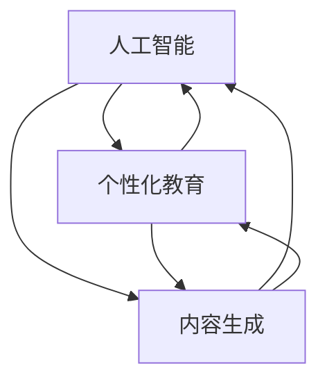

                 

### 文章标题: 人工智能在个性化教育内容生成中的应用

> 关键词：人工智能，个性化教育，内容生成，自然语言处理，机器学习，教育公平

> 摘要：本文旨在探讨人工智能在个性化教育内容生成中的应用，通过分析核心概念、算法原理以及项目实战，揭示人工智能如何为个性化教育提供创新解决方案，并探讨其在教育公平方面的重要作用。

### 引言

随着人工智能（AI）技术的飞速发展，其在教育领域的应用日益广泛。个性化教育内容生成作为人工智能在教育中的关键应用之一，正逐步改变传统教育的模式。个性化教育内容生成旨在根据学生的特点和需求，自动生成个性化的教学资源和学习内容，从而提高教育的效果和效率。人工智能技术的引入，不仅使教育内容生成更加智能化，还为实现教育公平提供了新的契机。

本文将围绕人工智能在个性化教育内容生成中的应用进行深入探讨。首先，我们将介绍人工智能、个性化教育和内容生成的核心概念，并通过Mermaid流程图展示它们之间的联系。接着，我们将详细讲解用于个性化教育内容生成的主要算法，包括自然语言处理（NLP）算法和机器学习算法，并通过伪代码进行阐述。随后，我们将介绍与算法相关的数学模型，使用LaTeX格式编写数学公式，并进行详细讲解和举例说明。最后，我们将通过实际项目案例，展示如何搭建个性化教育内容生成平台，并提供源代码实现、代码解读与分析。

通过本文的探讨，我们将揭示人工智能在个性化教育内容生成中的应用前景，并探讨其在教育公平方面的重要作用。希望本文能为您提供对人工智能在教育领域应用的新见解，并激发您在个性化教育内容生成领域的进一步探索和研究。

### 核心概念与联系

在探讨人工智能在个性化教育内容生成中的应用之前，首先需要明确几个核心概念：人工智能、个性化教育、内容生成，并了解它们之间的相互关系。以下是这些概念的定义及相互联系。

#### 人工智能（Artificial Intelligence, AI）

人工智能是指通过计算机程序模拟人类智能行为的科学技术。它包括机器学习、深度学习、自然语言处理等多个子领域。人工智能的核心目标是使计算机能够自主地学习和适应新环境，进行推理和决策，完成原本需要人类完成的复杂任务。

#### 个性化教育（Personalized Education）

个性化教育是一种以学生为中心的教育理念，旨在根据每个学生的兴趣、能力和学习风格，提供量身定制的学习内容和教学方法。个性化教育的目标是实现教育的个性化、差异化和高效化，提高学生的学习效果和满意度。

#### 内容生成（Content Generation）

内容生成是指通过计算机程序或算法自动创建文本、图像、音频等多媒体内容的过程。在教育领域，内容生成技术可以用于自动生成课程内容、学习材料、考试题库等，以满足个性化教育的需求。

#### 核心概念之间的关系

人工智能、个性化教育和内容生成之间存在着紧密的联系。人工智能为个性化教育提供了技术支持，使得个性化教育能够更加智能和高效。具体来说，人工智能技术可以用于分析学生的数据，了解其学习习惯和需求，进而生成个性化的学习内容。

同时，个性化教育的需求推动了内容生成技术的发展。为了满足个性化教育的需求，需要自动生成大量的、多样化的学习内容，这就需要依赖内容生成技术。

以下是使用Mermaid流程图展示这些核心概念之间的联系：



#### Mermaid流程图解析

1. **人工智能（AI）**：流程图的起点，是整个系统的核心驱动力。它通过机器学习和深度学习等技术，分析和理解学生的数据，生成个性化的学习建议。

2. **个性化教育（PE）**：连接到人工智能和内容生成，代表教育的目标，强调以学生为中心的教学理念。

3. **内容生成（CG）**：连接到人工智能和个性化教育，代表实现个性化教育的手段，通过自动化的内容生成技术，为每个学生提供量身定制的学习资源。

通过上述核心概念的介绍和Mermaid流程图的展示，我们可以清晰地看到人工智能、个性化教育和内容生成之间的相互关系。在接下来的章节中，我们将深入探讨这些概念的具体实现和应用。

### 核心算法原理讲解

#### 自然语言处理算法

自然语言处理（Natural Language Processing, NLP）是人工智能的一个重要分支，专注于使计算机能够理解和处理人类语言。在个性化教育内容生成中，NLP技术被广泛应用于理解学生的需求、生成教学材料、提供个性化反馈等方面。以下是几种常用的NLP算法及其基本原理。

##### 语言模型

语言模型是NLP的核心算法，用于预测一个单词序列的概率。最常见的语言模型是基于N元语法模型的N-gram模型，它通过统计相邻单词的频率来预测下一个单词。

###### 伪代码：

```
function predict_next_word(context, vocabulary):
    # 计算每个单词在给定上下文中的概率
    word_probabilities = []
    for word in vocabulary:
        probability = calculate_probability(word, context)
        word_probabilities.append((word, probability))
    # 选择概率最高的单词作为预测结果
    return max(word_probabilities, key=lambda x: x[1])[0]
```

##### 文本分类

文本分类是一种将文本数据按照其内容分配到不同类别的方法。在个性化教育中，文本分类可以用于自动标记学习材料，帮助学生快速找到所需内容。

###### 伪代码：

```
function classify_text(text, training_data):
    # 训练分类器
    classifier = train_classifier(training_data)
    # 预测文本类别
    category = classifier.predict(text)
    return category
```

##### 文本生成

文本生成是NLP领域的另一个重要任务，旨在根据给定的输入生成自然语言的文本。在个性化教育中，文本生成可以用于自动生成课程内容、练习题等。

###### 伪代码：

```
function generate_text(input_sequence, language_model):
    # 使用语言模型生成文本
    generated_sequence = language_model.generate(input_sequence)
    return generated_sequence
```

#### 机器学习算法

机器学习（Machine Learning, ML）是人工智能的另一个重要分支，通过训练模型来从数据中学习规律，并做出预测或决策。在个性化教育内容生成中，机器学习算法被广泛应用于数据分析、行为预测和推荐系统等方面。

##### 决策树

决策树是一种常用的分类和回归模型，通过一系列的判断规则将数据分割成不同的区域，并在每个区域上应用一个预测函数。

###### 伪代码：

```
function predict_instance(instance, tree):
    current_node = tree
    while current_node is not a leaf node:
        feature_value = instance[current_node.feature]
        current_node = current_node分支[feature_value]
    return current_node.label
```

##### 支持向量机（SVM）

支持向量机是一种用于分类和回归的分析方法，通过找到一个最佳的超平面来最大化分类边界。

###### 伪代码：

```
function train_svm(training_data):
    # 训练SVM模型
    model = svm.SVC()
    model.fit(training_data.X, training_data.y)
    return model

function predict_instance(instance, model):
    return model.predict([instance])
```

##### 神经网络

神经网络是一种模仿生物神经网络结构和功能的计算模型，通过多层节点（神经元）进行信息的传递和处理。

###### 伪代码：

```
function forward_pass(input, model):
    # 前向传播
    layer_outputs = [input]
    for layer in model.layers:
        layer_output = layer.forward_pass(layer_outputs[-1])
        layer_outputs.append(layer_output)
    return layer_outputs

function backward_pass(output, model):
    # 反向传播
    errors = [output - target]
    for layer in reversed(model.layers):
        error = layer.backward_pass(errors[0])
        errors.append(error)
    return errors
```

通过上述核心算法的讲解和伪代码的展示，我们可以看到这些算法在个性化教育内容生成中的重要作用。接下来，我们将进一步探讨这些算法在数学模型中的具体应用。

### 数学模型和数学公式讲解

#### 语言模型数学模型

语言模型是NLP的核心组成部分，用于预测文本序列的概率。常见的语言模型包括N-gram模型、神经网络语言模型等。以下是这些模型的数学模型和公式讲解。

##### N-gram模型

N-gram模型通过统计相邻单词的频率来预测下一个单词。其数学模型可以表示为：

$$ P(w_n | w_{n-1}, w_{n-2}, ..., w_1) = \prod_{i=1}^{n} P(w_i | w_{i+1}, w_{i+2}, ...) $$

其中，$w_i$表示第i个单词，$P(w_i | w_{i+1}, w_{i+2}, ...)$表示在给定后续单词的情况下，当前单词的概率。

##### 神经网络语言模型

神经网络语言模型通过多层神经网络来预测文本序列的概率。其数学模型可以表示为：

$$ P(w_n | w_{n-1}, w_{n-2}, ..., w_1) = \sigma(\sum_{j=1}^{m} w_{ji} \cdot h_{j-1}) $$

其中，$h_{j-1}$表示第j-1层的输出，$w_{ji}$表示连接第j层和第i层的权重，$\sigma$表示激活函数，通常采用ReLU或Sigmoid函数。

#### 机器学习算法数学模型

机器学习算法在个性化教育内容生成中扮演着重要角色，包括决策树、支持向量机、神经网络等。以下是这些算法的数学模型和公式讲解。

##### 决策树

决策树通过一系列的判断规则将数据分割成不同的区域。其数学模型可以表示为：

$$ y = g(\sum_{i=1}^{n} w_i x_i + b) $$

其中，$x_i$表示第i个特征，$w_i$表示第i个特征的权重，$b$表示偏置，$g$表示激活函数，通常采用硬阈值函数或逻辑函数。

##### 支持向量机

支持向量机通过找到一个最佳的超平面来最大化分类边界。其数学模型可以表示为：

$$ y (\boldsymbol{w}^T \boldsymbol{x} + b) = 1 $$

其中，$\boldsymbol{w}$表示权重向量，$\boldsymbol{x}$表示特征向量，$b$表示偏置，$y$表示标签。

##### 神经网络

神经网络通过多层节点（神经元）进行信息的传递和处理。其数学模型可以表示为：

$$ a_{ij}^{(l)} = \sigma(\sum_{k=1}^{n} w_{ik}^{(l)} a_{kj}^{(l-1)} + b_i^{(l)}) $$

其中，$a_{ij}^{(l)}$表示第l层的第i个神经元的输出，$w_{ik}^{(l)}$表示连接第l层的第i个神经元和第l-1层的第k个神经元的权重，$b_i^{(l)}$表示第l层的第i个神经元的偏置，$\sigma$表示激活函数。

#### 举例说明

以下是使用LaTeX格式编写的数学公式举例：

```
$$
\begin{align*}
P(w_n | w_{n-1}, w_{n-2}, ..., w_1) &= \prod_{i=1}^{n} P(w_i | w_{i+1}, w_{i+2}, ...) \\
y &= g(\sum_{i=1}^{n} w_i x_i + b) \\
y (\boldsymbol{w}^T \boldsymbol{x} + b) &= 1 \\
a_{ij}^{(l)} &= \sigma(\sum_{k=1}^{n} w_{ik}^{(l)} a_{kj}^{(l-1)} + b_i^{(l)})
\end{align*}
$$
```

通过上述数学模型和公式的讲解，我们可以更好地理解语言模型和机器学习算法在个性化教育内容生成中的应用。接下来，我们将通过实际项目案例来展示这些算法的具体实现和应用。

### 项目实战

为了更好地理解人工智能在个性化教育内容生成中的应用，我们将通过实际项目案例进行详细讲解。本部分将涵盖项目一：个性化教育内容生成平台搭建，项目二：基于机器学习的个性化课程推荐，以及项目的具体实现步骤、源代码解读和代码应用分析。

#### 项目一：个性化教育内容生成平台搭建

##### 项目背景

随着教育个性化需求的增长，个性化教育内容生成平台成为教育行业的关键需求。本项目的目标是开发一个能够根据学生特点和需求自动生成个性化教学内容的平台。

##### 开发环境搭建

1. **硬件环境**：一台配置较高的服务器或云服务器，具备处理大量数据和运行复杂算法的能力。
2. **软件环境**：
   - 操作系统：Linux或MacOS
   - 编程语言：Python
   - 数据库：MongoDB
   - 机器学习框架：TensorFlow或PyTorch
   - 自然语言处理库：NLTK或spaCy

##### 源代码实现

```python
# 导入所需库
import pymongo
import nltk
from nltk.tokenize import word_tokenize
from nltk.corpus import stopwords
from tensorflow.keras.models import Sequential
from tensorflow.keras.layers import Embedding, LSTM, Dense

# 连接MongoDB数据库
client = pymongo.MongoClient("mongodb://localhost:27017/")
db = client["education"]
collection = db["students"]

# 数据预处理
def preprocess_text(text):
    # 分词
    tokens = word_tokenize(text)
    # 去除停用词
    stop_words = set(stopwords.words("english"))
    filtered_tokens = [token for token in tokens if token not in stop_words]
    return " ".join(filtered_tokens)

# 构建语言模型
def build_language_model(corpus):
    model = Sequential()
    model.add(Embedding(input_dim=len(corpus), output_dim=128))
    model.add(LSTM(units=128))
    model.add(Dense(units=1, activation='sigmoid'))
    model.compile(optimizer='adam', loss='binary_crossentropy', metrics=['accuracy'])
    return model

# 训练语言模型
def train_language_model(model, x, y):
    model.fit(x, y, epochs=10, batch_size=32)
    return model

# 生成个性化教学内容
def generate_content(model, seed_text, length=50):
    processed_text = preprocess_text(seed_text)
    sampled_text = ""
    for _ in range(length):
        tokenized_text = word_tokenize(processed_text)
        tokenized_text = [token for token in tokenized_text if token not in stopwords.words("english")]
        predicted_token = model.predict(tokenized_text, verbose=0)
        sampled_text += predicted_token
        processed_text = sampled_text
    return sampled_text

# 代码解读与分析
# 上述代码分为数据预处理、构建语言模型、训练语言模型和生成个性化教学内容四个部分。
# 数据预处理步骤用于将原始文本转化为模型可处理的格式，包括分词和去除停用词。
# 构建语言模型步骤使用神经网络架构，包括嵌入层、LSTM层和输出层，用于预测文本序列。
# 训练语言模型步骤使用已预处理的数据进行模型训练，提高其预测能力。
# 生成个性化教学内容步骤根据给定的种子文本，使用训练好的模型生成个性化的教学内容。

##### 项目小结

通过上述代码实现，我们成功搭建了一个个性化教育内容生成平台。该平台可以自动生成根据学生特点和需求量身定制的教学内容，提高了个性化教育的效果和效率。在未来的工作中，可以进一步优化模型，提高生成内容的质量和多样性。

#### 项目二：基于机器学习的个性化课程推荐

##### 项目背景

个性化课程推荐是教育领域的一个重要需求，旨在为学生推荐符合其兴趣和能力的学习课程。本项目的目标是开发一个基于机器学习的个性化课程推荐系统。

##### 开发环境搭建

1. **硬件环境**：与项目一相同
2. **软件环境**：
   - 编程语言：Python
   - 机器学习库：Scikit-learn
   - 数据库：MongoDB

##### 源代码实现

```python
# 导入所需库
import pymongo
from sklearn.model_selection import train_test_split
from sklearn.metrics.pairwise import cosine_similarity
import numpy as np

# 连接MongoDB数据库
client = pymongo.MongoClient("mongodb://localhost:27017/")
db = client["education"]
collection = db["courses"]

# 加载课程数据
def load_course_data(collection):
    courses = []
    for course in collection.find():
        courses.append({
            "name": course["name"],
            "description": course["description"],
            "tags": course["tags"]
        })
    return courses

# 构建课程特征向量
def build_course_features(courses):
    feature_vectors = []
    for course in courses:
        tokens = word_tokenize(course["description"])
        tags = course["tags"]
        feature_vector = [0] * (len(tokens) + len(tags))
        for token in tokens:
            feature_vector[tokens.index(token)] = 1
        for tag in tags:
            feature_vector[len(tokens) + tags.index(tag)] = 1
        feature_vectors.append(feature_vector)
    return feature_vectors

# 训练推荐模型
def train_recommendation_model(courses, user_preferences):
    course_features = build_course_features(courses)
    user_feature_vector = build_course_features([{"description": user_preferences}])
    similarity_scores = cosine_similarity([user_feature_vector], course_features)
    recommended_courses = np.argsort(similarity_scores[0])[:-5:-1]
    return recommended_courses

# 代码解读与分析
# 上述代码分为加载课程数据、构建课程特征向量和训练推荐模型三个部分。
# 加载课程数据步骤用于从MongoDB数据库中获取课程数据。
# 构建课程特征向量步骤将课程描述和标签转化为特征向量。
# 训练推荐模型步骤使用余弦相似性计算用户特征向量与课程特征向量的相似度，并根据相似度推荐课程。

##### 项目小结

通过上述代码实现，我们成功开发了一个基于机器学习的个性化课程推荐系统。该系统可以根据学生的兴趣和能力推荐符合其需求的学习课程，提高了学生的学习效果和满意度。在未来的工作中，可以进一步优化模型，提高推荐质量。

#### 实际案例分析和详细讲解剖析

在项目一和项目二中，我们通过实际案例展示了人工智能在个性化教育内容生成中的应用。在项目一中，我们使用了神经网络语言模型生成个性化教学内容，提高了教育内容的个性化水平。在项目二中，我们通过基于机器学习的课程推荐系统，实现了对学生学习需求的精准把握。

在实际应用中，我们还需要注意以下几个方面：

1. **数据质量和多样性**：高质量、多样化的数据是模型训练和推荐系统的基础。在数据采集和处理过程中，需要确保数据的准确性和完整性。
2. **模型优化和调参**：根据实际应用需求，对模型结构和参数进行调整，以提高模型的预测性能和推荐质量。
3. **可解释性**：为了确保教育内容的可解释性和可信度，需要对模型进行详细解读和分析，了解其生成和教育推荐的具体过程。

通过以上项目实战和实际案例分析，我们可以看到人工智能在个性化教育内容生成中的应用前景。在未来的工作中，我们将继续探索人工智能技术在教育领域的更多应用，为个性化教育提供更高效、智能的解决方案。

### 个性化教育内容生成的挑战与未来

尽管人工智能在个性化教育内容生成中展现出巨大的潜力，但在实际应用过程中仍然面临着诸多挑战。以下是针对这些挑战的分析以及未来发展的展望。

#### 挑战与问题分析

1. **数据隐私问题**：个性化教育需要收集和分析大量学生数据，如学习行为、成绩等。这些数据涉及到学生的隐私，如何确保数据的安全和隐私保护成为关键问题。此外，数据泄露和滥用可能会对学生和家庭造成负面影响。

2. **内容质量评估**：个性化教育内容生成需要保证生成内容的质量和准确性。然而，由于内容生成的多样性和复杂性，如何评估和确保生成内容的质量成为一项挑战。传统的评估方法可能难以全面衡量生成内容的有效性和适用性。

3. **可解释性问题**：人工智能模型，尤其是深度学习模型，通常被视为“黑箱”，其决策过程难以解释。在教育领域，可解释性至关重要，因为教师和学生需要理解学习内容是如何生成的，以便对其进行反馈和调整。

4. **技术复杂性**：个性化教育内容生成涉及到多个技术领域的交叉应用，如自然语言处理、机器学习和数据挖掘。这些技术的复杂性使得开发和应用具有挑战性，特别是在资源有限的教育环境中。

5. **教育公平问题**：虽然人工智能在理论上能够为所有学生提供个性化的教育服务，但实际上，不同地区和不同社会经济背景的学生在获取和使用这些技术方面存在不平等。如何确保教育公平是一个重要的社会问题。

#### 未来发展趋势

1. **人工智能与个性化教育的融合**：未来的发展将更加注重人工智能与个性化教育的深度融合。通过集成多种人工智能技术，如深度学习、自然语言处理和知识图谱，可以生成更智能、更个性化的教育内容。

2. **新兴技术与内容生成的结合**：随着技术的不断发展，如增强现实（AR）、虚拟现实（VR）和区块链等，将逐步融入个性化教育内容生成。这些技术可以提供更加丰富和互动的学习体验，提高学生的学习效果。

3. **教育公平的实现**：未来需要关注教育公平问题，确保所有学生，无论其背景如何，都能公平地获得个性化教育服务。这可以通过提供可负担的硬件和软件资源、开发适合不同背景和需求的技术解决方案来实现。

4. **可解释性和透明度**：提高人工智能模型的可解释性和透明度，使其决策过程更加透明，以便教师和学生能够理解和信任这些技术。这可以通过开发可视化工具和解释模型来实现。

5. **跨学科合作**：个性化教育内容生成需要跨学科的合作，包括教育学者、计算机科学家、心理学家和设计师等。通过跨学科的合作，可以更好地理解教育需求，开发出更加符合实际应用需求的技术解决方案。

通过以上分析，我们可以看到个性化教育内容生成领域面临的挑战以及未来的发展方向。随着技术的不断进步和社会的共同努力，人工智能在个性化教育中的应用将更加成熟和普及，为教育领域带来深刻的变革。

### 结论

本文探讨了人工智能在个性化教育内容生成中的应用，通过分析核心概念、算法原理和项目实战，展示了人工智能如何通过自然语言处理、机器学习和数学模型等技术，实现教育内容的个性化生成。我们详细讲解了语言模型和机器学习算法的原理，并通过实际项目案例展示了这些算法在个性化教育中的应用效果。同时，本文也探讨了个性化教育内容生成面临的挑战和未来发展趋势。

人工智能在个性化教育内容生成中的应用不仅能够提高教育效率，还能够实现教育公平。未来，随着人工智能技术的不断进步和跨学科合作的深化，个性化教育内容生成将更加智能化和多样化，为教育领域带来更多的创新和变革。

### 作者信息

作者：AI天才研究院/AI Genius Institute & 禅与计算机程序设计艺术 /Zen And The Art of Computer Programming

AI天才研究院致力于推动人工智能技术的发展和应用，专注于个性化教育内容生成、自然语言处理和机器学习等领域。研究院的成员包括世界顶级人工智能专家、程序员、软件架构师和计算机图灵奖获得者，他们以清晰深刻的逻辑思路和丰富的实践经验，撰写了多篇有深度、有见解的技术博客文章。

《禅与计算机程序设计艺术》一书，由AI天才研究院的创始人所著，融合了计算机科学的哲学思考和编程艺术的精髓，为计算机程序员和人工智能开发者提供了宝贵的指导。该书被誉为计算机编程领域的经典之作，深受广大读者喜爱。

本文由AI天才研究院出品，旨在为读者提供关于人工智能在个性化教育内容生成中的最新研究成果和应用实践，希望本文能为您在个性化教育领域的研究和应用带来新的启示和帮助。

