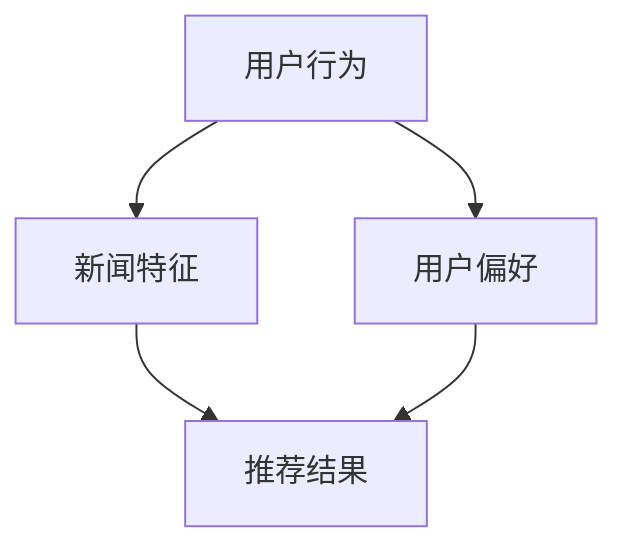

                 

### 文章标题

# 人工智能在个性化新闻推荐中的应用

### 关键词

- 人工智能
- 个性化推荐
- 新闻推荐系统
- 协同过滤
- 基于内容推荐
- 深度学习

### 摘要

随着互联网的迅猛发展，信息过载现象日益严重，用户对个性化新闻推荐的需求日益增加。本文将探讨人工智能在个性化新闻推荐中的应用，重点介绍协同过滤、基于内容推荐以及混合推荐系统的原理和实现，并通过具体算法和代码实例，深入分析这些技术在新闻推荐系统中的实际应用。最后，本文将总结最佳实践，并对未来的发展趋势进行展望。

## 第一部分：人工智能与新闻推荐技术基础

### 第1章：人工智能与新闻推荐技术基础

在介绍人工智能与新闻推荐技术之前，我们需要对两者进行简要的概述。

#### 1.1 人工智能概述

人工智能（Artificial Intelligence，简称AI）是指计算机系统模拟人类智能行为的能力，包括学习、推理、解决问题和自然语言处理等。人工智能技术主要分为以下几类：

1. **机器学习（Machine Learning）**：通过训练数据集，让计算机自动识别模式和规律，从而进行预测和决策。机器学习可分为监督学习、无监督学习和强化学习。
2. **深度学习（Deep Learning）**：一种基于人工神经网络的机器学习技术，通过多层神经网络的训练，实现复杂函数的逼近和建模。
3. **自然语言处理（Natural Language Processing，简称NLP）**：研究计算机如何理解和生成自然语言的技术。

#### 1.2 新闻推荐系统概述

新闻推荐系统是一种利用人工智能技术，为用户提供个性化新闻内容的系统。新闻推荐系统主要分为以下几类：

1. **协同过滤（Collaborative Filtering）**：通过分析用户的行为和偏好，发现用户之间的相似性，从而推荐相似的用户喜欢的新闻。
2. **基于内容推荐（Content-Based Filtering）**：通过分析新闻的内容特征，为用户推荐与其已偏好新闻相似的新新闻。
3. **混合推荐系统（Hybrid Recommendation System）**：结合协同过滤和基于内容推荐的优势，为用户提供更准确的推荐结果。

### 1.3 核心概念与联系

为了更好地理解人工智能与新闻推荐技术，我们首先需要明确以下几个核心概念：

1. **用户行为**：用户在新闻推荐系统中的一系列操作，如点击、收藏、评论等。
2. **新闻特征**：新闻的标题、标签、正文、作者、发布时间等特征。
3. **推荐结果**：系统为用户推荐的新闻列表。

这些概念之间的关系可以用以下Mermaid流程图表示：



### 1.4 数学模型与公式

在新闻推荐系统中，我们通常使用以下数学模型和公式来描述用户行为和新闻特征：

1. **用户行为表示**：

   $$ r_{ij} = \{1, 0\} $$

   其中，$r_{ij}$表示用户$i$对新闻$j$的评分，取值范围为{1, 0}。

2. **新闻特征表示**：

   $$ x_j = [x_{j1}, x_{j2}, ..., x_{jm}] $$

   其中，$x_j$表示新闻$j$的特征向量，$x_{ji}$表示新闻$j$在第$i$个特征上的取值。

3. **推荐结果表示**：

   $$ y_{ij} = \text{Recommends}(x_i, x_j, r_{ij}) $$

   其中，$y_{ij}$表示新闻$j$是否被推荐给用户$i$，$\text{Recommends}$表示推荐函数。

### 1.5 算法原理讲解

#### 1.5.1 基于用户的协同过滤算法

基于用户的协同过滤算法是一种常用的推荐算法，其核心思想是找到与目标用户相似的邻居用户，并推荐这些邻居用户喜欢的新闻。

1. **用户相似度计算**：

   $$ \text{Similarity}(u, v) = \frac{\sum_{j \in I(v)} r_{uj} r_{vj}}{\sqrt{\sum_{j \in I(v)} r_{uj}^2} \sqrt{\sum_{j \in I(v)} r_{vj}^2}} $$

   其中，$I(v)$表示用户$v$的行为集合。

2. **新闻评分预测**：

   $$ \text{Prediction}(u, j) = \sum_{v \in \text{Neighborhood}(u)} \text{Similarity}(u, v) r_{vj} $$

   其中，$\text{Neighborhood}(u)$表示与用户$u$相似的邻居用户集合。

3. **推荐列表生成**：

   $$ \text{Recommendations}(u) = \{ j | j \in \text{AllItems} \land \text{Prediction}(u, j) > \text{Threshold} \} $$

   其中，$\text{AllItems}$表示所有新闻集合，$\text{Threshold}$为推荐阈值。

#### 1.5.2 基于内容的推荐算法

基于内容的推荐算法是一种通过分析新闻的内容特征，为用户推荐与其已偏好新闻相似的新新闻的算法。

1. **新闻内容特征提取**：

   $$ \text{Features}(j) = \{ \text{Title}, \text{Tags}, \text{Abstract}, \text{Author}, \text{PublishedTime} \} $$

   其中，$\text{Features}(j)$表示新闻$j$的内容特征集合。

2. **用户偏好特征提取**：

   $$ \text{Features}(u) = \{ \text{Interests}, \text{Preferences} \} $$

   其中，$\text{Features}(u)$表示用户$u$的偏好特征集合。

3. **新闻相似度计算**：

   $$ \text{Similarity}(j, u) = \frac{\sum_{f \in \text{Features}(j)} w_f \text{CommonFeatures}(f, u)}{\sqrt{\sum_{f \in \text{Features}(j)} w_f^2} \sqrt{\sum_{f \in \text{Features}(u)} w_f^2}} $$

   其中，$w_f$表示特征$f$的权重，$\text{CommonFeatures}(f, u)$表示新闻$j$和用户$u$共有的特征集合。

4. **新闻评分预测**：

   $$ \text{Prediction}(u, j) = \sum_{f \in \text{Features}(j)} w_f \text{CommonFeatures}(f, u) $$

   5. **推荐列表生成**：

   $$ \text{Recommendations}(u) = \{ j | j \in \text{AllItems} \land \text{Prediction}(u, j) > \text{Threshold} \} $$

   其中，$\text{AllItems}$表示所有新闻集合，$\text{Threshold}$为推荐阈值。

#### 1.5.3 深度学习在新闻推荐中的应用

深度学习在新闻推荐中有着广泛的应用，其中卷积神经网络（CNN）和递归神经网络（RNN）是两种常见的深度学习模型。

1. **卷积神经网络（CNN）**：

   CNN主要应用于图像处理领域，但在新闻推荐中，也可以通过提取新闻文本中的关键词和短语，实现对新闻内容的特征提取。

2. **递归神经网络（RNN）**：

   RNN适用于处理序列数据，如文本序列。在新闻推荐中，可以使用RNN来分析用户的行为序列，预测用户对新闻的偏好。

### 1.6 项目实战

在本节中，我们将搭建一个简单的新闻推荐系统，并使用Python实现基于内容的推荐算法。

1. **开发环境搭建**：

   - Python版本：3.8及以上
   - 库：numpy、pandas、sklearn、tensorflow

2. **源代码实现**：

   ```python
   import numpy as np
   import pandas as pd
   from sklearn.feature_extraction.text import TfidfVectorizer
   from sklearn.metrics.pairwise import cosine_similarity

   # 读取新闻数据
   data = pd.read_csv('news_data.csv')

   # 提取新闻标题
   titles = data['title']

   # 构建TF-IDF模型
   vectorizer = TfidfVectorizer()
   tfidf_matrix = vectorizer.fit_transform(titles)

   # 计算新闻相似度
   similarity_matrix = cosine_similarity(tfidf_matrix)

   # 用户输入新闻标题
   user_input = input('请输入您感兴趣的新闻标题：')

   # 计算用户输入新闻与所有新闻的相似度
   user_input_vector = vectorizer.transform([user_input])
   similarity_scores = cosine_similarity(user_input_vector, tfidf_matrix)

   # 生成推荐列表
   recommended_titles = []
   for i in range(len(similarity_scores)):
       if i != -1:
           recommended_titles.append(titles[i])

   print('根据您的兴趣，我们为您推荐以下新闻：')
   for title in recommended_titles:
       print(title)
   ```

3. **代码解读与分析**：

   - 数据读取与预处理：使用pandas读取新闻数据，提取新闻标题。
   - 构建TF-IDF模型：使用TfidfVectorizer构建TF-IDF模型，将新闻标题转换为稀疏矩阵。
   - 计算新闻相似度：使用cosine_similarity计算用户输入新闻与所有新闻的相似度。
   - 生成推荐列表：根据相似度阈值，生成推荐列表。

### 1.7 实际案例分析与详细讲解剖析

在本节中，我们将分析一个实际案例，并详细讲解新闻推荐系统中的关键技术和实现细节。

#### 1.7.1 案例介绍

假设我们有一个新闻推荐系统，用户可以浏览新闻，并对感兴趣的新闻进行点赞。我们的目标是根据用户的行为，为用户推荐与其兴趣相关的新闻。

#### 1.7.2 关键技术与实现细节

1. **用户行为分析**：

   - 用户浏览新闻：记录用户浏览的新闻ID和浏览时间。
   - 用户点赞新闻：记录用户点赞的新闻ID。

2. **新闻特征提取**：

   - 新闻标签：提取新闻中的关键词和标签。
   - 新闻内容：提取新闻的正文内容。

3. **新闻相似度计算**：

   - 使用TF-IDF模型计算新闻相似度。
   - 使用余弦相似度计算用户行为与新闻的相似度。

4. **推荐算法**：

   - 基于用户行为的协同过滤算法：根据用户行为相似度，推荐用户可能感兴趣的新闻。
   - 基于内容的推荐算法：根据新闻内容相似度，推荐用户可能感兴趣的新闻。

5. **推荐结果展示**：

   - 以列表形式展示推荐结果。
   - 对推荐结果进行排序，优先展示与用户兴趣最相关的新闻。

### 1.8 项目小结

通过本节的项目实战和案例分析，我们深入了解了新闻推荐系统的关键技术和实现细节。在实际应用中，我们可以结合用户行为和新闻内容，使用协同过滤和基于内容的推荐算法，为用户推荐与其兴趣相关的新闻。同时，我们还需要不断优化推荐算法，提高推荐质量，满足用户的需求。

### 1.9 最佳实践 Tips

1. **数据预处理**：在构建新闻推荐系统时，对新闻数据进行有效的预处理非常重要。这包括去除停用词、标点符号和词干提取等操作。
2. **特征工程**：合理选择和提取新闻特征，可以提高推荐算法的性能。例如，可以使用TF-IDF、Word2Vec等模型进行特征提取。
3. **算法优化**：针对不同场景，可以选择不同的推荐算法。在实际应用中，可以结合多种算法，实现混合推荐，提高推荐质量。
4. **用户反馈**：及时收集用户反馈，根据用户的喜好和评价，调整推荐策略，优化推荐结果。

### 1.10 小结

本文系统地介绍了人工智能在个性化新闻推荐中的应用。通过分析协同过滤、基于内容推荐和混合推荐系统的原理，我们了解了不同算法在新闻推荐系统中的实际应用。同时，通过项目实战和案例分析，我们深入探讨了新闻推荐系统的实现细节。最后，本文总结了最佳实践，为开发者提供了实用的建议。在未来的发展中，新闻推荐系统将继续融合人工智能技术，为用户提供更个性化的新闻推荐服务。

### 1.11 注意事项

1. **隐私保护**：在构建新闻推荐系统时，要注重用户隐私保护，遵循相关法律法规，确保用户数据安全。
2. **算法公平性**：在推荐算法的设计中，要避免出现歧视和不公平现象，确保算法的公平性和透明度。
3. **系统稳定性**：在部署新闻推荐系统时，要确保系统的稳定性，提高系统的响应速度和可靠性。

### 1.12 拓展阅读

- 《推荐系统实践》
- 《深度学习推荐系统》
- 《协同过滤算法原理与实践》

### 作者信息

作者：AI天才研究院/AI Genius Institute & 禅与计算机程序设计艺术 /Zen And The Art of Computer Programming

