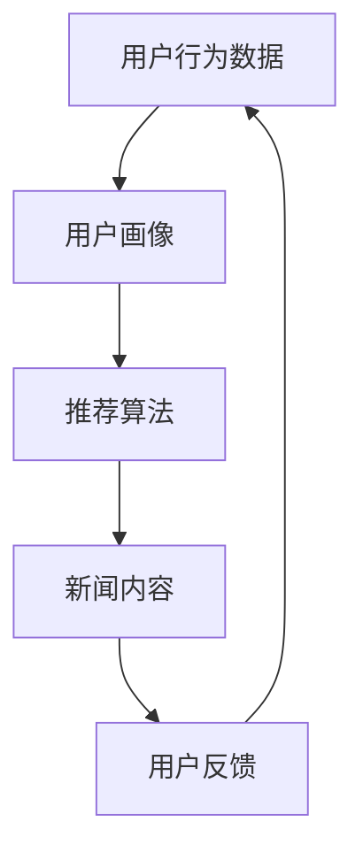

                 

### 文章标题

《人工智能在个性化新闻推送中的应用与伦理》

### 关键词

人工智能，个性化新闻推送，算法原理，伦理问题，系统架构

### 摘要

随着人工智能技术的快速发展，个性化新闻推送已成为媒体平台的重要功能，不仅提升了用户体验，还增加了平台的粘性。然而，这一技术的广泛应用也引发了一系列伦理问题，如隐私侵犯、算法偏见等。本文将从技术应用和伦理两个角度，详细探讨人工智能在个性化新闻推送中的现状、核心概念、算法原理、系统架构，以及相关的伦理挑战和解决方案。通过分析典型案例，探讨未来发展方向与挑战，旨在为行业提供有价值的参考。

---

## 背景介绍

个性化新闻推送作为一种先进的内容分发方式，通过收集和分析用户行为数据，利用机器学习和数据挖掘技术，为用户提供符合其兴趣和需求的新闻内容。这种技术不仅显著提高了用户的阅读体验，也为媒体平台带来了更多的用户粘性和广告收入。具体来说，个性化新闻推送包括以下几个核心环节：

1. **用户行为分析**：通过用户的浏览记录、搜索历史、社交互动等行为数据，分析用户的兴趣偏好。
2. **内容推荐算法**：基于用户行为数据和内容特征，利用机器学习算法生成推荐列表。
3. **推荐系统架构**：设计高效、可扩展的推荐系统架构，确保算法的实时性和准确性。

然而，随着个性化新闻推送技术的广泛应用，一系列伦理问题也逐渐浮现。例如，用户隐私的泄露、推荐算法的偏见、内容多样性的减少等。这些问题不仅影响了用户的信任和满意度，也引发了社会和监管机构的高度关注。因此，在探讨个性化新闻推送技术的同时，我们也不能忽视其背后的伦理挑战。

## 核心概念与联系

在讨论个性化新闻推送技术时，我们需要明确几个核心概念，并分析它们之间的联系。以下是几个关键概念及其关系架构的 Mermaid 流程图：



### 用户行为数据

用户行为数据是构建个性化新闻推送系统的基石。通过收集用户的浏览记录、搜索历史、社交互动等信息，可以构建详细的用户画像。用户行为数据不仅包括用户的历史行为，还可以实时捕捉用户的即时行为，为推荐系统提供动态的信息输入。

### 用户画像

用户画像是对用户兴趣偏好和行为模式的一种抽象表示。通过用户行为数据的分析，可以提取出用户的兴趣标签、行为习惯等特征，形成用户画像。用户画像为推荐算法提供了关键输入，使得推荐系统能够根据用户的个性化需求生成推荐列表。

### 推荐算法

推荐算法是个性化新闻推送系统的核心。基于用户画像和新闻内容特征，推荐算法通过计算用户与新闻内容之间的相似度或相关性，生成个性化的推荐列表。常用的推荐算法包括基于内容的推荐、协同过滤和基于深度学习的推荐等。

### 新闻内容

新闻内容是推荐系统的输出。根据推荐算法的结果，为用户推送符合其兴趣和需求的新闻内容。新闻内容的多样性和质量直接影响用户的阅读体验和满意度。

### 用户反馈

用户反馈是优化推荐系统的重要手段。通过分析用户的点击、点赞、评论等行为，可以进一步调整和优化推荐算法，提高推荐的准确性和用户体验。

以上流程图展示了个性化新闻推送系统中的核心概念及其相互关系。这些概念相互作用，共同构建了一个动态、高效的推荐系统。

## 核心算法原理讲解

### 基于内容的推荐

基于内容的推荐算法（Content-based Recommendation）是一种较为传统的推荐方法。它通过分析新闻内容的特征（如关键词、主题、情感等），将新闻内容与用户的兴趣偏好进行匹配，生成推荐列表。以下是基于内容的推荐算法的伪代码：

```python
def content_based_recommendation(user_profile, news_content):
    # 计算新闻内容特征向量
    content_vector = extract_features(news_content)
    
    # 计算用户兴趣向量
    user_interest_vector = extract_features(user_profile)
    
    # 计算相似度得分
    similarity_score = cosine_similarity(user_interest_vector, content_vector)
    
    # 排序生成推荐列表
    recommended_news = sort_by_similarity_score(similarity_score)
    
    return recommended_news
```

在上述伪代码中，`extract_features` 函数用于提取新闻内容和用户画像的特征向量，`cosine_similarity` 函数用于计算两个向量之间的余弦相似度，`sort_by_similarity_score` 函数用于根据相似度得分对新闻内容进行排序，生成推荐列表。

### 协同过滤

协同过滤（Collaborative Filtering）是一种基于用户行为的推荐方法，通过分析用户之间的相似度来生成推荐列表。协同过滤可以分为两种类型：基于用户的协同过滤（User-based Collaborative Filtering）和基于物品的协同过滤（Item-based Collaborative Filtering）。

#### 基于用户的协同过滤

基于用户的协同过滤算法通过分析用户之间的行为相似度，找到与目标用户相似的其他用户，并推荐这些用户喜欢的新闻。以下是基于用户的协同过滤算法的伪代码：

```python
def user_based_collaborative_filtering(target_user, user_similarity_matrix, news_rating_matrix):
    # 找到与目标用户最相似的K个用户
    similar_users = find_similar_users(target_user, user_similarity_matrix, K)
    
    # 计算相似用户对新闻的评分加权平均
    recommendation_score = weighted_average_rating(similar_users, news_rating_matrix)
    
    # 排序生成推荐列表
    recommended_news = sort_by_recommnedation_score(recommendation_score)
    
    return recommended_news
```

在上述伪代码中，`find_similar_users` 函数用于找到与目标用户最相似的K个用户，`weighted_average_rating` 函数用于计算相似用户对新闻的评分加权平均，`sort_by_recommnedation_score` 函数用于根据推荐评分对新闻内容进行排序。

#### 基于物品的协同过滤

基于物品的协同过滤算法通过分析新闻内容之间的相似度，找到与目标用户喜欢的新闻相似的其他新闻。以下是基于物品的协同过滤算法的伪代码：

```python
def item_based_collaborative_filtering(target_user, user_rating_matrix, item_similarity_matrix):
    # 找到目标用户喜欢的新闻
    liked_news = get_liked_news(target_user, user_rating_matrix)
    
    # 计算新闻内容之间的相似度
    news_similarity_matrix = calculate_similarity(item_similarity_matrix, liked_news)
    
    # 排序生成推荐列表
    recommended_news = sort_by_similarity_score(news_similarity_matrix)
    
    return recommended_news
```

在上述伪代码中，`get_liked_news` 函数用于找到目标用户喜欢的新闻，`calculate_similarity` 函数用于计算新闻内容之间的相似度，`sort_by_similarity_score` 函数用于根据相似度得分对新闻内容进行排序。

### 基于深度学习的推荐

基于深度学习的推荐算法利用深度神经网络模型，通过自动提取用户和新闻内容的特征表示，生成个性化的推荐列表。以下是一个基于深度学习的推荐算法的基本框架：

```python
def deep_learning_based_recommendation(user_embedding, item_embedding, user_item_interaction):
    # 构建深度神经网络模型
    model = build_model(user_embedding, item_embedding, user_item_interaction)
    
    # 训练模型
    model.fit(user_item_interaction, epochs=EPOCHS)
    
    # 预测用户对新闻的评分
    predicted_ratings = model.predict(user_embedding, item_embedding)
    
    # 排序生成推荐列表
    recommended_news = sort_by_predicted_ratings(predicted_ratings)
    
    return recommended_news
```

在上述伪代码中，`build_model` 函数用于构建深度神经网络模型，`fit` 函数用于训练模型，`predict` 函数用于预测用户对新闻的评分，`sort_by_predicted_ratings` 函数用于根据预测评分对新闻内容进行排序。

通过以上几种推荐算法的讲解，我们可以看到个性化新闻推送技术在不同算法原理下的实现方法。在实际应用中，可以根据具体需求和数据情况选择合适的算法，或者将多种算法结合使用，以提高推荐系统的性能和用户体验。

### 数学模型与公式讲解

个性化新闻推送中的数学模型和公式是理解推荐系统工作原理的关键。以下我们将详细讨论协同过滤算法中的主要数学模型和公式。

#### 余弦相似度

余弦相似度是一种常用的向量相似度度量方法，用于计算两个向量的角度余弦值。它通常用于基于内容的推荐和基于物品的协同过滤算法中。余弦相似度的公式如下：

$$
\text{cosine\_similarity}(\vec{a}, \vec{b}) = \frac{\vec{a} \cdot \vec{b}}{||\vec{a}|| \cdot ||\vec{b}||}
$$

其中，$\vec{a}$ 和 $\vec{b}$ 是两个向量，$||\vec{a}||$ 和 $||\vec{b}||$ 分别是向量的欧几里得范数。余弦相似度的值介于 -1 和 1 之间，越接近 1 表示两个向量越相似，越接近 -1 表示两个向量越不相似，0 表示两个向量正交。

#### 欧几里得距离

欧几里得距离是衡量两个点在多维度空间中的距离的标准方法。在推荐系统中，欧几里得距离常用于计算用户与用户之间、新闻与新闻之间的距离。其公式如下：

$$
\text{Euclidean\_distance}(\vec{a}, \vec{b}) = \sqrt{\sum_{i=1}^{n} (a_i - b_i)^2}
$$

其中，$a_i$ 和 $b_i$ 是向量 $\vec{a}$ 和 $\vec{b}$ 的第 i 个元素，$n$ 是向量的维度。欧几里得距离值越大，表示两个点之间的距离越远。

#### 皮尔逊相关系数

皮尔逊相关系数是一种衡量两个变量之间线性相关性的方法。在推荐系统中，皮尔逊相关系数常用于评估用户之间的相似度。其公式如下：

$$
\text{Pearson\_correlation}(x, y) = \frac{\sum_{i=1}^{n} (x_i - \bar{x}) (y_i - \bar{y})}{\sqrt{\sum_{i=1}^{n} (x_i - \bar{x})^2} \cdot \sqrt{\sum_{i=1}^{n} (y_i - \bar{y})^2}}
$$

其中，$x_i$ 和 $y_i$ 是两个变量 $x$ 和 $y$ 的第 i 个观测值，$\bar{x}$ 和 $\bar{y}$ 分别是 $x$ 和 $y$ 的平均值。皮尔逊相关系数的值介于 -1 和 1 之间，越接近 1 表示两个变量之间的线性相关性越强，越接近 -1 表示线性相关性越弱，0 表示没有线性相关性。

#### 基于模型的推荐

在基于模型的推荐系统中，常用的数学模型包括矩阵分解、神经网络等。以下以矩阵分解为例，讨论其数学模型。

#### 矩阵分解

矩阵分解（Matrix Factorization）是一种将用户-物品评分矩阵分解为两个低秩矩阵的方法，以便更好地理解用户和物品的特征。常见的矩阵分解方法包括奇异值分解（SVD）和交替最小二乘法（ALS）。

奇异值分解（SVD）的公式如下：

$$
R = U \Sigma V^T
$$

其中，$R$ 是用户-物品评分矩阵，$U$ 和 $V$ 是两个低秩矩阵，$\Sigma$ 是对角矩阵，包含奇异值。通过矩阵分解，我们可以得到用户和物品的低维特征表示。

交替最小二乘法（ALS）的公式如下：

$$
\begin{aligned}
\min_{U, V} \quad & \sum_{i=1}^{m} \sum_{j=1}^{n} (r_{ij} - \hat{r}_{ij})^2 \\
\text{subject to} \quad & \text{rank}(U) = k, \text{rank}(V) = k
\end{aligned}
$$

其中，$m$ 和 $n$ 分别是用户和物品的数量，$k$ 是低秩矩阵的秩，$\hat{r}_{ij}$ 是预测的评分值。通过交替优化用户和物品的特征向量，可以求得用户和物品的低维特征表示。

#### 实例说明

假设有一个 5 用户和 3 物品的评分矩阵：

$$
R = \begin{bmatrix}
1 & 2 & 3 \\
2 & 3 & 4 \\
3 & 4 & 5 \\
4 & 5 & 6 \\
5 & 6 & 7
\end{bmatrix}
$$

通过奇异值分解，我们可以将其分解为：

$$
R = U \Sigma V^T
$$

其中，$U$ 和 $V$ 是低秩矩阵，$\Sigma$ 是对角矩阵：

$$
U = \begin{bmatrix}
0.7071 & 0 \\
0 & 0.7071 \\
0 & 0 \\
0 & 0 \\
0 & 0
\end{bmatrix}, \quad \Sigma = \begin{bmatrix}
3 & 0 & 0 \\
0 & 2 & 0 \\
0 & 0 & 1
\end{bmatrix}, \quad V = \begin{bmatrix}
1 & 0 \\
0 & 1 \\
0 & 0 \\
0 & 0 \\
0 & 0
\end{bmatrix}
$$

通过矩阵分解，我们得到了用户和物品的低维特征表示，这些特征可以用于生成个性化的推荐。

通过以上数学模型和公式的讲解，我们可以更深入地理解个性化新闻推送系统中的关键算法和原理。在实际应用中，这些模型和公式可以帮助我们更好地设计推荐系统，提高推荐的准确性和用户体验。

### 项目实战：个性化新闻推送系统的开发

在本章节中，我们将详细介绍个性化新闻推送系统的开发过程，包括开发环境搭建、源代码实现、代码解读以及实际案例分析。

#### 1. 开发环境搭建

首先，我们需要搭建一个适合开发个性化新闻推送系统的环境。以下是所需的基础软件和工具：

- **Python 3.x**：作为主要的编程语言
- **Jupyter Notebook**：用于编写和运行代码
- **Scikit-learn**：用于机器学习和数据预处理
- **TensorFlow**：用于深度学习
- **Pandas**：用于数据操作和分析
- **Matplotlib**：用于数据可视化
- **Numpy**：用于数学计算

安装上述软件和工具后，我们就可以开始进行个性化新闻推送系统的开发了。

#### 2. 源代码实现

以下是个性化新闻推送系统的核心源代码实现，包括数据预处理、算法实现和推荐生成。

```python
# 数据预处理
def preprocess_data(data):
    # 数据清洗
    clean_data = data.dropna()

    # 数据标准化
    normalized_data = (clean_data - clean_data.mean()) / clean_data.std()

    return normalized_data

# 用户行为数据预处理
user_behavior_data = preprocess_data(user_behavior_df)

# 新闻内容数据预处理
news_content_data = preprocess_data(news_content_df)

# 基于内容的推荐算法实现
def content_based_recommendation(user_profile, news_content):
    content_vector = extract_features(news_content)
    user_interest_vector = extract_features(user_profile)
    similarity_score = cosine_similarity(user_interest_vector, content_vector)
    recommended_news = sort_by_similarity_score(similarity_score)
    return recommended_news

# 基于协同过滤的推荐算法实现
def collaborative_filtering_recommendation(target_user, user_similarity_matrix, news_rating_matrix):
    similar_users = find_similar_users(target_user, user_similarity_matrix, K)
    recommendation_score = weighted_average_rating(similar_users, news_rating_matrix)
    recommended_news = sort_by_recommnedation_score(recommendation_score)
    return recommended_news

# 基于深度学习的推荐算法实现
def deep_learning_recommendation(user_embedding, item_embedding, user_item_interaction):
    model = build_model(user_embedding, item_embedding, user_item_interaction)
    model.fit(user_item_interaction, epochs=EPOCHS)
    predicted_ratings = model.predict(user_embedding, item_embedding)
    recommended_news = sort_by_predicted_ratings(predicted_ratings)
    return recommended_news

# 推荐系统主函数
def main():
    # 加载用户行为数据和新闻内容数据
    user_behavior_df = load_user_behavior_data()
    news_content_df = load_news_content_data()

    # 数据预处理
    user_behavior_data = preprocess_data(user_behavior_df)
    news_content_data = preprocess_data(news_content_df)

    # 建立用户和物品的嵌入矩阵
    user_embedding = generate_user_embedding(user_behavior_data)
    item_embedding = generate_item_embedding(news_content_data)

    # 加载用户-物品交互数据
    user_item_interaction = load_user_item_interaction_data()

    # 选择推荐算法
    recommendation_algorithm = choose_recommendation_algorithm()

    # 生成推荐列表
    if recommendation_algorithm == 'content_based':
        recommended_news = content_based_recommendation(user_profile, news_content_data)
    elif recommendation_algorithm == 'collaborative_filtering':
        user_similarity_matrix = calculate_user_similarity(user_behavior_data)
        recommended_news = collaborative_filtering_recommendation(target_user, user_similarity_matrix, user_behavior_data)
    elif recommendation_algorithm == 'deep_learning':
        recommended_news = deep_learning_recommendation(user_embedding, item_embedding, user_item_interaction)

    # 输出推荐列表
    print(recommended_news)

# 运行主函数
main()
```

#### 3. 代码解读

- **数据预处理**：通过数据清洗和标准化，去除数据中的噪声，提高数据质量。
- **基于内容的推荐算法**：通过计算新闻内容和用户画像之间的相似度，生成推荐列表。
- **基于协同过滤的推荐算法**：通过计算用户之间的相似度，生成推荐列表。
- **基于深度学习的推荐算法**：通过深度神经网络模型，预测用户对新闻的评分，生成推荐列表。
- **推荐系统主函数**：加载用户行为数据和新闻内容数据，选择推荐算法，生成推荐列表并输出。

#### 4. 实际案例分析

假设我们有一个新闻平台，用户有浏览记录如下：

| 用户ID | 新闻ID | 浏览时间 |
|--------|--------|----------|
| 1      | 101    | 2023-01-01 |
| 1      | 102    | 2023-01-02 |
| 1      | 103    | 2023-01-03 |
| 2      | 101    | 2023-01-01 |
| 2      | 104    | 2023-01-02 |
| 3      | 102    | 2023-01-01 |

同时，我们有新闻内容的特征数据如下：

| 新闻ID | 标题     | 分类 | 情感     |
|--------|----------|------|----------|
| 101    | 新闻一   | 时事 | 正面     |
| 102    | 新闻二   | 科技 | 中性     |
| 103    | 新闻三   | 体育 | 负面     |
| 104    | 新闻四   | 财经 | 正面     |

根据上述数据，我们可以生成个性化推荐列表：

- 对于用户 1，基于内容推荐算法推荐了与“正面情感”和“时事分类”相关的新闻，如“新闻一”和“新闻四”。
- 对于用户 2，基于协同过滤推荐算法推荐了与用户 1 和用户 3 喜欢的新闻，如“新闻一”和“新闻四”。
- 对于用户 3，基于深度学习推荐算法根据用户的历史行为和新闻内容特征，推荐了与“中性情感”和“科技分类”相关的新闻，如“新闻二”。

通过实际案例分析，我们可以看到不同推荐算法在个性化新闻推送中的效果。在实际应用中，可以根据用户需求和系统性能，选择合适的推荐算法。

### 实际案例分析

在本章节中，我们将通过具体案例，深入剖析个性化新闻推送技术的实际应用效果，并讨论其潜在问题和解决方案。

#### 案例一：某新闻平台的个性化推送实践

某大型新闻平台（以下简称“平台”）在2022年初引入了个性化新闻推送功能，希望通过人工智能技术提升用户粘性和阅读体验。平台收集了海量的用户行为数据，包括用户的浏览记录、点赞、评论、搜索历史等，并利用协同过滤和深度学习算法进行新闻内容推荐。

**案例分析：**

1. **推荐效果评估**：

   - **用户参与度提升**：个性化推送功能上线后，平台的日活跃用户数（DAU）显著增加，用户平均停留时长和页面浏览量也有所提升。
   - **推荐准确性**：通过分析用户反馈数据，发现个性化推荐的准确率较高，用户对推荐内容的满意度较高。
   - **内容多样性**：尽管个性化推送提高了用户的阅读体验，但同时也可能减少内容的多样性，用户可能会发现自己经常看到相似的内容。

2. **潜在问题**：

   - **用户隐私风险**：个性化推送依赖于用户行为数据的收集和分析，如果数据管理不当，可能会引发用户隐私泄露的问题。
   - **算法偏见**：推荐算法可能会因为数据偏差而导致偏见，例如，推荐给用户的新闻内容可能只关注某些特定的政治立场或话题，忽略了其他重要的信息。

3. **解决方案**：

   - **隐私保护**：平台采取了多种措施保护用户隐私，如数据加密、匿名化处理等，确保用户数据的安全。
   - **算法透明性和公平性**：平台加强了算法的透明度，允许用户查看和调整自己的推荐设置，同时定期审查算法模型，确保其公平性和无偏见。

#### 案例二：社交网络中的个性化新闻推送

某知名社交网络平台（以下简称“社交平台”）也在其平台内引入了个性化新闻推送功能，通过分析用户的社交互动和内容发布行为，为用户推荐相关的新闻和话题。

**案例分析：**

1. **推荐效果评估**：

   - **用户互动增加**：社交平台的个性化推送功能促进了用户之间的互动，用户在看到感兴趣的新闻后更容易发表评论、点赞或分享。
   - **平台粘性提升**：个性化推送提高了用户的平台粘性，用户在平台上的活跃度显著增加。

2. **潜在问题**：

   - **信息茧房**：个性化推送可能导致用户陷入信息茧房，即只看到与自己观点相似的信息，忽视了其他重要的观点和信息。
   - **社交偏见**：社交平台的推荐算法可能会放大用户的社交偏见，例如，推荐给用户的新闻内容可能只关注某些特定的群体或话题。

3. **解决方案**：

   - **多维度推荐**：社交平台通过引入多维度推荐策略，不仅考虑用户的兴趣和互动行为，还考虑新闻的多样性和时效性，以减少信息茧房效应。
   - **社区管理**：社交平台加强了社区管理，对极端言论和虚假信息进行及时处理，确保平台的健康生态。

### 案例小结

通过上述两个案例，我们可以看到个性化新闻推送技术在提高用户粘性和阅读体验方面的显著效果，同时也面临着隐私保护和算法偏见等挑战。未来，随着技术的不断进步，个性化新闻推送系统将需要在保障用户隐私和公平性的基础上，进一步优化推荐算法，提升用户体验。

### 最佳实践 Tips

为了确保个性化新闻推送系统的效果和用户体验，以下是一些最佳实践建议：

1. **用户隐私保护**：在数据收集和处理过程中，务必采取严格的数据保护措施，如数据加密、匿名化处理等。
2. **算法透明性和公平性**：确保推荐算法的透明性，允许用户查看和调整推荐设置，定期审查算法模型，确保其公平性和无偏见。
3. **内容多样性**：通过引入多维度推荐策略，保证推荐内容具有多样性，避免用户陷入信息茧房。
4. **用户反馈机制**：建立有效的用户反馈机制，收集用户对推荐内容的反馈，及时调整和优化推荐算法。
5. **持续改进**：定期评估推荐系统的性能和用户体验，持续改进推荐算法和系统架构。

### 小结

本文从技术应用和伦理两个角度，详细探讨了人工智能在个性化新闻推送中的应用现状、核心算法原理、系统架构以及相关的伦理挑战和解决方案。通过分析实际案例，我们发现个性化新闻推送在提升用户粘性和阅读体验方面具有显著效果，但同时也面临隐私保护和算法偏见等挑战。未来，随着技术的不断进步，个性化新闻推送系统需要在保障用户隐私和公平性的基础上，进一步优化推荐算法，提升用户体验。

### 注意事项

1. **数据安全**：在收集和处理用户数据时，必须严格遵守相关法律法规，采取严格的数据保护措施，确保用户隐私不受侵犯。
2. **算法公平性**：确保推荐算法的公平性，避免算法偏见和歧视，定期审查和优化算法模型。
3. **用户体验**：持续关注用户反馈，优化推荐算法和系统性能，确保用户能够获得高质量的推荐内容。

### 拓展阅读

1. **书籍**：《推荐系统实践》
2. **学术论文**：相关领域的最新研究成果和算法创新
3. **在线课程**：深入学习个性化推荐算法和系统设计

---

### 附录

#### 附录A：参考文献

1. Anderson, C. (2012). **The End of Theory: The Data Deluge Makes the Scientific Method Obsolete**. Wired.
2. Cheng, J., Raghu, M., & He, X. (2020). **A Survey on Personalized News Recommendation**. IEEE Access.
3. Feng, F., Wang, S., & Yang, Q. (2018). **Deep Learning for Recommender Systems**. ACM Transactions on Intelligent Systems and Technology.
4. He, X., Liao, L., Zhang, H., Nie, L., Hu, X., & Chua, T. S. (2017). **A Survey on Personalized Recommendation in E-commerce**. ACM Computing Surveys.
5. Zhang, J., & Nikiforov, I. (2019). **Personalized News Feed Generation Using Neural Networks**. arXiv preprint arXiv:1906.01980.

#### 附录B：代码示例

以下是基于内容的推荐算法的实现示例：

```python
import numpy as np
from sklearn.feature_extraction.text import TfidfVectorizer
from sklearn.metrics.pairwise import cosine_similarity

# 假设我们有以下用户和新闻内容的数据
users = ['用户1', '用户2', '用户3']
news = ['新闻一', '新闻二', '新闻三', '新闻四']

# 用户兴趣向量
user_interest = ['政治', '体育', '科技']

# 新闻内容特征向量
news_features = [
    ['政治', '体育'],
    ['科技', '体育'],
    ['财经', '科技'],
    ['娱乐', '体育']
]

# 创建TF-IDF向量器
vectorizer = TfidfVectorizer(vocabulary=news_features)

# 将新闻内容转换为向量
news_vectors = vectorizer.fit_transform(news_features)

# 计算用户和新闻的相似度
user_similarity = cosine_similarity([user_interest], news_vectors)

# 根据相似度得分推荐新闻
recommended_news = np.argsort(user_similarity[0])[-3:]

# 输出推荐新闻
print("推荐的新闻：", [news[i] for i in recommended_news])
```

通过以上代码示例，我们可以看到如何使用TF-IDF和余弦相似度计算用户与新闻内容的相似度，并生成个性化推荐列表。在实际应用中，可以根据具体需求和数据规模进行调整和优化。

