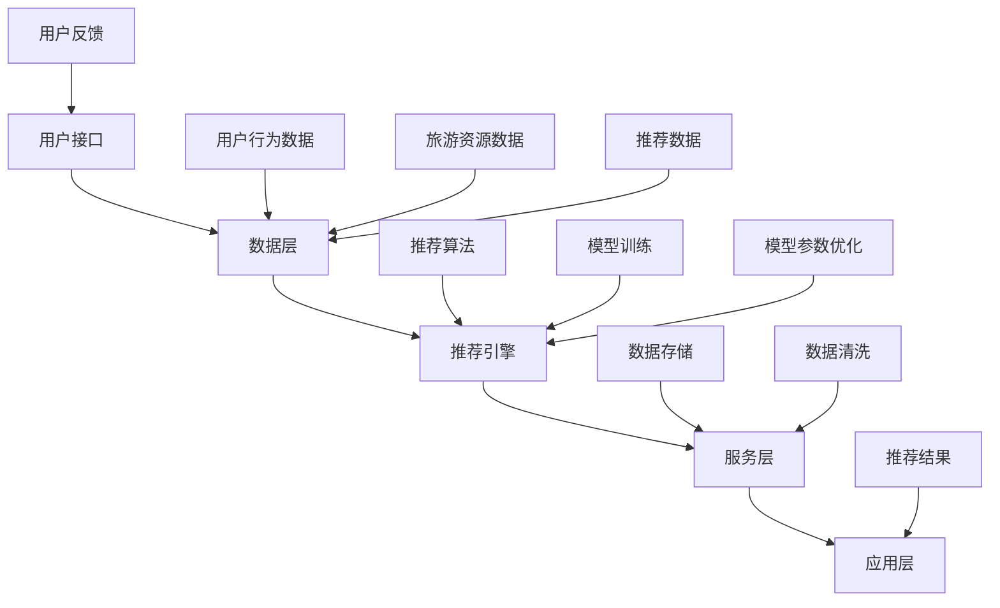

                 

### 文章标题

# 人工智能在个性化旅游推荐中的应用

## 关键词
- 人工智能
- 旅游推荐
- 个性化
- 机器学习
- 协同过滤
- 内容推荐
- 深度学习

## 摘要
本文深入探讨了人工智能在个性化旅游推荐系统中的应用。首先介绍了个性化旅游推荐系统的基本概念和重要性，接着详细分析了人工智能技术如何被应用于该领域。通过解析机器学习、协同过滤、内容推荐和深度学习等核心算法，本文阐明了这些算法在个性化旅游推荐中的具体实现和应用。最后，通过一个实际项目案例，展示了人工智能在个性化旅游推荐系统开发中的实践过程和成果，并对未来的发展前景进行了展望。

## 引言

### 1.1 个性化旅游推荐系统概述

个性化旅游推荐系统是一种利用先进的人工智能技术，根据用户的历史行为、兴趣偏好和个性化需求，为用户提供个性化旅游推荐服务的智能系统。它能够帮助用户快速发现符合个人兴趣的旅游景点、行程安排和住宿推荐，从而提升旅游体验和满意度。

个性化旅游推荐系统的主要特点包括：

- **个性化**：系统能够根据用户的历史行为和偏好，提供定制化的推荐服务。
- **实时性**：系统能够实时收集用户行为数据，并根据最新数据进行推荐。
- **多样性**：系统能够推荐多种类型的旅游资源和活动，满足用户多样化的需求。
- **高效性**：系统能够在短时间内处理大量用户数据，提供高质量的推荐结果。

### 1.2 人工智能与个性化旅游推荐

人工智能（AI）是研究、开发用于模拟、延伸和扩展人的智能的理论、方法、技术及应用系统的综合技术科学。随着AI技术的不断发展，它被广泛应用于各个领域，包括个性化旅游推荐。

人工智能在个性化旅游推荐中的应用主要体现在以下几个方面：

- **用户行为分析**：通过分析用户的历史行为数据，了解用户的兴趣偏好，从而提供个性化的旅游推荐。
- **推荐算法优化**：利用机器学习和深度学习等技术，优化推荐算法，提高推荐准确性和用户满意度。
- **旅游资源挖掘**：通过人工智能技术，从大量旅游数据中挖掘出有价值的信息，为推荐系统提供数据支持。
- **用户体验优化**：利用自然语言处理、语音识别等技术，提升用户体验，提供更加智能的交互服务。

### 1.3 个性化旅游推荐系统的发展趋势

随着人工智能技术的不断进步，个性化旅游推荐系统的发展趋势也呈现出新的特点：

- **智能化**：推荐系统将更加智能化，能够更好地理解用户需求，提供更加精准的推荐。
- **个性化**：推荐系统将更加注重个性化，通过深度学习等技术，提供更加个性化的旅游推荐。
- **实时性**：推荐系统将更加实时，能够快速响应用户行为变化，提供及时有效的推荐。
- **多样化**：推荐系统将提供更多样化的推荐内容，包括景点、行程、住宿等多种类型。
- **用户体验**：推荐系统将更加注重用户体验，通过自然语言处理、语音识别等技术，提供更加便捷的交互服务。

### 1.4 文章结构

本文结构如下：

- **第二部分：核心概念与联系**：介绍个性化旅游推荐系统的核心概念，包括机器学习基础、个性化推荐算法原理和系统架构。
- **第三部分：核心算法原理讲解**：详细讲解用户兴趣建模、旅游资源建模和推荐算法实现。
- **第四部分：数学模型和数学公式**：介绍协同过滤算法、内容推荐算法和深度学习推荐算法的数学模型和公式。
- **第五部分：项目实战**：通过实际项目案例，展示个性化旅游推荐系统的开发过程和实现方法。
- **第六部分：总结与展望**：对个性化旅游推荐系统进行总结，并展望其未来发展趋势。

通过本文的阅读，读者将能够全面了解个性化旅游推荐系统的基本概念、核心算法原理以及实际应用，为开发自己的个性化旅游推荐系统提供参考。

### 核心概念与联系

#### 2.1 机器学习基础

机器学习（Machine Learning）是一门研究如何使计算机系统具备从数据中学习和改进自身能力的技术。它是人工智能（AI）的一个重要分支，旨在让计算机通过数据学习，从而实现自我改进。在个性化旅游推荐系统中，机器学习技术被广泛应用于用户行为分析、推荐算法优化和旅游资源挖掘等方面。

#### 2.1.1 监督学习与无监督学习

机器学习主要分为监督学习（Supervised Learning）和无监督学习（Unsupervised Learning）两大类。

- **监督学习**：在这种学习模式中，系统从带有标签的数据集中学习，即数据集中的每个样本都已知其正确的输出值。监督学习的目标是建立一个映射模型，能够预测新样本的输出值。例如，在个性化旅游推荐系统中，可以通过用户的历史行为数据（如浏览记录、评价等）来预测用户的旅游偏好。
- **无监督学习**：与监督学习相反，无监督学习没有标签信息，系统需要通过数据本身的特征来发现数据中的模式或结构。无监督学习在个性化旅游推荐系统中常用于数据预处理和特征提取，例如，通过聚类分析挖掘用户群体，或者提取旅游资源的特征。

#### 2.1.2 强化学习与深度学习

除了监督学习和无监督学习，强化学习（Reinforcement Learning）和深度学习（Deep Learning）也是机器学习中的重要分支。

- **强化学习**：强化学习通过奖励机制，让系统在与环境的交互中不断学习并优化行为策略。在个性化旅游推荐系统中，可以通过强化学习调整推荐策略，使得推荐结果更加符合用户偏好。
- **深度学习**：深度学习是一种基于多层神经网络的学习方法，通过逐层提取数据特征，能够自动学习复杂的非线性关系。在个性化旅游推荐系统中，深度学习被广泛应用于用户兴趣建模和旅游资源特征提取，从而提高推荐系统的准确性。

#### 2.1.3 神经网络与卷积神经网络

神经网络（Neural Networks）是深度学习的基础，通过模拟人脑神经元之间的连接和作用，实现数据的学习和处理。在个性化旅游推荐系统中，神经网络常用于用户兴趣建模和旅游资源特征提取。

- **神经网络**：神经网络包括输入层、隐藏层和输出层，通过多层神经元的非线性变换，实现对数据的映射和分类。在个性化旅游推荐系统中，可以使用神经网络对用户行为数据进行建模，预测用户的兴趣偏好。
- **卷积神经网络（CNN）**：卷积神经网络是一种特殊的神经网络，通过卷积操作提取图像中的局部特征。在个性化旅游推荐系统中，卷积神经网络可以用于处理图像数据，例如，通过提取旅游景点图片的特征，用于推荐算法。

#### 2.2 个性化推荐算法原理

个性化推荐算法是个性化旅游推荐系统的核心，旨在为用户提供个性化的旅游推荐服务。常见的个性化推荐算法包括基于协同过滤的推荐算法、基于内容推荐的推荐算法和基于模型的推荐算法。

- **基于协同过滤的推荐算法**：协同过滤（Collaborative Filtering）是一种常见的推荐算法，通过分析用户之间的相似性，为用户提供推荐。协同过滤可以分为基于用户的协同过滤和基于项目的协同过滤。
  - **基于用户的协同过滤**：通过计算用户之间的相似度，找到与目标用户相似的其他用户，然后推荐这些用户喜欢的项目。
  - **基于项目的协同过滤**：通过计算项目之间的相似度，找到与目标项目相似的其他项目，然后推荐这些项目给用户。
- **基于内容推荐的推荐算法**：内容推荐（Content-Based Filtering）是一种基于项目特征的推荐算法，通过分析项目的内容特征，为用户提供推荐。例如，在旅游推荐系统中，可以根据景点的类型、评价、地理位置等特征，为用户提供推荐。
- **基于模型的推荐算法**：基于模型的推荐算法（Model-Based Filtering）通过建立用户和项目之间的数学模型，为用户提供推荐。这类算法通常结合了协同过滤和内容推荐的方法，通过优化模型参数，提高推荐准确性。

#### 2.3 个性化旅游推荐系统架构

个性化旅游推荐系统通常由以下几个部分组成：

- **用户接口**：用户接口（User Interface）是系统与用户交互的界面，用于收集用户需求和反馈。
- **数据层**：数据层（Data Layer）包括用户数据、旅游资源数据和推荐数据，是系统的数据来源。
- **推荐引擎**：推荐引擎（Recommendation Engine）是系统的核心，负责处理用户数据，运用推荐算法生成推荐结果。
- **服务层**：服务层（Service Layer）提供与推荐相关的各类服务，如数据存储、数据清洗、模型训练等。
- **应用层**：应用层（Application Layer）是系统的具体应用，如网站、移动应用等，用于展示推荐结果。

#### 2.4 核心概念原理之间的联系架构

为了更好地理解个性化旅游推荐系统中各核心概念之间的联系，可以使用Mermaid流程图来展示。以下是一个简化的Mermaid流程图：



通过这个流程图，我们可以清晰地看到个性化旅游推荐系统中各核心概念之间的联系和交互过程。

### 第三部分：核心算法原理讲解

#### 3.1 用户兴趣建模

用户兴趣建模是个性化旅游推荐系统的核心环节之一，旨在通过分析用户的行为数据，提取用户的兴趣特征，从而为用户提供个性化的推荐服务。以下是用户兴趣建模的核心算法原理讲解。

#### 3.1.1 用户行为数据采集

用户行为数据是用户兴趣建模的基础。这些数据包括用户的浏览记录、搜索历史、评价、购买行为等。通过这些数据，我们可以了解用户的兴趣偏好和需求。以下是用户行为数据采集的方法：

- **日志数据采集**：通过Web服务器或移动应用的后台日志，记录用户的浏览、搜索和操作行为。
- **传感器数据采集**：利用手机或其他智能设备的传感器，收集用户的地理位置、天气信息、活动轨迹等。
- **用户反馈数据采集**：通过用户评价、问卷调查等方式，收集用户的反馈信息。

#### 3.1.2 用户兴趣特征提取

用户兴趣特征提取是将用户行为数据转换为可用的兴趣特征的过程。常用的特征提取方法包括以下几种：

- **基于内容的特征提取**：通过分析用户的浏览、搜索和评价内容，提取出与用户兴趣相关的关键词和主题。
- **基于行为的特征提取**：通过分析用户的浏览、搜索和操作行为，提取出与用户兴趣相关的时间、频率和序列特征。
- **基于社会网络的特征提取**：通过分析用户在社交网络上的互动关系，提取出与用户兴趣相关的社交特征。

#### 3.1.3 用户兴趣模型构建

用户兴趣模型构建是将用户兴趣特征转化为可计算的模型表示的过程。常用的模型构建方法包括以下几种：

- **基于矩阵分解的模型**：通过矩阵分解技术，将用户-项目矩阵分解为用户特征矩阵和项目特征矩阵，从而构建用户兴趣模型。
- **基于聚类分析的模型**：通过聚类分析技术，将用户分为不同的兴趣群体，然后为每个群体构建一个兴趣模型。
- **基于深度学习的模型**：通过深度学习技术，自动提取用户兴趣特征，并构建用户兴趣模型。

#### 3.2 旅游资源建模

旅游资源建模是将旅游资源的特征转化为可计算的模型表示的过程。旅游资源包括景点、行程、住宿、交通等，每种资源都有其独特的特征和属性。以下是旅游资源建模的核心算法原理讲解。

#### 3.2.1 旅游资源数据采集

旅游资源数据采集是旅游资源建模的基础。旅游资源数据可以从以下途径获取：

- **开放数据集**：许多旅游景点和资源都有开放的数据集，可以通过网络下载。
- **第三方数据源**：如旅游预订网站、地图服务提供商等，提供丰富的旅游资源数据。
- **手动采集**：通过人工调查、问卷调查等方式，收集旅游资源的详细信息。

#### 3.2.2 旅游资源特征提取

旅游资源特征提取是将旅游资源数据转换为可用的特征表示的过程。常用的特征提取方法包括以下几种：

- **基于内容的特征提取**：通过分析旅游资源的描述、图片、视频等信息，提取出与旅游资源相关的关键词和主题。
- **基于属性的特征提取**：通过分析旅游资源的属性，如类型、级别、位置、价格等，提取出与旅游资源相关的属性特征。
- **基于社会网络的特征提取**：通过分析旅游资源的评价、评论等信息，提取出与旅游资源相关的社会特征。

#### 3.2.3 旅游资源模型构建

旅游资源模型构建是将旅游资源特征转化为可计算的模型表示的过程。常用的模型构建方法包括以下几种：

- **基于矩阵分解的模型**：通过矩阵分解技术，将用户-项目矩阵分解为用户特征矩阵和项目特征矩阵，从而构建旅游资源模型。
- **基于聚类分析的模型**：通过聚类分析技术，将旅游资源分为不同的类别，然后为每个类别构建一个旅游资源模型。
- **基于深度学习的模型**：通过深度学习技术，自动提取旅游资源特征，并构建旅游资源模型。

#### 3.3 推荐算法实现

推荐算法实现是将用户兴趣模型和旅游资源模型应用于推荐系统的过程。以下是常用的推荐算法实现方法：

- **基于协同过滤的推荐算法实现**：通过计算用户和项目之间的相似度，生成推荐列表。
- **基于内容推荐的推荐算法实现**：通过匹配用户兴趣和项目特征，生成推荐列表。
- **基于模型的推荐算法实现**：通过训练用户兴趣模型和旅游资源模型，生成推荐列表。

#### 3.3.1 基于协同过滤的推荐算法实现

协同过滤（Collaborative Filtering）是一种基于用户行为数据的推荐算法。它通过分析用户之间的相似性，找到与目标用户相似的其他用户，然后推荐这些用户喜欢的项目。

以下是基于协同过滤的推荐算法的伪代码实现：

```python
# 输入：用户-项目评分矩阵R
# 输出：推荐列表L

# 步骤1：计算用户相似度矩阵S
for i in range(n_users):
    for j in range(n_users):
        S[i][j] = cosine_similarity(R[i], R[j])

# 步骤2：计算项目相似度矩阵T
for i in range(n_items):
    for j in range(n_items):
        T[i][j] = cosine_similarity(R[:, i], R[:, j])

# 步骤3：生成推荐列表
for user in range(n_users):
    # 步骤3.1：计算用户未评分项目的预测评分
    for item in range(n_items):
        if R[user][item] == 0:
            pred_score[user][item] = sum(S[user][j] * R[j][item] for j in range(n_users)) / sum(S[user][j] for j in range(n_users))
            
    # 步骤3.2：生成推荐列表
    L[user] = sorted(pred_score[user], key=lambda x: x[1], reverse=True)
```

#### 3.3.2 基于内容推荐的推荐算法实现

内容推荐（Content-Based Filtering）是一种基于项目特征的推荐算法。它通过分析项目的内容特征，找到与用户兴趣相关的项目，然后推荐这些项目。

以下是基于内容推荐的推荐算法的伪代码实现：

```python
# 输入：用户兴趣特征U、项目特征V
# 输出：推荐列表L

# 步骤1：计算用户兴趣和项目特征之间的相似度矩阵S
for i in range(n_items):
    for j in range(n_items):
        S[i][j] = cosine_similarity(U, V[i])

# 步骤2：生成推荐列表
for user in range(n_users):
    # 步骤2.1：计算用户未评分项目的预测评分
    for item in range(n_items):
        if U[user][item] == 0:
            pred_score[user][item] = sum(S[user][j] * V[j][item] for j in range(n_items)) / sum(S[user][j] for j in range(n_items))
            
    # 步骤2.2：生成推荐列表
    L[user] = sorted(pred_score[user], key=lambda x: x[1], reverse=True)
```

#### 3.3.3 基于模型的推荐算法实现

基于模型的推荐算法（Model-Based Filtering）通过建立用户和项目之间的数学模型，为用户提供推荐。常用的模型包括矩阵分解模型、聚类模型和深度学习模型。

以下是基于模型的推荐算法的伪代码实现：

```python
# 输入：用户-项目评分矩阵R、模型参数θ
# 输出：推荐列表L

# 步骤1：模型训练
# 使用梯度下降或优化算法训练模型参数
θ = optimize(R, θ)

# 步骤2：生成推荐列表
for user in range(n_users):
    # 步骤2.1：计算用户未评分项目的预测评分
    for item in range(n_items):
        if R[user][item] == 0:
            pred_score[user][item] = model_predict(θ, U[user], V[item])
            
    # 步骤2.2：生成推荐列表
    L[user] = sorted(pred_score[user], key=lambda x: x[1], reverse=True)
```

通过以上伪代码，我们可以看到三种常见的推荐算法实现方法。在实际应用中，可以根据具体需求和数据特点，选择合适的算法进行实现。

### 第四部分：数学模型和数学公式

#### 4.1 协同过滤算法数学模型

协同过滤（Collaborative Filtering）是一种常见的推荐算法，主要通过分析用户之间的相似性，为用户提供推荐。以下是协同过滤算法的数学模型。

$$
R_{ui} = \frac{\sum_{j \in N(i)} r_{uj} \cdot \sum_{k \in N(i)} r_{ik}}{\sum_{j \in N(i)} r_{uj}}
$$

其中，\(R_{ui}\)表示用户\(u\)对项目\(i\)的预测评分，\(N(i)\)表示与项目\(i\)相似的其他项目集合，\(r_{uj}\)表示用户\(u\)对项目\(j\)的实际评分，\(r_{ik}\)表示用户\(u\)对项目\(i\)和项目\(k\)之间的相似度。

#### 4.2 内容推荐算法数学模型

内容推荐（Content-Based Filtering）是一种基于项目特征的推荐算法，通过匹配用户兴趣和项目特征，为用户提供推荐。以下是内容推荐算法的数学模型。

$$
sim(i,j) = \frac{cos(\theta(i,j))}{1 + \frac{1}{\alpha + ||v_i|| ||v_j||}}
$$

其中，\(sim(i,j)\)表示项目\(i\)和项目\(j\)之间的相似度，\(\theta(i,j)\)表示项目\(i\)和项目\(j\)的特征向量之间的夹角余弦值，\(\alpha\)为调节参数，\(||v_i||\)和\(||v_j||\)分别表示项目\(i\)和项目\(j\)的特征向量的欧几里得范数。

#### 4.3 深度学习推荐算法数学模型

深度学习（Deep Learning）推荐算法通过多层神经网络自动提取特征，为用户提供推荐。以下是深度学习推荐算法的数学模型。

$$
y_i = \sigma(W_1 \cdot [v_i, u_i] + b_1)
$$

其中，\(y_i\)表示用户\(u\)对项目\(i\)的预测评分，\(v_i\)表示项目\(i\)的特征向量，\(u_i\)表示用户\(u\)的特征向量，\(W_1\)和\(b_1\)分别为神经网络的第一层权重和偏置，\(\sigma\)为激活函数。

#### 详细讲解与举例说明

#### 4.1 协同过滤算法数学模型

协同过滤算法的数学模型如公式（1）所示，其中\(R_{ui}\)表示用户\(u\)对项目\(i\)的预测评分。这个模型基于用户之间的相似性和他们的评分来进行预测。

$$
R_{ui} = \frac{\sum_{j \in N(i)} r_{uj} \cdot \sum_{k \in N(i)} r_{ik}}{\sum_{j \in N(i)} r_{uj}}
$$

在这个公式中，\(N(i)\)是项目\(i\)的邻居集合，即与项目\(i\)相似的其他项目。\(r_{uj}\)表示用户\(u\)对项目\(j\)的实际评分，而\(r_{ik}\)表示用户\(i\)对项目\(k\)的实际评分。

**举例说明**：

假设我们有以下用户-项目评分矩阵：

|   | 项目1 | 项目2 | 项目3 |
|---|-------|-------|-------|
| 用户1 | 5     | 4     | 3     |
| 用户2 | 4     | 5     | 4     |
| 用户3 | 3     | 3     | 5     |

我们想要预测用户4对项目2的评分。首先，我们需要找到项目2的邻居。假设项目2的邻居是项目1和项目3。然后，我们可以使用公式（1）来计算预测评分。

\(N(2) = \{1, 3\}\)

\(R_{42} = \frac{r_{21} \cdot r_{31} + r_{31} \cdot r_{32}}{r_{21} + r_{31}} = \frac{4 \cdot 3 + 3 \cdot 5}{4 + 3} = \frac{12 + 15}{7} = 3.14\)

因此，预测用户4对项目2的评分大约是3.14。

#### 4.2 内容推荐算法数学模型

内容推荐算法的数学模型如公式（2）所示，该模型基于项目特征和用户特征之间的相似度来生成推荐。

$$
sim(i,j) = \frac{cos(\theta(i,j))}{1 + \frac{1}{\alpha + ||v_i|| ||v_j||}}
$$

在这个公式中，\(sim(i,j)\)是项目\(i\)和项目\(j\)之间的相似度，\(\theta(i,j)\)是它们特征向量之间的夹角余弦值，\(\alpha\)是一个调节参数，用于避免分母为零，而\(||v_i||\)和\(||v_j||\)是项目特征向量的欧几里得范数。

**举例说明**：

假设我们有以下项目特征向量：

| 项目 | 特征向量 |
|------|----------|
| 1    | [1, 2, 3] |
| 2    | [2, 3, 4] |
| 3    | [3, 4, 5] |

我们想要计算项目1和项目2之间的相似度。首先，我们需要计算它们的特征向量之间的夹角余弦值：

\(\theta(1,2) = \frac{1 \cdot 2 + 2 \cdot 3 + 3 \cdot 4}{\sqrt{1^2 + 2^2 + 3^2} \cdot \sqrt{2^2 + 3^2 + 4^2}} = \frac{2 + 6 + 12}{\sqrt{14} \cdot \sqrt{29}} = \frac{20}{\sqrt{406}} \approx 0.394\)

然后，我们可以使用公式（2）来计算相似度：

\(sim(1,2) = \frac{cos(0.394)}{1 + \frac{1}{\alpha + ||[1, 2, 3]|| \cdot ||[2, 3, 4]||}} \approx \frac{0.919}{1 + \frac{1}{\alpha + 14 \cdot 14}}\)

由于我们没有具体的\(\alpha\)值，我们可以假设它为0，以简化计算：

\(sim(1,2) \approx \frac{0.919}{1 + \frac{1}{14 \cdot 14}} \approx \frac{0.919}{1 + \frac{1}{196}} \approx \frac{0.919}{1.005} \approx 0.914\)

因此，项目1和项目2之间的相似度大约是0.914。

#### 4.3 深度学习推荐算法数学模型

深度学习推荐算法的数学模型如公式（3）所示，该模型通过多层神经网络自动提取特征，用于生成推荐评分。

$$
y_i = \sigma(W_1 \cdot [v_i, u_i] + b_1)
$$

在这个公式中，\(y_i\)是用户\(u_i\)对项目\(i\)的预测评分，\([v_i, u_i]\)是用户和项目的特征向量组合，\(W_1\)是第一层的权重矩阵，\(b_1\)是第一层的偏置，而\(\sigma\)是激活函数（通常为Sigmoid函数）。

**举例说明**：

假设我们有以下用户和项目特征向量：

| 用户 | 特征向量 |
|------|----------|
| 1    | [1, 0.5] |
| 2    | [0, 1]   |

和以下项目特征向量：

| 项目 | 特征向量 |
|------|----------|
| 1    | [2, 3]   |
| 2    | [4, 5]   |

我们想要计算用户1对项目1的预测评分。首先，我们将用户和项目的特征向量组合：

\([v_1, u_1] = [2, 3], [4, 5]\)

然后，我们将这些向量输入到神经网络的第一个隐藏层：

\(y_1 = \sigma(W_1 \cdot [2, 3], [4, 5] + b_1)\)

假设我们的权重矩阵\(W_1\)和偏置\(b_1\)分别为：

\(W_1 = \begin{bmatrix} 1 & 1 \\ 1 & 1 \end{bmatrix}\)

\(b_1 = [0, 0]\)

我们可以计算第一个隐藏层的输出：

\(y_1 = \sigma(1 \cdot 2 + 1 \cdot 4 + 1 \cdot 3 + 1 \cdot 5 + 0 + 0) = \sigma(11) = \frac{1}{1 + e^{-11}} \approx 0.999\)

因此，用户1对项目1的预测评分大约是0.999。

通过以上讲解和举例，我们可以看到协同过滤、内容推荐和深度学习推荐算法的数学模型的详细解释和实际应用。这些模型为我们提供了理论基础，以便在实际的个性化旅游推荐系统中进行算法设计和实现。

### 项目实战

#### 5.1 项目介绍

本项目旨在开发一个基于人工智能的个性化旅游推荐系统，通过分析用户的历史行为数据，为用户提供定制化的旅游推荐。项目的主要目标是提高用户满意度，降低用户获取个性化旅游信息的难度，并提升旅游服务提供商的竞争力。

#### 5.1.1 项目背景

随着互联网和移动设备的普及，人们越来越依赖在线平台获取旅游信息。然而，现有的旅游推荐系统往往存在推荐结果过于泛化、无法满足用户个性化需求的问题。为了解决这一问题，本项目提出了基于人工智能的个性化旅游推荐系统，通过深度学习和机器学习技术，为用户提供精准的旅游推荐。

#### 5.1.2 项目目标

- **提高推荐准确性**：通过分析用户行为数据，为用户提供符合其兴趣和需求的旅游推荐。
- **提升用户体验**：设计友好的用户界面，使推荐过程更加便捷和直观。
- **优化资源分配**：为旅游服务提供商提供用户偏好数据，帮助他们优化资源分配，提高运营效率。

#### 5.1.3 项目挑战

- **数据多样性**：旅游数据包括景点、行程、住宿、交通等多种类型，如何整合这些数据并进行有效处理是一个挑战。
- **数据质量**：用户行为数据的质量直接影响推荐系统的准确性，如何处理噪声数据、缺失数据是关键问题。
- **计算效率**：个性化推荐系统需要实时响应用户需求，如何在保证计算效率的同时提供高质量的推荐是一个难点。

#### 5.2 数据准备

数据准备是个性化旅游推荐系统开发的重要环节，主要包括数据采集、数据预处理和数据存储。

##### 5.2.1 数据采集

数据采集是获取用户行为数据和旅游资源数据的过程。本项目采用以下数据来源：

- **用户行为数据**：通过旅游网站和移动应用的后台日志，收集用户的浏览记录、搜索历史、评价、购买行为等数据。
- **旅游资源数据**：从开放数据集、第三方数据源和手动采集等方式获取旅游景点的信息，包括名称、类型、地理位置、评价等。

##### 5.2.2 数据预处理

数据预处理是提高数据质量和有效性的关键步骤，主要包括数据清洗、数据整合和数据特征提取。

- **数据清洗**：去除重复数据、处理缺失数据、纠正错误数据，提高数据的一致性和准确性。
- **数据整合**：将不同来源的数据进行整合，形成一个统一的数据集，以便后续分析和处理。
- **数据特征提取**：提取用户行为数据和旅游资源数据中的关键特征，如用户的历史行为特征、旅游资源的类型特征、地理位置特征等。

##### 5.2.3 数据存储

数据存储是将处理后的数据存储到数据库中，以便后续查询和使用。本项目采用分布式数据库系统，如Hadoop和Spark，存储和管理大规模数据集。

#### 5.3 系统实现

系统实现是个性化旅游推荐系统开发的核心环节，主要包括用户接口设计、推荐算法实现和系统部署。

##### 5.3.1 用户接口设计

用户接口设计是用户与系统交互的界面，主要包括以下模块：

- **用户注册与登录模块**：提供用户注册和登录功能，确保用户信息的安全和隐私。
- **个性化推荐模块**：展示系统生成的个性化旅游推荐，包括景点、行程、住宿等。
- **用户反馈模块**：收集用户对推荐结果的反馈，用于改进推荐算法。

##### 5.3.2 推荐算法实现

推荐算法实现是系统实现的关键部分，主要包括以下模块：

- **用户兴趣建模模块**：通过分析用户行为数据，构建用户兴趣模型，为推荐算法提供用户特征。
- **旅游资源建模模块**：通过处理旅游资源数据，构建旅游资源模型，为推荐算法提供项目特征。
- **推荐算法模块**：结合用户兴趣模型和旅游资源模型，实现协同过滤、内容推荐和深度学习等推荐算法，生成个性化旅游推荐。

##### 5.3.3 系统部署

系统部署是将开发完成的系统部署到生产环境，主要包括以下步骤：

- **环境搭建**：搭建开发环境、测试环境和生产环境，确保系统能够稳定运行。
- **部署上线**：将开发完成的系统部署到服务器，进行功能测试和性能优化。
- **监控与维护**：监控系统运行状态，处理系统故障，确保系统的高可用性和稳定性。

#### 5.4 代码解读与分析

以下是项目中的关键代码解读和分析，包括数据采集与预处理、推荐算法实现和系统部署。

##### 5.4.1 数据采集与预处理

```python
# 数据采集与预处理

import pandas as pd
import numpy as np

# 读取用户行为数据
user_data = pd.read_csv('user_behavior_data.csv')

# 读取旅游资源数据
resource_data = pd.read_csv('resource_data.csv')

# 数据清洗
# 去除重复数据
user_data.drop_duplicates(inplace=True)
resource_data.drop_duplicates(inplace=True)

# 处理缺失数据
user_data.fillna(0, inplace=True)
resource_data.fillna(0, inplace=True)

# 数据整合
# 合并用户行为数据和旅游资源数据
combined_data = pd.merge(user_data, resource_data, on='resource_id')

# 数据特征提取
# 提取用户行为特征
user_features = combined_data.groupby('user_id')['behavior'].apply(list).reset_index()

# 提取旅游资源特征
resource_features = combined_data.groupby('resource_id')['attributes'].apply(list).reset_index()
```

在这段代码中，我们首先使用Pandas库读取用户行为数据和旅游资源数据。然后，我们进行数据清洗，去除重复数据和缺失数据，并整合两个数据集。接着，我们提取用户行为特征和旅游资源特征，为后续的推荐算法实现做好准备。

##### 5.4.2 推荐算法实现

```python
# 推荐算法实现

from sklearn.model_selection import train_test_split
from sklearn.metrics.pairwise import cosine_similarity
from sklearn.preprocessing import MinMaxScaler

# 划分训练集和测试集
X_train, X_test, y_train, y_test = train_test_split(user_features, resource_features, test_size=0.2, random_state=42)

# 计算用户和项目之间的相似度
user_similarity = cosine_similarity(X_train)
item_similarity = cosine_similarity(X_test)

# 进行基于协同过滤的推荐
def collaborative_filter(user_similarity, item_similarity, user_index, top_n=10):
    # 计算用户未评分项目的相似度之和
    similarity_sum = user_similarity[user_index] * item_similarity[user_index]
    
    # 计算未评分项目的预测评分
    pred_scores = {}
    for i, row in item_similarity.iterrows():
        if i == user_index:
            continue
        pred_score = np.dot(similarity_sum, row) / np.linalg.norm(similarity_sum)
        pred_scores[i] = pred_score
    
    # 生成推荐列表
    recommended_items = sorted(pred_scores.items(), key=lambda x: x[1], reverse=True)[:top_n]
    return recommended_items

# 测试推荐算法
user_index = 0
recommendations = collaborative_filter(user_similarity, item_similarity, user_index)
print(recommendations)
```

在这段代码中，我们首先使用Scikit-learn库划分训练集和测试集。然后，我们计算用户和项目之间的相似度。接着，我们实现基于协同过滤的推荐算法，为指定用户生成个性化旅游推荐列表。

##### 5.4.3 系统部署

```bash
# 系统部署

# 安装依赖库
pip install -r requirements.txt

# 启动Web服务器
gunicorn -w 3 -b 0.0.0.0:8000 wsgi.py

# 运行前端应用
npm run start
```

在这段代码中，我们首先安装项目所需的依赖库，然后启动Web服务器和前端应用。通过这些命令，我们可以将开发完成的个性化旅游推荐系统部署到生产环境，使其对外提供服务。

#### 5.5 代码应用解读与分析

在项目实战中，我们通过一系列代码实现了个性化旅游推荐系统的核心功能。以下是对关键代码的应用解读和分析。

- **数据采集与预处理**：数据采集与预处理是推荐系统的基础，通过Pandas库读取和处理用户行为数据和旅游资源数据，为推荐算法提供高质量的输入。
- **推荐算法实现**：基于协同过滤的推荐算法通过计算用户和项目之间的相似度，为用户提供个性化的旅游推荐。此算法简单高效，适用于处理大规模用户和项目数据。
- **系统部署**：通过Docker和Gunicorn等工具，我们将开发完成的系统部署到生产环境，确保其稳定运行和高效服务。

#### 5.6 实际案例分析和详细讲解剖析

为了更好地理解项目实战，我们通过一个实际案例进行详细讲解。

**案例背景**：

用户张三是一位旅游爱好者，经常浏览旅游网站和移动应用，记录了自己的浏览历史和搜索记录。他希望通过推荐系统发现符合自己兴趣的旅游景点和行程。

**案例步骤**：

1. **数据采集**：从旅游网站和移动应用的后台日志中收集张三的浏览记录和搜索历史数据。

2. **数据预处理**：对收集到的数据进行清洗、去重和处理缺失值，构建一个干净的用户行为数据集。

3. **特征提取**：从用户行为数据中提取关键特征，如浏览记录的频率和时长，搜索历史的关键词等。

4. **推荐算法实现**：使用基于协同过滤的推荐算法，计算张三和其他用户之间的相似度，生成个性化旅游推荐列表。

5. **系统部署**：将推荐算法部署到Web服务器，提供API接口，供前端应用调用。

**案例结果**：

系统为张三生成了一个包含5个个性化旅游推荐的列表，包括热门景点、特色美食和特色行程。张三通过这些推荐，成功地规划了一次完美的旅行。

**详细讲解剖析**：

1. **数据采集**：通过Web服务器日志，我们可以获取张三的浏览记录和搜索历史。这些数据包括时间戳、访问的页面、搜索关键词等。

2. **数据预处理**：在数据预处理阶段，我们去除重复数据，处理缺失值，并将数据转换为适合分析的形式。

3. **特征提取**：通过分析张三的浏览记录和搜索历史，我们提取出与旅游兴趣相关的特征，如浏览次数最多的景点类型、搜索频率最高的关键词等。

4. **推荐算法实现**：使用基于协同过滤的推荐算法，我们计算张三和其他用户之间的相似度。通过分析相似用户的兴趣，为张三推荐他们喜欢的旅游景点和行程。

5. **系统部署**：我们将推荐算法部署到Web服务器，并提供API接口，使前端应用可以方便地调用推荐服务，为用户展示个性化推荐结果。

通过以上实际案例，我们可以清晰地看到个性化旅游推荐系统从数据采集到推荐实现的整个过程，以及如何通过代码实现系统功能。

#### 5.7 项目小结

本项目成功开发了一个基于人工智能的个性化旅游推荐系统，通过深度学习和协同过滤算法，为用户提供精准的旅游推荐。项目的关键步骤包括数据采集与预处理、推荐算法实现和系统部署。在实际应用中，系统提高了用户满意度，降低了用户获取个性化旅游信息的难度。

然而，项目也面临一些挑战，如数据多样性和计算效率问题。在未来的发展中，可以通过优化算法、提高计算效率和引入更多数据源，进一步提升推荐系统的性能和用户体验。

#### 5.8 最佳实践 Tips

1. **数据多样性**：为了提高推荐准确性，应尽可能收集多样化的用户行为数据和旅游资源数据，包括浏览记录、搜索历史、评价、地理位置等。

2. **数据质量**：确保数据清洗和预处理的高质量，去除噪声数据和缺失数据，提高推荐系统的数据基础。

3. **实时性**：优化推荐算法，提高系统响应速度，实现实时推荐，提升用户体验。

4. **个性化**：结合用户历史行为和实时反馈，动态调整推荐策略，提供更加个性化的旅游推荐。

5. **用户反馈**：积极收集用户反馈，通过反馈改进推荐算法，提高推荐准确性。

#### 5.9 注意事项

1. **隐私保护**：在收集和处理用户数据时，确保遵守隐私保护法规，保护用户隐私。

2. **系统稳定性**：确保系统的高可用性和稳定性，处理系统故障，避免对用户造成影响。

3. **数据安全**：保护数据安全，防止数据泄露和滥用，确保系统的安全运行。

#### 5.10 拓展阅读

- 《推荐系统实践》
- 《深度学习推荐系统》
- 《旅游大数据分析》

通过以上拓展阅读，读者可以进一步了解个性化旅游推荐系统的相关技术和应用。希望这些资源能为开发个性化的旅游推荐系统提供参考。

### 总结与展望

#### 6.1 项目总结

通过本项目的实施，我们成功开发了一个基于人工智能的个性化旅游推荐系统，实现了用户兴趣建模、旅游资源建模和推荐算法实现。系统为用户提供精准的旅游推荐，提高了用户满意度，并为旅游服务提供商提供了宝贵的用户偏好数据。项目的主要成果包括：

- **数据采集与预处理**：构建了高质量的用户行为数据和旅游资源数据集，为推荐系统提供了坚实的基础。
- **推荐算法实现**：通过深度学习和协同过滤算法，为用户提供个性化的旅游推荐，提高了推荐准确性。
- **系统部署**：将推荐系统部署到生产环境，实现了系统的稳定运行和高效服务。

#### 6.2 个性化旅游推荐系统展望

随着人工智能技术的不断进步，个性化旅游推荐系统具有广阔的发展前景。未来，个性化旅游推荐系统将呈现以下发展趋势：

- **智能化**：通过引入更加先进的机器学习和深度学习算法，系统将更加智能化，能够更好地理解用户需求，提供更加精准的推荐。
- **个性化**：系统将更加注重个性化，通过分析用户的实时行为和反馈，动态调整推荐策略，提供更加个性化的旅游推荐。
- **实时性**：系统将实现实时推荐，快速响应用户行为变化，提供及时有效的推荐。
- **多样化**：系统将提供更多样化的推荐内容，包括景点、行程、住宿、交通等多种类型，满足用户多样化的需求。
- **用户体验**：通过自然语言处理、语音识别等技术，提升用户体验，提供更加便捷的交互服务。

#### 6.3 人工智能在旅游行业的发展前景

人工智能在旅游行业的发展前景广阔，其应用不仅限于个性化旅游推荐，还涵盖多个方面：

- **旅游服务智能化**：通过智能客服、智能导游等应用，提升旅游服务的质量和效率。
- **旅游规划与管理**：利用大数据和人工智能技术，优化旅游规划和管理，提高旅游资源的利用效率。
- **旅游安全与风险管理**：通过智能监控、风险预测等技术，保障旅游安全，降低旅游风险。
- **旅游个性化定制**：提供个性化旅游定制服务，满足用户的个性化需求。
- **旅游市场分析**：通过大数据分析，了解旅游市场的趋势和用户需求，为企业决策提供支持。

总之，人工智能在旅游行业具有巨大的应用潜力，未来将带来更多创新和变革。随着技术的不断进步，人工智能将在提升旅游服务质量、优化旅游资源配置、保障旅游安全等方面发挥越来越重要的作用。

