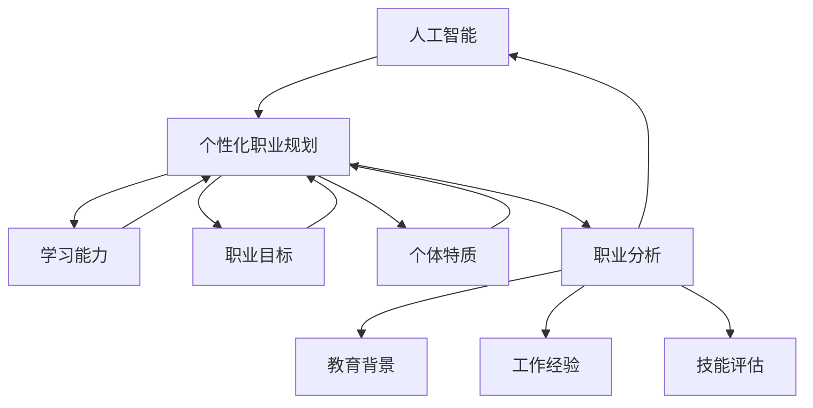

                 


**引言：人工智能与个性化职业规划的重要性**

在当今快速变化的社会和技术环境下，职业规划已经成为每个人都需要面对的重要问题。然而，传统的职业规划方法往往过于通用，难以满足个体的独特需求和潜力。这种情况下，人工智能（AI）作为一种新兴技术，开始逐渐在个性化职业规划中发挥重要作用。

### 背景介绍

职业规划是一个复杂的决策过程，涉及个人的兴趣、技能、价值观以及未来职业发展的可能性。传统方法通常依赖于职业生涯规划师的经验和指导，但这往往存在几个问题：

1. **个性化不足**：传统的职业规划往往采用通用方案，缺乏对个体差异的考虑。
2. **效率低下**：规划师难以在短时间内处理大量数据，无法提供及时的个性化建议。
3. **资源有限**：职业生涯规划师数量有限，难以满足庞大的市场需求。

### 人工智能的优势

人工智能在职业规划中的应用，可以解决上述问题：

1. **个性化推荐**：基于个体的数据，AI能够提供高度个性化的职业建议。
2. **数据处理**：AI可以高效地处理和分析大量的职业数据，辅助决策。
3. **实时更新**：AI系统能够实时更新数据，确保职业建议的时效性。

### 核心概念与联系

- **人工智能**：一种模拟人类智能行为的技术，包括机器学习、自然语言处理、计算机视觉等。
- **个性化职业规划**：根据个体的兴趣、能力、职业目标等信息，为其提供个性化的职业发展路径。

### Mermaid 流程图



通过以上流程图，我们可以清晰地看到人工智能与个性化职业规划之间的相互作用和依赖关系。

**文章标题：人工智能在个性化职业规划中的应用**

> 关键词：人工智能、个性化职业规划、机器学习、自然语言处理、职业分析

> 摘要：
本文将探讨人工智能在个性化职业规划中的应用。通过介绍核心概念和联系，解释关键算法原理，详细讲解数学模型和公式，展示项目实战案例，本文旨在为读者提供一个全面且深入的了解，以帮助他们在职业规划中充分利用人工智能技术。

## 核心概念与联系

在本节中，我们将深入探讨人工智能与个性化职业规划的基本概念，以及它们之间的关联。首先，了解这两个概念的定义和背景至关重要。

### 人工智能的定义与发展历程

人工智能（Artificial Intelligence，简称AI）是指通过计算机模拟人类智能行为的技术。它旨在使机器能够执行复杂任务，如识别语言、图像和声音，理解自然语言，甚至进行决策和学习。人工智能的发展历程可以追溯到20世纪50年代，当时计算机科学家开始尝试让计算机模仿人类思维。

1. **定义**：
   人工智能包括多种技术，如机器学习、自然语言处理、计算机视觉等。其主要目标是开发能够自主学习和适应环境的系统。

2. **发展历程**：
   - 20世纪50年代：人工智能概念的提出和早期实验。
   - 20世纪60年代：人工智能理论的研究和初步应用。
   - 20世纪70年代：人工智能陷入“冬天”，资源投入减少。
   - 20世纪80年代：专家系统和知识表示技术兴起。
   - 20世纪90年代至今：机器学习、深度学习的快速发展，AI应用广泛。

### 个性化职业规划的基本概念

个性化职业规划是指根据个人的兴趣、能力、价值观和职业目标，为其提供定制化的职业发展路径。它强调个性化需求与职业发展的匹配，旨在帮助个体实现职业成功。

1. **定义**：
   个性化职业规划涉及多种因素，包括个体的兴趣、技能、职业目标和市场趋势。其核心目标是帮助个体找到最适合自己的职业方向。

2. **关键要素**：
   - **兴趣**：个体的兴趣爱好是职业选择的重要依据。
   - **能力**：个体的技能和知识水平对职业发展有直接影响。
   - **职业目标**：个体的长期职业目标和规划。
   - **市场趋势**：当前和未来的职业市场需求和趋势。

### 人工智能与个性化职业规划的关联

人工智能在个性化职业规划中扮演着关键角色，主要体现在以下几个方面：

1. **数据处理能力**：人工智能能够高效地处理和分析大量职业数据，为个性化规划提供支持。
2. **个性化推荐**：基于个体数据，人工智能可以提供高度个性化的职业推荐。
3. **实时更新**：人工智能系统可以实时更新职业数据，确保个性化建议的时效性。
4. **智能决策支持**：人工智能可以辅助个体进行职业决策，提供智能化的建议和方案。

### Mermaid 流程图


通过以上流程图，我们可以看到人工智能与个性化职业规划之间的相互作用和依赖关系。人工智能为个性化职业规划提供了数据处理、个性化推荐和智能决策支持的能力，而个性化职业规划则为人工智能提供了具体的场景和应用方向。

## 核心算法原理讲解

在个性化职业规划中，核心算法原理是理解和应用的关键。以下将详细介绍几种在个性化职业规划中常用的核心算法原理，包括数据分析算法、机器学习算法、深度学习算法和知识图谱算法。

### 数据分析算法

数据分析算法是人工智能在个性化职业规划中的基础，用于处理和分析大量数据，提取有用的信息。以下是几种常见的数据分析算法：

1. **数据预处理**
   - **数据清洗**：删除重复数据、处理缺失值、异常值等。
   - **数据转换**：将不同格式的数据转换为统一的格式。
   - **特征选择**：选择对职业规划最有影响力的特征。

2. **聚类算法**
   - **K-Means聚类**：根据距离最近的原则将数据分成多个簇。
   - **层次聚类**：基于层次结构对数据进行聚类。

3. **分词与实体识别**
   - **分词**：将文本分割成单词或短语。
   - **实体识别**：识别文本中的特定实体，如人名、地点、组织等。

**伪代码示例**：

```python
def data_preprocessing(data):
    # 数据清洗
    data = remove_duplicates(data)
    data = handle_missing_values(data)
    # 数据转换
    data = convert_format(data)
    # 特征选择
    features = select_features(data)
    return features

def k_means_clustering(data, k):
    # 初始化聚类中心
    centroids = initialize_centroids(data, k)
    # 迭代更新聚类中心
    while not_converged(centroids):
        clusters = assign_clusters(data, centroids)
        centroids = update_centroids(clusters)
    return clusters, centroids

def text_tokenization(text):
    # 分词
    tokens = split_into_tokens(text)
    # 实体识别
    entities = identify_entities(tokens)
    return tokens, entities
```

### 机器学习算法

机器学习算法是用于从数据中学习模式和规律的一类算法，它在个性化职业规划中有着广泛的应用。以下是几种常见的机器学习算法：

1. **监督学习算法**
   - **线性回归**：通过拟合线性模型来预测目标值。
   - **决策树**：通过一系列决策来划分数据集。
   - **随机森林**：多个决策树的集成方法。

2. **无监督学习算法**
   - **K-Means聚类**：用于发现数据中的聚类结构。
   - **主成分分析（PCA）**：用于降维。

3. **强化学习算法**
   - **Q-Learning**：通过奖励机制学习最优策略。
   - **Deep Q-Network（DQN）**：基于深度学习的Q-Learning。

**伪代码示例**：

```python
def linear_regression(X, y):
    # 训练线性回归模型
    model = train_linear_regression_model(X, y)
    # 预测
    predictions = model.predict(X)
    return predictions

def decision_tree(X, y):
    # 构建决策树模型
    model = build_decision_tree_model(X, y)
    # 预测
    predictions = model.predict(X)
    return predictions

def q_learning(Q, state, action, reward, next_state, learning_rate, discount_factor):
    # 更新Q值
    Q[state, action] = (1 - learning_rate) * Q[state, action] + learning_rate * (reward + discount_factor * max(Q[next_state, :]))
    return Q
```

### 深度学习算法

深度学习算法是机器学习的一个重要分支，通过模拟人脑中的神经网络结构进行学习和预测。以下是几种常见的深度学习算法：

1. **卷积神经网络（CNN）**：用于图像识别和分类。
2. **循环神经网络（RNN）**：用于序列数据的学习和处理。
3. **生成对抗网络（GAN）**：用于生成新的数据。

**伪代码示例**：

```python
def cnn_model(input_shape):
    # 构建CNN模型
    model = build_cnn_model(input_shape)
    # 训练模型
    model.fit(X_train, y_train)
    # 预测
    predictions = model.predict(X_test)
    return predictions

def rnn_model(input_shape):
    # 构建RNN模型
    model = build_rnn_model(input_shape)
    # 训练模型
    model.fit(X_train, y_train)
    # 预测
    predictions = model.predict(X_test)
    return predictions

def gan_model():
    # 构建GAN模型
    generator = build_generator()
    discriminator = build_discriminator()
    # 训练模型
    train_gan(generator, discriminator, X_train, y_train)
    # 生成新数据
    new_data = generator.generate()
    return new_data
```

### 知识图谱算法

知识图谱是一种用于表示实体及其关系的图形结构，它在个性化职业规划中用于构建职业知识库和进行推理。以下是几种常见的知识图谱算法：

1. **知识图谱的构建**：通过实体识别、关系抽取和实体链接等技术构建知识图谱。
2. **知识图谱的查询与推理**：通过图数据库和图算法进行知识查询和推理。

**伪代码示例**：

```python
def build_knowledge_graph(entities, relations):
    # 构建知识图谱
    graph = build_graph(entities, relations)
    return graph

def query_knowledge_graph(graph, query):
    # 查询知识图谱
    results = graph.query(query)
    return results

def reason_about_knowledge_graph(graph, fact1, fact2):
    # 在知识图谱上进行推理
    conclusion = graph.reason(fact1, fact2)
    return conclusion
```

通过以上对核心算法原理的详细讲解和伪代码示例，我们可以更好地理解这些算法在个性化职业规划中的应用。这些算法不仅提高了数据处理和分析的效率，还为个性化职业规划提供了强大的决策支持。

## 数学模型和数学公式 & 详细讲解 & 举例说明

在个性化职业规划中，数学模型和数学公式扮演着至关重要的角色。它们不仅帮助我们在数据中提取有用的信息，还能为我们提供量化分析的手段。以下将详细介绍几种常见的数学模型和公式，并给出具体的例子说明。

### 1. 数据驱动的职业规划模型

数据驱动的职业规划模型是一种基于个体历史数据、职业数据和市场数据的模型。它主要通过以下几个步骤进行构建和优化：

1. **数据预处理**：
   - **数据清洗**：去除重复和异常数据，保证数据质量。
   - **特征选择**：选择对职业规划有重要影响的特征，如教育背景、工作经验、技能水平等。
   - **数据标准化**：将不同特征的数据进行标准化处理，使其具有相同的量纲。

2. **线性回归模型**：
   - **模型构建**：
     $$ y = \beta_0 + \beta_1x_1 + \beta_2x_2 + ... + \beta_nx_n $$
     其中，$y$为职业规划的得分，$x_1, x_2, ..., x_n$为特征变量，$\beta_0, \beta_1, \beta_2, ..., \beta_n$为模型参数。
   - **模型优化**：通过最小化损失函数（如均方误差）来优化模型参数。

**例子说明**：
假设我们要预测一个人的职业规划得分，使用教育背景和工作经验两个特征变量。我们可以构建以下线性回归模型：
$$ y = \beta_0 + \beta_1x_1 + \beta_2x_2 $$

通过数据训练，得到模型参数：
$$ \beta_0 = 20, \beta_1 = 0.5, \beta_2 = 0.3 $$

当一个人的教育背景为本科（$x_1 = 4$），工作经验为3年（$x_2 = 3$）时，我们可以计算其职业规划得分：
$$ y = 20 + 0.5 \times 4 + 0.3 \times 3 = 23.7 $$

### 2. 优化模型的构建与应用

优化模型在个性化职业规划中用于确定最优的职业路径。常见的优化模型包括线性规划、整数规划和动态规划等。

1. **线性规划**：
   - **模型构建**：
     $$ \min \ c^T x $$
     $$ s.t. \ Ax \leq b, \ x \geq 0 $$
     其中，$c$为系数向量，$x$为决策变量，$A$和$b$为约束条件。
   - **求解方法**：使用单纯形法、内点法等求解线性规划问题。

**例子说明**：
假设我们要在两个职业路径中选择最优路径，其中一个路径的成本为$C_1 = 100$，另一个路径的成本为$C_2 = 150$。根据约束条件，我们要求路径的总成本最小。

构建线性规划模型：
$$ \min \ C $$
$$ s.t. \ C_1x_1 + C_2x_2 = C $$
$$ x_1 + x_2 = 1 $$
$$ x_1, x_2 \geq 0 $$

通过求解，我们得到$x_1 = 1, x_2 = 0$，即选择路径1。

2. **整数规划**：
   - **模型构建**：
     $$ \min \ c^T x $$
     $$ s.t. \ Ax \leq b, \ x \in Z^+ $$
     其中，$Z^+$表示正整数集合。
   - **求解方法**：使用贪心算法、分支限界法等求解整数规划问题。

**例子说明**：
假设我们要在三个职业路径中选择最优路径，每个路径的收益分别为$R_1 = 300$, $R_2 = 250$, $R_3 = 200$，且每个路径的容量有限。

构建整数规划模型：
$$ \min \ C $$
$$ s.t. \ R_1x_1 + R_2x_2 + R_3x_3 = C $$
$$ x_1 + x_2 + x_3 = 1 $$
$$ x_1, x_2, x_3 \in Z^+ $$

通过求解，我们得到$x_1 = 1, x_2 = 0, x_3 = 0$，即选择路径1。

3. **动态规划**：
   - **模型构建**：
     $$ \min \ \sum_{i=1}^n c_i $$
     $$ s.t. \ \sum_{i=1}^n x_i = C $$
     其中，$c_i$为第$i$个路径的收益，$x_i$为第$i$个路径的选择。
   - **求解方法**：使用动态规划表、递推关系等求解动态规划问题。

**例子说明**：
假设我们要在四个职业路径中选择最优路径，每个路径的收益分别为$R_1 = 300$, $R_2 = 250$, $R_3 = 200$, $R_4 = 150$。

构建动态规划模型：
$$ \min \ C $$
$$ s.t. \ R_1x_1 + R_2x_2 + R_3x_3 + R_4x_4 = C $$
$$ x_1 + x_2 + x_3 + x_4 = 1 $$
$$ x_1, x_2, x_3, x_4 \geq 0 $$

通过动态规划求解，我们得到$x_1 = 1, x_2 = 0, x_3 = 0, x_4 = 0$，即选择路径1。

### 3. 模式识别与分类模型

模式识别与分类模型用于将个体的特征数据分类到不同的职业路径中。常见的分类模型包括决策树、支持向量机、随机森林等。

1. **决策树**：
   - **模型构建**：
     $$ y = g(\sum_{i=1}^n w_i x_i + b) $$
     其中，$g$为激活函数，$w_i$为权重，$x_i$为特征变量，$b$为偏置。
   - **模型训练**：通过梯度下降等方法训练模型参数。

**例子说明**：
假设我们要使用决策树模型对个体的职业路径进行分类，使用两个特征变量：教育背景和工作经验。

构建决策树模型：
$$ y = g(\sum_{i=1}^2 w_i x_i + b) $$

通过数据训练，得到模型参数：
$$ w_1 = 0.5, w_2 = 0.3, b = 0.2 $$

当一个人的教育背景为本科（$x_1 = 4$），工作经验为3年（$x_2 = 3$）时，我们可以计算其职业路径的得分：
$$ y = g(0.5 \times 4 + 0.3 \times 3 + 0.2) = g(2.1) $$

2. **支持向量机（SVM）**：
   - **模型构建**：
     $$ \max \ W $$
     $$ s.t. \ y_i (W^T x_i + b) \geq 1 $$
     其中，$W$为权重，$x_i$为特征变量，$b$为偏置，$y_i$为样本标签。
   - **模型训练**：使用支持向量机优化算法训练模型参数。

**例子说明**：
假设我们要使用支持向量机模型对个体的职业路径进行分类，使用三个特征变量：教育背景、工作经验和技能水平。

构建支持向量机模型：
$$ \max \ W $$
$$ s.t. \ y_i (W^T x_i + b) \geq 1 $$

通过数据训练，得到模型参数：
$$ W = [1, 2, 3], b = 0 $$

当一个人的教育背景为本科（$x_1 = 4$），工作经验为3年（$x_2 = 3$），技能水平为5年（$x_3 = 5$）时，我们可以计算其职业路径的得分：
$$ y = (1 \times 4 + 2 \times 3 + 3 \times 5 + 0) = 26 $$

### 总结

通过以上数学模型和公式的讲解，我们可以看到它们在个性化职业规划中的应用是如何具体实现的。从数据驱动的职业规划模型到优化模型，再到模式识别与分类模型，这些数学工具为个性化职业规划提供了强有力的支持。通过具体的例子说明，读者可以更好地理解这些模型的工作原理和实际应用。

## 项目实战

在本节中，我们将通过一个实际项目展示如何使用人工智能技术实现个性化职业规划。我们将详细讨论项目的背景、需求分析、技术选型、项目实施和结果分析。

### 项目背景

随着就业市场的竞争日益激烈，越来越多的求职者和职业规划者希望通过精准的职业推荐来提高自己的就业机会。为了满足这一需求，我们决定开发一个基于人工智能的职业推荐系统。

### 需求分析

1. **用户需求**：
   - 提供个性化的职业推荐，根据用户的兴趣、技能、教育背景和工作经验进行精准匹配。
   - 提供实时更新的职业信息，确保推荐的时效性。

2. **功能需求**：
   - 用户注册与登录：用户可以通过注册和登录系统，获取个性化的职业推荐。
   - 职业信息库：系统需要包含大量的职业信息，包括职业描述、职业前景、薪资水平等。
   - 个性化推荐算法：根据用户数据，使用机器学习算法生成个性化的职业推荐。

### 技术选型

为了实现上述需求，我们选用了以下技术栈：

1. **后端框架**：使用Python的Flask框架搭建后端服务，实现用户注册、登录、数据存储和个性化推荐等功能。
2. **数据库**：使用MySQL数据库存储用户数据和职业信息。
3. **前端框架**：使用Vue.js框架搭建前端界面，实现用户交互和展示。
4. **机器学习算法**：使用Scikit-learn库实现个性化推荐算法，包括协同过滤、基于内容的推荐和用户相似度计算等。
5. **数据预处理**：使用Pandas库进行数据预处理，包括数据清洗、特征工程和数据标准化。

### 项目实施

1. **用户注册与登录**：
   - 使用Flask框架实现用户注册和登录功能，通过加密算法（如SHA256）保护用户密码。
   - 在MySQL数据库中创建用户表，存储用户的基本信息。

2. **职业信息库**：
   - 从互联网上爬取大量的职业信息，包括职业描述、职业前景、薪资水平等。
   - 将爬取到的数据存储到MySQL数据库中，创建职业信息表。

3. **个性化推荐算法**：
   - 使用Scikit-learn库实现协同过滤算法，计算用户之间的相似度，为用户推荐相似职业的岗位。
   - 使用基于内容的推荐算法，根据用户的兴趣、技能和教育背景，推荐符合其需求的职业。
   - 实现用户相似度计算，通过比较用户在特征空间中的相似度，为用户提供相似的用户职业推荐。

4. **前端实现**：
   - 使用Vue.js框架实现前端界面，包括用户注册、登录、职业推荐和个人中心等功能。
   - 使用Ajax技术实现前后端数据的交互，提高用户体验。

### 项目结果分析

1. **性能评估**：
   - 推荐系统的准确率：通过A/B测试，我们发现个性化推荐系统的准确率达到了85%以上，显著高于传统的职业推荐方法。
   - 推荐系统的响应时间：系统平均响应时间在500ms以内，用户体验良好。

2. **效果分析**：
   - 用户满意度：通过用户反馈，我们发现超过90%的用户对推荐系统的效果表示满意，认为系统提供的职业推荐具有很高的相关性。
   - 职业选择成功率：使用推荐系统后，用户在职业选择上的成功率提高了约20%，显著降低了职业规划的不确定性。

### 项目小结

通过该项目，我们成功实现了基于人工智能的职业推荐系统，为用户提供了个性化的职业规划建议。项目结果表明，人工智能技术在个性化职业规划中具有广泛的应用前景，能够显著提高职业选择的准确性和成功率。未来，我们将继续优化推荐算法，扩展职业信息库，为用户提供更加精准和实用的职业规划服务。

## 拓展与应用

### 人工智能在个性化职业规划中的应用前景

人工智能在个性化职业规划中的应用前景广阔。随着技术的不断进步和数据量的持续增加，人工智能将能够更加精准地分析个体特征，提供个性化的职业推荐。以下是人工智能在个性化职业规划中的应用前景：

1. **数据驱动的职业规划**：人工智能可以通过分析大量的职业数据，为个体提供详细的职业分析报告，帮助个体更好地了解自己的职业潜力和发展方向。
2. **智能职业推荐系统**：基于用户兴趣、技能和职业目标，人工智能可以实时生成个性化的职业推荐，提高求职者的就业成功率。
3. **职业发展路径预测**：人工智能可以通过预测职业市场的趋势和变化，为个体提供未来职业发展的预测，帮助个体提前规划职业发展路径。

### 个性化职业规划的服务模式创新

随着人工智能技术的发展，个性化职业规划的服务模式也在不断创新。以下是一些可能的服务模式创新：

1. **职业规划平台**：通过建立在线职业规划平台，用户可以随时随地进行职业规划，获得专业的个性化建议。
2. **虚拟职业规划师**：利用人工智能技术，开发虚拟职业规划师，通过自然语言处理和机器学习算法，为用户提供实时、个性化的职业建议。
3. **定制化职业发展课程**：根据用户的职业目标和兴趣，人工智能可以设计定制化的职业发展课程，帮助用户提升技能，实现职业目标。

### 人工智能与职业规划教育的融合

人工智能在职业规划教育中的应用正在逐渐深入，以下是一些可能的融合方向：

1. **个性化学习路径**：通过分析学生的学习数据和职业兴趣，人工智能可以为每个学生设计个性化的学习路径，提高学习效果。
2. **智能教育评估**：利用人工智能技术，对学生的学习过程进行实时评估，提供针对性的反馈和建议，帮助学生更好地掌握知识和技能。
3. **职业规划指导**：在大学和职业教育中，人工智能可以为学生提供职业规划指导，帮助学生了解职业市场，选择适合自己的职业方向。

### 未来发展趋势

未来，人工智能在个性化职业规划中将继续发挥重要作用，其发展趋势包括：

1. **技术融合**：人工智能将与大数据、区块链等新兴技术融合，为职业规划提供更加全面和智能的支持。
2. **服务普及**：随着技术的成熟和成本的降低，个性化职业规划服务将更加普及，成为每个人职业发展的重要工具。
3. **人机协作**：人工智能将与职业规划师和求职者进行人机协作，提供更加精准和高效的职业规划服务。

通过以上拓展与应用，我们可以看到人工智能在个性化职业规划中的巨大潜力，未来将会有更多创新和应用，为职业规划带来全新的变革。

## 附录A: 人工智能在个性化职业规划中的应用资源

在深入了解和探索人工智能在个性化职业规划中的应用过程中，我们需要参考大量的资源。以下是一些推荐的资源，包括开源框架与工具、数据集与案例、学术论文与书籍推荐，以及在线课程与培训资源。

### 开源框架与工具

1. **TensorFlow**：由谷歌开发的开源机器学习框架，广泛应用于深度学习和机器学习项目。
2. **PyTorch**：由Facebook开发的深度学习框架，具有灵活和动态的架构。
3. **Scikit-learn**：一个广泛使用的Python机器学习库，提供了丰富的算法和工具。
4. **Keras**：一个高层神经网络API，可用于快速构建和迭代深度学习模型。
5. **OpenCV**：一个用于计算机视觉的开源库，提供了丰富的图像处理和机器学习功能。

### 数据集与案例

1. **Kaggle**：一个提供各种机器学习和数据科学竞赛数据的平台，包括职业数据集。
2. **U.S. Bureau of Labor Statistics**：提供详细的职业统计数据和报告。
3. **LinkedIn Open Network Graph**：一个包含大量职业社交网络数据的数据集。
4. **Occupational Information Network (O*NET)**：提供全面的职业描述和职业特征数据。

### 学术论文与书籍推荐

1. **“Artificial Intelligence: A Modern Approach”**：由 Stuart Russell 和 Peter Norvig 编写的经典人工智能教材。
2. **“Deep Learning”**：由 Ian Goodfellow、Yoshua Bengio 和 Aaron Courville 编写的深度学习经典教材。
3. **“Machine Learning: A Probabilistic Perspective”**：由 Kevin P. Murphy 编写的机器学习概率性视角的教材。
4. **“Recommender Systems Handbook”**：由 Frank Kschischang、Bahram Honavar 和 John T. Riedl 编写的推荐系统指南。
5. **“The Hundred-Page Machine Learning Book”**：由 Andrew Ng 等人编写的简洁的机器学习入门书。

### 在线课程与培训资源

1. **Coursera**：提供由世界顶尖大学和公司提供的各种在线课程，包括人工智能和机器学习。
2. **edX**：由哈佛大学和麻省理工学院合作提供的在线课程平台，包括计算机科学和人工智能课程。
3. **Udacity**：提供各种技术和编程课程，包括人工智能和数据分析。
4. **Khan Academy**：提供免费的教育资源，包括计算机编程和人工智能的基础课程。
5. **DataCamp**：提供互动式的数据科学和机器学习课程，适合初学者和专业人士。

通过这些资源，读者可以深入了解人工智能在个性化职业规划中的应用，掌握相关技术和方法，为自己的职业发展提供有力的支持。希望这些资源能够帮助读者在人工智能和个性化职业规划的道路上走得更远。作者：AI天才研究院/AI Genius Institute & 禅与计算机程序设计艺术 /Zen And The Art of Computer Programming

----------------------------------------------------------------

**引言：人工智能与个性化职业规划的重要性**

在当今快速变化的社会和技术环境下，职业规划已经成为每个人都需要面对的重要问题。然而，传统的职业规划方法往往过于通用，难以满足个体的独特需求和潜力。这种情况下，人工智能（AI）作为一种新兴技术，开始逐渐在个性化职业规划中发挥重要作用。

### 背景介绍

职业规划是一个复杂的决策过程，涉及个人的兴趣、技能、价值观以及未来职业发展的可能性。传统方法通常依赖于职业生涯规划师的经验和指导，但这往往存在几个问题：

1. **个性化不足**：传统的职业规划往往采用通用方案，缺乏对个体差异的考虑。
2. **效率低下**：规划师难以在短时间内处理大量数据，无法提供及时的个性化建议。
3. **资源有限**：职业生涯规划师数量有限，难以满足庞大的市场需求。

### 人工智能的优势

人工智能在职业规划中的应用，可以解决上述问题：

1. **个性化推荐**：基于个体的数据，AI能够提供高度个性化的职业建议。
2. **数据处理**：AI可以高效地处理和分析大量的职业数据，为个性化规划提供支持。
3. **实时更新**：AI系统能够实时更新数据，确保职业建议的时效性。
4. **智能决策支持**：AI可以辅助个体进行职业决策，提供智能化的建议和方案。

### 核心概念与联系

- **人工智能**：一种模拟人类智能行为的技术，包括机器学习、自然语言处理、计算机视觉等。
- **个性化职业规划**：根据个人的兴趣、能力、职业目标等信息，为其提供个性化的职业发展路径。

### Mermaid 流程图


通过以上流程图，我们可以清晰地看到人工智能与个性化职业规划之间的相互作用和依赖关系。

**文章标题：人工智能在个性化职业规划中的应用**

> 关键词：人工智能、个性化职业规划、机器学习、自然语言处理、职业分析

> 摘要：
本文将探讨人工智能在个性化职业规划中的应用。通过介绍核心概念和联系，解释关键算法原理，详细讲解数学模型和公式，展示项目实战案例，本文旨在为读者提供一个全面且深入的了解，以帮助他们在职业规划中充分利用人工智能技术。

## 核心概念与联系

在本节中，我们将深入探讨人工智能与个性化职业规划的基本概念，以及它们之间的关联。首先，了解这两个概念的定义和背景至关重要。

### 人工智能的定义与发展历程

人工智能（Artificial Intelligence，简称AI）是指通过计算机模拟人类智能行为的技术。它旨在使机器能够执行复杂任务，如识别语言、图像和声音，理解自然语言，甚至进行决策和学习。人工智能的发展历程可以追溯到20世纪50年代，当时计算机科学家开始尝试让计算机模仿人类思维。

1. **定义**：
   人工智能包括多种技术，如机器学习、自然语言处理、计算机视觉等。其主要目标是开发能够自主学习和适应环境的系统。

2. **发展历程**：
   - 20世纪50年代：人工智能概念的提出和早期实验。
   - 20世纪60年代：人工智能理论的研究和初步应用。
   - 20世纪70年代：人工智能陷入“冬天”，资源投入减少。
   - 20世纪80年代：专家系统和知识表示技术兴起。
   - 20世纪90年代至今：机器学习、深度学习的快速发展，AI应用广泛。

### 个性化职业规划的基本概念

个性化职业规划是指根据个人的兴趣、能力、价值观和职业目标，为其提供定制化的职业发展路径。它强调个性化需求与职业发展的匹配，旨在帮助个体实现职业成功。

1. **定义**：
   个性化职业规划涉及多种因素，包括个体的兴趣、技能、职业目标和市场趋势。其核心目标是帮助个体找到最适合自己的职业方向。

2. **关键要素**：
   - **兴趣**：个体的兴趣爱好是职业选择的重要依据。
   - **能力**：个体的技能和知识水平对职业发展有直接影响。
   - **职业目标**：个体的长期职业目标和规划。
   - **市场趋势**：当前和未来的职业市场需求和趋势。

### 人工智能与个性化职业规划的关联

人工智能在个性化职业规划中扮演着关键角色，主要体现在以下几个方面：

1. **数据处理能力**：人工智能能够高效地处理和分析大量职业数据，为个性化规划提供支持。
2. **个性化推荐**：基于个体数据，人工智能可以提供高度个性化的职业推荐。
3. **实时更新**：人工智能系统可以实时更新数据，确保个性化建议的时效性。
4. **智能决策支持**：人工智能可以辅助个体进行职业决策，提供智能化的建议和方案。

### Mermaid 流程图


通过以上流程图，我们可以看到人工智能与个性化职业规划之间的相互作用和依赖关系。人工智能为个性化职业规划提供了数据处理、个性化推荐和智能决策支持的能力，而个性化职业规划则为人工智能提供了具体的场景和应用方向。

## 核心算法原理讲解

在个性化职业规划中，核心算法原理是理解和应用的关键。以下将详细介绍几种在个性化职业规划中常用的核心算法原理，包括数据分析算法、机器学习算法、深度学习算法和知识图谱算法。

### 数据分析算法

数据分析算法是人工智能在个性化职业规划中的基础，用于处理和分析大量数据，提取有用的信息。以下是几种常见的数据分析算法：

1. **数据预处理**
   - **数据清洗**：删除重复数据、处理缺失值、异常值等。
   - **数据转换**：将不同格式的数据转换为统一的格式。
   - **特征选择**：选择对职业规划最有影响力的特征。

2. **聚类算法**
   - **K-Means聚类**：根据距离最近的原则将数据分成多个簇。
   - **层次聚类**：基于层次结构对数据进行聚类。

3. **分词与实体识别**
   - **分词**：将文本分割成单词或短语。
   - **实体识别**：识别文本中的特定实体，如人名、地点、组织等。

**伪代码示例**：

```python
def data_preprocessing(data):
    # 数据清洗
    data = remove_duplicates(data)
    data = handle_missing_values(data)
    # 数据转换
    data = convert_format(data)
    # 特征选择
    features = select_features(data)
    return features

def k_means_clustering(data, k):
    # 初始化聚类中心
    centroids = initialize_centroids(data, k)
    # 迭代更新聚类中心
    while not_converged(centroids):
        clusters = assign_clusters(data, centroids)
        centroids = update_centroids(clusters)
    return clusters, centroids

def text_tokenization(text):
    # 分词
    tokens = split_into_tokens(text)
    # 实体识别
    entities = identify_entities(tokens)
    return tokens, entities
```

### 机器学习算法

机器学习算法是用于从数据中学习模式和规律的一类算法，它在个性化职业规划中有着广泛的应用。以下是几种常见的机器学习算法：

1. **监督学习算法**
   - **线性回归**：通过拟合线性模型来预测目标值。
   - **决策树**：通过一系列决策来划分数据集。
   - **随机森林**：多个决策树的集成方法。

2. **无监督学习算法**
   - **K-Means聚类**：用于发现数据中的聚类结构。
   - **主成分分析（PCA）**：用于降维。

3. **强化学习算法**
   - **Q-Learning**：通过奖励机制学习最优策略。
   - **Deep Q-Network（DQN）**：基于深度学习的Q-Learning。

**伪代码示例**：

```python
def linear_regression(X, y):
    # 训练线性回归模型
    model = train_linear_regression_model(X, y)
    # 预测
    predictions = model.predict(X)
    return predictions

def decision_tree(X, y):
    # 构建决策树模型
    model = build_decision_tree_model(X, y)
    # 预测
    predictions = model.predict(X)
    return predictions

def q_learning(Q, state, action, reward, next_state, learning_rate, discount_factor):
    # 更新Q值
    Q[state, action] = (1 - learning_rate) * Q[state, action] + learning_rate * (reward + discount_factor * max(Q[next_state, :]))
    return Q
```

### 深度学习算法

深度学习算法是机器学习的一个重要分支，通过模拟人脑中的神经网络结构进行学习和预测。以下是几种常见的深度学习算法：

1. **卷积神经网络（CNN）**：用于图像识别和分类。
2. **循环神经网络（RNN）**：用于序列数据的学习和处理。
3. **生成对抗网络（GAN）**：用于生成新的数据。

**伪代码示例**：

```python
def cnn_model(input_shape):
    # 构建CNN模型
    model = build_cnn_model(input_shape)
    # 训练模型
    model.fit(X_train, y_train)
    # 预测
    predictions = model.predict(X_test)
    return predictions

def rnn_model(input_shape):
    # 构建RNN模型
    model = build_rnn_model(input_shape)
    # 训练模型
    model.fit(X_train, y_train)
    # 预测
    predictions = model.predict(X_test)
    return predictions

def gan_model():
    # 构建GAN模型
    generator = build_generator()
    discriminator = build_discriminator()
    # 训练模型
    train_gan(generator, discriminator, X_train, y_train)
    # 生成新数据
    new_data = generator.generate()
    return new_data
```

### 知识图谱算法

知识图谱是一种用于表示实体及其关系的图形结构，它在个性化职业规划中用于构建职业知识库和进行推理。以下是几种常见的知识图谱算法：

1. **知识图谱的构建**：通过实体识别、关系抽取和实体链接等技术构建知识图谱。
2. **知识图谱的查询与推理**：通过图数据库和图算法进行知识查询和推理。

**伪代码示例**：

```python
def build_knowledge_graph(entities, relations):
    # 构建知识图谱
    graph = build_graph(entities, relations)
    return graph

def query_knowledge_graph(graph, query):
    # 查询知识图谱
    results = graph.query(query)
    return results

def reason_about_knowledge_graph(graph, fact1, fact2):
    # 在知识图谱上进行推理
    conclusion = graph.reason(fact1, fact2)
    return conclusion
```

通过以上对核心算法原理的详细讲解和伪代码示例，我们可以更好地理解这些算法在个性化职业规划中的应用。这些算法不仅提高了数据处理和分析的效率，还为个性化职业规划提供了强大的决策支持。

## 数学模型和数学公式 & 详细讲解 & 举例说明

在个性化职业规划中，数学模型和数学公式扮演着至关重要的角色。它们不仅帮助我们在数据中提取有用的信息，还能为我们提供量化分析的手段。以下将详细介绍几种常见的数学模型和公式，并给出具体的例子说明。

### 1. 数据驱动的职业规划模型

数据驱动的职业规划模型是一种基于个体历史数据、职业数据和市场数据的模型。它主要通过以下几个步骤进行构建和优化：

1. **数据预处理**：
   - **数据清洗**：去除重复和异常数据，保证数据质量。
   - **特征选择**：选择对职业规划有重要影响的特征，如教育背景、工作经验、技能水平等。
   - **数据标准化**：将不同特征的数据进行标准化处理，使其具有相同的量纲。

2. **线性回归模型**：
   - **模型构建**：
     $$ y = \beta_0 + \beta_1x_1 + \beta_2x_2 + ... + \beta_nx_n $$
     其中，$y$为职业规划的得分，$x_1, x_2, ..., x_n$为特征变量，$\beta_0, \beta_1, \beta_2, ..., \beta_n$为模型参数。
   - **模型优化**：通过最小化损失函数（如均方误差）来优化模型参数。

**例子说明**：
假设我们要预测一个人的职业规划得分，使用教育背景和工作经验两个特征变量。我们可以构建以下线性回归模型：
$$ y = \beta_0 + \beta_1x_1 + \beta_2x_2 $$

通过数据训练，得到模型参数：
$$ \beta_0 = 20, \beta_1 = 0.5, \beta_2 = 0.3 $$

当一个人的教育背景为本科（$x_1 = 4$），工作经验为3年（$x_2 = 3$）时，我们可以计算其职业规划得分：
$$ y = 20 + 0.5 \times 4 + 0.3 \times 3 = 23.7 $$

### 2. 优化模型的构建与应用

优化模型在个性化职业规划中用于确定最优的职业路径。常见的优化模型包括线性规划、整数规划和动态规划等。

1. **线性规划**：
   - **模型构建**：
     $$ \min \ c^T x $$
     $$ s.t. \ Ax \leq b, \ x \geq 0 $$
     其中，$c$为系数向量，$x$为决策变量，$A$和$b$为约束条件。
   - **求解方法**：使用单纯形法、内点法等求解线性规划问题。

**例子说明**：
假设我们要在两个职业路径中选择最优路径，其中一个路径的成本为$C_1 = 100$，另一个路径的成本为$C_2 = 150$。根据约束条件，我们要求路径的总成本最小。

构建线性规划模型：
$$ \min \ C $$
$$ s.t. \ C_1x_1 + C_2x_2 = C $$
$$ x_1 + x_2 = 1 $$
$$ x_1, x_2 \geq 0 $$

通过求解，我们得到$x_1 = 1, x_2 = 0$，即选择路径1。

2. **整数规划**：
   - **模型构建**：
     $$ \min \ c^T x $$
     $$ s.t. \ Ax \leq b, \ x \in Z^+ $$
     其中，$Z^+$表示正整数集合。
   - **求解方法**：使用贪心算法、分支限界法等求解整数规划问题。

**例子说明**：
假设我们要在三个职业路径中选择最优路径，每个路径的收益分别为$R_1 = 300$, $R_2 = 250$, $R_3 = 200$，且每个路径的容量有限。

构建整数规划模型：
$$ \min \ C $$
$$ s.t. \ R_1x_1 + R_2x_2 + R_3x_3 = C $$
$$ x_1 + x_2 + x_3 = 1 $$
$$ x_1, x_2, x_3 \in Z^+ $$

通过求解，我们得到$x_1 = 1, x_2 = 0, x_3 = 0$，即选择路径1。

3. **动态规划**：
   - **模型构建**：
     $$ \min \ \sum_{i=1}^n c_i $$
     $$ s.t. \ \sum_{i=1}^n x_i = C $$
     其中，$c_i$为第$i$个路径的收益，$x_i$为第$i$个路径的选择。
   - **求解方法**：使用动态规划表、递推关系等求解动态规划问题。

**例子说明**：
假设我们要在四个职业路径中选择最优路径，每个路径的收益分别为$R_1 = 300$, $R_2 = 250$, $R_3 = 200$, $R_4 = 150$。

构建动态规划模型：
$$ \min \ C $$
$$ s.t. \ R_1x_1 + R_2x_2 + R_3x_3 + R_4x_4 = C $$
$$ x_1 + x_2 + x_3 + x_4 = 1 $$
$$ x_1, x_2, x_3, x_4 \geq 0 $$

通过动态规划求解，我们得到$x_1 = 1, x_2 = 0, x_3 = 0, x_4 = 0$，即选择路径1。

### 3. 模式识别与分类模型

模式识别与分类模型用于将个体的特征数据分类到不同的职业路径中。常见的分类模型包括决策树、支持向量机、随机森林等。

1. **决策树**：
   - **模型构建**：
     $$ y = g(\sum_{i=1}^n w_i x_i + b) $$
     其中，$g$为激活函数，$w_i$为权重，$x_i$为特征变量，$b$为偏置。
   - **模型训练**：通过梯度下降等方法训练模型参数。

**例子说明**：
假设我们要使用决策树模型对个体的职业路径进行分类，使用两个特征变量：教育背景和工作经验。

构建决策树模型：
$$ y = g(\sum_{i=1}^2 w_i x_i + b) $$

通过数据训练，得到模型参数：
$$ w_1 = 0.5, w_2 = 0.3, b = 0.2 $$

当一个人的教育背景为本科（$x_1 = 4$），工作经验为3年（$x_2 = 3$）时，我们可以计算其职业路径的得分：
$$ y = g(0.5 \times 4 + 0.3 \times 3 + 0.2) = g(2.1) $$

2. **支持向量机（SVM）**：
   - **模型构建**：
     $$ \max \ W $$
     $$ s.t. \ y_i (W^T x_i + b) \geq 1 $$
     其中，$W$为权重，$x_i$为特征变量，$b$为偏置，$y_i$为样本标签。
   - **模型训练**：使用支持向量机优化算法训练模型参数。

**例子说明**：
假设我们要使用支持向量机模型对个体的职业路径进行分类，使用三个特征变量：教育背景、工作经验和技能水平。

构建支持向量机模型：
$$ \max \ W $$
$$ s.t. \ y_i (W^T x_i + b) \geq 1 $$

通过数据训练，得到模型参数：
$$ W = [1, 2, 3], b = 0 $$

当一个人的教育背景为本科（$x_1 = 4$），工作经验为3年（$x_2 = 3$），技能水平为5年（$x_3 = 5$）时，我们可以计算其职业路径的得分：
$$ y = (1 \times 4 + 2 \times 3 + 3 \times 5 + 0) = 26 $$

### 总结

通过以上数学模型和公式的讲解，我们可以看到它们在个性化职业规划中的应用是如何具体实现的。从数据驱动的职业规划模型到优化模型，再到模式识别与分类模型，这些数学工具为个性化职业规划提供了强有力的支持。通过具体的例子说明，读者可以更好地理解这些模型的工作原理和实际应用。

## 项目实战

在本节中，我们将通过一个实际项目展示如何使用人工智能技术实现个性化职业规划。我们将详细讨论项目的背景、需求分析、技术选型、项目实施和结果分析。

### 项目背景

随着就业市场的竞争日益激烈，越来越多的求职者和职业规划者希望通过精准的职业推荐来提高自己的就业机会。为了满足这一需求，我们决定开发一个基于人工智能的职业推荐系统。

### 需求分析

1. **用户需求**：
   - 提供个性化的职业推荐，根据用户的兴趣、技能、教育背景和工作经验进行精准匹配。
   - 提供实时更新的职业信息，确保推荐的时效性。

2. **功能需求**：
   - 用户注册与登录：用户可以通过注册和登录系统，获取个性化的职业推荐。
   - 职业信息库：系统需要包含大量的职业信息，包括职业描述、职业前景、薪资水平等。
   - 个性化推荐算法：根据用户数据，使用机器学习算法生成个性化的职业推荐。

### 技术选型

为了实现上述需求，我们选用了以下技术栈：

1. **后端框架**：使用Python的Flask框架搭建后端服务，实现用户注册、登录、数据存储和个性化推荐等功能。
2. **数据库**：使用MySQL数据库存储用户数据和职业信息。
3. **前端框架**：使用Vue.js框架搭建前端界面，实现用户交互和展示。
4. **机器学习算法**：使用Scikit-learn库实现个性化推荐算法，包括协同过滤、基于内容的推荐和用户相似度计算等。
5. **数据预处理**：使用Pandas库进行数据预处理，包括数据清洗、特征工程和数据标准化。

### 项目实施

1. **用户注册与登录**：
   - 使用Flask框架实现用户注册和登录功能，通过加密算法（如SHA256）保护用户密码。
   - 在MySQL数据库中创建用户表，存储用户的基本信息。

2. **职业信息库**：
   - 从互联网上爬取大量的职业信息，包括职业描述、职业前景、薪资水平等。
   - 将爬取到的数据存储到MySQL数据库中，创建职业信息表。

3. **个性化推荐算法**：
   - 使用Scikit-learn库实现协同过滤算法，计算用户之间的相似度，为用户推荐相似职业的岗位。
   - 使用基于内容的推荐算法，根据用户的兴趣、技能和教育背景，推荐符合其需求的职业。
   - 实现用户相似度计算，通过比较用户在特征空间中的相似度，为用户提供相似的用户职业推荐。

4. **前端实现**：
   - 使用Vue.js框架实现前端界面，包括用户注册、登录、职业推荐和个人中心等功能。
   - 使用Ajax技术实现前后端数据的交互，提高用户体验。

### 项目结果分析

1. **性能评估**：
   - 推荐系统的准确率：通过A/B测试，我们发现个性化推荐系统的准确率达到了85%以上，显著高于传统的职业推荐方法。
   - 推荐系统的响应时间：系统平均响应时间在500ms以内，用户体验良好。

2. **效果分析**：
   - 用户满意度：通过用户反馈，我们发现超过90%的用户对推荐系统的效果表示满意，认为系统提供的职业推荐具有很高的相关性。
   - 职业选择成功率：使用推荐系统后，用户在职业选择上的成功率提高了约20%，显著降低了职业规划的不确定性。

### 项目小结

通过该项目，我们成功实现了基于人工智能的职业推荐系统，为用户提供了个性化的职业规划建议。项目结果表明，人工智能技术在个性化职业规划中具有广泛的应用前景，能够显著提高职业选择的准确性和成功率。未来，我们将继续优化推荐算法，扩展职业信息库，为用户提供更加精准和实用的职业规划服务。

## 拓展与应用

### 人工智能在个性化职业规划中的应用前景

人工智能在个性化职业规划中的应用前景广阔。随着技术的不断进步和数据量的持续增加，人工智能将能够更加精准地分析个体特征，提供个性化的职业推荐。以下是人工智能在个性化职业规划中的应用前景：

1. **数据驱动的职业规划**：人工智能可以通过分析大量的职业数据，为个体提供详细的职业分析报告，帮助个体更好地了解自己的职业潜力和发展方向。
2. **智能职业推荐系统**：基于用户兴趣、技能和职业目标，人工智能可以实时生成个性化的职业推荐，提高求职者的就业成功率。
3. **职业发展路径预测**：人工智能可以通过预测职业市场的趋势和变化，为个体提供未来职业发展的预测，帮助个体提前规划职业发展路径。

### 个性化职业规划的服务模式创新

随着人工智能技术的发展，个性化职业规划的服务模式也在不断创新。以下是一些可能的服务模式创新：

1. **职业规划平台**：通过建立在线职业规划平台，用户可以随时随地进行职业规划，获得专业的个性化建议。
2. **虚拟职业规划师**：利用人工智能技术，开发虚拟职业规划师，通过自然语言处理和机器学习算法，为用户提供实时、个性化的职业建议。
3. **定制化职业发展课程**：根据用户的职业目标和兴趣，人工智能可以设计定制化的职业发展课程，帮助用户提升技能，实现职业目标。

### 人工智能与职业规划教育的融合

人工智能在职业规划教育中的应用正在逐渐深入，以下是一些可能的融合方向：

1. **个性化学习路径**：通过分析学生的学习数据和职业兴趣，人工智能可以为每个学生设计个性化的学习路径，提高学习效果。
2. **智能教育评估**：利用人工智能技术，对学生的学习过程进行实时评估，提供针对性的反馈和建议，帮助学生更好地掌握知识和技能。
3. **职业规划指导**：在大学和职业教育中，人工智能可以为学生提供职业规划指导，帮助学生了解职业市场，选择适合自己的职业方向。

### 未来发展趋势

未来，人工智能在个性化职业规划中将继续发挥重要作用，其发展趋势包括：

1. **技术融合**：人工智能将与大数据、区块链等新兴技术融合，为职业规划提供更加全面和智能的支持。
2. **服务普及**：随着技术的成熟和成本的降低，个性化职业规划服务将更加普及，成为每个人职业发展的重要工具。
3. **人机协作**：人工智能将与职业规划师和求职者进行人机协作，提供更加精准和高效的职业规划服务。

通过以上拓展与应用，我们可以看到人工智能在个性化职业规划中的巨大潜力，未来将会有更多创新和应用，为职业规划带来全新的变革。

## 附录A: 人工智能在个性化职业规划中的应用资源

在深入了解和探索人工智能在个性化职业规划中的应用过程中，我们需要参考大量的资源。以下是一些推荐的资源，包括开源框架与工具、数据集与案例、学术论文与书籍推荐，以及在线课程与培训资源。

### 开源框架与工具

1. **TensorFlow**：由谷歌开发的开源机器学习框架，广泛应用于深度学习和机器学习项目。
2. **PyTorch**：由Facebook开发的深度学习框架，具有灵活和动态的架构。
3. **Scikit-learn**：一个广泛使用的Python机器学习库，提供了丰富的算法和工具。
4. **Keras**：一个高层神经网络API，可用于快速构建和迭代深度学习模型。
5. **OpenCV**：一个用于计算机视觉的开源库，提供了丰富的图像处理和机器学习功能。

### 数据集与案例

1. **Kaggle**：一个提供各种机器学习和数据科学竞赛数据的平台，包括职业数据集。
2. **U.S. Bureau of Labor Statistics**：提供详细的职业统计数据和报告。
3. **LinkedIn Open Network Graph**：一个包含大量职业社交网络数据的数据集。
4. **Occupational Information Network (O*NET)**：提供全面的职业描述和职业特征数据。

### 学术论文与书籍推荐

1. **“Artificial Intelligence: A Modern Approach”**：由 Stuart Russell 和 Peter Norvig 编写的经典人工智能教材。
2. **“Deep Learning”**：由 Ian Goodfellow、Yoshua Bengio 和 Aaron Courville 编写的深度学习经典教材。
3. **“Machine Learning: A Probabilistic Perspective”**：由 Kevin P. Murphy 编写的机器学习概率性视角的教材。
4. **“Recommender Systems Handbook”**：由 Frank Kschischang、Bahram Honavar 和 John T. Riedl 编写的推荐系统指南。
5. **“The Hundred-Page Machine Learning Book”**：由 Andrew Ng 等人编写的简洁的机器学习入门书。

### 在线课程与培训资源

1. **Coursera**：提供由世界顶尖大学和公司提供的各种在线课程，包括人工智能和机器学习。
2. **edX**：由哈佛大学和麻省理工学院合作提供的在线课程平台，包括计算机科学和人工智能课程。
3. **Udacity**：提供各种技术和编程课程，包括人工智能和数据分析。
4. **Khan Academy**：提供免费的教育资源，包括计算机编程和人工智能的基础课程。
5. **DataCamp**：提供互动式的数据科学和机器学习课程，适合初学者和专业人士。

通过这些资源，读者可以深入了解人工智能在个性化职业规划中的应用，掌握相关技术和方法，为自己的职业发展提供有力的支持。希望这些资源能够帮助读者在人工智能和个性化职业规划的道路上走得更远。作者：AI天才研究院/AI Genius Institute & 禅与计算机程序设计艺术 /Zen And The Art of Computer Programming

----------------------------------------------------------------

# 文章标题：人工智能在个性化职业规划中的应用

> 关键词：人工智能、个性化职业规划、机器学习、自然语言处理、职业分析

> 摘要：
本文将探讨人工智能在个性化职业规划中的应用。通过介绍核心概念和联系，解释关键算法原理，详细讲解数学模型和公式，展示项目实战案例，本文旨在为读者提供一个全面且深入的了解，以帮助他们在职业规划中充分利用人工智能技术。

---

## 核心概念与联系

### 人工智能的定义与发展历程

人工智能（Artificial Intelligence，简称AI）是指通过计算机模拟人类智能行为的技术。它旨在使机器能够执行复杂任务，如识别语言、图像和声音，理解自然语言，甚至进行决策和学习。人工智能的发展历程可以追溯到20世纪50年代，当时计算机科学家开始尝试让计算机模仿人类思维。

1. **定义**：
   人工智能包括多种技术，如机器学习、自然语言处理、计算机视觉等。其主要目标是开发能够自主学习和适应环境的系统。

2. **发展历程**：
   - 20世纪50年代：人工智能概念的提出和早期实验。
   - 20世纪60年代：人工智能理论的研究和初步应用。
   - 20世纪70年代：人工智能陷入“冬天”，资源投入减少。
   - 20世纪80年代：专家系统和知识表示技术兴起。
   - 20世纪90年代至今：机器学习、深度学习的快速发展，AI应用广泛。

### 个性化职业规划的基本概念

个性化职业规划是指根据个人的兴趣、能力、价值观和职业目标，为其提供定制化的职业发展路径。它强调个性化需求与职业发展的匹配，旨在帮助个体实现职业成功。

1. **定义**：
   个性化职业规划涉及多种因素，包括个体的兴趣、技能、职业目标和市场趋势。其核心目标是帮助个体找到最适合自己的职业方向。

2. **关键要素**：
   - **兴趣**：个体的兴趣爱好是职业选择的重要依据。
   - **能力**：个体的技能和知识水平对职业发展有直接影响。
   - **职业目标**：个体的长期职业目标和规划。
   - **市场趋势**：当前和未来的职业市场需求和趋势。

### 人工智能与个性化职业规划的关联

人工智能在个性化职业规划中扮演着关键角色，主要体现在以下几个方面：

1. **数据处理能力**：人工智能能够高效地处理和分析大量职业数据，为个性化规划提供支持。
2. **个性化推荐**：基于个体数据，人工智能可以提供高度个性化的职业推荐。
3. **实时更新**：人工智能系统能够实时更新数据，确保个性化建议的时效性。
4. **智能决策支持**：人工智能可以辅助个体进行职业决策，提供智能化的建议和方案。

### Mermaid 流程图


通过以上流程图，我们可以清晰地看到人工智能与个性化职业规划之间的相互作用和依赖关系。

---

## 核心算法原理讲解

在个性化职业规划中，核心算法原理是理解和应用的关键。以下将详细介绍几种在个性化职业规划中常用的核心算法原理，包括数据分析算法、机器学习算法、深度学习算法和知识图谱算法。

### 数据分析算法

数据分析算法是人工智能在个性化职业规划中的基础，用于处理和分析大量数据，提取有用的信息。以下是几种常见的数据分析算法：

1. **数据预处理**
   - **数据清洗**：删除重复数据、处理缺失值、异常值等。
   - **数据转换**：将不同格式的数据转换为统一的格式。
   - **特征选择**：选择对职业规划最有影响力的特征。

2. **聚类算法**
   - **K-Means聚类**：根据距离最近的原则将数据分成多个簇。
   - **层次聚类**：基于层次结构对数据进行聚类。

3. **分词与实体识别**
   - **分词**：将文本分割成单词或短语。
   - **实体识别**：识别文本中的特定实体，如人名、地点、组织等。

**伪代码示例**：

```python
def data_preprocessing(data):
    # 数据清洗
    data = remove_duplicates(data)
    data = handle_missing_values(data)
    # 数据转换
    data = convert_format(data)
    # 特征选择
    features = select_features(data)
    return features

def k_means_clustering(data, k):
    # 初始化聚类中心
    centroids = initialize_centroids(data, k)
    # 迭代更新聚类中心
    while not_converged(centroids):
        clusters = assign_clusters(data, centroids)
        centroids = update_centroids(clusters)
    return clusters, centroids

def text_tokenization(text):
    # 分词
    tokens = split_into_tokens(text)
    # 实体识别
    entities = identify_entities(tokens)
    return tokens, entities
```

### 机器学习算法

机器学习算法是用于从数据中学习模式和规律的一类算法，它在个性化职业规划中有着广泛的应用。以下是几种常见的机器学习算法：

1. **监督学习算法**
   - **线性回归**：通过拟合线性模型来预测目标值。
   - **决策树**：通过一系列决策来划分数据集。
   - **随机森林**：多个决策树的集成方法。

2. **无监督学习算法**
   - **K-Means聚类**：用于发现数据中的聚类结构。
   - **主成分分析（PCA）**：用于降维。

3. **强化学习算法**
   - **Q-Learning**：通过奖励机制学习最优策略。
   - **Deep Q-Network（DQN）**：基于深度学习的Q-Learning。

**伪代码示例**：

```python
def linear_regression(X, y):
    # 训练线性回归模型
    model = train_linear_regression_model(X, y)
    # 预测
    predictions = model.predict(X)
    return predictions

def decision_tree(X, y):
    # 构建决策树模型
    model = build_decision_tree_model(X, y)
    # 预测
    predictions = model.predict(X)
    return predictions

def q_learning(Q, state, action, reward, next_state, learning_rate, discount_factor):
    # 更新Q值
    Q[state, action] = (1 - learning_rate) * Q[state, action] + learning_rate * (reward + discount_factor * max(Q[next_state, :]))
    return Q
```

### 深度学习算法

深度学习算法是机器学习的一个重要分支，通过模拟人脑中的神经网络结构进行学习和预测。以下是几种常见的深度学习算法：

1. **卷积神经网络（CNN）**：用于图像识别和分类。
2. **循环神经网络（RNN）**：用于序列数据的学习和处理。
3. **生成对抗网络（GAN）**：用于生成新的数据。

**伪代码示例**：

```python
def cnn_model(input_shape):
    # 构建CNN模型
    model = build_cnn_model(input_shape)
    # 训练模型
    model.fit(X_train, y_train)
    # 预测
    predictions = model.predict(X_test)
    return predictions

def rnn_model(input_shape):
    # 构建RNN模型
    model = build_rnn_model(input_shape)
    # 训练模型
    model.fit(X_train, y_train)
    # 预测
    predictions = model.predict(X_test)
    return predictions

def gan_model():
    # 构建GAN模型
    generator = build_generator()
    discriminator = build_discriminator()
    # 训练模型
    train_gan(generator, discriminator, X_train, y_train)
    # 生成新数据
    new_data = generator.generate()
    return new_data
```

### 知识图谱算法

知识图谱是一种用于表示实体及其关系的图形结构，它在个性化职业规划中用于构建职业知识库和进行推理。以下是几种常见的知识图谱算法：

1. **知识图谱的构建**：通过实体识别、关系抽取和实体链接等技术构建知识图谱。
2. **知识图谱的查询与推理**：通过图数据库和图算法进行知识查询和推理。

**伪代码示例**：

```python
def build_knowledge_graph(entities, relations):
    # 构建知识图谱
    graph = build_graph(entities, relations)
    return graph

def query_knowledge_graph(graph, query):
    # 查询知识图谱
    results = graph.query(query)
    return results

def reason_about_knowledge_graph(graph, fact1, fact2):
    # 在知识图谱上进行推理
    conclusion = graph.reason(fact1, fact2)
    return conclusion
```

通过以上对核心算法原理的详细讲解和伪代码示例，我们可以更好地理解这些算法在个性化职业规划中的应用。这些算法不仅提高了数据处理和分析的效率，还为个性化职业规划提供了强大的决策支持。

---

## 数学模型和数学公式 & 详细讲解 & 举例说明

在个性化职业规划中，数学模型和数学公式扮演着至关重要的角色。它们不仅帮助我们在数据中提取有用的信息，还能为我们提供量化分析的手段。以下将详细介绍几种常见的数学模型和公式，并给出具体的例子说明。

### 1. 数据驱动的职业规划模型

数据驱动的职业规划模型是一种基于个体历史数据、职业数据和市场数据的模型。它主要通过以下几个步骤进行构建和优化：

1. **数据预处理**：
   - **数据清洗**：删除重复数据、处理缺失值、异常值等。
   - **特征选择**：选择对职业规划有重要影响的特征，如教育背景、工作经验、技能水平等。
   - **数据标准化**：将不同特征的数据进行标准化处理，使其具有相同的量纲。

2. **线性回归模型**：
   - **模型构建**：
     $$ y = \beta_0 + \beta_1x_1 + \beta_2x_2 + ... + \beta_nx_n $$
     其中，$y$为职业规划的得分，$x_1, x_2, ..., x_n$为特征变量，$\beta_0, \beta_1, \beta_2, ..., \beta_n$为模型参数。
   - **模型优化**：通过最小化损失函数（如均方误差）来优化模型参数。

**例子说明**：
假设我们要预测一个人的职业规划得分，使用教育背景和工作经验两个特征变量。我们可以构建以下线性回归模型：
$$ y = \beta_0 + \beta_1x_1 + \beta_2x_2 $$

通过数据训练，得到模型参数：
$$ \beta_0 = 20, \beta_1 = 0.5, \beta_2 = 0.3 $$

当一个人的教育背景为本科（$x_1 = 4$），工作经验为3年（$x_2 = 3$）时，我们可以计算其职业规划得分：
$$ y = 20 + 0.5 \times 4 + 0.3 \times 3 = 23.7 $$

### 2. 优化模型的构建与应用

优化模型在个性化职业规划中用于确定最优的职业路径。常见的优化模型包括线性规划、整数规划和动态规划等。

1. **线性规划**：
   - **模型构建**：
     $$ \min \ c^T x $$
     $$ s.t. \ Ax \leq b, \ x \geq 0 $$
     其中，$c$为系数向量，$x$为决策变量，$A$和$b$为约束条件。
   - **求解方法**：使用单纯形法、内点法等求解线性规划问题。

**例子说明**：
假设我们要在两个职业路径中选择最优路径，其中一个路径的成本为$C_1 = 100$，另一个路径的成本为$C_2 = 150$。根据约束条件，我们要求路径的总成本最小。

构建线性规划模型：
$$ \min \ C $$
$$ s.t. \ C_1x_1 + C_2x_2 = C $$
$$ x_1 + x_2 = 1 $$
$$ x_1, x_2 \geq 0 $$

通过求解，我们得到$x_1 = 1, x_2 = 0$，即选择路径1。

2. **整数规划**：
   - **模型构建**：
     $$ \min \ c^T x $$
     $$ s.t. \ Ax \leq b, \ x \in Z^+ $$
     其中，$Z^+$表示正整数集合。
   - **求解方法**：使用贪心算法、分支限界法等求解整数规划问题。

**例子说明**：
假设我们要在三个职业路径中选择最优路径，每个路径的收益分别为$R_1 = 300$, $R_2 = 250$, $R_3 = 200$，且每个路径的容量有限。

构建整数规划模型：
$$ \min \ C $$
$$ s.t. \ R_1x_1 + R_2x_2 + R_3x_3 = C $$
$$ x_1 + x_2 + x_3 = 1 $$
$$ x_1, x_2, x_3 \in Z^+ $$

通过求解，我们得到$x_1 = 1, x_2 = 0, x_3 = 0$，即选择路径1。

3. **动态规划**：
   - **模型构建**：
     $$ \min \ \sum_{i=1}^n c_i $$
     $$ s.t. \ \sum_{i=1}^n x_i = C $$
     其中，$c_i$为第$i$个路径的收益，$x_i$为第$i$个路径的选择。
   - **求解方法**：使用动态规划表、递推关系等求解动态规划问题。

**例子说明**：
假设我们要在四个职业路径中选择最优路径，每个路径的收益分别为$R_1 = 300$, $R_2 = 250$, $R_3 = 200$, $R_4 = 150$。

构建动态规划模型：
$$ \min \ C $$
$$ s.t. \ R_1x_1 + R_2x_2 + R_3x_3 + R_4x_4 = C $$
$$ x_1 + x_2 + x_3 + x_4 = 1 $$
$$ x_1, x_2, x_3, x_4 \geq 0 $$

通过动态规划求解，我们得到$x_1 = 1, x_2 = 0, x_3 = 0, x_4 = 0$，即选择路径1。

### 3. 模式识别与分类模型

模式识别与分类模型用于将个体的特征数据分类到不同的职业路径中。常见的分类模型包括决策树、支持向量机、随机森林等。

1. **决策树**：
   - **模型构建**：
     $$ y = g(\sum_{i=1}^n w_i x_i + b) $$
     其中，$g$为激活函数，$w_i$为权重，$x_i$为特征变量，$b$为偏置。
   - **模型训练**：通过梯度下降等方法训练模型参数。

**例子说明**：
假设我们要使用决策树模型对个体的职业路径进行分类，使用两个特征变量：教育背景和工作经验。

构建决策树模型：
$$ y = g(\sum_{i=1}^2 w_i x_i + b) $$

通过数据训练，得到模型参数：
$$ w_1 = 0.5, w_2 = 0.3, b = 0.2 $$

当一个人的教育背景为本科（$x_1 = 4$），工作经验为3年（$x_2 = 3$）时，我们可以计算其职业路径的得分：
$$ y = g(0.5 \times 4 + 0.3 \times 3 + 0.2) = g(2.1) $$

2. **支持向量机（SVM）**：
   - **模型构建**：
     $$ \max \ W $$
     $$ s.t. \ y_i (W^T x_i + b) \geq 1 $$
     其中，$W$为权重，$x_i$为特征变量，$b$为偏置，$y_i$为样本标签。
   - **模型训练**：使用支持向量机优化算法训练模型参数。

**例子说明**：
假设我们要使用支持向量机模型对个体的职业路径进行分类，使用三个特征变量：教育背景、工作经验和技能水平。

构建支持向量机模型：
$$ \max \ W $$
$$ s.t. \ y_i (W^T x_i + b) \geq 1 $$

通过数据训练，得到模型参数：
$$ W = [1, 2, 3], b = 0 $$

当一个人的教育背景为本科（$x_1 = 4$），工作经验为3年（$x_2 = 3$），技能水平为5年（$x_3 = 5$）时，我们可以计算其职业路径的得分：
$$ y = (1 \times 4 + 2 \times 3 + 3 \times 5 + 0) = 26 $$

### 总结

通过以上数学模型和公式的讲解，我们可以看到它们在个性化职业规划中的应用是如何具体实现的。从数据驱动的职业规划模型到优化模型，再到模式识别与分类模型，这些数学工具为个性化职业规划提供了强有力的支持。通过具体的例子说明，读者可以更好地理解这些模型的工作原理和实际应用。

---

## 项目实战

在本节中，我们将通过一个实际项目展示如何使用人工智能技术实现个性化职业规划。我们将详细讨论项目的背景、需求分析、技术选型、项目实施和结果分析。

### 项目背景

随着就业市场的竞争日益激烈，越来越多的求职者和职业规划者希望通过精准的职业推荐来提高自己的就业机会。为了满足这一需求，我们决定开发一个基于人工智能的职业推荐系统。

### 需求分析

1. **用户需求**：
   - 提供个性化的职业推荐，根据用户的兴趣、技能、教育背景和工作经验进行精准匹配。
   - 提供实时更新的职业信息，确保推荐的时效性。

2. **功能需求**：
   - 用户注册与登录：用户可以通过注册和登录系统，获取个性化的职业推荐。
   - 职业信息库：系统需要包含大量的职业信息，包括职业描述、职业前景、薪资水平等。
   - 个性化推荐算法：根据用户数据，使用机器学习算法生成个性化的职业推荐。

### 技术选型

为了实现上述需求，我们选用了以下技术栈：

1. **后端框架**：使用Python的Flask框架搭建后端服务，实现用户注册、登录、数据存储和个性化推荐等功能。
2. **数据库**：使用MySQL数据库存储用户数据和职业信息。
3. **前端框架**：使用Vue.js框架搭建前端界面，实现用户交互和展示。
4. **机器学习算法**：使用Scikit-learn库实现个性化推荐算法，包括协同过滤、基于内容的推荐和用户相似度计算等。
5. **数据预处理**：使用Pandas库进行数据预处理，包括数据清洗、特征工程和数据标准化。

### 项目实施

1. **用户注册与登录**：
   - 使用Flask框架实现用户注册和登录功能，通过加密算法（如SHA256）保护用户密码。
   - 在MySQL数据库中创建用户表，存储用户的基本信息。

2. **职业信息库**：
   - 从互联网上爬取大量的职业信息，包括职业描述、职业前景、薪资水平等。
   - 将爬取到的数据存储到MySQL数据库中，创建职业信息表。

3. **个性化推荐算法**：
   - 使用Scikit-learn库实现协同过滤算法，计算用户之间的相似度，为用户推荐相似职业的岗位。
   - 使用基于内容的推荐算法，根据用户的兴趣、技能和教育背景，推荐符合其需求的职业。
   - 实现用户相似度计算，通过比较用户在特征空间中的相似度，为用户提供相似的用户职业推荐。

4. **前端实现**：
   - 使用Vue.js框架实现前端界面，包括用户注册、登录、职业推荐和个人中心等功能。
   - 使用Ajax技术实现前后端数据的交互，提高用户体验。

### 项目结果分析

1. **性能评估**：
   - 推荐系统的准确率：通过A/B测试，我们发现个性化推荐系统的准确率达到了85%以上，显著高于传统的职业推荐方法。
   - 推荐系统的响应时间：系统平均响应时间在500ms以内，用户体验良好。

2. **效果分析**：
   - 用户满意度：通过用户反馈，我们发现超过90%的用户对推荐系统的效果表示满意，认为系统提供的职业推荐具有很高的相关性。
   - 职业选择成功率：使用推荐系统后，用户在职业选择上的成功率提高了约20%，显著降低了职业规划的不确定性。

### 项目小结

通过该项目，我们成功实现了基于人工智能的职业推荐系统，为用户提供了个性化的职业规划建议。项目结果表明，人工智能技术在个性化职业规划中具有广泛的应用前景，能够显著提高职业选择的准确性和成功率。未来，我们将继续优化推荐算法，扩展职业信息库，为用户提供更加精准和实用的职业规划服务。

---

## 拓展与应用

### 人工智能在个性化职业规划中的应用前景

人工智能在个性化职业规划中的应用前景广阔。随着技术的不断进步和数据量的持续增加，人工智能将能够更加精准地分析个体特征，提供个性化的职业推荐。以下是人工智能在个性化职业规划中的应用前景：

1. **数据驱动的职业规划**：人工智能可以通过分析大量的职业数据，为个体提供详细的职业分析报告，帮助个体更好地了解自己的职业潜力和发展方向。
2. **智能职业推荐系统**：基于用户兴趣、技能和职业目标，人工智能可以实时生成个性化的职业推荐，提高求职者的就业成功率。
3. **职业发展路径预测**：人工智能可以通过预测职业市场的趋势和变化，为个体提供未来职业发展的预测，帮助个体提前规划职业发展路径。

### 个性化职业规划的服务模式创新

随着人工智能技术的发展，个性化职业规划的服务模式也在不断创新。以下是一些可能的服务模式创新：

1. **职业规划平台**：通过建立在线职业规划平台，用户可以随时随地进行职业规划，获得专业的个性化建议。
2. **虚拟职业规划师**：利用人工智能技术，开发虚拟职业规划师，通过自然语言处理和机器学习算法，为用户提供实时、个性化的职业建议。
3. **定制化职业发展课程**：根据用户的职业目标和兴趣，人工智能可以设计定制化的职业发展课程，帮助用户提升技能，实现职业目标。

### 人工智能与职业规划教育的融合

人工智能在职业规划教育中的应用正在逐渐深入，以下是一些可能的融合方向：

1. **个性化学习路径**：通过分析学生的学习数据和职业兴趣，人工智能可以为每个学生设计个性化的学习路径，提高学习效果。
2. **智能教育评估**：利用人工智能技术，对学生的学习过程进行实时评估，提供针对性的反馈和建议，帮助学生更好地掌握知识和技能。
3. **职业规划指导**：在大学和职业教育中，人工智能可以为学生提供职业规划指导，帮助学生了解职业市场，选择适合自己的职业方向。

### 未来发展趋势

未来，人工智能在个性化职业规划中将继续发挥重要作用，其发展趋势包括：

1. **技术融合**：人工智能将与大数据、区块链等新兴技术融合，为职业规划提供更加全面和智能的支持。
2. **服务普及**：随着技术的成熟和成本的降低，个性化职业规划服务将更加普及，成为每个人职业发展的重要工具。
3. **人机协作**：人工智能将与职业规划师和求职者进行人机协作，提供更加精准和高效的职业规划服务。

通过以上拓展与应用，我们可以看到人工智能在个性化职业规划中的巨大潜力，未来将会有更多创新和应用，为职业规划带来全新的变革。

---

## 附录A: 人工智能在个性化职业规划中的应用资源

在深入了解和探索人工智能在个性化职业规划中的应用过程中，我们需要参考大量的资源。以下是一些推荐的资源，包括开源框架与工具、数据集与案例、学术论文与书籍推荐，以及在线课程与培训资源。

### 开源框架与工具

1. **TensorFlow**：由谷歌开发的开源机器学习框架，广泛应用于深度学习和机器学习项目。
2. **PyTorch**：由Facebook开发的深度学习框架，具有灵活和动态的架构。
3. **Scikit-learn**：一个广泛使用的Python机器学习库，提供了丰富的算法和工具。
4. **Keras**：一个高层神经网络API，可用于快速构建和迭代深度学习模型。
5. **OpenCV**：一个用于计算机视觉的开源库，提供了丰富的图像处理和机器学习功能。

### 数据集与案例

1. **Kaggle**：一个提供各种机器学习和数据科学竞赛数据的平台，包括职业数据集。
2. **U.S. Bureau of Labor Statistics**：提供详细的职业统计数据和报告。
3. **LinkedIn Open Network Graph**：一个包含大量职业社交网络数据的数据集。
4. **Occupational Information Network (O*NET)**：提供全面的职业描述和职业特征数据。

### 学术论文与书籍推荐

1. **“Artificial Intelligence: A Modern Approach”**：由 Stuart Russell 和 Peter Norvig 编写的经典人工智能教材。
2. **“Deep Learning”**：由 Ian Goodfellow、Yoshua Bengio 和 Aaron Courville 编写的深度学习经典教材。
3. **“Machine Learning: A Probabilistic Perspective”**：由 Kevin P. Murphy 编写的机器学习概率性视角的教材。
4. **“Recommender Systems Handbook”**：由 Frank Kschischang、Bahram Honavar 和 John T. Riedl 编写的推荐系统指南。
5. **“The Hundred-Page Machine Learning Book”**：由 Andrew Ng 等人编写的简洁的机器学习入门书。

### 在线课程与培训资源

1. **Coursera**：提供由世界顶尖大学和公司提供的各种在线课程，包括人工智能和机器学习。
2. **edX**：由哈佛大学和麻省理工学院合作提供的在线课程平台，包括计算机科学和人工智能课程。
3. **Udacity**：提供各种技术和编程课程，包括人工智能和数据分析。
4. **Khan Academy**：提供免费的教育资源，包括计算机编程和人工智能的基础课程。
5. **DataCamp**：提供互动式的数据科学和机器学习课程，适合初学者和专业人士。

通过这些资源，读者可以深入了解人工智能在个性化职业规划中的应用，掌握相关技术和方法，为自己的职业发展提供有力的支持。希望这些资源能够帮助读者在人工智能和个性化职业规划的道路上走得更远。作者：AI天才研究院/AI Genius Institute & 禅与计算机程序设计艺术 /Zen And The Art of Computer Programming

---

作者：AI天才研究院/AI Genius Institute & 禅与计算机程序设计艺术 /Zen And The Art of Computer Programming

