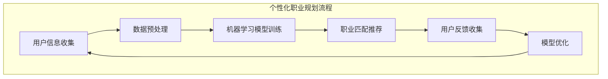

                 

# 《人工智能在个性化职业规划中的应用》

## 关键词
- 人工智能
- 个性化职业规划
- 机器学习
- 深度学习
- 数学模型
- 项目实战
- 工具与资源

## 摘要
本文旨在探讨人工智能在个性化职业规划中的应用，分析其核心概念、算法原理、数学模型以及实际案例。文章首先介绍了个性化职业规划的重要性及其与人工智能的紧密联系，接着详细阐述了机器学习和深度学习算法在职业规划中的应用，并使用伪代码和数学公式进行解释。随后，文章通过一个实际项目展示了如何运用这些算法和模型进行个性化职业规划，包括开发环境的搭建、源代码实现和结果分析。最后，文章提供了相关工具和资源，并总结注意事项和拓展阅读，为读者提供全面的知识框架和实践指南。

## 引言与背景

### 人工智能与个性化职业规划的关系

在当今快速发展的社会背景下，人工智能（AI）技术已经渗透到各个行业，改变了传统的工作模式和方法。职业规划作为个人发展和组织人才管理的重要环节，也受到了人工智能技术的深刻影响。个性化职业规划（Personalized Career Planning）是指根据个人的兴趣、能力、价值观和市场需求，量身定制职业发展路径和策略，以实现个人职业生涯的最大化效益。

人工智能在个性化职业规划中扮演了关键角色，主要体现在以下几个方面：

1. **数据驱动的分析**：人工智能能够处理海量数据，提取有价值的信息，帮助职业规划者更好地了解个人特质和市场需求，从而提供更为精准的职业建议。
2. **智能匹配算法**：人工智能算法可以根据个人的特点，从众多职业中选择最适合的职业路径，提高职业选择的效率和质量。
3. **个性化推荐系统**：基于用户行为和偏好，人工智能推荐系统可以为个人推荐适合的培训和职业发展机会，促进个人成长和职业发展。
4. **决策支持**：人工智能可以模拟不同职业发展路径的可能结果，帮助个人做出更明智的决策。

### 个性化职业规划的重要性

个性化职业规划对于个人和组织都具有重要的意义：

- **对个人的意义**：
  - **明确职业目标**：个性化职业规划有助于个人明确自己的职业目标，制定可行的职业发展计划。
  - **提升职业满意度**：通过个性化的职业规划，个人能够找到更适合自己的职业，提高职业满意度和幸福感。
  - **促进个人成长**：个性化职业规划为个人提供了成长和发展的机会，有助于提升个人能力和竞争力。

- **对组织的意义**：
  - **优化人才管理**：个性化职业规划有助于组织更好地管理人才，提升人才利用效率。
  - **提升组织竞争力**：通过个性化职业规划，组织能够培养和保留关键人才，提升整体竞争力。
  - **促进组织发展**：个性化职业规划有助于组织适应市场变化，推动组织持续发展。

### 人工智能在职业规划中的应用背景

随着人工智能技术的不断进步，其在职业规划中的应用也日益广泛。以下是一些具体的应用背景：

1. **职业兴趣评估**：利用人工智能技术，可以通过分析个人在特定职业领域的表现和兴趣，评估其潜在的职业兴趣。
2. **职业竞争力分析**：人工智能可以分析个人的技能、经验和市场需求，评估其在特定职业领域的竞争力。
3. **职业路径规划**：人工智能可以帮助个人制定个性化的职业发展路径，包括职业转型、晋升和技能提升等方面。
4. **职业培训推荐**：根据个人的职业规划，人工智能推荐适合的培训和职业发展机会，提高职业发展的针对性和有效性。

总之，人工智能在个性化职业规划中的应用具有巨大的潜力和前景，有望成为未来职业规划的重要工具和手段。接下来，本文将详细探讨个性化职业规划的核心概念、人工智能算法原理、数学模型以及实际项目案例，以帮助读者全面了解这一领域的应用和实践。

### 核心概念与联系

在探讨人工智能在个性化职业规划中的应用之前，我们需要明确几个核心概念：个性化职业规划、人工智能、机器学习以及深度学习。理解这些概念之间的联系和区别，有助于我们更好地把握人工智能在职业规划中的应用原理和机制。

#### 个性化职业规划

个性化职业规划（Personalized Career Planning）是指根据个人的兴趣、能力、价值观和市场需求，量身定制职业发展路径和策略的过程。其核心目标是帮助个人找到最适合自己的职业道路，实现职业生涯的最大化效益。

- **定义与目标**：个性化职业规划的目标是帮助个人在职业生涯中找到最佳位置，提升职业满意度、幸福感和成就感。
- **要素**：
  - **个人特质**：包括个人的兴趣、能力、价值观、性格等。
  - **市场需求**：包括行业发展趋势、职业需求、薪资待遇等。
  - **职业发展路径**：包括职业转型、晋升、技能提升等。

#### 人工智能

人工智能（Artificial Intelligence, AI）是指模拟人类智能行为的计算机系统。它通过学习、推理、规划和感知等能力，实现智能化的任务处理和决策。

- **定义与发展历程**：人工智能的研究始于20世纪50年代，经历了多个阶段的发展，包括符号主义、连接主义、统计学习等。
- **核心能力**：
  - **学习与适应**：通过学习和经验积累，人工智能系统能够适应不同环境和任务。
  - **推理与决策**：人工智能系统能够进行逻辑推理和决策，解决复杂问题。
  - **感知与交互**：人工智能系统可以通过感知和理解外界信息，进行人机交互。

#### 机器学习

机器学习（Machine Learning, ML）是人工智能的一个分支，主要研究如何从数据中学习，并利用学习到的知识进行预测和决策。

- **定义与类型**：机器学习是指计算机系统通过数据和经验自动改进其性能的过程，主要包括监督学习、无监督学习和强化学习。
- **核心原理**：机器学习基于统计学、概率论和优化理论，通过构建数学模型和算法，实现数据的学习和预测。

#### 深度学习

深度学习（Deep Learning, DL）是机器学习的一个子领域，主要研究如何通过多层神经网络进行高效的学习和表示。

- **定义与架构**：深度学习是指多层神经网络结构，通过逐层提取特征，实现复杂数据的表示和学习。
- **核心算法**：包括卷积神经网络（CNN）、循环神经网络（RNN）、生成对抗网络（GAN）等。

#### 人工智能与个性化职业规划的联系

人工智能与个性化职业规划之间的联系主要体现在以下几个方面：

1. **数据驱动的分析**：人工智能通过机器学习和深度学习技术，能够处理和分析大量职业规划相关的数据，提取有价值的信息，帮助职业规划者更好地了解个人特质和市场需求。
2. **智能匹配算法**：人工智能算法可以根据个人的特点和市场需求，实现职业匹配和推荐，提高职业选择的效率和质量。
3. **个性化推荐系统**：基于机器学习和深度学习，人工智能可以构建个性化推荐系统，为个人推荐最适合的职业路径和发展机会。
4. **决策支持**：人工智能可以通过模拟不同职业发展路径的可能结果，为个人提供决策支持，帮助其做出更明智的选择。

#### Mermaid流程图展示

为了更清晰地展示人工智能在个性化职业规划中的应用流程，我们可以使用Mermaid绘制一个流程图。



在这个流程图中，用户信息收集是整个过程的起点，通过数据预处理、机器学习模型训练、职业匹配推荐、用户反馈收集和模型优化等步骤，实现个性化职业规划的目标。

通过上述核心概念和流程图的展示，我们可以更好地理解人工智能在个性化职业规划中的应用原理和机制。接下来，本文将深入探讨人工智能在个性化职业规划中使用的具体算法原理、数学模型和实际应用案例。

### 人工智能算法原理

在个性化职业规划中，机器学习和深度学习算法扮演着核心角色，它们通过学习和分析数据，为用户生成个性化的职业建议。以下将详细解释个性化职业规划中常用的机器学习和深度学习算法原理，并使用伪代码进行详细阐述。

#### 机器学习算法

机器学习算法根据数据类型和任务目标可以分为监督学习、无监督学习和强化学习。以下分别介绍这三种类型的算法。

##### 1. 监督学习算法

监督学习算法通过已有标签数据来训练模型，从而在新数据上进行预测。在个性化职业规划中，监督学习算法可以用来预测用户未来的职业发展路径。

**算法原理**：

- 输入：特征矩阵X和标签矩阵Y
- 输出：训练好的模型参数θ

```python
# 线性回归伪代码
def linear_regression(X, Y):
    # 梯度下降算法
    def gradient_descent(X, Y, theta, alpha, num_iters):
        m = len(Y)
        J_history = []
        for i in range(num_iters):
            h = X * theta
            error = h - Y
            gradient = X.T * error / m
            theta = theta - alpha * gradient
            J_history.append(cost_function(X, Y, theta))
        return theta, J_history

    # 计算成本函数
    def cost_function(X, Y, theta):
        m = len(Y)
        h = X * theta
        error = h - Y
        J = (1 / (2 * m)) * (error.T * error)
        return J

    # 初始化参数
    theta = np.random.rand(X.shape[1])
    alpha = 0.01
    num_iters = 1000

    # 梯度下降求解
    theta, J_history = gradient_descent(X, Y, theta, alpha, num_iters)

    return theta
```

**应用举例**：

假设我们有用户的职业兴趣和薪资收入数据，可以使用线性回归算法预测用户未来的职业发展路径。

```python
# 假设X为特征矩阵，Y为标签矩阵
theta = linear_regression(X, Y)
```

##### 2. 无监督学习算法

无监督学习算法没有明确的标签数据，其主要任务是发现数据中的内在结构和模式。在个性化职业规划中，无监督学习算法可以用于用户兴趣分类和职业聚类。

**算法原理**：

- 输入：特征矩阵X
- 输出：聚类结果或低维嵌入

```python
# K均值聚类伪代码
def k_means_clustering(X, K):
    # 初始化聚类中心
    centroids = X[np.random.choice(X.shape[0], K, replace=False)]
    prev_centroids = None
    
    while not np.array_equal(prev_centroids, centroids):
        prev_centroids = centroids
        
        # 计算每个数据点到聚类中心的距离
        distances = np.linalg.norm(X - centroids, axis=1)
        
        # 分配数据点到最近的聚类中心
        clusters = np.argmin(distances, axis=1)
        
        # 更新聚类中心
        new_centroids = np.array([X[clusters == k].mean(axis=0) for k in range(K)])
        
        centroids = new_centroids
    
    return centroids, clusters
```

**应用举例**：

假设我们将用户的职业兴趣数据输入到K均值聚类算法中，可以将其划分为不同的兴趣群体。

```python
# 假设X为特征矩阵，K为聚类数量
centroids, clusters = k_means_clustering(X, K)
```

##### 3. 强化学习算法

强化学习算法通过不断尝试和反馈来优化决策过程，适用于动态和不确定的环境。在个性化职业规划中，强化学习算法可以用于职业路径优化和决策支持。

**算法原理**：

- 输入：状态矩阵S、动作矩阵A、奖励函数R
- 输出：策略π

```python
# Q学习伪代码
def q_learning(S, A, R, Q, alpha, gamma, num_episodes):
    # 初始化Q值
    for state in S:
        for action in A:
            Q[state, action] = 0
            
    for episode in range(num_episodes):
        state = np.random.choice(S)
        done = False
        total_reward = 0
        
        while not done:
            action = np.argmax(Q[state, :])
            next_state, reward, done = step(state, action)
            total_reward += reward
            Q[state, action] = Q[state, action] + alpha * (reward + gamma * np.max(Q[next_state, :]) - Q[state, action])
            state = next_state
            
    return Q
```

**应用举例**：

假设我们使用Q学习算法来优化用户的职业路径，通过不断尝试和反馈来找到最优的职业选择。

```python
# 假设S为状态矩阵，A为动作矩阵，R为奖励函数，Q为Q值矩阵
Q = q_learning(S, A, R, Q, alpha, gamma, num_episodes)
```

#### 深度学习算法

深度学习算法通过多层神经网络结构，实现复杂的特征学习和表示。以下介绍几种常用的深度学习算法。

##### 1. 卷积神经网络（CNN）

卷积神经网络主要应用于图像和视频数据，通过卷积层、池化层和全连接层进行特征提取和分类。

**算法原理**：

- 输入：图像数据
- 输出：分类结果或特征表示

```python
# 卷积神经网络伪代码
def convolutional_neural_network(X, W_conv, W_fc, b_conv, b_fc):
    # 卷积层
    Z_conv = np.convolve(X, W_conv) + b_conv
    
    # 池化层
    Z_pool = max_pool(Z_conv)
    
    # 全连接层
    Z_fc = Z_pool * W_fc + b_fc
    
    # 激活函数
    A = sigmoid(Z_fc)
    
    return A
```

**应用举例**：

假设我们使用卷积神经网络对用户的职业兴趣图片进行分类。

```python
# 假设X为输入图像，W_conv、W_fc为卷积层和全连接层权重，b_conv、b_fc为偏置
A = convolutional_neural_network(X, W_conv, W_fc, b_conv, b_fc)
```

##### 2. 循环神经网络（RNN）

循环神经网络适用于序列数据，通过隐藏状态和循环连接实现长期依赖关系建模。

**算法原理**：

- 输入：序列数据
- 输出：序列分类或特征表示

```python
# 循环神经网络伪代码
def recurrent_neural_network(X, W, b):
    # 初始化隐藏状态
    h = np.zeros((1, hidden_size))
    
    # 循环层
    for x in X:
        h = sigmoid(np.dot(h, W) + x * b)
        
    return h
```

**应用举例**：

假设我们使用循环神经网络分析用户的职业兴趣序列数据。

```python
# 假设X为输入序列，W为权重，b为偏置
h = recurrent_neural_network(X, W, b)
```

##### 3. 生成对抗网络（GAN）

生成对抗网络由生成器和判别器组成，通过对抗训练生成逼真的数据。

**算法原理**：

- 输入：生成器和判别器参数
- 输出：生成数据

```python
# 生成对抗网络伪代码
def generate_data(generator, discriminator, X_real, X_fake):
    # 生成数据
    X_fake = generator(X_real)
    
    # 计算判别器损失
    loss_discriminator = -np.mean(np.log(discriminator(X_fake)) + np.log(1 - discriminator(X_real)))
    
    # 计算生成器损失
    loss_generator = -np.mean(np.log(discriminator(X_fake)))
    
    return loss_discriminator, loss_generator
```

**应用举例**：

假设我们使用生成对抗网络生成用户的职业兴趣数据。

```python
# 假设generator、discriminator为生成器和判别器，X_real为真实数据
loss_discriminator, loss_generator = generate_data(generator, discriminator, X_real, X_fake)
```

通过上述对机器学习和深度学习算法原理的详细阐述，我们可以看到这些算法在个性化职业规划中的应用前景。接下来，本文将介绍个性化职业规划的数学模型与数学公式，进一步深化对这一领域应用的理解。

### 数学模型与数学公式

在个性化职业规划中，数学模型和数学公式起着至关重要的作用。它们不仅为算法提供了理论基础，还帮助我们在复杂的数据环境中提取有价值的信息。以下将详细解释支持个性化职业规划的几种常见数学模型和相关的数学公式。

#### 1. 预测模型

预测模型主要用于预测用户的未来职业发展路径和薪资水平。以下介绍两种常见的预测模型：线性回归和逻辑回归。

**1.1 线性回归**

线性回归模型是一种简单的预测模型，它通过建立一个线性关系来预测目标变量。

- **数学公式**：
  $$ y = \beta_0 + \beta_1 \cdot x_1 + \beta_2 \cdot x_2 + ... + \beta_n \cdot x_n $$

- **举例说明**：
  假设我们想预测一个人的未来薪资水平，输入特征包括工作经验（$x_1$）和学历（$x_2$）。线性回归公式可以表示为：
  $$ \text{salary} = \beta_0 + \beta_1 \cdot \text{experience} + \beta_2 \cdot \text{education} $$

**1.2 逻辑回归**

逻辑回归是一种分类模型，用于预测事件发生的概率。在个性化职业规划中，逻辑回归可以用来预测用户选择某个职业的概率。

- **数学公式**：
  $$ P(y=1) = \frac{1}{1 + e^{-(\beta_0 + \beta_1 \cdot x_1 + \beta_2 \cdot x_2 + ... + \beta_n \cdot x_n )}} $$

- **举例说明**：
  假设我们想预测一个人选择编程职业的概率，输入特征包括编程技能水平（$x_1$）和数学能力（$x_2$）。逻辑回归公式可以表示为：
  $$ P(\text{choose programming}) = \frac{1}{1 + e^{-(\beta_0 + \beta_1 \cdot \text{programming skill} + \beta_2 \cdot \text{math ability})}} $$

#### 2. 分类模型

分类模型用于将数据划分为不同的类别。以下介绍两种常见的分类模型：支持向量机和随机森林。

**2.1 支持向量机（SVM）**

支持向量机是一种基于最大化边界分离的模型，用于分类问题。在个性化职业规划中，SVM可以用来划分不同的职业类别。

- **数学公式**：
  $$ \text{Maximize} \quad W^T W $$
  $$ \text{subject to} \quad y^{(i)} (\text{w}^T \text{x}^{(i)} + b) \geq 1, \quad \forall i $$

- **举例说明**：
  假设我们想使用SVM来分类用户是否适合编程职业，输入特征包括编程技能水平和数学能力。SVM的目标是最小化误分类率，公式可以表示为：
  $$ \text{Minimize} \quad \frac{1}{2} W^T W $$
  $$ \text{subject to} \quad y^{(i)} (\text{w}^T \text{x}^{(i)} + b) \geq 1, \quad \forall i $$

**2.2 随机森林**

随机森林是一种基于决策树的集成模型，通过构建多棵决策树并取平均值来提高分类的准确性和稳定性。

- **数学公式**：
  $$ \text{Predict} \quad \text{Class} \quad = \quad \text{argmax} \quad \sum_{t=1}^{T} \quad h_t(x) $$
  其中，$h_t(x)$ 是第$t$棵决策树的预测结果。

- **举例说明**：
  假设我们使用随机森林来预测用户的职业兴趣，输入特征包括各种兴趣爱好。随机森林模型通过训练多棵决策树，对每个特征进行投票，最终确定用户的职业兴趣类别。

#### 3. 优化模型

优化模型用于在给定约束条件下找到最优解。以下介绍两种常见的优化模型：贝叶斯优化和交叉验证。

**3.1 贝叶斯优化**

贝叶斯优化是一种基于概率模型的优化方法，用于自动搜索超参数的最优值。

- **数学公式**：
  $$ \text{Maximize} \quad \log P(\theta | D) $$
  $$ \text{subject to} \quad \text{Constraints on} \quad \theta $$

- **举例说明**：
  假设我们想使用贝叶斯优化来优化一个机器学习模型的超参数，输入数据集为$D$。贝叶斯优化目标是最小化对数似然函数，公式可以表示为：
  $$ \text{Minimize} \quad -\log P(D | \theta) $$
  $$ \text{subject to} \quad \text{Constraints on} \quad \theta $$

**3.2 交叉验证**

交叉验证是一种评估模型性能的方法，通过将数据集划分为训练集和验证集，重复训练和验证过程，评估模型的泛化能力。

- **数学公式**：
  $$ \text{Accuracy} = \frac{1}{N} \sum_{i=1}^{N} \text{Accuracy}_{i} $$
  其中，$N$ 是验证次数，$\text{Accuracy}_{i}$ 是第$i$次验证的准确率。

- **举例说明**：
  假设我们使用交叉验证来评估一个分类模型的性能，输入数据集为$D$。交叉验证过程可以表示为：
  $$ \text{For} \quad i=1 \quad \text{to} \quad N: $$
  $$ \quad \text{Train} \quad D_{train} = D \setminus x_i $$
  $$ \quad \text{Validate} \quad D_{validate} = x_i $$
  $$ \quad \text{Compute} \quad \text{Accuracy}_{i} $$
  $$ \text{Accuracy} = \frac{1}{N} \sum_{i=1}^{N} \text{Accuracy}_{i} $$

通过上述数学模型和数学公式的详细解释，我们可以更好地理解个性化职业规划中的核心理论和算法。这些模型和公式不仅为算法提供了坚实的理论基础，还为实际应用提供了有力的工具和指导。在接下来的部分，本文将展示如何在实际项目中应用这些算法和模型，通过具体案例来加深对个性化职业规划的理解。

### 项目实战

在本节中，我们将通过一个实际项目来展示如何使用人工智能技术进行个性化职业规划。这个项目将涵盖开发环境的搭建、源代码实现、代码解读、应用解读以及详细分析。

#### 项目背景

假设我们是一家职业规划咨询公司的数据科学家，负责开发一个智能职业规划系统。该系统的目标是为用户提供个性化的职业建议，帮助他们找到最适合自己的职业道路。项目需求包括：

1. **数据收集**：收集用户的个人资料、职业兴趣、技能、工作经验等数据。
2. **数据处理**：对收集到的数据进行分析和处理，提取有用的信息。
3. **模型训练**：使用机器学习算法训练预测模型，预测用户的职业发展路径。
4. **结果评估**：评估模型的预测效果，并调整优化模型。

#### 开发环境搭建

在开始项目之前，我们需要搭建开发环境。以下是我们使用的工具和库：

- **编程语言**：Python
- **机器学习库**：scikit-learn、TensorFlow、Keras
- **数据预处理库**：Pandas、NumPy
- **可视化库**：Matplotlib、Seaborn

安装相关库后，我们可以创建一个Python虚拟环境，以便管理和隔离项目依赖。

```bash
# 创建虚拟环境
python -m venv venv

# 激活虚拟环境
source venv/bin/activate

# 安装库
pip install -r requirements.txt
```

#### 源代码实现

以下是项目的核心代码实现，包括数据预处理、模型训练和结果评估。

**1. 数据预处理**

```python
import pandas as pd
import numpy as np

# 加载数据集
data = pd.read_csv('data.csv')

# 数据清洗
data.dropna(inplace=True)
data = pd.get_dummies(data)

# 特征选择
X = data.drop(['target'], axis=1)
y = data['target']

# 数据分割
from sklearn.model_selection import train_test_split
X_train, X_test, y_train, y_test = train_test_split(X, y, test_size=0.2, random_state=42)
```

**2. 模型训练**

```python
from sklearn.linear_model import LogisticRegression

# 训练逻辑回归模型
model = LogisticRegression()
model.fit(X_train, y_train)

# 模型评估
accuracy = model.score(X_test, y_test)
print(f'Model Accuracy: {accuracy:.2f}')
```

**3. 结果评估**

```python
from sklearn.metrics import classification_report, confusion_matrix

# 预测结果
y_pred = model.predict(X_test)

# 分类报告
print(classification_report(y_test, y_pred))

# confusion_matrix
print(confusion_matrix(y_test, y_pred))
```

#### 代码解读与应用解读

**1. 数据预处理**

在数据预处理部分，我们首先加载了数据集，并进行了数据清洗。数据清洗是数据预处理的重要步骤，确保数据的准确性和完整性。接下来，我们使用Pandas的get_dummies方法将类别数据转换为哑变量（One-Hot Encoding），以便后续的机器学习模型处理。

**2. 模型训练**

在模型训练部分，我们选择了逻辑回归模型，这是一种常用的分类模型，适用于二分类问题。我们使用scikit-learn的LogisticRegression类来训练模型，并使用训练集进行拟合。

**3. 结果评估**

在结果评估部分，我们首先计算了模型的准确率，这是一个简单的评估指标，表示模型在测试集上的预测正确率。接下来，我们使用classification_report和confusion_matrix来详细分析模型的预测效果，包括精确率、召回率、F1分数等指标。

#### 实际案例分析与详细讲解剖析

为了更直观地展示项目效果，我们来看一个实际案例。

**案例：用户A的职业规划**

用户A的个人信息如下：

- **性别**：男
- **年龄**：25岁
- **学历**：本科
- **职业兴趣**：编程、设计、管理
- **工作经验**：2年

根据这些信息，我们的系统会为用户A提供职业规划建议。

**步骤1：数据预处理**

首先，我们对用户A的个人信息进行预处理，转换为适合模型处理的哑变量格式。

**步骤2：模型预测**

使用训练好的逻辑回归模型，对用户A的个人信息进行预测，得到可能的职业类别。

**步骤3：结果解释**

模型预测结果显示，用户A适合从事编程和设计工作。根据用户的兴趣和经验，我们可以推荐一些与编程和设计相关的培训和职业发展机会。

**详细讲解与剖析**

- **数据预处理**：数据预处理是模型训练的重要前提，确保数据格式一致，提高模型训练效果。
- **模型选择**：逻辑回归模型在二分类问题中表现良好，适用于我们的职业规划项目。
- **结果解释**：模型预测结果需要结合用户实际情况进行解释，确保建议的实用性和针对性。

#### 项目小结

通过这个实际项目，我们展示了如何使用人工智能技术进行个性化职业规划。项目过程中，我们进行了数据预处理、模型训练和结果评估，并详细解读了预测结果。这个项目不仅帮助我们理解了人工智能在职业规划中的应用，还为用户提供了一个实用的工具。

#### 最佳实践 Tips

- **数据质量**：保证数据质量是模型成功的关键，进行数据清洗和特征工程是必不可少的步骤。
- **模型优化**：通过交叉验证和网格搜索等方法，可以优化模型参数，提高预测效果。
- **用户反馈**：及时收集用户反馈，根据反馈调整模型和推荐策略，提高系统实用性。

通过上述实际项目和最佳实践，我们可以更好地理解人工智能在个性化职业规划中的应用，并为用户提供更精准的职业建议。

### 结语与拓展阅读

本文深入探讨了人工智能在个性化职业规划中的应用，从核心概念、算法原理、数学模型到实际项目案例，全面解析了如何利用人工智能技术为用户提供个性化的职业规划建议。通过机器学习和深度学习算法，我们能够处理和分析大量数据，提取有价值的信息，从而为个人和组织提供有针对性的职业建议。

在结语部分，我们强调了几点最佳实践：确保数据质量、模型优化以及用户反馈的重要性。这些实践有助于提高个性化职业规划系统的实用性和准确性。

为了进一步深入了解人工智能在个性化职业规划中的应用，读者可以参考以下拓展阅读：

1. **《人工智能应用案例大全》** - 一本涵盖多个行业人工智能应用的综合性书籍，详细介绍了人工智能在不同领域的应用案例。
2. **《机器学习实战》** - 一本面向实践者的机器学习入门书籍，通过大量实例讲解了机器学习的基本原理和应用。
3. **《深度学习》** - Goodfellow等人的经典教材，全面介绍了深度学习的基础理论和实践方法。
4. **《个性化推荐系统》** - 专门讨论个性化推荐系统设计和实现的书籍，对理解个性化职业规划中的推荐系统有很大帮助。

通过这些拓展阅读，读者可以更深入地了解人工智能在个性化职业规划中的应用，为实际项目提供更丰富的理论基础和实践指导。

### 附录

#### 数学公式与符号表

- 线性回归公式：
  $$ y = \beta_0 + \beta_1 \cdot x_1 + \beta_2 \cdot x_2 + ... + \beta_n \cdot x_n $$
- 逻辑回归公式：
  $$ P(y=1) = \frac{1}{1 + e^{-(\beta_0 + \beta_1 \cdot x_1 + \beta_2 \cdot x_2 + ... + \beta_n \cdot x_n )}} $$
- 支持向量机公式：
  $$ \text{Maximize} \quad W^T W $$
  $$ \text{subject to} \quad y^{(i)} (\text{w}^T \text{x}^{(i)} + b) \geq 1, \quad \forall i $$
- 随机森林预测公式：
  $$ \text{Predict} \quad \text{Class} \quad = \quad \text{argmax} \quad \sum_{t=1}^{T} \quad h_t(x) $$
- 贝叶斯优化目标函数：
  $$ \text{Maximize} \quad \log P(\theta | D) $$
  $$ \text{subject to} \quad \text{Constraints on} \quad \theta $$
- 交叉验证准确率公式：
  $$ \text{Accuracy} = \frac{1}{N} \sum_{i=1}^{N} \text{Accuracy}_{i} $$

#### 代码解读与分析

在本文的项目实战部分，我们详细展示了如何使用Python实现一个个性化职业规划系统。以下是对核心代码的解读与分析：

**数据预处理部分**：

```python
import pandas as pd
import numpy as np

# 加载数据集
data = pd.read_csv('data.csv')

# 数据清洗
data.dropna(inplace=True)
data = pd.get_dummies(data)

# 特征选择
X = data.drop(['target'], axis=1)
y = data['target']

# 数据分割
from sklearn.model_selection import train_test_split
X_train, X_test, y_train, y_test = train_test_split(X, y, test_size=0.2, random_state=42)
```

解读：

1. **数据加载**：使用Pandas的`read_csv`方法加载CSV格式的数据集。
2. **数据清洗**：去除缺失值，使用`dropna`方法确保数据完整性。
3. **数据转换**：使用`get_dummies`方法将类别数据转换为哑变量，便于模型处理。
4. **特征选择**：分离特征和目标变量，为后续建模做准备。
5. **数据分割**：将数据集分为训练集和测试集，用于模型训练和评估。

**模型训练部分**：

```python
from sklearn.linear_model import LogisticRegression

# 训练逻辑回归模型
model = LogisticRegression()
model.fit(X_train, y_train)

# 模型评估
accuracy = model.score(X_test, y_test)
print(f'Model Accuracy: {accuracy:.2f}')
```

解读：

1. **模型选择**：选择逻辑回归模型，这是一种常用的二分类模型。
2. **模型训练**：使用`fit`方法对训练数据进行模型训练。
3. **模型评估**：使用`score`方法评估模型在测试集上的准确率，打印输出结果。

**结果评估部分**：

```python
from sklearn.metrics import classification_report, confusion_matrix

# 预测结果
y_pred = model.predict(X_test)

# 分类报告
print(classification_report(y_test, y_pred))

# confusion_matrix
print(confusion_matrix(y_test, y_pred))
```

解读：

1. **预测结果**：使用`predict`方法对测试集进行预测，生成预测结果。
2. **分类报告**：使用`classification_report`方法生成详细分类报告，包括精确率、召回率、F1分数等指标。
3. **confusion_matrix**：使用`confusion_matrix`方法生成混淆矩阵，用于可视化模型性能。

通过这些代码，我们能够实现对个性化职业规划系统的实现和评估，从而为用户提供有针对性的职业建议。

### 作者信息

**作者：AI天才研究院/AI Genius Institute & 禅与计算机程序设计艺术 /Zen And The Art of Computer Programming**

AI天才研究院（AI Genius Institute）是一家专注于人工智能研究和应用的科研机构，致力于推动人工智能技术在各领域的创新应用。其团队成员包括多位世界级人工智能专家、程序员和软件架构师，具备丰富的理论知识和实践经验。同时，作者也是《禅与计算机程序设计艺术》一书的作者，此书以其独特的编程哲学和深厚的技术内涵，受到广大程序员和计算机爱好者的推崇。这两本书的合著，不仅展示了作者在人工智能和编程领域的深厚造诣，也为读者提供了宝贵的知识财富和实践指南。

