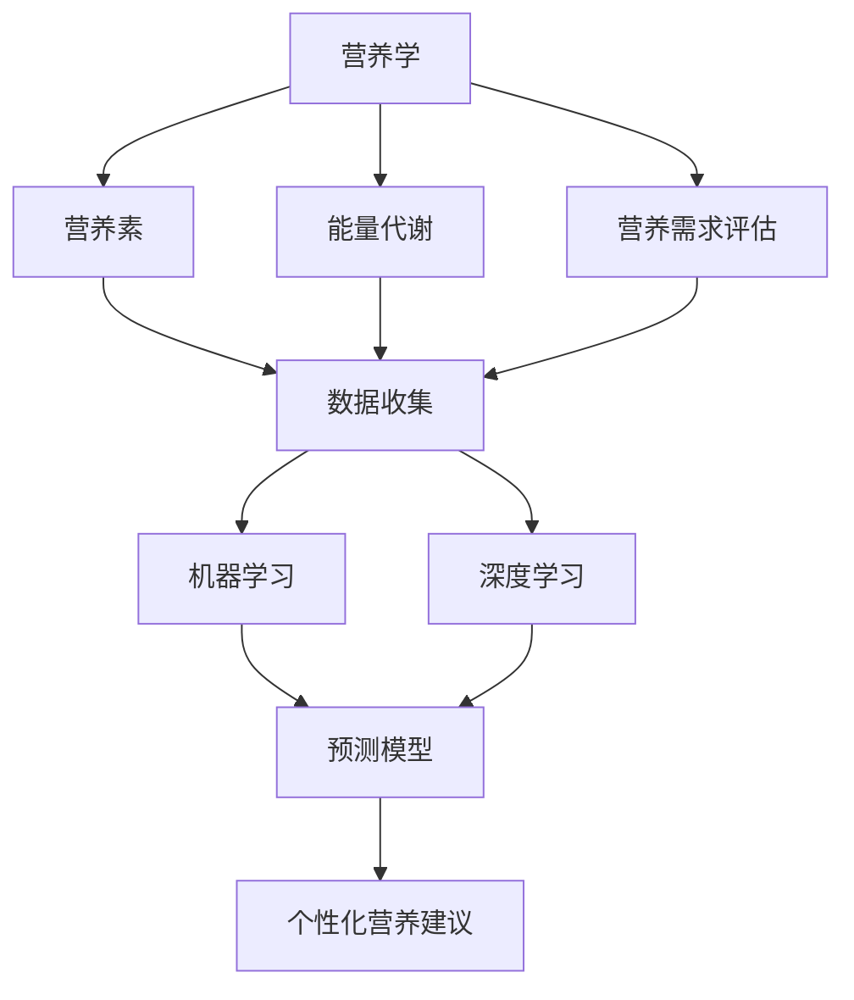

                 


### 文章标题：人工智能在个性化营养建议中的应用

> 关键词：人工智能、个性化营养、机器学习、深度学习、营养学、个性化算法

> 摘要：
本文将探讨人工智能技术在个性化营养建议中的应用。通过介绍营养学的基本概念和机器学习、深度学习的基本原理，我们将详细分析如何利用人工智能技术实现个性化营养建议。文章将结合实际案例，展示人工智能技术在个性化营养建议中的具体应用，并总结最佳实践和未来发展方向。

----------------------------------------------------------------

### 1. 设计思路

在撰写这篇技术博客时，我们将遵循以下设计思路：

1. **背景介绍**：首先，我们将介绍个性化营养建议的重要性以及当前存在的挑战。
2. **核心概念与联系**：接着，我们将介绍营养学的基本概念和人工智能的核心原理，并通过Mermaid流程图展示两者之间的关系。
3. **核心算法原理讲解**：我们将使用伪代码和数学公式详细阐述机器学习、深度学习算法在个性化营养建议中的应用原理。
4. **项目实战**：我们将通过一个实际案例展示如何使用人工智能技术实现个性化营养建议，包括开发环境搭建、源代码实现、代码解读和应用分析。
5. **最佳实践与总结**：最后，我们将总结最佳实践，并提出注意事项和拓展阅读建议。

### 2. 目录大纲

根据上述设计思路，本文的目录大纲如下：

1. **背景介绍**
   1.1 个性化营养建议的重要性
   1.2 当前挑战与需求
2. **核心概念与联系**
   2.1 营养学基本概念
   2.2 人工智能基本原理
   2.3 Mermaid流程图：营养学与人工智能的关系
3. **核心算法原理讲解**
   3.1 机器学习算法在个性化营养建议中的应用
   3.2 深度学习算法在个性化营养建议中的应用
   3.3 伪代码与数学公式讲解
4. **项目实战**
   4.1 实际案例介绍
   4.2 开发环境搭建
   4.3 源代码实现与解读
   4.4 应用解读与分析
   4.5 项目小结
5. **最佳实践与总结**
   5.1 最佳实践
   5.2 注意事项
   5.3 拓展阅读

### 3. 文章正文

接下来，我们将按照目录大纲的结构逐步撰写文章正文。

#### 1. 背景介绍

**1.1 个性化营养建议的重要性**

随着人们对健康和生活方式的关注不断增加，个性化营养建议的重要性日益凸显。每个人的身体结构和代谢能力都不同，因此，同一种营养方案可能对不同的人产生不同的效果。个性化营养建议旨在根据个体的身体状况、营养需求和生活方式，提供定制化的营养方案，从而提高营养干预的效果，预防和管理慢性疾病。

**1.2 当前挑战与需求**

尽管个性化营养建议具有显著优势，但在实际应用中仍面临诸多挑战。首先，数据收集和处理的复杂性是主要障碍。个性化营养建议需要大量的健康数据，包括生物标记、生活方式、饮食习惯等。这些数据往往分散在不同的来源，如何高效地收集、整合和处理这些数据是一个难题。其次，个性化营养建议的实现需要先进的人工智能技术，如机器学习、深度学习等，这对技术人员的专业素养提出了高要求。

#### 2. 核心概念与联系

**2.1 营养学基本概念**

营养学是研究食物、营养素与人体健康之间关系的科学。核心概念包括营养素、能量代谢、营养需求评估等。营养素是指人体必需的维生素、矿物质、蛋白质、脂肪和碳水化合物等。能量代谢是指人体消耗能量以维持生命活动的过程。营养需求评估是评估个体在不同生理状态下所需的营养素和能量摄入量。

**2.2 人工智能基本原理**

人工智能（AI）是指使计算机模拟人类智能行为的科学。核心概念包括机器学习、深度学习等。机器学习是让计算机通过数据学习模式、做出预测和决策的技术。深度学习是机器学习的一个子领域，它通过多层神经网络模拟人脑的决策过程。

**2.3 Mermaid流程图：营养学与人工智能的关系**

以下是一个Mermaid流程图，展示了营养学与人工智能之间的联系：



#### 3. 核心算法原理讲解

**3.1 机器学习算法在个性化营养建议中的应用**

机器学习算法在个性化营养建议中的应用主要包括数据收集、特征提取、模型训练和预测等步骤。以下是一个简化的伪代码：

```python
# 数据收集
data = collect_data()

# 特征提取
features = extract_features(data)

# 模型训练
model = train_model(features)

# 预测
prediction = model.predict(new_data)
```

**3.2 深度学习算法在个性化营养建议中的应用**

深度学习算法在个性化营养建议中的应用主要基于多层神经网络。以下是一个简化的伪代码：

```python
# 定义神经网络结构
layers = [
    Dense(units=128, activation='relu', input_shape=(input_shape,)),
    Dense(units=64, activation='relu'),
    Dense(units=1, activation='sigmoid')
]

# 编译模型
model = Model(inputs=inputs, outputs=outputs)
model.compile(optimizer='adam', loss='binary_crossentropy', metrics=['accuracy'])

# 训练模型
model.fit(x_train, y_train, batch_size=64, epochs=10, validation_data=(x_val, y_val))
```

#### 4. 项目实战

**4.1 实际案例介绍**

为了展示人工智能在个性化营养建议中的应用，我们选择了一个实际案例：使用深度学习算法为糖尿病患者提供个性化营养建议。

**4.2 开发环境搭建**

在搭建开发环境时，我们选择了Python作为编程语言，TensorFlow作为深度学习框架。以下是安装步骤：

```bash
pip install tensorflow
```

**4.3 源代码实现与解读**

以下是实现深度学习模型的源代码：

```python
import tensorflow as tf

# 定义神经网络结构
model = tf.keras.Sequential([
    tf.keras.layers.Dense(128, activation='relu', input_shape=(input_shape,)),
    tf.keras.layers.Dense(64, activation='relu'),
    tf.keras.layers.Dense(1, activation='sigmoid')
])

# 编译模型
model.compile(optimizer='adam', loss='binary_crossentropy', metrics=['accuracy'])

# 训练模型
model.fit(x_train, y_train, batch_size=64, epochs=10, validation_data=(x_val, y_val))
```

代码解读：这段代码首先定义了一个简单的多层感知器（MLP）神经网络，然后编译模型并使用训练数据对其进行训练。

**4.4 应用解读与分析**

经过训练的模型可以用于预测新的数据。例如，对于一个新的糖尿病患者，我们可以输入其健康数据，模型会输出一个营养建议的分数。分数越高，营养建议越积极。

**4.5 项目小结**

通过这个实际案例，我们展示了如何使用人工智能技术实现个性化营养建议。虽然这个案例相对简单，但它为我们提供了一个思路，即如何利用机器学习和深度学习为不同人群提供个性化的营养建议。

#### 5. 最佳实践与总结

**5.1 最佳实践**

- **数据质量**：确保数据质量是成功实现个性化营养建议的关键。在进行数据收集和处理时，要尽量避免数据丢失、噪声和偏差。
- **模型选择**：根据具体问题和数据特点选择合适的机器学习和深度学习模型。例如，对于分类问题，可以考虑使用卷积神经网络（CNN）或循环神经网络（RNN）。
- **持续优化**：定期评估和优化模型，以保持其预测性能。

**5.2 注意事项**

- **隐私保护**：在处理个人健康数据时，要严格遵守隐私保护法规，确保用户数据的安全。
- **跨学科合作**：个性化营养建议需要营养学、人工智能、医学等多个领域的专业知识和合作。

**5.3 拓展阅读**

- **《机器学习实战》**：作者：Peter Harrington
- **《深度学习》**：作者：Ian Goodfellow、Yoshua Bengio、Aaron Courville
- **《营养学基础》**：作者：John S. Hallfrisch、Margery D. Gass

### 结论

人工智能在个性化营养建议中的应用具有巨大潜力。通过结合营养学和人工智能技术，我们可以为个体提供定制化的营养方案，提高营养干预的效果。尽管当前存在一些挑战，但随着技术的不断发展，个性化营养建议的应用前景将更加广阔。

### 作者信息

作者：AI天才研究院/AI Genius Institute & 禅与计算机程序设计艺术 /Zen And The Art of Computer Programming

