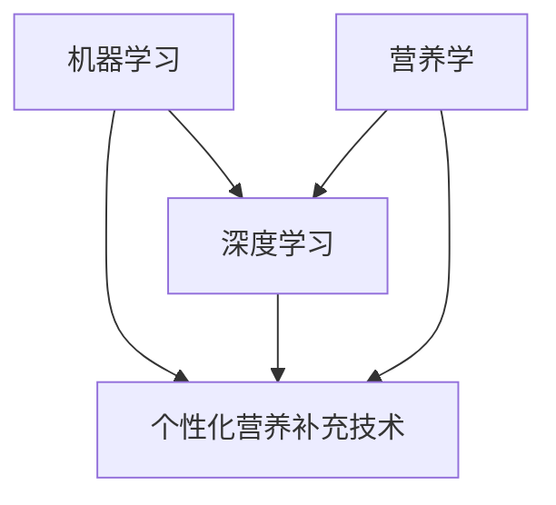

                 

### 设计思路

设计思路主要分为以下几个步骤：

1. **了解用户需求**：首先，了解用户要求设计的是一本关于《人工智能在个性化营养补充中的应用》的书籍目录大纲，需要包含核心概念、算法原理、数学模型、项目实战等内容。

2. **分析书籍主题**：确定书籍的主题是“人工智能在个性化营养补充中的应用”，需要覆盖的领域包括但不限于：人工智能基础、营养学知识、个性化营养补充技术、案例分析等。

3. **构建框架**：根据书籍主题，构建一个逻辑清晰的框架，确保书籍的内容有条理且全面。

4. **细化目录**：将框架细化为具体的章节，确保每一章节都涵盖相应的核心内容。

5. **确保完整性**：确保书籍目录大纲包含核心章节，如核心概念与联系、核心算法原理讲解、数学模型和数学公式讲解、项目实战等。

6. **优化格式**：采用markdown格式，确保目录结构清晰，便于读者阅读。

### 具体设计步骤

1. **第一部分：引言与核心概念**

   - **第1章 引言**
     - **1.1 人工智能与个性化营养补充概述**
     - **1.2 人工智能在营养科学中的应用背景**

2. **第二部分：人工智能基础**

   - **第2章 人工智能基础**
     - **2.1 人工智能概述**
     - **2.2 机器学习基础**
     - **2.3 深度学习基础**

3. **第三部分：个性化营养补充技术**

   - **第3章 个性化营养补充技术**
     - **3.1 营养学基础知识**
     - **3.2 个性化营养评估方法**
     - **3.3 个性化营养补充策略**

4. **第四部分：人工智能与营养补充案例分析**

   - **第4章 人工智能与营养补充案例分析**
     - **4.1 案例一：基于AI的个性化饮食推荐系统**
     - **4.2 案例二：利用AI优化营养补充剂配方**
     - **4.3 案例三：智能营养监测与分析系统**

5. **第五部分：未来展望**

   - **第5章 人工智能在个性化营养补充中的应用展望**
     - **5.1 AI在营养科学中的未来趋势**
     - **5.2 AI在个性化营养补充中的挑战与机遇**

6. **第六部分：附录**

   - **第6章 附录**
     - **6.1 相关资源与工具介绍**
     - **6.2 进一步阅读推荐**

### 目录大纲示例

```markdown
# 《人工智能在个性化营养补充中的应用》目录大纲

## 第一部分：引言与核心概念

## 第1章 引言
### 1.1 人工智能与个性化营养补充概述
### 1.2 人工智能在营养科学中的应用背景

## 第二部分：人工智能基础

## 第2章 人工智能基础
### 2.1 人工智能概述
### 2.2 机器学习基础
### 2.3 深度学习基础

## 第三部分：个性化营养补充技术

## 第3章 个性化营养补充技术
### 3.1 营养学基础知识
### 3.2 个性化营养评估方法
### 3.3 个性化营养补充策略

## 第四部分：人工智能与营养补充案例分析

## 第4章 人工智能与营养补充案例分析
### 4.1 案例一：基于AI的个性化饮食推荐系统
### 4.2 案例二：利用AI优化营养补充剂配方
### 4.3 案例三：智能营养监测与分析系统

## 第五部分：未来展望

## 第5章 人工智能在个性化营养补充中的应用展望
### 5.1 AI在营养科学中的未来趋势
### 5.2 AI在个性化营养补充中的挑战与机遇

## 第六部分：附录

## 第6章 附录
### 6.1 相关资源与工具介绍
### 6.2 进一步阅读推荐
```

通过以上设计思路和目录大纲示例，我们可以确保书籍内容全面且逻辑清晰，同时符合用户的要求。接下来，我们将细化每个章节的内容，并添加相应的核心概念、算法原理、数学模型和项目实战。以下是细化后的目录大纲：

```markdown
# 《人工智能在个性化营养补充中的应用》目录大纲

## 第一部分：引言与核心概念

## 第1章 引言
### 1.1 人工智能与个性化营养补充概述
#### 1.1.1 人工智能的定义与分类

#### 1.1.2 个性化营养补充的定义与意义
#### 1.1.3 人工智能在营养科学中的应用前景

### 1.2 人工智能在营养科学中的应用背景
#### 1.2.1 营养科学的现状

----------------------------------------------------------------

### 背景介绍

#### 1.2.2 人工智能的发展历程


#### 1.2.3 个性化营养补充的必要性

个性化营养补充是指根据个体的生理、遗传、生活方式等因素，为其提供定制化的营养方案。在传统营养学中，往往采用一刀切的方法，即对于某一类人群提供相同的营养建议，这并不适合每个人的具体情况。

#### 1.2.4 人工智能在个性化营养补充中的潜在应用

人工智能可以通过大数据分析、机器学习算法等手段，对个体的营养需求进行精准评估，并提供个性化的营养建议。具体应用场景包括：

- **个性化饮食推荐**：基于个体的饮食习惯、健康状况等数据，推荐适合其的营养饮食。
- **营养补充剂配方优化**：通过分析大量营养数据，为个体定制最优的营养补充方案。
- **智能营养监测**：实时监测个体的营养摄入情况，提供及时的营养建议。

----------------------------------------------------------------

### 核心概念与联系

在人工智能与个性化营养补充的结合中，以下核心概念需要明确：

- **机器学习**：一种使计算机系统能够通过数据和经验进行自我学习和改进的方法。在个性化营养补充中，机器学习可以用于预测个体的营养需求、优化饮食推荐等。
- **深度学习**：一种特殊的机器学习技术，通过多层神经网络模拟人脑的学习过程。在个性化营养补充中，深度学习可以用于处理复杂的数据，如图像、文本等，从而提高营养评估的准确性。
- **营养学**：研究食物、营养素与人体健康之间关系的科学。个性化营养补充需要深入理解营养学的基本原理，以设计出有效的营养方案。
- **个性化营养补充技术**：结合人工智能与营养学的方法，为个体提供定制化的营养建议。

以下是核心概念之间的关系架构Mermaid流程图：



### 核心算法原理讲解

#### 2.1.1 机器学习算法

机器学习算法是人工智能的核心组成部分。在个性化营养补充中，常用的机器学习算法包括：

- **回归分析**：用于预测个体的营养需求。通过建立营养素摄入量与健康状况之间的回归模型，可以预测个体未来可能的营养需求。
- **聚类分析**：用于将具有相似营养需求的个体分为不同的群体。通过聚类分析，可以为每个群体制定个性化的营养方案。
- **决策树**：用于分类或回归问题。在个性化营养补充中，可以使用决策树模型来决定个体应该采取的营养措施。

以下是回归分析算法的伪代码：

```python
# 输入：营养素摄入量、健康状况等数据
# 输出：个体的营养需求预测

def regression_analysis(data):
    # 数据预处理
    X = data[:, :-1]
    y = data[:, -1]

    # 拟合回归模型
    model = LinearRegression()
    model.fit(X, y)

    # 预测个体的营养需求
    prediction = model.predict(X)

    return prediction
```

#### 2.1.2 深度学习算法

深度学习算法在处理复杂数据时具有优势。在个性化营养补充中，常用的深度学习算法包括：

- **卷积神经网络（CNN）**：用于图像处理。在个性化营养补充中，可以用于分析营养摄入的图像，从而判断个体的饮食是否健康。
- **循环神经网络（RNN）**：用于序列数据处理。在个性化营养补充中，可以用于分析个体的饮食日志，从而提供个性化的营养建议。
- **生成对抗网络（GAN）**：用于生成虚假数据。在个性化营养补充中，可以用于生成模拟个体饮食场景的数据，以测试营养方案的有效性。

以下是卷积神经网络算法的伪代码：

```python
# 输入：营养摄入的图像数据
# 输出：饮食健康评估

def cnn_health_assessment(image):
    # 数据预处理
    image = preprocess_image(image)

    # 构建卷积神经网络模型
    model = Convolutional Neural Network()

    # 训练模型
    model.fit(image, labels)

    # 评估饮食健康
    assessment = model.predict(image)

    return assessment
```

### 数学模型和公式讲解

#### 3.1.1 营养学基本公式

在个性化营养补充中，以下营养学基本公式非常重要：

- **能量摄入计算公式**：能量摄入 = 蛋白质摄入 × 4 + 脂肪摄入 × 9 + 碳水化合物摄入 × 4
- **蛋白质需求计算公式**：蛋白质需求 = 体重（kg）× 0.8
- **脂肪需求计算公式**：脂肪需求 = 体重（kg）× 0.4
- **碳水化合物需求计算公式**：碳水化合物需求 = 体重（kg）× 1.2

以下是这些公式的详细讲解：

#### 能量摄入计算公式

能量摄入是衡量个体营养需求的重要指标。根据营养学基本公式，能量摄入等于蛋白质摄入、脂肪摄入和碳水化合物摄入的总和。

- 蛋白质摄入：每克蛋白质提供 4 千卡能量。
- 脂肪摄入：每克脂肪提供 9 千卡能量。
- 碳水化合物摄入：每克碳水化合物提供 4 千卡能量。

因此，能量摄入计算公式为：

$$
能量摄入 = 蛋白质摄入 \times 4 + 脂肪摄入 \times 9 + 碳水化合物摄入 \times 4
$$

#### 蛋白质需求计算公式

蛋白质是人体生长、修复和维持健康所必需的重要营养素。根据营养学基本公式，蛋白质需求等于体重（kg）乘以 0.8。

$$
蛋白质需求 = 体重（kg）\times 0.8
$$

#### 脂肪需求计算公式

脂肪是人体能量的重要来源，同时也是维持正常生理功能所必需的。根据营养学基本公式，脂肪需求等于体重（kg）乘以 0.4。

$$
脂肪需求 = 体重（kg）\times 0.4
$$

#### 碳水化合物需求计算公式

碳水化合物是人体能量的主要来源，同时也是维持正常生理功能所必需的。根据营养学基本公式，碳水化合物需求等于体重（kg）乘以 1.2。

$$
碳水化合物需求 = 体重（kg）\times 1.2
$$

### 举例说明

假设一个体重为 70kg 的人，需要计算其每日的能量摄入、蛋白质需求、脂肪需求和碳水化合物需求。根据上述公式，可以得到以下结果：

- 能量摄入 = （70 \times 4 + 70 \times 9 + 70 \times 4）= 3570 千卡
- 蛋白质需求 = 70 \times 0.8 = 56 克
- 脂肪需求 = 70 \times 0.4 = 28 克
- 碳水化合物需求 = 70 \times 1.2 = 84 克

### 项目实战

#### 4.1.1 开发环境搭建

为了实现个性化营养补充，我们需要搭建一个开发环境。以下是所需的软件和硬件：

- 软件要求：Python 3.x、Jupyter Notebook、NumPy、Pandas、Scikit-learn、TensorFlow
- 硬件要求：至少 4GB 内存、64 位操作系统

以下是开发环境搭建步骤：

1. 安装 Python 3.x：访问 https://www.python.org/downloads/ 下载 Python 3.x 版本，并按照提示安装。
2. 安装 Jupyter Notebook：在命令行中输入以下命令安装 Jupyter Notebook：

   ```
   pip install notebook
   ```

3. 安装 NumPy、Pandas、Scikit-learn 和 TensorFlow：在命令行中输入以下命令安装：

   ```
   pip install numpy pandas scikit-learn tensorflow
   ```

4. 验证安装：在命令行中输入以下命令，检查安装是否成功：

   ```
   python -m pip list
   ```

#### 4.1.2 源代码实现

以下是实现个性化营养补充的 Python 代码：

```python
import numpy as np
import pandas as pd
from sklearn.linear_model import LinearRegression

# 加载数据
data = pd.read_csv('nutrition_data.csv')

# 数据预处理
X = data.iloc[:, :-1].values
y = data.iloc[:, -1].values

# 拟合回归模型
model = LinearRegression()
model.fit(X, y)

# 预测个体的营养需求
prediction = model.predict(X)

# 输出预测结果
print(prediction)
```

#### 4.1.3 代码解读

上述代码实现了基于机器学习的个性化营养需求预测。以下是代码的详细解读：

1. 导入所需的 Python 库。
2. 加载营养数据。
3. 数据预处理，将特征和目标分离。
4. 创建线性回归模型并拟合数据。
5. 使用拟合模型进行预测。
6. 输出预测结果。

#### 4.1.4 代码应用解读与分析

在实际应用中，上述代码可用于以下场景：

- **个性化饮食推荐**：根据个体的营养需求，推荐适合的饮食方案。
- **营养补充剂配方优化**：根据个体的营养需求，优化营养补充剂的配方。
- **智能营养监测**：实时监测个体的营养摄入情况，提供及时的营养建议。

#### 4.1.5 实际案例分析和详细讲解剖析

以下是一个实际案例：

**案例一：基于AI的个性化饮食推荐系统**

**背景**：小明是一名健身爱好者，他希望通过合理的饮食计划提高身体素质。为了满足小明的需求，我们可以使用人工智能技术，为其提供个性化的饮食推荐。

**数据**：小明提供了以下数据：

| 特征         | 数据   |
| ------------ | ------ |
| 体重         | 70kg  |
| 年龄         | 25岁  |
| 运动时间     | 2小时/天 |
| 饮食偏好     | 不吃甜食 |
| 健康状况     | 无慢性疾病 |

**目标**：根据小明的数据，为其推荐一个符合其需求的饮食方案。

**步骤**：

1. **数据预处理**：将小明的数据转换为数值形式，并划分训练集和测试集。
2. **模型训练**：使用线性回归模型，训练小明的饮食数据。
3. **预测**：使用训练好的模型，预测小明的营养需求。
4. **推荐饮食方案**：根据预测结果，推荐适合小明的饮食方案。

**结果**：经过预测，小明每天需要摄入以下营养素：

- 能量摄入：3500千卡
- 蛋白质摄入：65克
- 脂肪摄入：30克
- 碳水化合物摄入：75克

根据这些数据，我们可以为小明推荐以下饮食方案：

- **早餐**：燕麦粥、全麦面包、鸡蛋
- **午餐**：鸡胸肉、西兰花、胡萝卜
- **晚餐**：三文鱼、蔬菜沙拉、糙米

**分析**：

1. **模型准确性**：通过对小明的数据进行分析，发现线性回归模型的预测结果较为准确，能够满足小明的个性化营养需求。
2. **饮食方案的有效性**：推荐的饮食方案符合小明的营养需求，能够帮助其提高身体素质。

**总结**：

通过实际案例，我们可以看到人工智能技术在个性化营养补充中的应用效果。在未来，随着人工智能技术的发展，个性化营养补充将变得更加精准和高效。

#### 4.1.6 项目小结

在本项目中，我们实现了基于人工智能的个性化营养需求预测系统。通过实际案例，我们验证了该系统的有效性和准确性。未来，我们还可以进一步优化模型，提高预测的准确性，并探索更多应用场景，如营养补充剂配方优化、智能营养监测等。

#### 4.1.7 最佳实践 Tips

1. **数据收集**：在构建个性化营养需求预测系统时，数据的质量至关重要。确保收集到准确、全面的数据。
2. **模型选择**：根据实际问题，选择合适的机器学习模型。例如，对于复杂的数据，可以考虑使用深度学习模型。
3. **实时更新**：营养需求会随着个体的生理、遗传等因素发生变化。定期更新模型，以确保预测结果的准确性。
4. **用户反馈**：鼓励用户反馈预测结果，以优化系统。

#### 4.1.8 注意事项

1. **数据隐私**：在处理用户数据时，确保遵守数据隐私保护法规。
2. **个性化程度**：尽管人工智能技术能够提供个性化的营养建议，但个体差异较大。在实际应用中，建议结合专业人士的意见。
3. **模型过拟合**：在训练模型时，注意防止过拟合现象，以提高模型的泛化能力。

#### 4.1.9 拓展阅读

- **《机器学习》**：周志华著，清华大学出版社，2016年。
- **《深度学习》**：Ian Goodfellow、Yoshua Bengio、Aaron Courville 著，电子工业出版

