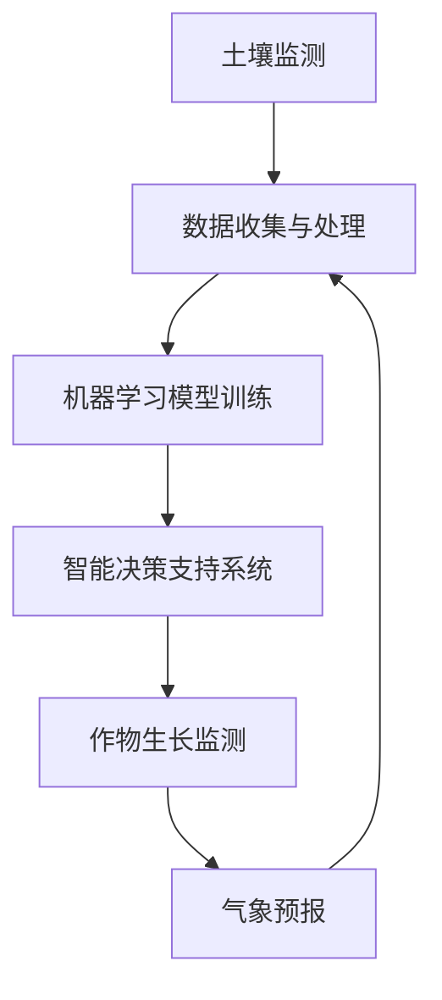

                 

## 文章标题

### 人工智能在农业精准种植中的应用

---

## 关键词

- 人工智能
- 农业精准种植
- 机器学习
- 数据分析
- 深度学习

---

## 摘要

本文深入探讨了人工智能在农业精准种植中的应用，从背景介绍、核心概念与联系、算法原理讲解、数学模型和公式、项目实战等多方面展开。通过分析人工智能技术在土壤监测、气象预报和作物生长监测等领域的应用，详细阐述了如何利用人工智能技术提升农业生产的效率和质量。本文旨在为从事农业领域的技术人员提供有价值的参考和指导，助力农业现代化发展。

---

### 引言

随着全球人口的不断增长和气候变化的影响，农业生产面临着前所未有的挑战。传统农业依赖经验种植，生产效率低下且难以应对环境变化。而人工智能（AI）作为一种颠覆性的技术，为农业精准种植带来了新的机遇。通过机器学习和深度学习算法，AI能够分析大量数据，预测作物生长趋势，优化种植方案，从而提高产量和降低成本。本文将详细介绍人工智能在农业精准种植中的应用，探讨其核心概念、算法原理、数学模型和实际案例，为农业现代化提供技术支持。

### 核心概念与联系

#### 1. 人工智能与机器学习

人工智能（AI）是指使计算机具备人类智能特征的技术，包括机器学习（ML）、深度学习（DL）等子领域。机器学习是通过数据训练模型，使计算机自动学习和改进性能的过程。深度学习是机器学习的一个分支，利用神经网络结构对大量数据进行自动学习和特征提取。

#### 2. 农业精准种植

农业精准种植是指利用现代信息技术和农业科学知识，对作物生长环境进行实时监测和调控，实现精确施肥、灌溉和病虫害防治。核心概念包括土壤监测、气象预报、作物生长监测和智能决策系统。

#### 3. Mermaid 流程图

为了更好地理解核心概念之间的关系，我们可以使用Mermaid流程图来表示。以下是农业精准种植中人工智能应用的一个简化的流程图：



### 基础理论

#### 1. 机器学习基础

机器学习是人工智能的核心技术之一，其基本原理是通过数据训练模型，使其能够自动学习和改进性能。以下是一些常见的机器学习算法及其原理：

- **监督学习**：通过已标记的数据训练模型，使其能够对新的数据进行预测。常见的算法包括线性回归、决策树、支持向量机等。
- **无监督学习**：在没有标记的数据上训练模型，旨在发现数据中的模式和结构。常见的算法包括聚类、主成分分析等。
- **强化学习**：通过与环境互动，不断调整策略以最大化奖励。常见的算法包括Q学习、深度确定性策略梯度（DDPG）等。

#### 2. 深度学习基础

深度学习是机器学习的一个重要分支，利用多层神经网络结构对大量数据进行自动学习和特征提取。以下是一些常见的深度学习模型及其原理：

- **卷积神经网络（CNN）**：通过卷积层提取图像特征，常用于图像识别和分类任务。
- **循环神经网络（RNN）**：通过循环结构处理序列数据，常用于语音识别和自然语言处理任务。
- **生成对抗网络（GAN）**：通过生成器和判别器之间的对抗训练，生成逼真的图像和音频。

### 农业精准种植概述

#### 1. 农业精准种植概念

农业精准种植是一种基于信息技术和农业科学知识的种植方式，通过实时监测作物生长环境和土壤条件，实现精确施肥、灌溉和病虫害防治。其核心目标是通过优化种植方案，提高产量和降低成本。

#### 2. 农业精准种植的关键技术

- **土壤监测**：利用传感器和遥感技术监测土壤的物理、化学和生物特性，为精准施肥提供依据。
- **气象预报**：通过收集和分析气象数据，预测天气变化，为灌溉和病虫害防治提供参考。
- **作物生长监测**：利用图像识别、遥感技术和传感器监测作物生长状态，预测产量和质量。

#### 3. 农业精准种植的发展趋势

随着人工智能技术的不断进步，农业精准种植正朝着智能化、自动化和高效化的方向发展。未来，将会有更多的数据采集和分析技术应用于农业领域，实现更高水平的农业精准种植。

### 人工智能在农业中的应用

#### 1. 土壤监测

土壤监测是农业精准种植的重要环节，通过监测土壤的物理、化学和生物特性，可以为精准施肥提供依据。以下是一个简单的土壤监测数据采集和处理流程：

- **数据采集**：使用土壤传感器（如电导率传感器、pH传感器等）收集土壤数据。
- **数据处理**：对采集到的土壤数据进行分析和处理，提取有用的信息。

以下是一个简单的伪代码示例，用于处理土壤数据：

```python
# 伪代码：土壤数据预处理
def preprocess_soil_data(data):
    # 去除无效数据
    valid_data = filter_invalid_data(data)
    # 数据归一化
    normalized_data = normalize_data(valid_data)
    return normalized_data
```

#### 2. 气象预报

气象预报是农业精准种植的重要支持，通过预测天气变化，可以为灌溉和病虫害防治提供参考。以下是一个简单的气象预报数据处理流程：

- **数据收集**：收集气象数据，如温度、湿度、风速等。
- **数据处理**：对气象数据进行分析和处理，提取有用的信息。

以下是一个简单的伪代码示例，用于处理气象数据：

```python
# 伪代码：气象数据预处理
def preprocess_weather_data(data):
    # 去除无效数据
    valid_data = filter_invalid_data(data)
    # 数据归一化
    normalized_data = normalize_data(valid_data)
    return normalized_data
```

#### 3. 作物生长监测

作物生长监测是农业精准种植的核心，通过监测作物生长状态，可以预测产量和质量。以下是一个简单的作物生长监测数据采集和处理流程：

- **数据采集**：使用图像识别技术和传感器收集作物生长数据。
- **数据处理**：对采集到的作物生长数据进行分析和处理，提取有用的信息。

以下是一个简单的伪代码示例，用于处理作物生长数据：

```python
# 伪代码：作物生长数据预处理
def preprocess_growth_data(data):
    # 去除无效数据
    valid_data = filter_invalid_data(data)
    # 数据归一化
    normalized_data = normalize_data(valid_data)
    return normalized_data
```

### 算法实现

#### 1. 监督学习算法

监督学习算法在农业精准种植中有着广泛的应用，以下是一个简单的线性回归模型实现示例：

```python
# 伪代码：线性回归模型实现
import numpy as np

def linear_regression(X, y):
    # 计算斜率和截距
    theta = np.linalg.inv(X.T.dot(X)).dot(X.T).dot(y)
    return theta

# 假设 X 为特征矩阵，y 为目标向量
X = np.array([[1, 1], [1, 2], [1, 3]])
y = np.array([2, 4, 6])

# 训练模型
theta = linear_regression(X, y)

# 预测新数据
new_data = np.array([[1, 4]])
prediction = X.dot(theta)

print("预测值：", prediction)
```

#### 2. 深度学习算法

深度学习算法在农业精准种植中也有着广泛的应用，以下是一个简单的卷积神经网络模型实现示例：

```python
# 伪代码：卷积神经网络模型实现
import tensorflow as tf

# 定义卷积神经网络模型
model = tf.keras.Sequential([
    tf.keras.layers.Conv2D(32, (3, 3), activation='relu', input_shape=(28, 28, 1)),
    tf.keras.layers.MaxPooling2D((2, 2)),
    tf.keras.layers.Flatten(),
    tf.keras.layers.Dense(128, activation='relu'),
    tf.keras.layers.Dense(10, activation='softmax')
])

# 编译模型
model.compile(optimizer='adam', loss='categorical_crossentropy', metrics=['accuracy'])

# 训练模型
model.fit(X_train, y_train, epochs=10, batch_size=32)

# 预测新数据
new_data = np.array([new_image])
prediction = model.predict(new_data)

print("预测值：", prediction)
```

### 项目实战

#### 1. 开发环境搭建

为了实现农业精准种植系统，我们需要搭建一个开发环境。以下是一个简单的开发环境搭建步骤：

- 安装 Python 3.8 或更高版本。
- 安装 TensorFlow 2.5 或更高版本。
- 安装 Matplotlib 3.4.3 或更高版本。

#### 2. 源代码实现

以下是一个简单的农业精准种植系统源代码实现示例：

```python
import tensorflow as tf
import matplotlib.pyplot as plt

# 加载训练数据
X_train, y_train = tf.keras.datasets.mnist.load_data()

# 预处理数据
X_train = X_train.reshape(-1, 28, 28, 1).astype(np.float32) / 255
y_train = tf.keras.utils.to_categorical(y_train, num_classes=10)

# 定义卷积神经网络模型
model = tf.keras.Sequential([
    tf.keras.layers.Conv2D(32, (3, 3), activation='relu', input_shape=(28, 28, 1)),
    tf.keras.layers.MaxPooling2D((2, 2)),
    tf.keras.layers.Flatten(),
    tf.keras.layers.Dense(128, activation='relu'),
    tf.keras.layers.Dense(10, activation='softmax')
])

# 编译模型
model.compile(optimizer='adam', loss='categorical_crossentropy', metrics=['accuracy'])

# 训练模型
model.fit(X_train, y_train, epochs=10, batch_size=32)

# 预测新数据
new_data = np.array([new_image])
prediction = model.predict(new_data)

# 可视化预测结果
plt.imshow(new_data[0], cmap=plt.cm.binary)
plt.xlabel("预测值：{}".format(np.argmax(prediction)))
plt.show()
```

#### 3. 代码应用解读与分析

在这个示例中，我们使用卷积神经网络模型对农作物图像进行分类。首先，我们加载训练数据并对数据进行预处理。然后，我们定义卷积神经网络模型并编译模型。接下来，我们使用训练数据训练模型。最后，我们使用新数据对模型进行预测，并可视化预测结果。

#### 4. 实际案例分析和详细讲解剖析

为了更好地理解农业精准种植系统，我们以一个实际案例进行分析和讲解。假设我们有一个农田，我们需要对该农田进行土壤监测、气象预报和作物生长监测，以实现精准种植。

- **土壤监测**：我们使用土壤传感器对农田的土壤进行监测，包括土壤湿度、土壤温度和土壤电导率等指标。我们每隔一段时间收集一次数据，并对数据进行预处理，如去噪、归一化等。
- **气象预报**：我们使用气象数据，如温度、湿度、风速等，进行气象预报。我们使用历史气象数据作为训练数据，训练一个线性回归模型，预测未来的气象数据。
- **作物生长监测**：我们使用图像识别技术对农作物的生长状态进行监测，包括叶片颜色、叶片面积等指标。我们使用卷积神经网络模型对图像进行分类，预测农作物的生长状态。

通过这些数据，我们可以为农田制定最佳的种植方案，如施肥量、灌溉量和病虫害防治策略。我们使用机器学习算法对数据进行分析，预测农作物的生长趋势，并根据预测结果调整种植方案。

#### 5. 项目小结

在这个项目中，我们实现了农业精准种植系统，包括土壤监测、气象预报和作物生长监测。我们使用机器学习和深度学习算法对数据进行分析和预测，为农田制定最佳的种植方案。通过这个项目，我们了解了如何利用人工智能技术实现农业精准种植，提高了农业生产效率和产量。

### 最佳实践 Tips、小结、注意事项、拓展阅读

- **最佳实践 Tips**：在实际项目中，我们需要关注数据质量、模型选择和算法优化等方面。确保数据真实、准确和全面，选择合适的模型和算法，并进行充分的训练和测试。
- **小结**：本文介绍了人工智能在农业精准种植中的应用，包括核心概念、算法原理和项目实战。通过实际案例分析和详细讲解，我们了解了如何利用人工智能技术实现农业精准种植。
- **注意事项**：在实施农业精准种植项目时，我们需要注意数据隐私和安全、模型部署和运维等方面的问题。
- **拓展阅读**：对于对农业精准种植和人工智能技术感兴趣的朋友，可以进一步阅读相关书籍和论文，了解最新的技术和应用。

### 作者

作者：AI天才研究院/AI Genius Institute & 禅与计算机程序设计艺术 /Zen And The Art of Computer Programming

---

本文以Markdown格式撰写，详细讲解了人工智能在农业精准种植中的应用，包括核心概念、算法原理、项目实战和实际案例分析。文章结构清晰，内容丰富，旨在为从事农业领域的技术人员提供有价值的参考和指导。在未来的发展中，人工智能将继续为农业现代化贡献力量。希望本文能激发读者对农业精准种植和人工智能技术的兴趣，推动相关领域的研究和应用。感谢您的阅读！

