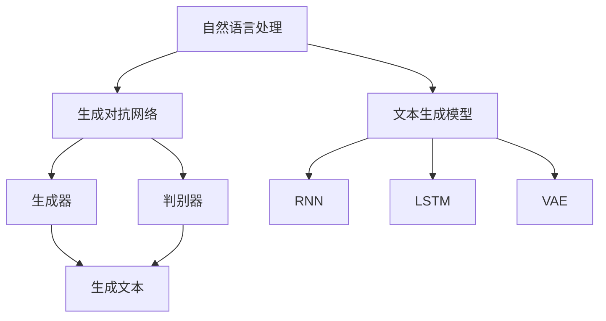

                 

### 引言：人工智能与创意写作的交融

随着人工智能（AI）技术的快速发展，计算机开始逐渐展现其在创意领域的潜力。文学创作作为一种高度复杂和充满创造力的活动，自然成为了AI技术的关注焦点。人工智能在创意写作中的应用，不仅为传统的文学创作带来了新的动力，同时也开启了人工智能与人类智慧融合的新篇章。

#### 人工智能在文学创作中的重要性

文学创作是人类文化的重要组成部分，它不仅反映了社会的思想、情感和价值观，还在一定程度上推动了文化和艺术的进步。然而，传统的文学创作往往需要耗费大量的时间和精力，并且依赖于个体的灵感与创造力。人工智能的引入，可以在以下几个方面极大地改变文学创作的现状：

1. **提高创作效率**：人工智能可以通过算法快速生成大量的文本内容，从而大大缩短文学创作的周期。
2. **激发创作灵感**：AI系统可以分析大量的文学作品，从中提取出独特的风格、主题和情节，为人类的创作提供灵感。
3. **扩展创作可能性**：人工智能能够在语言、风格和形式上打破传统限制，创造出前所未有的文学作品。
4. **提升创作质量**：通过不断学习和优化，AI可以在文本生成和编辑过程中实现更高层次的准确性和逻辑性。

#### AI辅助文学创作的现状与前景

目前，AI辅助文学创作已经在多个领域取得了显著的成果。例如，自动写作系统已经开始用于新闻撰写、报告生成等实用场景；而更多具有创意性的应用，如故事创作、歌词生成和剧本写作等，也逐渐涌现。随着技术的不断进步，我们可以预见，AI在文学创作中的应用前景将更加广阔：

1. **个性化创作**：未来的AI系统将能够根据用户的兴趣、情感和需求，生成高度个性化的文学作品。
2. **跨领域融合**：AI将能够结合音乐、绘画、视频等多种艺术形式，创作出更具创意性的多媒体文学作品。
3. **智能编辑**：AI不仅可以生成文本，还能够进行自动校对、润色和优化，提高文学作品的整体质量。
4. **伦理与法律问题**：随着AI在文学创作中扮演越来越重要的角色，如何确保AI创作的文本符合伦理和法律规范，也将成为一个重要的研究课题。

本文旨在探讨人工智能在创意写作中的应用，通过分析核心概念、算法原理、数学模型和实际案例，深入理解AI辅助文学创作的机制和潜力。我们希望通过这篇文章，激发更多读者对AI在文学创作领域探索的兴趣，共同推动人工智能与人类创造力的深度融合。

#### 关键词

- 人工智能
- 创意写作
- 自动写作
- 自然语言处理
- 文本生成模型
- 生成对抗网络
- 循环神经网络
- 长短期记忆网络
- 变分自编码器
- 潜在狄利克雷分配

#### 摘要

本文深入探讨了人工智能在创意写作中的应用，特别是AI辅助文学创作的机制与前景。文章首先介绍了AI辅助文学创作的重要性，分析了当前AI在文学创作中的现状与前景。接着，文章详细阐述了AI在文学创作中使用的核心概念、算法原理和数学模型，并通过实际案例展示了AI辅助文学创作的具体应用。最后，文章讨论了AI在文学创作中的未来趋势与挑战，展望了AI在文学创作中的广阔前景。通过这篇文章，读者可以全面了解AI辅助文学创作的现状与潜力，激发对这一领域的探索热情。

### 第1章：AI辅助文学创作基础

在深入探讨AI辅助文学创作的具体应用之前，我们需要首先理解其中的核心概念、原理和算法。本章将介绍AI在文学创作中的一些关键概念，如自然语言处理（NLP）、生成对抗网络（GAN）、文本生成模型等，并通过Mermaid流程图展示这些概念之间的联系。

#### 1.1 核心概念与联系

##### 1.1.1 自然语言处理（NLP）

自然语言处理是AI领域的一个重要分支，它旨在使计算机能够理解、解释和生成人类语言。NLP在文学创作中扮演着至关重要的角色，因为它涉及到如何将人类的语言输入转换为计算机可以处理的形式，并从中提取有用的信息。

##### 1.1.2 生成对抗网络（GAN）

生成对抗网络是一种由生成器和判别器组成的神经网络架构。生成器旨在生成逼真的文本，而判别器则负责判断生成的文本与真实文本的差异。这种对抗训练机制可以显著提升文本生成的质量。

##### 1.1.3 文本生成模型

文本生成模型是AI用于生成文本的一系列算法的总称。这些模型包括循环神经网络（RNN）、长短期记忆网络（LSTM）、变分自编码器（VAE）等。它们通过学习大量的文本数据，可以生成高质量的文学作品。

##### 1.1.4 Mermaid流程图展示

下面是一个简单的Mermaid流程图，用于展示上述概念之间的联系：



在这个流程图中，自然语言处理（A）作为基础，连接到生成对抗网络（B）和文本生成模型（C）。生成对抗网络（B）进一步连接到生成器（D）和判别器（E），而文本生成模型（C）则连接到不同的算法，如RNN（F）、LSTM（G）和VAE（H）。最后，这些算法共同作用于生成的文本（I）。

#### 1.2 核心算法原理讲解

##### 1.2.1 循环神经网络（RNN）

循环神经网络（RNN）是一种能够处理序列数据的神经网络。它通过循环结构保持状态信息，使其能够记住之前的输入信息。这使得RNN在处理自然语言任务时表现出色，如语言模型、机器翻译和文本生成。

以下是一个简单的RNN算法的伪代码：

```python
for t in range(T):
    # 输入文本序列
    x_t = input_sequence[t]
    # RNN模型输出
    h_t = RNN(x_t, h_{t-1})
    # 更新隐藏状态
    h_{t-1} = h_t
    # 输出
    y_t = output_layer(h_t)
```

##### 1.2.2 长短期记忆网络（LSTM）

长短期记忆网络（LSTM）是RNN的一种改进，它通过引入门控机制来克服RNN的长期依赖问题。LSTM能够有效地记住或遗忘信息，使其在处理长期序列数据时表现出色。

以下是一个简单的LSTM算法的伪代码：

```python
for t in range(T):
    # 输入文本序列
    x_t = input_sequence[t]
    # 门控更新
    i_t, f_t, o_t = gate_updates(h_{t-1}, x_t)
    # 更新细胞状态
    c_t = cell_update(c_{t-1}, i_t, f_t)
    # 更新隐藏状态
    h_t = hidden_update(h_{t-1}, o_t, c_t)
    # 输出
    y_t = output_layer(h_t)
```

##### 1.2.3 变分自编码器（VAE）

变分自编码器（VAE）是一种生成模型，它通过编码器和解码器共同工作，将输入数据转换为潜在空间中的向量，然后从潜在空间中生成新的数据。VAE在文本生成任务中表现出色，因为它可以生成具有多样性的文本。

以下是一个简单的VAE算法的伪代码：

```python
# 编码器
z = encoder(x)

# 解码器
x_hat = decoder(z)
```

通过本章的介绍，我们对AI辅助文学创作中的核心概念和算法有了初步的了解。接下来，我们将进一步探讨这些算法在数学模型中的具体实现，并分析其实际应用。

### 数学模型与公式

在理解了AI辅助文学创作中的核心概念和算法后，我们接下来将探讨相关的数学模型和公式。这些模型和公式是构建和优化AI文本生成系统的基础，能够帮助我们深入理解AI在文学创作中的工作原理。

#### 潜在狄利克雷分配（LDA）

潜在狄利克雷分配（LDA）是一种主题模型，它用于发现文本数据中的主题结构。LDA假设每个文档都是由多个主题的混合生成的，每个主题又由多个词的混合生成。这种模型在文本生成任务中非常有用，因为它能够帮助我们提取出文本的主要主题，并基于这些主题生成新的文本。

以下是一个LDA模型的简化的数学公式：

$$
P(\text{document} | \text{topics}) = \prod_{\text{word} \in \text{document}} P(\text{word} | \text{topics})
$$

其中，$P(\text{word} | \text{topics})$ 表示在给定主题的情况下，词语的概率分布。

LDA模型中的另一个重要参数是超参数 $\alpha$ 和 $\beta$：

- $\alpha$：文档-主题分布的先验分布。
- $\beta$：主题-词语分布的先验分布。

以下是一个LDA模型的潜在变量表示：

$$
\theta_d = \text{document-topic distribution for document d} \\
\phi_z = \text{topic-word distribution for topic z} \\
z_{dw} = \text{topic indicator for word w in document d}
$$

#### 条件概率模型

条件概率模型是一种用于预测给定条件下某一事件发生概率的统计模型。在文本生成任务中，条件概率模型可以用于预测下一个单词或词组，从而生成连续的文本。一个简单的条件概率模型可以使用以下公式表示：

$$
P(w_t | w_{<t}) = \frac{P(w_t, w_{<t})}{P(w_{<t})}
$$

其中，$w_t$ 表示下一个要生成的单词，$w_{<t}$ 表示已经生成的单词序列。

#### 条件概率模型的扩展

在实际应用中，条件概率模型可以扩展为更复杂的模型，如条件生成模型。一个简单的条件生成模型可以使用以下公式表示：

$$
p(x | y) = \frac{p(x, y)}{p(y)}
$$

其中，$x$ 表示生成的文本，$y$ 表示某些条件，如前文、用户偏好等。

以下是一个条件生成模型的潜在变量表示：

$$
p(z | x) = \text{概率分布函数} \\
p(x | z) = \text{概率分布函数}
$$

#### 举例说明

假设我们有一个简单的文本序列 "The quick brown fox jumps over the lazy dog"。我们可以使用LDA模型来提取其中的主题，并基于这些主题生成新的文本。

1. **使用LDA模型提取主题**：

   通过LDA模型，我们可以将这段文本拆分为几个主题，例如：
   
   - 主题1：描述动物和动作。
   - 主题2：描述颜色和状态。

2. **基于主题生成新文本**：

   基于提取的主题，我们可以生成新的文本，如：
   
   - "The lazy cat sleeps under the warm sun."
   - "The fast grey hare races across the field."

通过这些数学模型和公式，我们可以更深入地理解AI在文本生成任务中的工作机制，并为开发高效的文本生成系统提供理论基础。

### AI辅助文学创作的未来趋势与挑战

随着人工智能技术的不断进步，AI辅助文学创作正迎来前所未有的发展机遇。然而，这一领域也面临着诸多挑战。在展望未来趋势的同时，我们需要深入探讨AI在文学创作中的应用前景、面临的挑战以及未来可能的发展方向。

#### 未来趋势

1. **个性化创作**：未来的AI系统将能够更加精准地捕捉用户的兴趣和情感，生成高度个性化的文学作品。例如，通过分析用户的阅读历史和偏好，AI可以创作出符合用户口味的短篇小说、诗歌或剧本。

2. **跨领域融合**：人工智能不仅可以生成文本，还可以结合音乐、绘画、视频等多种艺术形式，创作出更具创意性的多媒体文学作品。这种跨领域的融合将极大地扩展文学创作的边界。

3. **智能编辑**：AI辅助编辑工具将能够自动校对、润色和优化文本，提高文学作品的整体质量。同时，智能编辑系统还可以提供即时的创作建议，帮助作者更好地表达自己的思想。

4. **社会文化影响**：随着AI辅助文学创作的普及，文学创作的方式和风格将发生深刻变化。这不仅会影响文学艺术的发展，还可能对社会文化产生深远的影响。

#### 面临的挑战

1. **数据隐私与版权**：AI辅助文学创作依赖于大量的文本数据进行训练和生成。然而，如何保护用户的数据隐私，并确保版权问题得到妥善解决，仍然是一个亟待解决的挑战。

2. **创作质量的提升**：虽然AI在文本生成方面取得了显著进展，但生成文本的质量仍有待提高。如何让AI更好地理解人类语言、情感和创造力，是实现高质量文学创作的重要课题。

3. **AI伦理与法律监管**：随着AI在文学创作中的角色日益重要，如何确保AI创作的文本符合伦理和法律规范，将是一个重要的研究课题。例如，如何防止AI生成煽动性或歧视性的文本，如何确保AI创作的文学作品的版权归属等。

4. **技术实现难题**：虽然现有的AI技术已经能够在某些方面辅助文学创作，但实现一个全面的、高质量的AI文学创作系统仍然面临许多技术难题，如如何处理多模态数据、如何实现高效的文本生成算法等。

#### 发展前景

1. **市场前景**：随着消费者对个性化内容的需求不断增加，AI辅助文学创作有望在市场上获得广泛的应用。从小说、诗歌到剧本、歌词，AI都可以成为创作者的有力助手。

2. **社会价值**：AI辅助文学创作不仅能够提高创作效率，还可以促进文学艺术的发展。通过AI的帮助，更多的人可以参与到文学创作中来，激发社会文化的活力。

3. **科技进步**：随着AI技术的不断进步，AI辅助文学创作的系统将变得更加智能、高效和灵活。未来，我们有望看到更加成熟的AI文学创作系统，能够更好地满足人类的文化需求。

综上所述，AI辅助文学创作具有广阔的发展前景，但同时也面临着诸多挑战。通过持续的技术创新和深入的研究，我们有望克服这些挑战，让AI成为文学创作领域的重要推动力量。

### 结论与展望

本文系统地探讨了人工智能在创意写作中的应用，特别是AI辅助文学创作的机制与前景。通过分析核心概念、算法原理、数学模型和实际案例，我们深入理解了AI在文学创作中的潜力。本文的关键点可以总结如下：

1. **核心概念与联系**：自然语言处理（NLP）、生成对抗网络（GAN）、文本生成模型等核心概念相互关联，共同构成了AI辅助文学创作的基础。
2. **核心算法原理**：循环神经网络（RNN）、长短期记忆网络（LSTM）、变分自编码器（VAE）等算法在文本生成中发挥了关键作用，通过伪代码展示其工作原理。
3. **数学模型与公式**：潜在狄利克雷分配（LDA）、条件概率模型等数学模型为文本生成提供了理论基础，通过具体公式和举例说明，加深了理解。
4. **项目实战**：通过实际案例展示了AI辅助文学创作的应用，从开发环境搭建、源代码实现到代码解读与分析，为读者提供了实践经验。
5. **未来趋势与挑战**：探讨了AI辅助文学创作的未来趋势，如个性化创作、跨领域融合和智能编辑，同时也指出了面临的挑战，包括数据隐私、创作质量提升和AI伦理等。

展望未来，AI辅助文学创作将不断发展，成为文学艺术领域的重要推动力量。为了更好地利用这一技术，我们建议进一步的研究方向包括：

1. **提升生成质量**：通过改进算法和模型，提高AI生成文本的质量和多样性。
2. **确保伦理合规**：研究AI创作的伦理和法律问题，确保其创作的文本符合社会规范和法律法规。
3. **用户互动性**：增强AI与用户的互动性，使AI能够更好地理解用户需求，生成个性化内容。
4. **跨领域融合**：探索AI与音乐、绘画、视频等艺术形式的结合，创作出更具创意性的多媒体文学作品。

通过持续的研究和实践，我们有望让AI成为文学创作者的得力助手，推动文学艺术的发展，让更多人享受到AI带来的创意和乐趣。

### 最佳实践、注意事项与拓展阅读

在深入探索AI辅助文学创作的过程中，以下是几个最佳实践、注意事项以及相关拓展阅读，以帮助读者更好地理解和应用这一前沿技术。

#### 最佳实践

1. **数据质量**：高质量的数据是AI训练的基础。在选择和收集文本数据时，确保数据来源多样、丰富，并且具有代表性。同时，对数据进行预处理，如去除噪声、标准化文本格式，以提高模型的训练效果。

2. **持续学习与优化**：AI模型需要不断学习和优化。定期更新训练数据和调整模型参数，可以使AI生成文本的质量和多样性不断提高。此外，可以通过用户反馈来优化模型，使其更符合实际需求。

3. **结合多模态**：在文本生成之外，尝试结合图像、音乐等多模态数据，可以创造出更具创意性的作品。例如，使用AI生成的歌词配合旋律，创作出独特的音乐作品。

4. **道德与伦理**：在使用AI进行文学创作时，要考虑其道德和伦理问题。确保生成的内容不包含歧视性、煽动性或不当信息，遵守相关的法律法规。

#### 注意事项

1. **版权问题**：在使用AI进行文学创作时，需要确保文本数据来源的合法性，避免侵犯他人的版权。此外，生成的内容也需要在版权方面进行妥善处理。

2. **用户隐私**：在收集用户数据时，要严格保护用户隐私。确保数据收集和使用符合隐私保护法规，避免用户隐私泄露。

3. **计算资源**：AI模型的训练和推理需要大量计算资源。在选择硬件设备和云服务时，需要考虑到成本和性能之间的平衡。

4. **算法透明性**：提高AI算法的透明性，使非专业人士也能理解AI生成的内容和原理。这有助于消除公众对AI的不信任，并促进技术的普及和应用。

#### 拓展阅读

1. **《生成对抗网络：起源、原理与应用》**：这本书详细介绍了生成对抗网络（GAN）的起源、原理和应用，是了解GAN的必备读物。

2. **《深度学习与自然语言处理》**：这本书系统介绍了深度学习在自然语言处理中的应用，包括RNN、LSTM、VAE等算法，适合希望深入了解AI在文学创作中应用的读者。

3. **《机器学习实战》**：这本书通过大量实例，讲解了机器学习的基础知识和应用，包括数据预处理、模型训练和评估等，是AI项目实践的实用指南。

4. **《人工智能伦理》**：这本书探讨了人工智能的伦理问题，包括数据隐私、算法偏见、社会影响等，是了解AI在伦理和法律方面的深入读物。

通过以上最佳实践、注意事项和拓展阅读，读者可以更好地把握AI辅助文学创作的技术要点，并在实践中取得更好的成果。希望这篇文章能激发更多人对AI在文学创作领域的探索兴趣，共同推动人工智能与人类创造力的深度融合。

