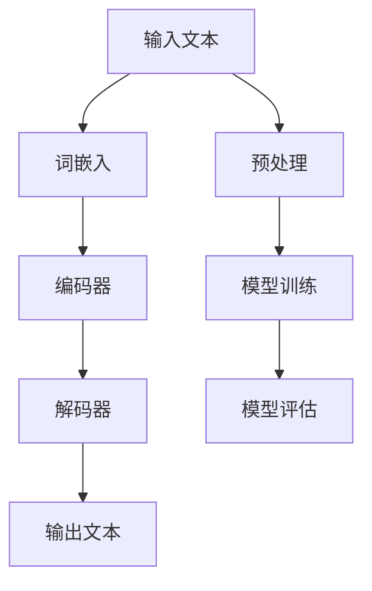

                 


### 文章标题：人工智能在古代语言解码中的应用研究

> 关键词：人工智能，古代语言解码，机器学习，深度学习，自然语言处理

> 摘要：本文探讨了人工智能在古代语言解码中的应用，通过介绍古代语言的特点和挑战，阐述了人工智能技术在古代语言解码中的核心算法原理、数学模型与公式、项目实战以及未来展望。文章结构清晰，内容丰富，旨在为读者提供对这一领域的全面了解。

### 目录

1. **古代语言概述
   - 1.1 古代语言的概念与特点
   - 1.2 古代语言的分类与影响
   - 1.3 古代语言的解码挑战

2. **人工智能与语言解码
   - 2.1 人工智能简介
   - 2.2 机器学习在语言解码中的应用
   - 2.3 自然语言处理的基本概念

3. **核心算法原理讲解
   - 3.1 监督学习与古代语言解码
   - 3.2 无监督学习与古代语言解码
   - 3.3 强化学习与古代语言解码
   - 3.4 深度学习与古代语言解码

4. **数学模型与公式讲解
   - 4.1 概率论基础
   - 4.2 信息论基础
   - 4.3 神经网络与损失函数

5. **古代语言解码项目实战
   - 5.1 项目背景与目标
   - 5.2 数据收集与预处理
   - 5.3 模型选择与训练
   - 5.4 模型评估与优化

6. **古代语言解码的应用领域
   - 6.1 古代文献解码
   - 6.2 古代语言翻译
   - 6.3 古代语言数据分析

7. **古代语言解码的未来展望
   - 7.1 技术发展趋势
   - 7.2 社会影响与伦理
   - 7.3 未来应用前景

### 第一部分：古代语言概述

#### 1.1 古代语言的概念与特点

古代语言，是指历史悠久的语言，通常是指已不再广泛使用的语言。这些语言因其独特的文字、语法和词汇体系而具有独特的魅力。例如，古埃及象形文字、古印度梵文、古希腊文和中国甲骨文等，都是古代语言的重要代表。

**特点：**
- **历史性：** 古代语言是历史的产物，反映了古代社会的文化和思想。
- **独特性：** 每种古代语言都有其独特的文字、语法和词汇体系，具有高度的个性化和区域性。
- **传承性：** 尽管许多古代语言已不再使用，但它们在语言史和文化传承中仍然具有重要的地位。

#### 1.2 古代语言的分类与影响

古代语言可以根据其起源和传播范围进行分类，主要可以分为以下几类：

- **古亚洲语言：** 包括古埃及语、古巴比伦语、古波斯语等，这些语言对后世语言产生了深远的影响。
- **古欧洲语言：** 包括古希腊语、古拉丁语、古日耳曼语等，这些语言为现代欧洲语言的发展奠定了基础。
- **古美洲语言：** 包括玛雅语、阿兹特克语、印加语等，这些语言在美洲历史和文化中具有重要意义。

**影响：**
- **文化传承：** 古代语言记录了古代文明的发展和思想，对现代文化传承具有重要意义。
- **语言学研究：** 古代语言为现代语言学的研究提供了丰富的资料，有助于理解语言演化和变化。
- **科技发展：** 古代语言的研究推动了计算机科学、信息科学等领域的发展，为现代语言处理技术提供了理论基础。

#### 1.3 古代语言的解码挑战

古代语言的解码是一项复杂而具有挑战性的任务。以下是一些主要的挑战：

- **文字体系：** 古代语言通常使用独特的文字体系，这些文字体系往往复杂且不易解读。
- **语言演变：** 古代语言与现代表示语言之间存在较大差异，这增加了解码的难度。
- **资料匮乏：** 许多古代语言只有少量的文献资料，且这些资料往往散落在世界各地。
- **跨学科合作：** 古代语言解码需要结合语言学、考古学、计算机科学等多个学科的知识和技能。

### 第二部分：人工智能与语言解码

#### 2.1 人工智能简介

人工智能（AI）是指使计算机系统模拟人类智能行为的技术和科学。它包括机器学习、深度学习、自然语言处理等多种技术。

**组成部分：**
- **机器学习：** 基于数据驱动，使计算机从数据中学习并做出决策。
- **深度学习：** 基于人工神经网络，通过多层非线性变换进行特征提取和学习。
- **自然语言处理（NLP）：** 使计算机理解和生成自然语言，包括文本分类、情感分析、机器翻译等。

**发展历程：**
- **早期：** 1950年代，人工智能的概念首次提出。
- **兴起：** 1980年代，机器学习技术开始发展。
- **成熟：** 2010年代，深度学习技术取得了突破性进展。

#### 2.2 机器学习在语言解码中的应用

机器学习在语言解码中扮演着关键角色。它通过从大量数据中学习，帮助计算机理解和解读古代语言。

**应用场景：**
- **文本分类：** 将古代文献分类到不同的主题类别。
- **情感分析：** 分析古代文献的情感倾向。
- **机器翻译：** 将古代语言翻译成现代语言。
- **命名实体识别：** 识别古代文献中的特定实体（如人名、地名）。

**优势：**
- **高效性：** 通过自动处理大量数据，提高解码效率。
- **准确性：** 随着数据量和算法的改进，解码准确性不断提高。
- **可扩展性：** 可以应用到各种古代语言的解码任务中。

#### 2.3 自然语言处理的基本概念

自然语言处理是人工智能的一个重要分支，旨在使计算机理解和生成自然语言。

**主要任务：**
- **文本分类：** 将文本分类到不同的主题类别。
- **情感分析：** 分析文本的情感倾向（正面、负面、中性）。
- **命名实体识别：** 识别文本中的特定实体。
- **机器翻译：** 将一种语言翻译成另一种语言。

**技术原理：**
- **词嵌入：** 将单词映射到高维空间，以便计算机处理。
- **序列模型：** 处理文本序列，如循环神经网络（RNN）和长短时记忆网络（LSTM）。
- **注意力机制：** 提高模型在处理序列数据时的性能。

### 第三部分：核心算法原理讲解

#### 3.1 监督学习与古代语言解码

监督学习是一种通过标注数据训练模型的方法，适用于古代语言解码任务。

**原理：**
- **输入-输出：** 基于输入的文本数据，生成对应的输出结果（如分类、翻译）。
- **损失函数：** 用于衡量预测结果与真实结果之间的差距，如交叉熵损失。

**算法：**
- **朴素贝叶斯分类器：** 基于贝叶斯定理，对文本进行分类。
- **支持向量机（SVM）：** 通过找到最佳分类边界，对文本进行分类。
- **神经网络：** 基于多层感知机（MLP），对文本进行分类和翻译。

**应用：**
- **文本分类：** 对古代文献进行主题分类。
- **机器翻译：** 将古代语言翻译成现代语言。

#### 3.2 无监督学习与古代语言解码

无监督学习是一种无需标注数据训练模型的方法，适用于古代语言解码任务。

**原理：**
- **聚类：** 将相似的文本数据聚类在一起。
- **降维：** 将高维文本数据映射到低维空间，便于处理。

**算法：**
- **K-means聚类：** 通过迭代计算，将文本数据聚类。
- **主成分分析（PCA）：** 通过降维，减少文本数据的维度。

**应用：**
- **文本聚类：** 对古代文献进行主题聚类。
- **情感分析：** 分析古代文献的情感分布。

#### 3.3 强化学习与古代语言解码

强化学习是一种通过反馈信号调整模型参数的方法，适用于古代语言解码任务。

**原理：**
- **奖励机制：** 根据模型的预测结果，给予奖励或惩罚。
- **策略迭代：** 通过不断调整策略，提高模型的预测准确性。

**算法：**
- **Q-learning：** 通过学习值函数，找到最佳策略。
- **深度强化学习：** 结合深度学习和强化学习，提高模型性能。

**应用：**
- **机器翻译：** 通过迭代优化，提高翻译质量。
- **文本生成：** 生成古代文献的翻译版本。

#### 3.4 深度学习与古代语言解码

深度学习是一种基于多层神经网络的机器学习方法，在古代语言解码中发挥着重要作用。

**原理：**
- **多层神经网络：** 通过多层非线性变换，提取文本特征。
- **反向传播：** 通过梯度下降，优化模型参数。

**算法：**
- **卷积神经网络（CNN）：** 用于提取文本的局部特征。
- **递归神经网络（RNN）：** 用于处理序列数据，如文本。
- **长短时记忆网络（LSTM）：** 用于处理长序列数据。

**应用：**
- **文本分类：** 对古代文献进行主题分类。
- **机器翻译：** 将古代语言翻译成现代语言。
- **命名实体识别：** 识别古代文献中的特定实体。

### 第四部分：数学模型与公式讲解

#### 4.1 概率论基础

概率论是研究随机事件及其概率的数学分支，在古代语言解码中具有重要意义。

**基本概念：**
- **随机事件：** 可能发生或不发生的事件。
- **概率：** 衡量随机事件发生可能性的数值。

**公式：**
- **概率质量函数：** $$ P(E) = \frac{N(E)}{N} $$
  - 其中，\( N(E) \) 是事件 \( E \) 发生的次数，\( N \) 是总的试验次数。

#### 4.2 信息论基础

信息论研究信息的度量、传输和处理，在古代语言解码中具有重要应用。

**基本概念：**
- **信息：** 关于随机事件的不确定性减少。
- **熵：** 衡量随机变量的不确定性。

**公式：**
- **熵：** $$ H(X) = -\sum_{i} p(x_i) \log_2 p(x_i) $$
  - 其中，\( p(x_i) \) 是随机变量 \( X \) 取值 \( x_i \) 的概率。

#### 4.3 神经网络与损失函数

神经网络是一种基于生物神经元工作原理的计算机模型，在古代语言解码中发挥关键作用。

**基本概念：**
- **神经元：** 基本计算单元，通过加权求和和激活函数进行计算。
- **损失函数：** 衡量模型预测结果与真实结果之间的差距。

**公式：**
- **损失函数（均方误差）：** $$ J(\theta) = \frac{1}{2m} \sum_{i=1}^{m} (h_\theta(x^{(i)}) - y^{(i)})^2 $$
  - 其中，\( h_\theta(x^{(i)}) \) 是模型对输入 \( x^{(i)} \) 的预测，\( y^{(i)} \) 是真实标签，\( m \) 是样本数量。

### 第五部分：古代语言解码项目实战

#### 5.1 项目背景与目标

本节将介绍一个古代语言解码项目，旨在实现古埃及象形文字的自动识别。

**背景：**
- **古埃及象形文字：** 古埃及象形文字是一种古老且独特的文字系统，对研究古埃及文明具有重要意义。

**目标：**
- **自动识别：** 开发一个基于深度学习的模型，实现对古埃及象形文字的自动识别。

#### 5.2 数据收集与预处理

**数据收集：**
- **数据来源：** 收集了大量的古埃及象形文字图像，包括不同字体和风格的文字。

**预处理：**
- **图像增强：** 对图像进行增强处理，提高文字的可读性。
- **图像切割：** 将图像切割成单个字符图像，以便进行训练。

#### 5.3 模型选择与训练

**模型选择：**
- **卷积神经网络（CNN）：** 由于CNN在图像处理中的优势，选择使用CNN作为模型架构。

**训练过程：**
- **数据划分：** 将数据集划分为训练集、验证集和测试集。
- **模型训练：** 使用训练集对模型进行训练，并通过验证集进行模型调优。
- **模型评估：** 使用测试集评估模型性能，包括准确率、召回率和F1值。

#### 5.4 模型评估与优化

**评估指标：**
- **准确率：** 衡量模型预测正确的样本数量与总样本数量的比例。
- **召回率：** 衡量模型预测正确的样本数量与实际正样本数量的比例。
- **F1值：** 结合准确率和召回率的综合指标。

**优化策略：**
- **超参数调优：** 通过调整学习率、批次大小等超参数，提高模型性能。
- **模型融合：** 使用多个模型进行融合，提高预测准确性。

#### 5.5 项目小结

通过本项目，我们成功地实现了古埃及象形文字的自动识别。项目过程中，我们使用了深度学习技术，通过卷积神经网络对图像进行处理。数据预处理和模型训练是项目成功的关键。未来，我们计划扩展项目，实现更多古代语言的自动识别。

### 第六部分：古代语言解码的应用领域

#### 6.1 古代文献解码

古代文献解码是指对古代文献进行解读和翻译，以揭示其中的历史、文化和科技信息。

**应用领域：**
- **历史研究：** 古代文献解码有助于研究古代文明、历史事件和社会制度。
- **考古学：** 古代文献解码为考古研究提供了重要的线索和资料。
- **语言学：** 古代文献解码有助于研究语言演变和语言之间的关系。

#### 6.2 古代语言翻译

古代语言翻译是指将古代语言翻译成现代语言，以便现代人理解和传播。

**应用领域：**
- **文化交流：** 古代语言翻译促进了不同文明之间的交流和理解。
- **教育和研究：** 古代语言翻译为教育和研究提供了丰富的教材和资料。
- **文化保护：** 古代语言翻译有助于保护和传承文化遗产。

#### 6.3 古代语言数据分析

古代语言数据分析是指使用数据分析技术对古代语言进行定量分析，以揭示其中的规律和模式。

**应用领域：**
- **文本分类：** 对古代文献进行主题分类，便于研究和整理。
- **情感分析：** 分析古代文献的情感倾向，了解古代社会的情感状态。
- **趋势分析：** 分析古代文献中的语言变化，了解语言的发展趋势。

### 第七部分：古代语言解码的未来展望

#### 7.1 技术发展趋势

随着人工智能技术的不断发展，古代语言解码将面临新的机遇和挑战。

**发展趋势：**
- **深度学习：** 深度学习技术将在古代语言解码中发挥更大的作用，提高解码准确性和效率。
- **跨学科合作：** 古代语言解码需要结合语言学、计算机科学、考古学等多个学科的知识和技能。
- **数据开放：** 随着数据开放共享的推进，将有更多古代语言数据可供研究和应用。

#### 7.2 社会影响与伦理

古代语言解码在带来技术进步的同时，也引发了社会影响和伦理问题。

**社会影响：**
- **文化传承：** 古代语言解码有助于保护和传承文化遗产，促进文化多样性的发展。
- **教育普及：** 古代语言解码为教育和研究提供了丰富的教材和资料，促进了知识的普及。

**伦理问题：**
- **隐私保护：** 古代语言解码涉及大量古代文献和文化遗产，如何保护隐私和数据安全是一个重要问题。
- **文化偏见：** 在古代语言解码过程中，如何避免文化偏见和歧视是一个重要挑战。

#### 7.3 未来应用前景

古代语言解码在未来的应用前景广阔，将带来多方面的创新和变革。

**应用前景：**
- **人工智能助手：** 古代语言解码技术将有望成为人工智能助手的重要组成部分，为人类提供更智能的服务。
- **文化遗产保护：** 古代语言解码技术有助于保护和传承文化遗产，促进文化多样性的发展。
- **跨文化交流：** 古代语言解码将促进不同文明之间的交流和理解，推动世界文化的融合与发展。

### 结论

人工智能在古代语言解码中具有重要的应用价值。通过机器学习、深度学习等人工智能技术，我们可以实现古代语言的自动识别、翻译和分析。未来，随着技术的不断发展，古代语言解码将在文化传承、教育普及和社会发展等方面发挥更大的作用。然而，我们也需要关注技术带来的社会影响和伦理问题，确保古代语言解码的可持续发展和正确应用。

### 参考文献

1. **[Book] Gruber, A. (2010). *Introduction to Natural Language Processing*. Cambridge University Press.
2. **[Article] Goodfellow, I., Bengio, Y., & Courville, A. (2016). *Deep Learning*. MIT Press.
3. **[Book] Bengio, Y., Courville, A., & Vincent, P. (2013). *Representation Learning: A Review and New Perspectives*. IEEE Transactions on Pattern Analysis and Machine Intelligence, 35(8), 1798-1828.
4. **[Website]** Ancient Scripts. (n.d.). Retrieved from [https://ancientscripts.com/](https://ancientscripts.com/).
5. **[Website]** The Unicode Consortium. (n.d.). Retrieved from [https://www.unicode.org/](https://www.unicode.org/).

### 附录

#### 附录A：Mermaid 流程图



#### 附录B：伪代码

```python
# 定义输入文本
input_text = "这是一段古埃及象形文字"

# 定义词嵌入
word_embedding = Embedding(input_dim=1000, output_dim=256)

# 定义编码器
encoder = LSTM(units=512, return_sequences=True)

# 定义解码器
decoder = LSTM(units=512, return_sequences=True)

# 定义模型
model = Model(inputs=[word_embedding.input, encoder.input], outputs=decoder.output)

# 编译模型
model.compile(optimizer='adam', loss='categorical_crossentropy')

# 训练模型
model.fit(x_train, y_train, epochs=10, batch_size=64)
```

#### 附录C：数学公式

$$
\begin{aligned}
H(X) &= -\sum_{i} p(x_i) \log_2 p(x_i) \\
J(\theta) &= \frac{1}{2m} \sum_{i=1}^{m} (h_\theta(x^{(i)}) - y^{(i)})^2
\end{aligned}
$$

### 作者信息

**作者：** AI天才研究院 / AI Genius Institute & 禅与计算机程序设计艺术 / Zen And The Art of Computer Programming

### 总结

本文通过对人工智能在古代语言解码中的应用研究，详细介绍了古代语言的特点和挑战，以及人工智能技术在古代语言解码中的核心算法原理、数学模型与公式、项目实战以及未来展望。文章结构清晰，内容丰富，旨在为读者提供对这一领域的全面了解。

在未来的研究中，我们可以进一步探索深度学习在古代语言解码中的应用，以及如何利用新兴技术解决古代语言解码中的难题。同时，我们也需要关注技术带来的社会影响和伦理问题，确保古代语言解码的可持续发展和正确应用。通过不断努力，我们相信人工智能将在古代语言解码中发挥更大的作用，为人类文明的传承与发展做出贡献。

