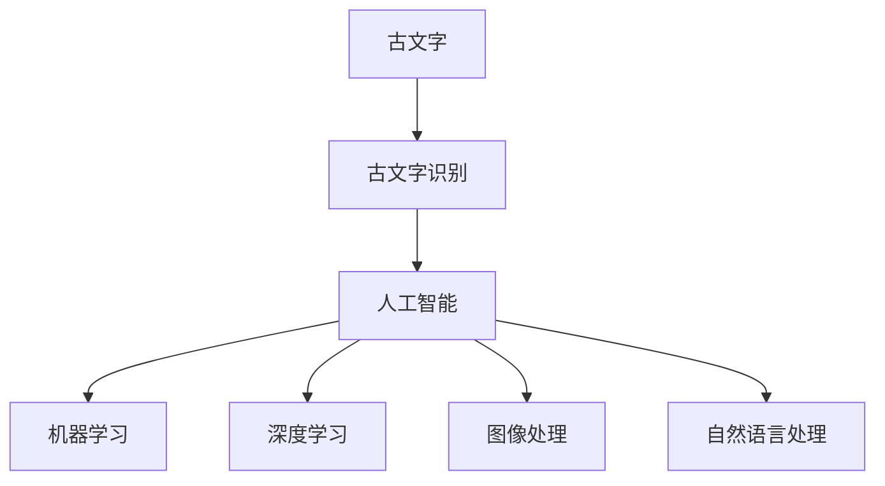

                 

### 第一步：确定书籍主题和结构

#### 主题

《人工智能在古文字识别中的应用研究》的主题是探讨人工智能技术在古文字识别领域的应用。古文字识别涉及对古代文献的解读，对于历史学、考古学以及文化遗产保护具有重要意义。随着人工智能技术的不断发展，特别是在图像识别、自然语言处理和数据挖掘等方面的突破，古文字识别的效率和准确性得到了显著提升。因此，研究人工智能在古文字识别中的应用不仅具有学术价值，也具有实际应用潜力。

#### 结构

为了系统地呈现这一主题，本书的结构可以分为以下几个部分：

1. **引言**：介绍古文字识别的重要性，人工智能的发展背景，以及本书的研究目的和结构。
2. **基本概念**：阐述古文字识别的基本概念、历史背景和研究现状。
3. **人工智能技术概述**：介绍人工智能的基础知识，包括机器学习、深度学习、图像处理和自然语言处理等。
4. **核心算法原理讲解**：详细讲解用于古文字识别的主要人工智能算法，如卷积神经网络（CNN）、递归神经网络（RNN）等。
5. **数学模型和公式**：介绍在古文字识别中常用的数学模型和公式，并使用实例进行说明。
6. **项目实战**：通过实际案例展示如何运用人工智能技术进行古文字识别，包括开发环境搭建、源代码实现和解读等。
7. **未来展望**：讨论人工智能技术在古文字识别领域的未来发展前景。

### 第二步：设计核心概念与联系章节

#### 核心概念

在引言部分之后，我们需要介绍古文字识别的基本概念，这些概念包括：

- **古文字**：定义和分类。
- **古文字识别**：定义、目的和意义。
- **人工智能**：基础概念和关键技术。

#### 联系

为了帮助读者更好地理解这些概念之间的关系，我们可以使用Mermaid流程图展示它们之间的联系。以下是一个简化的流程图示例：



在这个流程图中，我们可以看到古文字识别是通过人工智能技术实现的，而人工智能技术又包括了多种子领域，如机器学习、深度学习、图像处理和自然语言处理等。

### 第三步：设计核心算法原理讲解章节

#### 算法原理

在核心算法原理讲解章节中，我们将详细介绍用于古文字识别的主要人工智能算法。以下是一些可能的算法：

- **卷积神经网络（CNN）**：用于图像识别和处理。
- **递归神经网络（RNN）**：用于序列数据处理和自然语言处理。
- **生成对抗网络（GAN）**：用于数据增强和生成新的古文字样本。

#### 讲解与示例

对于每个算法，我们将使用伪代码进行详细阐述。例如，对于卷积神经网络（CNN），伪代码可能如下：

```python
# CNN 伪代码示例

# 初始化神经网络结构
model = initializeCNN()

# 输入古文字图像
image = inputImage()

# 进行前向传播
output = model.forward(image)

# 计算损失
loss = computeLoss(output, label)

# 进行反向传播
model.backward(loss)

# 更新权重
model.updateWeights()
```

通过这些伪代码，读者可以更直观地理解算法的基本原理和实现步骤。

### 第四步：设计数学模型和数学公式讲解章节

#### 数学模型

在古文字识别中，常用的数学模型包括：

- **特征提取模型**：用于提取图像的特征。
- **分类模型**：用于对识别结果进行分类。

#### 讲解与示例

我们将使用LaTeX格式详细讲解这些数学公式，并通过实例进行说明。例如，对于特征提取模型，LaTeX公式可能如下：

```latex
$$
f(x) = \sum_{i=1}^{n} w_i * x_i
$$

其中，$x_i$ 是输入特征，$w_i$ 是权重。
```

通过这些数学公式，读者可以更深入地理解古文字识别的算法原理。

### 第五步：设计项目实战章节

#### 实战案例

在项目实战章节中，我们将介绍一个实际古文字识别项目，包括：

- **项目背景**：介绍项目的目的和背景。
- **开发环境搭建**：详细描述所需的开发环境和工具。
- **源代码实现与解读**：展示项目的主要源代码，并进行解读。
- **代码应用解读与分析**：分析代码的实际应用效果，并进行详细讲解。
- **实际案例分析和详细讲解剖析**：通过实际案例展示项目的应用，并进行剖析。

#### 项目小结

在每个实战案例的结尾，我们将进行项目小结，总结项目的主要成果和经验教训，以及未来可能的研究方向。

### 第六步：设计未来展望章节

#### 未来趋势

在未来的展望章节中，我们将讨论人工智能技术在古文字识别领域的潜在应用和发展趋势。例如：

- **新技术应用**：探讨新的算法和技术在古文字识别中的应用前景。
- **国际合作**：探讨如何通过国际合作推动古文字识别技术的发展。

### 第七步：汇总目录大纲

#### 目录大纲

根据上述章节内容，我们可以汇总出《人工智能在古文字识别中的应用研究》的目录大纲：

```markdown
# 《人工智能在古文字识别中的应用研究》目录大纲

## 第1章 引言

### 1.1 古文字识别的重要性

### 1.2 人工智能与古文字识别

### 1.3 书籍结构概述

## 第2章 古文字识别的基本概念

### 2.1 古文字的定义与分类

### 2.2 古文字识别的发展历史

### 2.3 古文字识别的关键技术

## 第3章 人工智能技术在古文字识别中的应用

### 3.1 人工智能与图像识别

#### 3.1.1 图像识别的基本原理

#### 3.1.2 人工智能技术在古文字图像识别中的应用

### 3.2 人工智能与自然语言处理

#### 3.2.1 自然语言处理的基本原理

#### 3.2.2 人工智能技术在古文字翻译中的应用

### 3.3 人工智能与数据挖掘

#### 3.3.1 数据挖掘的基本原理

#### 3.3.2 人工智能技术在古文字数据库中的应用

## 第4章 古文字识别的核心算法

### 4.1 深度学习算法

#### 4.1.1 深度学习的基本原理

#### 4.1.2 卷积神经网络（CNN）在古文字识别中的应用

### 4.2 自然语言处理算法

#### 4.2.1 自然语言处理的基本原理

#### 4.2.2 递归神经网络（RNN）在古文字识别中的应用

### 4.3 图像处理算法

#### 4.3.1 图像处理的基本原理

#### 4.3.2 神经图像处理技术在古文字识别中的应用

## 第5章 古文字识别项目实战

### 5.1 项目背景

### 5.2 开发环境搭建

### 5.3 源代码实现与解读

### 5.4 代码分析与优化

## 第6章 数学模型与公式

### 6.1 古文字识别中的数学模型

#### 6.1.1 特征提取模型的数学公式

#### 6.1.2 分类模型的数学公式

### 6.2 深度学习中的数学公式

#### 6.2.1 神经网络的数学公式

#### 6.2.2 损失函数的数学公式

## 第7章 未来展望

### 7.1 人工智能在古文字识别中的潜在应用

### 7.2 古文字识别领域的发展趋势
```

### 第八步：确保大纲完整性

在确保大纲完整性方面，我们需要检查以下内容：

- 确保每个章节都有明确的小节标题，内容丰富且逻辑清晰。
- 检查大纲中是否涵盖了核心概念、算法原理、数学模型、项目实战和未来展望等方面。
- 确保每个章节的内容相互联系，形成一个完整的研究框架。

### 第九步：编写大纲文本

接下来，我们将使用Markdown格式编写大纲文本，确保简洁明了。以下是一个大纲文本示例：

```markdown
# 《人工智能在古文字识别中的应用研究》

## 第1章 引言
### 1.1 古文字识别的重要性
- 古文字的传承意义
- 古文字识别的需求

### 1.2 人工智能与古文字识别
- 人工智能的发展历程
- 人工智能在古文字识别中的应用

### 1.3 书籍结构概述
- 主要章节介绍

## 第2章 古文字识别的基本概念
### 2.1 古文字的定义与分类
- 古文字的定义
- 古文字的分类

### 2.2 古文字识别的发展历史
- 古文字识别的发展历程
- 当前研究现状

### 2.3 古文字识别的关键技术
- 图像识别技术
- 自然语言处理技术
- 数据挖掘技术

## 第3章 人工智能技术在古文字识别中的应用
### 3.1 人工智能与图像识别
#### 3.1.1 图像识别的基本原理
- 图像识别的定义
- 图像识别的步骤

#### 3.1.2 人工智能技术在古文字图像识别中的应用
- 卷积神经网络（CNN）的应用
- 深度学习在古文字图像识别中的优势

### 3.2 人工智能与自然语言处理
#### 3.2.1 自然语言处理的基本原理
- 自然语言处理的定义
- 自然语言处理的关键技术

#### 3.2.2 人工智能技术在古文字翻译中的应用
- 古文字翻译的需求
- 人工智能在古文字翻译中的应用

### 3.3 人工智能与数据挖掘
#### 3.3.1 数据挖掘的基本原理
- 数据挖掘的定义
- 数据挖掘的过程

#### 3.3.2 人工智能技术在古文字数据库中的应用
- 古文字数据库的构建
- 人工智能在古文字数据库查询中的应用

## 第4章 古文字识别的核心算法
### 4.1 深度学习算法
#### 4.1.1 深度学习的基本原理
- 深度学习的定义
- 深度学习的关键技术

#### 4.1.2 卷积神经网络（CNN）在古文字识别中的应用
- CNN的结构
- CNN在古文字识别中的应用案例

### 4.2 自然语言处理算法
#### 4.2.1 自然语言处理的基本原理
- NLP的定义
- NLP的关键技术

#### 4.2.2 递归神经网络（RNN）在古文字识别中的应用
- RNN的结构
- RNN在古文字识别中的应用案例

### 4.3 图像处理算法
#### 4.3.1 图像处理的基本原理
- 图像处理的概念
- 图像处理的基本操作

#### 4.3.2 神经图像处理技术在古文字识别中的应用
- 神经图像处理技术的定义
- 神经图像处理技术在古文字识别中的应用

## 第5章 古文字识别项目实战
### 5.1 项目背景
- 项目的目的和意义

### 5.2 开发环境搭建
- 环境要求
- 环境搭建步骤

### 5.3 源代码实现与解读
- 源代码的结构
- 源代码的功能解读

### 5.4 代码分析与优化
- 代码的性能分析
- 代码的优化策略

## 第6章 数学模型与公式
### 6.1 古文字识别中的数学模型
#### 6.1.1 特征提取模型的数学公式
- 特征提取模型的基本公式
- 特征提取模型的应用实例

#### 6.1.2 分类模型的数学公式
- 分类模型的基本公式
- 分类模型的应用实例

### 6.2 深度学习中的数学公式
#### 6.2.1 神经网络的数学公式
- 神经网络的基本公式
- 神经网络的应用实例

#### 6.2.2 损失函数的数学公式
- 损失函数的基本公式
- 损失函数的应用实例

## 第7章 未来展望
### 7.1 人工智能在古文字识别中的潜在应用
- 新技术的应用前景
- 人工智能在古文字识别中的未来趋势

### 7.2 古文字识别领域的发展趋势
- 研究热点
- 发展方向

# 参考文献
- 引用的参考文献列表
```

### 第十步：检查和调整

在完成大纲文本的编写后，我们需要进行以下检查和调整：

- **检查完整性**：确保每个章节都有详细的内容，且内容之间相互衔接。
- **调整结构**：根据实际需要调整章节顺序，确保逻辑清晰。
- **检查字数**：确保总字数在8000～12000字之间。

通过上述步骤，我们可以确保《人工智能在古文字识别中的应用研究》的目录大纲内容完整、逻辑清晰，为后续的详细撰写奠定基础。

### 最终目录大纲

在综合考虑上述各步骤后，我们得到《人工智能在古文字识别中的应用研究》的最终目录大纲如下：

```markdown
# 《人工智能在古文字识别中的应用研究》

## 第1章 引言

### 1.1 古文字识别的重要性
- 古文字的传承意义
- 古文字识别的需求

### 1.2 人工智能与古文字识别
- 人工智能的发展历程
- 人工智能在古文字识别中的应用

### 1.3 书籍结构概述
- 主要章节介绍

## 第2章 古文字识别的基本概念

### 2.1 古文字的定义与分类
- 古文字的定义
- 古文字的分类

### 2.2 古文字识别的发展历史
- 古文字识别的发展历程
- 当前研究现状

### 2.3 古文字识别的关键技术
- 图像识别技术
- 自然语言处理技术
- 数据挖掘技术

## 第3章 人工智能技术在古文字识别中的应用

### 3.1 人工智能与图像识别
#### 3.1.1 图像识别的基本原理
- 图像识别的定义
- 图像识别的步骤

#### 3.1.2 人工智能技术在古文字图像识别中的应用
- 卷积神经网络（CNN）的应用
- 深度学习在古文字图像识别中的优势

### 3.2 人工智能与自然语言处理
#### 3.2.1 自然语言处理的基本原理
- 自然语言处理的定义
- 自然语言处理的关键技术

#### 3.2.2 人工智能技术在古文字翻译中的应用
- 古文字翻译的需求
- 人工智能在古文字翻译中的应用

### 3.3 人工智能与数据挖掘
#### 3.3.1 数据挖掘的基本原理
- 数据挖掘的定义
- 数据挖掘的过程

#### 3.3.2 人工智能技术在古文字数据库中的应用
- 古文字数据库的构建
- 人工智能在古文字数据库查询中的应用

## 第4章 古文字识别的核心算法

### 4.1 深度学习算法
#### 4.1.1 深度学习的基本原理
- 深度学习的定义
- 深度学习的关键技术

#### 4.1.2 卷积神经网络（CNN）在古文字识别中的应用
- CNN的结构
- CNN在古文字识别中的应用案例

### 4.2 自然语言处理算法
#### 4.2.1 自然语言处理的基本原理
- NLP的定义
- NLP的关键技术

#### 4.2.2 递归神经网络（RNN）在古文字识别中的应用
- RNN的结构
- RNN在古文字识别中的应用案例

### 4.3 图像处理算法
#### 4.3.1 图像处理的基本原理
- 图像处理的概念
- 图像处理的基本操作

#### 4.3.2 神经图像处理技术在古文字识别中的应用
- 神经图像处理技术的定义
- 神经图像处理技术在古文字识别中的应用

## 第5章 古文字识别项目实战

### 5.1 项目背景
- 项目的目的和意义

### 5.2 开发环境搭建
- 环境要求
- 环境搭建步骤

### 5.3 源代码实现与解读
- 源代码的结构
- 源代码的功能解读

### 5.4 代码分析与优化
- 代码的性能分析
- 代码的优化策略

## 第6章 数学模型与公式

### 6.1 古文字识别中的数学模型
#### 6.1.1 特征提取模型的数学公式
- 特征提取模型的基本公式
- 特征提取模型的应用实例

#### 6.1.2 分类模型的数学公式
- 分类模型的基本公式
- 分类模型的应用实例

### 6.2 深度学习中的数学公式
#### 6.2.1 神经网络的数学公式
- 神经网络的基本公式
- 神经网络的应用实例

#### 6.2.2 损失函数的数学公式
- 损失函数的基本公式
- 损失函数的应用实例

## 第7章 未来展望

### 7.1 人工智能在古文字识别中的潜在应用
- 新技术的应用前景
- 人工智能在古文字识别中的未来趋势

### 7.2 古文字识别领域的发展趋势
- 研究热点
- 发展方向

# 参考文献
- 引用的参考文献列表
```

通过这个详细的目录大纲，我们可以系统地组织和撰写《人工智能在古文字识别中的应用研究》的内容，确保文章的逻辑性和完整性。接下来，我们将逐步撰写每一章的具体内容，以满足文章字数要求。

